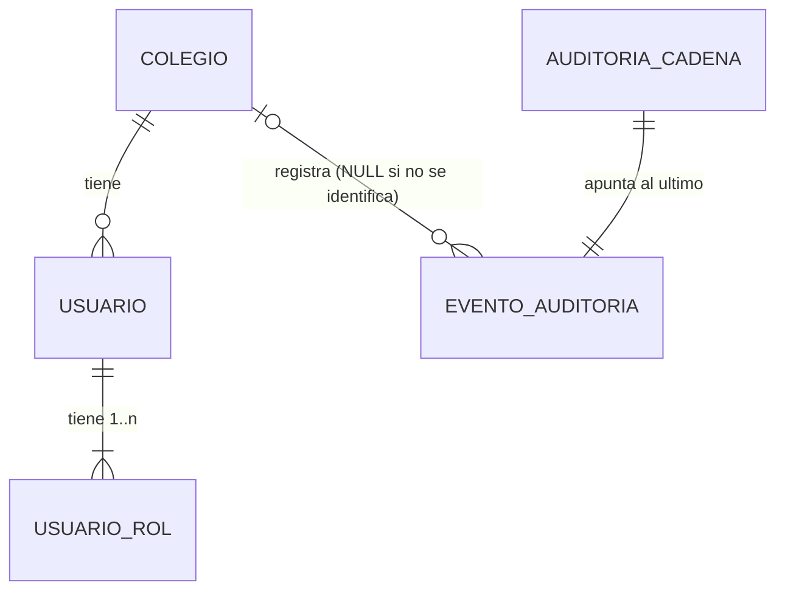

# Sprint 1 · Fundaciones: diseño de arquitectura

> Diseño elaborado por el agente `arquitecto-software` el 2 de octubre de 2026. Las APIs fueron verificadas con `javap` sobre los jars de Spring Boot 4.1.1, Spring Security 7.1.1 e Hibernate 7.4.5, y los puntos delicados se probaron sobre H2 en modo MySQL.
> Paquete base: `pe.edu.virgenmaria.cuentasclaras`.

## 1. Resumen
- **Multi-colegio:** `@TenantId` de Hibernate. Un resolutor lee el colegio del usuario autenticado. Si no hay colegio, no se ve ni se inserta nada (falla cerrado).
- **Seguridad:** Spring Security 7 con formulario propio y BCrypt. La enum `ModuloApp` es la única matriz de permisos: genera a la vez las reglas de URL y el menú. Toda ruta fuera de la matriz se niega (`denyAll`).
- **Auditoría:** tabla de solo inserción, protegida en tres capas:
  - en la aplicación: `@Immutable`, `@PreRemove`/`@PreUpdate` que lanzan excepción y un repositorio sin métodos de borrado;
  - en MySQL: el usuario de la app no tiene UPDATE ni DELETE sobre la tabla;
  - una cadena HMAC-SHA256 con número de secuencia, que detecta cambios hechos directamente en la base.
- **Usuarios:** nunca se borran, solo se desactivan. Hay combinaciones de roles prohibidas y una jerarquía para crear y modificar usuarios.

## 2. Hallazgos verificados (leer antes de implementar)
- **`@TenantId` (Hibernate 7.4.5):**
  - Filtra `findById`, `existsById`, `count`, consultas derivadas y JPQL. `deleteById` sobre otro colegio no hace nada.
  - Hacer `merge` de una entidad de otro colegio falla.
  - Con colegio `0` no se ve nada y el INSERT falla por la FK. Si el resolutor devuelve `null`, la sesión ni se abre.
  - **Las consultas nativas NO se filtran.**
  - Funciona en una `@MappedSuperclass`.
- **Registro del resolutor:** por nombre de clase en `spring.jpa.properties.hibernate.tenant_identifier_resolver`. Así funciona también en `@DataJpaTest`; registrado como bean de Spring, no.
- **`@DataJpaTest`:** por defecto reemplaza la base por un H2 **sin** `MODE=MySQL` y falla con `DATETIME`. Solución: `@AutoConfigureTestDatabase(replace = Replace.NONE)` (paquete `org.springframework.boot.jdbc.test.autoconfigure`).
- **`@Immutable` (Hibernate 7.4):**
  - Ignora en silencio los cambios a una entidad cargada.
  - Un `UPDATE` en JPQL lanza excepción.
  - **Un `DELETE` en JPQL y `em.remove()` SÍ borran la fila.** Por eso se agrega un `@PreRemove` que lanza excepción, el permiso restringido en MySQL y una regla de ArchUnit.
- **Spring Security 7.1.1:**
  - Ya no existe `AntPathRequestMatcher`; `requestMatchers(String...)` usa `PathPatternRequestMatcher`. Solo hay DSL con lambdas.
  - Al iniciar sesión se añade la autoridad `FACTOR_PASSWORD`. Al armar el menú hay que filtrar solo las que empiezan con `ROLE_`.
  - Boot publica eventos de autenticación (`DefaultAuthenticationEventPublisher`) y el logout publica `LogoutSuccessEvent`.
  - BCrypt rechaza claves de más de 72 bytes.
- **Paquetes en Boot 4:**
  - `org.springframework.boot.hibernate.autoconfigure.HibernatePropertiesCustomizer`
  - `org.springframework.boot.security.autoconfigure.web.servlet.PathRequest`
  - starter de pruebas: `spring-boot-starter-security-test`
- **Thymeleaf:** `th:action` inserta el token CSRF solo. El cierre de sesión es por POST.
- **CSP:** prohíbe `style="..."` en línea y cualquier `<script>` en línea.

## 3. Decisiones
1. **`@TenantId` en lugar del filtro manual.** Si alguien olvida el filtro, falla cerrado. A cambio:
   - no se permite SQL nativo en los módulos de negocio (regla ArchUnit);
   - el colegio se declara a mano en los procesos sin usuario (login, arranque, tareas programadas).
2. **`ContextoColegio`** (ThreadLocal):
   - `en(colegioId, ...)` define el colegio fuera de una petición;
   - `comoSistema(...)` es el modo "root", que ve todos los colegios. Solo lo usan clases autorizadas (regla ArchUnit);
   - si se llama con una transacción abierta, lanza excepción.
3. **`EventoAuditoria` no es entidad del colegio.** Se escribe en contextos sin colegio (login fallido de un usuario que no existe) y la cadena es global. La consulta filtra por `colegioId` de forma explícita, con su prueba.
4. **Matriz única en `ModuloApp`.**
   - De ella salen las reglas de URL y el menú. Al final va `anyRequest().denyAll()`.
   - Además, `@PreAuthorize` en los servicios sensibles.
5. **Clave pendiente como autoridad.** El usuario con `debeCambiarClave` solo recibe `CLAVE_PENDIENTE`, que únicamente permite `/cuenta/cambiar-clave`. Después del cambio se cierra la sesión y se vuelve a ingresar.
6. **Bloqueo:**
   - 5 fallos seguidos bloquean la cuenta 15 minutos (configurable);
   - el contador se actualiza con bloqueo pesimista;
   - Promotoría o Dirección pueden desbloquear, y queda auditado.
7. **Sesión:**
   - cookie `CCSESION` HttpOnly, SameSite=Lax y Secure en prod; solo por cookie; 30 minutos; cambio de id al ingresar;
   - **una sesión por usuario**;
   - `SessionRegistry` permite cerrar al instante las sesiones de un usuario desactivado o con roles cambiados.
8. **Cadena HMAC** (no un hash simple):
   - usa una clave en una variable de entorno, así no se puede recalcular la cadena desde la base;
   - la `secuencia` hace evidente si falta un evento.
9. **Sin triggers de MySQL.** Son incompatibles con H2 y cualquiera con permisos DDL los puede borrar.
10. **Usuario inicial:**
    - en prod, un `ApplicationRunner` crea al PROMOTOR desde variables de entorno solo si no hay usuarios;
    - en dev, usuarios de demostración que solo se crean si la base es `jdbc:h2:mem:`.
11. **Usuarios nuevos:** reciben una clave temporal aleatoria. Se muestra una sola vez y obliga a cambiarla al primer ingreso.
12. **Modal sin JavaScript:** atributo HTML `popover` + `popovertarget`. Es compatible con la CSP `script-src 'self'`. El motivo se valida en el servidor.
13. **Menú en celular** con `<details>/<summary>`. El menú se arma en el servidor (sin `thymeleaf-extras-springsecurity`).

## 4. Modelo

**Invariantes:**
- `nombre_usuario` en minúsculas, único en toda la plataforma (el login no pide colegio) e inmutable.
- Ningún usuario se borra.
- Siempre hay al menos un PROMOTOR activo por colegio.
- `evento_auditoria` solo admite INSERT.
- `secuencia` va de 1 a N sin huecos.

## 5. Migraciones

### `V2__seguridad_usuarios.sql`
```sql
-- Usuarios del sistema y sus roles. Los usuarios nunca se borran: se desactivan.
CREATE TABLE usuario (
    id                  BIGINT       NOT NULL AUTO_INCREMENT PRIMARY KEY,
    colegio_id          BIGINT       NOT NULL,
    nombre_usuario      VARCHAR(60)  NOT NULL,
    nombre_completo     VARCHAR(150) NOT NULL,
    correo              VARCHAR(150),
    clave_hash          VARCHAR(100) NOT NULL,
    activo              BOOLEAN      NOT NULL DEFAULT TRUE,
    debe_cambiar_clave  BOOLEAN      NOT NULL DEFAULT TRUE,
    intentos_fallidos   INT          NOT NULL DEFAULT 0,
    bloqueado_hasta     DATETIME(6),
    ultimo_ingreso_en   DATETIME(6),
    clave_cambiada_en   DATETIME(6),
    desactivado_en      DATETIME(6),
    desactivado_por     VARCHAR(60),
    creado_en           DATETIME(6)  NOT NULL,
    creado_por          VARCHAR(60)  NOT NULL,
    actualizado_en      DATETIME(6)  NOT NULL,
    version             BIGINT       NOT NULL DEFAULT 0,
    CONSTRAINT uk_usuario_nombre_usuario UNIQUE (nombre_usuario),
    CONSTRAINT fk_usuario_colegio FOREIGN KEY (colegio_id) REFERENCES colegio (id),
    CONSTRAINT ck_usuario_intentos CHECK (intentos_fallidos >= 0)
);

CREATE TABLE usuario_rol (
    usuario_id BIGINT      NOT NULL,
    rol        VARCHAR(20) NOT NULL,
    PRIMARY KEY (usuario_id, rol),
    CONSTRAINT fk_usuario_rol_usuario FOREIGN KEY (usuario_id) REFERENCES usuario (id),
    CONSTRAINT ck_usuario_rol_rol CHECK (rol IN ('PROMOTOR', 'DIRECTOR', 'ADMINISTRACION', 'CAJA', 'DOCENTE', 'APODERADO'))
);
```

### `V3__auditoria.sql`
```sql
-- Bitácora de auditoría: SOLO INSERCIÓN. En producción el usuario de la aplicación
-- tiene únicamente SELECT e INSERT sobre esta tabla (ver docs/operacion/mysql-usuarios.md).
CREATE TABLE evento_auditoria (
    id              BIGINT        NOT NULL AUTO_INCREMENT PRIMARY KEY,
    secuencia       BIGINT        NOT NULL,
    colegio_id      BIGINT,
    ocurrido_en     DATETIME(6)   NOT NULL,
    usuario_id      BIGINT,
    nombre_usuario  VARCHAR(60)   NOT NULL,
    roles           VARCHAR(120),
    accion          VARCHAR(40)   NOT NULL,
    entidad         VARCHAR(40),
    entidad_id      VARCHAR(40),
    valor_anterior  VARCHAR(2000),
    valor_nuevo     VARCHAR(2000),
    detalle         VARCHAR(500),
    ip              VARCHAR(45),
    hash            VARCHAR(64)   NOT NULL,
    CONSTRAINT uk_evento_auditoria_secuencia UNIQUE (secuencia),
    CONSTRAINT fk_evento_auditoria_colegio FOREIGN KEY (colegio_id) REFERENCES colegio (id)
);
CREATE INDEX ix_evento_auditoria_colegio_fecha ON evento_auditoria (colegio_id, ocurrido_en);
CREATE INDEX ix_evento_auditoria_entidad ON evento_auditoria (colegio_id, entidad, entidad_id);

-- Eslabón actual de la cadena de hashes. Una sola fila; se bloquea (SELECT ... FOR UPDATE)
-- para asignar la secuencia y encadenar el hash de cada evento con el anterior.
CREATE TABLE auditoria_cadena (
    id                BIGINT      NOT NULL PRIMARY KEY,
    ultima_secuencia  BIGINT      NOT NULL,
    ultimo_hash       VARCHAR(64) NOT NULL,
    CONSTRAINT ck_auditoria_cadena_unica CHECK (id = 1)
);
INSERT INTO auditoria_cadena (id, ultima_secuencia, ultimo_hash)
VALUES (1, 0, '0000000000000000000000000000000000000000000000000000000000000000');
```
Toda tabla de negocio futura debe tener `colegio_id`, `creado_en`, `creado_por`, `actualizado_en` y `version` (lo exige `BaseEntity`).

### `docs/operacion/mysql-usuarios.md` (producción)
```sql
CREATE USER 'cc_migrador'@'%' IDENTIFIED BY '<gestor de secretos>';
GRANT ALL PRIVILEGES ON cuentasclaras.* TO 'cc_migrador'@'%';
CREATE USER 'cc_app'@'%' IDENTIFIED BY '<gestor de secretos>';
GRANT SELECT ON cuentasclaras.* TO 'cc_app'@'%';
GRANT INSERT, UPDATE ON cuentasclaras.usuario TO 'cc_app'@'%';
GRANT INSERT, UPDATE, DELETE ON cuentasclaras.usuario_rol TO 'cc_app'@'%';  -- @ElementCollection reescribe filas
GRANT INSERT ON cuentasclaras.evento_auditoria TO 'cc_app'@'%';              -- SIN UPDATE NI DELETE
GRANT UPDATE ON cuentasclaras.auditoria_cadena TO 'cc_app'@'%';
-- Cada tabla nueva: agregar aquí su GRANT. Tablas financieras futuras (pago, cuota): sin DELETE.
```
Para comprobarlo, conectado como `cc_app`, `UPDATE evento_auditoria SET ip = ip WHERE 1 = 0` debe fallar con el error 1142.

## 6. Configuración
**pom.xml:**
- `spring-boot-starter-security`
- `spring-boot-starter-security-test` (test)
- `com.tngtech.archunit:archunit-junit5:1.5.1` (test)

**application.yaml:**
```yaml
spring.jpa.properties.hibernate.tenant_identifier_resolver: pe.edu.virgenmaria.cuentasclaras.comun.multicolegio.ResolutorColegioActual
server.servlet.session:
  timeout: 30m
  tracking-modes: cookie
  cookie: { name: CCSESION, http-only: true, same-site: lax, secure: true }
cuentasclaras:
  seguridad: { intentos-maximos: 5, duracion-bloqueo: 15m }
  auditoria: { clave-hmac: ${AUDITORIA_CLAVE_HMAC} }
```
- **dev:** cookie `secure: false`; `clave-hmac` fija, solo para desarrollo; `cuentasclaras.demo.clave: ${CC_DEMO_CLAVE:<valor demo>}`.
- **prod:**
  - `spring.flyway.user/password` desde `DB_MIGRADOR_USUARIO` y `DB_MIGRADOR_CLAVE`;
  - `cuentasclaras.inicial.{colegio-id, promotor-usuario, promotor-nombre, promotor-clave}` desde `CC_*`;
  - `cuentasclaras.auditoria.exigir-permisos-restringidos: true`.

## 7. Clases por paquete

### `comun`
- **`comun.model.BaseEntity`** (`@MappedSuperclass`, `@EntityListeners(AuditingEntityListener.class)`):
  - `id` (IDENTITY);
  - `@TenantId @Column(name="colegio_id", nullable=false, updatable=false) Long colegioId`;
  - `@CreatedDate creadoEn`, `@CreatedBy creadoPor`, `@LastModifiedDate actualizadoEn`, `@Version Long version`;
  - solo getters; ningún setter de `colegioId`.
- **`comun.multicolegio.PrincipalConColegio`** (interfaz): `Long colegioId()`.
- **`comun.multicolegio.ContextoColegio`** (final, estática):
  - constantes `SISTEMA = -1L`, `NINGUNO = 0L`;
  - métodos `actual()`, `en(long, Supplier|Runnable)`, `comoSistema(Supplier)`;
  - orden de resolución de `actual()`: ThreadLocal, luego el principal `PrincipalConColegio` del `SecurityContextHolder`, luego `NINGUNO`.
- **`comun.multicolegio.ResolutorColegioActual`** implementa `CurrentTenantIdentifierResolver<Long>`:
  - `resolveCurrentTenantIdentifier()` devuelve `ContextoColegio.actual()` (nunca null);
  - `validateExistingCurrentSessions()` devuelve false;
  - `isRoot(id)` devuelve `SISTEMA.equals(id)`.
- **`comun.config.ConfiguracionTiempo`:** `Clock reloj()` en `America/Lima`.
- **`comun.config.ConfiguracionJpa`:** `@EnableJpaAuditing(auditorAwareRef="auditorActual", dateTimeProviderRef="fechaHoraActual")`. El `DateTimeProvider` usa el reloj truncado a microsegundos.
- **Excepciones:** `comun.error.ReglaNegocioException` y `comun.error.RecursoNoEncontradoException` (404).
- **`comun.web.InicioController`:** `/` redirige a `/inicio`; `/inicio` devuelve la vista `inicio/<rol-principal>`. Prioridad: PROMOTOR, DIRECTOR, ADMINISTRACION, CAJA, DOCENTE, APODERADO.

### `seguridad`
- **`model.Rol`** (enum con `autoridad()` y `etiqueta()`).
- **`model.Usuario extends BaseEntity`:**
  - roles: `@ElementCollection(fetch=EAGER) @CollectionTable(name="usuario_rol", ...) @Enumerated(STRING) Set<Rol> roles`;
  - fábrica `nuevo(...)`;
  - métodos: `registrarIngresoFallido(max, bloqueo, ahora)` (devuelve si se bloqueó), `registrarIngresoExitoso`, `estaBloqueado`, `desbloquear`, `cambiarClave(hash, ahora, temporal)`, `cambiarRoles`, `desactivar(por, ahora)`, `reactivar`.
- **`model.ReglasSegregacion.validar(Set<Rol>)`:** prohíbe:
  - un conjunto vacío;
  - CAJA junto con PROMOTOR, DIRECTOR o ADMINISTRACION;
  - APODERADO junto con cualquier otro rol.
- **`repository.UsuarioRepository`:**
  - `findByNombreUsuario`
  - `@Lock(PESSIMISTIC_WRITE) bloquearPorNombreUsuario`
  - `contarActivosConRol(Rol)`
  - `findAllByOrderByNombreCompletoAsc`
- **`service.UsuarioAutenticado`** implementa `UserDetails`, `CredentialsContainer` y `PrincipalConColegio`:
  - autoridades: `CLAVE_PENDIENTE` o `ROLE_*`;
  - `equals`/`hashCode` por id.
- **`service.ServicioDetallesUsuario`:** normaliza el usuario y busca con `ContextoColegio.comoSistema`. No es `@Transactional`.
- **`service.ServicioIntentosIngreso`** (`@EventListener`; dentro de cada `ContextoColegio.en(...)` usa `TransactionTemplate`):
  - éxito: reinicia el contador y audita `INGRESO_EXITOSO`;
  - BadCredentials: bloqueo pesimista, incrementa el contador y audita `INGRESO_FALLIDO` (y `CUENTA_BLOQUEADA` si se bloqueó). Si el usuario no existe, audita con colegio NULL;
  - Locked: `INGRESO_RECHAZADO_BLOQUEADA`;
  - Disabled: `INGRESO_RECHAZADO_INACTIVA`.
- **`service.ServicioCierreSesion`:** `LogoutSuccessEvent` audita `SESION_CERRADA`.
- **`service.ManejadorIngresoExitoso`** (`SavedRequestAwareAuthenticationSuccessHandler`): con clave pendiente redirige a `/cuenta/cambiar-clave`.
- **`service.ManejadorAccesoDenegado`:** audita `ACCESO_DENEGADO` (método y ruta, sin query string) y responde 403.
- **`service.PoliticaClaves.validar(nueva, nombreUsuario)`:** entre 10 y 64 caracteres, como máximo 72 bytes UTF-8, sin el nombre de usuario y fuera de una lista de claves comunes.
- **`service.GeneradorClaveTemporal`:** `SecureRandom`, 12 caracteres, sin caracteres ambiguos.
- **`service.SesionesUsuario.expirar(usuarioId)`.**
- **`service.ServicioCuenta.cambiarClave(...)`:** audita `CLAVE_CAMBIADA` sin ningún valor de la clave.
- **`service.ServicioUsuarios`** (`@PreAuthorize("hasAnyRole('PROMOTOR','DIRECTOR')")`):
  - métodos: `crear`, `cambiarRoles`, `desactivar`, `reactivar`, `restablecerClave`, `desbloquear`, `listar`, `obtener`;
  - DIRECTOR no toca usuarios con PROMOTOR o DIRECTOR ni asigna esos roles;
  - nadie se modifica a sí mismo;
  - no se puede desactivar al último PROMOTOR activo;
  - aplica la segregación de roles;
  - un nombre duplicado se informa con un mensaje claro;
  - cierra las sesiones del afectado;
  - todo se audita con valor anterior y nuevo.
- **`config.ConfiguracionSeguridad`, `config.ModuloApp`, `config.PropiedadesSeguridad`** (record de `@ConfigurationProperties`).
- **`inicial.InicializadorPromotor`** (`@Profile("prod")`).
- **`inicial.DatosDemoDev`** (`@Profile("dev")`, solo con `jdbc:h2:mem:`):
  - un usuario por rol: `promotor`, `director`, `administracion`, `caja`, `docente`, `apoderado`;
  - "Colegio de Prueba B" con el usuario `promotor.b`.
- **web:**
  - `LoginController` (`/login` con los parámetros `error`, `bloqueada`, `salio`, `expirada` y `clave-cambiada`);
  - `CuentaController` (`/cuenta/cambiar-clave`);
  - `UsuarioController` (`/usuarios`, `/usuarios/nuevo`, `/usuarios/{id}` y los POST `roles`, `desactivar`, `reactivar`, `restablecer-clave`, `desbloquear`);
  - `ModeloSesionAdvice` (`usuarioActual` y `menu`).
- **dto** (records):
  - `CrearUsuarioRequest`
  - `CambiarRolesRequest` (motivo de 10 a 500 caracteres)
  - `MotivoRequest`
  - `CambiarClaveRequest`
  - `UsuarioResumen`
  - `UsuarioDetalle`
  - `UsuarioCreado` (con la clave temporal, que se muestra una sola vez)

### Configuración de seguridad (imports verificados en 7.1.1 / Boot 4.1.1)
```java
http
  .authorizeHttpRequests(auth -> {
      auth.dispatcherTypeMatchers(DispatcherType.FORWARD, DispatcherType.ERROR).permitAll()
          .requestMatchers(PathRequest.toStaticResources().atCommonLocations()).permitAll()
          .requestMatchers("/login", "/error", "/actuator/health").permitAll()
          .requestMatchers("/cuenta/cambiar-clave").authenticated();
      for (ModuloApp m : ModuloApp.values()) auth.requestMatchers(m.patrones()).hasAnyRole(m.nombresDeRoles());
      auth.anyRequest().denyAll();
  })
  .formLogin(f -> f.loginPage("/login").loginProcessingUrl("/login")
      .usernameParameter("usuario").passwordParameter("clave")
      .successHandler(manejadorIngresoExitoso).failureHandler(fallo).permitAll())
  .logout(l -> l.logoutUrl("/salir").logoutSuccessUrl("/login?salio").invalidateHttpSession(true).deleteCookies("CCSESION"))
  .sessionManagement(s -> s.sessionFixation(fx -> fx.changeSessionId())
      .sessionConcurrency(c -> c.maximumSessions(1).sessionRegistry(registroSesiones).expiredUrl("/login?expirada")))
  .exceptionHandling(e -> e.accessDeniedHandler(manejadorAccesoDenegado))
  .headers(h -> h
      .contentSecurityPolicy(c -> c.policyDirectives("default-src 'self'; script-src 'self'; style-src 'self'; img-src 'self' data:; font-src 'self'; object-src 'none'; base-uri 'self'; form-action 'self'; frame-ancestors 'none'"))
      .frameOptions(fo -> fo.deny())
      .referrerPolicy(r -> r.policy(ReferrerPolicy.STRICT_ORIGIN_WHEN_CROSS_ORIGIN))
      .permissionsPolicyHeader(p -> p.policy("camera=(), microphone=(), geolocation=(), payment=()")));
// fallo: ExceptionMappingAuthenticationFailureHandler con "/login?error" por defecto y LockedException -> "/login?bloqueada".
// Beans: PasswordEncoderFactories.createDelegatingPasswordEncoder(), SessionRegistryImpl, HttpSessionEventPublisher.
```
Imports:
- `jakarta.servlet.DispatcherType`
- `org.springframework.boot.security.autoconfigure.web.servlet.PathRequest`
- `org.springframework.security.config.annotation.web.builders.HttpSecurity`
- `org.springframework.security.config.annotation.web.configuration.EnableWebSecurity`
- `org.springframework.security.config.annotation.method.configuration.EnableMethodSecurity`
- `org.springframework.security.web.SecurityFilterChain`
- `org.springframework.security.core.session.{SessionRegistry, SessionRegistryImpl}`
- `org.springframework.security.web.session.HttpSessionEventPublisher`
- `org.springframework.security.web.authentication.ExceptionMappingAuthenticationFailureHandler`
- `org.springframework.security.web.header.writers.ReferrerPolicyHeaderWriter.ReferrerPolicy`
- `org.springframework.security.crypto.factory.PasswordEncoderFactories`
- `org.springframework.security.authentication.LockedException`

### `auditoria`
- **`model.AccionAuditoria`:**
  - ingresos y bloqueos: `INGRESO_EXITOSO`, `INGRESO_FALLIDO`, `CUENTA_BLOQUEADA`, `INGRESO_RECHAZADO_BLOQUEADA`, `INGRESO_RECHAZADO_INACTIVA`, `CUENTA_DESBLOQUEADA`;
  - sesión y acceso: `SESION_CERRADA`, `ACCESO_DENEGADO`;
  - usuarios y claves: `USUARIO_CREADO`, `USUARIO_DESACTIVADO`, `USUARIO_REACTIVADO`, `CLAVE_CAMBIADA`, `CLAVE_RESTABLECIDA`, `ROLES_CAMBIADOS`;
  - integridad: `INTEGRIDAD_VERIFICADA`.
- **`model.Actor`** (record, con `sistema(colegioId)`).
- **`model.EventoAuditoria`** (`@Entity @Immutable`, no extiende `BaseEntity`):
  - columnas `updatable=false`; sin setters;
  - `@PreUpdate` y `@PreRemove` lanzan excepción;
  - `crear(...)` recorta los textos.
- **`model.EslabonCadena`** (`auditoria_cadena`): `avanzar(hash)`.
- **`repository.EventoAuditoriaRepository extends Repository<EventoAuditoria, Long>`** (no `JpaRepository`):
  - `save`
  - `findByColegioIdAndOcurridoEnBetweenOrderBySecuenciaDesc(..., Pageable)`
  - `findBySecuenciaGreaterThanOrderBySecuenciaAsc(long, Limit)`
- **`repository.EslabonCadenaRepository extends Repository<EslabonCadena, Long>`:** `@Lock(PESSIMISTIC_WRITE) bloquear()` y `leer()`.
- **`service.AuditoriaService`** (`@Transactional(REQUIRED)`: si la operación falla, el evento tampoco se guarda):
  - `registrar(accion, entidad, entidadId, anterior, nuevo, detalle)`, con el actor y la IP de la petición actual;
  - `registrar(Actor, ...)`;
  - flujo: bloquea el eslabón, asigna secuencia = anterior + 1, sella, guarda y avanza el eslabón.
- **`service.SelladorAuditoria`:**
  - HMAC-SHA256 en hexadecimal;
  - forma canónica `len:valor|` en orden fijo: secuencia, colegioId, ocurridoEn (`uuuu-MM-dd'T'HH:mm:ss.SSSSSS`), usuarioId, nombreUsuario, roles, accion, entidad, entidadId, valorAnterior, valorNuevo, detalle, ip;
  - exige una clave de al menos 32 caracteres.
- **`service.VerificadorIntegridadAuditoria.verificar()`:**
  - recorre en lotes de 500;
  - comprueba que la secuencia sea continua, recalcula los hashes y compara el último con el eslabón;
  - solo PROMOTOR; audita `INTEGRIDAD_VERIFICADA`.
- **`service.ConsultaAuditoriaService.listar(desde, hasta, pagina)`:** filtra explícitamente por el colegio actual.
- **`service.VerificadorPermisosBaseDatos`** (`@Profile("prod")`): comprueba que UPDATE y DELETE sobre `evento_auditoria` fallen con el error 1142; si no, la app no arranca.
- **`web.AuditoriaController`:** `GET /auditoria` (PROMOTOR y DIRECTOR) y `POST /auditoria/verificar-integridad` (PROMOTOR).

## 8. Matriz de permisos (`ModuloApp`)
| Ruta | Módulo | Sprint | PROM | DIR | ADM | CAJA | DOC | APOD |
|---|---|---|---|---|---|---|---|---|
| `/login`, `/error`, `/css/**`, `/actuator/health` | Público | 1 | todos | | | | | |
| `/cuenta/cambiar-clave` | Mi contraseña | 1 | cualquier usuario autenticado | | | | | |
| `/`, `/inicio` | Inicio por rol | 1 | X | X | X | X | X | X |
| `/usuarios/**` | Usuarios y roles | 1 | X | X (sin tocar PROM ni DIR) | | | | |
| `/auditoria/**` | Bitácora (verificar integridad: solo PROM) | 1 | X | X | | | | |
| `/colegio/**` | Año, niveles, grados, secciones | 2 | X | X | X | | | |
| `/alumnos/**` | Alumnos, apoderados, importación | 2 | X | X | X | | | |
| `/pensiones/**` | Pensiones y cronogramas | 2 | X | X | X | | | |
| `/caja/**` | Cobro, comprobante, cierre propio | 3 | | | | X | | |
| `/descuentos/**` | Solicitar descuentos y becas | 3 | | | X | | | |
| `/aprobaciones/**` | Anulaciones, descuentos, cierres | 3 | X | X | | | | |
| `/familia/**` | Portal del apoderado | 4 | | | | | | X |
| `/panel/**` | Panel y alertas | 5 | X | X | | | | |
| `/reportes/**` | Reportes y Excel | 5 | X | X | X | | | |
| `/conciliacion/**` | Conciliación bancaria | 6 | X | | X | | | |
| `/academico/**` | Asistencia, notas, SIAGIE | H4 | | X | | | X | |
| `/comunicados/**` | Comunicados | H4 | X | X | | | X | |
| cualquier otra | — | — | denyAll | | | | | |

- Los módulos futuros aparecen en el menú con el badge "Próximamente" y sin enlace.
- **Segregación:** no se pueden combinar CAJA con PROMOTOR, DIRECTOR o ADMINISTRACION, ni APODERADO con cualquier rol del personal. Un trabajador que además es padre usa dos cuentas.

## 9. Interfaz base
- **`fragments/layout.html`:**
  - `pagina(titulo, contenido)`: barra con colegio, usuario y rol; botón "Cerrar sesión" por POST; menú lateral (en celular, `<details>`);
  - `publica(titulo, contenido)`: para login y errores;
  - uso: `<html th:replace="~{fragments/layout :: pagina('Usuarios', ~{::main})}">`.
- **`fragments/componentes.html`:**
  - `boton`, `enlaceBoton`;
  - `campo`: label visible, ayuda y error;
  - `badge(estado)`, siempre con texto;
  - `alerta`: `role="alert"` para errores y `role="status"` para el resto;
  - `estadoVacio`;
  - `modalConfirmacion(id, titulo, consecuencia, accion, textoBoton, conMotivo)`: con `popover`, un form POST y un `textarea` de motivo `required minlength=10`.
- **Tablas:** clase `.tabla` con montos a la derecha; en celular, tarjetas con `data-etiqueta`.
- **Vistas:**
  - `seguridad/login`, `cuenta/cambiar-clave`;
  - `usuarios/{lista,formulario,detalle,creado}`;
  - `auditoria/lista`;
  - `inicio/{promotor,director,administracion,caja,docente,apoderado}`;
  - `error/{403,404,500}` y `error.html`, en español y sin detalles técnicos.
- **CSS:** solo con variables de `tokens.css`. Sin estilos ni scripts en línea (CSP).

## 10. Pruebas obligatorias
- **AislamientoColegiosTest:**
  - `unUsuarioDelColegioANoPuedeLeerPorIdUnUsuarioDelColegioB`
  - `listarYContarSoloDevuelvenLosDelColegioActual`
  - `consultasDerivadasYJpqlFiltranPorColegio`
  - `sinColegioEnContextoNoSeVeNingunDato`
  - `sinColegioEnContextoNoSePuedeInsertar`
  - `elColegioSeAsignaAutomaticamenteAlGuardar`
  - `noSePuedeMoverUnaEntidadAOtroColegioConMerge`
  - `cambiarDeColegioDentroDeUnaTransaccionLanzaExcepcion`
- **AislamientoColegiosWebTest:**
  - `directorDelColegioBRecibe404AlAbrirUsuarioDelColegioA`
  - `directorDelColegioBNoPuedeDesactivarUsuarioDelColegioA`
  - `listaDeUsuariosDelColegioBNoMuestraLosDelColegioA`
  - `bitacoraDelColegioBNoMuestraEventosDelColegioA`
- **ReglasArquitecturaTest** (ArchUnit):
  - `repositoriosNoUsanConsultasNativas`
  - `soloVerificadorPermisosUsaJdbcTemplate`
  - `entidadesDeNegocioExtiendenBaseEntity` (excepciones: `Colegio`, `EventoAuditoria`, `EslabonCadena`)
  - `repositorioDeAuditoriaNoExtiendeCrudRepositoryNiTieneDeleteOUpdate`
  - `nadieLlamaMetodosDeBorradoDeRepositorios`
  - `comoSistemaSoloSeUsaEnLasClasesAutorizadas`
  - `controladoresNoDependenDeRepositorios`
  - `cobranzaNoDependeDeAcademico` (`allowEmptyShould(true)`)
- **MatrizPermisosTest:**
  - `cadaRolSoloAccedeASusModulos`
  - `anonimoEsRedirigidoAlLoginEnRutasProtegidas`
  - `todasLasRutasDeLosControladoresEstanCubiertasPorLaMatriz`
  - `rutaDesconocidaEsDenegada`
  - `usuarioConClavePendienteSoloPuedeCambiarSuClave`
  - `cajaRecibe403AlCrearUsuarios`
  - `directorNoPuedeAsignarRolPromotor`
  - `docenteYApoderadoReciben403EnUsuariosYAuditoria`
- **LoginTest:**
  - `ingresoCorrectoRedirigeAInicio`
  - `claveIncorrectaYUsuarioInexistenteMuestranElMismoMensaje`
  - `usuarioDesactivadoNoPuedeIngresar`
  - `primerIngresoObligaACambiarLaClave`
  - `loginSinCsrfEsRechazado`
  - `cerrarSesionPorGetNoCierraLaSesion`
  - `cierreDeSesionInvalidaLaSesion`
  - `elIdDeSesionCambiaAlIngresar`
  - `unSegundoIngresoExpiraLaPrimeraSesion`
  - `respuestasIncluyenCabecerasDeSeguridad`
  - `formulariosIncluyenTokenCsrf`
- **BloqueoCuentaTest** (con reloj ajustable):
  - `cincoIntentosFallidosBloqueanLaCuenta`
  - `cuentaBloqueadaRechazaInclusoLaClaveCorrecta`
  - `laCuentaSeDesbloqueaSolaPasados15Minutos`
  - `ingresoExitosoReiniciaElContador`
  - `directorDesbloqueaYQuedaAuditado`
  - `intentosConUsuarioInexistenteQuedanAuditadosSinColegio`
- **PoliticaClavesTest:**
  - `rechazaClaveDe9Caracteres`
  - `rechazaClaveDeMasDe72Bytes`
  - `rechazaClaveConElNombreDeUsuario`
  - `rechazaClavesComunes`
  - `aceptaFraseLarga`
- **ReglasSegregacionTest** (parametrizada):
  - `cajaNoSeCombinaConDirectorPromotorNiAdministracion`
  - `apoderadoNoSeCombinaConRolesDelPersonal`
  - `combinacionesPermitidasSeAceptan`
  - `sinRolesEsRechazado`
- **ServicioUsuariosTest:**
  - `crearGeneraClaveTemporalQueDebeCambiarse`
  - `laClaveTemporalNoSeGuardaEnTextoPlano`
  - `nadieCambiaSusPropiosRoles`
  - `nadieSeDesactivaASiMismo`
  - `noSeDesactivaAlUltimoPromotor`
  - `desactivarExigeMotivoYAuditaAnteriorYNuevo`
  - `desactivarCierraLasSesionesDelUsuario`
  - `cambiarRolesAuditaRolesAnterioresYNuevos`
  - `nombreDuplicadoEntreColegiosMuestraMensajeClaro`
- **CambioClaveTest:**
  - `exigeLaClaveActual`
  - `rechazaNuevaIgualALaActual`
  - `cambioCierraSesionYPideIngresar`
  - `cambioQuedaAuditadoSinLaClave`
- **InicializadorPromotorTest:**
  - `creaPromotorSiNoHayUsuarios`
  - `elPromotorInicialDebeCambiarSuClave`
  - `noTocaNadaSiYaHayUsuarios`
  - `fallaConMensajeClaroSiFaltanVariables`
  - `rechazaClaveInicialDebil`
- **DatosDemoDevTest:**
  - `creaUnUsuarioPorRol`
  - `seNiegaSiLaBaseNoEsH2EnMemoria`
- **AuditoriaServiceTest:**
  - `asignaSecuenciaConsecutiva`
  - `encadenaElHashConElAnterior`
  - `guardaQuienRolColegioAccionEntidadIpYFecha`
  - `siLaOperacionFallaElEventoNoSeGuarda`
  - `recortaTextosLargos`
  - `eventosConcurrentesNoRepitenSecuencia`
- **InmutabilidadAuditoriaTest:**
  - `editarUnEventoCargadoNoCambiaLaBase`
  - `borrarConEntityManagerLanzaExcepcion`
  - `actualizarConJpqlLanzaExcepcion`
  - `repositorioNoTieneMetodosDeBorradoNiEdicion`
  - `noExistenEndpointsPostPutDeleteSobreAuditoriaSalvoVerificar`
- **VerificadorIntegridadAuditoriaTest:**
  - `cadenaIntactaEsIntegra`
  - `editarUnEventoDirectoEnLaBaseSeDetecta`
  - `borrarUnEventoIntermedioSeDetecta`
  - `insertarUnEventoFalsoSeDetecta`
  - `hashConOtraClaveNoEsValido`
- **EventosSeguridadAuditadosTest:** un caso por evento, más `accesoDenegadoQuedaAuditado` y `laAuditoriaNuncaContieneClavesNiHashes`.
- **VerificadorPermisosBaseDatosTest:**
  - `fallaElArranqueSiLaAppPuedeEditarLaAuditoria`
  - `arrancaSiMysqlDeniegaConError1142`
- **InterfazBaseTest:**
  - `menuDeCajaNoMuestraUsuariosNiAuditoria`
  - `menuDePromotorMuestraUsuariosYAuditoria`
  - `cadaRolVeSuPaginaDeInicio`
  - `plantillasNoUsanThUtext`
  - `plantillasNoUsanConfirmNiOnclick`
  - `plantillasNoTienenEstilosEnLinea`
  - `paginas403y404y500EnEspanolSinDetallesTecnicos` (`RANDOM_PORT` con un cliente HTTP real)

**Utilidades de prueba:**
- `@PruebaJpa`: `@DataJpaTest` + `@AutoConfigureTestDatabase(replace=NONE)` + `@Import({ConfiguracionJpa, ConfiguracionTiempo})`.
- `@ComoUsuario(roles, colegioId, nombreUsuario)`: con su `WithSecurityContextFactory`. Con `@WithMockUser` el colegio quedaría en NINGUNO y la prueba no vería datos.

## 11. Orden de implementación (cada paso termina con `./mvnw -B verify` en verde)
1. **Base:** dependencias, `ConfiguracionTiempo`, excepciones y `@PruebaJpa`; ajustar `ColegioRepositoryTest`.
2. **Multi-colegio:** V2, `BaseEntity`, `ContextoColegio`, resolutor, `ConfiguracionJpa`, `Rol`, `Usuario`, `UsuarioRepository`, `AislamientoColegiosTest` y las primeras reglas ArchUnit.
3. **Auditoría:** V3, entidades, sellador, `AuditoriaService`, verificador de integridad y sus pruebas.
4. **Seguridad núcleo:** `ModuloApp`, `ConfiguracionSeguridad`, `UsuarioAutenticado`, `ServicioDetallesUsuario`, login, `DatosDemoDev` y el nuevo `InicioController`; pruebas `LoginTest` y `MatrizPermisosTest`.
5. **Interfaz base:** layout, menú por rol, componentes, CSS, inicio por rol, páginas de error e `InterfazBaseTest`.
6. **Bloqueo y eventos:** intentos de ingreso, manejadores, auditoría del cierre de sesión y sus pruebas.
7. **Clave pendiente:** `PoliticaClaves`, `ServicioCuenta`, `CuentaController`, `InicializadorPromotor` y sus pruebas.
8. **Gestión de usuarios:** segregación, `ServicioUsuarios`, sesiones, controlador, vistas con modales y sus pruebas.
9. **Consulta e integridad:** consulta de auditoría, verificación de integridad, `VerificadorPermisosBaseDatos`, `docs/operacion/mysql-usuarios.md` y variables de entorno documentadas.
10. **Cierre:**
    - completar las reglas ArchUnit;
    - job de CI con el servicio `mysql:8` que corra Flyway y la validación de Hibernate;
    - actualizar la skill `crear-modulo-spring`;
    - revisión con `auditor-seguridad-antifraude`.

## 12. Decisiones tomadas por defecto (por confirmar con el colegio)
| # | Tema | Decisión por defecto |
|---|---|---|
| 1 | Combinaciones de roles prohibidas | CAJA con PROM, DIR o ADM; APODERADO con el personal. Validar con el organigrama real. |
| 2 | DIRECTOR + ADMINISTRACION | Permitido. La autoaprobación se bloquea por operación en el sprint 3. |
| 3 | Una sesión por usuario | Sí. Confirmar si hay PC compartidas. |
| 4 | Bloqueo | 5 intentos y 15 minutos; Dirección desbloquea. |
| 5 | Clave HMAC de auditoría | En el gestor de secretos, con una copia sellada para la promotora. Sin rotación por ahora. |
| 6 | PROMOTOR en `/alumnos` | Acceso completo por ahora. Revisar por la Ley 29733. |
| 7 | "Olvidé mi contraseña" | No en este sprint: Promotoría o Dirección restablecen la clave. |
| 8 | Modal con `popover` | Requiere navegadores de 2024 en adelante. Verificar las PC del colegio. |
| 9 | Escalado | Una sola instancia (`SessionRegistry` en memoria). |
| 10 | MySQL real | Se valida con un job de CI con `mysql:8` (paso 10). |
