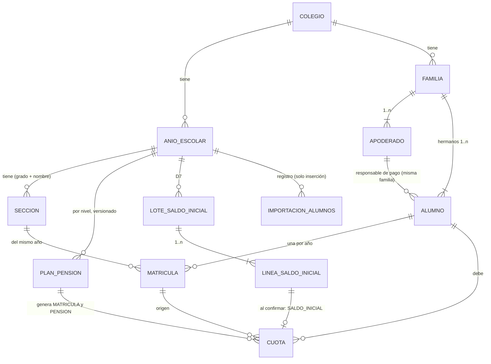

# Sprint 2 · Datos del colegio: diseño de arquitectura

> Diseño del agente `arquitecto-software`, 2 de octubre de 2026. Paquete base: `pe.edu.virgenmaria.cuentasclaras`. No modifiqué ningún archivo del repositorio: todos los experimentos se hicieron en el scratchpad.
> **Cómo se verificó:**
> - Las migraciones V4–V6 se ejecutaron completas sobre **H2 2.4.240 en modo MySQL** y sobre un **MySQL 8.0.46 real** temporal. En ambos se comprobaron 32 casos de restricciones con resultados idénticos.
> - Los GRANT por columna se probaron conectado como `cc_app`.
> - Apache POI 5.5.1 se descargó de Maven Central y se probó con Java 21.0.11: lectura en streaming, fórmulas, zip bomb, XXE y archivos OLE2.
> - Las reglas de fechas y dinero se comprobaron en Java 21.

> **Nota de numeración (agregada al guardar el diseño):** las correcciones del sprint 1 ya usaron `V4__clave_temporal_y_restablecimiento.sql`. Por eso las migraciones de este sprint se renumeran: **V4 → V5, V5 → V6, V6 → V7** (nombres de archivo, referencias en el texto y en `MigracionMySqlTest`). Además, desde el sprint 1 las migraciones de prod se aplican con `java -jar app.jar migrar` y no al arrancar la app.

## 1. Resumen
- **Módulos:** `colegio` (años, grados y secciones) ← `alumnos` (familias, apoderados, alumnos, matrículas e importación) ← `cobranza` (planes de pensión, cuotas y saldo inicial). Las dependencias van en una sola dirección y una regla ArchUnit lo vigila. `cobranza` se entera de cada matrícula por un evento síncrono que corre en la misma transacción.
- **La deuda la genera el sistema:**
  - Administración propone un **plan de pensiones versionado** y Promotoría o Dirección lo aprueba (otra persona).
  - Al aprobarlo, o al matricular, se generan las cuotas copiando los montos del plan.
  - Un plan aprobado no se edita: un cambio crea una versión nueva y **no toca las cuotas ya generadas**.
- **La base de datos se protege sola:**
  - FK compuestas `(x_id, colegio_id)`: no se puede referenciar un dato de otro colegio.
  - CHECKs de estados y de doble control.
  - `clave` única: la generación es idempotente.
  - `obligacion` única: nunca se cobra dos veces el mismo mes al mismo alumno.
  - En MySQL, `cc_app` **no puede hacer UPDATE del monto, la fecha ni el alumno de una cuota** (GRANT por columna, error 1143) ni DELETE de ninguna tabla financiera.
- **Excel:** Apache POI 5.5.1 en modo streaming, detrás de un lector endurecido en `comun.excel`.
  - Límites: 2 MB, 2,000 filas y 20 MB descomprimidos.
  - Rechaza fórmulas, macros, vínculos externos, DOCTYPE y archivos cifrados.
  - Vista previa sin guardar nada; confirmación todo o nada, idempotente y auditada.
- **Saldo inicial (D7):** un lote con el total declarado en el informe del contador.
  - Administración lo arma y lo envía solo si la suma de las líneas cuadra con ese total.
  - Promotoría o Dirección lo confirma (otra persona, comprobado también en la base).
  - Al confirmarlo se crean cuotas `SALDO_INICIAL`.

## 2. Hallazgos verificados (leer antes de implementar)
- **Apache POI 5.5.1** (última versión en Central, noviembre de 2025):
  - `poi-ooxml` trae `poi` y `poi-ooxml-lite` 5.5.1, `xmlbeans` 5.3.0, `commons-compress` 1.28.0, `commons-io` 2.21.0, `commons-collections4` 4.5.0, `commons-math3` 3.6.1, `SparseBitSet` 1.3, `curvesapi` 1.08 y `log4j-api`.
  - Boot 4.1.1 gestiona log4j 2.25.5 y su `spring-boot-starter-logging` ya incluye `log4j-to-slf4j`, así que no aparece el aviso "could not find a logging provider".
  - El BOM de Boot no gestiona `commons-io` ni `commons-compress`: quedan las versiones de POI.
  - Suma unos 14 MB de jars.
  - La CVE-2025-31672 (entradas zip duplicadas) se corrigió en 5.4.0.
- **Lectura en streaming** con `XSSFReader` + `ReadOnlySharedStringsTable(pkg, false)` + `XMLHelper.newXMLReader()` y un `DefaultHandler` propio:
  - 3,001 × 14 celdas en **388 ms**.
  - Una celda con fórmula trae el elemento `<f>` (así se detecta). Las fórmulas escritas por POI no tienen valor en caché.
  - `XSSFSheetXMLHandler` **no** sirve: no indica si la celda es fórmula.
- **`ZipSecureFile`:**
  - Valores por defecto: ratio mínimo 0.01, entrada máxima 4 GB, 1,000 entradas, texto máximo 10 MB.
  - Una hoja con 300 MB de espacios (zip de 310 KB) la rechaza POI ("Zip bomb detected!") y también el pre-escaneo propio con tope de 20 MB.
  - `setMaxFileCount` existe en 5.5.1.
- **Archivo cifrado o `.xls`:** POI lanza `OLE2NotOfficeXmlFileException`. Se traduce a "El archivo tiene contraseña o es .xls; guárdalo como .xlsx sin contraseña".
- **XXE:** un `<!DOCTYPE ...>` en la hoja lo rechaza `XMLHelper.newXMLReader()` (`disallow-doctype-decl`).
- **Números y fechas que vienen de Excel:**
  - Un DNI escrito como número llega como `<v>1234567</v>`: Excel ya perdió el cero inicial.
  - El serial 42000 es el 27/12/2014 en el sistema 1900 y el 28/12/2018 en el 1904. Hay que leer `date1904` de `workbook.xml`.
- **Fechas en Java:**
  - `DateTimeFormatter` en modo `STRICT` exige `uuuu`: con `yyyy` falla siempre.
  - `"d/M/uuuu"` acepta `5/3/2015` y `05/03/2015`, y rechaza `29/02/2015`, `31/04/2016` y `05/03/15`.
  - `Month.getDisplayName(FULL, es-PE)` devuelve **"setiembre"**; con `es`, "septiembre". Nunca se usa la configuración regional por defecto de la JVM.
  - `America/Lima`: UTC-5 sin horario de verano (0 transiciones desde 1995). Una cuota que vence el 31/03 está vencida desde las `05:00Z` del 01/04.
- **CHECK y NULL:** un CHECK que evalúa a NULL **pasa** (en MySQL y en H2). Encontré 4 casos en el borrador (`vigente = TRUE` y `mes BETWEEN ...`). Regla: siempre `col IS NOT NULL AND ...`.
- **FK compuestas** `(x_id, colegio_id) → padre(id, colegio_id)`:
  - Funcionan en ambas bases si el padre declara `UNIQUE (id, colegio_id)`.
  - Con una columna NULL no se verifican (MATCH SIMPLE), así que sirven para FK opcionales.
  - `fk_alumno_responsable (responsable_pago_id, familia_id) → apoderado(id, familia_id)` impide que el responsable de pago sea de otra familia, y que se mueva al alumno de familia sin cambiar también al responsable.
- **"Uno vigente":** con una columna nullable dentro de un `UNIQUE`, MySQL y H2 aceptan varios NULL. `vigente = TRUE/NULL` garantiza un solo año EN_CURSO y un solo plan vigente por año y nivel.
- **GRANT por columna** (`GRANT UPDATE (estado, ...) ON cuota`): tocar otra columna da el error **1143** (el error por tabla es 1142). Hibernate solo pone en el UPDATE las columnas `updatable = true`. Un `UPDATE` en JPQL **sí** se salta `updatable=false`: se prohíbe con ArchUnit y MySQL lo bloquea de todos modos.
- **H2 gasta valores de identidad en INSERT fallidos:** las pruebas no deben suponer ids.
- **Boot 4.1.1:**
  - Multipart por defecto: `max-file-size` 1 MB y `max-request-size` 10 MB.
  - Tomcat por defecto: `max-part-count` 50 y `max-swallow-size` 2 MB.
- **Dinero:** `new BigDecimal("450").equals(new BigDecimal("450.00"))` es `false`; con `compareTo` da 0. `setScale(2, UNNECESSARY)` rechaza `380.005`.
- **Pendiente de verificar (con prueba `RANDOM_PORT`):** el `CsrfFilter` lee `_csrf` de un formulario multipart en Tomcat real; MockMvc no lo demuestra. Si un archivo supera el límite del contenedor, se espera un 403 por CSRF, no un mensaje amigable. Por eso el límite de 2 MB se valida en la aplicación y el del contenedor es de 5 MB.

## 3. Decisiones
1. **Niveles y grados como enums (`Nivel`, `Grado`), no como tablas.**
   - Son el catálogo nacional de EBR: 14 grados, cada uno con `nivel()`, `etiqueta()`, `edadNormativa()` y `siguiente()`. Esto último le sirve a la renovación 2027 del sprint 4.
   - Por colegio y año solo hay **secciones**.
   - Con esto desaparecen dos tablas y dos pantallas.
2. **Dependencias en un solo sentido** `colegio ← alumnos ← cobranza`:
   - `cobranza` escucha `MatriculaRegistrada` con `@EventListener` síncrono, en la misma transacción: si falla la generación, falla la matrícula.
   - `alumnos` pregunta "¿esta matrícula tiene cuotas?" por la interfaz `ConsultaCuotasMatricula`, que define `alumnos` e implementa `cobranza`.
   - El cronograma es una pestaña de la ficha (`/alumnos/{id}/cronograma`) que sirve `cobranza.web`.
3. **FK compuestas con `colegio_id` en todas las tablas nuevas.** `@TenantId` ya filtra, pero ahora también la base rechaza referencias cruzadas entre colegios. Cuesta un `UNIQUE (id, colegio_id)` por tabla padre.
4. **Plan de pensiones versionado e inmutable cuando se aprueba.**
   - BORRADOR (Administración) → APROBADO (Promotoría o Dirección, distinto del creador y del último editor; también es CHECK) → REEMPLAZADO cuando se aprueba otra versión.
   - Las cuotas copian el monto y la fecha y apuntan a la versión que las generó.
   - "Cambiar un monto" crea una versión nueva y no altera las cuotas existentes. El reajuste de cuotas ya generadas es anulación más cuota nueva con aprobación (sprint 3).
5. **Vencimientos del plan en una columna** `vencimientos_pension VARCHAR(140)` (fechas ISO separadas por comas, con `AttributeConverter<List<LocalDate>, String>`).
   - Es un valor del plan que se lee y escribe completo y queda congelado al aprobar.
   - Evita una tabla hija que necesitaría DELETE.
6. **`VENCIDA` no se guarda: se calcula** con `hoy(Lima) > fechaVencimiento`. Sin tarea nocturna ni estados desfasados. La base solo acepta `PENDIENTE`, `PARCIAL`, `PAGADA` y `ANULADA`, y la pantalla muestra los cinco estados del glosario.
7. **Dos llaves en `cuota`:**
   - `clave` ("esta creación ya ocurrió": `MAT:{matriculaId}`, `PEN:{matriculaId}:{n}`, `SI:{lineaId}`). Nunca cambia y da la idempotencia.
   - `obligacion` ("esta deuda ya existe": `MAT-2027`, `PEN-2027-03`). Es única por alumno y pasa a NULL al anular. Así un saldo inicial y una cuota generada no pueden cobrar el mismo mes.
8. **Generación automática** al aprobar un plan (para las matrículas del nivel sin cronograma) y al registrar una matrícula si su plan ya está aprobado.
   - El botón "Generar pendientes" es solo una red de seguridad idempotente.
   - Se serializa con `SELECT ... FOR UPDATE` sobre el año escolar.
   - Una matrícula **con** cronograma nunca se vuelve a generar.
9. **Fecha de corte en el plan (`cobro_desde`).** Para 2026 vale 01/12/2026: el sistema genera desde la pensión de diciembre y todo lo anterior entra como saldo inicial. Como es parte del plan, también pasa por la aprobación.
10. **Saldo inicial con doble control y total de control.**
    - El lote guarda la referencia al informe del contador y el **total declarado**. Solo se envía si la suma de líneas es exactamente igual.
    - Confirma Promotoría o Dirección, que no puede ser quien creó, envió ni agregó líneas (CHECK en la base para el creador y quien envió).
    - Las líneas no se borran: se marcan como `quitada`.
11. **Autoaprobación auditada.** `aprobar` y `confirmar` llevan `@Transactional(noRollbackFor = AutoaprobacionException.class)`: primero validan, registran `AUTOAPROBACION_RECHAZADA` (resaltada) y lanzan la excepción. Como no tocaron nada antes, el evento queda y no hay cambios a medias.
12. **La importación reutiliza los mismos casos de uso del registro manual** (`RegistroAlumnos`): una sola validación y los mismos eventos de auditoría.
    - La vista previa vive en la `HttpSession` (sprint 1, decisión 9: una sola instancia) con un token. No guarda el archivo.
    - Al confirmar, se vuelve a comparar contra la base y, si algo cambió, se pide revisar de nuevo.
    - En la base solo queda `importacion_alumnos` (solo inserción): conteos y SHA-256.
13. **Validación única de datos personales** en `ReglasDatosPersonales` (DNI, CE, pasaporte, nombres, celular y correo). La usan los formularios y la importación.
14. **Auditoría con datos enmascarados:**
    - Documento `DNI ****1236`, teléfono `+51 *** *** 321`, correo `r***@gmail.com`; de la fecha de nacimiento, solo el año.
    - La bitácora es inmutable y no se puede "olvidar" un dato (Ley 29733).
    - Cambiar el responsable de pago o el contacto de un apoderado queda **resaltado**: es la vía para desviar los avisos de pago lejos del padre real.

## 4. Modelo

**Invariantes** (lo que dice "base" también está garantizado por la base de datos):
- **Año escolar:** año único por colegio; como máximo uno EN_CURSO (base); `inicio_clases < fin_clases`.
- **Sección:** única por (año, grado, nombre). No se borra: se desactiva.
- **Documento:** único por colegio y tipo para alumnos y para apoderados (base). Con el mismo DNI en dos colegios son dos personas distintas.
- **Apoderado:**
  - pertenece a una sola familia y tiene WhatsApp o correo (base);
  - no se desactiva si es responsable de pago de algún alumno.
- **Alumno:**
  - su responsable de pago es un apoderado activo de **su** familia (base);
  - RETIRADO exige fecha y motivo (base).
- **Matrícula:** una por alumno y año; su sección es de ese año (base). No se cambia a otro nivel si ya tiene cuotas.
- **Plan de pensión:**
  - una sola versión vigente por año y nivel (base);
  - un plan APROBADO no cambia;
  - lo aprueba alguien distinto del creador y del último editor (base);
  - desde la versión 2, `motivo_cambio` es obligatorio (base);
  - la matrícula no supera a la pensión (DS 005-2021-MINEDU).
- **Cuota:**
  - nunca se borra (`@PreRemove`, sin DELETE en MySQL);
  - monto, fecha, alumno, origen y clave son inmutables (`updatable=false`, sin setters, GRANT por columna);
  - `monto > 0` y `0 ≤ monto_pagado ≤ monto`, con el estado coherente con lo pagado (base);
  - ANULADA exige motivo, solicitante y aprobador distintos, `monto_pagado = 0` y libera la `obligacion` (base);
  - un solo `clave` por colegio y una sola `obligacion` activa por alumno (base).
- **Lote de saldo inicial:**
  - BORRADOR → ENVIADO → CONFIRMADO, o devuelto a BORRADOR, o DESCARTADO;
  - CONFIRMADO exige un confirmador distinto del creador y de quien lo envió (base);
  - solo se envía si `Σ líneas no quitadas = total_declarado`;
  - estando ENVIADO no admite cambios.
- **`importacion_alumnos`:** solo inserción.

## 5. Migraciones
Las tres pasaron en H2 2.4.240 (`MODE=MySQL;DATABASE_TO_LOWER=TRUE`) y en MySQL 8.0.46. Hay una por tanda.

### `V4__estructura_y_alumnos.sql` (tanda 1)
```sql
-- Sprint 2, tanda 1: estructura académica, familias, apoderados, alumnos y matrículas.
-- Las FK compuestas (x_id, colegio_id) hacen que la base rechace referencias a datos de otro colegio,
-- aunque el código fallara. Nada se borra: se desactiva, se retira o se anula.

-- Año escolar. Solo uno EN_CURSO por colegio: "vigente" vale TRUE en ese año y NULL en los demás
-- (MySQL y H2 aceptan varios NULL en un índice único).
CREATE TABLE anio_escolar (
    id              BIGINT       NOT NULL AUTO_INCREMENT PRIMARY KEY,
    colegio_id      BIGINT       NOT NULL,
    anio            INT          NOT NULL,
    estado          VARCHAR(20)  NOT NULL,
    vigente         BOOLEAN,
    inicio_clases   DATE         NOT NULL,
    fin_clases      DATE         NOT NULL,
    creado_en       DATETIME(6)  NOT NULL,
    creado_por      VARCHAR(60)  NOT NULL,
    actualizado_en  DATETIME(6)  NOT NULL,
    version         BIGINT       NOT NULL DEFAULT 0,
    CONSTRAINT uk_anio_escolar_anio UNIQUE (colegio_id, anio),
    CONSTRAINT uk_anio_escolar_vigente UNIQUE (colegio_id, vigente),
    CONSTRAINT uk_anio_escolar_id_colegio UNIQUE (id, colegio_id),
    CONSTRAINT fk_anio_escolar_colegio FOREIGN KEY (colegio_id) REFERENCES colegio (id),
    CONSTRAINT ck_anio_escolar_anio CHECK (anio BETWEEN 2000 AND 2100),
    CONSTRAINT ck_anio_escolar_estado CHECK (estado IN ('PLANIFICADO', 'EN_CURSO', 'CERRADO')),
    CONSTRAINT ck_anio_escolar_vigente CHECK ((estado = 'EN_CURSO' AND vigente IS NOT NULL AND vigente = TRUE)
        OR (estado <> 'EN_CURSO' AND vigente IS NULL)),
    CONSTRAINT ck_anio_escolar_fechas CHECK (inicio_clases < fin_clases)
);

-- Sección de un grado en un año. Los niveles y grados son el catálogo nacional (enum Grado).
CREATE TABLE seccion (
    id               BIGINT       NOT NULL AUTO_INCREMENT PRIMARY KEY,
    colegio_id       BIGINT       NOT NULL,
    anio_escolar_id  BIGINT       NOT NULL,
    grado            VARCHAR(20)  NOT NULL,
    nombre           VARCHAR(30)  NOT NULL,
    activa           BOOLEAN      NOT NULL DEFAULT TRUE,
    creado_en        DATETIME(6)  NOT NULL,
    creado_por       VARCHAR(60)  NOT NULL,
    actualizado_en   DATETIME(6)  NOT NULL,
    version          BIGINT       NOT NULL DEFAULT 0,
    CONSTRAINT uk_seccion_grado_nombre UNIQUE (colegio_id, anio_escolar_id, grado, nombre),
    CONSTRAINT uk_seccion_id_colegio UNIQUE (id, colegio_id),
    CONSTRAINT uk_seccion_id_anio UNIQUE (id, anio_escolar_id),
    CONSTRAINT fk_seccion_colegio FOREIGN KEY (colegio_id) REFERENCES colegio (id),
    CONSTRAINT fk_seccion_anio FOREIGN KEY (anio_escolar_id, colegio_id) REFERENCES anio_escolar (id, colegio_id),
    CONSTRAINT ck_seccion_grado CHECK (grado IN ('INICIAL_3', 'INICIAL_4', 'INICIAL_5',
        'PRIMARIA_1', 'PRIMARIA_2', 'PRIMARIA_3', 'PRIMARIA_4', 'PRIMARIA_5', 'PRIMARIA_6',
        'SECUNDARIA_1', 'SECUNDARIA_2', 'SECUNDARIA_3', 'SECUNDARIA_4', 'SECUNDARIA_5'))
);

-- Familia: agrupa a los hermanos y a sus apoderados.
CREATE TABLE familia (
    id              BIGINT        NOT NULL AUTO_INCREMENT PRIMARY KEY,
    colegio_id      BIGINT        NOT NULL,
    nombre          VARCHAR(120)  NOT NULL,
    creado_en       DATETIME(6)   NOT NULL,
    creado_por      VARCHAR(60)   NOT NULL,
    actualizado_en  DATETIME(6)   NOT NULL,
    version         BIGINT        NOT NULL DEFAULT 0,
    CONSTRAINT uk_familia_id_colegio UNIQUE (id, colegio_id),
    CONSTRAINT fk_familia_colegio FOREIGN KEY (colegio_id) REFERENCES colegio (id)
);

-- Apoderado: pertenece a una sola familia. Debe poder recibir avisos: WhatsApp o correo.
CREATE TABLE apoderado (
    id                 BIGINT        NOT NULL AUTO_INCREMENT PRIMARY KEY,
    colegio_id         BIGINT        NOT NULL,
    familia_id         BIGINT        NOT NULL,
    tipo_documento     VARCHAR(20)   NOT NULL,
    numero_documento   VARCHAR(12)   NOT NULL,
    apellido_paterno   VARCHAR(60)   NOT NULL,
    apellido_materno   VARCHAR(60),
    nombres            VARCHAR(60)   NOT NULL,
    parentesco         VARCHAR(20)   NOT NULL,
    telefono_whatsapp  VARCHAR(16),
    correo             VARCHAR(150),
    nombre_busqueda    VARCHAR(190)  NOT NULL,
    activo             BOOLEAN       NOT NULL DEFAULT TRUE,
    creado_en          DATETIME(6)   NOT NULL,
    creado_por         VARCHAR(60)   NOT NULL,
    actualizado_en     DATETIME(6)   NOT NULL,
    version            BIGINT        NOT NULL DEFAULT 0,
    CONSTRAINT uk_apoderado_documento UNIQUE (colegio_id, tipo_documento, numero_documento),
    CONSTRAINT uk_apoderado_id_colegio UNIQUE (id, colegio_id),
    CONSTRAINT uk_apoderado_id_familia UNIQUE (id, familia_id),
    CONSTRAINT fk_apoderado_colegio FOREIGN KEY (colegio_id) REFERENCES colegio (id),
    CONSTRAINT fk_apoderado_familia FOREIGN KEY (familia_id, colegio_id) REFERENCES familia (id, colegio_id),
    CONSTRAINT ck_apoderado_tipo_documento CHECK (tipo_documento IN ('DNI', 'CE', 'PASAPORTE')),
    CONSTRAINT ck_apoderado_parentesco CHECK (parentesco IN ('MADRE', 'PADRE', 'ABUELO', 'TIO', 'HERMANO',
        'TUTOR_LEGAL', 'OTRO')),
    CONSTRAINT ck_apoderado_contacto CHECK (telefono_whatsapp IS NOT NULL OR correo IS NOT NULL)
);
CREATE INDEX ix_apoderado_nombre ON apoderado (colegio_id, nombre_busqueda);

-- Alumno. El responsable de pago es un apoderado de SU familia: lo exige la FK (responsable_pago_id, familia_id).
CREATE TABLE alumno (
    id                   BIGINT        NOT NULL AUTO_INCREMENT PRIMARY KEY,
    colegio_id           BIGINT        NOT NULL,
    familia_id           BIGINT        NOT NULL,
    responsable_pago_id  BIGINT        NOT NULL,
    tipo_documento       VARCHAR(20)   NOT NULL,
    numero_documento     VARCHAR(12)   NOT NULL,
    apellido_paterno     VARCHAR(60)   NOT NULL,
    apellido_materno     VARCHAR(60),
    nombres              VARCHAR(60)   NOT NULL,
    fecha_nacimiento     DATE          NOT NULL,
    estado               VARCHAR(20)   NOT NULL,
    nombre_busqueda      VARCHAR(190)  NOT NULL,
    retirado_en          DATE,
    retirado_por         VARCHAR(60),
    motivo_retiro        VARCHAR(500),
    creado_en            DATETIME(6)   NOT NULL,
    creado_por           VARCHAR(60)   NOT NULL,
    actualizado_en       DATETIME(6)   NOT NULL,
    version              BIGINT        NOT NULL DEFAULT 0,
    CONSTRAINT uk_alumno_documento UNIQUE (colegio_id, tipo_documento, numero_documento),
    CONSTRAINT uk_alumno_id_colegio UNIQUE (id, colegio_id),
    CONSTRAINT fk_alumno_colegio FOREIGN KEY (colegio_id) REFERENCES colegio (id),
    CONSTRAINT fk_alumno_familia FOREIGN KEY (familia_id, colegio_id) REFERENCES familia (id, colegio_id),
    CONSTRAINT fk_alumno_responsable FOREIGN KEY (responsable_pago_id, familia_id) REFERENCES apoderado (id, familia_id),
    CONSTRAINT ck_alumno_tipo_documento CHECK (tipo_documento IN ('DNI', 'CE', 'PASAPORTE')),
    CONSTRAINT ck_alumno_estado CHECK (estado IN ('ACTIVO', 'RETIRADO', 'EGRESADO')),
    CONSTRAINT ck_alumno_retiro CHECK ((estado = 'RETIRADO' AND retirado_en IS NOT NULL AND motivo_retiro IS NOT NULL)
        OR (estado <> 'RETIRADO' AND retirado_en IS NULL))
);
CREATE INDEX ix_alumno_nombre ON alumno (colegio_id, nombre_busqueda);

-- Matrícula: un alumno en una sección de un año. Una por alumno y año. La sección debe ser de ese año.
CREATE TABLE matricula (
    id               BIGINT        NOT NULL AUTO_INCREMENT PRIMARY KEY,
    colegio_id       BIGINT        NOT NULL,
    alumno_id        BIGINT        NOT NULL,
    anio_escolar_id  BIGINT        NOT NULL,
    seccion_id       BIGINT        NOT NULL,
    fecha_matricula  DATE          NOT NULL,
    estado           VARCHAR(20)   NOT NULL,
    retirada_en      DATE,
    creado_en        DATETIME(6)   NOT NULL,
    creado_por       VARCHAR(60)   NOT NULL,
    actualizado_en   DATETIME(6)   NOT NULL,
    version          BIGINT        NOT NULL DEFAULT 0,
    CONSTRAINT uk_matricula_alumno_anio UNIQUE (colegio_id, alumno_id, anio_escolar_id),
    CONSTRAINT uk_matricula_id_colegio UNIQUE (id, colegio_id),
    CONSTRAINT fk_matricula_colegio FOREIGN KEY (colegio_id) REFERENCES colegio (id),
    CONSTRAINT fk_matricula_alumno FOREIGN KEY (alumno_id, colegio_id) REFERENCES alumno (id, colegio_id),
    CONSTRAINT fk_matricula_anio FOREIGN KEY (anio_escolar_id, colegio_id) REFERENCES anio_escolar (id, colegio_id),
    CONSTRAINT fk_matricula_seccion FOREIGN KEY (seccion_id, anio_escolar_id) REFERENCES seccion (id, anio_escolar_id),
    CONSTRAINT ck_matricula_estado CHECK (estado IN ('ACTIVA', 'RETIRADA')),
    CONSTRAINT ck_matricula_retiro CHECK ((estado = 'RETIRADA' AND retirada_en IS NOT NULL)
        OR (estado = 'ACTIVA' AND retirada_en IS NULL))
);
CREATE INDEX ix_matricula_seccion ON matricula (colegio_id, seccion_id);
```

### `V5__importacion_alumnos.sql` (tanda 2)
```sql
-- Sprint 2, tanda 2: registro de cada importación CONFIRMADA de alumnos y apoderados desde Excel.
-- Solo inserción (sin UPDATE ni DELETE para cc_app). No guarda el archivo ni datos personales: solo
-- su huella SHA-256 (para avisar si se reimporta el mismo archivo) y los conteos.
CREATE TABLE importacion_alumnos (
    id                       BIGINT        NOT NULL AUTO_INCREMENT PRIMARY KEY,
    colegio_id               BIGINT        NOT NULL,
    anio_escolar_id          BIGINT        NOT NULL,
    archivo_nombre           VARCHAR(150)  NOT NULL,
    archivo_sha256           VARCHAR(64)   NOT NULL,
    archivo_bytes            INT           NOT NULL,
    filas                    INT           NOT NULL,
    alumnos_nuevos           INT           NOT NULL,
    alumnos_actualizados     INT           NOT NULL,
    alumnos_sin_cambios      INT           NOT NULL,
    apoderados_nuevos        INT           NOT NULL,
    apoderados_actualizados  INT           NOT NULL,
    familias_nuevas          INT           NOT NULL,
    matriculas_nuevas        INT           NOT NULL,
    creado_en                DATETIME(6)   NOT NULL,
    creado_por               VARCHAR(60)   NOT NULL,
    actualizado_en           DATETIME(6)   NOT NULL,
    version                  BIGINT        NOT NULL DEFAULT 0,
    CONSTRAINT fk_importacion_alumnos_colegio FOREIGN KEY (colegio_id) REFERENCES colegio (id),
    CONSTRAINT fk_importacion_alumnos_anio FOREIGN KEY (anio_escolar_id, colegio_id)
        REFERENCES anio_escolar (id, colegio_id),
    CONSTRAINT ck_importacion_alumnos_conteos CHECK (filas > 0 AND alumnos_nuevos >= 0 AND alumnos_actualizados >= 0
        AND alumnos_sin_cambios >= 0 AND apoderados_nuevos >= 0 AND apoderados_actualizados >= 0
        AND familias_nuevas >= 0 AND matriculas_nuevas >= 0)
);
CREATE INDEX ix_importacion_alumnos_sha ON importacion_alumnos (colegio_id, archivo_sha256);
```

### `V6__pensiones_y_cuotas.sql` (tanda 3)
```sql
-- Sprint 2, tanda 3: planes de pensiones, saldo inicial (D7) y cuotas.
-- Tablas financieras: cc_app tiene INSERT y UPDATE, nunca DELETE. En "cuota" el UPDATE es solo por columna
-- (scripts/mysql/02-permisos-tablas.sql): el monto, la fecha, el alumno y la clave no se pueden cambiar ni por SQL.

-- Plan de pensiones de un nivel en un año. Versionado: un plan APROBADO no se edita; un cambio es una versión
-- nueva que Promotoría o Dirección aprueban. Solo una versión vigente por año y nivel (vigente = TRUE o NULL).
CREATE TABLE plan_pension (
    id                     BIGINT         NOT NULL AUTO_INCREMENT PRIMARY KEY,
    colegio_id             BIGINT         NOT NULL,
    anio_escolar_id        BIGINT         NOT NULL,
    nivel                  VARCHAR(20)    NOT NULL,
    numero_version         INT            NOT NULL,
    estado                 VARCHAR(20)    NOT NULL,
    vigente                BOOLEAN,
    monto_matricula        DECIMAL(10,2)  NOT NULL,
    vencimiento_matricula  DATE           NOT NULL,
    monto_pension          DECIMAL(10,2)  NOT NULL,
    vencimientos_pension   VARCHAR(140)   NOT NULL,
    cobro_desde            DATE,
    motivo_cambio          VARCHAR(500),
    editado_por            VARCHAR(60)    NOT NULL,
    aprobado_por           VARCHAR(60),
    aprobado_en            DATETIME(6),
    cerrado_por            VARCHAR(60),
    cerrado_en             DATETIME(6),
    creado_en              DATETIME(6)    NOT NULL,
    creado_por             VARCHAR(60)    NOT NULL,
    actualizado_en         DATETIME(6)    NOT NULL,
    version                BIGINT         NOT NULL DEFAULT 0,
    CONSTRAINT uk_plan_pension_version UNIQUE (colegio_id, anio_escolar_id, nivel, numero_version),
    CONSTRAINT uk_plan_pension_vigente UNIQUE (colegio_id, anio_escolar_id, nivel, vigente),
    CONSTRAINT uk_plan_pension_id_colegio UNIQUE (id, colegio_id),
    CONSTRAINT fk_plan_pension_colegio FOREIGN KEY (colegio_id) REFERENCES colegio (id),
    CONSTRAINT fk_plan_pension_anio FOREIGN KEY (anio_escolar_id, colegio_id) REFERENCES anio_escolar (id, colegio_id),
    CONSTRAINT ck_plan_pension_nivel CHECK (nivel IN ('INICIAL', 'PRIMARIA', 'SECUNDARIA')),
    CONSTRAINT ck_plan_pension_estado CHECK (estado IN ('BORRADOR', 'APROBADO', 'REEMPLAZADO', 'DESCARTADO')),
    CONSTRAINT ck_plan_pension_vigente CHECK ((estado = 'APROBADO' AND vigente IS NOT NULL AND vigente = TRUE)
        OR (estado <> 'APROBADO' AND vigente IS NULL)),
    CONSTRAINT ck_plan_pension_montos CHECK (monto_pension > 0 AND monto_matricula >= 0),
    CONSTRAINT ck_plan_pension_version CHECK (numero_version >= 1),
    CONSTRAINT ck_plan_pension_motivo CHECK (numero_version = 1 OR motivo_cambio IS NOT NULL),
    CONSTRAINT ck_plan_pension_aprobacion CHECK (estado IN ('BORRADOR', 'DESCARTADO')
        OR (aprobado_por IS NOT NULL AND aprobado_en IS NOT NULL AND aprobado_por <> creado_por
            AND aprobado_por <> editado_por))
);

-- Lote de saldo inicial (D7): deudas previas al sistema, validadas por el contador.
-- Administración lo arma y lo envía; Promotoría o Dirección (otra persona) lo confirma.
CREATE TABLE lote_saldo_inicial (
    id                    BIGINT         NOT NULL AUTO_INCREMENT PRIMARY KEY,
    colegio_id            BIGINT         NOT NULL,
    anio_escolar_id       BIGINT         NOT NULL,
    fecha_corte           DATE           NOT NULL,
    documento_referencia  VARCHAR(150)   NOT NULL,
    total_declarado       DECIMAL(10,2)  NOT NULL,
    estado                VARCHAR(20)    NOT NULL,
    enviado_por           VARCHAR(60),
    enviado_en            DATETIME(6),
    confirmado_por        VARCHAR(60),
    confirmado_en         DATETIME(6),
    devuelto_por          VARCHAR(60),
    devuelto_en           DATETIME(6),
    motivo_devolucion     VARCHAR(500),
    descartado_por        VARCHAR(60),
    descartado_en         DATETIME(6),
    motivo_descarte       VARCHAR(500),
    creado_en             DATETIME(6)    NOT NULL,
    creado_por            VARCHAR(60)    NOT NULL,
    actualizado_en        DATETIME(6)    NOT NULL,
    version               BIGINT         NOT NULL DEFAULT 0,
    CONSTRAINT uk_lote_saldo_inicial_id_colegio UNIQUE (id, colegio_id),
    CONSTRAINT fk_lote_saldo_inicial_colegio FOREIGN KEY (colegio_id) REFERENCES colegio (id),
    CONSTRAINT fk_lote_saldo_inicial_anio FOREIGN KEY (anio_escolar_id, colegio_id)
        REFERENCES anio_escolar (id, colegio_id),
    CONSTRAINT ck_lote_saldo_inicial_estado CHECK (estado IN ('BORRADOR', 'ENVIADO', 'CONFIRMADO', 'DESCARTADO')),
    CONSTRAINT ck_lote_saldo_inicial_total CHECK (total_declarado > 0),
    CONSTRAINT ck_lote_saldo_inicial_envio CHECK (estado NOT IN ('ENVIADO', 'CONFIRMADO')
        OR (enviado_por IS NOT NULL AND enviado_en IS NOT NULL)),
    CONSTRAINT ck_lote_saldo_inicial_doble_control CHECK (estado <> 'CONFIRMADO'
        OR (confirmado_por IS NOT NULL AND confirmado_en IS NOT NULL
            AND confirmado_por <> creado_por AND confirmado_por <> enviado_por))
);

CREATE TABLE linea_saldo_inicial (
    id                 BIGINT         NOT NULL AUTO_INCREMENT PRIMARY KEY,
    colegio_id         BIGINT         NOT NULL,
    lote_id            BIGINT         NOT NULL,
    alumno_id          BIGINT         NOT NULL,
    concepto           VARCHAR(20)    NOT NULL,
    mes                INT,
    descripcion        VARCHAR(80)    NOT NULL,
    monto              DECIMAL(10,2)  NOT NULL,
    fecha_vencimiento  DATE           NOT NULL,
    quitada            BOOLEAN        NOT NULL DEFAULT FALSE,
    creado_en          DATETIME(6)    NOT NULL,
    creado_por         VARCHAR(60)    NOT NULL,
    actualizado_en     DATETIME(6)    NOT NULL,
    version            BIGINT         NOT NULL DEFAULT 0,
    CONSTRAINT uk_linea_saldo_inicial_id_colegio UNIQUE (id, colegio_id),
    CONSTRAINT fk_linea_saldo_inicial_colegio FOREIGN KEY (colegio_id) REFERENCES colegio (id),
    CONSTRAINT fk_linea_saldo_inicial_lote FOREIGN KEY (lote_id, colegio_id)
        REFERENCES lote_saldo_inicial (id, colegio_id),
    CONSTRAINT fk_linea_saldo_inicial_alumno FOREIGN KEY (alumno_id, colegio_id) REFERENCES alumno (id, colegio_id),
    CONSTRAINT ck_linea_saldo_inicial_concepto CHECK (concepto IN ('MATRICULA', 'PENSION', 'OTRO')),
    CONSTRAINT ck_linea_saldo_inicial_mes CHECK ((concepto = 'PENSION' AND mes IS NOT NULL AND mes BETWEEN 1 AND 12)
        OR (concepto <> 'PENSION' AND mes IS NULL)),
    CONSTRAINT ck_linea_saldo_inicial_monto CHECK (monto > 0)
);
CREATE INDEX ix_linea_saldo_inicial_lote ON linea_saldo_inicial (colegio_id, lote_id);

-- Cuota: obligación de pago generada por el sistema (MATRICULA, PENSION) o confirmada como SALDO_INICIAL.
-- "clave": idempotencia de cada creación (nunca cambia). "obligacion": impide cobrar dos veces el mismo mes o la
-- misma matrícula al mismo alumno; vale NULL en las anuladas. VENCIDA no se guarda: se calcula con la fecha de Lima.
CREATE TABLE cuota (
    id                        BIGINT         NOT NULL AUTO_INCREMENT PRIMARY KEY,
    colegio_id                BIGINT         NOT NULL,
    alumno_id                 BIGINT         NOT NULL,
    anio_escolar_id           BIGINT         NOT NULL,
    matricula_id              BIGINT,
    plan_pension_id           BIGINT,
    linea_saldo_inicial_id    BIGINT,
    tipo                      VARCHAR(20)    NOT NULL,
    numero                    INT,
    descripcion               VARCHAR(80)    NOT NULL,
    monto                     DECIMAL(10,2)  NOT NULL,
    monto_pagado              DECIMAL(10,2)  NOT NULL DEFAULT 0.00,
    fecha_vencimiento         DATE           NOT NULL,
    estado                    VARCHAR(20)    NOT NULL,
    clave                     VARCHAR(80)    NOT NULL,
    obligacion                VARCHAR(20),
    anulacion_motivo          VARCHAR(500),
    anulacion_solicitada_por  VARCHAR(60),
    anulacion_aprobada_por    VARCHAR(60),
    anulada_en                DATETIME(6),
    creado_en                 DATETIME(6)    NOT NULL,
    creado_por                VARCHAR(60)    NOT NULL,
    actualizado_en            DATETIME(6)    NOT NULL,
    version                   BIGINT         NOT NULL DEFAULT 0,
    CONSTRAINT uk_cuota_clave UNIQUE (colegio_id, clave),
    CONSTRAINT uk_cuota_obligacion UNIQUE (colegio_id, alumno_id, obligacion),
    CONSTRAINT uk_cuota_id_colegio UNIQUE (id, colegio_id),
    CONSTRAINT fk_cuota_colegio FOREIGN KEY (colegio_id) REFERENCES colegio (id),
    CONSTRAINT fk_cuota_alumno FOREIGN KEY (alumno_id, colegio_id) REFERENCES alumno (id, colegio_id),
    CONSTRAINT fk_cuota_anio FOREIGN KEY (anio_escolar_id, colegio_id) REFERENCES anio_escolar (id, colegio_id),
    CONSTRAINT fk_cuota_matricula FOREIGN KEY (matricula_id, colegio_id) REFERENCES matricula (id, colegio_id),
    CONSTRAINT fk_cuota_plan FOREIGN KEY (plan_pension_id, colegio_id) REFERENCES plan_pension (id, colegio_id),
    CONSTRAINT fk_cuota_linea FOREIGN KEY (linea_saldo_inicial_id, colegio_id)
        REFERENCES linea_saldo_inicial (id, colegio_id),
    CONSTRAINT ck_cuota_tipo CHECK (tipo IN ('MATRICULA', 'PENSION', 'SALDO_INICIAL')),
    CONSTRAINT ck_cuota_estado CHECK (estado IN ('PENDIENTE', 'PARCIAL', 'PAGADA', 'ANULADA')),
    CONSTRAINT ck_cuota_origen CHECK ((tipo IN ('MATRICULA', 'PENSION') AND matricula_id IS NOT NULL
            AND plan_pension_id IS NOT NULL AND linea_saldo_inicial_id IS NULL)
        OR (tipo = 'SALDO_INICIAL' AND linea_saldo_inicial_id IS NOT NULL AND plan_pension_id IS NULL)),
    CONSTRAINT ck_cuota_numero CHECK ((tipo = 'PENSION' AND numero IS NOT NULL AND numero BETWEEN 1 AND 12)
        OR (tipo <> 'PENSION' AND numero IS NULL)),
    CONSTRAINT ck_cuota_montos CHECK (monto > 0 AND monto_pagado >= 0 AND monto_pagado <= monto),
    CONSTRAINT ck_cuota_estado_pago CHECK ((estado = 'PENDIENTE' AND monto_pagado = 0)
        OR (estado = 'PARCIAL' AND monto_pagado > 0 AND monto_pagado < monto)
        OR (estado = 'PAGADA' AND monto_pagado = monto)
        OR (estado = 'ANULADA' AND monto_pagado = 0)),
    CONSTRAINT ck_cuota_anulacion CHECK ((estado = 'ANULADA' AND obligacion IS NULL AND anulada_en IS NOT NULL
            AND anulacion_motivo IS NOT NULL AND anulacion_solicitada_por IS NOT NULL
            AND anulacion_aprobada_por IS NOT NULL AND anulacion_aprobada_por <> anulacion_solicitada_por)
        OR (estado <> 'ANULADA' AND anulada_en IS NULL AND anulacion_aprobada_por IS NULL))
);
CREATE INDEX ix_cuota_alumno ON cuota (colegio_id, alumno_id, fecha_vencimiento);
CREATE INDEX ix_cuota_estado_vencimiento ON cuota (colegio_id, estado, fecha_vencimiento);
CREATE INDEX ix_cuota_matricula ON cuota (colegio_id, matricula_id);
```

### Agregar a `scripts/mysql/02-permisos-tablas.sql` (probado en MySQL 8.0.46)
```sql
-- Sprint 2 · tanda 1
GRANT INSERT, UPDATE ON cuentasclaras.anio_escolar TO 'cc_app'@'%';
GRANT INSERT, UPDATE ON cuentasclaras.seccion TO 'cc_app'@'%';
GRANT INSERT, UPDATE ON cuentasclaras.familia TO 'cc_app'@'%';
GRANT INSERT, UPDATE ON cuentasclaras.apoderado TO 'cc_app'@'%';
GRANT INSERT, UPDATE ON cuentasclaras.alumno TO 'cc_app'@'%';
GRANT INSERT, UPDATE ON cuentasclaras.matricula TO 'cc_app'@'%';
-- Sprint 2 · tanda 2
GRANT INSERT ON cuentasclaras.importacion_alumnos TO 'cc_app'@'%';              -- solo inserción
-- Sprint 2 · tanda 3 (financieras: NUNCA DELETE)
GRANT INSERT, UPDATE ON cuentasclaras.plan_pension TO 'cc_app'@'%';
GRANT INSERT, UPDATE ON cuentasclaras.lote_saldo_inicial TO 'cc_app'@'%';
GRANT INSERT, UPDATE ON cuentasclaras.linea_saldo_inicial TO 'cc_app'@'%';      -- se "quita" con un flag
GRANT INSERT ON cuentasclaras.cuota TO 'cc_app'@'%';
-- UPDATE solo de estas columnas: monto, fecha, alumno, origen y clave quedan inmutables (error 1143).
-- Debe coincidir EXACTAMENTE con las columnas updatable=true de la entidad Cuota.
GRANT UPDATE (estado, monto_pagado, obligacion, anulacion_motivo, anulacion_solicitada_por, anulacion_aprobada_por,
    anulada_en, actualizado_en, version) ON cuentasclaras.cuota TO 'cc_app'@'%';
```
**Otros cambios por las migraciones:**
- `MigracionMySqlTest` debe esperar `"1".."6"`; hoy espera exactamente `"1","2","3"`.
- Hay que actualizar el nombre del paso del CI ("Fase 1: Flyway aplica V1-V3").
- `LimpiezaBaseDatos` debe borrar, en este orden: `cuota`, `linea_saldo_inicial`, `lote_saldo_inicial`, `plan_pension`, `importacion_alumnos`, `matricula`, `alumno`, `apoderado`, `familia`, `seccion`, `anio_escolar`, y luego lo que ya borra.
- `VerificadorPermisosBaseDatos` (prod) suma dos comprobaciones: `DELETE FROM cuota WHERE 1 = 0` → 1142 y `UPDATE cuota SET monto = monto WHERE 1 = 0` → 1143. Si no fallan, la aplicación no arranca.

## 6. Configuración
**pom.xml:**
```xml
<properties><poi.version>5.5.1</poi.version></properties>
<dependency>
  <groupId>org.apache.poi</groupId>
  <artifactId>poi-ooxml</artifactId>
  <version>${poi.version}</version>
</dependency>
```
**application.yaml:**
```yaml
spring:
  servlet:
    multipart:
      # Límite del contenedor, holgado: el de 2 MB lo valida la aplicación con un mensaje claro.
      max-file-size: 5MB
      max-request-size: 6MB
cuentasclaras:
  excel:
    max-bytes: 2MB            # archivo subido
    max-filas: 2000           # filas de datos
    max-descomprimido: 20MB   # suma de todas las entradas del zip
    max-entradas-zip: 200
```
- `src/main/resources/messages.properties`: `typeMismatch.java.math.BigDecimal=Escribe el monto con punto decimal, por ejemplo 1250.00` y `typeMismatch.java.time.LocalDate=Escribe la fecha como dd/mm/aaaa`.
- `ZipSecureFile` se configura una sola vez en el constructor de `LectorXlsxSeguro`: `setMinInflateRatio(0.01)`, `setMaxEntrySize(20 MB)`, `setMaxFileCount(200)` y `setMaxTextSize(5 MB)`.

## 7. Clases por paquete

### `comun`
- **`comun.texto.Normalizador`** (final):
  - `String limpiar(String)`: NFC, quita controles, NBSP y espacios de ancho cero, colapsa espacios y hace trim. Devuelve null si queda vacío.
  - `String paraBusqueda(String... partes)`: sin tildes (NFD y quita `\p{M}`), en mayúsculas `ROOT` y con un solo espacio.
  - `String escaparLike(String)`: escapa `\`, `%` y `_`.
- **`comun.texto.Enmascarar`:**
  - `documento(String tipo, String numero)` → `"DNI ****1236"`;
  - `telefono(String)` → `"+51 *** *** 321"`;
  - `correo(String)` → `"r***@gmail.com"`.
- **`comun.dinero.Dinero`:**
  - `MAXIMO = 99999.99`;
  - `BigDecimal normalizar(BigDecimal)`: `setScale(2, UNNECESSARY)`; si tiene más de 2 decimales, lanza `ReglaNegocioException`;
  - `BigDecimal positivo(BigDecimal, String campo)`;
  - `String formatear(BigDecimal)` → `"S/ 1,250.00"`.
- **`comun.fecha.Calendario`:**
  - `PERU = Locale.forLanguageTag("es-PE")`;
  - `nombreMes(int)` → "setiembre";
  - `ultimoDiaDelMes(int anio, int mes)`, `primerDiaDelMes(LocalDate)`;
  - `List<LocalDate> vencimientosPorDefecto(int anio, int primerMes, int cantidad)`;
  - `int edadAl31DeMarzo(LocalDate nacimiento, int anio)`;
  - `LocalDate parsearFecha(String)` con `"d/M/uuuu"` STRICT.
- **`comun.excel`** (único paquete que importa `org.apache.poi`, regla ArchUnit):
  - `PropiedadesExcel`: record `@ConfigurationProperties("cuentasclaras.excel")`.
  - `ValidadorArchivoXlsx`: `void validar(String nombre, byte[] contenido)`. Valida la extensión `.xlsx`, la firma `PK\3\4` (o la firma OLE2, que da el mensaje de "contraseña o .xls"), el tamaño, y recorre con `ZipInputStream` contando los bytes reales: hasta 200 entradas y 20 MB. Rechaza `xl/vbaProject.bin`, `xl/externalLinks/`, `xl/embeddings/` y `activeX`.
  - `LectorXlsxSeguro`: `HojaLeida leer(byte[] contenido, String hoja, int maxFilas, int maxColumnas)`.
    - Usa `OPCPackage.open(InputStream)`, `XSSFReader.getSheetIterator()` (busca la hoja por nombre), `ReadOnlySharedStringsTable(pkg, false)`, `date1904` leído de `getWorkbookData()` y un SAX con `XMLHelper.newXMLReader()`.
    - Marca `formula=true` si hay `<f>` e ignora `<rPh>`.
    - Corta con error al pasar `maxFilas`.
  - `HojaLeida(boolean fecha1904, List<FilaXlsx> filas)`.
  - `FilaXlsx(int numero, Map<Integer, CeldaXlsx> celdas)`.
  - `CeldaXlsx(String referencia, TipoCelda tipo, String valorCrudo, boolean formula)`, con `TipoCelda { TEXTO, NUMERO, BOOLEANO, ERROR, FECHA_ISO }`.
  - `PlantillaXlsx`: `byte[] crear(String hojaDatos, List<ColumnaPlantilla> columnas, List<String> instrucciones)`.
    - Hojas "Instrucciones", "Alumnos" y "Listas" (oculta).
    - Formato texto `@` en las columnas de documentos y teléfono, validación de lista y fila 1 congelada.
    - **Sin fila de ejemplo** en "Alumnos" (el ejemplo va en "Instrucciones").
  - `ColumnaPlantilla(String encabezado, boolean texto, List<String> lista, String ayuda)`.
  - `ArchivoNoValidoException extends ReglaNegocioException`.

### `colegio`
- **model:**
  - `EstadoAnioEscolar { PLANIFICADO, EN_CURSO, CERRADO }`.
  - `Nivel { INICIAL, PRIMARIA, SECUNDARIA }` con `etiqueta()`.
  - `Grado` (14 valores):
    - `nivel()`, `numero()`, `etiqueta()` ("Inicial 3 años", "5.° Primaria"), `edadNormativa()`;
    - `Optional<Grado> siguiente()`;
    - `static Optional<Grado> de(Nivel, int)`.
  - `AnioEscolar extends BaseEntity`:
    - `static nuevo(int anio, boolean enCurso, LocalDate inicioClases, LocalDate finClases)`;
    - `enCurso()`, `iniciar()`, `cerrar()` (sin pantalla en el sprint 2);
    - `LocalDate fechaMatriculaPorDefecto(LocalDate hoy)`: el menor entre hoy y el inicio de clases.
  - `Seccion extends BaseEntity`:
    - `@ManyToOne(LAZY) AnioEscolar anioEscolar` (`updatable=false`), `grado`, `nombre`, `activa`;
    - `static nueva(AnioEscolar, Grado, String nombre)`, `desactivar()`, `etiqueta()`.
- **repository:**
  - `AnioEscolarRepository`:
    - `findAllByOrderByAnioDesc()`
    - `Optional<AnioEscolar> findByEstado(EstadoAnioEscolar)`
    - `boolean existsByAnio(int)`
    - `@Lock(PESSIMISTIC_WRITE) @Query("select a from AnioEscolar a where a.id = :id") Optional<AnioEscolar> bloquear(Long id)`
  - `SeccionRepository`:
    - `findByAnioEscolarIdOrderByGradoAscNombreAsc(Long)`
    - `Optional<Seccion> findByAnioEscolarIdAndGradoAndNombre(Long, Grado, String)`
- **service:** `ServicioEstructura`:
  - lectura con `@PreAuthorize("hasAnyRole('PROMOTOR','DIRECTOR','ADMINISTRACION')")`;
  - escritura con `@PreAuthorize("hasAnyRole('DIRECTOR','ADMINISTRACION')")`;
  - métodos: `List<AnioEscolarVista> listarAnios()`, `Optional<AnioEscolarVista> anioEnCurso()`, `AnioEscolarDetalle obtenerAnio(Long)`, `Long crearAnio(CrearAnioEscolarRequest)`, `Long crearSeccion(Long anioId, CrearSeccionRequest)`, `void desactivarSeccion(Long seccionId, String motivo)`.
- **dto:**
  - `CrearAnioEscolarRequest(@NotNull @Min(2000) @Max(2100) Integer anio, @NotNull LocalDate inicioClases, @NotNull LocalDate finClases, boolean enCurso)`
  - `CrearSeccionRequest(@NotNull Grado grado, @NotBlank @Size(max=30) String nombre)`
  - `AnioEscolarVista`, `AnioEscolarDetalle`, `SeccionVista(id, grado, etiqueta, activa, matriculados)`
- **web:** `EstructuraController`.

### `alumnos`
- **model:**
  - `TipoDocumento { DNI, CE, PASAPORTE }` con `patron()` y `etiqueta()`.
  - `DocumentoIdentidad`: record `@Embeddable` (`tipo_documento`, `numero_documento`, `updatable=true` con motivo).
  - `Parentesco`, `EstadoAlumno { ACTIVO, RETIRADO, EGRESADO }`, `EstadoMatricula { ACTIVA, RETIRADA }`.
  - `DatosAlumno` y `DatosApoderado`: records ya normalizados.
  - `ReglasDatosPersonales` (puro):
    - `DocumentoIdentidad documento(String tipo, String numero)`;
    - `String nombre(String valor, String campo)`;
    - `String telefonoWhatsapp(String)`, `String correo(String)`;
    - `LocalDate fechaNacimiento(LocalDate, int anio, LocalDate hoy)`;
    - `Optional<String> advertenciaEdad(LocalDate, Grado, int anio)`;
    - todas lanzan `DatoInvalidoException(campo, mensaje)`.
  - `Familia extends BaseEntity`: `static nueva(String nombre)`, `renombrar(String)`.
  - `Apoderado extends BaseEntity`:
    - `@ManyToOne(LAZY) familia`;
    - `static nuevo(Familia, DatosApoderado)`;
    - `List<String> actualizar(DatosApoderado)`: devuelve los campos que cambiaron;
    - `desactivar()`, `nombreCompleto()`.
  - `Alumno extends BaseEntity`:
    - `static nuevo(DatosAlumno, Apoderado responsable)`: la familia es la del responsable;
    - `List<String> actualizar(DatosAlumno)`;
    - `void cambiarResponsable(Apoderado)`: si es de otra familia, mueve al alumno a esa familia;
    - `void retirar(LocalDate, String por, String motivo)`, `nombreCompleto()`.
  - `Matricula extends BaseEntity`:
    - `static nueva(Alumno, Seccion, LocalDate fecha)`;
    - `void cambiarSeccion(Seccion, boolean permitirOtroNivel)`, `void retirar(LocalDate)`, `Nivel nivel()`.
  - `ImportacionAlumnos extends BaseEntity`: `@Immutable`, `static registrar(...)`.
- **repository:**
  - `FamiliaRepository`
  - `ApoderadoRepository`:
    - `findByDocumento(DocumentoIdentidad)`
    - `findByDocumentoNumeroIn(Collection<String>)`
    - `findByFamiliaIdOrderByApellidoPaternoAsc(Long)`
  - `AlumnoRepository`:
    - `findByDocumentoNumeroIn(Collection<String>)`
    - `findByFamiliaIdOrderByFechaNacimientoAsc(Long)`
    - `Page<Alumno> buscar(String t1, String t2, String t3, String prefijoDocumento, EstadoAlumno estado, Pageable)` en JPQL. Cada `tN` va como `a.nombreBusqueda like :tN escape '\'`; si no se usa, va null.
  - `MatriculaRepository`:
    - `findByAlumnoIdAndAnioEscolarId`
    - `findByAlumnoIdOrderByAnioEscolarAnioDesc`
    - `findByAnioEscolarIdAndEstado`
    - `long countBySeccionId(Long)`
  - `ImportacionAlumnosRepository extends Repository<ImportacionAlumnos, Long>`: `save`, `findFirstByArchivoSha256OrderByCreadoEnDesc`, `findAllByOrderByCreadoEnDesc(Pageable)`.
- **service:**
  - `RegistroAlumnos` (`@Component`, sin `@PreAuthorize`: solo lo llaman servicios protegidos). Concentra los casos de uso con su auditoría:
    - `Familia crearFamilia(String nombre)`
    - `Apoderado registrarApoderado(Familia, DatosApoderado)`
    - `boolean actualizarApoderado(Apoderado, DatosApoderado, String detalle)`
    - `Alumno registrarAlumno(DatosAlumno, Apoderado)`
    - `boolean actualizarAlumno(Alumno, DatosAlumno, String detalle)`
    - `Matricula matricular(Alumno, Seccion, LocalDate)`: publica `MatriculaRegistrada`.
  - `ServicioAlumnos`:
    - `Page<AlumnoResumen> buscar(BusquedaAlumnos, int pagina)` (25 por página)
    - `FichaAlumno obtenerFicha(Long)`, `CabeceraAlumno cabecera(Long)`
    - `Long registrar(RegistrarAlumnoRequest)`
    - `void actualizar(Long, ActualizarAlumnoRequest)`
    - `void cambiarResponsablePago(Long, CambiarResponsableRequest)`
    - `void retirar(Long, RetirarAlumnoRequest)`
  - `ServicioFamilias`:
    - `FichaFamilia obtener(Long)`
    - `Long agregarApoderado(Long familiaId, ApoderadoRequest)`
    - `void actualizarApoderado(Long, ApoderadoRequest)`
    - `void desactivarApoderado(Long, String motivo)`
    - `void renombrar(Long, String)`
  - `ServicioMatriculas`: `Long matricular(Long alumnoId, MatricularRequest)`, `void cambiarSeccion(Long matriculaId, CambiarSeccionRequest)`.
  - `MatriculaRegistrada(Long matriculaId)`: evento.
  - `ConsultaCuotasMatricula` (puerto): `boolean tieneCuotas(Long matriculaId)`.
- **`alumnos.importacion`:**
  - `PlantillaImportacionAlumnos`: las 17 columnas y `byte[] generar()`.
  - `LectorImportacionAlumnos`: `List<FilaImportacion> leer(byte[], int anio, LocalDate hoy)`. Hace la validación de cada fila y entre filas.
  - `PlanificadorImportacion`: `PlanImportacion planificar(Long anioId, List<FilaImportacion>)`. Clasifica cada fila contra la base: `NUEVO`, `ACTUALIZA` (con la lista de cambios), `SIN_CAMBIOS` o `ERROR` (conflicto).
  - `ServicioImportacionAlumnos` (`@PreAuthorize("hasAnyRole('DIRECTOR','ADMINISTRACION')")`):
    - `byte[] plantilla()`
    - `VistaPreviaImportacion previsualizar(Long anioId, String nombreArchivo, byte[] contenido)`: solo lectura, no guarda nada.
    - `ResultadoImportacion confirmar(VistaPreviaImportacion previa)`: `@Transactional`, bloquea el año, vuelve a planificar y compara la huella del plan.
    - `List<ImportacionResumen> historial()`
  - Records serializables:
    - `FilaImportacion(int fila, DatosAlumno, DatosApoderado, Grado, String seccion, List<ErrorFila>, List<String> advertencias)`
    - `ErrorFila(int fila, String columna, String campo, String mensaje)`
    - `CambioFila`
    - `ResumenImportacion`
    - `VistaPreviaImportacion(UUID token, Long colegioId, Long usuarioId, Long anioId, String archivoNombre, String sha256, int bytes, List<FilaImportacion> filas, ResumenImportacion resumen, String huellaPlan, LocalDateTime importadoAntesEn)`
- **dto:**
  - `BusquedaAlumnos(String texto, Long anioId, Long seccionId, EstadoAlumno estado)`
  - `AlumnoResumen`, `FichaAlumno`, `CabeceraAlumno`, `FichaFamilia`, `ApoderadoVista`
  - `RegistrarAlumnoRequest` (datos del alumno, `Long apoderadoExistenteId` o `ApoderadoRequest`, `Long seccionId` opcional)
  - `ActualizarAlumnoRequest(..., motivo)`, `CambiarResponsableRequest(Long apoderadoId, motivo)`, `RetirarAlumnoRequest(LocalDate fecha, motivo)`
  - `MatricularRequest(Long seccionId, LocalDate fecha)`, `CambiarSeccionRequest(Long seccionId, motivo)`, `ApoderadoRequest(...)`
  - Todos los motivos con `@Size(min=10, max=500)`.
- **web:**
  - `AlumnoController`
  - `FamiliaController`
  - `ImportacionController`: guarda la vista previa en sesión con la clave `importacionPendiente` y la borra al confirmar o cancelar.

### `cobranza`
- **model:**
  - `EstadoPlan`, `TipoCuota`, `EstadoCuota { PENDIENTE, PARCIAL, PAGADA, ANULADA }`, `EstadoVisibleCuota { PENDIENTE, VENCIDA, PARCIAL, PAGADA, ANULADA }`, `EstadoLote`, `ConceptoSaldo { MATRICULA, PENSION, OTRO }`.
  - `ListaFechasConverter implements AttributeConverter<List<LocalDate>, String>`.
  - `ConfiguracionPlan(BigDecimal montoMatricula, LocalDate vencimientoMatricula, BigDecimal montoPension, List<LocalDate> vencimientos, LocalDate cobroDesde)` con `void validar(AnioEscolar)` (reglas de la sección 10).
  - `PlanPension extends BaseEntity`:
    - `static borrador(AnioEscolar, Nivel, ConfiguracionPlan, String editor)`
    - `void editar(ConfiguracionPlan, String editor)`: solo en BORRADOR.
    - `PlanPension nuevaVersion(String motivo, String editor)`
    - `void aprobar(String aprobador, LocalDateTime)`: aprobador distinto del creador y del último editor.
    - `void reemplazar(String por, LocalDateTime)`, `void descartar(String por, LocalDateTime)`
  - `CuotaPlanificada(TipoCuota, Integer numero, String descripcion, BigDecimal monto, LocalDate vencimiento, String clave, String obligacion)`.
  - `CalculadoraCronograma` (pura): `static List<CuotaPlanificada> calcular(PlanPension plan, int anio, long matriculaId, LocalDate fechaMatricula)`.
  - `Obligaciones`: `pension(int anio, int mes)` → `"PEN-2027-03"`, `matricula(int anio)` → `"MAT-2027"`.
  - `Cuota extends BaseEntity`:
    - `@ManyToOne(LAZY, updatable=false) Alumno` y `AnioEscolar`; `Long matriculaId`, `planPensionId` y `lineaSaldoInicialId`, todos `updatable=false`;
    - `static generada(Alumno, Matricula, PlanPension, CuotaPlanificada)`, `static deSaldoInicial(LineaSaldoInicial, Matricula opcional)`;
    - `EstadoVisibleCuota estadoAl(LocalDate hoy)`, `BigDecimal saldo()`;
    - `void anular(String motivo, String solicitante, String aprobador, LocalDateTime)`: **gancho para el sprint 3**. Exige que no tenga pagos, un aprobador distinto del solicitante y un motivo de 10 a 500 caracteres. Pone `obligacion = null`.
    - `@PreRemove` lanza excepción. Sin setters.
  - `LoteSaldoInicial extends BaseEntity`:
    - `@OneToMany(mappedBy, cascade=PERSIST) List<LineaSaldoInicial>`;
    - `static nuevo(AnioEscolar, LocalDate fechaCorte, String documento, BigDecimal totalDeclarado)`;
    - `LineaSaldoInicial agregarLinea(Alumno, ConceptoSaldo, Integer mes, String descripcion, BigDecimal monto, LocalDate vencimiento)`, `void quitarLinea(Long lineaId)`;
    - `BigDecimal totalLineas()`;
    - `void enviar(String por, LocalDateTime)`, `void confirmar(String por, LocalDateTime)`, `void devolver(String por, String motivo, LocalDateTime)`, `void descartar(String por, String motivo, LocalDateTime)`.
  - `LineaSaldoInicial extends BaseEntity`: `String obligacion()`, `String clave()` (`"SI:" + id`), `void quitar()`.
  - `AutoaprobacionException extends ReglaNegocioException`.
- **repository:**
  - `PlanPensionRepository`:
    - `findByAnioEscolarIdOrderByNivelAscNumeroVersionDesc`
    - `Optional<PlanPension> findByAnioEscolarIdAndNivelAndVigenteTrue`
    - `boolean existsByAnioEscolarIdAndNivelAndEstado`
    - `@Query("select coalesce(max(p.numeroVersion),0) ...")`
  - `CuotaRepository`:
    - `findByAlumnoIdOrderByFechaVencimientoAscIdAsc`
    - `boolean existsByClave(String)`
    - `List<Cuota> findByAlumnoIdAndObligacionIn(Long, Collection<String>)`
    - `boolean existsByMatriculaIdAndTipoIn(Long, Collection<TipoCuota>)`
    - `@Query("select m from Matricula m where m.anioEscolar.id = :anio and m.estado = ACTIVA and (:nivelGrados is null or m.seccion.grado in :grados) and not exists (select c from Cuota c where c.matriculaId = m.id and c.tipo in (MATRICULA, PENSION))") List<Matricula> matriculasSinCronograma(...)`
  - `LoteSaldoInicialRepository`: `findAllByOrderByCreadoEnDesc`, `@Lock(PESSIMISTIC_WRITE) bloquear(Long)`.
  - **Ningún repositorio de `cobranza` tiene `@Modifying`** (ArchUnit).
- **service:**
  - `ServicioPlanesPension`:
    - lectura PROM, DIR y ADM; `crearBorrador`, `editarBorrador`, `nuevaVersion` y `descartar` solo ADM; `aprobar` PROM y DIR;
    - `ResumenPensiones resumen(Long anioId)`, `PlanDetalle obtener(Long)`;
    - `PlanRequest propuestaPorDefecto(Long anioId, Nivel)`;
    - `Long crearBorrador(Long anioId, Nivel, PlanRequest)`, `void editarBorrador(Long, PlanRequest)`;
    - `Long nuevaVersion(Long planId, String motivo)`;
    - `void aprobar(Long planId)`: reemplaza la versión anterior, audita y llama a `GeneradorCronograma.generarPendientes(anio, nivel)`. Lleva `noRollbackFor = AutoaprobacionException`.
    - `void descartar(Long, String motivo)`.
  - `GeneradorCronograma`:
    - `@PreAuthorize(DIR, ADM) ResultadoGeneracion generarPendientes(Long anioId)`: bloquea el año.
    - `int generarPara(Matricula)`: interno, idempotente por `clave` y omite `obligacion` ya existentes.
    - `@EventListener void alRegistrarMatricula(MatriculaRegistrada)`.
  - `ServicioCronograma` (lectura): `CronogramaAlumno deAlumno(Long alumnoId)` (estado visible con `LocalDate.now(reloj)`, totales) y `PendientesGeneracion pendientes(Long anioId)`.
  - `ServicioSaldoInicial`:
    - crear, agregar, quitar, enviar y descartar: ADM; confirmar y devolver: PROM y DIR;
    - `listar()`, `LoteDetalle obtener(Long)`;
    - `Long crearLote(LoteRequest)`, `Long agregarLinea(Long loteId, LineaSaldoRequest)`, `void quitarLinea(Long loteId, Long lineaId, String motivo)`;
    - `void enviar(Long)`;
    - `void confirmar(Long)`: bloquea, revalida las obligaciones (todo o nada) y lleva `noRollbackFor = AutoaprobacionException`;
    - `void devolver(Long, String motivo)`, `void descartar(Long, String motivo)`.
  - `ServicioAnulacionCuotas` (gancho, **sin endpoint** en el sprint 2): `@PreAuthorize(PROM, DIR) void anular(Long cuotaId, String motivo, String solicitante)`. El aprobador es el usuario en sesión. Lo conecta Aprobaciones en el sprint 3.
  - `ConsultaCuotasMatriculaJpa implements ConsultaCuotasMatricula`.
- **dto:**
  - `PlanRequest(@NotNull @Digits(integer=5,fraction=2) @DecimalMin("0.00") BigDecimal montoMatricula, @NotNull LocalDate vencimientoMatricula, @NotNull @Digits(integer=5,fraction=2) @DecimalMin("0.01") BigDecimal montoPension, @NotEmpty @Size(max=12) List<LocalDate> vencimientos, LocalDate cobroDesde)`
  - `PlanDetalle`, `ResumenPensiones`
  - `CronogramaAlumno(CabeceraAlumno, List<CuotaVista>, BigDecimal total, BigDecimal pagado, BigDecimal saldo, BigDecimal vencido)`
  - `CuotaVista(id, descripcion, tipo, vencimiento, monto, pagado, saldo, EstadoVisibleCuota, String origen)`
  - `ResultadoGeneracion(int matriculas, int cuotas, BigDecimal total, List<String> omitidas)`
  - `LoteRequest(@NotNull @PastOrPresent LocalDate fechaCorte, @NotBlank @Size(max=150) String documentoReferencia, @NotNull @Digits(integer=8,fraction=2) @DecimalMin("0.01") BigDecimal totalDeclarado)`
  - `LineaSaldoRequest(@NotBlank String documentoAlumno, @NotNull ConceptoSaldo concepto, @Min(1) @Max(12) Integer mes, @Size(max=80) String descripcion, @NotNull @Digits(integer=5,fraction=2) @DecimalMin("0.01") BigDecimal monto, @NotNull LocalDate vencimiento)`
  - `LoteDetalle`, `LoteResumen`
- **web:** `PlanPensionController`, `CronogramaController` (incluye `/alumnos/{id}/cronograma`) y `SaldoInicialController`.

### `seguridad` y `auditoria`
- **`ModuloApp`:** `disponible = true` para COLEGIO y ALUMNOS (tanda 1) y para PENSIONES (tanda 3). Las rutas y los roles no cambian.
- **`DatosDemoDev`:** años 2026 (EN_CURSO) y 2027 (PLANIFICADO), una sección por grado, los 8 alumnos del prototipo y planes aprobados (solo perfil dev).
- **`AccionAuditoria`** (todos los nombres tienen 40 caracteres o menos; `true` = se resalta):
  - estructura: `ANIO_ESCOLAR_CREADO`, `SECCION_CREADA`, `SECCION_DESACTIVADA`;
  - familias y apoderados: `FAMILIA_CREADA`, `FAMILIA_ACTUALIZADA`, `APODERADO_REGISTRADO`, `APODERADO_ACTUALIZADO`, `APODERADO_CONTACTO_CAMBIADO` (true), `APODERADO_DESACTIVADO`;
  - alumnos y matrículas: `ALUMNO_REGISTRADO`, `ALUMNO_ACTUALIZADO`, `ALUMNO_RETIRADO`, `RESPONSABLE_PAGO_CAMBIADO` (true), `MATRICULA_REGISTRADA`, `MATRICULA_SECCION_CAMBIADA`;
  - importación: `IMPORTACION_CONFIRMADA`;
  - planes: `PLAN_PENSION_CREADO`, `PLAN_PENSION_EDITADO`, `PLAN_PENSION_APROBADO`, `PLAN_PENSION_DESCARTADO`;
  - cuotas: `CRONOGRAMA_GENERADO` (una por matrícula, con el plan, las cuotas, los vencimientos y el total), `CUOTA_ANULADA`;
  - saldo inicial: `SALDO_INICIAL_LOTE_CREADO`, `SALDO_INICIAL_LINEA_AGREGADA`, `SALDO_INICIAL_LINEA_QUITADA`, `SALDO_INICIAL_ENVIADO`, `SALDO_INICIAL_CONFIRMADO`, `SALDO_INICIAL_DEVUELTO`, `SALDO_INICIAL_DESCARTADO`;
  - control: `AUTOAPROBACION_RECHAZADA` (true).

## 8. Matriz de permisos (rutas dentro de `ModuloApp`; segunda capa con `@PreAuthorize`)
| Ruta | Acción | PROM | DIR | ADM |
|---|---|---|---|---|
| `GET /colegio`, `/colegio/anios/{id}` | Ver años y secciones | X | X | X |
| `POST /colegio/anios`, `/colegio/anios/{id}/secciones`, `/colegio/secciones/{id}/desactivar` | Crear año o sección; desactivar sección (con motivo) | | X | X |
| `GET /alumnos?q=&anio=&seccion=&estado=&pagina=` | Buscar por nombre o DNI | X | X | X |
| `GET /alumnos/{id}`, `/alumnos/{id}/cronograma`, `/alumnos/familias/{id}` | Fichas | X | X | X |
| `GET/POST /alumnos/nuevo`, `/alumnos/{id}/editar`, `POST /alumnos/{id}/matricula`, `/alumnos/matriculas/{id}/seccion` | Registrar, editar, matricular, cambiar sección | | X | X |
| `POST /alumnos/{id}/responsable`, `/alumnos/{id}/retirar` | Cambiar responsable de pago o retirar (motivo, resaltado) | | X | X |
| `POST /alumnos/familias/{id}/apoderados`, `/alumnos/apoderados/{id}`, `/alumnos/apoderados/{id}/desactivar` | Apoderados | | X | X |
| `GET /alumnos/importar`, `/alumnos/importar/plantilla`, `POST /alumnos/importar`, `GET /alumnos/importar/revision`, `POST /alumnos/importar/confirmar`, `POST /alumnos/importar/cancelar`, `GET /alumnos/importaciones` | Asistente de importación | | X | X |
| `GET /pensiones?anio=`, `/pensiones/planes/{id}` | Ver planes | X | X | X |
| `GET/POST /pensiones/planes/nuevo`, `POST /pensiones/planes/{id}`, `/pensiones/planes/{id}/nueva-version`, `/pensiones/planes/{id}/descartar` | Proponer o editar borrador | | | X |
| `POST /pensiones/planes/{id}/aprobar` | Aprobar (distinto de quien creó o editó) | X | X | |
| `GET /pensiones/cronogramas?anio=`, `POST /pensiones/cronogramas/generar` | Pendientes y regeneración idempotente | X (ver) | X | X |
| `GET /pensiones/saldo-inicial`, `/pensiones/saldo-inicial/{id}` | Ver lotes | X | X | X |
| `POST /pensiones/saldo-inicial`, `.../{id}/lineas`, `.../{id}/lineas/{lineaId}/quitar`, `.../{id}/enviar`, `.../{id}/descartar` | Armar y enviar lote | | | X |
| `POST /pensiones/saldo-inicial/{id}/confirmar`, `.../{id}/devolver` | Doble control | X | X | |

CAJA, DOCENTE y APODERADO reciben 403 en todo lo anterior (en el sprint 3, Caja verá cuotas desde `/caja`).

## 9. Ley 29733: datos mínimos y quién ve qué
**Qué se guarda:**
- Alumno: documento, apellidos, nombres, fecha de nacimiento, estado, familia y matrícula.
- Apoderado: documento, apellidos, nombres, parentesco, celular WhatsApp y correo.
- **No se guarda:** dirección, sexo, foto, salud, religión, discapacidad, ocupación ni ingresos. Si el Excel trae columnas extra, se **ignoran** y se avisa ("se ignoró la columna R").

**Quién ve qué:**

| Dato | PROM | DIR | ADM | CAJA (s3) | DOC (H4) | APOD (s4) |
|---|---|---|---|---|---|---|
| Ficha completa, familia y contactos | X | X | X | | | solo su familia |
| Nombre, grado y documento para buscar | X | X | X | X | sus secciones, sin documento | solo su familia |
| Cuotas y saldos | X | X | X | X | **nunca** (INDECOPI) | solo su familia |
| Teléfono y correo del responsable | X | X | X | enmascarado | | el suyo |

**Otras reglas:**
- **Bitácora:** documento, teléfono y correo enmascarados; de la fecha de nacimiento, solo el año. Los nombres completos sí van, porque se necesitan para la rendición de cuentas.
- **Logs:** nunca DNI, nombres, teléfonos ni valores de celdas. Del archivo solo se registran el SHA-256, el tamaño y el número de filas.
- **Vista previa de la importación:** solo en la sesión de quien sube el archivo; se borra al confirmar, cancelar o expirar la sesión (30 min). El archivo no se guarda.
- **Plantilla:** vacía. El ejemplo de "Instrucciones" usa datos ficticios.
- **Base legal:** ejecución del contrato de servicio educativo. El consentimiento para avisos por WhatsApp se registra en el sprint 4.

## 10. Reglas de negocio de dinero y fechas
**Dinero**
1. `BigDecimal` con escala 2 en todo el recorrido. Al entrar, `Dinero.normalizar` (`setScale(2, UNNECESSARY)`): **más de 2 decimales se rechaza, nunca se redondea en silencio** ("El monto debe tener como máximo 2 decimales").
2. Se compara con `compareTo` o `signum`, nunca con `equals`. Las sumas se hacen con `add` sobre valores ya normalizados.
3. **Rangos:**
   - pensión entre 0.01 y 99,999.99;
   - matrícula entre 0.00 y la pensión: con 0 no se genera cuota de matrícula, y **la matrícula no puede superar una pensión** (DS 005-2021-MINEDU);
   - línea de saldo entre 0.01 y 99,999.99;
   - total declarado entre 0.01 y 99,999,999.99.
4. **Sin divisiones ni prorrateos en el sprint 2**, así que no hay redondeo. Cuando lleguen los descuentos (sprint 3): `HALF_UP` a 2 decimales, por cuota.
5. Nada de dinero pasa por `double`. Si un Excel futuro trae montos: `new BigDecimal(valorCrudo de <v>)`, nunca `getNumericCellValue()`.
6. **Formulario:** se usa punto decimal. `"1,250.00"` da error de tipo con un mensaje claro (`messages.properties`).
7. **Pantalla:** `S/ 1,250.00` con `#numbers.formatDecimal(m, 1, 'COMMA', 2, 'POINT')` (fragmento `componentes :: monto`).
8. **Saldo inicial:** se envía solo si `Σ líneas no quitadas` es igual a `total_declarado` con `compareTo == 0` (0.10 + 0.20 = 0.30 exacto).

**Fechas (zona `America/Lima`, UTC-5, sin horario de verano)**
1. **Hoy** es `LocalDate.now(reloj)`; las marcas de tiempo, `LocalDateTime.now(reloj)` truncado a microsegundos. Las fechas de negocio son `DATE` (`LocalDate`): sin zona y sin desfases.
2. **Vencida** si `hoy > fechaVencimiento`: el día del vencimiento entero vale. Se calcula al mostrar o consultar, nunca se guarda.
3. **Vencimientos por defecto:**
   - pensiones: `YearMonth.of(anio, 3).plusMonths(k).atEndOfMonth()` para k de 0 a 9, es decir 31/03, 30/04, 31/05, 30/06, 31/07, 31/08, 30/09, 31/10, 30/11 y 31/12;
   - matrícula: `YearMonth.of(anio, 2).atEndOfMonth()`, que da 28/02 o **29/02/2028**.
4. **Validación del plan:**
   - de 1 a 12 pensiones, en orden estrictamente creciente, **una por mes**, todas dentro del año calendario;
   - ninguna pensión antes del mes de inicio de clases (no se cobra por adelantado);
   - la matrícula vence entre el 01/01 del año anterior y el fin de clases;
   - `cobro_desde`, si se usa, es el día 1 de un mes del año.
5. **Pensión k** corresponde al **mes de su vencimiento**: descripción "Pensión setiembre 2027" (es-PE) y obligación `PEN-2027-09`.
6. **Qué se genera para una matrícula:**
   - `inicioCobro` es el mayor entre `plan.cobroDesde` y el primer día del mes de `fechaMatricula`;
   - pensión k si `venc_k >= inicioCobro`;
   - matrícula si `monto > 0` y (`cobroDesde` es nulo o `vencMatricula >= cobroDesde`), con vencimiento igual al mayor entre `vencMatricula` y `fechaMatricula`;
   - ejemplo: ingreso el 10/06/2027 → pensiones de junio a diciembre (7) y matrícula que vence el 10/06/2027;
   - en 2026, con `cobroDesde` 01/12/2026, solo se genera diciembre.
7. **`fechaMatricula`:**
   - por defecto, el menor entre hoy y el inicio de clases (al importar 2026 da 02/03/2026; una matrícula 2027 hecha el 05/12/2026 da 05/12/2026);
   - no puede ser futura;
   - debe estar entre el 01/07 del año anterior y el fin de clases.
8. **Edad:** `Period.between(nacimiento, 31/03/anio).getYears()`.
   - Fuera de 2–20 años es error.
   - Si difiere en más de un año de la edad normativa del grado, es **advertencia** (no bloquea).
   - El nacimiento debe ser posterior a 1990 y no futuro.
   - Quien nació el 29/02/2020 tiene 3 años el 31/03/2023.
9. **Fechas en Excel:**
   - texto `"d/M/uuuu"` en modo STRICT (el año con 4 dígitos);
   - o serial numérico con `DateUtil.getLocalDateTime(serial, fecha1904)`, solo si es entero;
   - `29/02` solo en años bisiestos.
10. **Saldo inicial:**
    - `fecha_corte` no puede ser futura;
    - el vencimiento de cada línea, dentro del año del lote o del anterior;
    - una línea PENSION del mes m tiene por defecto el vencimiento `ultimoDiaDelMes(anio, m)` y la descripción "Pensión {mes} {anio}".
11. **Domingos y feriados:** el vencimiento no se mueve. No hay mora en este sprint.

**Importación (límites y validación)**
- **Límites:**
  - archivo `.xlsx` de hasta 2 MB (5 MB en el contenedor);
  - hasta 2,000 filas de datos, se lee solo la hoja "Alumnos" y 17 columnas;
  - zip: hasta 200 entradas y 20 MB descomprimidos;
  - ratio de compresión mínimo 0.01;
  - se rechazan macros, vínculos externos, objetos incrustados, DOCTYPE, archivos cifrados y `.xls`.
- **Celdas:**
  - una celda con fórmula, con error de Excel o con un texto que empieza con `=`, `@`, `+` o `-` es error. La excepción es un celular `+51...` formado solo por dígitos.
  - Un número en la columna de documento se acepta solo si es entero y cumple el largo del tipo; si no: "Si el DNI empieza con 0, formatea la columna como Texto".
- **Columnas de la plantilla:**
  - del alumno: tipo y número de documento, apellido paterno, apellido materno (opcional), nombres, fecha de nacimiento, nivel, grado (número), sección;
  - del apoderado: tipo y número de documento, apellido paterno, apellido materno, nombres, parentesco, celular WhatsApp y correo (al menos uno de los dos).
- **Validación de los datos:**
  - DNI: `^\d{8}$`. CE: `^[A-Z0-9]{8,12}$`. Pasaporte: `^[A-Z0-9]{6,12}$`.
  - Nombres: de 1 a 60 caracteres, `^\p{L}[\p{L}\p{M} '’.\-]*$`.
  - Celular: 9 dígitos que empiezan con 9 → `+51...`; si es `+51`, debe seguir un 9 (un fijo no sirve para WhatsApp); también se acepta otro número internacional E.164.
  - Correo: en minúsculas, ASCII y hasta 150 caracteres.
- **Reglas entre filas:**
  - un alumno repetido en el archivo es error en ambas filas;
  - un apoderado con datos distintos en dos filas es error;
  - los hermanos se reconocen porque tienen el mismo apoderado.
- **Contra la base:**
  - la sección debe existir en el año;
  - un alumno existente con otro responsable de su misma familia: se cambia y se muestra en la vista previa;
  - un alumno de **otra** familia: es error (se corrige desde la ficha);
  - si ya tiene matrícula en otra sección: es error.
- **Mensajes:** `Fila 12, columna B (N.° de documento del alumno): el DNI debe tener 8 dígitos; escribiste «1234567».`

## 11. Pantallas (sistema de diseño, sin JS en línea, celular primero)
- **`colegio/resumen`:** años con su estado y el botón "Nuevo año".
- **`colegio/anio`:** secciones agrupadas por nivel y grado, con conteo de matriculados; formulario de sección; modal "Desactivar" con motivo.
- **`alumnos/lista`:**
  - buscador "Nombre o DNI" con filtros de año, sección y estado;
  - tabla que en celular se ve como tarjetas, paginada de 25 en 25;
  - estado vacío que lleva a "Importar desde Excel".
- **`alumnos/ficha`** (pestañas Datos | Cronograma):
  - datos, matrícula por año, familia (enlace), responsable de pago con un badge;
  - acciones Editar, Matricular, Cambiar responsable y Retirar (los dos últimos con modal y motivo);
  - aviso si tiene cuotas futuras y está retirado.
- **`alumnos/cronograma`** (la sirve `cobranza`):
  - resumen de total, pagado, saldo y **vencido**;
  - cuotas con vencimiento, monto, pagado, saldo y badge de estado (Pendiente, Vencida, Parcial, Pagada, Anulada);
  - origen de cada cuota: "Plan Primaria 2027 v1" o "Saldo inicial · lote 3, confirmado por X el dd/mm".
- **`alumnos/familia`:** apoderados (contacto, parentesco, de qué alumnos es responsable), hermanos y "Agregar apoderado".
- **Asistente de importación en 3 pasos:**
  - `alumnos/importar-subir`: elegir año, descargar la plantilla, subir `.xlsx` y leer los límites en lenguaje claro.
  - `alumnos/importar-revisar`:
    - conteos de nuevos, con cambios, sin cambios, familias y matrículas;
    - **tabla de errores** (fila, columna, campo, mensaje), cambios (antes y después, con datos enmascarados) y advertencias;
    - aviso si el mismo archivo ya se importó antes;
    - si hay errores, el botón de confirmar no aparece.
  - `alumnos/importar-resultado`: conteos y enlaces.
  - `alumnos/importaciones`: historial.
- **`pensiones/resumen`:**
  - por año, una tarjeta por nivel con el plan vigente (montos, vencimientos, versión, aprobado por) y los borradores pendientes de aprobación;
  - matrículas sin cronograma y enlace a saldo inicial.
- **`pensiones/plan-formulario`:** montos, `cobro_desde`, vencimiento de la matrícula y N fechas precargadas.
- **`pensiones/plan`:** detalle con historial de versiones, Aprobar o Descartar (modal) y "Cambiar montos", que crea una nueva versión con motivo.
- **`pensiones/saldo-inicial-lista`** y **`pensiones/saldo-inicial-lote`:**
  - cabecera con corte, referencia, **total declarado frente a la suma de líneas** con un badge de "Cuadra" o "No cuadra";
  - líneas con búsqueda del alumno por DNI;
  - Enviar, Confirmar o Devolver (modal y motivo).

## 12. Pruebas obligatorias (perfil `test`)
**Tanda 1: estructura y alumnos**
- **GradoTest:**
  - `cadaGradoPerteneceASuNivel`
  - `siguienteDeInicial5EsPrimaria1`
  - `siguienteDePrimaria6EsSecundaria1`
  - `secundaria5NoTieneSiguiente`
- **ReglasDatosPersonalesTest** (parametrizada):
  - `dniDeOchoDigitosEsValido`
  - `dniDeSieteDigitosExplicaLosCerosIniciales`
  - `dniConLetrasEsRechazado`
  - `ceYPasaporteSeGuardanEnMayusculas`
  - `documentoSinEspaciosInvisiblesNiNbsp`
  - `nombresConTildesEnieYApostrofeSonValidos`
  - `nombresConNumerosOSimbolosSonRechazados`
  - `nombreDeMasDe60CaracteresEsRechazado`
  - `celularDeNueveDigitosSeNormalizaConMas51`
  - `celularConEspaciosYGuionesSeNormaliza`
  - `fijoDeLimaEsRechazadoParaWhatsapp`
  - `numeroExtranjeroE164EsAceptado`
  - `correoSeGuardaEnMinusculas`
  - `correoInvalidoEsRechazado`
  - `textoQueEmpiezaConIgualEsRechazado`
- **CalendarioTest:**
  - `nacidoEl29DeFebreroDe2020Tiene3AniosAl31DeMarzoDe2023`
  - `nacidoEl1DeAbrilNoCumpleAntesDel31DeMarzo`
  - `nombreDelMesEsSetiembreSinImportarElLocaleDeLaJvm`
  - `fechaConAnioDeDosDigitosEsRechazada`
  - `fecha29DeFebreroDe2015NoExiste`
- **ServicioEstructuraTest:**
  - `soloPuedeHaberUnAnioEnCurso` (servicio y base)
  - `anioDuplicadoMuestraMensajeClaro`
  - `seccionDuplicadaEnElMismoAnioEsRechazada`
  - `mismaSeccionEnOtroAnioEsPermitida`
  - `seccionSeDesactivaSinBorrarse`
  - `crearAnioYSeccionQuedanAuditados`
- **ServicioAlumnosTest:**
  - `registrarConApoderadoNuevoCreaLaFamilia`
  - `hermanoConElMismoApoderadoCompartenFamilia`
  - `documentoDuplicadoMuestraMensajeClaro`
  - `responsableDePagoDebeSerDeLaFamiliaTambienEnLaBase`
  - `cambiarResponsableAOtraFamiliaMueveAlAlumnoYQuedaResaltado`
  - `cambiarResponsableExigeMotivo`
  - `retirarExigeMotivoYRetiraLaMatricula`
  - `apoderadoSinTelefonoNiCorreoEsRechazado`
  - `noSeDesactivaAlApoderadoResponsableDePago`
  - `cambioDeCelularDelApoderadoQuedaAuditadoYResaltado`
  - `auditoriaEnmascaraDocumentoTelefonoYCorreo`
  - `auditoriaSoloGuardaElAnioDeNacimiento`
- **ServicioMatriculasTest:**
  - `unaMatriculaPorAlumnoYAnio`
  - `seccionDebeSerDelAnioDeLaMatriculaTambienEnLaBase`
  - `fechaDeMatriculaFuturaEsRechazada`
  - `cambioDeSeccionEnElMismoNivelSeAudita`
  - `matricularPublicaMatriculaRegistrada`
- **BusquedaAlumnosTest:**
  - `buscaPorApellidoSinTildes`
  - `buscaConNombreYApellidoEnCualquierOrden`
  - `buscaPorPrefijoDeDni`
  - `porcentajeYGuionBajoSeEscapan`
  - `pagina25Resultados`
- **AislamientoAlumnosTest** (JPA, `NOT_SUPPORTED` y `LimpiezaBaseDatos`):
  - `colegioBNoVeAlumnosApoderadosFamiliasNiMatriculasDelA`
  - `mismoDniEnDosColegiosSonDosAlumnos`
  - `laBaseRechazaMatriculaConSeccionDeOtroColegio`
  - `laBaseRechazaApoderadoEnFamiliaDeOtroColegio`
- **AislamientoAlumnosWebTest:**
  - `directorDelColegioBRecibe404AlAbrirAlumnoDelA`
  - `directorDelColegioBRecibe404AlAbrirFamiliaDelA`
  - `directorDelColegioBNoPuedeMatricularEnSeccionDelA`
  - `busquedaDelColegioBNoMuestraAlumnosDelA`
- **Pruebas existentes que se amplían:**
  - MatrizPermisosTest: `cajaDocenteYApoderadoReciben403EnColegioYAlumnos` y `promotorVeAlumnosPeroRecibe403AlRegistrar`.
  - InterfazBaseTest: `menuDeAdministracionMuestraColegioYAlumnos`.
  - ReglasArquitecturaTest: `colegioNoDependeDeAlumnosNiCobranza`, `alumnosNoDependeDeCobranza` y `serviciosSensiblesExigenRol` (con los servicios nuevos).

**Tanda 2: importación**
- **ValidadorArchivoXlsxTest:**
  - `rechazaArchivoDeMasDe2Mb`
  - `rechazaPdfRenombradoAXlsx`
  - `rechazaArchivoConClaveOXlsConMensajeClaro`
  - `rechazaZipBomb` (300 MB de espacios en unos 300 KB)
  - `rechazaZipConMasDe200Entradas`
  - `rechazaXlsmConMacros`
  - `rechazaVinculosExternos`
  - `aceptaLaPlantillaOficial`
- **LectorXlsxSeguroTest:**
  - `leeTextoCompartidoEInline`
  - `marcaCeldasConFormula`
  - `leeFechaSerialYFechaTexto`
  - `respetaElSistemaDeFechas1904`
  - `ignoraFilasVacias`
  - `seDetieneAlSuperarElMaximoDeFilas`
  - `rechazaDoctypeXxe`
  - `enteroSeLeeSinDecimalesNiNotacionCientifica`
  - `celdaConErrorDeExcelSeReporta`
- **LectorImportacionAlumnosTest:**
  - `encabezadosDistintosALaPlantillaSonRechazados`
  - `filaConFormulaSeReportaConFilaYColumna`
  - `dniGuardadoComoNumeroConCeroPerdidoSeExplica`
  - `fecha29DeFebreroDe2015SeReporta`
  - `gradoInexistenteParaElNivelSeReporta`
  - `alumnoRepetidoEnElArchivoSeReportaEnAmbasFilas`
  - `apoderadoConDatosDistintosEnDosFilasSeReporta`
  - `edadQueNoCorrespondeAlGradoEsAdvertencia`
  - `columnasExtraSeIgnoranYSeAvisa`
  - `erroresEnEspanolConFilaColumnaYValor`
- **ServicioImportacionAlumnosTest:**
  - `vistaPreviaNoGuardaNadaNiAudita`
  - `confirmarConErroresEsRechazado`
  - `importacionEsTodoONada` (se fuerza un duplicado entre la vista previa y la confirmación: no queda ningún alumno ni evento)
  - `reimportarElMismoArchivoNoDuplicaNada`
  - `reimportarConUnCelularCambiadoSoloActualizaEseApoderado`
  - `hermanosQuedanEnLaMismaFamilia`
  - `alumnoDeOtraFamiliaEsErrorYNoSeMueve`
  - `avisaSiElMismoArchivoYaSeImporto`
  - `confirmarQuedaAuditadoConConteos`
  - `siLaBaseCambioDesdeLaVistaPreviaPideRevisarDeNuevo`
  - `tokenDeOtroUsuarioOColegioEsRechazado`
  - `losLogsNoContienenDniNiNombres` (con `OutputCaptureExtension`)
  - `importarEnColegioBNoTocaAlColegioAConElMismoDni`
- **ImportacionControllerTest:**
  - `plantillaSeDescargaComoXlsxSinDatosPersonales`
  - `flujoSubirRevisarConfirmar`
  - `cajaYPromotorReciben403AlImportar`
  - `subirConTokenCsrfFuncionaEnTomcatReal` (`RANDOM_PORT`)
  - `subirSinTokenCsrfEsRechazado`
  - `archivoDe3MbMuestraMensajeClaro`

**Tanda 3: pensiones, cronograma y saldo inicial**
- **ConfiguracionPlanTest:**
  - `vencimientosPorDefectoSonElUltimoDiaDeMarzoADiciembre`
  - `matriculaVencePorDefectoEl28DeFebrero`
  - `en2028LaMatriculaVenceEl29DeFebrero`
  - `montoConTresDecimalesSeRechazaSinRedondear`
  - `pensionCeroONegativaEsRechazada`
  - `matriculaMayorQueLaPensionEsRechazada`
  - `vencimientosDesordenadosOEnElMismoMesSonRechazados`
  - `vencimientoFueraDelAnioEsRechazado`
  - `pensionAntesDelInicioDeClasesEsRechazada`
  - `cobroDesdeDebeSerDia1`
  - `montoMaximoEs99999_99`
- **ServicioPlanesPensionTest:**
  - `administracionCreaBorradorYDireccionAprueba`
  - `quienCreaOEditaElPlanNoPuedeAprobarloAunqueSeaDirector` (queda `AUTOAPROBACION_RECHAZADA` aunque se lance la excepción)
  - `planAprobadoNoSeEdita`
  - `cambiarMontoCreaNuevaVersionConMotivo`
  - `aprobarNuevaVersionReemplazaLaAnteriorYNoTocaCuotasGeneradas`
  - `soloUnBorradorPorAnioYNivel`
  - `promotorRecibe403AlCrearBorrador`
  - `aprobacionAuditaMontosYVencimientos`
- **CalculadoraCronogramaTest** (parametrizada):
  - `planDe10CuotasGenera10PensionesYMatricula`
  - `matriculaEnCeroNoGeneraCuota`
  - `cobroDesdeDiciembre2026SoloGeneraDiciembre`
  - `ingresoEl10DeJunioCobraDeJunioADiciembre`
  - `ingresoEl31DeMarzoIncluyeMarzo`
  - `matricula2027HechaEnDiciembre2026GeneraTodo`
  - `clavesYObligacionesSonDeterministas`
  - `descripcionDiceSetiembre`
  - `montosSonExactamenteLosDelPlanConEscala2`
- **GeneradorCronogramaTest:**
  - `generarDosVecesNoDuplica`
  - `dosGeneracionesConcurrentesNoDuplican`
  - `matricularConPlanAprobadoGeneraElCronogramaEnLaMismaTransaccion`
  - `siFallaLaGeneracionNoQuedaLaMatricula`
  - `aprobarPlanGeneraLosPendientesDelNivel`
  - `alumnoRetiradoNoRecibeCuotas`
  - `noGeneraUnaPensionYaCargadaComoSaldoInicial`
  - `cadaCronogramaQuedaAuditadoConMontosYVencimientos`
  - `cambioDeNivelConCuotasGeneradasEsRechazado`
- **InmutabilidadCuotasTest:**
  - `cuotaNoTieneSetters`
  - `cambiarElMontoPorReflexionNoLlegaALaBase`
  - `borrarConEntityManagerLanzaExcepcion`
  - `repositoriosDeCobranzaNoTienenModifying` (ArchUnit)
  - `anularExigeMotivoYAprobadorDistintoTambienEnLaBase`
  - `anularCuotaConPagosEsRechazado`
  - `anularLiberaLaObligacionYConservaLaClave`
  - `laBaseRechazaGuardarEstadoVencida`
- **EstadoCuotaTest** (con `RelojAjustable`):
  - `queVenceHoyNoEstaVencidaALas2359DeLima` (`2027-04-01T04:59:59Z`)
  - `alDiaSiguienteALas0000DeLimaEstaVencida` (`05:00:00Z`)
  - `pagadaNuncaSeMuestraVencida`
  - `anuladaNoSumaAlSaldo`
- **ServicioSaldoInicialTest:**
  - `administracionCreaLoteYAgregaLineas`
  - `noSeEnviaSiElTotalNoCuadra`
  - `noSeEnviaUnLoteVacio`
  - `loteEnviadoNoAdmiteCambios`
  - `quienCreaEnviaOAgregoLineasNoPuedeConfirmar` (incluye un usuario DIRECTOR+ADMINISTRACION y verifica `AUTOAPROBACION_RECHAZADA`)
  - `laBaseRechazaConfirmacionDelCreador`
  - `promotoriaConfirmaYSeCreanCuotasDeSaldoInicial`
  - `confirmarDosVecesNoDuplicaCuotas`
  - `lineaQueDuplicaUnaPensionGeneradaBloqueaTodaLaConfirmacion`
  - `devolverExigeMotivoYVuelveABorrador`
  - `lineasQuitadasNoGeneranCuotas`
  - `sumaExactaConBigDecimal`
  - `cadaPasoQuedaAuditado`
  - `cajaRecibe403`
- **ServicioAnulacionCuotasTest:**
  - `elGanchoAnulaConAprobacionDeDireccion`
  - `quienSolicitaNoAprueba`
- **AislamientoCobranzaTest y AislamientoCobranzaWebTest:**
  - `colegioBNoVePlanesCuotasNiLotesDelA`
  - `directorDelColegioBRecibe404AlAprobarPlanDelA`
  - `directorDelColegioBRecibe404AlConfirmarLoteDelA`
  - `cronogramaDeAlumnoDelARecibe404DesdeB`
  - `laBaseRechazaCuotaDeAlumnoDeOtroColegio`
- **PermisosMySqlTest** (job `mysql`):
  - `deleteSobreTablasFinancierasFallaCon1142`
  - `updateDeMontoFechaYAlumnoDeUnaCuotaFallaCon1143`
  - `importacionSoloAdmiteInsercion`
  - `flujoCompletoConPermisosMinimos` (plan, aprobación, matrícula, cuotas, lote, confirmación y anulación mediante el gancho)
- **Otras:**
  - MigracionMySqlTest: versiones 1 a 6.
  - VerificadorPermisosBaseDatosTest: `fallaElArranqueSiLaAppPuedeBorrarCuotas` y `fallaSiPuedeCambiarElMontoDeUnaCuota`.
  - ReglasArquitecturaTest: `soloComunExcelUsaApachePoi` y `entidadesDeCobranzaSinSettersPublicos`.

## 13. Orden de implementación (cada tanda termina con `./mvnw -B verify` en verde y con el job `mysql`)
**Tanda 1: estructura y alumnos (sin dinero)**
1. Crear V4, el GRANT de la tanda 1 y `LimpiezaBaseDatos`; actualizar `MigracionMySqlTest` a 1–4.
2. Crear `comun.texto` y `comun.fecha` con sus pruebas.
3. Crear `colegio.model` (enums, `AnioEscolar`, `Seccion`), repositorios, `ServicioEstructura` y `EstructuraController` con sus vistas.
4. Crear `alumnos.model` con `ReglasDatosPersonales`, `RegistroAlumnos`, `ServicioAlumnos`, `ServicioFamilias` y `ServicioMatriculas` (el evento se publica aunque todavía nadie lo escucha), además de controladores y vistas (lista, ficha, familia y formularios).
5. Agregar las nuevas `AccionAuditoria`, ArchUnit (dependencias entre módulos), MatrizPermisos, `ModuloApp` (COLEGIO y ALUMNOS disponibles) y `DatosDemoDev`.
6. **Verificable:** Administración crea 2026 y 2027 con sus secciones, registra hermanos con un apoderado y los matricula. El colegio B no ve nada.

**Tanda 2: importación desde Excel**
1. Agregar POI 5.5.1, `comun.excel` (validador, lector, plantilla) y `PropiedadesExcel`, con pruebas de archivos maliciosos usando archivos generados en la prueba.
2. Crear V5 y su GRANT; actualizar `MigracionMySqlTest` a 1–5.
3. Crear `alumnos.importacion` (lector, planificador y servicio) y `ImportacionController` con el asistente de 3 pasos e historial.
4. **Verificable:**
   - el colegio llena la plantilla con sus datos reales y ve los errores en español;
   - reimportar el mismo archivo da "sin cambios";
   - la prueba de Tomcat real confirma el CSRF en multipart.

**Tanda 3: pensiones, cronograma y saldo inicial**
1. Crear V6 con los GRANT por columna; actualizar `MigracionMySqlTest` a 1–6; ampliar `VerificadorPermisosBaseDatos`.
2. Crear `comun.dinero`, `ConfiguracionPlan`, `CalculadoraCronograma` y `Cuota` con pruebas puras (fechas, montos e idempotencia de claves).
3. Crear `ServicioPlanesPension`, `GeneradorCronograma` (listener y botón), `ServicioCronograma` y `ConsultaCuotasMatriculaJpa`, con sus vistas (resumen de pensiones, plan y pestaña de cronograma).
4. Crear `ServicioSaldoInicial` con sus vistas y el gancho `ServicioAnulacionCuotas`.
5. Marcar PENSIONES como disponible y agregar las pruebas de aislamiento, `PermisosMySqlTest` y las reglas ArchUnit de cobranza.
6. Actualizar la skill `crear-modulo-spring` con tres reglas nuevas: FK compuestas con `colegio_id`, `IS NOT NULL` en los CHECK y GRANT por columna.
7. Revisión con `auditor-seguridad-antifraude`.
8. **Verificable:**
   - con el plan 2026 (corte 01/12) y el 2027 aprobados, cada alumno tiene su cronograma;
   - un lote de saldo inicial cuadra con el informe del contador y lo confirma la promotora;
   - el contador revisa el resultado alumno por alumno.

## 14. Decisiones por confirmar con el colegio (valor por defecto entre corchetes)
| # | Tema | Por defecto |
|---|---|---|
| 1 | Fecha de corte del cronograma 2026 | **[01/12/2026]**. El sistema genera desde la pensión de diciembre. Todo lo anterior (incluida noviembre si no está pagada) entra como saldo inicial certificado por el contador al cierre del día previo al piloto (H1). |
| 2 | Pensión por nivel o por grado | **[Por nivel]** |
| 3 | Número de pensiones y vencimientos | **[10, último día de marzo a diciembre; matrícula al último día de febrero]** |
| 4 | Matrícula mayor que la pensión | **[Se bloquea]** por el DS 005-2021-MINEDU. Confirmar con un asesor legal. |
| 5 | Cuota de ingreso y otros conceptos (certificados, uniformes) | **[Fuera del sprint 2]** |
| 6 | Ingreso a mitad de año | **[Pensiones completas desde el mes de ingreso, sin prorrateo; matrícula completa con vencimiento ese día]** |
| 7 | Grados ofrecidos | **[Inicial 3–5, Primaria 1–6, Secundaria 1–5]**. ¿Hay cuna o aulas mixtas? |
| 8 | Tipos de documento | **[DNI, CE, pasaporte]**. ¿Hay alumnos con CPP/PTP o sin documento (código SIAGIE)? Se agregaría con una migración. |
| 9 | Datos del alumno | **[Sin sexo, dirección, foto ni salud]**. Se agregarían en la fase académica si SIAGIE los pide. |
| 10 | Apoderados en el Excel | **[Solo el responsable de pago]**. El segundo apoderado se agrega en la ficha. |
| 11 | Contacto del apoderado | **[WhatsApp o correo obligatorio; se aceptan números extranjeros en formato internacional]** |
| 12 | Promotoría en alumnos y pensiones | **[Solo lectura más aprobaciones]**. No registra ni importa. |
| 13 | Quién importa | **[Administración y Dirección]** |
| 14 | Saldo inicial | **[Carga manual por líneas, por alumno, con el total del informe del contador como control]**. Si el contador entrega un Excel, se puede importar con el mismo lector en otro sprint. |
| 15 | Deudas de años anteriores a 2026 | **[Fuera del sistema]**. Si se quieren, se crea el año 2025 como CERRADO y se cargan en su propio lote. |
| 16 | Montos ya generados cuando cambia el plan | **[No se tocan]**. Un reajuste es anulación más cuota nueva, con aprobación (sprint 3). |
| 17 | Límites del archivo | **[2 MB y 2,000 filas]**. Con más alumnos, se divide en archivos por nivel. |
| 18 | Secciones al importar | **[Deben existir antes]**. No se crean automáticamente. |
| 19 | La importación sobre alumnos existentes | **[Actualiza nombres y contactos mostrando los cambios; no mueve alumnos de familia ni de sección]** |
| 20 | Vencimiento en domingo o feriado | **[Se mantiene; sin mora]** |
| 21 | Adjuntar el informe del contador | **[No: solo la referencia textual y el original archivado en físico]** |
| 22 | Aviso al contacto anterior cuando cambia el celular de un apoderado | **[Sí, en el sprint 4]** (cierra la vía de desviar los avisos) |
| 23 | PC del colegio | La interfaz usa `popover`, igual que en el sprint 1: hace falta un navegador de 2024 en adelante. |

## Fuentes
- [DS 005-2021-MINEDU (El Peruano)](https://elperuano.pe/NormasElperuano/2021/02/28/1931252-1/1931252-1.htm): la cuota de matrícula no puede exceder una pensión mensual.
- [El Peruano: colegios privados solo pueden cobrar cuota de ingreso, matrícula y pensiones](https://elperuano.pe/noticia/202529-vigile-sus-derechos-colegios-privados-solo-pueden-cobrar-cuota-de-ingreso-matricula-y-pensiones)
- [MINEDU, preguntas frecuentes del Reglamento de Instituciones Educativas Privadas](https://cdn.www.gob.pe/uploads/document/file/1706927/Preguntas%20frecuentes%20para%20las%20familias.pdf)
- [RPP: los colegios privados no pueden pedir pensiones adelantadas](https://rpp.pe/peru/actualidad/ano-escolar-2021-minedu-los-colegios-privados-no-pueden-solicitar-ningun-pago-de-pension-adelantada-noticia-1323733)
- Maven Central: `org/apache/poi/poi-ooxml/maven-metadata.xml` (última versión 5.5.1) y el POM de `poi-ooxml-5.5.1`.

**Archivos del repositorio relevantes (leídos, no modificados):**
- `/home/user/cuentas-claras/docs/arquitectura/sprint-1-fundaciones.md`
- `/home/user/cuentas-claras/docs/plan-de-desarrollo.md`
- `/home/user/cuentas-claras/.claude/skills/contexto-colegio/SKILL.md`
- `/home/user/cuentas-claras/.claude/skills/crear-modulo-spring/SKILL.md`
- `/home/user/cuentas-claras/src/main/java/pe/edu/virgenmaria/cuentasclaras/seguridad/config/ModuloApp.java`
- `/home/user/cuentas-claras/scripts/mysql/02-permisos-tablas.sql`
- `/home/user/cuentas-claras/src/test/java/pe/edu/virgenmaria/cuentasclaras/mysql/MigracionMySqlTest.java` (espera solo V1–V3: hay que actualizarla)
- `/home/user/cuentas-claras/src/test/java/pe/edu/virgenmaria/cuentasclaras/comun/prueba/LimpiezaBaseDatos.java`
- `/home/user/cuentas-claras/src/test/java/pe/edu/virgenmaria/cuentasclaras/arquitectura/ReglasArquitecturaTest.java`
