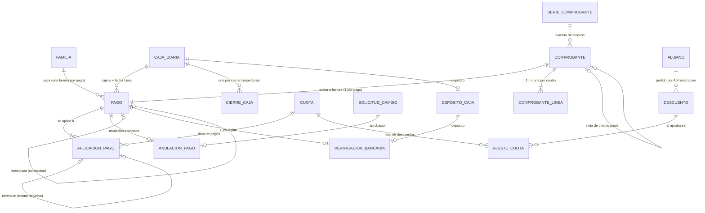

# Sprint 3 · Caja: diseño de arquitectura

> Diseño del agente `arquitecto-software`, 2 de octubre de 2026. Rama base `claude/sprint-2-datos-colegio` (713 pruebas en verde). **No modifiqué el repositorio** (`git status` limpio). Todos los experimentos se hicieron en el scratchpad, y la base MySQL temporal y su usuario se borraron al terminar.
> Paquete base `pe.edu.virgenmaria.cuentasclaras`. El stack no cambia (Spring Boot 4.1.1, Java 21, Hibernate 7.4.5, MySQL 8, H2 2.4.240) y **no se agregan dependencias**.
>
> **Cómo se verificó**
> - **Migraciones:** V9, V10 y V11 se aplicaron sobre las V1–V8 reales del repositorio, en H2 2.4.240 (`MODE=MySQL;DATABASE_TO_LOWER=TRUE`) y en MySQL 8.0.46 (base `cc_s3_exp`).
> - **Permisos y triggers:** se probaron conectado como un `cc_app` de prueba. Fueron unos 95 casos (flujo correcto, los 7 fraudes de la cajera y las 37 sentencias del verificador de prod). Todos respondieron con el código esperado: 1142, 1143, 1644, 3819, 1062 o 1216.
> - **Concurrencia:** dos sesiones MySQL reales (READ COMMITTED, `SELECT ... FOR UPDATE`) cobrando la misma cuota.
> - **Orden de escrituras de Hibernate 7.4.5:** se comprobó con una prueba sobre una copia del proyecto en el scratchpad.
> - **Reglas de dinero** (RUC, redondeo, imputación y vuelto): en Java 21.
> - **APIs de Spring:** `RestClient`, `@TransactionalEventListener(AFTER_COMMIT)` y `@Immutable`, revisadas con `javap` sobre spring-web y spring-tx 7.0.9 e hibernate-core 7.4.5.

## 1. Resumen
- **Libro de pagos de solo inserción.** Las tablas `pago` y `aplicacion_pago` registran el dinero; una anulación agrega reversiones negativas, nunca borra.
  - `cuota.monto_pagado` es la suma del libro de pagos y `cuota.monto_descuento` la suma del libro de descuentos (`ajuste_cuota`).
  - En MySQL un trigger rechaza cualquier otro valor. Así **no puede existir una cuota PAGADA sin pago**, lo que cierra el pendiente de las correcciones del sprint 2.
- **La cajera nunca escribe un monto.** El total es la suma de los saldos de las cuotas que elige. Solo escribe lo que recibe en efectivo (para el vuelto). El pago a cuenta (parcial) queda desactivado por defecto.
- **Comprobante detrás del puerto `EmisorElectronico`.** En este sprint el adaptador es simulado. La numeración por serie no tiene huecos: se bloquea la serie y se guarda el comprobante en la misma transacción que el pago, y un trigger lo vigila.
- **Anulaciones, descuentos, cierres y reaperturas** son `SolicitudCambio` con un manejador nuevo cada una. La aprueba otra persona de Promotoría o Dirección, que no puede ser la cajera del pago.
- **Caja diaria por cajero:**
  - conteo a ciegas con un solo reconteo;
  - el efectivo esperado lo recalcula la base;
  - el cierre lo aprueba otra persona;
  - depósito y verificación bancaria a cargo de Administración;
  - una caja cerrada no acepta efectivo.
  - Las alertas de faltante y sobrante aparecen en «Para revisar» de Promotoría.

## 2. Hallazgos verificados (leer antes de implementar)
1. **Triggers y tablas que aún no existen (MySQL).**
   - `CREATE TRIGGER` acepta un cuerpo que nombra una tabla que todavía no existe.
   - Pero desde ese momento **todo UPDATE sobre la tabla del trigger falla con 1146**, aunque no entre en esa rama: MySQL abre todas las tablas del trigger antes de ejecutar.
   - Por eso `03-triggers.sql` crece **por tanda** (sección 6.3). Nunca apliques la versión final sobre una base que aún no tiene V10 o V11.
2. **Orden real de Hibernate 7.4.5** (comprobado con `show-sql`):
   - con IDENTITY, el `INSERT` sale en el momento del `persist` o `save`;
   - el `UPDATE` de una entidad ya gestionada **espera al flush**.
   - Consecuencia: antes de insertar algo que un trigger valida contra una fila que acabas de modificar, hay que hacer `saveAndFlush`. Los casos concretos:
     - la serie antes del comprobante;
     - el descuento APROBADO antes de sus ajustes;
     - el pago ANULADO antes del pago de reemplazo.
   - En cambio, la fila de anulación (`anulacion_pago`) se inserta **antes** de marcar el pago como ANULADO.
3. **`SELECT ... FOR UPDATE` funciona con un GRANT de UPDATE solo por columna** (MySQL 8.0.46) sobre `serie_comprobante`, `caja_diaria` y `cuota`.
4. **En un trigger, `IF NULL THEN` no entra** (igual que un CHECK con NULL, que pasa).
   - Si no existe la fila de serie, una comparación con `=` no se dispararía.
   - Con `NOT (a <=> b)` y `NOT EXISTS` sí se rechaza: lo comprobé con un comprobante de una serie inexistente.
5. **`MOD(x * 10, 1) = 0` dentro de un CHECK** funciona igual en H2 y MySQL. Sirve para exigir múltiplos de S/ 0.10 en efectivo.
6. **`UNIQUE (colegio_id, medio, operacion_vigente)` con NULL** funciona en ambas bases:
   - acepta muchos pagos en efectivo (NULL);
   - rechaza dos pagos vigentes con el mismo número de Yape (1062);
   - deja reutilizar el número después de anular (pasa a NULL).
7. **La FK compuesta autorreferenciada** `aplicacion_pago(revierte_id, pago_id, cuota_id) → (id, pago_id, cuota_id)` funciona en ambas bases: una reversión no puede apuntar a otra cuota ni a otro pago.
8. **Concurrencia real.**
   - La segunda cajera esperó el bloqueo, leyó la cuota ya PAGADA (READ COMMITTED) y, aun forzando el cobro, la base la rechazó por CHECK (3819).
   - La serie quedó sin huecos: 5 números y 5 comprobantes, porque el rollback devolvió el número.
9. **Los BEFORE INSERT triggers corren antes de las FK, los CHECK y los NOT NULL.**
   - Las 11 inserciones imposibles del verificador (con colegio 0) dan 1644 y no dejan filas.
   - `DECLARE x BOOLEAN DEFAULT (OLD... AND NEW...)` es válido dentro del trigger.
10. **Dinero en Java 21.**
    - Mi primera fórmula de descuento (`divide(100, 4, UNNECESSARY)`) **lanza `ArithmeticException`** con porcentajes de 2 decimales, por ejemplo 89.99 % de 399.99.
    - La fórmula correcta es una sola división con `FLOOR` (sección 10).
    - El dígito verificador del RUC (módulo 11) valida 20131312955 y rechaza 20131312954.
11. **Normativa peruana:**
    - el BCRP retiró la moneda de 5 céntimos desde el 01/01/2019;
    - en efectivo, el redondeo es a favor del consumidor (Ley 29571, art. 44), así que en caja todo monto en efectivo debe ser múltiplo de S/ 0.10;
    - una boleta mayor de S/ 700 exige el documento del adquirente;
    - la serie de una nota de crédito empieza con la letra del comprobante que modifica (B o F) y el correlativo tiene hasta 8 dígitos;
    - los servicios de instituciones educativas para sus fines propios no están gravados con IGV (TUO de la Ley del IGV, art. 2; a confirmar por el contador).
12. **Nubefact.** Su API JSON usa `operacion: "generar_comprobante"` y `tipo_de_comprobante` 1 (factura), 2 (boleta) o 3 (nota de crédito), con `documento_que_se_modifica_*`. **Su web y la de SUNAT están bloqueadas por el proxy de este entorno**: hay que verificar los nombres exactos de los campos y el formato del token cuando se integre (sprint 4 o 6).
13. **H2 gasta valores de identidad en INSERT fallidos** (ya conocido): las pruebas no deben suponer ids.

## 3. Decisiones
1. **Módulos y dependencias:**
   - `comprobantes` (nuevo) solo depende de `comun`;
   - `cobranza` (ya existe) suma descuentos;
   - `caja` (nuevo) depende de `cobranza`, `alumnos`, `comprobantes`, `aprobaciones` y `auditoria`;
   - ni `cobranza` ni `aprobaciones` dependen de `caja` (ArchUnit).
2. **El libro manda.** El pago y sus aplicaciones son de solo inserción.
   - Del pago solo cambian `estado` (VIGENTE → ANULADO) y `operacion_vigente` (pasa a NULL). Es un GRANT por columna, y el trigger exige que exista la anulación aprobada.
   - `Cuota.reflejarPagos(suma)` y `Cuota.reflejarDescuentos(suma)` son los únicos caminos a `monto_pagado` y `monto_descuento`. Una regla ArchUnit limita quién los llama y el trigger compara con el libro.
3. **El saldo se deriva:** `saldo = monto − monto_descuento − monto_pagado`. El monto de la cuota sigue siendo inmutable.
   - Nuevo estado **EXONERADA**: una beca del 100 %, con saldo 0 y sin pagos. Existen becas obligatorias por ley (por ejemplo, la Ley 23585 por orfandad).
4. **Un pago es de una sola familia y de una sola caja (cajero + fecha de Lima).**
   - La FK `(caja_diaria_id, cajero, fecha)` impide mezclar cajas.
   - El trigger impide aplicar el pago a una cuota de otra familia.
5. **Comprobante en la misma transacción que el pago; envío al OSE después del commit.**
   - Un `@TransactionalEventListener(AFTER_COMMIT)` con `REQUIRES_NEW` hace el envío.
   - Si el OSE falla, el pago **no** se revierte: el comprobante queda PENDIENTE y se reintenta (desde el sprint 4).
   - El pago no existe sin comprobante: `comprobante_id NOT NULL UNIQUE`, y el trigger exige el mismo total.
6. **Numeración sin huecos:** `serie_comprobante` con `SELECT ... FOR UPDATE`. El número se toma y se guarda en la misma transacción; un rollback lo devuelve. Los triggers exigen +1 en la serie y que el comprobante use justo ese número.
   - Una anulación **no reutiliza** el número: emite una nota de crédito (BC01 o FC01) con su propio correlativo.
7. **Anulación = solicitud `ANULACION_PAGO`.** La piden la cajera (solo sus pagos) o Administración. La aprueba Promotoría o Dirección, que no puede ser quien la pidió, la cajera del pago ni quien preparó esas cuentas (A5). Hay dos tipos:
   - **DEVOLUCION:** el dinero vuelve al apoderado.
   - **CORRECCION:** el mismo dinero se aplica a otras cuotas, incluso de otra familia. Al aprobarse se crea un **pago de reemplazo** en la **misma caja**, con el mismo medio, el mismo total y el mismo número de operación, y con boleta nueva.
   - **Impacto en la caja:**
     - **Caja abierta:** el pago anulado sale del esperado. En una devolución, el efectivo vuelve desde el cajón. En una corrección, el reemplazo entra en la misma caja y el esperado no cambia.
     - **Caja ya cerrada:** el cierre **no se toca**, porque es inmutable.
       - En una corrección, el reemplazo entra en esa caja cerrada (es la **única** excepción del trigger), así que el efectivo del día no cambia.
       - En una devolución, la anulación se marca `posterior_al_cierre = TRUE`. El detalle de la caja muestra «Anulado después del cierre: −S/ X». El reembolso lo hace Administración desde el banco y queda como alerta «Devolución pendiente».
8. **Descuento = solicitud `DESCUENTO`.**
   - Administración lo pide y lo aprueba Promotoría o Dirección.
   - Al aprobar se **recalcula**. Si el total cambió desde que se pidió (por ejemplo, porque una cuota se pagó en parte), no se aplica (como en A1).
   - Se aplica solo a cuotas PENDIENTE o PARCIAL, con filas de `ajuste_cuota`.
9. **Cierre ciego con un solo reconteo, persistido en `caja_diaria`** (`conteos`, `primer_conteo`):
   - primer conteo sin ver el esperado: si coincide, cierra;
   - si no coincide, la pantalla dice «No coincide, vuelve a contar» **sin mostrar montos**;
   - el reconteo lleva explicación obligatoria y **siempre cierra**.
   - El trigger impide reescribir el primer conteo o reiniciar los intentos, así no se puede «tantear» el esperado.
   - Todo cierre crea una solicitud `CIERRE_CAJA`. Aprobar = aprobado; rechazar = observado (con comentario).
10. **Una caja cerrada no acepta efectivo** (trigger y servicio); los pagos digitales sí.
    - Para reabrir hace falta una solicitud `REAPERTURA_CAJA` aprobada, del mismo día y sin depósito. El trigger exige que la solicitud pendiente esté en la misma transacción.
    - No se cobra nada si el cajero no cerró la caja de un día anterior.
11. **Verificación bancaria (nueva, mínima).** Administración marca cada pago digital y cada depósito como ENCONTRADO o NO_ENCONTRADO frente al estado de cuenta. Nunca lo hace quien cobró o depositó (trigger).
    - Cierra el fraude «cobré en efectivo y lo registré como Yape con un número inventado». El cierre de caja solo no lo detecta.
    - Se habilita el módulo `CONCILIACION` con este alcance reducido.
12. **Doble clic e idempotencia.**
    - La pantalla de revisión emite una `clave_idempotencia` (UUID) única por colegio.
    - Al cobrar, primero se bloquea la caja del cajero y después se busca esa clave: si ya existe, se muestra el mismo pago.
13. **Orden de bloqueos (para evitar interbloqueos):**
    solicitud → caja_diaria → pago (en anulación) → cuotas (por id ascendente) → descuento → serie de boleta o factura → serie de nota de crédito → bitácora (`auditoria_cadena`).
14. **Montos en efectivo múltiplos de S/ 0.10** (CHECK en `pago`, `cierre_caja` y `deposito_caja`). Los descuentos se redondean a favor del apoderado para mantener esa regla.
15. **Alertas:** el puerto `comun.alertas.AlertasRevision` pasa de `List<String>` a `List<AlertaRevision>` (gravedad, módulo, texto, enlace), así un faltante aparece primero y en rojo. Se adaptan `AlertasCobranza` y la plantilla de Promotoría. No hay tareas programadas: todo se calcula al consultar.
16. **`ManejadorSolicitud` gana dos métodos por defecto:**
    - `Set<String> involucrados(SolicitudCambio)`, por ejemplo la cajera del pago, para que `BandejaAprobaciones` amplíe el control de participantes;
    - `List<String> detalle(SolicitudCambio)`, para las tarjetas de la bandeja.
    - Los tipos nuevos no requieren migración: `solicitud_cambio.tipo` es VARCHAR sin CHECK.

## 4. Modelo

**Invariantes.** «(base)» significa que también lo garantiza la base de datos; «(MySQL)» significa que lo garantiza un trigger.

- **Cuota:**
  - `monto_pagado` es igual a Σ `aplicacion_pago.monto` y `monto_descuento` a Σ `ajuste_cuota.monto` (MySQL);
  - `monto_pagado + monto_descuento ≤ monto` (base);
  - el estado es coherente con los montos: PENDIENTE, PARCIAL, PAGADA, EXONERADA o ANULADA (base);
  - nace PENDIENTE, en 0 y sin descuento (MySQL);
  - una cuota anulada no cambia (MySQL).
- **Pago:**
  - no se borra (1142);
  - familia, caja, medio, operación, total, vuelto y comprobante son inmutables (1143);
  - nace VIGENTE, con boleta o factura del mismo total (MySQL);
  - en efectivo, solo en una caja ABIERTA, salvo un reemplazo de la misma caja, medio y total (MySQL);
  - en efectivo, `recibido = total + vuelto`, `0 ≤ vuelto < 200` y múltiplos de 0.10 (base);
  - si es digital, el número de operación es obligatorio y único mientras el pago está vigente (base);
  - solo pasa de VIGENTE a ANULADO, con su anulación registrada (MySQL);
  - un pago de origen CAJA lo crea su cajero (base).
- **Aplicación:**
  - solo inserción;
  - solo a cuotas de la familia del pago, y Σ ≤ total del pago (MySQL);
  - una aplicación y como máximo una reversión por pago y cuota (base);
  - la reversión es exactamente el negativo de la original y exige la anulación (MySQL).
- **Comprobante:**
  - serie y número únicos, el número es el siguiente de la serie y la serie avanza de uno en uno (base y MySQL);
  - la nota de crédito anula **un** comprobante y usa su letra (base y MySQL);
  - los datos tributarios son inmutables (1143);
  - una factura lleva RUC de 11 dígitos y una boleta, DNI, CE o pasaporte (base).
- **Anulación:**
  - una por pago y por solicitud;
  - el aprobador es distinto del solicitante y de la cajera del pago (base);
  - el monto y la nota de crédito corresponden al pago (MySQL).
- **Descuento:**
  - nace SOLICITADO y, una vez resuelto, no cambia (MySQL);
  - quien resuelve no es quien pidió (base);
  - el ajuste exige un descuento APROBADO del mismo alumno que incluya esa cuota (MySQL).
- **Caja:**
  - una por cajero y día; la abre el propio cajero (base);
  - nace ABIERTA (MySQL);
  - se cierra solo con un cierre registrado y se reabre solo con una reapertura en aprobación y sin depósito (MySQL);
  - el primer conteo no se reescribe (MySQL).
- **Cierre:**
  - `esperado = fondo + efectivo` y `diferencia = contado − esperado` (base);
  - el efectivo cobrado es igual a Σ de los pagos en efectivo VIGENTES de la caja (MySQL);
  - con diferencia, la explicación es obligatoria (base);
  - lo registra la cajera de una caja abierta (MySQL) y lo revisa otra persona (base);
  - una vez revisado no cambia (MySQL).
- **Depósito y verificación:**
  - solo inserción;
  - un depósito por caja;
  - un depósito distinto de lo esperado exige explicación (base);
  - verifica alguien que no cobró ni depositó, y solo pagos digitales (MySQL).

## 5. Migraciones Flyway (probadas completas en H2 2.4.240 MODE=MySQL y MySQL 8.0.46)

### `V9__caja_pagos_y_comprobantes.sql` (tanda 1)
```sql
-- Sprint 3, tanda 1: comprobantes con numeración sin huecos, caja diaria por cajero, pagos y su libro de aplicaciones.
-- Nada se borra (sin DELETE para cc_app). comprobante_linea y aplicacion_pago son de SOLO INSERCIÓN; en serie, comprobante,
-- caja_diaria, pago y cuota el UPDATE es por columna (scripts/mysql/02-permisos-tablas.sql) y los triggers de
-- scripts/mysql/03-triggers.sql vigilan lo que el GRANT no distingue (correlativo, monto pagado = libro, caja cerrada).

-- Serie de comprobantes (B001, F001, BC01, FC01) con su último número. Se bloquea (SELECT ... FOR UPDATE) para emitir:
-- el número y el comprobante se guardan en la misma transacción, así un error no deja huecos.
CREATE TABLE serie_comprobante (
    id              BIGINT       NOT NULL AUTO_INCREMENT PRIMARY KEY,
    colegio_id      BIGINT       NOT NULL,
    tipo            VARCHAR(20)  NOT NULL,
    serie           VARCHAR(4)   NOT NULL,
    proveedor       VARCHAR(20)  NOT NULL,
    ultimo_numero   INT          NOT NULL DEFAULT 0,
    creado_en       DATETIME(6)  NOT NULL,
    creado_por      VARCHAR(60)  NOT NULL,
    actualizado_en  DATETIME(6)  NOT NULL,
    version         BIGINT       NOT NULL DEFAULT 0,
    CONSTRAINT uk_serie_comprobante_serie UNIQUE (colegio_id, serie),
    CONSTRAINT uk_serie_comprobante_id_colegio UNIQUE (id, colegio_id),
    CONSTRAINT uk_serie_comprobante_clave UNIQUE (id, colegio_id, tipo, serie),
    CONSTRAINT fk_serie_comprobante_colegio FOREIGN KEY (colegio_id) REFERENCES colegio (id),
    CONSTRAINT ck_serie_comprobante_tipo CHECK (tipo IN ('BOLETA', 'FACTURA', 'NOTA_CREDITO')),
    CONSTRAINT ck_serie_comprobante_formato CHECK (CHAR_LENGTH(serie) = 4
        AND ((tipo = 'BOLETA' AND serie LIKE 'B%') OR (tipo = 'FACTURA' AND serie LIKE 'F%')
            OR (tipo = 'NOTA_CREDITO' AND (serie LIKE 'B%' OR serie LIKE 'F%')))),
    CONSTRAINT ck_serie_comprobante_proveedor CHECK (proveedor IN ('SIMULADO', 'NUBEFACT')),
    CONSTRAINT ck_serie_comprobante_numero CHECK (ultimo_numero BETWEEN 0 AND 99999999)
);

-- Comprobante emitido (boleta, factura o nota de crédito). Sus datos tributarios no cambian; solo su estado de envío al
-- OSE. Una nota de crédito anula por completo UN comprobante (uk_comprobante_modifica).
CREATE TABLE comprobante (
    id                         BIGINT         NOT NULL AUTO_INCREMENT PRIMARY KEY,
    colegio_id                 BIGINT         NOT NULL,
    serie_id                   BIGINT         NOT NULL,
    tipo                       VARCHAR(20)    NOT NULL,
    serie                      VARCHAR(4)     NOT NULL,
    numero                     INT            NOT NULL,
    fecha_emision              DATE           NOT NULL,
    receptor_tipo_documento    VARCHAR(20)    NOT NULL,
    receptor_numero_documento  VARCHAR(12)    NOT NULL,
    receptor_nombre            VARCHAR(150)   NOT NULL,
    moneda                     VARCHAR(3)     NOT NULL,
    total                      DECIMAL(10,2)  NOT NULL,
    afectacion_igv             VARCHAR(20)    NOT NULL,
    modifica_id                BIGINT,
    motivo_nota                VARCHAR(250),
    proveedor                  VARCHAR(20)    NOT NULL,
    estado_envio               VARCHAR(20)    NOT NULL,
    intentos                   INT            NOT NULL DEFAULT 0,
    enviado_en                 DATETIME(6),
    respuesta                  VARCHAR(500),
    codigo_hash                VARCHAR(100),
    enlace_pdf                 VARCHAR(300),
    creado_en                  DATETIME(6)    NOT NULL,
    creado_por                 VARCHAR(60)    NOT NULL,
    actualizado_en             DATETIME(6)    NOT NULL,
    version                    BIGINT         NOT NULL DEFAULT 0,
    CONSTRAINT uk_comprobante_numero UNIQUE (colegio_id, serie, numero),
    CONSTRAINT uk_comprobante_id_colegio UNIQUE (id, colegio_id),
    CONSTRAINT uk_comprobante_modifica UNIQUE (colegio_id, modifica_id),
    CONSTRAINT fk_comprobante_colegio FOREIGN KEY (colegio_id) REFERENCES colegio (id),
    CONSTRAINT fk_comprobante_serie FOREIGN KEY (serie_id, colegio_id, tipo, serie)
        REFERENCES serie_comprobante (id, colegio_id, tipo, serie),
    CONSTRAINT fk_comprobante_modifica FOREIGN KEY (modifica_id, colegio_id) REFERENCES comprobante (id, colegio_id),
    CONSTRAINT ck_comprobante_numero CHECK (numero BETWEEN 1 AND 99999999),
    CONSTRAINT ck_comprobante_total CHECK (total > 0),
    CONSTRAINT ck_comprobante_moneda CHECK (moneda = 'PEN'),
    CONSTRAINT ck_comprobante_afectacion CHECK (afectacion_igv IN ('INAFECTO', 'EXONERADO')),
    CONSTRAINT ck_comprobante_receptor CHECK (receptor_tipo_documento IN ('DNI', 'CE', 'PASAPORTE', 'RUC')
        AND (receptor_tipo_documento <> 'RUC' OR CHAR_LENGTH(receptor_numero_documento) = 11)
        AND (receptor_tipo_documento <> 'DNI' OR CHAR_LENGTH(receptor_numero_documento) = 8)),
    CONSTRAINT ck_comprobante_tipo CHECK ((tipo = 'FACTURA' AND receptor_tipo_documento = 'RUC' AND modifica_id IS NULL
            AND motivo_nota IS NULL)
        OR (tipo = 'BOLETA' AND receptor_tipo_documento <> 'RUC' AND modifica_id IS NULL AND motivo_nota IS NULL)
        OR (tipo = 'NOTA_CREDITO' AND modifica_id IS NOT NULL AND motivo_nota IS NOT NULL)),
    CONSTRAINT ck_comprobante_proveedor CHECK (proveedor IN ('SIMULADO', 'NUBEFACT')),
    CONSTRAINT ck_comprobante_envio CHECK (estado_envio IN ('PENDIENTE', 'ACEPTADO', 'OBSERVADO', 'RECHAZADO')
        AND intentos >= 0)
);
CREATE INDEX ix_comprobante_fecha ON comprobante (colegio_id, fecha_emision);
CREATE INDEX ix_comprobante_envio ON comprobante (colegio_id, estado_envio);

-- Líneas del comprobante (una por cuota pagada). Solo inserción.
CREATE TABLE comprobante_linea (
    id              BIGINT         NOT NULL AUTO_INCREMENT PRIMARY KEY,
    colegio_id      BIGINT         NOT NULL,
    comprobante_id  BIGINT         NOT NULL,
    orden           INT            NOT NULL,
    descripcion     VARCHAR(250)   NOT NULL,
    monto           DECIMAL(10,2)  NOT NULL,
    creado_en       DATETIME(6)    NOT NULL,
    creado_por      VARCHAR(60)    NOT NULL,
    actualizado_en  DATETIME(6)    NOT NULL,
    version         BIGINT         NOT NULL DEFAULT 0,
    CONSTRAINT uk_comprobante_linea_orden UNIQUE (comprobante_id, orden),
    CONSTRAINT fk_comprobante_linea_colegio FOREIGN KEY (colegio_id) REFERENCES colegio (id),
    CONSTRAINT fk_comprobante_linea_comprobante FOREIGN KEY (comprobante_id, colegio_id)
        REFERENCES comprobante (id, colegio_id),
    CONSTRAINT ck_comprobante_linea_monto CHECK (monto > 0 AND orden >= 1)
);

-- Caja de un cajero en un día (hora de Lima). Se abre con el primer pago; la abre y la cierra su cajero.
-- "cierres" cuenta los cierres hechos: cada cierre es una fila de cierre_caja con numero = cierres.
CREATE TABLE caja_diaria (
    id              BIGINT         NOT NULL AUTO_INCREMENT PRIMARY KEY,
    colegio_id      BIGINT         NOT NULL,
    cajero          VARCHAR(60)    NOT NULL,
    fecha           DATE           NOT NULL,
    fondo_fijo      DECIMAL(10,2)  NOT NULL,
    estado          VARCHAR(20)    NOT NULL,
    cierres         INT            NOT NULL DEFAULT 0,
    conteos         INT            NOT NULL DEFAULT 0,
    primer_conteo   DECIMAL(10,2),
    creado_en       DATETIME(6)    NOT NULL,
    creado_por      VARCHAR(60)    NOT NULL,
    actualizado_en  DATETIME(6)    NOT NULL,
    version         BIGINT         NOT NULL DEFAULT 0,
    CONSTRAINT uk_caja_diaria_cajero_fecha UNIQUE (colegio_id, cajero, fecha),
    CONSTRAINT uk_caja_diaria_id_colegio UNIQUE (id, colegio_id),
    CONSTRAINT uk_caja_diaria_id_cajero_fecha UNIQUE (id, cajero, fecha),
    CONSTRAINT fk_caja_diaria_colegio FOREIGN KEY (colegio_id) REFERENCES colegio (id),
    CONSTRAINT ck_caja_diaria_estado CHECK (estado IN ('ABIERTA', 'CERRADA')),
    CONSTRAINT ck_caja_diaria_cajero CHECK (cajero = creado_por),
    CONSTRAINT ck_caja_diaria_montos CHECK (fondo_fijo >= 0 AND cierres >= 0 AND conteos >= 0),
    CONSTRAINT ck_caja_diaria_conteo CHECK ((conteos = 0 AND primer_conteo IS NULL)
        OR (conteos > 0 AND primer_conteo IS NOT NULL AND primer_conteo >= 0 AND MOD(primer_conteo * 10, 1) = 0)),
    CONSTRAINT ck_caja_diaria_cierres CHECK (estado = 'ABIERTA' OR cierres >= 1)
);

-- Pago: dinero recibido de UNA familia. Libro de solo inserción salvo la anulación (estado y operacion_vigente).
-- operacion_vigente: el número de operación de un pago digital mientras está vigente (NULL al anularse); su UNIQUE
-- impide registrar dos veces el mismo Yape, Plin, transferencia o voucher.
-- (caja_diaria_id, cajero, fecha) apunta a la caja de ESE cajero en ESE día: la base rechaza mezclar cajas.
CREATE TABLE pago (
    id                  BIGINT         NOT NULL AUTO_INCREMENT PRIMARY KEY,
    colegio_id          BIGINT         NOT NULL,
    familia_id          BIGINT         NOT NULL,
    caja_diaria_id      BIGINT         NOT NULL,
    cajero              VARCHAR(60)    NOT NULL,
    fecha               DATE           NOT NULL,
    comprobante_id      BIGINT         NOT NULL,
    medio               VARCHAR(20)    NOT NULL,
    numero_operacion    VARCHAR(30),
    operacion_vigente   VARCHAR(30),
    total               DECIMAL(10,2)  NOT NULL,
    recibido            DECIMAL(10,2),
    vuelto              DECIMAL(10,2),
    a_cuenta            BOOLEAN        NOT NULL DEFAULT FALSE,
    origen              VARCHAR(20)    NOT NULL,
    reemplaza_pago_id   BIGINT,
    clave_idempotencia  VARCHAR(36)    NOT NULL,
    estado              VARCHAR(20)    NOT NULL,
    creado_en           DATETIME(6)    NOT NULL,
    creado_por          VARCHAR(60)    NOT NULL,
    actualizado_en      DATETIME(6)    NOT NULL,
    version             BIGINT         NOT NULL DEFAULT 0,
    CONSTRAINT uk_pago_idempotencia UNIQUE (colegio_id, clave_idempotencia),
    CONSTRAINT uk_pago_operacion UNIQUE (colegio_id, medio, operacion_vigente),
    CONSTRAINT uk_pago_comprobante UNIQUE (comprobante_id),
    CONSTRAINT uk_pago_reemplaza UNIQUE (reemplaza_pago_id),
    CONSTRAINT uk_pago_id_colegio UNIQUE (id, colegio_id),
    CONSTRAINT fk_pago_colegio FOREIGN KEY (colegio_id) REFERENCES colegio (id),
    CONSTRAINT fk_pago_familia FOREIGN KEY (familia_id, colegio_id) REFERENCES familia (id, colegio_id),
    CONSTRAINT fk_pago_caja FOREIGN KEY (caja_diaria_id, colegio_id) REFERENCES caja_diaria (id, colegio_id),
    CONSTRAINT fk_pago_caja_cajero FOREIGN KEY (caja_diaria_id, cajero, fecha) REFERENCES caja_diaria (id, cajero, fecha),
    CONSTRAINT fk_pago_comprobante FOREIGN KEY (comprobante_id, colegio_id) REFERENCES comprobante (id, colegio_id),
    CONSTRAINT fk_pago_reemplaza FOREIGN KEY (reemplaza_pago_id, colegio_id) REFERENCES pago (id, colegio_id),
    CONSTRAINT ck_pago_medio CHECK (medio IN ('EFECTIVO', 'YAPE', 'PLIN', 'TRANSFERENCIA', 'TARJETA')),
    CONSTRAINT ck_pago_estado CHECK (estado IN ('VIGENTE', 'ANULADO')),
    CONSTRAINT ck_pago_total CHECK (total > 0 AND total <= 99999.99),
    CONSTRAINT ck_pago_efectivo CHECK ((medio = 'EFECTIVO' AND numero_operacion IS NULL AND operacion_vigente IS NULL
            AND recibido IS NOT NULL AND vuelto IS NOT NULL AND vuelto >= 0 AND vuelto < 200
            AND recibido = total + vuelto)
        OR (medio <> 'EFECTIVO' AND numero_operacion IS NOT NULL AND recibido IS NULL AND vuelto IS NULL
            AND ((estado = 'VIGENTE' AND operacion_vigente IS NOT NULL AND operacion_vigente = numero_operacion)
                OR (estado = 'ANULADO' AND operacion_vigente IS NULL)))),
    -- Sin monedas de 1 ni 5 céntimos (BCRP, 2019): en efectivo todo es múltiplo de S/ 0.10.
    CONSTRAINT ck_pago_efectivo_decimos CHECK (medio <> 'EFECTIVO'
        OR (MOD(total * 10, 1) = 0 AND MOD(recibido * 10, 1) = 0)),
    CONSTRAINT ck_pago_origen CHECK ((origen = 'CAJA' AND reemplaza_pago_id IS NULL AND creado_por = cajero)
        OR (origen = 'REEMPLAZO' AND reemplaza_pago_id IS NOT NULL AND creado_por <> cajero))
);
CREATE INDEX ix_pago_caja ON pago (colegio_id, caja_diaria_id, medio, estado);
CREATE INDEX ix_pago_familia ON pago (colegio_id, familia_id, fecha);
CREATE INDEX ix_pago_fecha ON pago (colegio_id, fecha);

-- Libro de aplicaciones: cuánto de cada pago se aplicó a cada cuota. SOLO INSERCIÓN. Al anular un pago se agregan
-- REVERSIONES (monto negativo) que apuntan a la aplicación original del mismo pago y la misma cuota.
-- cuota.monto_pagado = suma de las filas de la cuota (lo verifica el trigger trg_cuota_libro en MySQL).
CREATE TABLE aplicacion_pago (
    id              BIGINT         NOT NULL AUTO_INCREMENT PRIMARY KEY,
    colegio_id      BIGINT         NOT NULL,
    pago_id         BIGINT         NOT NULL,
    cuota_id        BIGINT         NOT NULL,
    tipo            VARCHAR(20)    NOT NULL,
    monto           DECIMAL(10,2)  NOT NULL,
    revierte_id     BIGINT,
    creado_en       DATETIME(6)    NOT NULL,
    creado_por      VARCHAR(60)    NOT NULL,
    actualizado_en  DATETIME(6)    NOT NULL,
    version         BIGINT         NOT NULL DEFAULT 0,
    CONSTRAINT uk_aplicacion_pago_unica UNIQUE (colegio_id, pago_id, cuota_id, tipo),
    CONSTRAINT uk_aplicacion_pago_id_pago_cuota UNIQUE (id, pago_id, cuota_id),
    CONSTRAINT fk_aplicacion_pago_colegio FOREIGN KEY (colegio_id) REFERENCES colegio (id),
    CONSTRAINT fk_aplicacion_pago_pago FOREIGN KEY (pago_id, colegio_id) REFERENCES pago (id, colegio_id),
    CONSTRAINT fk_aplicacion_pago_cuota FOREIGN KEY (cuota_id, colegio_id) REFERENCES cuota (id, colegio_id),
    CONSTRAINT fk_aplicacion_pago_revierte FOREIGN KEY (revierte_id, pago_id, cuota_id)
        REFERENCES aplicacion_pago (id, pago_id, cuota_id),
    CONSTRAINT ck_aplicacion_pago_tipo CHECK ((tipo = 'APLICACION' AND revierte_id IS NULL AND monto > 0)
        OR (tipo = 'REVERSION' AND revierte_id IS NOT NULL AND monto < 0))
);
CREATE INDEX ix_aplicacion_pago_cuota ON aplicacion_pago (cuota_id, colegio_id);

-- Cuota: el descuento aprobado también es un libro (ajuste_cuota, tanda 2). Saldo = monto - descuento - pagado.
-- EXONERADA: un descuento o beca del 100 % (saldo 0 sin pagos). Se reemplazan los CHECK de V7.
ALTER TABLE cuota ADD COLUMN monto_descuento DECIMAL(10,2) NOT NULL DEFAULT 0.00;
ALTER TABLE cuota DROP CONSTRAINT ck_cuota_estado;
ALTER TABLE cuota ADD CONSTRAINT ck_cuota_estado CHECK (estado IN ('PENDIENTE', 'PARCIAL', 'PAGADA', 'EXONERADA',
    'ANULADA'));
ALTER TABLE cuota DROP CONSTRAINT ck_cuota_montos;
ALTER TABLE cuota ADD CONSTRAINT ck_cuota_montos CHECK (monto > 0 AND monto_pagado >= 0 AND monto_descuento >= 0
    AND monto_pagado + monto_descuento <= monto);
ALTER TABLE cuota DROP CONSTRAINT ck_cuota_estado_pago;
ALTER TABLE cuota ADD CONSTRAINT ck_cuota_estado_pago CHECK (
    (estado = 'PENDIENTE' AND monto_pagado = 0 AND monto_descuento < monto)
    OR (estado = 'PARCIAL' AND monto_pagado > 0 AND monto_pagado + monto_descuento < monto)
    OR (estado = 'PAGADA' AND monto_pagado > 0 AND monto_pagado + monto_descuento = monto)
    OR (estado = 'EXONERADA' AND monto_pagado = 0 AND monto_descuento = monto)
    OR (estado = 'ANULADA' AND monto_pagado = 0));
```

### `V10__anulaciones_y_descuentos.sql` (tanda 2)
```sql
-- Sprint 3, tanda 2: anulación de pagos (aprobada por otra persona, con nota de crédito) y descuentos o becas.
-- anulacion_pago y ajuste_cuota son de SOLO INSERCIÓN. descuento: lo pedido no cambia, solo se resuelve.

-- Anulación aprobada de un pago: una por pago. Quien aprueba no es quien la pidió ni quien cobró (también en la base).
-- posterior_al_cierre: el pago era de una caja ya cerrada; ese cierre no se toca y la anulación se muestra como
-- ajuste posterior (DEVOLUCION) o se compensa con el pago de reemplazo en la misma caja (CORRECCION).
CREATE TABLE anulacion_pago (
    id                   BIGINT         NOT NULL AUTO_INCREMENT PRIMARY KEY,
    colegio_id           BIGINT         NOT NULL,
    pago_id              BIGINT         NOT NULL,
    solicitud_id         BIGINT         NOT NULL,
    nota_credito_id      BIGINT         NOT NULL,
    tipo                 VARCHAR(20)    NOT NULL,
    motivo               VARCHAR(500)   NOT NULL,
    monto                DECIMAL(10,2)  NOT NULL,
    cajero_pago          VARCHAR(60)    NOT NULL,
    solicitado_por       VARCHAR(60)    NOT NULL,
    aprobado_por         VARCHAR(60)    NOT NULL,
    posterior_al_cierre  BOOLEAN        NOT NULL,
    creado_en            DATETIME(6)    NOT NULL,
    creado_por           VARCHAR(60)    NOT NULL,
    actualizado_en       DATETIME(6)    NOT NULL,
    version              BIGINT         NOT NULL DEFAULT 0,
    CONSTRAINT uk_anulacion_pago_pago UNIQUE (colegio_id, pago_id),
    CONSTRAINT uk_anulacion_pago_solicitud UNIQUE (colegio_id, solicitud_id),
    CONSTRAINT uk_anulacion_pago_nota UNIQUE (colegio_id, nota_credito_id),
    CONSTRAINT fk_anulacion_pago_colegio FOREIGN KEY (colegio_id) REFERENCES colegio (id),
    CONSTRAINT fk_anulacion_pago_pago FOREIGN KEY (pago_id, colegio_id) REFERENCES pago (id, colegio_id),
    CONSTRAINT fk_anulacion_pago_solicitud FOREIGN KEY (solicitud_id, colegio_id)
        REFERENCES solicitud_cambio (id, colegio_id),
    CONSTRAINT fk_anulacion_pago_nota FOREIGN KEY (nota_credito_id, colegio_id) REFERENCES comprobante (id, colegio_id),
    CONSTRAINT ck_anulacion_pago_tipo CHECK (tipo IN ('DEVOLUCION', 'CORRECCION')),
    CONSTRAINT ck_anulacion_pago_monto CHECK (monto > 0),
    CONSTRAINT ck_anulacion_pago_segregacion CHECK (aprobado_por = creado_por AND aprobado_por <> solicitado_por
        AND aprobado_por <> cajero_pago)
);

-- Descuento o beca pedido por Administración para cuotas de UN alumno; lo aprueba Promotoría o Dirección.
-- cuotas: «,12,13,14,» (las cuotas pedidas). total_estimado: lo que dejaría de cobrarse, para quien aprueba.
CREATE TABLE descuento (
    id               BIGINT         NOT NULL AUTO_INCREMENT PRIMARY KEY,
    colegio_id       BIGINT         NOT NULL,
    alumno_id        BIGINT         NOT NULL,
    anio_escolar_id  BIGINT         NOT NULL,
    tipo             VARCHAR(20)    NOT NULL,
    modalidad        VARCHAR(20)    NOT NULL,
    valor            DECIMAL(10,2)  NOT NULL,
    cuotas           VARCHAR(500)   NOT NULL,
    total_estimado   DECIMAL(10,2)  NOT NULL,
    motivo           VARCHAR(500)   NOT NULL,
    sustento         VARCHAR(200)   NOT NULL,
    estado           VARCHAR(20)    NOT NULL,
    resuelto_por     VARCHAR(60),
    resuelto_en      DATETIME(6),
    creado_en        DATETIME(6)    NOT NULL,
    creado_por       VARCHAR(60)    NOT NULL,
    actualizado_en   DATETIME(6)    NOT NULL,
    version          BIGINT         NOT NULL DEFAULT 0,
    CONSTRAINT uk_descuento_id_colegio UNIQUE (id, colegio_id),
    CONSTRAINT uk_descuento_id_alumno UNIQUE (id, alumno_id),
    CONSTRAINT fk_descuento_colegio FOREIGN KEY (colegio_id) REFERENCES colegio (id),
    CONSTRAINT fk_descuento_alumno FOREIGN KEY (alumno_id, colegio_id) REFERENCES alumno (id, colegio_id),
    CONSTRAINT fk_descuento_anio FOREIGN KEY (anio_escolar_id, colegio_id) REFERENCES anio_escolar (id, colegio_id),
    CONSTRAINT ck_descuento_tipo CHECK (tipo IN ('HERMANOS', 'BECA', 'OTRO')),
    CONSTRAINT ck_descuento_valor CHECK ((modalidad = 'PORCENTAJE' AND valor > 0 AND valor <= 100)
        OR (modalidad = 'MONTO' AND valor > 0 AND valor <= 99999.99)),
    CONSTRAINT ck_descuento_total CHECK (total_estimado > 0),
    CONSTRAINT ck_descuento_cuotas CHECK (cuotas LIKE ',%,'),
    CONSTRAINT ck_descuento_estado CHECK ((estado = 'SOLICITADO' AND resuelto_por IS NULL AND resuelto_en IS NULL)
        OR (estado IN ('APROBADO', 'RECHAZADO') AND resuelto_por IS NOT NULL AND resuelto_en IS NOT NULL
            AND resuelto_por <> creado_por))
);
CREATE INDEX ix_descuento_estado ON descuento (colegio_id, estado);

-- Ajuste de una cuota por un descuento aprobado. SOLO INSERCIÓN. cuota.monto_descuento = suma de sus ajustes.
-- (descuento_id, alumno_id) impide aplicar el descuento de un alumno a la cuota de otro... junto con el trigger.
CREATE TABLE ajuste_cuota (
    id              BIGINT         NOT NULL AUTO_INCREMENT PRIMARY KEY,
    colegio_id      BIGINT         NOT NULL,
    cuota_id        BIGINT         NOT NULL,
    descuento_id    BIGINT         NOT NULL,
    monto           DECIMAL(10,2)  NOT NULL,
    creado_en       DATETIME(6)    NOT NULL,
    creado_por      VARCHAR(60)    NOT NULL,
    actualizado_en  DATETIME(6)    NOT NULL,
    version         BIGINT         NOT NULL DEFAULT 0,
    CONSTRAINT uk_ajuste_cuota_unico UNIQUE (colegio_id, cuota_id, descuento_id),
    CONSTRAINT fk_ajuste_cuota_colegio FOREIGN KEY (colegio_id) REFERENCES colegio (id),
    CONSTRAINT fk_ajuste_cuota_cuota FOREIGN KEY (cuota_id, colegio_id) REFERENCES cuota (id, colegio_id),
    CONSTRAINT fk_ajuste_cuota_descuento FOREIGN KEY (descuento_id, colegio_id) REFERENCES descuento (id, colegio_id),
    CONSTRAINT ck_ajuste_cuota_monto CHECK (monto > 0)
);
CREATE INDEX ix_ajuste_cuota_cuota ON ajuste_cuota (cuota_id, colegio_id);
```

### `V11__cierre_de_caja.sql` (tanda 3)
```sql
-- Sprint 3, tanda 3: cierre de caja (conteo a ciegas, diferencia y revisión), depósito del efectivo y verificación
-- bancaria de pagos digitales y depósitos por Administración. cierre_caja: el conteo no cambia, solo se revisa.
-- deposito_caja y verificacion_bancaria: SOLO INSERCIÓN.

-- Cierre de una caja. numero = caja_diaria.cierres (1 el primero; 2 tras una reapertura aprobada...).
-- esperado = fondo_fijo + efectivo_cobrado (pagos en efectivo VIGENTES de la caja); lo recalcula el trigger en MySQL.
-- primer_conteo: lo que contó a ciegas; contado: el conteo final (igual al primero si no hubo reconteo).
CREATE TABLE cierre_caja (
    id                   BIGINT         NOT NULL AUTO_INCREMENT PRIMARY KEY,
    colegio_id           BIGINT         NOT NULL,
    caja_diaria_id       BIGINT         NOT NULL,
    numero               INT            NOT NULL,
    fondo_fijo           DECIMAL(10,2)  NOT NULL,
    efectivo_cobrado     DECIMAL(10,2)  NOT NULL,
    esperado             DECIMAL(10,2)  NOT NULL,
    primer_conteo        DECIMAL(10,2)  NOT NULL,
    contado              DECIMAL(10,2)  NOT NULL,
    diferencia           DECIMAL(10,2)  NOT NULL,
    denominaciones       VARCHAR(300),
    explicacion          VARCHAR(500),
    pagos_efectivo       INT            NOT NULL,
    pagos_digitales      INT            NOT NULL,
    total_digital        DECIMAL(10,2)  NOT NULL,
    estado               VARCHAR(20)    NOT NULL,
    revisado_por         VARCHAR(60),
    revisado_en          DATETIME(6),
    comentario_revision  VARCHAR(500),
    creado_en            DATETIME(6)    NOT NULL,
    creado_por           VARCHAR(60)    NOT NULL,
    actualizado_en       DATETIME(6)    NOT NULL,
    version              BIGINT         NOT NULL DEFAULT 0,
    CONSTRAINT uk_cierre_caja_numero UNIQUE (colegio_id, caja_diaria_id, numero),
    CONSTRAINT uk_cierre_caja_id_colegio UNIQUE (id, colegio_id),
    CONSTRAINT fk_cierre_caja_colegio FOREIGN KEY (colegio_id) REFERENCES colegio (id),
    CONSTRAINT fk_cierre_caja_caja FOREIGN KEY (caja_diaria_id, colegio_id) REFERENCES caja_diaria (id, colegio_id),
    CONSTRAINT ck_cierre_caja_montos CHECK (numero >= 1 AND fondo_fijo >= 0 AND efectivo_cobrado >= 0
        AND esperado = fondo_fijo + efectivo_cobrado AND primer_conteo >= 0 AND contado >= 0
        AND diferencia = contado - esperado AND pagos_efectivo >= 0 AND pagos_digitales >= 0 AND total_digital >= 0),
    CONSTRAINT ck_cierre_caja_decimos CHECK (MOD(primer_conteo * 10, 1) = 0 AND MOD(contado * 10, 1) = 0),
    CONSTRAINT ck_cierre_caja_explicacion CHECK (diferencia = 0 OR explicacion IS NOT NULL),
    CONSTRAINT ck_cierre_caja_estado CHECK ((estado = 'POR_REVISAR' AND revisado_por IS NULL AND revisado_en IS NULL)
        OR (estado IN ('APROBADO', 'OBSERVADO') AND revisado_por IS NOT NULL AND revisado_en IS NOT NULL
            AND revisado_por <> creado_por)),
    CONSTRAINT ck_cierre_caja_observado CHECK (estado <> 'OBSERVADO' OR comentario_revision IS NOT NULL)
);
CREATE INDEX ix_cierre_caja_estado ON cierre_caja (colegio_id, estado);

-- Depósito en el banco del efectivo de una caja (una por caja en el MVP).
CREATE TABLE deposito_caja (
    id                BIGINT         NOT NULL AUTO_INCREMENT PRIMARY KEY,
    colegio_id        BIGINT         NOT NULL,
    caja_diaria_id    BIGINT         NOT NULL,
    cuenta            VARCHAR(60)    NOT NULL,
    numero_operacion  VARCHAR(30)    NOT NULL,
    fecha_deposito    DATE           NOT NULL,
    monto             DECIMAL(10,2)  NOT NULL,
    esperado          DECIMAL(10,2)  NOT NULL,
    explicacion       VARCHAR(500),
    creado_en         DATETIME(6)    NOT NULL,
    creado_por        VARCHAR(60)    NOT NULL,
    actualizado_en    DATETIME(6)    NOT NULL,
    version           BIGINT         NOT NULL DEFAULT 0,
    CONSTRAINT uk_deposito_caja_caja UNIQUE (colegio_id, caja_diaria_id),
    CONSTRAINT uk_deposito_caja_operacion UNIQUE (colegio_id, cuenta, numero_operacion),
    CONSTRAINT uk_deposito_caja_id_colegio UNIQUE (id, colegio_id),
    CONSTRAINT fk_deposito_caja_colegio FOREIGN KEY (colegio_id) REFERENCES colegio (id),
    CONSTRAINT fk_deposito_caja_caja FOREIGN KEY (caja_diaria_id, colegio_id) REFERENCES caja_diaria (id, colegio_id),
    CONSTRAINT ck_deposito_caja_monto CHECK (monto > 0 AND esperado >= 0 AND MOD(monto * 10, 1) = 0),
    CONSTRAINT ck_deposito_caja_explicacion CHECK (monto = esperado OR explicacion IS NOT NULL)
);

-- Verificación contra el estado de cuenta del banco (o de Yape/Plin) de un pago digital o de un depósito.
-- La hace Administración; nunca quien cobró o depositó (trigger en MySQL). Una por pago o depósito.
CREATE TABLE verificacion_bancaria (
    id              BIGINT         NOT NULL AUTO_INCREMENT PRIMARY KEY,
    colegio_id      BIGINT         NOT NULL,
    pago_id         BIGINT,
    deposito_id     BIGINT,
    resultado       VARCHAR(20)    NOT NULL,
    nota            VARCHAR(500),
    creado_en       DATETIME(6)    NOT NULL,
    creado_por      VARCHAR(60)    NOT NULL,
    actualizado_en  DATETIME(6)    NOT NULL,
    version         BIGINT         NOT NULL DEFAULT 0,
    CONSTRAINT uk_verificacion_bancaria_pago UNIQUE (colegio_id, pago_id),
    CONSTRAINT uk_verificacion_bancaria_deposito UNIQUE (colegio_id, deposito_id),
    CONSTRAINT fk_verificacion_bancaria_colegio FOREIGN KEY (colegio_id) REFERENCES colegio (id),
    CONSTRAINT fk_verificacion_bancaria_pago FOREIGN KEY (pago_id, colegio_id) REFERENCES pago (id, colegio_id),
    CONSTRAINT fk_verificacion_bancaria_deposito FOREIGN KEY (deposito_id, colegio_id)
        REFERENCES deposito_caja (id, colegio_id),
    CONSTRAINT ck_verificacion_bancaria_objeto CHECK ((pago_id IS NOT NULL AND deposito_id IS NULL)
        OR (pago_id IS NULL AND deposito_id IS NOT NULL)),
    CONSTRAINT ck_verificacion_bancaria_resultado CHECK (resultado IN ('ENCONTRADO', 'NO_ENCONTRADO')
        AND (resultado = 'ENCONTRADO' OR nota IS NOT NULL))
);
```
**Notas para implementar las migraciones**
- **Datos previos:** la base de prod aún no tiene pagos, así que los CHECK nuevos de `cuota` no rompen filas existentes (todas tienen `monto_pagado` en 0).
- **`Cuota.nueva` debe poner `montoDescuento = Dinero.CERO`.** Hibernate inserta el valor del campo, no el DEFAULT de la base: si queda null, la columna NOT NULL falla.

## 6. Permisos de MySQL

### 6.1 Agregar a `scripts/mysql/02-permisos-tablas.sql` (probado)
```sql
-- Sprint 3 · tanda 1: comprobantes, caja diaria, pagos y libro de aplicaciones. Tablas financieras: NUNCA DELETE.
-- Serie: solo avanza su último número (y el trigger exige que sea de uno en uno).
GRANT INSERT, UPDATE (ultimo_numero, actualizado_en, version) ON cuentasclaras.serie_comprobante TO 'cc_app'@'%';
-- Comprobante: los datos tributarios (serie, número, receptor, total) no cambian; solo su envío al OSE.
GRANT INSERT, UPDATE (estado_envio, intentos, enviado_en, respuesta, codigo_hash, enlace_pdf, actualizado_en, version)
    ON cuentasclaras.comprobante TO 'cc_app'@'%';
GRANT INSERT ON cuentasclaras.comprobante_linea TO 'cc_app'@'%';                  -- solo inserción
-- Caja: cajero, fecha y fondo no cambian; solo abre/cierra y registra el conteo a ciegas (los triggers lo vigilan).
GRANT INSERT, UPDATE (estado, cierres, conteos, primer_conteo, actualizado_en, version) ON cuentasclaras.caja_diaria TO 'cc_app'@'%';
-- Pago: familia, caja, medio, operación, total, vuelto y comprobante no cambian; solo se anula.
GRANT INSERT, UPDATE (estado, operacion_vigente, actualizado_en, version) ON cuentasclaras.pago TO 'cc_app'@'%';
GRANT INSERT ON cuentasclaras.aplicacion_pago TO 'cc_app'@'%';                    -- solo inserción
-- Sprint 3 · tanda 2: anulaciones y descuentos.
GRANT INSERT ON cuentasclaras.anulacion_pago TO 'cc_app'@'%';                     -- solo inserción
GRANT INSERT, UPDATE (estado, resuelto_por, resuelto_en, actualizado_en, version) ON cuentasclaras.descuento
    TO 'cc_app'@'%';
GRANT INSERT ON cuentasclaras.ajuste_cuota TO 'cc_app'@'%';                       -- solo inserción
-- Sprint 3 · tanda 3: cierre, depósito y verificación bancaria.
GRANT INSERT, UPDATE (estado, revisado_por, revisado_en, comentario_revision, actualizado_en, version)
    ON cuentasclaras.cierre_caja TO 'cc_app'@'%';
GRANT INSERT ON cuentasclaras.deposito_caja TO 'cc_app'@'%';                      -- solo inserción
GRANT INSERT ON cuentasclaras.verificacion_bancaria TO 'cc_app'@'%';              -- solo inserción
```
**Reemplazar** la línea de `cuota` del sprint 2 (en la tanda 1) por esta:
```sql
GRANT UPDATE (estado, monto_pagado, monto_descuento, obligacion, anulacion_motivo, anulacion_solicitada_por,
    anulacion_aprobada_por, anulada_en, actualizado_en, version) ON cuentasclaras.cuota TO 'cc_app'@'%';
```
Cada lista debe coincidir **exactamente** con las columnas `updatable = true` de su entidad, incluidas `actualizado_en` y `version`. Lo comprueban `InmutabilidadCuotasTest` y la nueva `InmutabilidadCajaTest`.

### 6.2 Agregar a `scripts/mysql/03-triggers.sql` (versión final del sprint, probada)
```sql
-- ===================== Sprint 3 · Caja =====================
-- Todas las comparaciones usan <=> o COALESCE: en un trigger, «IF NULL THEN» NO entra (igual que un CHECK con NULL pasa).

DELIMITER $$

-- Una cuota nace PENDIENTE, sin pagos ni descuentos (nadie inserta una cuota ya pagada).
DROP TRIGGER IF EXISTS trg_cuota_nace_pendiente$$
CREATE TRIGGER trg_cuota_nace_pendiente BEFORE INSERT ON cuota FOR EACH ROW
BEGIN
    IF NOT (NEW.estado <=> 'PENDIENTE') OR NOT (NEW.monto_pagado <=> 0.00) OR NOT (NEW.monto_descuento <=> 0.00) THEN
        SIGNAL SQLSTATE '45000' SET MESSAGE_TEXT = 'cuentasclaras: una cuota nace PENDIENTE, sin pagos ni descuentos';
    END IF;
END$$

-- Lo pagado y lo descontado de una cuota son SIEMPRE la suma de su libro (aplicacion_pago y ajuste_cuota).
-- Cierra el pendiente del sprint 2: «cuota PAGADA sin pago». Una cuota anulada ya no cambia.
DROP TRIGGER IF EXISTS trg_cuota_libro$$
CREATE TRIGGER trg_cuota_libro BEFORE UPDATE ON cuota FOR EACH ROW
BEGIN
    IF OLD.estado = 'ANULADA' AND NEW.estado <> 'ANULADA' THEN
        SIGNAL SQLSTATE '45000' SET MESSAGE_TEXT = 'cuentasclaras: una cuota anulada no cambia';
    END IF;
    IF NOT (NEW.monto_pagado <=> OLD.monto_pagado) AND NOT (NEW.monto_pagado <=>
            (SELECT COALESCE(SUM(a.monto), 0.00) FROM aplicacion_pago a WHERE a.cuota_id = NEW.id)) THEN
        SIGNAL SQLSTATE '45000' SET MESSAGE_TEXT = 'cuentasclaras: el monto pagado no coincide con el libro de pagos';
    END IF;
    IF NOT (NEW.monto_descuento <=> OLD.monto_descuento) AND NOT (NEW.monto_descuento <=>
            (SELECT COALESCE(SUM(j.monto), 0.00) FROM ajuste_cuota j WHERE j.cuota_id = NEW.id)) THEN
        SIGNAL SQLSTATE '45000' SET MESSAGE_TEXT = 'cuentasclaras: el descuento no coincide con los ajustes aprobados';
    END IF;
END$$

-- Series: nacen en 0 y solo avanzan de uno en uno.
DROP TRIGGER IF EXISTS trg_serie_comprobante_nace$$
CREATE TRIGGER trg_serie_comprobante_nace BEFORE INSERT ON serie_comprobante FOR EACH ROW
BEGIN
    IF NOT (NEW.ultimo_numero <=> 0) THEN
        SIGNAL SQLSTATE '45000' SET MESSAGE_TEXT = 'cuentasclaras: una serie nace en 0';
    END IF;
END$$

DROP TRIGGER IF EXISTS trg_serie_comprobante_correlativo$$
CREATE TRIGGER trg_serie_comprobante_correlativo BEFORE UPDATE ON serie_comprobante FOR EACH ROW
BEGIN
    IF NOT (NEW.ultimo_numero <=> OLD.ultimo_numero + 1) THEN
        SIGNAL SQLSTATE '45000' SET MESSAGE_TEXT = 'cuentasclaras: la serie avanza de uno en uno';
    END IF;
END$$

-- El comprobante usa el número que la serie acaba de asignar: sin saltos ni reutilización (y UNIQUE serie+número).
DROP TRIGGER IF EXISTS trg_comprobante_correlativo$$
CREATE TRIGGER trg_comprobante_correlativo BEFORE INSERT ON comprobante FOR EACH ROW
BEGIN
    IF NOT (NEW.numero <=> (SELECT s.ultimo_numero FROM serie_comprobante s WHERE s.id = NEW.serie_id)) THEN
        SIGNAL SQLSTATE '45000' SET MESSAGE_TEXT = 'cuentasclaras: el número no es el siguiente de la serie';
    END IF;
    IF NEW.tipo = 'NOTA_CREDITO' AND NOT (LEFT(NEW.serie, 1) <=>
            (SELECT LEFT(m.serie, 1) FROM comprobante m WHERE m.id = NEW.modifica_id)) THEN
        SIGNAL SQLSTATE '45000' SET MESSAGE_TEXT = 'cuentasclaras: la nota de crédito usa la letra del comprobante que anula';
    END IF;
END$$

-- La caja nace ABIERTA y sin cierres. Solo se cierra con un cierre registrado y solo se reabre con una solicitud de
-- reapertura que se está aprobando en esta misma transacción.
DROP TRIGGER IF EXISTS trg_caja_diaria_nace$$
CREATE TRIGGER trg_caja_diaria_nace BEFORE INSERT ON caja_diaria FOR EACH ROW
BEGIN
    IF NOT (NEW.estado <=> 'ABIERTA') OR NOT (NEW.cierres <=> 0) OR NOT (NEW.conteos <=> 0) THEN
        SIGNAL SQLSTATE '45000' SET MESSAGE_TEXT = 'cuentasclaras: una caja nace ABIERTA, sin cierres ni conteos';
    END IF;
END$$

-- Cerrar exige el cierre registrado; reabrir exige una reapertura que se aprueba en esta transacción y reinicia el
-- conteo a ciegas. El primer conteo no se reescribe (no se puede «tantear» el esperado contando una y otra vez).
DROP TRIGGER IF EXISTS trg_caja_diaria_estado$$
CREATE TRIGGER trg_caja_diaria_estado BEFORE UPDATE ON caja_diaria FOR EACH ROW
BEGIN
    DECLARE reabre BOOLEAN DEFAULT (OLD.estado = 'CERRADA' AND NEW.estado = 'ABIERTA');
    IF OLD.estado = 'ABIERTA' AND NEW.estado = 'CERRADA' AND (NOT (NEW.cierres <=> OLD.cierres + 1)
            OR NOT EXISTS (SELECT 1 FROM cierre_caja c WHERE c.caja_diaria_id = NEW.id AND c.numero = NEW.cierres)) THEN
        SIGNAL SQLSTATE '45000' SET MESSAGE_TEXT = 'cuentasclaras: la caja se cierra con un cierre registrado';
    END IF;
    IF reabre AND (NOT (NEW.cierres <=> OLD.cierres) OR NOT (NEW.conteos <=> 0)
            OR NOT EXISTS (SELECT 1 FROM solicitud_cambio s WHERE s.tipo = 'REAPERTURA_CAJA'
                AND s.entidad = 'caja_diaria' AND s.entidad_id = NEW.id AND s.estado = 'PENDIENTE')
            OR EXISTS (SELECT 1 FROM deposito_caja x WHERE x.caja_diaria_id = NEW.id)) THEN
        SIGNAL SQLSTATE '45000' SET MESSAGE_TEXT = 'cuentasclaras: la caja solo se reabre con una reapertura aprobada y sin depósito';
    END IF;
    IF NEW.estado = OLD.estado AND NOT (NEW.cierres <=> OLD.cierres) THEN
        SIGNAL SQLSTATE '45000' SET MESSAGE_TEXT = 'cuentasclaras: los cierres solo cambian al cerrar';
    END IF;
    IF NOT reabre AND (NEW.conteos < OLD.conteos OR NEW.conteos > OLD.conteos + 1
            OR (OLD.primer_conteo IS NOT NULL AND NOT (NEW.primer_conteo <=> OLD.primer_conteo))
            OR (NEW.conteos <> OLD.conteos AND OLD.estado <> 'ABIERTA')) THEN
        SIGNAL SQLSTATE '45000' SET MESSAGE_TEXT = 'cuentasclaras: el conteo a ciegas no se reescribe';
    END IF;
END$$

-- Un pago nace VIGENTE, con un comprobante (boleta o factura) del mismo total. En efectivo, solo en una caja ABIERTA;
-- la única excepción es el pago que reemplaza a otro ya anulado de la misma caja, con el mismo medio y el mismo total.
DROP TRIGGER IF EXISTS trg_pago_registro$$
CREATE TRIGGER trg_pago_registro BEFORE INSERT ON pago FOR EACH ROW
BEGIN
    IF NOT (NEW.estado <=> 'VIGENTE') THEN
        SIGNAL SQLSTATE '45000' SET MESSAGE_TEXT = 'cuentasclaras: un pago nace VIGENTE';
    END IF;
    IF NOT EXISTS (SELECT 1 FROM comprobante c WHERE c.id = NEW.comprobante_id AND c.tipo IN ('BOLETA', 'FACTURA')
            AND c.total = NEW.total) THEN
        SIGNAL SQLSTATE '45000' SET MESSAGE_TEXT = 'cuentasclaras: el pago necesita su boleta o factura por el mismo total';
    END IF;
    IF NEW.origen = 'CAJA' AND NEW.medio = 'EFECTIVO'
            AND NOT ((SELECT d.estado FROM caja_diaria d WHERE d.id = NEW.caja_diaria_id) <=> 'ABIERTA') THEN
        SIGNAL SQLSTATE '45000' SET MESSAGE_TEXT = 'cuentasclaras: la caja está cerrada: no acepta efectivo';
    END IF;
    IF NEW.origen = 'REEMPLAZO' AND NOT EXISTS (SELECT 1 FROM pago r WHERE r.id = NEW.reemplaza_pago_id
            AND r.estado = 'ANULADO' AND r.caja_diaria_id = NEW.caja_diaria_id AND r.medio = NEW.medio
            AND r.total = NEW.total) THEN
        SIGNAL SQLSTATE '45000' SET MESSAGE_TEXT = 'cuentasclaras: el reemplazo debe ser del pago anulado (misma caja, medio y total)';
    END IF;
END$$

-- Un pago solo pasa a ANULADO (nunca vuelve) y solo si ya está registrada su anulación aprobada.
DROP TRIGGER IF EXISTS trg_pago_anulacion$$
CREATE TRIGGER trg_pago_anulacion BEFORE UPDATE ON pago FOR EACH ROW
BEGIN
    IF OLD.estado = 'ANULADO' AND NOT (NEW.estado <=> 'ANULADO') THEN
        SIGNAL SQLSTATE '45000' SET MESSAGE_TEXT = 'cuentasclaras: un pago anulado no vuelve';
    END IF;
    IF OLD.estado = 'VIGENTE' AND NEW.estado = 'ANULADO'
            AND NOT EXISTS (SELECT 1 FROM anulacion_pago n WHERE n.pago_id = NEW.id) THEN
        SIGNAL SQLSTATE '45000' SET MESSAGE_TEXT = 'cuentasclaras: falta la anulación aprobada del pago';
    END IF;
    IF NEW.estado = 'VIGENTE' AND NOT (NEW.operacion_vigente <=> OLD.operacion_vigente) THEN
        SIGNAL SQLSTATE '45000' SET MESSAGE_TEXT = 'cuentasclaras: el número de operación no cambia';
    END IF;
END$$

-- Libro de aplicaciones: solo a cuotas de la familia del pago, sin pasar el total del pago, y una reversión solo con la
-- anulación registrada y por el monto exacto (negativo) de la aplicación original.
DROP TRIGGER IF EXISTS trg_aplicacion_pago_registro$$
CREATE TRIGGER trg_aplicacion_pago_registro BEFORE INSERT ON aplicacion_pago FOR EACH ROW
BEGIN
    IF NEW.tipo = 'APLICACION' THEN
        IF NOT EXISTS (SELECT 1 FROM pago p JOIN cuota c ON c.id = NEW.cuota_id JOIN alumno a ON a.id = c.alumno_id
                WHERE p.id = NEW.pago_id AND p.estado = 'VIGENTE' AND a.familia_id = p.familia_id
                AND c.colegio_id = p.colegio_id) THEN
            SIGNAL SQLSTATE '45000' SET MESSAGE_TEXT = 'cuentasclaras: el pago solo se aplica a cuotas de su familia';
        END IF;
        IF (SELECT COALESCE(SUM(x.monto), 0.00) FROM aplicacion_pago x WHERE x.pago_id = NEW.pago_id) + NEW.monto
                > (SELECT p.total FROM pago p WHERE p.id = NEW.pago_id) THEN
            SIGNAL SQLSTATE '45000' SET MESSAGE_TEXT = 'cuentasclaras: las aplicaciones superan el total del pago';
        END IF;
    ELSE
        IF NOT EXISTS (SELECT 1 FROM anulacion_pago n WHERE n.pago_id = NEW.pago_id)
                OR NOT (NEW.monto <=> -(SELECT o.monto FROM aplicacion_pago o WHERE o.id = NEW.revierte_id
                    AND o.tipo = 'APLICACION')) THEN
            SIGNAL SQLSTATE '45000' SET MESSAGE_TEXT = 'cuentasclaras: reversión sin anulación o por otro monto';
        END IF;
    END IF;
END$$

-- La anulación corresponde al pago vigente, a su cajero y a una nota de crédito que anula SU comprobante.
DROP TRIGGER IF EXISTS trg_anulacion_pago_registro$$
CREATE TRIGGER trg_anulacion_pago_registro BEFORE INSERT ON anulacion_pago FOR EACH ROW
BEGIN
    IF NOT EXISTS (SELECT 1 FROM pago p JOIN comprobante n ON n.id = NEW.nota_credito_id
            WHERE p.id = NEW.pago_id AND p.estado = 'VIGENTE' AND p.cajero = NEW.cajero_pago AND p.total = NEW.monto
            AND n.tipo = 'NOTA_CREDITO' AND n.modifica_id = p.comprobante_id AND n.total = p.total) THEN
        SIGNAL SQLSTATE '45000' SET MESSAGE_TEXT = 'cuentasclaras: anulación que no corresponde al pago o a su nota de crédito';
    END IF;
END$$

-- Un ajuste solo nace de un descuento APROBADO del mismo alumno de la cuota.
DROP TRIGGER IF EXISTS trg_ajuste_cuota_registro$$
CREATE TRIGGER trg_ajuste_cuota_registro BEFORE INSERT ON ajuste_cuota FOR EACH ROW
BEGIN
    IF NOT EXISTS (SELECT 1 FROM descuento d JOIN cuota c ON c.id = NEW.cuota_id
            WHERE d.id = NEW.descuento_id AND d.estado = 'APROBADO' AND d.alumno_id = c.alumno_id
            AND d.cuotas LIKE CONCAT('%,', NEW.cuota_id, ',%')) THEN
        SIGNAL SQLSTATE '45000' SET MESSAGE_TEXT = 'cuentasclaras: el ajuste necesita un descuento aprobado para esa cuota';
    END IF;
END$$

-- Un descuento nace SOLICITADO; resuelto no vuelve a cambiar.
DROP TRIGGER IF EXISTS trg_descuento_nace$$
CREATE TRIGGER trg_descuento_nace BEFORE INSERT ON descuento FOR EACH ROW
BEGIN
    IF NOT (NEW.estado <=> 'SOLICITADO') THEN
        SIGNAL SQLSTATE '45000' SET MESSAGE_TEXT = 'cuentasclaras: un descuento nace SOLICITADO';
    END IF;
END$$

DROP TRIGGER IF EXISTS trg_descuento_resuelto$$
CREATE TRIGGER trg_descuento_resuelto BEFORE UPDATE ON descuento FOR EACH ROW
BEGIN
    IF OLD.estado <> 'SOLICITADO' AND NOT (NEW.estado <=> OLD.estado) THEN
        SIGNAL SQLSTATE '45000' SET MESSAGE_TEXT = 'cuentasclaras: un descuento resuelto no cambia';
    END IF;
END$$

-- El cierre lo registra el cajero de la caja ABIERTA, con el número siguiente y con el esperado que dice el libro:
-- fondo + pagos en efectivo VIGENTES de la caja. Nadie puede «acomodar» el esperado.
DROP TRIGGER IF EXISTS trg_cierre_caja_registro$$
CREATE TRIGGER trg_cierre_caja_registro BEFORE INSERT ON cierre_caja FOR EACH ROW
BEGIN
    IF NOT EXISTS (SELECT 1 FROM caja_diaria d WHERE d.id = NEW.caja_diaria_id AND d.estado = 'ABIERTA'
            AND d.cajero = NEW.creado_por AND d.cierres + 1 = NEW.numero AND d.fondo_fijo = NEW.fondo_fijo
            AND d.conteos > 0 AND d.primer_conteo = NEW.primer_conteo) THEN
        SIGNAL SQLSTATE '45000' SET MESSAGE_TEXT = 'cuentasclaras: el cierre es del cajero de una caja abierta';
    END IF;
    IF NOT (NEW.efectivo_cobrado <=> (SELECT COALESCE(SUM(p.total), 0.00) FROM pago p
            WHERE p.caja_diaria_id = NEW.caja_diaria_id AND p.medio = 'EFECTIVO' AND p.estado = 'VIGENTE')) THEN
        SIGNAL SQLSTATE '45000' SET MESSAGE_TEXT = 'cuentasclaras: el efectivo esperado no coincide con los pagos';
    END IF;
    IF NOT (NEW.estado <=> 'POR_REVISAR') THEN
        SIGNAL SQLSTATE '45000' SET MESSAGE_TEXT = 'cuentasclaras: un cierre nace POR_REVISAR';
    END IF;
END$$

DROP TRIGGER IF EXISTS trg_cierre_caja_revisado$$
CREATE TRIGGER trg_cierre_caja_revisado BEFORE UPDATE ON cierre_caja FOR EACH ROW
BEGIN
    IF OLD.estado <> 'POR_REVISAR' AND NOT (NEW.estado <=> OLD.estado) THEN
        SIGNAL SQLSTATE '45000' SET MESSAGE_TEXT = 'cuentasclaras: un cierre revisado no cambia';
    END IF;
END$$

-- Verifica contra el banco alguien que no cobró ni depositó; solo pagos digitales.
DROP TRIGGER IF EXISTS trg_verificacion_bancaria_registro$$
CREATE TRIGGER trg_verificacion_bancaria_registro BEFORE INSERT ON verificacion_bancaria FOR EACH ROW
BEGIN
    IF NEW.pago_id IS NOT NULL AND NOT EXISTS (SELECT 1 FROM pago p WHERE p.id = NEW.pago_id
            AND p.medio <> 'EFECTIVO' AND p.cajero <> NEW.creado_por AND p.creado_por <> NEW.creado_por) THEN
        SIGNAL SQLSTATE '45000' SET MESSAGE_TEXT = 'cuentasclaras: verifica un pago digital alguien que no lo cobró';
    END IF;
    IF NEW.deposito_id IS NOT NULL AND NOT EXISTS (SELECT 1 FROM deposito_caja x JOIN caja_diaria d
            ON d.id = x.caja_diaria_id WHERE x.id = NEW.deposito_id AND x.creado_por <> NEW.creado_por
            AND d.cajero <> NEW.creado_por) THEN
        SIGNAL SQLSTATE '45000' SET MESSAGE_TEXT = 'cuentasclaras: verifica un depósito alguien que no lo hizo';
    END IF;
END$$

DELIMITER ;
```

### 6.3 Triggers por tanda (por el hallazgo 1: nunca nombres una tabla que aún no existe)
| Tanda | Triggers en su versión final | Versión reducida mientras falten tablas |
|---|---|---|
| 1 (V9) | `trg_cuota_nace_pendiente`, `trg_serie_comprobante_nace`, `trg_serie_comprobante_correlativo`, `trg_comprobante_correlativo`, `trg_caja_diaria_nace`, `trg_pago_registro` | `trg_cuota_libro`: la rama del descuento queda `IF NOT (NEW.monto_descuento <=> OLD.monto_descuento) THEN SIGNAL` (aún no hay descuentos). `trg_pago_anulacion`: `IF NOT (NEW.estado <=> OLD.estado) OR NOT (NEW.operacion_vigente <=> OLD.operacion_vigente) THEN SIGNAL`. `trg_aplicacion_pago_registro`: la rama REVERSION hace SIGNAL directo. `trg_caja_diaria_estado`: SIGNAL si cambia `estado`, `cierres`, `conteos` o `primer_conteo`. |
| 2 (V10) | Pasan a su versión final `trg_cuota_libro`, `trg_pago_anulacion` y `trg_aplicacion_pago_registro`. Se agregan `trg_anulacion_pago_registro`, `trg_ajuste_cuota_registro`, `trg_descuento_nace` y `trg_descuento_resuelto`. | `trg_caja_diaria_estado` sigue reducido. |
| 3 (V11) | Pasa a su versión final `trg_caja_diaria_estado`. Se agregan `trg_cierre_caja_registro`, `trg_cierre_caja_revisado` y `trg_verificacion_bancaria_registro`. | — |

## 7. Verificador de prod, CI y utilidades de prueba
- **`VerificadorPermisosBaseDatos.SENTENCIAS_PROHIBIDAS`** agrega estas comprobaciones (todas probadas como `cc_app`):
  - `sinBorrado(t)`, que espera 1142, para: `serie_comprobante`, `comprobante`, `comprobante_linea`, `caja_diaria`, `pago`, `aplicacion_pago`, `anulacion_pago`, `descuento`, `ajuste_cuota`, `cierre_caja`, `deposito_caja` y `verificacion_bancaria`.
  - `soloInsercion(t)`, nuevo: `UPDATE t SET version = version WHERE 1 = 0` debe dar 1142, para `comprobante_linea`, `aplicacion_pago`, `anulacion_pago`, `ajuste_cuota`, `deposito_caja` y `verificacion_bancaria`.
  - `columna(...)`, que espera 1143: `UPDATE pago SET total = total`, `UPDATE comprobante SET numero = numero`, `UPDATE serie_comprobante SET serie = serie`, `UPDATE caja_diaria SET fecha = fecha`, `UPDATE cierre_caja SET contado = contado` y `UPDATE descuento SET valor = valor` (todas con `WHERE 1 = 0`).
  - `trigger(...)`, que espera 1644, con una inserción imposible en el colegio 0 contra cada trigger:
    - cuota PAGADA → `trg_cuota_nace_pendiente`;
    - serie con `ultimo_numero` 5 → `trg_serie_comprobante_nace`;
    - comprobante con `serie_id` 0 → `trg_comprobante_correlativo`;
    - caja CERRADA → `trg_caja_diaria_nace`;
    - pago ANULADO → `trg_pago_registro`;
    - aplicación con pago 0 → `trg_aplicacion_pago_registro`;
    - anulación con pago 0 → `trg_anulacion_pago_registro`;
    - descuento APROBADO → `trg_descuento_nace`;
    - ajuste con descuento 0 → `trg_ajuste_cuota_registro`;
    - cierre con caja 0 → `trg_cierre_caja_registro`;
    - verificación con pago 0 → `trg_verificacion_bancaria_registro`.
    Son los mismos SQL de la batería; cada tanda agrega los suyos.
  - Nueva línea de log: «Permisos y triggers de caja, comprobantes, descuentos y cierres verificados.»
- **CI (job `mysql`):**
  - ampliar el paso `comprobar` con un caso por tabla nueva (1142, 1143 y 1644);
  - agregar el `grep` de la línea de log nueva;
  - renombrar el paso de Fase 1 (V1–V11).
- **`MigracionMySqlTest`:** debe esperar `"1".."11"`.
- **`LimpiezaBaseDatos`:** antes de `solicitud_cambio`, borrar en este orden:
  1. `verificacion_bancaria`, `deposito_caja`, `cierre_caja`;
  2. `ajuste_cuota`, `descuento`, `anulacion_pago`;
  3. `aplicacion_pago WHERE revierte_id IS NOT NULL`, luego `aplicacion_pago`;
  4. `pago WHERE reemplaza_pago_id IS NOT NULL`, luego `pago`;
  5. `caja_diaria`, `comprobante_linea`;
  6. `comprobante WHERE modifica_id IS NOT NULL`, luego `comprobante`;
  7. `serie_comprobante`.
- **`PermisosMySqlTest.flujoCompletoDeCajaConPermisosMinimos`:** recorre cobro → corrección aprobada → descuento aprobado → conteo → reconteo → cierre → aprobación → depósito → verificación. **Es la prueba que detecta un `saveAndFlush` faltante** (hallazgo 2), porque en H2 no hay triggers.

## 8. Configuración
```yaml
cuentasclaras:
  caja:
    fondo-fijo: 0.00                 # sencillo que Administración entrega a cada cajero (se copia a caja_diaria)
    hora-limite-cierre: "19:00"      # después, «Caja sin cerrar» en Para revisar
    permitir-pago-a-cuenta: false    # pagos parciales: desactivados en el piloto
    pago-a-cuenta-minimo: 50.00
    cuentas-deposito: BCP Soles 191-XXXXXXX-0-XX
    dias-sin-verificar: 1            # pagos digitales o depósitos sin verificar: alerta
  comprobantes:
    proveedor: SIMULADO              # NUBEFACT en el sprint 4 o 6 (NUBEFACT_RUTA y NUBEFACT_TOKEN por variable de entorno)
    afectacion-igv: INAFECTO         # TUO Ley IGV art. 2; confirmar con el contador
    serie-boleta: B001
    serie-factura: F001
    serie-nota-boleta: BC01
    serie-nota-factura: FC01
```
- `PropiedadesCaja` y `PropiedadesComprobantes` son records de `@ConfigurationProperties`.
- Por ahora la configuración es global. Con un segundo colegio se pasa a una tabla de configuración por colegio.

## 9. Clases por paquete (firmas)

### `comprobantes` (nuevo; solo depende de `comun`)
- **model:**
  - enums:
    - `TipoComprobante { BOLETA("03"), FACTURA("01"), NOTA_CREDITO("07") }` con `codigoSunat()`;
    - `EstadoEnvio { PENDIENTE, ACEPTADO, OBSERVADO, RECHAZADO }`;
    - `ProveedorComprobantes { SIMULADO, NUBEFACT }`;
    - `AfectacionIgv { INAFECTO("30"), EXONERADO("20") }`;
    - `DocumentoReceptor { DNI("1"), CE("4"), PASAPORTE("7"), RUC("6") }`.
  - `record Receptor(DocumentoReceptor tipo, String numero, String nombre)`:
    - `static Receptor de(...)` valida el formato;
    - un RUC se valida con `Ruc.valido`;
    - el nombre pasa por `TextoSeguro`.
  - `final class Ruc`: `static boolean valido(String ruc)` (prefijos 10, 15, 16, 17 y 20; pesos 5,4,3,2,7,6,5,4,3,2; 10 → 0 y 11 → 1).
  - `SerieComprobante extends BaseEntity`:
    - `static nueva(TipoComprobante, String serie, ProveedorComprobantes)`;
    - `int siguiente()`: +1, con un tope de 99,999,999.
  - `Comprobante extends BaseEntity`:
    - `@OneToMany(mappedBy, cascade = PERSIST) List<ComprobanteLinea> lineas`;
    - `static emitir(SerieComprobante, int numero, LocalDate fecha, Receptor, AfectacionIgv, List<LineaDocumento>)`: el total es la suma de las líneas;
    - `static notaDeCredito(SerieComprobante, int numero, LocalDate, Comprobante modificado, String motivo)`;
    - `void registrarEnvio(ResultadoEnvio, LocalDateTime)`;
    - `String numeroCompleto()` → `"B001-00000125"`;
    - `@PreRemove` lanza excepción y no tiene setters.
  - `ComprobanteLinea extends BaseEntity` con `@Immutable`.
- **service:**
  - **Puerto** `interface EmisorElectronico`:
    - `ProveedorComprobantes proveedor()`;
    - `ResultadoEnvio enviar(DocumentoElectronico doc)`: idempotente por serie y número;
    - `ResultadoEnvio consultar(TipoComprobante, String serie, int numero)`.
  - Records:
    - `DocumentoElectronico(TipoComprobante tipo, String serie, int numero, LocalDate fecha, Receptor receptor, String moneda, BigDecimal total, AfectacionIgv afectacion, List<LineaDocumento> lineas, Referencia modifica)`;
    - `LineaDocumento(String descripcion, BigDecimal monto)`;
    - `Referencia(TipoComprobante tipo, String serie, int numero, String codigoMotivo)`;
    - `ResultadoEnvio(EstadoEnvio estado, String respuesta, String codigoHash, String enlacePdf)`.
  - `EmisorSimulado implements EmisorElectronico`:
    - `@ConditionalOnProperty(name = "cuentasclaras.comprobantes.proveedor", havingValue = "SIMULADO", matchIfMissing = true)`;
    - responde ACEPTADO con el hash SHA-256 de la forma canónica, `enlacePdf` null y la respuesta «Simulado: sin validez ante SUNAT».
  - `EmisorNubefact`: **no se construye en este sprint**. Queda el contrato: `RestClient.create(ruta)`, un POST JSON con `operacion`, `tipo_de_comprobante` (1, 2 o 3), `serie`, `numero`, `cliente_*`, `total_inafecta` o `total_exonerada`, `items[]` y `documento_que_se_modifica_*`, y la autenticación con el token del colegio.
  - `ServicioComprobantes` (`@Component @Transactional(propagation = MANDATORY)`, sin `@PreAuthorize`; ArchUnit permite usarlo solo desde `caja.service`):
    - `Comprobante emitir(TipoComprobante tipo, Receptor receptor, LocalDate fecha, List<LineaDocumento> lineas)`;
    - `Comprobante emitirNotaCredito(Comprobante original, String motivo, LocalDate fecha)`;
    - flujo: `series.bloquear(serie)` (si no existe, `AperturaSerie.asegurar` en `REQUIRES_NEW` ignorando el duplicado) → `siguiente()` → **`saveAndFlush(serie)`** → `save(comprobante)` → publica `ComprobanteEmitido(id)`.
  - `EnvioComprobantes`: `@TransactionalEventListener(phase = AFTER_COMMIT) @Transactional(propagation = REQUIRES_NEW) void alEmitir(ComprobanteEmitido)`.
    - Llama al emisor y registra el resultado.
    - Ante una excepción, queda PENDIENTE, suma un intento y registra en el log sin datos personales.
    - Los reintentos programados llegan en el sprint 4.
  - `ComprobanteEmitido(Long id)`: evento.
- **repository** (`extends Repository<..., Long>`):
  - `SerieComprobanteRepository`: `save`, `saveAndFlush`, `@Lock(PESSIMISTIC_WRITE) @Query("select s from SerieComprobante s where s.serie = :serie") Optional<SerieComprobante> bloquear(String serie)`, `List<SerieComprobante> findAll()`;
  - `ComprobanteRepository`: `save`, `findById`, `long countBySerie(String)` (para la alerta de huecos), `Optional<Comprobante> findByModificaId(Long)`.

### `caja` (nuevo)
- **model:**
  - enums:
    - `MedioPago { EFECTIVO, YAPE, PLIN, TRANSFERENCIA, TARJETA }` con `digital()` y `etiqueta()`;
    - `EstadoPago`, `OrigenPago { CAJA, REEMPLAZO }`, `TipoAplicacion`, `EstadoCaja`;
    - `EstadoCierre { POR_REVISAR, APROBADO, OBSERVADO }`, `TipoAnulacion { DEVOLUCION, CORRECCION }`, `ResultadoVerificacion`;
    - `Denominacion { B200, B100, B50, B20, B10, M5, M2, M1, M050, M020, M010 }` con `valor()`.
  - `CajaDiaria extends BaseEntity`:
    - `static abrir(String cajero, LocalDate fecha, BigDecimal fondoFijo)`;
    - `boolean aceptaEfectivo()`;
    - `ResultadoConteo registrarConteo(BigDecimal contado, BigDecimal esperado)`, que devuelve `COINCIDE`, `RECONTAR` o `FINAL`;
    - `void cerrar(CierreCaja)` (`cierres++`) y `void reabrir()` (pone `conteos` en 0 y `primerConteo` en null).
  - `Pago extends BaseEntity`:
    - `static enCaja(CajaDiaria, Familia, Comprobante, MedioPago, String operacion, BigDecimal total, BigDecimal recibido, boolean aCuenta, UUID clave)`;
    - `static reemplazo(Pago anulado, Familia, Comprobante, UUID clave)`;
    - `void anular()`;
    - `@PreRemove` y sin setters.
  - `AplicacionPago extends BaseEntity @Immutable`: `static aplicar(Pago, Cuota, BigDecimal)` y `static revertir(AplicacionPago original)`.
  - `AnulacionPago`, `DepositoCaja` y `VerificacionBancaria`: `extends BaseEntity @Immutable`, cada una con su fábrica estática.
  - `CierreCaja extends BaseEntity`:
    - `static registrar(CajaDiaria, ResumenCaja, BigDecimal primerConteo, BigDecimal contado, String denominaciones, String explicacion)`;
    - `void aprobar(String por, LocalDateTime)` y `void observar(String por, String comentario, LocalDateTime)`.
  - Clases puras:
    - `ImputacionPago`: `static List<Imputacion> imputar(BigDecimal monto, List<CuotaPorPagar> elegidas)`, con los records `CuotaPorPagar(Long id, LocalDate vencimiento, BigDecimal saldo)` e `Imputacion(Long cuotaId, BigDecimal monto)`;
    - `ReglasEfectivo`: `vuelto(total, recibido)` y `exigirDecimos(monto, campo)`;
    - `NumeroOperacion.normalizar(String)`: en mayúsculas, sin espacios, `^[A-Z0-9-]{4,30}$`;
    - `ResumenCaja(BigDecimal fondo, BigDecimal efectivo, int pagosEfectivo, int pagosDigitales, BigDecimal digital)`.
- **repository** (todos `extends Repository`, sin borrados ni `@Modifying`):
  - `CajaDiariaRepository`:
    - `save`, `saveAndFlush`, `findById`;
    - `@Lock(PESSIMISTIC_WRITE) @Query("select c from CajaDiaria c where c.cajero = :cajero and c.fecha = :fecha") Optional<CajaDiaria> bloquear(...)`;
    - `bloquearPorId(Long)`;
    - `Optional<CajaDiaria> findFirstByCajeroAndEstadoAndFechaBeforeOrderByFechaAsc(String, EstadoCaja, LocalDate)`;
    - `List<CajaDiaria> findByFechaOrderByCajero(LocalDate)`;
    - `List<CajaDiaria> findByEstadoAndFechaLessThanEqual(EstadoCaja, LocalDate)`.
  - `PagoRepository`:
    - `save`, `saveAndFlush`, `findById`;
    - `@Lock bloquear(Long)`;
    - `Optional<Pago> findByClaveIdempotencia(String)`;
    - `List<Pago> findByCajaDiariaIdOrderByIdDesc(Long)`;
    - `List<Pago> findByFamiliaIdOrderByIdDesc(Long)`;
    - `@Query("select sum(p.total) from Pago p where p.cajaDiaria.id = :caja and p.medio = ...EFECTIVO and p.estado = ...VIGENTE") BigDecimal efectivoVigente(Long caja)`: devuelve null si no hay pagos;
    - `@Query(... not exists VerificacionBancaria ...) List<Pago> digitalesSinVerificar(LocalDate hasta)`.
  - `AplicacionPagoRepository`:
    - `save`;
    - `@Query("select sum(a.monto) from AplicacionPago a where a.cuota.id = :cuota") BigDecimal sumaDeCuota(Long)`;
    - `List<AplicacionPago> findByPagoIdAndTipo(Long, TipoAplicacion)`.
  - `AnulacionPagoRepository`, `CierreCajaRepository` (con `@Lock bloquear`, `findByEstado`, `findByCajaDiariaIdOrderByNumero`), `DepositoCajaRepository` y `VerificacionBancariaRepository`.
  - **Para bloquear: JPQL sin `join fetch`**, porque H2 no admite FOR UPDATE con ciertas uniones.
- **service:**
  - **`LibroPagos`** (`@Component`, `MANDATORY`, sin rol; ArchUnit: solo desde `caja.service`). Es el núcleo:
    - `Pago registrar(CajaDiaria caja, Familia familia, List<Long> cuotaIds, MedioPago medio, String operacion, BigDecimal recibido, BigDecimal montoACuenta, DatosComprobante comprobante, UUID clave)`:
      1. bloquea las cuotas;
      2. valida que sean de esa familia y estén PENDIENTE o PARCIAL, sin anulación pendiente;
      3. calcula el total y la imputación;
      4. emite el comprobante;
      5. guarda el pago y las aplicaciones;
      6. `cuota.reflejarPagos(sumaDeCuota)`;
      7. audita y publica `PagoRegistrado`.
    - `void revertir(Pago pago)`: reversiones y luego `reflejarPagos`.
    - `Pago reemplazar(Pago anulado, Familia, List<Long> cuotaIds, DatosComprobante)`.
  - **`ServicioCobro`** (`@PreAuthorize("hasRole('CAJA')")`):
    - `List<ResultadoBusqueda> buscar(String texto)`: alumno o apoderado, por nombre o DNI, máximo 20;
    - `CuentaFamilia cuentaDeFamilia(Long familiaId)`;
    - `RevisionCobro revisar(Long familiaId, SeleccionCobroRequest)`: solo lectura; genera la clave y la huella;
    - `@Transactional Long cobrar(CobroRequest)`:
      - asegura la caja de hoy (`AperturaCaja.asegurar` en `REQUIRES_NEW`) y la bloquea;
      - exige que la caja anterior esté cerrada;
      - si la clave ya existe, devuelve ese pago;
      - si es efectivo con la caja cerrada, audita `CAJA_EFECTIVO_RECHAZADO_CERRADA` (con `noRollbackFor`) y lanza la excepción;
      - si el total recalculado no es igual a `totalVisto`, responde «El monto cambió; revisa de nuevo»;
      - llama a `LibroPagos.registrar`.
    - `ConfirmacionPago confirmacion(Long pagoId)`: solo pagos de su caja; si no, 404;
    - `PagosDelDia pagosDelDia()`;
    - `ComprobanteImprimible imprimible(Long pagoId)`.
  - **`ServicioAnulacionPagos`:**
    - `@PreAuthorize("hasAnyRole('CAJA','ADMINISTRACION')")` en `void solicitarDevolucion(Long pagoId, String motivo)`, `CorreccionVista prepararCorreccion(Long pagoId, Long familiaId)` y `void solicitarCorreccion(Long pagoId, CorreccionRequest)`;
    - CAJA solo puede pedirlo para sus propios pagos (si no, 404);
    - crea la solicitud con `RegistroSolicitudes.crear(ANULACION_PAGO, "pago", id, resumen, datos, motivo)`.
  - **`ManejadorAnulacionPago`** (`MANDATORY`, tipo `ANULACION_PAGO`):
    - `involucrados` = {cajero del pago};
    - `detalle`: medio, fecha, caja abierta o cerrada, cuotas que vuelven a deberse, contacto del apoderado y reemplazo propuesto;
    - `aplicar`, en este orden:
      1. bloquea el pago y la caja;
      2. valida que esté VIGENTE (y, si es corrección, que las cuotas sigan cubriendo el total);
      3. emite la nota de crédito;
      4. inserta `AnulacionPago` (con `posterior_al_cierre = caja CERRADA`);
      5. `pago.anular()` y **flush**;
      6. `LibroPagos.revertir`;
      7. si es CORRECCION, `LibroPagos.reemplazar`;
      8. audita y publica `PagoAnulado`.
  - **`ServicioCierreCaja`** (`@PreAuthorize("hasRole('CAJA')")`):
    - `EstadoCierreVista estado()`: no muestra el esperado mientras haya conteos pendientes;
    - `@Transactional ResultadoConteo contar(ConteoRequest)`;
    - `@Transactional VistaCierre recontarYCerrar(ReconteoRequest)`;
    - `@Transactional Long registrarDeposito(DepositoRequest)`;
    - `@Transactional void solicitarReapertura(String motivo)`;
    - al cerrar: inserta `CierreCaja`, `caja.cerrar()` y flush, crea la solicitud `CIERRE_CAJA` y audita (con `CAJA_CERRADA_CON_DIFERENCIA` resaltado si corresponde); publica `CierreConDiferencia`.
  - **`ManejadorCierreCaja`** (`CIERRE_CAJA`): `aplicar` → `cierre.aprobar`; `alRechazar` → `cierre.observar(resueltoPor, comentario)`; `involucrados` = {cajero}.
  - **`ManejadorReaperturaCaja`** (`REAPERTURA_CAJA`): `aplicar` bloquea la caja y exige que esté CERRADA, que sea de hoy y que no tenga depósito; luego `reabrir()` y audita `CAJA_REABIERTA`.
  - **`ServicioVerificacionBancaria`**:
    - la clase con `hasAnyRole('PROMOTOR','ADMINISTRACION')`;
    - `verificarPago(Long, VerificacionRequest)` y `verificarDeposito(Long, VerificacionRequest)` con `hasRole('ADMINISTRACION')`.
  - **`ServicioEstadoCuenta`** (`hasAnyRole('PROMOTOR','DIRECTOR','ADMINISTRACION')`):
    - `EstadoCuentaAlumno deAlumno(Long alumnoId)`;
    - `ComprobanteImprimible comprobante(Long comprobanteId)`.
  - **`ConsultaCajas`** (`hasAnyRole('PROMOTOR','DIRECTOR')`): `List<CajaDelDia> delDia(LocalDate)` y `DetalleCaja detalle(Long cajaId)`, que incluye las anulaciones posteriores al cierre.
  - **`AlertasCaja implements AlertasRevision`** (`hasRole('PROMOTOR')`).
  - **Eventos** (para el sprint 4): `PagoRegistrado(Long)`, `PagoAnulado(Long)`, `CierreConDiferencia(Long)`.
- **dto** (records; **ninguno lleva un campo de monto a cobrar**):
  - `SeleccionCobroRequest(@NotEmpty @Size(max = 24) List<@NotNull Long> cuotaIds, @NotNull MedioPago medio)`;
  - `CobroRequest(@NotNull UUID clave, @NotNull Long familiaId, @NotEmpty List<Long> cuotaIds, @NotNull MedioPago medio, @Size(max = 30) String numeroOperacion, @Digits(integer = 5, fraction = 2) BigDecimal recibido, @Digits(integer = 5, fraction = 2) BigDecimal montoACuenta, @NotNull BigDecimal totalVisto, @NotNull TipoComprobante comprobante, Long receptorApoderadoId, @Pattern(regexp = "\\d{11}") String ruc, @Size(max = 150) String razonSocial)`;
  - `DevolucionRequest(@Size(min = 10, max = 500) String motivo)`;
  - `CorreccionRequest(@NotNull Long familiaId, @NotEmpty List<Long> cuotaIds, @Size(min = 10, max = 500) String motivo)`;
  - `ConteoRequest(@Digits(integer = 7, fraction = 2) @DecimalMin("0.00") BigDecimal contado, Map<Denominacion, @Min(0) Integer> denominaciones)`: si llegan denominaciones, el servidor suma;
  - `ReconteoRequest(... , @Size(min = 10, max = 500) String explicacion)`;
  - `DepositoRequest(@NotBlank String cuenta, @NotBlank @Size(max = 30) String numeroOperacion, @NotNull @PastOrPresent LocalDate fecha, @NotNull BigDecimal monto, @Size(max = 500) String explicacion)`;
  - `VerificacionRequest(@NotNull ResultadoVerificacion resultado, @Size(max = 500) String nota)`;
  - vistas: `ResultadoBusqueda`, `CuentaFamilia`, `RevisionCobro`, `ConfirmacionPago`, `PagosDelDia`, `ComprobanteImprimible`, `EstadoCierreVista`, `VistaCierre`, `EstadoCuentaAlumno`, `CajaDelDia`, `DetalleCaja`.
- **web:**
  - `CajaController`: `/caja`, `/caja/familias/{id}`, `POST /caja/familias/{id}/revisar`, `POST /caja/pagos`, `GET /caja/pagos/{id}`, `/caja/pagos/{id}/comprobante`, `GET /caja/hoy`, `POST /caja/pagos/{id}/devolucion`, `GET` y `POST /caja/pagos/{id}/correccion`;
  - `CierreCajaController`: `GET /caja/cierre`, `POST /caja/cierre/conteo`, `/caja/cierre/reconteo`, `/caja/cierre/deposito`, `/caja/cierre/reapertura`;
  - `EstadoCuentaController`: `GET /alumnos/{id}/estado-cuenta`, `/alumnos/comprobantes/{id}`, y para Administración `POST /alumnos/pagos/{id}/devolucion` y `GET` y `POST /alumnos/pagos/{id}/correccion`;
  - `VerificacionController`: `GET /conciliacion`, `POST /conciliacion/pagos/{id}`, `/conciliacion/depositos/{id}`;
  - `CajasAprobacionController`: `GET /aprobaciones/cajas?fecha=`, `/aprobaciones/cajas/{id}`.

### `cobranza` (cambios)
- **Enums:**
  - `EstadoCuota` + `EXONERADA`;
  - `EstadoVisibleCuota` + `EXONERADA("Exonerada (beca)")`;
  - nuevos: `TipoDescuento { HERMANOS, BECA, OTRO }`, `ModalidadDescuento { PORCENTAJE, MONTO }`, `EstadoDescuento`.
- **`Cuota`:**
  - nueva columna `montoDescuento`;
  - `saldo()` = monto − descuento − pagado;
  - `public void reflejarPagos(BigDecimal totalLibro)` y `public void reflejarDescuentos(BigDecimal totalAjustes)`: recalculan el estado y lanzan excepción si el saldo queda negativo;
  - `boolean admiteCobro()`: PENDIENTE o PARCIAL y sin anulación pendiente;
  - `estadoAl` gana el caso EXONERADA (el `switch` sin `default` obliga a agregarlo).
- **`Descuento extends BaseEntity`:**
  - `static solicitar(Alumno, AnioEscolar, TipoDescuento, ModalidadDescuento, BigDecimal valor, List<Long> cuotas, BigDecimal totalEstimado, String motivo, String sustento)`;
  - `aprobar(String por, LocalDateTime)`, `rechazar(String por, LocalDateTime)`, `List<Long> cuotaIds()`.
- **`AjusteCuota extends BaseEntity @Immutable`.**
- **`CalculadoraDescuento`** (pura): `static BigDecimal ajuste(BigDecimal montoCuota, ModalidadDescuento, BigDecimal valor)` (sección 10).
- **Repositorios:**
  - `DescuentoRepository`: `save`, `saveAndFlush`, `findById`, `@Lock bloquear`, `findAllByOrderByIdDesc`;
  - `AjusteCuotaRepository`: `save`, `@Query sum por cuota`;
  - `CuotaRepository` suma:
    - `@Lock(PESSIMISTIC_WRITE) @Query("select c from Cuota c where c.id in :ids order by c.id") List<Cuota> bloquear(Collection<Long>)`;
    - `@Query("select c from Cuota c where c.alumno.familia.id = :familia and c.estado in (...PENDIENTE, ...PARCIAL) order by c.fechaVencimiento, c.id") List<Cuota> porPagarDeFamilia(Long)`.
- **`ServicioDescuentos`:**
  - la clase con `LECTURA_ESCOLAR`;
  - `prepararSolicitud(Long alumnoId)` y `@Transactional Long solicitar(DescuentoRequest)` con `hasRole('ADMINISTRACION')`;
  - si el tipo es HERMANOS, exige 2 o más hermanos con matrícula activa en el año.
- **`ManejadorDescuento`** (`DESCUENTO`):
  - bloquea el descuento y las cuotas, y recalcula;
  - si no es igual a `total_estimado`, rechaza con «El descuento cambió desde que se pidió…»;
  - `descuento.aprobar()` y **flush**;
  - inserta los ajustes, `reflejarDescuentos` y audita cuota por cuota.
- **`ServicioCronograma.deAlumno`** y **`CuotaVista`** suman la columna de descuento.
- **`DescuentoController`**: `/descuentos`, `/descuentos/nuevo`, `POST /descuentos/revisar`, `POST /descuentos`.

### `aprobaciones`, `auditoria`, `seguridad` y `comun`
- **`TipoSolicitud`** suma: `ANULACION_PAGO("Anulación de pago")`, `DESCUENTO("Descuento o beca")`, `CIERRE_CAJA("Cierre de caja")`, `REAPERTURA_CAJA("Reapertura de caja")`.
- **`ManejadorSolicitud`** suma `default Set<String> involucrados(SolicitudCambio s)` y `default List<String> detalle(SolicitudCambio s)`.
- **`BandejaAprobaciones.exigirOtraPersona`** usa `participantes.ampliar(solicitante ∪ manejador.involucrados(s))`. Ordena primero los cierres con diferencia y las anulaciones.
- **`AccionAuditoria`** suma (todos con 40 caracteres o menos; «resaltado» = `requiereAtencion` true):
  - resaltados: `PAGO_A_CUENTA`, `NOTA_CREDITO_EMITIDA`, `PAGO_ANULACION_SOLICITADA`, `PAGO_ANULADO`, `PAGO_REEMPLAZO_REGISTRADO`, `DESCUENTO_SOLICITADO`, `DESCUENTO_APROBADO`, `CAJA_CONTEO_NO_COINCIDE`, `CAJA_CERRADA_CON_DIFERENCIA`, `CAJA_CIERRE_OBSERVADO`, `CAJA_REAPERTURA_SOLICITADA`, `CAJA_REABIERTA`, `CAJA_EFECTIVO_RECHAZADO_CERRADA`, `DEPOSITO_DIFERENTE`, `PAGO_NO_ENCONTRADO_BANCO`, `DEPOSITO_NO_ENCONTRADO`;
  - sin resaltar: `PAGO_REGISTRADO`, `COMPROBANTE_EMITIDO`, `DESCUENTO_RECHAZADO`, `CAJA_ABIERTA`, `CAJA_CERRADA`, `CAJA_CIERRE_APROBADO`, `DEPOSITO_REGISTRADO`, `PAGO_VERIFICADO`, `DEPOSITO_VERIFICADO`.
  - El detalle lleva comprobante, montos, medio, familia, alumnos y cuotas. Documentos y teléfonos van enmascarados (`Enmascarar`).
- **`ModuloApp`:**
  - `CAJA_COBRO`, `DESCUENTOS` y `CONCILIACION` con `disponible = true`;
  - `CONCILIACION` cambia la etapa a «Sprint 3 (verificación)»;
  - la descripción de `APROBACIONES` menciona los pagos, descuentos y cierres.
- **`comun.alertas`:**
  - `record AlertaRevision(Gravedad gravedad, String modulo, String texto, String enlace)`, con `Gravedad { CRITICA, ATENCION, INFORMATIVA }`;
  - `AlertasRevision.alertas()` devuelve `List<AlertaRevision>`.
- **`comun.dinero.Dinero`** suma `boolean enDecimos(BigDecimal)` y `BigDecimal exigirDecimos(BigDecimal, String)`.
- **`DatosDemoDev`** agrega una segunda cajera (`caja2`) para demostrar la concurrencia (solo en dev).

## 10. Reglas de dinero y fechas
1. **Total del cobro** = Σ saldos de las cuotas elegidas, calculado por el servidor. La cajera solo escribe `recibido` (en efectivo) y, si está habilitado, `montoACuenta`.
   - Al confirmar, se recalcula. Si cambió desde la revisión (por ejemplo, porque se aprobó un descuento entre medio), se pide revisar de nuevo.
2. **Imputación:** las cuotas elegidas se ordenan por (vencimiento, id) y se pagan completas hasta la última. Por ejemplo, con 1000.00 recibidos y tres cuotas de 450.00: setiembre 450.00, octubre 450.00 y noviembre 100.00 (PARCIAL).
   - El apoderado elige qué cuotas paga (Código Civil, art. 1256).
   - Si quedan cuotas vencidas más antiguas sin elegir, la pantalla lo avisa, sin bloquear.
3. **Pago a cuenta** (desactivado por defecto). Si se habilita:
   - debe ser como mínimo `pago-a-cuenta-minimo`, menor que el total y múltiplo de 0.10;
   - se imputa con la misma regla;
   - el pago queda con `a_cuenta = TRUE` y se audita `PAGO_A_CUENTA` resaltado.
4. **Vuelto** = recibido − total, con 0 ≤ vuelto < 200.00 (el billete más grande). En efectivo, el total y lo recibido son múltiplos de S/ 0.10 (CHECK).
   - Si una cuota con céntimos (por ejemplo 399.99) se quiere pagar en efectivo, se rechaza con: «Este monto no se puede pagar exacto en efectivo (no hay monedas de 1 ni 5 céntimos). Cóbralo con Yape, Plin, transferencia o tarjeta.»
   - Los planes y las líneas de saldo inicial nuevos exigen múltiplos de 0.10 (validación en `ConfiguracionPlan` y `LineaSaldoRequest`).
5. **Descuento por porcentaje:** `décimos = FLOOR(monto × (100 − pct) / 10)`, `a pagar = décimos × 0.10`, `descuento = monto − a pagar`.
   - Redondea a favor del apoderado y nunca usa `UNNECESSARY` con decimales.
   - Ejemplos verificados: 10 % de 437.50 → 43.80 (paga 393.70); 89.99 % de 399.99 → 359.99; 100 % → EXONERADA.
   - **Descuento por monto:** es un valor fijo por cuota, múltiplo de 0.10 y menor o igual al saldo.
   - Siempre se calcula sobre el monto original de la cuota, sin componer descuentos. Σ ajustes + pagado ≤ monto.
6. **Esperado** = fondo fijo + Σ total de los pagos en EFECTIVO VIGENTES de la caja (incluye los reemplazos). Los pagos digitales nunca entran.
   - **Diferencia** = contado − esperado. Si no es 0, la explicación es obligatoria y se genera una alerta, tanto por **faltante** como por **sobrante** (un sobrante puede ser un cobro sin registrar).
7. **Depósito esperado** = contado del último cierre − fondo fijo. Si el depósito es distinto, requiere explicación y genera alerta.
8. **Sumas:** las consultas `sum` devuelven null si no hay filas; se usa `Dinero.normalizar(Objects.requireNonNullElse(s, Dinero.CERO))`. Siempre se compara con `compareTo`.
9. **Fechas:** la fecha de la caja y la de emisión son `LocalDate.now(reloj)` (Lima). La hora límite del cierre se compara con `LocalTime.now(reloj)`. VENCIDA se sigue calculando, no se guarda.
10. **Boleta mayor de S/ 700:** siempre lleva documento, porque el receptor es un apoderado registrado con su documento. **Factura:** solo con un RUC válido por módulo 11.

## 11. Matriz de permisos (rutas en `ModuloApp`, con `@PreAuthorize` como segunda capa)
| Ruta | Acción | PROM | DIR | ADM | CAJA |
|---|---|---|---|---|---|
| `GET /caja`, `/caja/familias/{id}`, `POST /caja/familias/{id}/revisar` | Buscar y revisar el cobro | | | | X |
| `POST /caja/pagos` | Registrar un pago | | | | X |
| `GET /caja/pagos/{id}`, `/caja/pagos/{id}/comprobante` | Confirmación e impresión (solo sus pagos; si no, 404) | | | | X |
| `GET /caja/hoy` | Pagos del día de su caja | | | | X |
| `POST /caja/pagos/{id}/devolucion`, `GET/POST /caja/pagos/{id}/correccion` | Pedir una anulación (solo sus pagos) | | | | X |
| `GET /caja/cierre`, `POST /caja/cierre/conteo`, `/caja/cierre/reconteo` | Cierre ciego | | | | X |
| `POST /caja/cierre/deposito`, `/caja/cierre/reapertura` | Depósito y pedido de reapertura | | | | X |
| `GET /descuentos`, `/descuentos/nuevo`, `POST /descuentos/revisar`, `POST /descuentos` | Pedir descuentos y becas | | | X | |
| `GET /alumnos/{id}/estado-cuenta`, `/alumnos/comprobantes/{id}` | Estado de cuenta y comprobantes | X | X | X | |
| `POST /alumnos/pagos/{id}/devolucion`, `GET/POST /alumnos/pagos/{id}/correccion` | Administración pide una anulación | | | X | |
| `GET /aprobaciones`, `POST /aprobaciones/{id}/aprobar`, `/rechazar` | Bandeja con los 4 tipos nuevos (nadie aprueba lo suyo ni lo de su cajera) | X | X | | |
| `GET /aprobaciones/cajas?fecha=`, `/aprobaciones/cajas/{id}` | Cajas del día y su detalle | X | X | | |
| `GET /conciliacion` | Verificación bancaria (ver) | X | | X | |
| `POST /conciliacion/pagos/{id}`, `/conciliacion/depositos/{id}` | Verificar contra el banco | | | X | |
| `GET /inicio` (Promotoría) | «Para revisar» con las alertas de caja y el resumen del día | X | | | |

- **Segregación:**
  - CAJA no aprueba nada (403 en `/aprobaciones/**`, `/descuentos/**` y `/conciliacion/**`).
  - Administración pide pero no aprueba.
  - Promotoría y Dirección no cobran: los roles ya son incompatibles con CAJA.
  - Nadie resuelve lo que pidió ni lo de la cuenta que preparó (A5).
- **Ley 29733:** CAJA ve el nombre, el grado, el DNI (para buscar) y el teléfono enmascarado. La tarjeta de anulación muestra el celular **completo** al aprobador (decisión 18).

## 12. Pantallas (sistema de diseño, sin JS en línea, celular primero, < 1 minuto por cobro)
1. **`caja/buscar`.**
   - Campo «Buscar alumno o apoderado. Por nombre o DNI», con resultados en tarjetas: nombre, grado, familia y un badge «Debe S/ X vencido» o «Al día».
   - Si la caja de ayer está abierta, muestra arriba: «Primero cierra tu caja del 15/11.»
2. **`caja/familia`.**
   - Cuotas por pagar de todos los hermanos, agrupadas por alumno: concepto, vencimiento, monto, descuento y saldo, con su badge (Vencida, Pendiente, Parcial).
   - Casillas para elegir y medios de pago con botones de opción. Si la caja está cerrada, Efectivo aparece deshabilitado: «La caja de hoy ya se cerró: solo se aceptan pagos digitales hasta mañana.»
   - Pagos recientes de la familia, para responder «¿ya pagué?».
3. **`caja/revisar`** (el paso de seguridad).
   - Total grande calculado por el sistema y líneas de imputación.
   - En efectivo: «Recibido», y el vuelto se ve al confirmar. En digital: «N.° de operación (obligatorio)».
   - Comprobante: «Boleta a nombre de [responsable]» (con opción a otro apoderado de la familia) o «Factura (RUC y razón social)».
   - Botón «Cobrar S/ 900.00».
   - Nota: «Caja no decide montos: la deuda la generó el sistema. Al registrar, se emite el comprobante.»
4. **`caja/confirmacion`:**
   - «Pago registrado · B001-00000125»;
   - total, medio y «Entrega S/ 100.00 de vuelto»;
   - «Comprobante simulado: aún sin envío a SUNAT»;
   - «Aviso al apoderado: se activa en diciembre (WhatsApp o correo). Por ahora, entrega la boleta impresa»;
   - botones «Imprimir boleta» y «Nuevo cobro».
5. **`caja/comprobante`** (imprimible con `@media print`):
   - datos del colegio, serie y número, receptor y líneas;
   - la marca «COMPROBANTE SIMULADO · SIN VALOR TRIBUTARIO» mientras el proveedor sea SIMULADO.
6. **`caja/hoy`.**
   - Tabla de hora, comprobante, alumnos, conceptos, medio, monto y estado: Vigente, «Esperando aprobación» o Anulado (tachado).
   - Botones «Solicitar anulación», con un modal que pide el motivo, y «Corregir», que abre otra página.
   - Nota: «Caja no puede borrar ni anular pagos: solo pedirlo.»
   - **No muestra el efectivo esperado mientras la caja está abierta.**
7. **`caja/cierre`.**
   - **Paso 1:** «Cuenta el efectivo de tu caja (incluye el fondo de S/ X)», por denominaciones (opcional) o total.
   - **Paso 2**, si no coincide: «No coincide con lo registrado. Vuelve a contar con calma», con la explicación obligatoria.
   - **Resultado:** esperado, contado y diferencia, con la nota de que cuadró o «Se avisó a Promotoría y Dirección».
   - Luego: «Registrar depósito» y «Solicitar reapertura».
8. **`aprobaciones/bandeja`** (extendida). Tarjetas por tipo:
   - **Anulación de pago:** comprobante, monto, medio, cajera, «Caja ya cerrada» y las cuotas que vuelven a deberse. Para una corrección, «pasa a [familia y cuotas]». Para una devolución en efectivo: «Antes de aprobar, llama al apoderado: [celular]».
   - **Descuento:** alumno, hermanos, tipo, % o monto, cuotas, «Se dejará de cobrar S/ X» y el sustento.
   - **Cierre de caja:** esperado, contado, diferencia, explicación, intentos de conteo y enlace al detalle.
   - **Reapertura.**
   - El rechazo de un cierre se muestra como «Observar».
9. **`aprobaciones/cajas`** y **`aprobaciones/caja`:** cajas del día con su estado, el detalle de pagos y cierres, y las anulaciones posteriores al cierre.
10. **`descuentos/lista`**, **`descuentos/formulario`** (alumno por DNI, tipo, modalidad, valor, cuotas y motivo con sustento) y **`descuentos/revisar`** (el antes y el después de cada cuota).
11. **`conciliacion/verificacion`:**
    - pagos digitales y depósitos por verificar, con los botones «Encontrado» y «No aparece» (modal con nota);
    - las filas de hace más de un día aparecen resaltadas.
12. **`alumnos/estado-cuenta`** (pestaña de la ficha): cuotas (monto, descuento, pagado y saldo) y pagos (comprobante, medio, cajera, estado y nota de crédito), con enlace al imprimible.
13. **`inicio/promotor`** («Para revisar», con las alertas críticas primero):
    - faltantes y sobrantes con la explicación;
    - cajas sin cerrar pasada la hora límite o de días anteriores;
    - anulaciones y descuentos pendientes (cantidad y monto);
    - pagos o depósitos NO ENCONTRADOS en el banco, y los que siguen sin verificar;
    - devoluciones pendientes;
    - **huecos en una serie** (último número distinto de los emitidos);
    - pagos a cuenta del día;
    - un resumen informativo: «Hoy: S/ X cobrados (N % digital) · 2 cajas abiertas».

## 13. Pruebas obligatorias (perfil `test`; las de MySQL en el job `mysql`)
**Tanda 1: cobro, comprobante y libro**
- **ImputacionPagoTest:**
  - `pagaPrimeroLaCuotaMasAntigua`
  - `soloLaUltimaQuedaParcial`
  - `montoMayorQueLasCuotasEsRechazado`
  - `empateDeVencimientoOrdenaPorId`
- **ReglasEfectivoTest:**
  - `vueltoDe100Con1000Por900`
  - `vueltoDe200OMasEsRechazado`
  - `efectivoConCentimosNoMultiplosDe10EsRechazado`
  - `numeroDeOperacionSeNormalizaEnMayusculas`
- **RucTest:**
  - `rucDeSunatEsValido`
  - `digitoVerificadorAlteradoEsRechazado`
  - `rucConPrefijoInvalidoEsRechazado`
- **ServicioComprobantesTest:**
  - `numeracionCorrelativaSinHuecos`
  - `cobroFallidoNoGastaNumeroDeBoleta`
  - `serieSinHuecosConVeinteCobrosConcurrentes`
  - `facturaExigeRucValido`
  - `boletaVaANombreDelResponsableDePago`
  - `lineasSumanElTotal`
  - `envioAlOseOcurreDespuesDelCommit`
  - `siElOseFallaElPagoSeConservaYQuedaPendiente`
- **ServicioCobroTest:**
  - `cobraDosCuotasYQuedanPagadas`
  - `cajaNoPuedeEscribirElMontoDelPago` (un parámetro `total` falsificado se ignora)
  - `montoCambiadoDesdeLaRevisionPideRevisarDeNuevo`
  - `digitalSinNumeroDeOperacionEsRechazado`
  - `mismoNumeroDeOperacionYapeNoSeRegistraDosVeces`
  - `dobleClicConLaMismaClaveDevuelveElMismoPago`
  - `cuotaConAnulacionPendienteNoSeCobra`
  - `pagoACuentaDesactivadoRechazaMontoMenor`
  - `pagoACuentaHabilitadoImputaYQuedaResaltado`
  - `noSePuedeCobrarSinCerrarLaCajaDeAyer`
  - `cobroQuedaAuditadoConComprobanteMontosYCuotas`
- **EscenariosFraudeCajaTest** (tanda 1):
  - `fraudeAplicarPagoACuotaDeOtraFamiliaEsRechazado`
  - `fraudeCuotasDeDosFamiliasEnUnPagoEsRechazado`
  - `fraudeRegistrarMenosDeLoCobradoNoEsPosibleSinPagoACuenta`
  - `fraudeDobleCobroConcurrenteSoloUnoLoLogra` (dos hilos con `CountDownLatch` sobre la misma cuota)
  - `noExisteCaminoParaMarcarUnaCuotaPagadaSinPago`
- **InmutabilidadCajaTest:**
  - `grantDeCadaTablaCoincideConColumnasActualizables`
  - `pagoYAplicacionNoTienenSetters`
  - `borrarPagoConEntityManagerLanzaExcepcion`
  - `aplicacionEsImmutable`
- **AislamientoCajaTest / AislamientoCajaWebTest:**
  - `colegioBNoVePagosCajasNiComprobantesDelA`
  - `cajaDelColegioBRecibe404AlAbrirPagoDelA`
  - `laBaseRechazaPagoConFamiliaDeOtroColegio`
  - `mismaSerieB001EnDosColegiosNoChoca`
- **Existentes que se amplían:**
  - `InmutabilidadCuotasTest`: con `monto_descuento`.
  - `EstadoCuotaTest`: `exoneradaNoSeMuestraVencida`, `saldoRestaElDescuento`.
  - `MatrizPermisosTest`: `cajaSoloEntraACaja`, `cajaRecibe403EnAprobacionesDescuentosYConciliacion`.
  - `ReglasArquitecturaTest`:
    - `comprobantesNoDependeDeCajaNiCobranza`
    - `cobranzaNoDependeDeCaja`
    - `aprobacionesNoDependeDeCaja`
    - `soloCajaServiceReflejaPagosEnCuotas`
    - `soloManejadorDescuentoReflejaDescuentos`
    - `libroPagosYServicioComprobantesSoloDesdeCajaService`
    - repositorios de `caja` y `comprobantes` sin `@Modifying` ni borrados
    - `serviciosSensiblesExigenRol` (con las expresiones de la sección 11)
  - `InterfazBaseTest`: `menuDeCajaMuestraCaja`.

**Tanda 2: anulaciones y descuentos**
- **ManejadorAnulacionPagoTest:**
  - `devolucionRevierteConFilasNuevasYEmiteNotaDeCredito`
  - `notaDeCreditoUsaSerieBc01ParaBoletas`
  - `correccionCreaReemplazoEnLaMismaCajaConBoletaNueva`
  - `correccionAOtraFamiliaQuedaResaltada`
  - `cuotasDeLaCorreccionYaPagadasRechazanLaAprobacion`
  - `rechazarNoTocaElPago`
  - `anulacionYReversionesQuedanAuditadas`
- **EscenariosFraudeCajaTest** (tanda 2):
  - `fraudeCajaNoPuedeAnularSoloSolicitar`
  - `fraudeQuienCobroNoApruebaNiConUnaCuentaQuePreparo`
  - `fraudeAnularEfectivoConCajaAbiertaBajaElEsperado`
  - `fraudeAnularEfectivoDeDiaCerradoNoCambiaElCierreYQuedaDevolucionPendiente`
  - `solicitudDeDevolucionMuestraElCelularDelApoderadoAlAprobador`
- **CalculadoraDescuentoTest** (parametrizada):
  - `diezPorCientoDe437_50Es43_80`
  - `porcentajeConDecimalesNoLanzaArithmeticException`
  - `cienPorCientoDejaLaCuotaExonerada`
  - `montoFijoMayorQueElSaldoEsRechazado`
- **ServicioDescuentosTest:**
  - `administracionPideYDireccionAprueba`
  - `quienPideNoAprueba`
  - `descuentoPorHermanosExigeDosHermanosMatriculados`
  - `soloCuotasPendientesOParciales`
  - `descuentoCambiadoDesdeLaSolicitudNoSeAplica`
  - `promotorYCajaReciben403AlPedir`
  - `ajustesQuedanAuditadosPorCuota`

**Tanda 3: cierre, depósito, verificación y alertas**
- **ServicioCierreCajaTest:**
  - `conteoQueCoincideCierraSinMostrarElEsperadoAntes`
  - `conteoQueNoCoincidePideReconteoSinMontos`
  - `reconteoExigeExplicacionYSiempreCierra`
  - `esperadoLoCalculaElSistemaYNoLlegaDelFormulario`
  - `pagosDigitalesNoEntranAlEsperado`
  - `cierreCreaSolicitudQueApruebaOtraPersona`
  - `depositoDistintoExigeExplicacionYAlerta`
  - `reaperturaSoloAprobadaMismoDiaYSinDeposito`
- **EscenariosFraudeCajaTest** (tanda 3):
  - `fraudeCerrarConFaltanteGeneraAlertaCriticaInmediata`
  - `fraudeSobranteTambienAlertaComoPosibleCobroSinRegistrar`
  - `fraudeNoSePuedeTantearElEsperadoContandoVariasVeces`
  - `fraudeCobrarEnEfectivoDespuesDelCierreEsRechazadoYAuditado`
  - `cajaCerradaAceptaPagosDigitales`
  - `fraudeCajeraNoApruebaSuPropioCierre`
  - `fraudeYapeInventadoSeDetectaEnLaVerificacionBancaria`
  - `fraudeCajeraNoVerificaSuPropioYapeNiDeposito`
- **AlertasCajaTest:**
  - `cajaSinCerrarDespuesDeLaHoraLimite`
  - `cajaDeAyerAbierta`
  - `anulacionesPendientesConMonto`
  - `digitalesSinVerificarDeMasDeUnDia`
  - `huecoEnLaSerieEsCritico`
  - `alertasCriticasPrimero`
- **PermisosMySqlTest** (job `mysql`):
  - `deleteSobreTablasDeCajaFallaCon1142`
  - `updateDeTablasDeSoloInsercionFallaCon1142`
  - `columnasInmutablesDePagoComprobanteCajaCierreYDescuentoFallanCon1143`
  - `cuotaPagadaSinAplicacionFallaCon1644`
  - `aplicacionACuotaDeOtraFamiliaFallaCon1644`
  - `pagoConTotalDistintoDeSuBoletaFallaCon1644`
  - `efectivoEnCajaCerradaFallaCon1644`
  - `comprobanteQueSaltaUnNumeroFallaCon1644`
  - `cierreConEsperadoAcomodadoFallaCon1644`
  - `reescribirElPrimerConteoFallaCon1644`
  - `flujoCompletoDeCajaConPermisosMinimos`
  - **`VerificadorPermisosBaseDatosTest`**: un caso por cada sentencia nueva.

## 14. Orden de implementación (cada tanda termina con `./mvnw -B verify` en verde y el job `mysql`)
**Tanda 1: cobrar y emitir el comprobante**
1. Crear V9 y su GRANT, y actualizar la línea de `cuota`. Aplicar los triggers de la tanda 1 en su versión reducida (6.3). Actualizar `LimpiezaBaseDatos` y `MigracionMySqlTest` (1–9).
2. En `Cuota`: `montoDescuento`, EXONERADA, `reflejarPagos` y `reflejarDescuentos`, y `admiteCobro`. Pruebas puras.
3. Crear el módulo `comprobantes`: modelo, `Ruc`, el puerto, `EmisorSimulado`, `ServicioComprobantes` y `EnvioComprobantes`.
4. Crear `caja`: modelo, `ImputacionPago`, `ReglasEfectivo`, `LibroPagos`, `ServicioCobro`, `CajaController` y las vistas 1 a 6.
5. Ampliar `ModuloApp` (CAJA_COBRO), `AccionAuditoria`, ArchUnit, `VerificadorPermisosBaseDatos` y el CI.
6. **Verificable:**
   - la cajera busca, cobra dos cuotas en efectivo con vuelto e imprime la boleta B001 en menos de un minuto;
   - un doble clic no duplica el pago;
   - dos cajeras a la vez no cobran dos veces la misma cuota;
   - en MySQL, no se puede marcar una cuota PAGADA sin pago.

**Tanda 2: anulaciones y descuentos**
1. Crear V10 y su GRANT; pasar a la versión final `trg_cuota_libro`, `trg_pago_anulacion` y `trg_aplicacion_pago_registro`, y agregar los triggers de anulación y descuento.
2. Ampliar `ManejadorSolicitud` (`involucrados` y `detalle`) y `BandejaAprobaciones`; agregar los `TipoSolicitud` nuevos.
3. Implementar `ServicioAnulacionPagos`, `ManejadorAnulacionPago` (devolución, corrección y reemplazo) y las pantallas de pedido y de bandeja.
4. Implementar `Descuento`, `AjusteCuota`, `CalculadoraDescuento`, `ServicioDescuentos`, `ManejadorDescuento` y `/descuentos`; agregar la pestaña de estado de cuenta.
5. **Verificable:**
   - un pago mal aplicado se corrige con la aprobación de Dirección: nota de crédito BC01 y boleta nueva;
   - **los descuentos por hermanos vigentes del colegio se cargan y aprueban antes del piloto**, para que caja no cobre la pensión completa.

**Tanda 3: cierre, depósito, verificación y alertas**
1. Crear V11 y su GRANT; pasar `trg_caja_diaria_estado` a su versión final y agregar los triggers de cierre y verificación.
2. Implementar `ServicioCierreCaja` (conteo ciego, reconteo y cierre), `ManejadorCierreCaja`, `ManejadorReaperturaCaja`, el depósito y la vista 7.
3. Implementar `ServicioVerificacionBancaria` y `/conciliacion` (CONCILIACION disponible).
4. Cambiar el puerto `AlertasRevision` a `AlertaRevision`; agregar `AlertasCaja`, el resumen del día de Promotoría y `ConsultaCajas` (`/aprobaciones/cajas`).
5. Hacer la revisión con `qa-tester` (los escenarios de fraude) y con `auditor-seguridad-antifraude`. Actualizar la skill `crear-modulo-spring` con tres reglas nuevas:
   - los triggers van por tanda;
   - `saveAndFlush` antes de cualquier INSERT que un trigger valida;
   - en los triggers se compara con `<=>` o `NOT EXISTS`.
6. **Verificable (H1):**
   - un día completo de piloto con cierre ciego;
   - un faltante de S/ 50 aparece en el celular de la promotora el mismo día;
   - Administración verifica los Yape y el depósito al día siguiente;
   - el auditor confirma que caja no puede borrar, editar ni autoaprobar nada.

## 15. Riesgos aceptados y residuales
- **Un efectivo que nunca se registra no lo ve ningún sistema.** Se detecta por:
  - el padre: comprobante impreso desde hoy, y WhatsApp y portal en el sprint 4;
  - un sobrante en el cierre;
  - la cuota que sigue figurando como deuda.
  - **Entre H1 y el sprint 4, el aviso al padre depende solo del comprobante impreso y del cuaderno en paralelo.**
- **El comprobante simulado no tiene validez tributaria.** Durante el piloto el colegio debe seguir emitiendo su comprobante legal actual, hasta conectar el OSE (D4).
- **Colusión entre la cajera y quien aprueba:** queda fuera del alcance del control. Lo mitigan la bitácora HMAC, las alertas a Promotoría y el control de participantes (A5).
- **Quien tenga las credenciales de `cc_app`** podría insertar un pago digital falso coherente. La verificación bancaria y la conciliación del sprint 6 lo detectan.
  - Quien tenga `cc_migrador` (DDL) podría borrar los triggers. En ese caso el verificador de prod no deja arrancar y la cadena HMAC delata los cambios.
- **El reembolso de una devolución posterior al cierre ocurre fuera del sistema** hasta el sprint 6 (queda como alerta).

## 16. Decisiones por confirmar con el colegio (valor por defecto entre corchetes)
| # | Tema | Por defecto |
|---|---|---|
| 1 | Pago a cuenta (parcial) en caja | **[Desactivado en el piloto]**. Si se activa: mínimo S/ 50, imputado a la cuota elegida más antigua y resaltado. |
| 2 | Fondo fijo de sencillo por cajero | **[S/ 0.00]**. Si Administración entrega sencillo, se configura y entra al esperado. |
| 3 | Conteo a ciegas | **[Sí, con un solo reconteo; el reconteo exige explicación]** |
| 4 | Hora límite de cierre | **[19:00]** |
| 5 | Quién deposita y quién verifica | **[Deposita la cajera al día hábil siguiente; verifica Administración]** |
| 6 | Aprobación de cierres | **[Todos, incluso sin diferencia; con un clic]** |
| 7 | Comprobante durante el piloto (H1) | **[Simulado, como constancia sin valor tributario; el colegio sigue con su comprobante legal]**. Elegir el OSE (D4) para conectarlo en el sprint 4. |
| 8 | Series | **[B001, F001, BC01 y FC01 para el simulado; con el OSE real, series nuevas (B002…) o las que asigne el OSE]** |
| 9 | IGV de pensiones y matrícula | **[INAFECTO, TUO de la Ley del IGV art. 2]**. Confirmar con el contador. |
| 10 | Factura | **[Solo si el apoderado da un RUC válido; la razón social la escribe caja]** |
| 11 | Montos múltiplos de S/ 0.10 | **[Sí; los descuentos se redondean a favor del apoderado]** |
| 12 | Descuento por hermanos | **[Administración propone el % y Dirección o Promotoría aprueba; sin tope automático; exige 2 o más hermanos matriculados]** |
| 13 | Base del descuento | **[Sobre el monto de la cuota, sin componer; solo cuotas PENDIENTE o PARCIAL]** |
| 14 | Beca del 100 % | **[Cuota EXONERADA]** |
| 15 | Quién pide anulaciones | **[La cajera (sus pagos) y Administración]** |
| 16 | Reapertura de caja | **[Solo el mismo día y sin depósito]** |
| 17 | Corrección de un pago hacia otra familia | **[Permitida con aprobación y resaltada]** |
| 18 | Celular del apoderado en la tarjeta de anulación | **[Completo, solo para quien aprueba]** (Ley 29733: finalidad de verificar con el padre) |
| 19 | Alerta de pagos digitales sin verificar | **[Después de 1 día]** |
| 20 | Impresión | **[Navegador en A4 o A5; si hay ticketera de 80 mm, se agrega un estilo]** |
| 21 | Una caja por cajero y día | **[Sí; sin turnos dentro del día]** |
| 22 | Depósitos que agrupan varios días | **[No: un depósito por caja]** |
| 23 | Cobro de cuotas futuras (adelantadas) | **[Permitido si el apoderado lo pide; el sistema no lo exige]** |

## Fuentes
- [BCRP: las monedas de 5 céntimos dejan de circular (nota informativa 2018-10-31)](https://www.bcrp.gob.pe/docs/Transparencia/Notas-Informativas/2018/nota-informativa-2018-10-31.pdf)
- [Andina: las monedas de 5 céntimos dejan de circular desde 2019](https://andina.pe/agencia/noticia-monedas-5-centimos-dejan-circular-a-partir-del-2019-737854.aspx)
- [Gestión: BCR retira las monedas de 5 céntimos; redondeo a favor del consumidor](https://gestion.pe/tu-dinero/bcr-monedas-5-centimos-dejaran-circular-1-enero-2019-248690-noticia/)
- [SUNAT, Informe 243-2005: instituciones educativas e IGV](https://www.sunat.gob.pe/legislacion/oficios/2005/oficios/i2432005.htm)
- [Trámites Perú: boleta electrónica y el umbral de S/ 700 con DNI](https://tramitesperu.com/sunat/boleta-venta-electronica/)
- [SUNAT CPE: nota de crédito electrónica](https://cpe.sunat.gob.pe/tipos_de_comprobantes/nota_de_credito)
- [SUNAT, Anexo III (Res. 117-2017): nota de crédito electrónica](https://www.sunat.gob.pe/legislacion/superin/2017/anexoIII-117-2017.pdf)
- [Nubefact: nota de crédito electrónica](https://www.nubefact.com/nota-de-credito-electronica) (bloqueado desde este entorno; verificar los campos de la API al integrar)

**Archivos del repositorio leídos (sin modificar):**
- `/home/user/cuentas-claras/CLAUDE.md`
- `/home/user/cuentas-claras/.claude/skills/contexto-colegio/SKILL.md`
- `/home/user/cuentas-claras/.claude/skills/crear-modulo-spring/SKILL.md`
- `/home/user/cuentas-claras/docs/plan-de-desarrollo.md`
- `/home/user/cuentas-claras/docs/arquitectura/sprint-1-fundaciones.md`
- `/home/user/cuentas-claras/docs/arquitectura/sprint-2-datos-del-colegio.md`
- `/home/user/cuentas-claras/docs/arquitectura/sprint-2-correcciones.md`
- `/home/user/cuentas-claras/docs/prototipo/cuentas-claras.html` (vistas Caja, Dirección y Promotora)
- `/home/user/cuentas-claras/scripts/mysql/02-permisos-tablas.sql`
- `/home/user/cuentas-claras/scripts/mysql/03-triggers.sql`
- `/home/user/cuentas-claras/src/main/resources/db/migration/V7__pensiones_y_cuotas.sql`
- `/home/user/cuentas-claras/src/main/resources/db/migration/V8__correcciones_antifraude.sql`
- `/home/user/cuentas-claras/src/main/java/pe/edu/virgenmaria/cuentasclaras/cobranza/model/Cuota.java`
- `/home/user/cuentas-claras/src/main/java/pe/edu/virgenmaria/cuentasclaras/aprobaciones/` (`SolicitudCambio`, `BandejaAprobaciones`, `ManejadorSolicitud`, `RegistroSolicitudes`)
- `/home/user/cuentas-claras/src/main/java/pe/edu/virgenmaria/cuentasclaras/auditoria/service/VerificadorPermisosBaseDatos.java`
- `/home/user/cuentas-claras/src/main/java/pe/edu/virgenmaria/cuentasclaras/seguridad/config/ModuloApp.java`
- `/home/user/cuentas-claras/src/test/java/pe/edu/virgenmaria/cuentasclaras/arquitectura/ReglasArquitecturaTest.java`
- `/home/user/cuentas-claras/src/test/java/pe/edu/virgenmaria/cuentasclaras/comun/prueba/LimpiezaBaseDatos.java`
- `/home/user/cuentas-claras/.github/workflows/ci.yml`

**Experimentos (scratchpad; las bases MySQL y el usuario de prueba ya se borraron):** `/tmp/claude-0/-home-user-spring-TRINTA-UNO/242acef3-feba-5734-9888-57ef5c7ea8bc/scratchpad/s3/`
- `mig/`: V1–V11;
- `03-triggers-sprint3.sql` y `02-permisos-sprint3.sql`;
- `caso.sh`, `bateria.sh` y `rehacer.sh`;
- `Reglas.java` y `Redondeo.java`;
- `repo/src/test/.../experimento/OrdenSqlTest.java`.