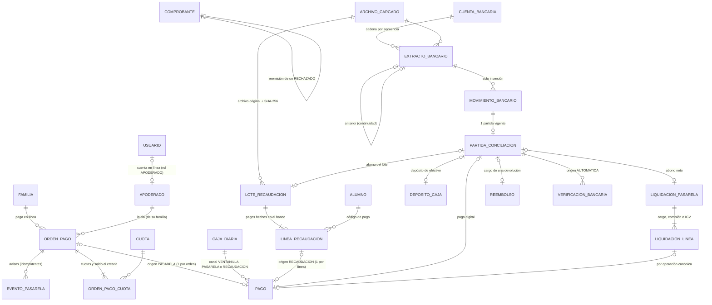

# Sprint 4 · Cero digitación: diseño de arquitectura

> Diseño del agente `arquitecto-software`, 6 de octubre de 2026. Rama base `claude/sprint-4-cero-digitacion` (sprints 0 a 3, 967 pruebas en verde según `docs/estado-del-proyecto.md`). **No modifiqué código ni scripts del repositorio**: solo agregué este documento. Los experimentos se hicieron en el scratchpad con una base MySQL temporal que se borró al terminar.
> Paquete base `pe.edu.virgenmaria.cuentasclaras`. El stack no cambia (Spring Boot 4.1.1, Java 21, Hibernate 7.4, MySQL 8, H2 2.4.240) y **no se agregan dependencias**: `RestClient` (spring-web), `javax.crypto.Mac` (HMAC), Apache POI (ya está) y un lector CSV propio de 60 líneas.
>
> **Cómo se verificó**
> - **Migraciones:** V13, V14 y V15 se aplicaron sobre las V1–V12 reales del repositorio, en MySQL 8.0.46 y en H2 2.4.240 (`MODE=MySQL;DATABASE_TO_LOWER=TRUE;DEFAULT_NULL_ORDERING=HIGH`).
> - **Permisos y triggers:** con `02-permisos-tablas.sql` y `03-triggers.sql` actuales más los GRANT y triggers de este diseño, conectado como `cc_app`. Quedaron **40 triggers** (28 + 12). Fueron unos 110 casos: el flujo correcto de cada tanda, los fraudes y las inserciones imposibles del verificador. Todos respondieron con el código esperado (1142, 1143, 1644, 3819, 1062 o 1216).
> - **Normativa y proveedores:** búsquedas web. Las páginas de SUNAT, El Peruano, Nubefact y tramitesperu están **bloqueadas por el proxy** de este entorno; los plazos se citan de fuentes secundarias (ver «Fuentes» al final) y por eso el diseño usa el plazo más estricto.

## 1. Resumen
- **Todo lo que entra solo lo registra un actor de sistema, nunca una persona.** Los pagos en línea los registra `sistema.pasarela` y los de banco `sistema.recaudacion`, cada uno en una **caja de canal** por día que nunca recibe efectivo ni se cierra. Usan el mismo libro de pagos, la misma imputación y el mismo comprobante que la ventanilla. Ninguna persona puede llamarse `sistema...`: lo impiden un CHECK y la validación.
- **El dinero solo existe cuando lo confirma una fuente independiente de quien lo carga:**
  - el pago en línea, cuando lo confirma la **consulta a la pasarela** con la llave secreta (el aviso o webhook es solo un aviso);
  - la recaudación, cuando **otra persona escribe a ciegas el total** que ve en el banco;
  - el extracto, cuando **otra persona escribe a ciegas el saldo final** y la cadena de saldos continúa sin huecos.
- **La conciliación automática reemplaza a la manual.** Empareja cada movimiento del extracto con lo que debía verse en el banco: pagos digitales de caja, depósitos, liquidaciones de la pasarela y abonos de recaudación. Las parejas exactas se confirman solas; las sugeridas las confirma una persona que no cobró ni depositó; solo se revisan las diferencias. La verificación a ciegas del sprint 3 queda para las excepciones.
- **Comprobante con outbox hacia el OSE.** Estados PENDIENTE → ENVIADO → ACEPTADO, OBSERVADO o RECHAZADO, con reintentos de espera creciente y alerta antes del plazo legal. Un RECHAZADO se reemite con número nuevo, así la numeración sigue sin huecos.
  - El conector **Nubefact** solo se activa con credenciales y en una lista cerrada de dominios.
  - El **simulado** sigue siendo el valor por defecto y su impreso dice «SIN VALOR TRIBUTARIO».
- **La pasarela simulada no puede marcar pagos en producción.** Hay seis capas, y la decisiva está en la base: una orden SIMULADA solo se acepta si existe una fila que **solo el DBA** puede escribir y que en producción no existe.

## 2. Hallazgos verificados (leer antes de implementar)
1. **V13–V15 se aplican sobre V1–V12 en ambas bases.** Lo comprobé, incluidos los `DROP CONSTRAINT` y re-`ADD` de los CHECK `ck_caja_diaria_cajero`, `ck_pago_origen`, `ck_pago_medio`, `ck_reembolso_medio`, `ck_comprobante_envio` y `ck_verificacion_bancaria_evidencia`.
   - Para atar el proveedor del comprobante al de su serie **no borro** `fk_comprobante_serie`. Agrego una segunda FK compuesta que incluye `proveedor`: así evito `DROP FOREIGN KEY`, cuya sintaxis difiere entre H2 y MySQL.
2. **Un BEFORE UPDATE puede leer su propia tabla** (`extracto_bancario` lee el extracto siguiente o el anterior) sin el error 1442. Lo comprobé con la confirmación en cadena.
3. **Las inserciones imposibles siguen dando 1644 antes de las FK y los CHECK.** Lo comprobé en las 7 tablas nuevas con trigger de inserción (colegio 0).
4. **`cc_app` lee `configuracion_bd` pero no la escribe** (INSERT → 1142). Los triggers la leen sin problema. Esa es la base del bloqueo de la pasarela simulada (sección 8).
5. **El CHECK de las cajas de canal basta para que nunca se cierren ni se cuenten.** Con `estado = 'ABIERTA' AND cierres = 0 AND conteos = 0`, el CHECK responde 3819, y `trg_caja_diaria_estado` ya rechaza antes con 1644. No hace falta tocar ese trigger.
6. **Orden de escrituras:** la confirmación de la orden (o el lote confirmado) debe salir con **`saveAndFlush` antes del INSERT del pago**, porque `trg_pago_registro` la lee. Es el mismo patrón del hallazgo 2 del sprint 3. Lo cubre `PermisosMySqlTest.flujoPagoEnLineaConPermisosMinimos`.
7. **ACEPTADO ahora exige `aceptado_en`** (CHECK y trigger).
   - `Comprobante.registrarEnvio` debe llenarlo.
   - V13 completa los ACEPTADO ya existentes del piloto con `aceptado_en = enviado_en`. El trigger viejo lo permite porque no mira esa columna.
8. **Hueco existente en `VerificadorConfiguracion`:** con `SPRING_PROFILES_ACTIVE=prod,dev` cuenta como desarrollo y no exige la clave HMAC.
   - Este sprint lo cierra: `prod` (y el nuevo `piloto`) **no se combinan** con `dev` ni `test`.
   - Es requisito para que «la simulada solo en dev, test o piloto» signifique algo.
9. **La CSP del proyecto y la pasarela:**
   - `form-action 'self'` también se aplica a las **redirecciones** que siguen a un POST: Chrome bloquea un 302 a otro dominio después de enviar un formulario.
   - `script-src 'self'` impide un checkout embebido con JS de terceros.
   - Por eso el diseño usa la **página de pago alojada por la pasarela**: se crea la orden con un POST, se muestra nuestra página y el apoderado sigue un **enlace** (GET) al proveedor.
   - Si el proveedor elegido solo ofrece checkout embebido, se relaja la CSP **solo** en `/familia/pagos/*/checkout` (decisión 6).
10. **Webhooks de los proveedores peruanos:**
    - Culqi **no firma** sus webhooks: ofrece autenticación básica opcional y recomienda volver a consultar el recurso con la llave secreta.
    - Izipay firma su IPN con HMAC-SHA256 (`kr-hash`).
    - Por eso el diseño **siempre consulta** a la pasarela antes de registrar dinero, y la firma o la autenticación del aviso solo sirven para no gastar recursos en avisos falsos.
11. **Plazos SUNAT** (ver «Fuentes»):
    - Factura y notas vinculadas: **3 días calendario** desde el día siguiente a la emisión (RS 000003-2023/SUNAT). Fuera de plazo, no tienen calidad de comprobante.
    - Boleta y notas vinculadas: las fuentes secundarias dicen **7 días calendario** por resumen diario y 5 por envío individual, pero se contradicen entre sí.
    - Diseño para el plazo más estricto (3 días, configurable) y lo confirma el OSE.
    - Un comprobante **RECHAZADO** deja su número usado: se emite otro con número nuevo. Nuestra numeración sigue sin huecos porque el rechazado se queda en la tabla.
12. **Montos agregados:** los totales de lote, liquidación y extracto usan `DECIMAL(12,2)`, y los saldos de cuenta `DECIMAL(14,2)`.
    - Un lote de matrícula supera S/ 99,999.99, y el saldo de una cuenta también.
    - Es una excepción documentada a la regla `DECIMAL(10,2)` de la skill. Los montos de cada pago siguen en `DECIMAL(10,2)`.
13. **Pendiente de comprobar al implementar:**
    - que Hibernate 7.4 valide `LONGBLOB` con `@Lob byte[]` en MySQL; si no, `@JdbcTypeCode(SqlTypes.LONG32VARBINARY)`;
    - los nombres exactos de campos de Nubefact y del proveedor de pasarela elegido (sus webs están bloqueadas aquí).

## 3. Decisiones
1. **Módulos nuevos y dependencias** (ArchUnit):
   - `pasarela` (pagos en línea y liquidaciones) depende de `caja`, `cobranza`, `alumnos`, `aprobaciones`, `auditoria` y `comun`.
   - `recaudacion` depende de `caja`, `cobranza`, `alumnos`, `aprobaciones`, `auditoria` y `comun`.
   - `conciliacion` depende de `caja`, `pasarela`, `recaudacion`, `auditoria` y `comun`. La verificación del sprint 3 sigue en `caja`.
   - `comprobantes` sigue dependiendo solo de `comun`.
   - **Ni `caja` ni `cobranza` dependen de los módulos nuevos.** Los avisos que necesitan («esta cuota tiene un pago en línea en curso») llegan por **puertos** que esos módulos declaran y `pasarela` implementa.
2. **Actores de sistema:**
   - `sistema.pasarela`, `sistema.recaudacion`, `sistema.conciliacion` y `sistema.ose`, con autoridades `ROLE_SISTEMA_PASARELA`, `ROLE_SISTEMA_RECAUDACION`, `ROLE_SISTEMA_CONCILIACION` y `ROLE_SISTEMA_OSE`. **No** son valores de `Rol`, así que ninguna persona puede tenerlos (el CHECK de `usuario_rol` lo impide) y no aparecen en la gestión de usuarios.
   - `EjecucionComoSistema.como(actor, colegioId, tarea)` fija el colegio (`ContextoColegio.en`) y un `SecurityContext` con ese actor. Así `creado_por`, la bitácora y `@PreAuthorize` funcionan igual que con una persona.
   - Solo la usan las clases de los paquetes `..proceso..` (ArchUnit).
3. **Cajas de canal:**
   - `caja_diaria.canal` puede ser `VENTANILLA` (lo de siempre), `PASARELA` o `RECAUDACION`. Una caja por canal y por fecha: la fecha de confirmación en la pasarela o la fecha de pago en el banco.
   - El «cajero» es el actor de sistema, y el CHECK impide efectivo, fondo, conteo y cierre.
   - Ventajas: el libro de pagos, la anulación, la corrección, el estado de cuenta y los reportes no cambian, y Promotoría ve «Ingresos automáticos del día» separados de las cajeras.
4. **Pago en línea:**
   - El apoderado elige cuotas de **su** familia y el servidor calcula el monto. La orden fija las cuotas con su saldo de ese momento (`orden_pago_cuota`).
   - El aviso de la pasarela se guarda en una bandeja idempotente (`evento_pasarela`). Luego el sistema **consulta** a la pasarela y, solo si confirma PAGADO por ese monto y en PEN, registra el pago con su boleta, todo en una transacción.
   - Si no se puede aplicar (por ejemplo, la cuota se pagó en caja mientras tanto), la orden queda **POR_REVISAR**. No se pierde dinero ni se paga dos veces. Administración pide «aplicar a otras cuotas» o «devolver», y aprueba otra persona.
5. **Recaudación bancaria:**
   - Formato genérico (CSV o XLSX) y un adaptador por banco.
   - Subir en 3 pasos: vista previa en sesión → registrar el lote (todo o nada) → confirmación a ciegas por otra persona.
   - Confirmado el lote, `sistema.recaudacion` aplica las líneas en tandas de 50 (cada línea es idempotente por su UNIQUE). Las que no se pueden aplicar quedan en **EXCEPCION** con su motivo.
   - La imputación es la de caja (`ImputacionPago`):
     - con la cuota exacta si el banco trabaja con base de deudas;
     - si no, sobre las cuotas por pagar **de ese alumno**, de la más antigua a la más nueva.
6. **Extracto y conciliación:**
   - El extracto es una cadena por cuenta: el `n+1` empieza el día siguiente y con el saldo final del `n` (trigger). Sus movimientos son de solo inserción.
   - Si un archivo trae días ya cargados, esos días deben ser **idénticos** a lo guardado (el banco no cambia el pasado). Si no lo son, se rechaza y se alerta en rojo.
   - Lo confirma Promotoría o Dirección escribiendo a ciegas el saldo final. Puede confirmar varios pendientes con el saldo del último («el lunes sella el fin de semana»).
   - Las partidas emparejan 1 a 1 un movimiento con un objeto: un pago, un depósito, una liquidación, un lote, un reembolso o una explicación.
7. **Verificación unificada:** una partida CONFIRMADA sobre un extracto CONFIRMADO deja una `verificacion_bancaria` de origen **AUTOMATICA**, que inserta `sistema.conciliacion`.
   - Todo lo del sprint 3 que pregunta «¿está verificado?» sigue funcionando sin cambios: anular un digital exige ENCONTRADO (A1), las alertas de sin verificar y el muestreo.
   - La verificación MANUAL a ciegas queda para las excepciones.
8. **Liquidación de la pasarela:**
   - Llega neta de comisión e IGV de la comisión.
   - Se importa por API (tarea diaria) o por archivo. Cada línea se ata a su pago por la operación canónica.
   - La liquidación se empareja con **un** abono del extracto. Si sus líneas cuadran, los pagos de esa liquidación quedan verificados.
   - La comisión queda registrada para el contador.
9. **OSE con outbox:**
   - Se envía al confirmar, como hoy (después del commit). Lo que falla se reintenta con una tarea cada minuto y espera creciente (1, 2, 4… hasta 60 minutos).
   - ENVIADO significa «el OSE lo recibió y falta su respuesta definitiva»: se **consulta**, no se reenvía.
   - Una nota de crédito no se envía hasta que su comprobante esté ACEPTADO u OBSERVADO.
   - Cada noche se vuelven a consultar los ACEPTADO del día y cualquier discrepancia es una alerta crítica.
   - **No** se crea un usuario de base aparte para el OSE en este sprint (decisión 25).
10. **Excepciones de ingreso** (orden POR_REVISAR o línea en EXCEPCION):
    - Se resuelven con dos solicitudes nuevas que aprueba Promotoría o Dirección:
      - `APLICAR_INGRESO`: aplicar el dinero a cuotas elegidas, incluso de otra familia con llamada a ambas, como la corrección del sprint 3;
      - `DEVOLVER_INGRESO`: devolverlo.
    - El pago de una aplicación aprobada también lo registra el actor de sistema (después del commit de la aprobación). El trigger exige la solicitud APROBADA.
    - La devolución la registra Administración, que no puede ser quien aprobó (trigger):
      - en la pasarela, con su API de reembolso (vuelve al mismo medio de origen);
      - en el banco, con el número de la transferencia.
11. **Anulación de pagos automáticos:** se usa el flujo `ANULACION_PAGO` del sprint 3 sin cambios. Lo pide Administración y lo aprueba Promotoría o Dirección. La cajera del pago es el actor de sistema, así que la segregación se cumple sola.
    - **Excepción a A1** para pagos PASARELA: se pueden anular antes de la liquidación, porque la pasarela ya confirmó el dinero por API y el reembolso **solo** vuelve al mismo medio de origen.
12. **Tareas programadas** (`@EnableScheduling`, una instancia):
    - el outbox (cada minuto);
    - la consulta de órdenes abiertas y su vencimiento (cada 2 minutos);
    - los lotes confirmados sin aplicar (cada 5 minutos);
    - las liquidaciones por API (06:00);
    - la reconsulta nocturna al OSE (23:30).
    - Cada tarea recorre los colegios activos con `ContextoColegio.en` (no usa `comoSistema`).
13. **Orden de bloqueos** (se extiende el del sprint 3): solicitud → orden_pago | lote_recaudacion | cuenta_bancaria → caja_diaria → pago → cuotas (id ascendente) → descuento → serie → serie de nota → bitácora.
14. **Sin SQL nativo, sin `delete*` y sin `@Modifying`** en los repositorios nuevos, igual que en `caja`.

## 4. Modelo

**Invariantes.** «(base)» significa que lo garantiza un CHECK, UNIQUE o FK; «(MySQL)» significa que lo garantiza un trigger.

- **Actores de sistema:**
  - ninguna persona se llama `sistema...` (base: `ck_usuario_nombre_reservado`);
  - una caja de canal tiene como cajero a su actor, fondo 0 y siempre está ABIERTA, sin conteos ni cierres (base);
  - un pago PASARELA o RECAUDACION lo registra el actor de su canal, en su caja y con su medio (base: `ck_pago_origen`);
  - un pago CAJA nunca lo registra un actor de sistema (base).
- **Orden de pago:**
  - nace CREADA, sin enlace ni confirmación (MySQL);
  - es SIMULADA solo si la base tiene `configuracion_bd('pasarela_simulada','PERMITIDA')`, que `cc_app` no puede escribir (MySQL y 1142);
  - el apoderado es de la familia de la orden (base: FK `(apoderado_id, familia_id)`);
  - sus cuotas son de su familia, están por pagar y entran antes del enlace (MySQL);
  - el enlace se registra una vez y con Σ cuotas = monto (MySQL);
  - monto, familia, apoderado y vencimiento no cambian (1143);
  - la confirmación (cargo, operación, monto, moneda, medio, fecha) va completa o no va, y una vez escrita no cambia (base y MySQL);
  - transiciones válidas (MySQL, sección 5); PAGADA o APLICADA exige su pago vigente (MySQL); DEVUELTA exige la solicitud aprobada por otra persona (MySQL);
  - un cargo de la pasarela pertenece a una sola orden (base: `uk_orden_pago_cargo`).
- **Pago en línea:**
  - uno por orden (base: `uk_pago_orden`);
  - nace solo si la orden tiene la confirmación de la pasarela con **ese** monto, en PEN, **esa** operación y **ese** medio, y si es de **esa** familia (o hay una `APLICAR_INGRESO` aprobada) (MySQL);
  - su operación es única entre todos los pagos digitales vigentes (base: `uk_pago_operacion_canonica` del sprint 3).
- **Aviso de la pasarela:** uno por `(proveedor, evento_id)` (base). No guarda el cuerpo, solo su SHA-256.
- **Lote de recaudación:**
  - un archivo vigente no se carga dos veces (base: `uk_lote_recaudacion_vigente`);
  - el archivo guardado es el mismo que dice el lote (base: FK con el SHA-256);
  - el pie del banco, si existe, es igual a la suma (base);
  - nace CARGADO (MySQL);
  - lo confirma otra persona con el total escrito a ciegas igual al del archivo (base);
  - los intentos de confirmación solo suben de uno en uno (MySQL);
  - pasa a APLICADO solo con todas sus líneas resueltas y que sumen lo declarado (MySQL).
- **Línea de recaudación:**
  - entra PENDIENTE a un lote CARGADO, dentro de sus fechas (MySQL);
  - monto, fecha, código y operación no cambian (1143);
  - APLICADA exige su pago (MySQL); DEVUELTA exige la devolución aprobada por otra persona (MySQL).
- **Pago por recaudación:**
  - uno por línea (base);
  - nace solo con el lote CONFIRMADO, por el monto, la operación y la fecha de la línea, para la familia del alumno del código (o con `APLICAR_INGRESO` aprobada) (MySQL).
- **Comprobante:**
  - nace PENDIENTE con 0 intentos (MySQL);
  - es del proveedor de su serie (base: FK con `proveedor`);
  - los intentos avanzan de uno en uno (MySQL);
  - ENVIADO exige la fecha de envío; ACEPTADO u OBSERVADO exigen hash, respuesta, envío y aceptación; RECHAZADO exige la respuesta (base y MySQL);
  - un resultado definitivo no cambia en nada (MySQL);
  - la reemisión solo reemplaza a un RECHAZADO del mismo tipo, total y referencia, y una sola vez (base y MySQL).
- **Extracto:**
  - saldo final = inicial + abonos − cargos (base);
  - continúa al anterior vigente: misma cuenta, secuencia − 1, día siguiente y mismo saldo (MySQL);
  - una sola posición vigente por cuenta (base);
  - nace CARGADO (MySQL);
  - lo confirma otra persona (base), en orden, con los movimientos completos y el saldo escrito a ciegas en él o en uno posterior de la cadena (MySQL);
  - el saldo ciego se escribe una vez y debe ser igual al saldo final (base y MySQL);
  - no se descarta un extracto que ya tiene uno siguiente vigente (MySQL).
- **Movimiento:** solo inserción (1142), solo en un extracto CARGADO y en sus fechas (MySQL).
- **Partida:**
  - 1 a 1: un movimiento y un objeto con una sola partida vigente (base);
  - nace PROPUESTA con los montos reales del movimiento y del objeto (MySQL);
  - EXACTA exige diferencia 0 (base) y la misma operación canónica en pagos y depósitos (MySQL);
  - se confirma solo con el extracto CONFIRMADO; una partida no exacta la confirma una persona que no cobró, no registró ni depositó lo emparejado (base y MySQL);
  - una vez resuelta no cambia (MySQL).
- **Verificación AUTOMATICA:** exige una partida CONFIRMADA sobre un extracto CONFIRMADO que cubra ese pago, directo, por su liquidación o por su lote, o ese depósito, con el monto y la fecha del banco (MySQL). Además, como en el sprint 3, no la hace quien cobró ni quien depositó (MySQL).

## 5. Máquinas de estado
**Orden de pago** (`orden_pago.estado`)
```
CREADA ──(consulta: PAGADO, monto y PEN coinciden, cuotas cobrables)──▶ PAGADA
   │  └─(consulta: PAGADO pero no aplicable: cuota pagada o anulada, saldo cambió,
   │     monto o moneda distintos, operación ya usada)──────────────────▶ POR_REVISAR
   ├──(consulta: rechazado por el emisor de la tarjeta o la billetera)──▶ RECHAZADA
   └──(vence_en pasó y la consulta dice NO PAGADO)──────────────────────▶ VENCIDA
VENCIDA ──(aviso tardío y consulta PAGADO)──▶ PAGADA (tardia = TRUE) | POR_REVISAR
POR_REVISAR ──(APLICAR_INGRESO aprobada + pago registrado por el sistema)──▶ APLICADA
            └─(DEVOLVER_INGRESO aprobada + reembolso por API registrado)───▶ DEVUELTA
```
- PAGADA, RECHAZADA, APLICADA y DEVUELTA son finales.
- Las transiciones las exige `trg_orden_pago_estado`.
- Un contracargo posterior no cambia la orden: genera una alerta y una solicitud de anulación prellenada (sección 13).

**Aviso de la pasarela** (`evento_pasarela.estado`): RECIBIDO → PROCESADO, IGNORADO (la orden ya era final o el evento no interesa) o ERROR (después de 5 intentos; alerta).

**Lote de recaudación** (`lote_recaudacion.estado`)
```
CARGADO ──(otra persona escribe a ciegas el total correcto)──▶ CONFIRMADO ──(sistema aplica todas las líneas)──▶ APLICADO
   ├──(2 totales a ciegas distintos)──────────────────────────▶ RECHAZADO (alerta CRÍTICA)
   └──(quien lo subió lo descarta antes de confirmar)─────────▶ DESCARTADO
```
**Línea de recaudación:** PENDIENTE → APLICADA | EXCEPCION; EXCEPCION → APLICADA_REVISION (con `APLICAR_INGRESO`) | DEVUELTA (con `DEVOLVER_INGRESO` y el número de la transferencia).

**Comprobante, envío al OSE** (`comprobante.estado_envio`)
```
PENDIENTE ──(envío OK, respuesta definitiva)──▶ ACEPTADO | OBSERVADO | RECHAZADO
    │  ▲ └─(el OSE lo recibió, falta la respuesta)──▶ ENVIADO ──(consulta)──▶ ACEPTADO | OBSERVADO | RECHAZADO
    │  │                                                  └─(el OSE no lo encuentra)──▶ PENDIENTE
    └──┘ (error de red o 5xx: intentos + 1, próximo intento con espera creciente)
RECHAZADO ──(Administración corrige el dato y reemite)──▶ comprobante NUEVO (número nuevo, reemplaza_id)
```
- Los finales (ACEPTADO, OBSERVADO, RECHAZADO) no cambian (`trg_comprobante_envio`).
- OBSERVADO es válido para SUNAT, pero se muestra a Administración.

**Extracto** (`extracto_bancario.estado`)
```
CARGADO ──(saldo final a ciegas correcto, en él o en uno posterior; anterior ya CONFIRMADO)──▶ CONFIRMADO
   ├──(2 saldos a ciegas distintos)──▶ RECHAZADO (alerta CRÍTICA)
   └──(quien lo subió lo descarta; solo si no hay uno siguiente vigente)──▶ DESCARTADO
```
**Partida** (`partida_conciliacion.estado`): PROPUESTA → CONFIRMADA (EXACTA: el sistema, al confirmarse el extracto; SUGERIDA, MANUAL o EXPLICADA: una persona) | DESCARTADA (una persona, con nota; libera el movimiento y el objeto).

## 6. Migraciones Flyway (probadas completas en H2 2.4.240 MODE=MySQL y MySQL 8.0.46)

### `V13__pagos_en_linea_y_envio_ose.sql` (tanda 1)
```sql
-- Sprint 4 · tanda 1: pagos en línea con pasarela (orden, cuotas de la orden y avisos de la pasarela), cajas de canal
-- para los pagos que entran solos, cuenta del apoderado y envío de comprobantes al OSE (outbox con reintentos).
-- Nada se borra. orden_pago_cuota es de SOLO INSERCIÓN. Los triggers de scripts/mysql/03-triggers.sql vigilan lo que el
-- GRANT por columna no distingue (estados, confirmación única de la pasarela, pasarela simulada).

-- Guarda de la BASE (no de la aplicación): solo el DBA la escribe; cc_app no tiene INSERT ni UPDATE (solo el SELECT
-- general). En producción NO existe la fila 'pasarela_simulada': trg_orden_pago_nace rechaza toda orden SIMULADA.
-- En la base del piloto (otra base, otro despliegue) el DBA inserta ('pasarela_simulada', 'PERMITIDA').
CREATE TABLE configuracion_bd (
    clave      VARCHAR(40)   NOT NULL PRIMARY KEY,
    valor      VARCHAR(100)  NOT NULL,
    creado_en  DATETIME(6)   NOT NULL
);

-- Los nombres «sistema...» quedan reservados para los actores de sistema (sistema.pasarela, sistema.recaudacion,
-- sistema.conciliacion, sistema.ose). Ninguna persona puede llamarse así y firmar como ellos.
ALTER TABLE usuario ADD CONSTRAINT ck_usuario_nombre_reservado CHECK (nombre_usuario NOT LIKE 'sistema%');

-- Cuenta en línea del apoderado: enlazada a SU registro de apoderado (y por él, a su familia). Una cuenta por apoderado.
ALTER TABLE usuario ADD COLUMN apoderado_id BIGINT;
ALTER TABLE usuario ADD CONSTRAINT uk_usuario_apoderado UNIQUE (apoderado_id);
ALTER TABLE usuario ADD CONSTRAINT fk_usuario_apoderado FOREIGN KEY (apoderado_id, colegio_id)
    REFERENCES apoderado (id, colegio_id);

-- Caja de canal: los pagos que entran solos (pasarela; recaudación en la tanda 2) van a una caja por canal y por día,
-- con un actor de sistema como «cajero». Nunca recibe efectivo, nunca se cierra y no tiene fondo fijo (CHECK).
-- Reemplaza ck_caja_diaria_cajero (cajero = creado_por), que sigue valiendo para la ventanilla.
ALTER TABLE caja_diaria ADD COLUMN canal VARCHAR(20) NOT NULL DEFAULT 'VENTANILLA';
ALTER TABLE caja_diaria DROP CONSTRAINT ck_caja_diaria_cajero;
ALTER TABLE caja_diaria ADD CONSTRAINT ck_caja_diaria_canal CHECK (
    (canal = 'VENTANILLA' AND cajero = creado_por AND cajero NOT LIKE 'sistema%')
    OR (canal = 'PASARELA' AND cajero = 'sistema.pasarela' AND fondo_fijo = 0 AND estado = 'ABIERTA'
        AND cierres = 0 AND conteos = 0)
    OR (canal = 'RECAUDACION' AND cajero = 'sistema.recaudacion' AND fondo_fijo = 0 AND estado = 'ABIERTA'
        AND cierres = 0 AND conteos = 0));

-- Orden de pago en línea: la crea el apoderado eligiendo cuotas de SU familia; el monto lo calcula el servidor.
-- referencia: UUID público (URL de retorno y metadato en la pasarela). La confirmación (cargo, operación canónica,
-- monto, moneda y medio) la escribe el sistema UNA vez, con lo que respondió la CONSULTA a la pasarela (nunca con lo
-- que dice el aviso). POR_REVISAR: hubo dinero pero no se pudo aplicar (cuota ya pagada, monto distinto...).
CREATE TABLE orden_pago (
    id                    BIGINT         NOT NULL AUTO_INCREMENT PRIMARY KEY,
    colegio_id            BIGINT         NOT NULL,
    referencia            VARCHAR(36)    NOT NULL,
    familia_id            BIGINT         NOT NULL,
    apoderado_id          BIGINT         NOT NULL,
    proveedor             VARCHAR(20)    NOT NULL,
    monto                 DECIMAL(10,2)  NOT NULL,
    moneda                VARCHAR(3)     NOT NULL,
    comprobante_tipo      VARCHAR(20)    NOT NULL,
    clave_idempotencia    VARCHAR(36)    NOT NULL,
    vence_en              DATETIME(6)    NOT NULL,
    estado                VARCHAR(20)    NOT NULL,
    proveedor_orden_id    VARCHAR(80),
    enlace_pago           VARCHAR(500),
    cargo_id              VARCHAR(80),
    operacion             VARCHAR(30),
    monto_confirmado      DECIMAL(10,2),
    moneda_confirmada     VARCHAR(3),
    medio_confirmado      VARCHAR(20),
    confirmado_en         DATETIME(6),
    tardia                BOOLEAN        NOT NULL DEFAULT FALSE,
    motivo_revision       VARCHAR(30),
    detalle_revision      VARCHAR(500),
    devolucion_operacion  VARCHAR(80),
    devuelto_por          VARCHAR(60),
    devuelto_en           DATETIME(6),
    creado_en             DATETIME(6)    NOT NULL,
    creado_por            VARCHAR(60)    NOT NULL,
    actualizado_en        DATETIME(6)    NOT NULL,
    version               BIGINT         NOT NULL DEFAULT 0,
    CONSTRAINT uk_orden_pago_referencia UNIQUE (referencia),
    CONSTRAINT uk_orden_pago_idempotencia UNIQUE (colegio_id, clave_idempotencia),
    CONSTRAINT uk_orden_pago_proveedor UNIQUE (colegio_id, proveedor, proveedor_orden_id),
    CONSTRAINT uk_orden_pago_cargo UNIQUE (colegio_id, proveedor, cargo_id),
    CONSTRAINT uk_orden_pago_id_colegio UNIQUE (id, colegio_id),
    CONSTRAINT fk_orden_pago_colegio FOREIGN KEY (colegio_id) REFERENCES colegio (id),
    CONSTRAINT fk_orden_pago_familia FOREIGN KEY (familia_id, colegio_id) REFERENCES familia (id, colegio_id),
    -- El apoderado que paga es de ESA familia (uk_apoderado_id_familia de V5).
    CONSTRAINT fk_orden_pago_apoderado FOREIGN KEY (apoderado_id, familia_id) REFERENCES apoderado (id, familia_id),
    CONSTRAINT ck_orden_pago_proveedor CHECK (proveedor IN ('SIMULADA', 'CULQI', 'IZIPAY', 'NIUBIZ')),
    CONSTRAINT ck_orden_pago_monto CHECK (monto > 0 AND monto <= 99999.99 AND moneda = 'PEN'
        AND (monto_confirmado IS NULL OR monto_confirmado > 0)),
    CONSTRAINT ck_orden_pago_comprobante CHECK (comprobante_tipo IN ('BOLETA', 'FACTURA')),
    CONSTRAINT ck_orden_pago_estado CHECK (estado IN ('CREADA', 'PAGADA', 'POR_REVISAR', 'VENCIDA', 'RECHAZADA',
        'APLICADA', 'DEVUELTA')),
    CONSTRAINT ck_orden_pago_enlace CHECK ((proveedor_orden_id IS NULL AND enlace_pago IS NULL)
        OR (proveedor_orden_id IS NOT NULL AND enlace_pago IS NOT NULL)),
    CONSTRAINT ck_orden_pago_operacion CHECK (operacion IS NULL
        OR REGEXP_LIKE(operacion, '^[A-Z1-9][A-Z0-9]{3,29}$', 'c')),
    CONSTRAINT ck_orden_pago_medio CHECK (medio_confirmado IS NULL OR medio_confirmado IN ('YAPE', 'PLIN', 'TARJETA')),
    -- La confirmación va completa o no va. Con dinero (PAGADA, POR_REVISAR, APLICADA, DEVUELTA) es obligatoria.
    CONSTRAINT ck_orden_pago_confirmacion CHECK (
        (cargo_id IS NULL AND operacion IS NULL AND monto_confirmado IS NULL AND moneda_confirmada IS NULL
            AND medio_confirmado IS NULL AND confirmado_en IS NULL AND estado IN ('CREADA', 'VENCIDA', 'RECHAZADA'))
        OR (cargo_id IS NOT NULL AND operacion IS NOT NULL AND monto_confirmado IS NOT NULL
            AND moneda_confirmada IS NOT NULL AND medio_confirmado IS NOT NULL AND confirmado_en IS NOT NULL
            AND estado <> 'RECHAZADA')),
    CONSTRAINT ck_orden_pago_revision CHECK (
        (estado IN ('POR_REVISAR', 'APLICADA', 'DEVUELTA') AND motivo_revision IS NOT NULL)
        OR (estado NOT IN ('POR_REVISAR', 'APLICADA', 'DEVUELTA') AND motivo_revision IS NULL)),
    CONSTRAINT ck_orden_pago_devolucion CHECK (
        (estado = 'DEVUELTA' AND devolucion_operacion IS NOT NULL AND devuelto_por IS NOT NULL AND devuelto_en IS NOT NULL)
        OR (estado <> 'DEVUELTA' AND devolucion_operacion IS NULL AND devuelto_por IS NULL AND devuelto_en IS NULL))
);
CREATE INDEX ix_orden_pago_estado ON orden_pago (colegio_id, estado, vence_en);
CREATE INDEX ix_orden_pago_familia ON orden_pago (colegio_id, familia_id, estado);

-- Cuotas de la orden con el saldo que tenían al crearla. SOLO INSERCIÓN. Σ monto = orden_pago.monto (trigger).
CREATE TABLE orden_pago_cuota (
    id              BIGINT         NOT NULL AUTO_INCREMENT PRIMARY KEY,
    colegio_id      BIGINT         NOT NULL,
    orden_pago_id   BIGINT         NOT NULL,
    cuota_id        BIGINT         NOT NULL,
    monto           DECIMAL(10,2)  NOT NULL,
    creado_en       DATETIME(6)    NOT NULL,
    creado_por      VARCHAR(60)    NOT NULL,
    actualizado_en  DATETIME(6)    NOT NULL,
    version         BIGINT         NOT NULL DEFAULT 0,
    CONSTRAINT uk_orden_pago_cuota UNIQUE (orden_pago_id, cuota_id),
    CONSTRAINT fk_orden_pago_cuota_colegio FOREIGN KEY (colegio_id) REFERENCES colegio (id),
    CONSTRAINT fk_orden_pago_cuota_orden FOREIGN KEY (orden_pago_id, colegio_id) REFERENCES orden_pago (id, colegio_id),
    CONSTRAINT fk_orden_pago_cuota_cuota FOREIGN KEY (cuota_id, colegio_id) REFERENCES cuota (id, colegio_id),
    CONSTRAINT ck_orden_pago_cuota_monto CHECK (monto > 0)
);
CREATE INDEX ix_orden_pago_cuota_cuota ON orden_pago_cuota (cuota_id, colegio_id);

-- Aviso (webhook) recibido de la pasarela, ya con la firma o la autenticación válida. Bandeja de entrada idempotente:
-- el mismo evento no se procesa dos veces (UNIQUE). No se guarda el cuerpo (puede traer datos del pagador): solo su
-- SHA-256 y lo necesario para procesarlo.
CREATE TABLE evento_pasarela (
    id              BIGINT         NOT NULL AUTO_INCREMENT PRIMARY KEY,
    colegio_id      BIGINT         NOT NULL,
    proveedor       VARCHAR(20)    NOT NULL,
    evento_id       VARCHAR(100)   NOT NULL,
    tipo            VARCHAR(60)    NOT NULL,
    orden_pago_id   BIGINT,
    cuerpo_sha256   VARCHAR(64)    NOT NULL,
    estado          VARCHAR(20)    NOT NULL,
    intentos        INT            NOT NULL DEFAULT 0,
    resultado       VARCHAR(250),
    procesado_en    DATETIME(6),
    creado_en       DATETIME(6)    NOT NULL,
    creado_por      VARCHAR(60)    NOT NULL,
    actualizado_en  DATETIME(6)    NOT NULL,
    version         BIGINT         NOT NULL DEFAULT 0,
    CONSTRAINT uk_evento_pasarela UNIQUE (colegio_id, proveedor, evento_id),
    CONSTRAINT fk_evento_pasarela_colegio FOREIGN KEY (colegio_id) REFERENCES colegio (id),
    CONSTRAINT fk_evento_pasarela_orden FOREIGN KEY (orden_pago_id, colegio_id) REFERENCES orden_pago (id, colegio_id),
    CONSTRAINT ck_evento_pasarela_estado CHECK (estado IN ('RECIBIDO', 'PROCESADO', 'IGNORADO', 'ERROR')
        AND intentos >= 0 AND (estado = 'RECIBIDO' OR procesado_en IS NOT NULL))
);
CREATE INDEX ix_evento_pasarela_estado ON evento_pasarela (colegio_id, estado);

-- Pago en línea: nace de su orden (una por orden), en la caja del canal PASARELA, con el medio que confirmó la pasarela.
ALTER TABLE pago ADD COLUMN orden_pago_id BIGINT;
ALTER TABLE pago ADD CONSTRAINT uk_pago_orden UNIQUE (orden_pago_id);
ALTER TABLE pago ADD CONSTRAINT fk_pago_orden FOREIGN KEY (orden_pago_id, colegio_id) REFERENCES orden_pago (id, colegio_id);
ALTER TABLE pago DROP CONSTRAINT ck_pago_origen;
ALTER TABLE pago ADD CONSTRAINT ck_pago_origen CHECK (
    (origen = 'CAJA' AND reemplaza_pago_id IS NULL AND orden_pago_id IS NULL AND creado_por = cajero
        AND cajero NOT LIKE 'sistema%')
    OR (origen = 'REEMPLAZO' AND reemplaza_pago_id IS NOT NULL AND orden_pago_id IS NULL AND creado_por <> cajero)
    OR (origen = 'PASARELA' AND reemplaza_pago_id IS NULL AND orden_pago_id IS NOT NULL AND creado_por = cajero
        AND cajero = 'sistema.pasarela' AND medio IN ('YAPE', 'PLIN', 'TARJETA')));

-- Comprobante: envío al OSE con outbox. ENVIADO = el OSE lo recibió y falta su respuesta definitiva (se consulta).
-- RECHAZADO: SUNAT/OSE no lo acepta; su número queda usado y se REEMITE con un número nuevo (reemplaza_id).
ALTER TABLE comprobante DROP CONSTRAINT ck_comprobante_envio;
ALTER TABLE comprobante ADD CONSTRAINT ck_comprobante_envio CHECK (estado_envio IN ('PENDIENTE', 'ENVIADO', 'ACEPTADO',
    'OBSERVADO', 'RECHAZADO') AND intentos >= 0);
ALTER TABLE comprobante ADD COLUMN proximo_intento_en DATETIME(6);
ALTER TABLE comprobante ADD COLUMN ultimo_error VARCHAR(250);
ALTER TABLE comprobante ADD COLUMN codigo_respuesta VARCHAR(10);
ALTER TABLE comprobante ADD COLUMN aceptado_en DATETIME(6);
ALTER TABLE comprobante ADD COLUMN reemplaza_id BIGINT;
-- Los ACEPTADO del piloto (simulados) toman como fecha de aceptación la de su envío.
UPDATE comprobante SET aceptado_en = enviado_en WHERE estado_envio IN ('ACEPTADO', 'OBSERVADO');
ALTER TABLE comprobante ADD CONSTRAINT uk_comprobante_reemplaza UNIQUE (colegio_id, reemplaza_id);
ALTER TABLE comprobante ADD CONSTRAINT fk_comprobante_reemplaza FOREIGN KEY (reemplaza_id, colegio_id)
    REFERENCES comprobante (id, colegio_id);
ALTER TABLE comprobante ADD CONSTRAINT ck_comprobante_resultado CHECK (
    estado_envio = 'PENDIENTE'
    OR (estado_envio = 'ENVIADO' AND enviado_en IS NOT NULL)
    OR (estado_envio IN ('ACEPTADO', 'OBSERVADO') AND codigo_hash IS NOT NULL AND respuesta IS NOT NULL
        AND enviado_en IS NOT NULL AND aceptado_en IS NOT NULL)
    OR (estado_envio = 'RECHAZADO' AND respuesta IS NOT NULL AND enviado_en IS NOT NULL));
-- Un comprobante es del proveedor de SU serie: una serie del simulado no emite comprobantes «reales» ni al revés.
ALTER TABLE serie_comprobante ADD CONSTRAINT uk_serie_comprobante_proveedor UNIQUE (id, colegio_id, tipo, serie, proveedor);
ALTER TABLE comprobante ADD CONSTRAINT fk_comprobante_serie_proveedor FOREIGN KEY (serie_id, colegio_id, tipo, serie,
    proveedor) REFERENCES serie_comprobante (id, colegio_id, tipo, serie, proveedor);
CREATE INDEX ix_comprobante_outbox ON comprobante (estado_envio, proximo_intento_en);
```

### `V14__recaudacion_bancaria.sql` (tanda 2)
```sql
-- Sprint 4 · tanda 2: recaudación bancaria por código de alumno. El archivo del banco se guarda tal cual (evidencia),
-- se registra en un lote CARGADO por Administración y lo confirma OTRA persona escribiendo a ciegas el total que ve en
-- el banco. Recién entonces el sistema (sistema.recaudacion) registra los pagos. archivo_cargado: SOLO INSERCIÓN.

-- Archivo original subido (recaudación, extracto o liquidación de la pasarela), con su SHA-256. Hasta 2 MB.
CREATE TABLE archivo_cargado (
    id              BIGINT         NOT NULL AUTO_INCREMENT PRIMARY KEY,
    colegio_id      BIGINT         NOT NULL,
    tipo            VARCHAR(20)    NOT NULL,
    nombre          VARCHAR(150)   NOT NULL,
    sha256          VARCHAR(64)    NOT NULL,
    bytes           INT            NOT NULL,
    contenido       LONGBLOB       NOT NULL,
    creado_en       DATETIME(6)    NOT NULL,
    creado_por      VARCHAR(60)    NOT NULL,
    actualizado_en  DATETIME(6)    NOT NULL,
    version         BIGINT         NOT NULL DEFAULT 0,
    CONSTRAINT uk_archivo_cargado_sha UNIQUE (colegio_id, tipo, sha256),
    CONSTRAINT uk_archivo_cargado_id_colegio UNIQUE (id, colegio_id),
    CONSTRAINT uk_archivo_cargado_id_sha UNIQUE (id, colegio_id, sha256),
    CONSTRAINT fk_archivo_cargado_colegio FOREIGN KEY (colegio_id) REFERENCES colegio (id),
    CONSTRAINT ck_archivo_cargado_tipo CHECK (tipo IN ('RECAUDACION', 'EXTRACTO', 'LIQUIDACION')),
    CONSTRAINT ck_archivo_cargado_tamano CHECK (bytes > 0 AND bytes <= 2097152 AND CHAR_LENGTH(sha256) = 64)
);

-- Lote: un archivo de recaudación del banco. sha_vigente impide cargar dos veces el mismo archivo mientras el lote esté
-- vigente (NULL al rechazarlo o descartarlo). total_banco: el total que declara el propio archivo (pie), si lo trae.
-- Confirmar exige otra persona y el total escrito a ciegas igual al del archivo (CHECK).
CREATE TABLE lote_recaudacion (
    id                     BIGINT         NOT NULL AUTO_INCREMENT PRIMARY KEY,
    colegio_id             BIGINT         NOT NULL,
    archivo_id             BIGINT         NOT NULL,
    archivo_sha256         VARCHAR(64)    NOT NULL,
    sha_vigente            VARCHAR(64),
    banco                  VARCHAR(20)    NOT NULL,
    formato                VARCHAR(30)    NOT NULL,
    fecha_proceso          DATE           NOT NULL,
    desde                  DATE           NOT NULL,
    hasta                  DATE           NOT NULL,
    lineas                 INT            NOT NULL,
    total                  DECIMAL(12,2)  NOT NULL,
    total_banco            DECIMAL(12,2),
    estado                 VARCHAR(20)    NOT NULL,
    intentos_confirmacion  INT            NOT NULL DEFAULT 0,
    total_ciego            DECIMAL(12,2),
    confirmado_por         VARCHAR(60),
    confirmado_en          DATETIME(6),
    aplicado_en            DATETIME(6),
    lineas_aplicadas       INT            NOT NULL DEFAULT 0,
    lineas_excepcion       INT            NOT NULL DEFAULT 0,
    monto_aplicado         DECIMAL(12,2)  NOT NULL DEFAULT 0.00,
    monto_excepcion        DECIMAL(12,2)  NOT NULL DEFAULT 0.00,
    rechazado_por          VARCHAR(60),
    rechazado_en           DATETIME(6),
    motivo_rechazo         VARCHAR(500),
    creado_en              DATETIME(6)    NOT NULL,
    creado_por             VARCHAR(60)    NOT NULL,
    actualizado_en         DATETIME(6)    NOT NULL,
    version                BIGINT         NOT NULL DEFAULT 0,
    CONSTRAINT uk_lote_recaudacion_vigente UNIQUE (colegio_id, sha_vigente),
    CONSTRAINT uk_lote_recaudacion_id_colegio UNIQUE (id, colegio_id),
    CONSTRAINT fk_lote_recaudacion_colegio FOREIGN KEY (colegio_id) REFERENCES colegio (id),
    CONSTRAINT fk_lote_recaudacion_archivo FOREIGN KEY (archivo_id, colegio_id, archivo_sha256)
        REFERENCES archivo_cargado (id, colegio_id, sha256),
    CONSTRAINT ck_lote_recaudacion_banco CHECK (banco IN ('GENERICO', 'BCP', 'INTERBANK', 'BBVA', 'SCOTIABANK')),
    CONSTRAINT ck_lote_recaudacion_estado CHECK (estado IN ('CARGADO', 'CONFIRMADO', 'APLICADO', 'RECHAZADO', 'DESCARTADO')),
    CONSTRAINT ck_lote_recaudacion_montos CHECK (lineas > 0 AND total > 0 AND desde <= hasta
        AND (total_banco IS NULL OR total_banco = total) AND intentos_confirmacion >= 0
        AND lineas_aplicadas >= 0 AND lineas_excepcion >= 0 AND monto_aplicado >= 0 AND monto_excepcion >= 0),
    CONSTRAINT ck_lote_recaudacion_vigente CHECK (
        (estado IN ('CARGADO', 'CONFIRMADO', 'APLICADO') AND sha_vigente IS NOT NULL AND sha_vigente = archivo_sha256)
        OR (estado IN ('RECHAZADO', 'DESCARTADO') AND sha_vigente IS NULL)),
    CONSTRAINT ck_lote_recaudacion_confirmacion CHECK (
        (estado IN ('CONFIRMADO', 'APLICADO') AND confirmado_por IS NOT NULL AND confirmado_en IS NOT NULL
            AND confirmado_por <> creado_por AND total_ciego IS NOT NULL AND total_ciego = total)
        OR (estado IN ('CARGADO', 'RECHAZADO', 'DESCARTADO') AND confirmado_por IS NULL AND confirmado_en IS NULL
            AND total_ciego IS NULL)),
    CONSTRAINT ck_lote_recaudacion_aplicado CHECK (
        (estado = 'APLICADO' AND aplicado_en IS NOT NULL AND lineas_aplicadas + lineas_excepcion = lineas
            AND monto_aplicado + monto_excepcion = total)
        OR (estado <> 'APLICADO' AND aplicado_en IS NULL)),
    CONSTRAINT ck_lote_recaudacion_rechazo CHECK (
        (estado IN ('RECHAZADO', 'DESCARTADO') AND rechazado_por IS NOT NULL AND rechazado_en IS NOT NULL
            AND motivo_rechazo IS NOT NULL)
        OR (estado NOT IN ('RECHAZADO', 'DESCARTADO') AND rechazado_por IS NULL AND rechazado_en IS NULL))
);
CREATE INDEX ix_lote_recaudacion_estado ON lote_recaudacion (colegio_id, estado);

-- Línea del archivo: un pago hecho en el banco con el código del alumno (y, si el banco trabaja con base de deudas, la
-- cuota exacta). Se inserta solo mientras el lote está CARGADO; luego solo cambia su estado al aplicarse.
CREATE TABLE linea_recaudacion (
    id                    BIGINT         NOT NULL AUTO_INCREMENT PRIMARY KEY,
    colegio_id            BIGINT         NOT NULL,
    lote_id               BIGINT         NOT NULL,
    numero                INT            NOT NULL,
    fecha_pago            DATE           NOT NULL,
    codigo                VARCHAR(20)    NOT NULL,
    alumno_id             BIGINT,
    cuota_id              BIGINT,
    monto                 DECIMAL(10,2)  NOT NULL,
    moneda                VARCHAR(3)     NOT NULL,
    numero_operacion      VARCHAR(30)    NOT NULL,
    estado                VARCHAR(20)    NOT NULL,
    motivo_excepcion      VARCHAR(30),
    detalle               VARCHAR(250),
    devolucion_operacion  VARCHAR(30),
    devuelto_por          VARCHAR(60),
    devuelto_en           DATETIME(6),
    creado_en             DATETIME(6)    NOT NULL,
    creado_por            VARCHAR(60)    NOT NULL,
    actualizado_en        DATETIME(6)    NOT NULL,
    version               BIGINT         NOT NULL DEFAULT 0,
    CONSTRAINT uk_linea_recaudacion_numero UNIQUE (lote_id, numero),
    CONSTRAINT uk_linea_recaudacion_id_colegio UNIQUE (id, colegio_id),
    CONSTRAINT fk_linea_recaudacion_colegio FOREIGN KEY (colegio_id) REFERENCES colegio (id),
    CONSTRAINT fk_linea_recaudacion_lote FOREIGN KEY (lote_id, colegio_id) REFERENCES lote_recaudacion (id, colegio_id),
    CONSTRAINT fk_linea_recaudacion_alumno FOREIGN KEY (alumno_id, colegio_id) REFERENCES alumno (id, colegio_id),
    CONSTRAINT fk_linea_recaudacion_cuota FOREIGN KEY (cuota_id, colegio_id) REFERENCES cuota (id, colegio_id),
    CONSTRAINT ck_linea_recaudacion_monto CHECK (monto > 0 AND numero >= 1 AND moneda IN ('PEN', 'USD')),
    CONSTRAINT ck_linea_recaudacion_operacion CHECK (REGEXP_LIKE(numero_operacion, '^[A-Z1-9][A-Z0-9]{3,29}$', 'c')),
    CONSTRAINT ck_linea_recaudacion_estado CHECK (
        (estado IN ('PENDIENTE', 'APLICADA') AND motivo_excepcion IS NULL)
        OR (estado IN ('EXCEPCION', 'APLICADA_REVISION', 'DEVUELTA') AND motivo_excepcion IS NOT NULL)),
    CONSTRAINT ck_linea_recaudacion_devolucion CHECK (
        (estado = 'DEVUELTA' AND devolucion_operacion IS NOT NULL AND devuelto_por IS NOT NULL AND devuelto_en IS NOT NULL)
        OR (estado <> 'DEVUELTA' AND devolucion_operacion IS NULL AND devuelto_por IS NULL AND devuelto_en IS NULL))
);
CREATE INDEX ix_linea_recaudacion_estado ON linea_recaudacion (colegio_id, estado);

-- Pago por recaudación: nace de SU línea (una por línea), en la caja del canal RECAUDACION de la fecha de pago.
ALTER TABLE pago ADD COLUMN linea_recaudacion_id BIGINT;
ALTER TABLE pago ADD CONSTRAINT uk_pago_linea_recaudacion UNIQUE (linea_recaudacion_id);
ALTER TABLE pago ADD CONSTRAINT fk_pago_linea_recaudacion FOREIGN KEY (linea_recaudacion_id, colegio_id)
    REFERENCES linea_recaudacion (id, colegio_id);
ALTER TABLE pago DROP CONSTRAINT ck_pago_medio;
ALTER TABLE pago ADD CONSTRAINT ck_pago_medio CHECK (medio IN ('EFECTIVO', 'YAPE', 'PLIN', 'TRANSFERENCIA', 'TARJETA',
    'RECAUDACION_BANCARIA'));
ALTER TABLE pago DROP CONSTRAINT ck_pago_origen;
ALTER TABLE pago ADD CONSTRAINT ck_pago_origen CHECK (
    (origen = 'CAJA' AND reemplaza_pago_id IS NULL AND orden_pago_id IS NULL AND linea_recaudacion_id IS NULL
        AND creado_por = cajero AND cajero NOT LIKE 'sistema%' AND medio <> 'RECAUDACION_BANCARIA')
    OR (origen = 'REEMPLAZO' AND reemplaza_pago_id IS NOT NULL AND orden_pago_id IS NULL AND linea_recaudacion_id IS NULL
        AND creado_por <> cajero)
    OR (origen = 'PASARELA' AND reemplaza_pago_id IS NULL AND orden_pago_id IS NOT NULL AND linea_recaudacion_id IS NULL
        AND creado_por = cajero AND cajero = 'sistema.pasarela' AND medio IN ('YAPE', 'PLIN', 'TARJETA'))
    OR (origen = 'RECAUDACION' AND reemplaza_pago_id IS NULL AND orden_pago_id IS NULL
        AND linea_recaudacion_id IS NOT NULL AND creado_por = cajero AND cajero = 'sistema.recaudacion'
        AND medio = 'RECAUDACION_BANCARIA'));
-- El reembolso de una devolución usa el medio del pago (trigger): ahora también la recaudación bancaria.
ALTER TABLE reembolso DROP CONSTRAINT ck_reembolso_medio;
ALTER TABLE reembolso ADD CONSTRAINT ck_reembolso_medio CHECK ((medio = 'EFECTIVO' AND numero_operacion IS NULL
        AND recibido_por_nombre IS NOT NULL AND recibido_por_documento IS NOT NULL)
    OR (medio IN ('YAPE', 'PLIN', 'TRANSFERENCIA', 'TARJETA', 'RECAUDACION_BANCARIA') AND numero_operacion IS NOT NULL));
```

### `V15__extracto_y_conciliacion.sql` (tanda 3)
```sql
-- Sprint 4 · tanda 3: extracto bancario encadenado (continuidad de saldos), movimientos de solo inserción,
-- conciliación automática (partidas) y liquidaciones de la pasarela. La verificación bancaria del sprint 3 gana el
-- origen AUTOMATICA: la inserta el sistema cuando una partida queda CONFIRMADA sobre un extracto CONFIRMADO.

-- Cuenta del colegio cuyo extracto se concilia (la registra Promotoría). El número no cambia: se desactiva.
CREATE TABLE cuenta_bancaria (
    id              BIGINT         NOT NULL AUTO_INCREMENT PRIMARY KEY,
    colegio_id      BIGINT         NOT NULL,
    banco           VARCHAR(20)    NOT NULL,
    numero          VARCHAR(30)    NOT NULL,
    moneda          VARCHAR(3)     NOT NULL,
    alias           VARCHAR(60)    NOT NULL,
    activa          BOOLEAN        NOT NULL DEFAULT TRUE,
    creado_en       DATETIME(6)    NOT NULL,
    creado_por      VARCHAR(60)    NOT NULL,
    actualizado_en  DATETIME(6)    NOT NULL,
    version         BIGINT         NOT NULL DEFAULT 0,
    CONSTRAINT uk_cuenta_bancaria_numero UNIQUE (colegio_id, banco, numero),
    CONSTRAINT uk_cuenta_bancaria_id_colegio UNIQUE (id, colegio_id),
    CONSTRAINT fk_cuenta_bancaria_colegio FOREIGN KEY (colegio_id) REFERENCES colegio (id),
    CONSTRAINT ck_cuenta_bancaria_banco CHECK (banco IN ('BCP', 'INTERBANK', 'BBVA', 'SCOTIABANK', 'OTRO')),
    CONSTRAINT ck_cuenta_bancaria_moneda CHECK (moneda = 'PEN')
);

-- Extracto: un tramo de días COMPLETOS de una cuenta. Encadenado: secuencia n+1 empieza el día siguiente al fin de n y
-- con su saldo final (trigger). saldo_final = saldo_inicial + abonos - cargos (CHECK). secuencia_vigente impide dos
-- extractos vigentes con la misma posición (NULL al rechazarlo o descartarlo). Lo confirma OTRA persona escribiendo a
-- ciegas el saldo final que ve en el banco; confirmacion_extracto_id: el extracto cuyo saldo se escribió (el mismo o
-- uno posterior de la cadena: confirmar el lunes sella el fin de semana).
CREATE TABLE extracto_bancario (
    id                        BIGINT         NOT NULL AUTO_INCREMENT PRIMARY KEY,
    colegio_id                BIGINT         NOT NULL,
    cuenta_id                 BIGINT         NOT NULL,
    secuencia                 INT            NOT NULL,
    secuencia_vigente         INT,
    anterior_id               BIGINT,
    archivo_id                BIGINT         NOT NULL,
    archivo_sha256            VARCHAR(64)    NOT NULL,
    formato                   VARCHAR(30)    NOT NULL,
    desde                     DATE           NOT NULL,
    hasta                     DATE           NOT NULL,
    saldo_inicial             DECIMAL(14,2)  NOT NULL,
    total_abonos              DECIMAL(14,2)  NOT NULL,
    total_cargos              DECIMAL(14,2)  NOT NULL,
    saldo_final               DECIMAL(14,2)  NOT NULL,
    movimientos               INT            NOT NULL,
    estado                    VARCHAR(20)    NOT NULL,
    intentos_confirmacion     INT            NOT NULL DEFAULT 0,
    saldo_final_ciego         DECIMAL(14,2),
    confirmacion_extracto_id  BIGINT,
    confirmado_por            VARCHAR(60),
    confirmado_en             DATETIME(6),
    rechazado_por             VARCHAR(60),
    rechazado_en              DATETIME(6),
    motivo_rechazo            VARCHAR(500),
    creado_en                 DATETIME(6)    NOT NULL,
    creado_por                VARCHAR(60)    NOT NULL,
    actualizado_en            DATETIME(6)    NOT NULL,
    version                   BIGINT         NOT NULL DEFAULT 0,
    CONSTRAINT uk_extracto_bancario_vigente UNIQUE (colegio_id, cuenta_id, secuencia_vigente),
    CONSTRAINT uk_extracto_bancario_id_colegio UNIQUE (id, colegio_id),
    CONSTRAINT uk_extracto_bancario_id_cuenta UNIQUE (id, cuenta_id),
    CONSTRAINT fk_extracto_bancario_colegio FOREIGN KEY (colegio_id) REFERENCES colegio (id),
    CONSTRAINT fk_extracto_bancario_cuenta FOREIGN KEY (cuenta_id, colegio_id) REFERENCES cuenta_bancaria (id, colegio_id),
    CONSTRAINT fk_extracto_bancario_archivo FOREIGN KEY (archivo_id, colegio_id, archivo_sha256)
        REFERENCES archivo_cargado (id, colegio_id, sha256),
    CONSTRAINT fk_extracto_bancario_anterior FOREIGN KEY (anterior_id, cuenta_id) REFERENCES extracto_bancario (id, cuenta_id),
    CONSTRAINT fk_extracto_bancario_confirmacion FOREIGN KEY (confirmacion_extracto_id, cuenta_id)
        REFERENCES extracto_bancario (id, cuenta_id),
    CONSTRAINT ck_extracto_bancario_saldos CHECK (saldo_final = saldo_inicial + total_abonos - total_cargos
        AND total_abonos >= 0 AND total_cargos >= 0 AND movimientos >= 0 AND desde <= hasta
        AND intentos_confirmacion >= 0),
    CONSTRAINT ck_extracto_bancario_cadena CHECK ((secuencia = 1 AND anterior_id IS NULL)
        OR (secuencia > 1 AND anterior_id IS NOT NULL)),
    CONSTRAINT ck_extracto_bancario_estado CHECK (estado IN ('CARGADO', 'CONFIRMADO', 'RECHAZADO', 'DESCARTADO')),
    CONSTRAINT ck_extracto_bancario_vigente CHECK (
        (estado IN ('CARGADO', 'CONFIRMADO') AND secuencia_vigente IS NOT NULL AND secuencia_vigente = secuencia)
        OR (estado IN ('RECHAZADO', 'DESCARTADO') AND secuencia_vigente IS NULL)),
    CONSTRAINT ck_extracto_bancario_ciego CHECK (saldo_final_ciego IS NULL OR saldo_final_ciego = saldo_final),
    CONSTRAINT ck_extracto_bancario_confirmacion CHECK (
        (estado = 'CONFIRMADO' AND confirmado_por IS NOT NULL AND confirmado_en IS NOT NULL
            AND confirmado_por <> creado_por AND confirmacion_extracto_id IS NOT NULL)
        OR (estado <> 'CONFIRMADO' AND confirmado_por IS NULL AND confirmado_en IS NULL
            AND confirmacion_extracto_id IS NULL)),
    CONSTRAINT ck_extracto_bancario_rechazo CHECK (
        (estado IN ('RECHAZADO', 'DESCARTADO') AND rechazado_por IS NOT NULL AND rechazado_en IS NOT NULL
            AND motivo_rechazo IS NOT NULL)
        OR (estado IN ('CARGADO', 'CONFIRMADO') AND rechazado_por IS NULL AND rechazado_en IS NULL))
);
CREATE INDEX ix_extracto_bancario_estado ON extracto_bancario (colegio_id, cuenta_id, estado);

-- Movimiento del extracto. SOLO INSERCIÓN, solo mientras el extracto está CARGADO y dentro de sus fechas.
CREATE TABLE movimiento_bancario (
    id                BIGINT         NOT NULL AUTO_INCREMENT PRIMARY KEY,
    colegio_id        BIGINT         NOT NULL,
    extracto_id       BIGINT         NOT NULL,
    cuenta_id         BIGINT         NOT NULL,
    numero            INT            NOT NULL,
    fecha             DATE           NOT NULL,
    tipo              VARCHAR(10)    NOT NULL,
    monto             DECIMAL(12,2)  NOT NULL,
    saldo             DECIMAL(14,2),
    descripcion       VARCHAR(200)   NOT NULL,
    numero_operacion  VARCHAR(30),
    referencia        VARCHAR(60),
    creado_en         DATETIME(6)    NOT NULL,
    creado_por        VARCHAR(60)    NOT NULL,
    actualizado_en    DATETIME(6)    NOT NULL,
    version           BIGINT         NOT NULL DEFAULT 0,
    CONSTRAINT uk_movimiento_bancario_numero UNIQUE (extracto_id, numero),
    CONSTRAINT uk_movimiento_bancario_id_colegio UNIQUE (id, colegio_id),
    CONSTRAINT fk_movimiento_bancario_colegio FOREIGN KEY (colegio_id) REFERENCES colegio (id),
    CONSTRAINT fk_movimiento_bancario_extracto FOREIGN KEY (extracto_id, cuenta_id)
        REFERENCES extracto_bancario (id, cuenta_id),
    CONSTRAINT ck_movimiento_bancario_monto CHECK (monto > 0 AND numero >= 1 AND tipo IN ('ABONO', 'CARGO')),
    CONSTRAINT ck_movimiento_bancario_operacion CHECK (numero_operacion IS NULL
        OR REGEXP_LIKE(numero_operacion, '^[A-Z1-9][A-Z0-9]{3,29}$', 'c'))
);
CREATE INDEX ix_movimiento_bancario_operacion ON movimiento_bancario (colegio_id, numero_operacion);
CREATE INDEX ix_movimiento_bancario_fecha ON movimiento_bancario (colegio_id, fecha, monto);

-- Liquidación de la pasarela: lo que abona al banco, NETO de comisión e IGV de la comisión. Solo inserción.
CREATE TABLE liquidacion_pasarela (
    id                 BIGINT         NOT NULL AUTO_INCREMENT PRIMARY KEY,
    colegio_id         BIGINT         NOT NULL,
    proveedor          VARCHAR(20)    NOT NULL,
    referencia         VARCHAR(80)    NOT NULL,
    fecha_liquidacion  DATE           NOT NULL,
    fecha_abono        DATE           NOT NULL,
    total_bruto        DECIMAL(12,2)  NOT NULL,
    total_comision     DECIMAL(12,2)  NOT NULL,
    total_igv          DECIMAL(12,2)  NOT NULL,
    total_neto         DECIMAL(12,2)  NOT NULL,
    lineas             INT            NOT NULL,
    origen             VARCHAR(20)    NOT NULL,
    archivo_id         BIGINT,
    creado_en          DATETIME(6)    NOT NULL,
    creado_por         VARCHAR(60)    NOT NULL,
    actualizado_en     DATETIME(6)    NOT NULL,
    version            BIGINT         NOT NULL DEFAULT 0,
    CONSTRAINT uk_liquidacion_pasarela_referencia UNIQUE (colegio_id, proveedor, referencia),
    CONSTRAINT uk_liquidacion_pasarela_id_colegio UNIQUE (id, colegio_id),
    CONSTRAINT fk_liquidacion_pasarela_colegio FOREIGN KEY (colegio_id) REFERENCES colegio (id),
    CONSTRAINT fk_liquidacion_pasarela_archivo FOREIGN KEY (archivo_id, colegio_id) REFERENCES archivo_cargado (id, colegio_id),
    CONSTRAINT ck_liquidacion_pasarela_proveedor CHECK (proveedor IN ('SIMULADA', 'CULQI', 'IZIPAY', 'NIUBIZ')),
    CONSTRAINT ck_liquidacion_pasarela_totales CHECK (total_neto = total_bruto - total_comision - total_igv
        AND total_comision >= 0 AND total_igv >= 0 AND lineas > 0),
    CONSTRAINT ck_liquidacion_pasarela_origen CHECK ((origen = 'API' AND archivo_id IS NULL)
        OR (origen = 'ARCHIVO' AND archivo_id IS NOT NULL))
);

-- Línea de la liquidación: un cargo (o su reembolso o contracargo) con su comisión. Un cargo se liquida una vez.
CREATE TABLE liquidacion_linea (
    id               BIGINT         NOT NULL AUTO_INCREMENT PRIMARY KEY,
    colegio_id       BIGINT         NOT NULL,
    liquidacion_id   BIGINT         NOT NULL,
    numero           INT            NOT NULL,
    tipo             VARCHAR(20)    NOT NULL,
    operacion        VARCHAR(30)    NOT NULL,
    pago_id          BIGINT,
    bruto            DECIMAL(10,2)  NOT NULL,
    comision         DECIMAL(10,2)  NOT NULL,
    igv              DECIMAL(10,2)  NOT NULL,
    neto             DECIMAL(10,2)  NOT NULL,
    creado_en        DATETIME(6)    NOT NULL,
    creado_por       VARCHAR(60)    NOT NULL,
    actualizado_en   DATETIME(6)    NOT NULL,
    version          BIGINT         NOT NULL DEFAULT 0,
    CONSTRAINT uk_liquidacion_linea_numero UNIQUE (liquidacion_id, numero),
    CONSTRAINT uk_liquidacion_linea_operacion UNIQUE (colegio_id, tipo, operacion),
    CONSTRAINT fk_liquidacion_linea_colegio FOREIGN KEY (colegio_id) REFERENCES colegio (id),
    CONSTRAINT fk_liquidacion_linea_liquidacion FOREIGN KEY (liquidacion_id, colegio_id)
        REFERENCES liquidacion_pasarela (id, colegio_id),
    CONSTRAINT fk_liquidacion_linea_pago FOREIGN KEY (pago_id, colegio_id) REFERENCES pago (id, colegio_id),
    CONSTRAINT ck_liquidacion_linea_montos CHECK (neto = bruto - comision - igv AND comision >= 0 AND igv >= 0
        AND numero >= 1 AND ((tipo = 'CARGO' AND bruto > 0) OR (tipo IN ('REEMBOLSO', 'CONTRACARGO') AND bruto < 0)
            OR tipo = 'AJUSTE')),
    CONSTRAINT ck_liquidacion_linea_operacion CHECK (REGEXP_LIKE(operacion, '^[A-Z1-9][A-Z0-9]{3,29}$', 'c'))
);

-- Partida: un movimiento del extracto emparejado con UNA cosa que debía verse en el banco (o explicado). 1 a 1:
-- movimiento_vigente y objeto_vigente (p. ej. «PAGO:125») son únicos mientras la partida no esté DESCARTADA.
-- EXACTA: misma operación canónica y mismo monto (la confirma el sistema al confirmarse el extracto). SUGERIDA: misma
-- fecha aproximada y monto (la confirma una persona). MANUAL: la elige una persona. EXPLICADA: abono o cargo ajeno a la
-- cobranza (intereses, transferencia propia...), con categoría y nota.
CREATE TABLE partida_conciliacion (
    id                   BIGINT         NOT NULL AUTO_INCREMENT PRIMARY KEY,
    colegio_id           BIGINT         NOT NULL,
    movimiento_id        BIGINT         NOT NULL,
    movimiento_vigente   BIGINT,
    objeto_tipo          VARCHAR(20)    NOT NULL,
    pago_id              BIGINT,
    deposito_id          BIGINT,
    liquidacion_id       BIGINT,
    lote_recaudacion_id  BIGINT,
    reembolso_id         BIGINT,
    objeto_vigente       VARCHAR(40),
    regla                VARCHAR(20)    NOT NULL,
    monto_movimiento     DECIMAL(12,2)  NOT NULL,
    monto_objeto         DECIMAL(12,2)  NOT NULL,
    diferencia           DECIMAL(12,2)  NOT NULL,
    estado               VARCHAR(20)    NOT NULL,
    categoria            VARCHAR(30),
    nota                 VARCHAR(500),
    resuelto_por         VARCHAR(60),
    resuelto_en          DATETIME(6),
    creado_en            DATETIME(6)    NOT NULL,
    creado_por           VARCHAR(60)    NOT NULL,
    actualizado_en       DATETIME(6)    NOT NULL,
    version              BIGINT         NOT NULL DEFAULT 0,
    CONSTRAINT uk_partida_conciliacion_movimiento UNIQUE (colegio_id, movimiento_vigente),
    CONSTRAINT uk_partida_conciliacion_objeto UNIQUE (colegio_id, objeto_vigente),
    CONSTRAINT uk_partida_conciliacion_id_colegio UNIQUE (id, colegio_id),
    CONSTRAINT fk_partida_conciliacion_colegio FOREIGN KEY (colegio_id) REFERENCES colegio (id),
    CONSTRAINT fk_partida_conciliacion_movimiento FOREIGN KEY (movimiento_id, colegio_id)
        REFERENCES movimiento_bancario (id, colegio_id),
    CONSTRAINT fk_partida_conciliacion_pago FOREIGN KEY (pago_id, colegio_id) REFERENCES pago (id, colegio_id),
    CONSTRAINT fk_partida_conciliacion_deposito FOREIGN KEY (deposito_id, colegio_id)
        REFERENCES deposito_caja (id, colegio_id),
    CONSTRAINT fk_partida_conciliacion_liquidacion FOREIGN KEY (liquidacion_id, colegio_id)
        REFERENCES liquidacion_pasarela (id, colegio_id),
    CONSTRAINT fk_partida_conciliacion_lote FOREIGN KEY (lote_recaudacion_id, colegio_id)
        REFERENCES lote_recaudacion (id, colegio_id),
    CONSTRAINT fk_partida_conciliacion_reembolso FOREIGN KEY (reembolso_id, colegio_id)
        REFERENCES reembolso (id, colegio_id),
    CONSTRAINT ck_partida_conciliacion_objeto CHECK (
        (objeto_tipo = 'PAGO' AND pago_id IS NOT NULL AND deposito_id IS NULL AND liquidacion_id IS NULL
            AND lote_recaudacion_id IS NULL AND reembolso_id IS NULL)
        OR (objeto_tipo = 'DEPOSITO' AND deposito_id IS NOT NULL AND pago_id IS NULL AND liquidacion_id IS NULL
            AND lote_recaudacion_id IS NULL AND reembolso_id IS NULL)
        OR (objeto_tipo = 'LIQUIDACION' AND liquidacion_id IS NOT NULL AND pago_id IS NULL AND deposito_id IS NULL
            AND lote_recaudacion_id IS NULL AND reembolso_id IS NULL)
        OR (objeto_tipo = 'LOTE_RECAUDACION' AND lote_recaudacion_id IS NOT NULL AND pago_id IS NULL
            AND deposito_id IS NULL AND liquidacion_id IS NULL AND reembolso_id IS NULL)
        OR (objeto_tipo = 'REEMBOLSO' AND reembolso_id IS NOT NULL AND pago_id IS NULL AND deposito_id IS NULL
            AND liquidacion_id IS NULL AND lote_recaudacion_id IS NULL)
        OR (objeto_tipo = 'EXPLICACION' AND regla = 'EXPLICADA' AND pago_id IS NULL AND deposito_id IS NULL
            AND liquidacion_id IS NULL AND lote_recaudacion_id IS NULL AND reembolso_id IS NULL
            AND categoria IS NOT NULL AND nota IS NOT NULL AND monto_objeto = monto_movimiento)),
    CONSTRAINT ck_partida_conciliacion_regla CHECK (regla IN ('EXACTA', 'SUGERIDA', 'MANUAL', 'EXPLICADA')
        AND (regla <> 'EXPLICADA' OR objeto_tipo = 'EXPLICACION')
        AND (regla <> 'EXACTA' OR diferencia = 0)
        AND diferencia = monto_movimiento - monto_objeto AND monto_movimiento > 0 AND monto_objeto > 0),
    CONSTRAINT ck_partida_conciliacion_estado CHECK (estado IN ('PROPUESTA', 'CONFIRMADA', 'DESCARTADA')
        AND ((estado = 'PROPUESTA' AND resuelto_por IS NULL AND resuelto_en IS NULL)
            OR (estado IN ('CONFIRMADA', 'DESCARTADA') AND resuelto_por IS NOT NULL AND resuelto_en IS NOT NULL))
        AND (estado <> 'CONFIRMADA' OR regla = 'EXACTA' OR resuelto_por NOT LIKE 'sistema%')),
    CONSTRAINT ck_partida_conciliacion_vigente CHECK (
        (estado IN ('PROPUESTA', 'CONFIRMADA') AND movimiento_vigente IS NOT NULL AND movimiento_vigente = movimiento_id
            AND (objeto_tipo = 'EXPLICACION' OR objeto_vigente IS NOT NULL))
        OR (estado = 'DESCARTADA' AND movimiento_vigente IS NULL AND objeto_vigente IS NULL))
);
CREATE INDEX ix_partida_conciliacion_estado ON partida_conciliacion (colegio_id, estado);

-- Verificación bancaria AUTOMATICA: la que deja una partida CONFIRMADA (sin datos escritos a mano). La MANUAL (sprint 3)
-- sigue para las excepciones y exige lo que se vio en el banco.
ALTER TABLE verificacion_bancaria ADD COLUMN origen VARCHAR(20) NOT NULL DEFAULT 'MANUAL';
ALTER TABLE verificacion_bancaria ADD COLUMN partida_id BIGINT;
ALTER TABLE verificacion_bancaria ADD CONSTRAINT fk_verificacion_bancaria_partida FOREIGN KEY (partida_id, colegio_id)
    REFERENCES partida_conciliacion (id, colegio_id);
ALTER TABLE verificacion_bancaria ADD CONSTRAINT ck_verificacion_bancaria_origen CHECK (
    (origen = 'MANUAL' AND partida_id IS NULL)
    OR (origen = 'AUTOMATICA' AND partida_id IS NOT NULL AND resultado = 'ENCONTRADO'));
ALTER TABLE verificacion_bancaria DROP CONSTRAINT ck_verificacion_bancaria_evidencia;
ALTER TABLE verificacion_bancaria ADD CONSTRAINT ck_verificacion_bancaria_evidencia CHECK (resultado <> 'ENCONTRADO'
    OR (banco_fecha IS NOT NULL AND banco_monto IS NOT NULL
        AND (banco_operacion IS NOT NULL OR origen = 'AUTOMATICA')));
```
**Notas para implementar las migraciones**
- **Datos previos en prod:**
  - las cajas existentes quedan `VENTANILLA` (DEFAULT) y cumplen el CHECK nuevo, porque sus cajeros son personas;
  - los pagos existentes son `CAJA` o `REEMPLAZO` con `orden_pago_id` y `linea_recaudacion_id` en NULL;
  - el `UPDATE comprobante` de V13 completa `aceptado_en` antes del CHECK nuevo.
  - Si en prod existiera un usuario cuyo nombre empiece con `sistema`, V13 falla: revisarlo antes de migrar (hoy no existe ninguno).
- **Entidades:**
  - `OrdenPago`, `LoteRecaudacion`, `LineaRecaudacion`, `ExtractoBancario`, `PartidaConciliacion` y `EventoPasarela` deben inicializar en Java todos los campos NOT NULL con DEFAULT (`tardia`, `intentos`, `intentos_confirmacion`, `lineas_aplicadas`, `monto_aplicado`…): Hibernate inserta el valor del campo, no el DEFAULT;
  - `CajaDiaria` gana `canal` (`updatable = false`);
  - `VerificacionBancaria` gana `origen` y `partida`.
- **`configuracion_bd` no es una entidad:** la lee solo `VerificadorPermisosBaseDatos` (JDBC, sección 7.4) y los triggers.

## 7. Permisos de MySQL

### 7.1 Agregar a `scripts/mysql/02-permisos-tablas.sql` (probado)
```sql
-- Sprint 4 · tanda 1: pagos en línea y outbox del OSE. Tablas financieras: NUNCA DELETE.
-- configuracion_bd: SIN GRANT a propósito (cc_app solo la lee con el SELECT general; la escribe el DBA, y en prod no
-- existe la fila 'pasarela_simulada').
-- Orden: monto, familia, apoderado, cuotas, referencia y vencimiento no cambian; solo el enlace (una vez), la
-- confirmación (una vez), el estado y la resolución (trg_orden_pago_estado).
GRANT INSERT, UPDATE (estado, proveedor_orden_id, enlace_pago, cargo_id, operacion, monto_confirmado, moneda_confirmada,
    medio_confirmado, confirmado_en, tardia, motivo_revision, detalle_revision, devolucion_operacion, devuelto_por,
    devuelto_en, actualizado_en, version) ON cuentasclaras.orden_pago TO 'cc_app'@'%';
GRANT INSERT ON cuentasclaras.orden_pago_cuota TO 'cc_app'@'%';                   -- solo inserción
GRANT INSERT, UPDATE (estado, intentos, resultado, procesado_en, actualizado_en, version)
    ON cuentasclaras.evento_pasarela TO 'cc_app'@'%';
-- Sprint 4 · tanda 2: recaudación bancaria.
GRANT INSERT ON cuentasclaras.archivo_cargado TO 'cc_app'@'%';                    -- solo inserción
GRANT INSERT, UPDATE (estado, sha_vigente, intentos_confirmacion, total_ciego, confirmado_por, confirmado_en, aplicado_en,
    lineas_aplicadas, lineas_excepcion, monto_aplicado, monto_excepcion, rechazado_por, rechazado_en, motivo_rechazo,
    actualizado_en, version) ON cuentasclaras.lote_recaudacion TO 'cc_app'@'%';
GRANT INSERT, UPDATE (estado, motivo_excepcion, detalle, devolucion_operacion, devuelto_por, devuelto_en, actualizado_en,
    version) ON cuentasclaras.linea_recaudacion TO 'cc_app'@'%';
-- Sprint 4 · tanda 3: extracto, conciliación y liquidaciones.
GRANT INSERT, UPDATE (activa, actualizado_en, version) ON cuentasclaras.cuenta_bancaria TO 'cc_app'@'%';
GRANT INSERT, UPDATE (estado, secuencia_vigente, intentos_confirmacion, saldo_final_ciego, confirmacion_extracto_id,
    confirmado_por, confirmado_en, rechazado_por, rechazado_en, motivo_rechazo, actualizado_en, version)
    ON cuentasclaras.extracto_bancario TO 'cc_app'@'%';
GRANT INSERT ON cuentasclaras.movimiento_bancario TO 'cc_app'@'%';                -- solo inserción
GRANT INSERT ON cuentasclaras.liquidacion_pasarela TO 'cc_app'@'%';               -- solo inserción
GRANT INSERT ON cuentasclaras.liquidacion_linea TO 'cc_app'@'%';                  -- solo inserción
GRANT INSERT, UPDATE (estado, movimiento_vigente, objeto_vigente, resuelto_por, resuelto_en, actualizado_en, version)
    ON cuentasclaras.partida_conciliacion TO 'cc_app'@'%';
```
**Reemplazar** la línea de `comprobante` del sprint 3 (en la tanda 1) por esta:
```sql
GRANT INSERT, UPDATE (estado_envio, intentos, enviado_en, respuesta, codigo_hash, enlace_pdf, proximo_intento_en,
    ultimo_error, codigo_respuesta, aceptado_en, actualizado_en, version) ON cuentasclaras.comprobante TO 'cc_app'@'%';
```
- `pago`, `caja_diaria` y `verificacion_bancaria` **no cambian su GRANT**: las columnas nuevas (`orden_pago_id`, `linea_recaudacion_id`, `canal`, `origen`, `partida_id`) son inmutables (1143).
- `usuario` mantiene el UPDATE por tabla del sprint 1: `apoderado_id` es `updatable = false` en la entidad y su cambio se audita.
- Cada lista coincide **exactamente** con las columnas `updatable = true` de su entidad. Lo comprueban `InmutabilidadPagosEnLineaTest`, `InmutabilidadRecaudacionTest` e `InmutabilidadConciliacionTest`, con el mismo método que `InmutabilidadCajaTest`.

### 7.2 Agregar a `scripts/mysql/03-triggers.sql` (versión final del sprint, probada; 40 triggers en total)
Cambian 4 triggers del sprint 3 (`trg_pago_registro`, `trg_comprobante_correlativo`, `trg_comprobante_envio` y `trg_verificacion_bancaria_registro`) y se agregan 12.
```sql
-- ===================== Sprint 4 · tanda 1 (V13) =====================
DELIMITER $$

-- La orden nace CREADA, sin enlace ni confirmación. La pasarela SIMULADA solo existe en una base que el DBA habilitó
-- (configuracion_bd, sin GRANT para cc_app): en producción esa fila no existe y la orden simulada se rechaza.
DROP TRIGGER IF EXISTS trg_orden_pago_nace$$
CREATE TRIGGER trg_orden_pago_nace BEFORE INSERT ON orden_pago FOR EACH ROW
BEGIN
    IF NOT (NEW.estado <=> 'CREADA') OR NEW.proveedor_orden_id IS NOT NULL OR NEW.cargo_id IS NOT NULL THEN
        SIGNAL SQLSTATE '45000' SET MESSAGE_TEXT = 'cuentasclaras: una orden de pago nace CREADA, sin enlace ni confirmación';
    END IF;
    IF NEW.proveedor = 'SIMULADA' AND NOT EXISTS (SELECT 1 FROM configuracion_bd c
            WHERE c.clave = 'pasarela_simulada' AND c.valor = 'PERMITIDA') THEN
        SIGNAL SQLSTATE '45000' SET MESSAGE_TEXT = 'cuentasclaras: esta base no admite la pasarela simulada';
    END IF;
END$$

-- Las cuotas de la orden: de SU familia, por pagar, y solo antes de enviarla a la pasarela.
DROP TRIGGER IF EXISTS trg_orden_pago_cuota_registro$$
CREATE TRIGGER trg_orden_pago_cuota_registro BEFORE INSERT ON orden_pago_cuota FOR EACH ROW
BEGIN
    IF NOT EXISTS (SELECT 1 FROM orden_pago o JOIN cuota c ON c.id = NEW.cuota_id JOIN alumno a ON a.id = c.alumno_id
            WHERE o.id = NEW.orden_pago_id AND o.estado = 'CREADA' AND o.proveedor_orden_id IS NULL
            AND a.familia_id = o.familia_id AND c.colegio_id = o.colegio_id AND c.estado IN ('PENDIENTE', 'PARCIAL')) THEN
        SIGNAL SQLSTATE '45000' SET MESSAGE_TEXT = 'cuentasclaras: la orden solo lleva cuotas por pagar de su familia';
    END IF;
END$$

-- Enlace con la pasarela una sola vez (y con las cuotas completas); confirmación una sola vez; transiciones válidas;
-- PAGADA/APLICADA exigen su pago vigente y DEVUELTA, la devolución aprobada.
DROP TRIGGER IF EXISTS trg_orden_pago_estado$$
CREATE TRIGGER trg_orden_pago_estado BEFORE UPDATE ON orden_pago FOR EACH ROW
BEGIN
    IF NOT (NEW.proveedor_orden_id <=> OLD.proveedor_orden_id) AND (OLD.proveedor_orden_id IS NOT NULL
            OR NOT (NEW.estado <=> 'CREADA') OR NOT (NEW.monto <=> (SELECT COALESCE(SUM(x.monto), 0.00)
                FROM orden_pago_cuota x WHERE x.orden_pago_id = NEW.id))) THEN
        SIGNAL SQLSTATE '45000' SET MESSAGE_TEXT = 'cuentasclaras: el enlace con la pasarela se registra una vez y con sus cuotas';
    END IF;
    IF OLD.cargo_id IS NOT NULL AND (NOT (NEW.cargo_id <=> OLD.cargo_id) OR NOT (NEW.operacion <=> OLD.operacion)
            OR NOT (NEW.monto_confirmado <=> OLD.monto_confirmado) OR NOT (NEW.moneda_confirmada <=> OLD.moneda_confirmada)
            OR NOT (NEW.medio_confirmado <=> OLD.medio_confirmado) OR NOT (NEW.confirmado_en <=> OLD.confirmado_en)) THEN
        SIGNAL SQLSTATE '45000' SET MESSAGE_TEXT = 'cuentasclaras: la confirmación de la pasarela no cambia';
    END IF;
    IF NOT (NEW.estado <=> OLD.estado) AND NOT (
            (OLD.estado = 'CREADA' AND NEW.estado IN ('PAGADA', 'POR_REVISAR', 'VENCIDA', 'RECHAZADA'))
            OR (OLD.estado = 'VENCIDA' AND NEW.estado IN ('PAGADA', 'POR_REVISAR'))
            OR (OLD.estado = 'POR_REVISAR' AND NEW.estado IN ('APLICADA', 'DEVUELTA'))) THEN
        SIGNAL SQLSTATE '45000' SET MESSAGE_TEXT = 'cuentasclaras: cambio de estado de la orden no permitido';
    END IF;
    IF NEW.estado IN ('PAGADA', 'APLICADA') AND NOT (NEW.estado <=> OLD.estado)
            AND NOT EXISTS (SELECT 1 FROM pago p WHERE p.orden_pago_id = NEW.id AND p.estado = 'VIGENTE') THEN
        SIGNAL SQLSTATE '45000' SET MESSAGE_TEXT = 'cuentasclaras: una orden pagada necesita su pago registrado';
    END IF;
    IF NEW.estado = 'DEVUELTA' AND NOT (NEW.estado <=> OLD.estado) AND NOT EXISTS (SELECT 1 FROM solicitud_cambio s
            WHERE s.tipo = 'DEVOLVER_INGRESO' AND s.entidad = 'orden_pago' AND s.entidad_id = NEW.id
            AND s.estado = 'APROBADA' AND s.resuelto_por <> NEW.devuelto_por) THEN
        SIGNAL SQLSTATE '45000' SET MESSAGE_TEXT = 'cuentasclaras: la devolución necesita su aprobación';
    END IF;
END$$

-- (Reemplaza la versión del sprint 3.) El número es el siguiente de la serie; la nota de crédito usa la letra del
-- comprobante que anula; la reemisión solo reemplaza a un comprobante RECHAZADO del mismo tipo y total.
DROP TRIGGER IF EXISTS trg_comprobante_correlativo$$
CREATE TRIGGER trg_comprobante_correlativo BEFORE INSERT ON comprobante FOR EACH ROW
BEGIN
    IF NOT (NEW.numero <=> (SELECT s.ultimo_numero FROM serie_comprobante s WHERE s.id = NEW.serie_id)) THEN
        SIGNAL SQLSTATE '45000' SET MESSAGE_TEXT = 'cuentasclaras: el número no es el siguiente de la serie';
    END IF;
    IF NEW.tipo = 'NOTA_CREDITO' AND NOT (LEFT(NEW.serie, 1) <=>
            (SELECT LEFT(m.serie, 1) FROM comprobante m WHERE m.id = NEW.modifica_id)) THEN
        SIGNAL SQLSTATE '45000' SET MESSAGE_TEXT = 'cuentasclaras: la nota de crédito usa la letra del comprobante que anula';
    END IF;
    IF NEW.reemplaza_id IS NOT NULL AND NOT EXISTS (SELECT 1 FROM comprobante r WHERE r.id = NEW.reemplaza_id
            AND r.estado_envio = 'RECHAZADO' AND r.tipo = NEW.tipo AND r.total = NEW.total
            AND r.modifica_id <=> NEW.modifica_id) THEN
        SIGNAL SQLSTATE '45000' SET MESSAGE_TEXT = 'cuentasclaras: solo se reemite un comprobante RECHAZADO del mismo tipo y total';
    END IF;
    IF NOT (NEW.estado_envio <=> 'PENDIENTE') OR NOT (NEW.intentos <=> 0) THEN
        SIGNAL SQLSTATE '45000' SET MESSAGE_TEXT = 'cuentasclaras: un comprobante nace PENDIENTE de envío';
    END IF;
END$$

-- (Reemplaza la versión de las correcciones del sprint 3.) Outbox del OSE: los intentos avanzan de uno en uno; ACEPTADO
-- u OBSERVADO exigen hash, respuesta, envío y aceptación; un resultado definitivo (ACEPTADO, OBSERVADO, RECHAZADO) ya
-- no cambia en nada.
DROP TRIGGER IF EXISTS trg_comprobante_envio$$
CREATE TRIGGER trg_comprobante_envio BEFORE UPDATE ON comprobante FOR EACH ROW
BEGIN
    IF OLD.estado_envio IN ('ACEPTADO', 'OBSERVADO', 'RECHAZADO') AND (NOT (NEW.estado_envio <=> OLD.estado_envio)
            OR NOT (NEW.codigo_hash <=> OLD.codigo_hash) OR NOT (NEW.respuesta <=> OLD.respuesta)
            OR NOT (NEW.enviado_en <=> OLD.enviado_en) OR NOT (NEW.enlace_pdf <=> OLD.enlace_pdf)
            OR NOT (NEW.intentos <=> OLD.intentos) OR NOT (NEW.codigo_respuesta <=> OLD.codigo_respuesta)
            OR NOT (NEW.aceptado_en <=> OLD.aceptado_en) OR NOT (NEW.proximo_intento_en <=> OLD.proximo_intento_en)
            OR NOT (NEW.ultimo_error <=> OLD.ultimo_error)) THEN
        SIGNAL SQLSTATE '45000' SET MESSAGE_TEXT = 'cuentasclaras: el envío ya resuelto de un comprobante no cambia';
    END IF;
    IF NOT (NEW.intentos <=> OLD.intentos) AND NOT (NEW.intentos <=> OLD.intentos + 1) THEN
        SIGNAL SQLSTATE '45000' SET MESSAGE_TEXT = 'cuentasclaras: los intentos de envío avanzan de uno en uno';
    END IF;
    IF NEW.estado_envio IN ('ACEPTADO', 'OBSERVADO') AND NOT (NEW.estado_envio <=> OLD.estado_envio)
            AND (NEW.codigo_hash IS NULL OR NEW.respuesta IS NULL OR NEW.enviado_en IS NULL OR NEW.aceptado_en IS NULL) THEN
        SIGNAL SQLSTATE '45000' SET MESSAGE_TEXT = 'cuentasclaras: ACEPTADO exige el hash, la respuesta y el envío';
    END IF;
END$$

DELIMITER ;
-- ===================== Sprint 4 · tanda 2 (V14) =====================
DELIMITER $$

-- El lote nace CARGADO, sin confirmar, sin aplicar y sin intentos.
DROP TRIGGER IF EXISTS trg_lote_recaudacion_nace$$
CREATE TRIGGER trg_lote_recaudacion_nace BEFORE INSERT ON lote_recaudacion FOR EACH ROW
BEGIN
    IF NOT (NEW.estado <=> 'CARGADO') OR NOT (NEW.intentos_confirmacion <=> 0) OR NOT (NEW.lineas_aplicadas <=> 0)
            OR NOT (NEW.lineas_excepcion <=> 0) THEN
        SIGNAL SQLSTATE '45000' SET MESSAGE_TEXT = 'cuentasclaras: un lote de recaudación nace CARGADO y sin aplicar';
    END IF;
END$$

-- CARGADO → CONFIRMADO | RECHAZADO | DESCARTADO; CONFIRMADO → APLICADO. Los intentos de confirmación a ciegas solo
-- suben de uno en uno mientras está CARGADO. APLICADO: las líneas suman lo declarado y ninguna quedó PENDIENTE.
DROP TRIGGER IF EXISTS trg_lote_recaudacion_estado$$
CREATE TRIGGER trg_lote_recaudacion_estado BEFORE UPDATE ON lote_recaudacion FOR EACH ROW
BEGIN
    IF NOT (NEW.estado <=> OLD.estado) AND NOT ((OLD.estado = 'CARGADO'
            AND NEW.estado IN ('CONFIRMADO', 'RECHAZADO', 'DESCARTADO'))
            OR (OLD.estado = 'CONFIRMADO' AND NEW.estado = 'APLICADO')) THEN
        SIGNAL SQLSTATE '45000' SET MESSAGE_TEXT = 'cuentasclaras: cambio de estado del lote no permitido';
    END IF;
    IF NOT (NEW.intentos_confirmacion <=> OLD.intentos_confirmacion) AND (OLD.estado <> 'CARGADO'
            OR NOT (NEW.intentos_confirmacion <=> OLD.intentos_confirmacion + 1)) THEN
        SIGNAL SQLSTATE '45000' SET MESSAGE_TEXT = 'cuentasclaras: los intentos de confirmación no se reescriben';
    END IF;
    IF OLD.estado IN ('CONFIRMADO', 'APLICADO') AND (NOT (NEW.confirmado_por <=> OLD.confirmado_por)
            OR NOT (NEW.confirmado_en <=> OLD.confirmado_en) OR NOT (NEW.total_ciego <=> OLD.total_ciego)) THEN
        SIGNAL SQLSTATE '45000' SET MESSAGE_TEXT = 'cuentasclaras: la confirmación del lote no cambia';
    END IF;
    IF NEW.estado = 'APLICADO' AND OLD.estado <> 'APLICADO' AND (
            EXISTS (SELECT 1 FROM linea_recaudacion l WHERE l.lote_id = NEW.id AND l.estado = 'PENDIENTE')
            OR NOT (NEW.lineas <=> (SELECT COUNT(*) FROM linea_recaudacion l WHERE l.lote_id = NEW.id))
            OR NOT (NEW.total <=> (SELECT SUM(l.monto) FROM linea_recaudacion l WHERE l.lote_id = NEW.id))) THEN
        SIGNAL SQLSTATE '45000' SET MESSAGE_TEXT = 'cuentasclaras: el lote se aplica completo y con sus líneas';
    END IF;
END$$

-- Las líneas entran solo con el lote CARGADO, como PENDIENTE y dentro de sus fechas.
DROP TRIGGER IF EXISTS trg_linea_recaudacion_registro$$
CREATE TRIGGER trg_linea_recaudacion_registro BEFORE INSERT ON linea_recaudacion FOR EACH ROW
BEGIN
    IF NOT (NEW.estado <=> 'PENDIENTE') OR NOT EXISTS (SELECT 1 FROM lote_recaudacion t WHERE t.id = NEW.lote_id
            AND t.estado = 'CARGADO' AND NEW.fecha_pago BETWEEN t.desde AND t.hasta) THEN
        SIGNAL SQLSTATE '45000' SET MESSAGE_TEXT = 'cuentasclaras: la línea entra PENDIENTE a un lote CARGADO';
    END IF;
END$$

-- PENDIENTE → APLICADA (con su pago) | EXCEPCION; EXCEPCION → APLICADA_REVISION (con su pago) | DEVUELTA (con la
-- devolución aprobada por otra persona). Nada más cambia.
DROP TRIGGER IF EXISTS trg_linea_recaudacion_estado$$
CREATE TRIGGER trg_linea_recaudacion_estado BEFORE UPDATE ON linea_recaudacion FOR EACH ROW
BEGIN
    IF NOT (NEW.estado <=> OLD.estado) AND NOT ((OLD.estado = 'PENDIENTE' AND NEW.estado IN ('APLICADA', 'EXCEPCION'))
            OR (OLD.estado = 'EXCEPCION' AND NEW.estado IN ('APLICADA_REVISION', 'DEVUELTA'))) THEN
        SIGNAL SQLSTATE '45000' SET MESSAGE_TEXT = 'cuentasclaras: cambio de estado de la línea no permitido';
    END IF;
    IF NEW.estado IN ('APLICADA', 'APLICADA_REVISION') AND NOT (NEW.estado <=> OLD.estado)
            AND NOT EXISTS (SELECT 1 FROM pago p WHERE p.linea_recaudacion_id = NEW.id AND p.estado = 'VIGENTE') THEN
        SIGNAL SQLSTATE '45000' SET MESSAGE_TEXT = 'cuentasclaras: una línea aplicada necesita su pago';
    END IF;
    IF NEW.estado = 'DEVUELTA' AND NOT (NEW.estado <=> OLD.estado) AND NOT EXISTS (SELECT 1 FROM solicitud_cambio s
            WHERE s.tipo = 'DEVOLVER_INGRESO' AND s.entidad = 'linea_recaudacion' AND s.entidad_id = NEW.id
            AND s.estado = 'APROBADA' AND s.resuelto_por <> NEW.devuelto_por) THEN
        SIGNAL SQLSTATE '45000' SET MESSAGE_TEXT = 'cuentasclaras: la devolución necesita su aprobación';
    END IF;
    IF OLD.estado <> 'PENDIENTE' AND NOT (NEW.motivo_excepcion <=> OLD.motivo_excepcion) THEN
        SIGNAL SQLSTATE '45000' SET MESSAGE_TEXT = 'cuentasclaras: el motivo de la excepción no cambia';
    END IF;
END$$

-- (Reemplaza la versión de la tanda 1.) Agrega la rama RECAUDACION: el pago nace de su línea, con el lote ya
-- CONFIRMADO a ciegas, por el monto, la operación y la fecha de la línea, para la familia del alumno del código (o la
-- que aprobó otra persona si la línea quedó en excepción).
DROP TRIGGER IF EXISTS trg_pago_registro$$
CREATE TRIGGER trg_pago_registro BEFORE INSERT ON pago FOR EACH ROW
BEGIN
    IF NOT (NEW.estado <=> 'VIGENTE') THEN
        SIGNAL SQLSTATE '45000' SET MESSAGE_TEXT = 'cuentasclaras: un pago nace VIGENTE';
    END IF;
    IF NOT EXISTS (SELECT 1 FROM comprobante c WHERE c.id = NEW.comprobante_id AND c.tipo IN ('BOLETA', 'FACTURA')
            AND c.total = NEW.total) THEN
        SIGNAL SQLSTATE '45000' SET MESSAGE_TEXT = 'cuentasclaras: el pago necesita su boleta o factura por el mismo total';
    END IF;
    IF NEW.origen = 'CAJA' AND NEW.medio = 'EFECTIVO'
            AND NOT ((SELECT d.estado FROM caja_diaria d WHERE d.id = NEW.caja_diaria_id) <=> 'ABIERTA') THEN
        SIGNAL SQLSTATE '45000' SET MESSAGE_TEXT = 'cuentasclaras: la caja está cerrada: no acepta efectivo';
    END IF;
    IF NEW.origen = 'REEMPLAZO' AND NOT EXISTS (SELECT 1 FROM pago r JOIN anulacion_pago n ON n.pago_id = r.id
            WHERE r.id = NEW.reemplaza_pago_id AND n.tipo = 'CORRECCION'
            AND r.estado = 'ANULADO' AND r.caja_diaria_id = NEW.caja_diaria_id AND r.medio = NEW.medio
            AND r.total = NEW.total) THEN
        SIGNAL SQLSTATE '45000' SET MESSAGE_TEXT = 'cuentasclaras: el reemplazo debe ser del pago anulado (misma caja, medio y total)';
    END IF;
    IF NEW.origen = 'PASARELA' AND NOT EXISTS (SELECT 1 FROM orden_pago o WHERE o.id = NEW.orden_pago_id
            AND o.operacion = NEW.numero_operacion AND o.monto_confirmado = NEW.total AND o.moneda_confirmada = 'PEN'
            AND o.medio_confirmado = NEW.medio
            AND ((o.estado IN ('CREADA', 'VENCIDA') AND o.familia_id = NEW.familia_id AND o.monto = NEW.total)
                OR (o.estado = 'POR_REVISAR' AND EXISTS (SELECT 1 FROM solicitud_cambio s
                    WHERE s.tipo = 'APLICAR_INGRESO' AND s.entidad = 'orden_pago' AND s.entidad_id = o.id
                    AND s.estado = 'APROBADA')))) THEN
        SIGNAL SQLSTATE '45000' SET MESSAGE_TEXT = 'cuentasclaras: pago en línea sin la confirmación de la pasarela por ese monto';
    END IF;
    IF NEW.origen = 'RECAUDACION' AND NOT EXISTS (SELECT 1 FROM linea_recaudacion l
            JOIN lote_recaudacion t ON t.id = l.lote_id
            WHERE l.id = NEW.linea_recaudacion_id AND t.estado IN ('CONFIRMADO', 'APLICADO') AND l.monto = NEW.total
            AND l.moneda = 'PEN' AND l.numero_operacion = NEW.numero_operacion AND l.fecha_pago = NEW.fecha
            AND ((l.estado = 'PENDIENTE' AND EXISTS (SELECT 1 FROM alumno a WHERE a.id = l.alumno_id
                    AND a.familia_id = NEW.familia_id))
                OR (l.estado = 'EXCEPCION' AND EXISTS (SELECT 1 FROM solicitud_cambio s
                    WHERE s.tipo = 'APLICAR_INGRESO' AND s.entidad = 'linea_recaudacion' AND s.entidad_id = l.id
                    AND s.estado = 'APROBADA')))) THEN
        SIGNAL SQLSTATE '45000' SET MESSAGE_TEXT = 'cuentasclaras: pago de recaudación sin su línea confirmada por ese monto';
    END IF;
END$$

DELIMITER ;
-- ===================== Sprint 4 · tanda 3 (V15) =====================
DELIMITER $$

-- Continuidad: el extracto n+1 de una cuenta empieza el día siguiente al fin del n, con su saldo final, y el n sigue
-- vigente. Nace CARGADO, sin confirmar y sin saldo ciego.
DROP TRIGGER IF EXISTS trg_extracto_bancario_nace$$
CREATE TRIGGER trg_extracto_bancario_nace BEFORE INSERT ON extracto_bancario FOR EACH ROW
BEGIN
    IF NOT (NEW.estado <=> 'CARGADO') OR NOT (NEW.intentos_confirmacion <=> 0) OR NEW.saldo_final_ciego IS NOT NULL THEN
        SIGNAL SQLSTATE '45000' SET MESSAGE_TEXT = 'cuentasclaras: un extracto nace CARGADO y sin confirmar';
    END IF;
    IF NEW.secuencia > 1 AND NOT EXISTS (SELECT 1 FROM extracto_bancario a WHERE a.id = NEW.anterior_id
            AND a.cuenta_id = NEW.cuenta_id AND a.estado IN ('CARGADO', 'CONFIRMADO') AND a.secuencia = NEW.secuencia - 1
            AND a.saldo_final = NEW.saldo_inicial AND NEW.desde = a.hasta + INTERVAL 1 DAY) THEN
        SIGNAL SQLSTATE '45000' SET MESSAGE_TEXT = 'cuentasclaras: el extracto no continúa al anterior (fechas o saldo)';
    END IF;
END$$

-- CARGADO → CONFIRMADO | RECHAZADO | DESCARTADO. Confirmar exige el anterior ya confirmado, los movimientos completos
-- y el saldo final escrito a ciegas (en este extracto o en uno posterior de la cadena). No se descarta un extracto que
-- ya tiene uno siguiente vigente. Los intentos solo suben de uno en uno.
DROP TRIGGER IF EXISTS trg_extracto_bancario_estado$$
CREATE TRIGGER trg_extracto_bancario_estado BEFORE UPDATE ON extracto_bancario FOR EACH ROW
BEGIN
    IF NOT (NEW.estado <=> OLD.estado) AND NOT (OLD.estado = 'CARGADO'
            AND NEW.estado IN ('CONFIRMADO', 'RECHAZADO', 'DESCARTADO')) THEN
        SIGNAL SQLSTATE '45000' SET MESSAGE_TEXT = 'cuentasclaras: cambio de estado del extracto no permitido';
    END IF;
    IF NOT (NEW.intentos_confirmacion <=> OLD.intentos_confirmacion) AND (OLD.estado <> 'CARGADO'
            OR NOT (NEW.intentos_confirmacion <=> OLD.intentos_confirmacion + 1)) THEN
        SIGNAL SQLSTATE '45000' SET MESSAGE_TEXT = 'cuentasclaras: los intentos de confirmación no se reescriben';
    END IF;
    IF NOT (NEW.saldo_final_ciego <=> OLD.saldo_final_ciego) AND (OLD.saldo_final_ciego IS NOT NULL
            OR OLD.estado <> 'CARGADO') THEN
        SIGNAL SQLSTATE '45000' SET MESSAGE_TEXT = 'cuentasclaras: el saldo escrito a ciegas no se reescribe';
    END IF;
    IF NEW.estado = 'CONFIRMADO' AND OLD.estado = 'CARGADO' AND (
            (NEW.anterior_id IS NOT NULL AND NOT EXISTS (SELECT 1 FROM extracto_bancario a WHERE a.id = NEW.anterior_id
                AND a.estado = 'CONFIRMADO'))
            OR NOT (NEW.movimientos <=> (SELECT COUNT(*) FROM movimiento_bancario m WHERE m.extracto_id = NEW.id))
            OR NOT (NEW.total_abonos <=> (SELECT COALESCE(SUM(m.monto), 0.00) FROM movimiento_bancario m
                WHERE m.extracto_id = NEW.id AND m.tipo = 'ABONO'))
            OR NOT (NEW.total_cargos <=> (SELECT COALESCE(SUM(m.monto), 0.00) FROM movimiento_bancario m
                WHERE m.extracto_id = NEW.id AND m.tipo = 'CARGO'))
            OR NOT ((NEW.confirmacion_extracto_id <=> NEW.id AND NEW.saldo_final_ciego <=> NEW.saldo_final)
                OR EXISTS (SELECT 1 FROM extracto_bancario c WHERE c.id = NEW.confirmacion_extracto_id
                    AND c.cuenta_id = NEW.cuenta_id AND c.secuencia > NEW.secuencia AND c.estado = 'CARGADO'
                    AND c.saldo_final_ciego = c.saldo_final))) THEN
        SIGNAL SQLSTATE '45000' SET MESSAGE_TEXT = 'cuentasclaras: el extracto se confirma completo, en orden y con el saldo a ciegas';
    END IF;
    IF NEW.estado IN ('RECHAZADO', 'DESCARTADO') AND OLD.estado = 'CARGADO' AND EXISTS (SELECT 1
            FROM extracto_bancario s WHERE s.anterior_id = NEW.id AND s.estado IN ('CARGADO', 'CONFIRMADO')) THEN
        SIGNAL SQLSTATE '45000' SET MESSAGE_TEXT = 'cuentasclaras: primero se rechaza el extracto siguiente';
    END IF;
END$$

-- Los movimientos entran con el extracto CARGADO y dentro de sus fechas.
DROP TRIGGER IF EXISTS trg_movimiento_bancario_registro$$
CREATE TRIGGER trg_movimiento_bancario_registro BEFORE INSERT ON movimiento_bancario FOR EACH ROW
BEGIN
    IF NOT EXISTS (SELECT 1 FROM extracto_bancario e WHERE e.id = NEW.extracto_id AND e.estado = 'CARGADO'
            AND NEW.fecha BETWEEN e.desde AND e.hasta) THEN
        SIGNAL SQLSTATE '45000' SET MESSAGE_TEXT = 'cuentasclaras: el movimiento entra a un extracto CARGADO y en sus fechas';
    END IF;
END$$

-- La partida nace PROPUESTA, sobre un movimiento de un extracto vigente, con los montos reales del movimiento y del
-- objeto (abono para lo que entra; cargo para un reembolso). EXACTA exige además la misma operación canónica.
DROP TRIGGER IF EXISTS trg_partida_conciliacion_registro$$
CREATE TRIGGER trg_partida_conciliacion_registro BEFORE INSERT ON partida_conciliacion FOR EACH ROW
BEGIN
    DECLARE tipo_mov VARCHAR(10) DEFAULT (SELECT m.tipo FROM movimiento_bancario m JOIN extracto_bancario e
        ON e.id = m.extracto_id WHERE m.id = NEW.movimiento_id AND e.estado IN ('CARGADO', 'CONFIRMADO')
        AND m.monto = NEW.monto_movimiento);
    IF NOT (NEW.estado <=> 'PROPUESTA') OR tipo_mov IS NULL THEN
        SIGNAL SQLSTATE '45000' SET MESSAGE_TEXT = 'cuentasclaras: la partida nace PROPUESTA sobre un movimiento vigente';
    END IF;
    IF NEW.objeto_tipo <> 'EXPLICACION' AND NOT (NEW.objeto_vigente <=> CONCAT(NEW.objeto_tipo, ':',
            COALESCE(NEW.pago_id, NEW.deposito_id, NEW.liquidacion_id, NEW.lote_recaudacion_id, NEW.reembolso_id))) THEN
        SIGNAL SQLSTATE '45000' SET MESSAGE_TEXT = 'cuentasclaras: la clave del objeto de la partida no corresponde';
    END IF;
    IF NOT ((NEW.objeto_tipo = 'EXPLICACION')
            OR (NEW.objeto_tipo = 'PAGO' AND tipo_mov = 'ABONO' AND EXISTS (SELECT 1 FROM pago p WHERE p.id = NEW.pago_id
                AND p.estado = 'VIGENTE' AND p.medio <> 'EFECTIVO' AND p.total = NEW.monto_objeto
                AND (NEW.regla <> 'EXACTA' OR p.numero_operacion = (SELECT m.numero_operacion FROM movimiento_bancario m
                    WHERE m.id = NEW.movimiento_id))))
            OR (NEW.objeto_tipo = 'DEPOSITO' AND tipo_mov = 'ABONO' AND EXISTS (SELECT 1 FROM deposito_caja x
                WHERE x.id = NEW.deposito_id AND x.monto = NEW.monto_objeto
                AND (NEW.regla <> 'EXACTA' OR x.numero_operacion = (SELECT m.numero_operacion FROM movimiento_bancario m
                    WHERE m.id = NEW.movimiento_id))))
            OR (NEW.objeto_tipo = 'LIQUIDACION' AND tipo_mov = 'ABONO' AND EXISTS (SELECT 1 FROM liquidacion_pasarela l
                WHERE l.id = NEW.liquidacion_id AND l.total_neto = NEW.monto_objeto))
            OR (NEW.objeto_tipo = 'LOTE_RECAUDACION' AND tipo_mov = 'ABONO' AND EXISTS (SELECT 1 FROM lote_recaudacion t
                WHERE t.id = NEW.lote_recaudacion_id AND t.estado IN ('CONFIRMADO', 'APLICADO') AND t.total = NEW.monto_objeto))
            OR (NEW.objeto_tipo = 'REEMBOLSO' AND tipo_mov = 'CARGO' AND EXISTS (SELECT 1 FROM reembolso r
                WHERE r.id = NEW.reembolso_id AND r.monto = NEW.monto_objeto AND r.medio <> 'EFECTIVO'))) THEN
        SIGNAL SQLSTATE '45000' SET MESSAGE_TEXT = 'cuentasclaras: la partida no corresponde al movimiento ni a su objeto';
    END IF;
END$$

-- PROPUESTA → CONFIRMADA | DESCARTADA, una vez. Confirmar exige el extracto CONFIRMADO; si la confirma una persona
-- (SUGERIDA, MANUAL o EXPLICADA), no puede ser quien cobró, registró o depositó lo emparejado.
DROP TRIGGER IF EXISTS trg_partida_conciliacion_estado$$
CREATE TRIGGER trg_partida_conciliacion_estado BEFORE UPDATE ON partida_conciliacion FOR EACH ROW
BEGIN
    IF OLD.estado <> 'PROPUESTA' AND (NOT (NEW.estado <=> OLD.estado) OR NOT (NEW.resuelto_por <=> OLD.resuelto_por)
            OR NOT (NEW.resuelto_en <=> OLD.resuelto_en) OR NOT (NEW.nota <=> OLD.nota)
            OR NOT (NEW.categoria <=> OLD.categoria)) THEN
        SIGNAL SQLSTATE '45000' SET MESSAGE_TEXT = 'cuentasclaras: una partida resuelta no cambia';
    END IF;
    IF NEW.estado = 'CONFIRMADA' AND OLD.estado = 'PROPUESTA' AND (NOT EXISTS (SELECT 1 FROM movimiento_bancario m
            JOIN extracto_bancario e ON e.id = m.extracto_id WHERE m.id = NEW.movimiento_id AND e.estado = 'CONFIRMADO')
            OR (NEW.regla <> 'EXACTA' AND (
                EXISTS (SELECT 1 FROM pago p WHERE p.id = NEW.pago_id
                    AND (p.cajero = NEW.resuelto_por OR p.creado_por = NEW.resuelto_por))
                OR EXISTS (SELECT 1 FROM deposito_caja x JOIN caja_diaria d ON d.id = x.caja_diaria_id
                    WHERE x.id = NEW.deposito_id AND (x.creado_por = NEW.resuelto_por OR d.cajero = NEW.resuelto_por))
                OR EXISTS (SELECT 1 FROM reembolso r WHERE r.id = NEW.reembolso_id AND r.creado_por = NEW.resuelto_por)))) THEN
        SIGNAL SQLSTATE '45000' SET MESSAGE_TEXT = 'cuentasclaras: la partida se confirma con el extracto confirmado y por otra persona';
    END IF;
END$$

-- (Reemplaza la versión de las correcciones del sprint 3.) Verifica alguien que no cobró ni depositó. MANUAL: lo
-- escrito a ciegas coincide con el pago o el depósito. AUTOMATICA: sale de una partida CONFIRMADA sobre un extracto
-- CONFIRMADO que cubre ese pago (directo, por su liquidación o por su lote) o ese depósito.
DROP TRIGGER IF EXISTS trg_verificacion_bancaria_registro$$
CREATE TRIGGER trg_verificacion_bancaria_registro BEFORE INSERT ON verificacion_bancaria FOR EACH ROW
BEGIN
    IF NEW.pago_id IS NOT NULL AND NOT EXISTS (SELECT 1 FROM pago p WHERE p.id = NEW.pago_id
            AND p.medio <> 'EFECTIVO' AND p.estado = 'VIGENTE' AND p.cajero <> NEW.creado_por
            AND p.creado_por <> NEW.creado_por) THEN
        SIGNAL SQLSTATE '45000' SET MESSAGE_TEXT = 'cuentasclaras: verifica un pago digital vigente alguien que no lo cobró';
    END IF;
    IF NEW.deposito_id IS NOT NULL AND NOT EXISTS (SELECT 1 FROM deposito_caja x JOIN caja_diaria d
            ON d.id = x.caja_diaria_id WHERE x.id = NEW.deposito_id AND x.creado_por <> NEW.creado_por
            AND d.cajero <> NEW.creado_por) THEN
        SIGNAL SQLSTATE '45000' SET MESSAGE_TEXT = 'cuentasclaras: verifica un depósito alguien que no lo hizo';
    END IF;
    IF NEW.origen = 'AUTOMATICA' THEN
        IF NOT EXISTS (SELECT 1 FROM partida_conciliacion pc JOIN movimiento_bancario m ON m.id = pc.movimiento_id
                JOIN extracto_bancario e ON e.id = m.extracto_id
                WHERE pc.id = NEW.partida_id AND pc.estado = 'CONFIRMADA' AND e.estado = 'CONFIRMADO'
                AND m.fecha <=> NEW.banco_fecha
                AND ((pc.objeto_tipo = 'PAGO' AND pc.pago_id <=> NEW.pago_id AND pc.monto_objeto <=> NEW.banco_monto)
                    OR (pc.objeto_tipo = 'DEPOSITO' AND pc.deposito_id <=> NEW.deposito_id
                        AND pc.monto_objeto <=> NEW.banco_monto)
                    OR (pc.objeto_tipo = 'LIQUIDACION' AND EXISTS (SELECT 1 FROM liquidacion_linea l
                        WHERE l.liquidacion_id = pc.liquidacion_id AND l.pago_id <=> NEW.pago_id AND l.tipo = 'CARGO'
                        AND l.bruto <=> NEW.banco_monto))
                    OR (pc.objeto_tipo = 'LOTE_RECAUDACION' AND EXISTS (SELECT 1 FROM pago p
                        JOIN linea_recaudacion l ON l.id = p.linea_recaudacion_id WHERE p.id <=> NEW.pago_id
                        AND l.lote_id = pc.lote_recaudacion_id AND p.total <=> NEW.banco_monto)))) THEN
            SIGNAL SQLSTATE '45000' SET MESSAGE_TEXT = 'cuentasclaras: verificación automática sin partida confirmada que la cubra';
        END IF;
    ELSE
        IF NEW.resultado = 'ENCONTRADO' AND NEW.pago_id IS NOT NULL AND NOT EXISTS (SELECT 1 FROM pago p
                WHERE p.id = NEW.pago_id AND p.numero_operacion = NEW.banco_operacion AND p.total = NEW.banco_monto
                AND NEW.banco_fecha BETWEEN p.fecha AND DATE_ADD(p.fecha, INTERVAL 3 DAY)) THEN
            SIGNAL SQLSTATE '45000' SET MESSAGE_TEXT = 'cuentasclaras: lo visto en el banco no coincide con el pago';
        END IF;
        IF NEW.resultado = 'ENCONTRADO' AND NEW.deposito_id IS NOT NULL AND NOT EXISTS (SELECT 1 FROM deposito_caja x
                WHERE x.id = NEW.deposito_id AND x.numero_operacion = NEW.banco_operacion AND x.monto = NEW.banco_monto
                AND x.fecha_deposito = NEW.banco_fecha) THEN
            SIGNAL SQLSTATE '45000' SET MESSAGE_TEXT = 'cuentasclaras: lo visto en el banco no coincide con el depósito';
        END IF;
    END IF;
END$$

DELIMITER ;
```

### 7.3 Triggers por tanda (hallazgo 1 del sprint 3: nunca nombres una tabla que aún no existe)
| Tanda | Triggers en su versión final | Versión reducida mientras falten tablas |
|---|---|---|
| 1 (V13) | Nuevos: `trg_orden_pago_nace`, `trg_orden_pago_cuota_registro`, `trg_orden_pago_estado`. Cambian a su versión final: `trg_comprobante_correlativo` y `trg_comprobante_envio`. | `trg_pago_registro`: la versión final **sin** la rama `RECAUDACION` (todavía no existen `linea_recaudacion` ni `lote_recaudacion`). |
| 2 (V14) | Nuevos: `trg_lote_recaudacion_nace`, `trg_lote_recaudacion_estado`, `trg_linea_recaudacion_registro`, `trg_linea_recaudacion_estado`. Pasa a su versión final `trg_pago_registro`. | — |
| 3 (V15) | Nuevos: `trg_extracto_bancario_nace`, `trg_extracto_bancario_estado`, `trg_movimiento_bancario_registro`, `trg_partida_conciliacion_registro`, `trg_partida_conciliacion_estado`. Pasa a su versión final `trg_verificacion_bancaria_registro` (nombra `partida_conciliacion`, `movimiento_bancario`, `extracto_bancario`, `liquidacion_linea` y `linea_recaudacion`). | — |

El conteo de triggers queda en 31 después de la tanda 1, 35 después de la 2 y 40 después de la 3. `TRIGGERS_ESPERADOS` crece en cada tanda.

### 7.4 Verificador de prod (y piloto), CI y utilidades de prueba
- **`VerificadorPermisosBaseDatos`** pasa a `@Profile({"prod", "piloto"})` y agrega estas sentencias (todas probadas como `cc_app`):
  - `sinBorrado(t)` (1142): `orden_pago`, `orden_pago_cuota`, `evento_pasarela`, `archivo_cargado`, `lote_recaudacion`, `linea_recaudacion`, `cuenta_bancaria`, `extracto_bancario`, `movimiento_bancario`, `liquidacion_pasarela`, `liquidacion_linea`, `partida_conciliacion` y `configuracion_bd`.
  - `soloInsercion(t)` (1142): `orden_pago_cuota`, `archivo_cargado`, `movimiento_bancario`, `liquidacion_pasarela` y `liquidacion_linea`.
  - **Nuevo, `sinEscritura("configuracion_bd")`:** `INSERT INTO configuracion_bd VALUES ('verificador', 'x', NOW(6))` y `UPDATE configuracion_bd SET valor = valor WHERE 1 = 0` deben dar 1142.
  - `columna(...)` (1143), todas con `WHERE 1 = 0`:
    - `UPDATE orden_pago SET monto = monto`
    - `UPDATE evento_pasarela SET orden_pago_id = orden_pago_id`
    - `UPDATE lote_recaudacion SET total = total`
    - `UPDATE linea_recaudacion SET monto = monto`
    - `UPDATE extracto_bancario SET saldo_final = saldo_final`
    - `UPDATE partida_conciliacion SET monto_movimiento = monto_movimiento`
    - `UPDATE cuenta_bancaria SET numero = numero`
    - `UPDATE caja_diaria SET canal = canal`
    - `UPDATE pago SET orden_pago_id = orden_pago_id`
    - `UPDATE comprobante SET reemplaza_id = reemplaza_id`
  - `trigger(...)` (1644), con una inserción imposible en el colegio 0 por trigger nuevo:
    - orden que nace PAGADA → `trg_orden_pago_nace`;
    - cuota de orden 0 → `trg_orden_pago_cuota_registro`;
    - lote que nace APLICADO → `trg_lote_recaudacion_nace`;
    - línea de lote 0 → `trg_linea_recaudacion_registro`;
    - extracto que nace CONFIRMADO → `trg_extracto_bancario_nace`;
    - movimiento de extracto 0 → `trg_movimiento_bancario_registro`;
    - partida de movimiento 0 → `trg_partida_conciliacion_registro`.
    - SQL exactos (probados como `cc_app`; la segunda orden es la comprobación «solo prod»):
      ```sql
      INSERT INTO orden_pago (colegio_id, referencia, familia_id, apoderado_id, proveedor, monto, moneda, comprobante_tipo, clave_idempotencia, vence_en, estado, creado_en, creado_por, actualizado_en) VALUES (0, 'verificador', 0, 0, 'CULQI', 1, 'PEN', 'BOLETA', 'verificador', NOW(6), 'PAGADA', NOW(6), 'verificador', NOW(6));
      INSERT INTO orden_pago (colegio_id, referencia, familia_id, apoderado_id, proveedor, monto, moneda, comprobante_tipo, clave_idempotencia, vence_en, estado, creado_en, creado_por, actualizado_en) VALUES (0, 'verificador', 0, 0, 'SIMULADA', 1, 'PEN', 'BOLETA', 'verificador', NOW(6), 'CREADA', NOW(6), 'verificador', NOW(6));
      INSERT INTO orden_pago_cuota (colegio_id, orden_pago_id, cuota_id, monto, creado_en, creado_por, actualizado_en) VALUES (0, 0, 0, 1, NOW(6), 'verificador', NOW(6));
      INSERT INTO lote_recaudacion (colegio_id, archivo_id, archivo_sha256, sha_vigente, banco, formato, fecha_proceso, desde, hasta, lineas, total, estado, creado_en, creado_por, actualizado_en) VALUES (0, 0, REPEAT('0', 64), REPEAT('0', 64), 'BCP', 'verificador', '2000-01-01', '2000-01-01', '2000-01-01', 1, 1, 'APLICADO', NOW(6), 'verificador', NOW(6));
      INSERT INTO linea_recaudacion (colegio_id, lote_id, numero, fecha_pago, codigo, monto, moneda, numero_operacion, estado, creado_en, creado_por, actualizado_en) VALUES (0, 0, 1, '2000-01-01', '0', 1, 'PEN', '1234', 'PENDIENTE', NOW(6), 'verificador', NOW(6));
      INSERT INTO extracto_bancario (colegio_id, cuenta_id, secuencia, secuencia_vigente, archivo_id, archivo_sha256, formato, desde, hasta, saldo_inicial, total_abonos, total_cargos, saldo_final, movimientos, estado, creado_en, creado_por, actualizado_en) VALUES (0, 0, 1, 1, 0, REPEAT('0', 64), 'verificador', '2000-01-01', '2000-01-01', 0, 0, 0, 0, 0, 'CONFIRMADO', NOW(6), 'verificador', NOW(6));
      INSERT INTO movimiento_bancario (colegio_id, extracto_id, cuenta_id, numero, fecha, tipo, monto, descripcion, creado_en, creado_por, actualizado_en) VALUES (0, 0, 0, 1, '2000-01-01', 'ABONO', 1, 'verificador', NOW(6), 'verificador', NOW(6));
      INSERT INTO partida_conciliacion (colegio_id, movimiento_id, movimiento_vigente, objeto_tipo, pago_id, objeto_vigente, regla, monto_movimiento, monto_objeto, diferencia, estado, creado_en, creado_por, actualizado_en) VALUES (0, 0, 0, 'PAGO', 0, 'PAGO:0', 'EXACTA', 1, 1, 0, 'PROPUESTA', NOW(6), 'verificador', NOW(6));
      ```
  - **Solo en `prod`:**
    - `SELECT COUNT(*) FROM configuracion_bd WHERE clave = 'pasarela_simulada'` debe ser **0**;
    - una orden **SIMULADA** que nace CREADA (colegio 0) debe dar **1644**. Esto prueba que el trigger está y que la base no admite la simulada.
    - En `piloto` se exige lo contrario: la fila debe existir. Si no, la pasarela simulada no funcionaría y es mejor saberlo al arrancar.
  - `TRIGGERS_ESPERADOS` llega a 40, y la prueba existente sigue exigiendo que coincida con `03-triggers.sql`.
  - Nueva línea de log: «Permisos y triggers de pagos en línea, recaudación, conciliación y outbox del OSE verificados.»
- **CI (job `mysql`):**
  - el paso `comprobar` gana un caso por tabla nueva (1142, 1143 y 1644) y la prueba de la fila `pasarela_simulada`;
  - se renombra la Fase 1 (V1–V15);
  - el paso M2 (borrar un trigger BEFORE UPDATE y ver que prod no arranca) usa ahora `trg_extracto_bancario_estado`.
- **`MigracionMySqlTest`:** debe esperar `"1".."15"`.
- **`LimpiezaBaseDatos`:** antes de lo existente, borrar en este orden:
  1. `verificacion_bancaria WHERE origen = 'AUTOMATICA'`, `partida_conciliacion`, `movimiento_bancario`;
  2. `extracto_bancario` en orden de `secuencia` descendente (FK a sí misma), `cuenta_bancaria`;
  3. `liquidacion_linea`, `liquidacion_pasarela`;
  4. después de borrar `pago`: `linea_recaudacion`, `lote_recaudacion`, `archivo_cargado`, `evento_pasarela`, `orden_pago_cuota`, `orden_pago`;
  5. `comprobante WHERE reemplaza_id IS NOT NULL`, antes de los otros comprobantes;
  6. `UPDATE usuario SET apoderado_id = NULL` antes de borrar los apoderados;
  7. `configuracion_bd`.
- **`PermisosMySqlTest`** (con los permisos mínimos; son las pruebas que detectan un `saveAndFlush` faltante, porque H2 no tiene triggers):
  - `flujoPagoEnLineaConPermisosMinimos`: orden → cuotas → enlace → confirmación → pago → aplicaciones → PAGADA → boleta ENVIADO → ACEPTADO;
  - `flujoRecaudacionConPermisosMinimos`;
  - `flujoExtractoYConciliacionConPermisosMinimos`.

## 8. Configuración, conectores reales y por qué los simulados no se activan por error

### 8.1 Propiedades (`application.yaml`; los secretos solo por variable de entorno)
```yaml
cuentasclaras:
  pasarela:
    proveedor: NINGUNA            # NINGUNA (por defecto: sin pago en línea) | SIMULADA (dev, test, piloto) | CULQI | IZIPAY | NIUBIZ
    minutos-vigencia-orden: 30    # la orden y la orden en la pasarela vencen a la vez
    monto-maximo: 5000.00         # por orden
    medios: YAPE, PLIN, TARJETA
    consulta-ordenes-cada: 2m     # respaldo si un aviso se pierde
    reintentos-aviso: 5           # después, el aviso queda en ERROR y se alerta
    culqi:                        # solo si proveedor = CULQI
      llave-publica: ${PASARELA_LLAVE_PUBLICA:}
      llave-secreta: ${PASARELA_LLAVE_SECRETA:}
      webhook-usuario: ${PASARELA_WEBHOOK_USUARIO:}
      webhook-clave: ${PASARELA_WEBHOOK_CLAVE:}
      api: https://api.culqi.com
    simulada:
      secreto-aviso: ${PASARELA_SIMULADA_SECRETO:}   # HMAC de los avisos del simulador (dev/test: valor fijo)
  recaudacion:
    banco: GENERICO               # GENERICO | BCP | INTERBANK | BBVA | SCOTIABANK (el adaptador del banco del colegio)
    modalidad: CON_BASE_DE_DEUDAS # CON_BASE_DE_DEUDAS | SIN_BASE
    intentos-confirmacion: 2      # totales a ciegas distintos antes de RECHAZAR el lote
    aceptar-parciales: true       # el dinero ya está en el banco: se aplica a cuenta y se resalta
    lineas-por-transaccion: 50
  conciliacion:
    dias-tolerancia-fecha: 2      # días hábiles para SUGERIDA
    tolerancia-monto-liquidacion: 0.00
    hora-limite-extracto: "12:00" # del día hábil siguiente; después, alerta
    intentos-confirmacion: 2
    muestreo-diario: 3            # movimientos al azar (semilla = fecha) para que Promotoría los compare con su app
    patron-abono-recaudacion: ""  # p. ej. "RECAUD" si el banco abona el lote con esa glosa (regla EXACTA por referencia)
  comprobantes:
    proveedor: SIMULADO           # SIMULADO (por defecto) | NUBEFACT
    permitir-real-fuera-de-prod: false   # NUBEFACT en dev o piloto solo con una cuenta DEMO y esta marca
    nubefact:
      ruta: ${NUBEFACT_RUTA:}
      token: ${NUBEFACT_TOKEN:}
      dominios-permitidos: api.nubefact.com
    plazo-envio-dias: 3           # el más estricto de SUNAT (sección 2, hallazgo 11)
    alerta-horas-sin-aceptar: 4
    reintento-inicial: 1m
    reintento-maximo: 60m
    reconsulta-nocturna: "23:30"
    serie-boleta: B001            # con NUBEFACT: series nuevas (decisión 20), p. ej. B002, F002, BC02, FC02
    serie-factura: F001
    serie-nota-boleta: BC01
    serie-nota-factura: FC01
  entorno:
    nombre: ""                    # en piloto: "PILOTO" (franja visible en todas las páginas)
```
- `PropiedadesPasarela`, `PropiedadesRecaudacion` y `PropiedadesConciliacion` son records de `@ConfigurationProperties` con validación en el constructor, igual que `PropiedadesComprobantes`.
- `application-dev.yaml` y `application-test.yaml` fijan `pasarela.proveedor: SIMULADA` y un `secreto-aviso` de desarrollo que lleva la marca `no-usar-en-produccion`.
- Nuevo perfil **`piloto`** (`application-piloto.yaml`): MySQL, `VerificadorPermisosBaseDatos` activo, `entorno.nombre: PILOTO`, y `pasarela.proveedor: SIMULADA` permitido.

### 8.2 Cómo se activa cada conector real
- **Nubefact (OSE/PSE):**
  1. El colegio contrata y Nubefact entrega la RUTA y el TOKEN de su cuenta.
  2. Se definen `NUBEFACT_RUTA` y `NUBEFACT_TOKEN` en el gestor de secretos.
  3. Se ponen `comprobantes.proveedor: NUBEFACT` y las series nuevas.
  4. Al arrancar, `VerificadorConfiguracion` exige:
     - ruta `https://` cuyo host esté en `dominios-permitidos`, para que nadie apunte el «OSE» a un servidor propio que responda ACEPTADO;
     - un token no vacío;
     - fuera de `prod`, también `permitir-real-fuera-de-prod: true`, porque desde dev no se emiten comprobantes reales.
  5. `VerificadorSeries` (prod y piloto) se niega a arrancar si alguna serie configurada ya existe en la base con proveedor SIMULADO: un número simulado nunca se confunde con uno real. Lo refuerza la FK `(serie, proveedor)` de V13.
  6. `EmisorNubefact` es `@ConditionalOnProperty(..., havingValue = "NUBEFACT")`. El `EmisorSimulado` mantiene `matchIfMissing = true`, porque **es el valor por defecto pedido**.
  - El simulado en prod está permitido a propósito: no mueve dinero y su impreso dice «COMPROBANTE SIMULADO · SIN VALOR TRIBUTARIO».
  - Si alguna vez hay comprobantes SIMULADO emitidos **después** del primer NUBEFACT, aparece una alerta CRÍTICA.
- **Pasarela real (Culqi por defecto; Izipay o Niubiz con su propio adaptador):**
  1. El colegio firma y el proveedor entrega las llaves.
  2. Se definen `PASARELA_LLAVE_SECRETA` y las credenciales del aviso.
  3. Se registra en el panel del proveedor la URL `https://<dominio>/webhooks/pasarela/CULQI/<colegioId>`.
  4. Se pone `pasarela.proveedor: CULQI`.
  5. `VerificadorConfiguracion` exige:
     - la llave secreta y las credenciales del aviso;
     - en `prod`, una llave **de producción** (Culqi: prefijo `sk_live_`);
     - fuera de `prod`, una llave **de prueba** (`sk_test_`): desde dev nunca se cobra de verdad.

### 8.3 Por qué la pasarela SIMULADA no puede marcar pagos en producción (6 capas)
1. **No es el valor por defecto.** `pasarela.proveedor` es `NINGUNA` si nadie lo configura. A diferencia del emisor de comprobantes, `PasarelaSimulada` **no** tiene `matchIfMissing`.
2. **El bean no existe en prod.** `PasarelaSimulada` y su página de simulación llevan `@Profile({"dev", "test", "piloto"})` además de `@ConditionalOnProperty(havingValue = "SIMULADA")`.
   - Una regla ArchUnit exige que toda clase cuyo nombre empiece con `Pasarela` y termine en `Simulada` tenga ese `@Profile`.
3. **La aplicación no arranca.** `VerificadorConfiguracion`, en el evento de entorno preparado y otra vez en el bean, rechaza:
   - `prod` combinado con `dev`, `test` o `piloto` (cierra el hueco del hallazgo 8);
   - `pasarela.proveedor = SIMULADA` con `prod`;
   - en `piloto`, un `secreto-aviso` con la marca de desarrollo.
4. **La base no lo acepta.** `trg_orden_pago_nace` rechaza toda orden `SIMULADA` si no existe `configuracion_bd('pasarela_simulada', 'PERMITIDA')`.
   - Esa tabla **no tiene GRANT** para `cc_app` (INSERT → 1142).
   - La fila la inserta a mano el DBA **solo en la base del piloto**, que es otra base en otro despliegue: «habilitada y separada».
   - En prod, `VerificadorPermisosBaseDatos` exige que la fila no exista y que la orden simulada imposible dé 1644. Si alguien la insertara, la aplicación no arranca.
5. **Se ve.** Toda orden y todo pago de la simulada llevan la franja «PAGO SIMULADO · NO ES DINERO REAL» en la confirmación, el estado de cuenta, la caja de canal y la bitácora (`PASARELA_SIMULADA_USADA`, resaltada).
   - En cualquier base, Promotoría recibe una alerta CRÍTICA si existe una orden SIMULADA con más de 0 pagos y el entorno no es dev, test ni piloto.
6. **Se detecta en el banco.** Un pago simulado nunca aparece en el extracto ni en una liquidación: la conciliación lo marca «pagado y no está en el banco» (CRÍTICA) al día hábil siguiente.

El **emisor de comprobantes simulado** sí puede estar en prod (es el valor por defecto mientras el colegio hace el trámite), porque no registra dinero: solo deja el comprobante sin envío real y marcado como sin valor tributario.

## 9. Servicios, casos de uso y clases por paquete (firmas)

### `comun` (cambios)
- **`comun.sistema`** (nuevo):
  - `enum ActorSistema { PASARELA("sistema.pasarela"), RECAUDACION("sistema.recaudacion"), CONCILIACION("sistema.conciliacion"), OSE("sistema.ose") }` con `usuario()` y `autoridad()` (`ROLE_SISTEMA_*`);
  - `record PrincipalSistema(ActorSistema actor, Long colegioId) implements PrincipalConColegio`: `usuarioId()` es null y `rolesParaAuditoria()` es `SISTEMA_*`;
  - `final class EjecucionComoSistema`:
    - `static <T> T como(ActorSistema, long colegioId, Supplier<T>)`: fija `ContextoColegio.en` y un `SecurityContext` nuevo con `PreAuthenticatedAuthenticationToken`, y restaura el anterior en `finally`;
    - ArchUnit: solo desde paquetes `..proceso..`.
  - `ConfiguracionTareas`: `@EnableScheduling` y un `ThreadPoolTaskScheduler` de 2 hilos. En el perfil `test` las tareas no se programan (`cuentasclaras.tareas.activas: false`): las pruebas llaman a los métodos directamente.
  - `RecorridoColegios`: `void enCadaColegio(ActorSistema, Consumer<Long>)` sobre `ColegioRepository.findByActivoTrue()`. Atrapa y registra la excepción de un colegio sin cortar a los demás.
- **`comun.config.VerificadorConfiguracion`**: las reglas de la sección 8 (perfiles exclusivos, simulada, llaves, Nubefact).
- **`comun.archivo`** (nuevo):
  - `ArchivoCargado extends BaseEntity @Immutable` (`@Lob byte[] contenido`);
  - `ArchivoCargadoRepository extends Repository`: `save`, `findBySha256AndTipo`;
  - `RegistroArchivos.guardar(TipoArchivo, MultipartFile)`: si ya existe, devuelve el mismo;
  - `ValidadorArchivoPlano` (CSV o TXT): UTF-8 o ISO-8859-1, máximo 2 MB, sin bytes de control y con un límite de líneas;
  - `LectorCsv` (separador `;` o `,`, comillas dobles) **sin dependencias nuevas**.
- **`comun.texto.CodigoPago`** (nuevo, puro):
  - `static String deAlumno(long alumnoId)`: 7 dígitos con ceros + dígito de Luhn, es decir, 8 dígitos;
  - `static Optional<Long> alumnoDe(String codigo)`: rechaza un dígito verificador errado (un error de tipeo en el banco);
  - `deCuota` / `cuotaDe` hacen lo mismo con 9 dígitos, para la base de deudas.
  - El código se deriva del id: no hay columna que migrar ni que alguien pueda cambiar.
- **`comun.alertas`**: sin cambios de contrato; se agregan las implementaciones nuevas de `AlertasRevision`.

### `seguridad` y `alumnos` (cambios)
- **`Usuario`:**
  - `PATRON_NOMBRE_USUARIO` sigue igual, pero `Usuario.nuevo` rechaza los nombres que empiezan con `sistema`;
  - nuevo campo `apoderadoId` (`updatable = false`);
  - `UsuarioAutenticado` expone `apoderadoId()` y `familiaId()`, que se resuelven al iniciar sesión.
- **`ReglasSegregacion`:** APODERADO exige `apoderadoId`; los demás roles lo prohíben.
- **`ServicioAccesoApoderados`** (`alumnos.service`, `hasAnyRole('PROMOTOR','ADMINISTRACION')`):
  - `UsuarioCreado darAcceso(Long apoderadoId)`: usuario = DNI del apoderado, clave temporal de 48 h y auditoría `ACCESO_APODERADO_CREADO`;
  - `void quitarAcceso(Long apoderadoId, String motivo)`.
  - La entrega de la clave por WhatsApp llega en el sprint 5; mientras tanto se entrega en persona (decisión 27).
- **`ModuloApp`:**
  - `FAMILIA` pasa a `disponible = true`, etapa «Sprint 4 (pago en línea)»;
  - nuevos `PAGOS_EN_LINEA`, `RECAUDACION` y `COMPROBANTES` (sección 11);
  - `CONCILIACION` suma `DIRECTOR` (para confirmar extractos) y cambia la etapa a «Sprint 4 (automática)».
- **`ConfiguracionSeguridad`:** una **segunda cadena** `@Order(1)` con `securityMatcher("/webhooks/**")`:
  - `STATELESS`, CSRF desactivado **solo ahí**, `permitAll` solo para `POST`;
  - sin `formLogin` y con las mismas cabeceras.
  - `RUTAS_WEBHOOK` se documenta en `ModuloApp` y `MatrizPermisosTest` comprueba que ninguna otra ruta queda abierta.

### `comprobantes` (cambios; sigue dependiendo solo de `comun`)
- **model:**
  - `EstadoEnvio` suma `ENVIADO`;
  - `Comprobante`:
    - `registrarEnvio(ResultadoEnvio, LocalDateTime)` llena `aceptadoEn` en ACEPTADO u OBSERVADO;
    - `registrarRecibido(LocalDateTime)` pasa a ENVIADO;
    - `registrarFalloEnvio(String error, LocalDateTime ahora, LocalDateTime proximo)`;
    - `static reemitir(SerieComprobante, int numero, LocalDate, Comprobante rechazado, Receptor corregido)`;
    - `boolean vencePlazo(LocalDate hoy, int plazoDias)`.
  - `ResultadoEnvio` suma `codigoRespuesta` y `observaciones`.
- **service:**
  - el puerto `EmisorElectronico` sin cambios de firma (`enviar` y `consultar`);
  - **`EmisorNubefact`** (nuevo, `@ConditionalOnProperty(proveedor = NUBEFACT)`):
    - `RestClient` con tiempo de conexión de 5 s y de lectura de 20 s;
    - `POST` a la ruta con `Authorization: Token token="..."` y JSON:
      - `operacion: generar_comprobante`;
      - `tipo_de_comprobante`: 1 factura, 2 boleta, 3 nota de crédito;
      - `serie`, `numero`, `sunat_transaction: 1`;
      - `cliente_tipo_de_documento`: 1 DNI, 4 CE, 6 RUC, 7 pasaporte;
      - `cliente_numero_de_documento`, `cliente_denominacion`, `fecha_de_emision` (dd-MM-yyyy), `moneda: 1`;
      - `total_inafecta` o `total_exonerada` y `total`;
      - `items[]` con unidad `ZZ`, `tipo_de_igv` 9 (inafecto) u 8 (exonerado) e `igv` 0;
      - en la nota de crédito, `documento_que_se_modifica_*` y `tipo_de_nota_de_credito: 1`.
    - Respuesta:
      - `aceptada_por_sunat = true` → ACEPTADO, u OBSERVADO si trae nota;
      - `false` sin código de rechazo → ENVIADO (se consultará);
      - código de rechazo (2000–3999) → RECHAZADO;
      - error de red, 429 o 5xx → excepción → PENDIENTE con reintento;
      - «el documento ya existe» → se consulta (`operacion: consultar_comprobante`) en vez de fallar: es idempotente por serie y número.
    - **Los nombres de campos se verifican contra la documentación de Nubefact al integrar** (hallazgo 13), con pruebas de contrato que usan `MockRestServiceServer` y respuestas grabadas.
  - **`EnvioComprobantes`** (se amplía):
    - envía después del commit, como hoy;
    - si falla, calcula `proximoIntento = ahora + min(inicial × 2^(intentos−1), máximo)`;
    - nunca envía una nota de crédito cuyo comprobante modificado no esté ACEPTADO u OBSERVADO (la deja PENDIENTE).
  - **`proceso.ReintentosComprobantes`** (`@Scheduled(fixedDelay = 60 s)`, actor OSE):
    - por colegio, toma hasta 20 PENDIENTE con `proximo_intento_en <= ahora` y ENVIADO cuya última consulta tiene más de 5 minutos, ordenados por id;
    - cada uno en su propia transacción.
  - **`proceso.ReconsultaNocturna`** (23:30): consulta al OSE cada ACEPTADO u OBSERVADO del día. Si el OSE no lo tiene o dice otra cosa, solo alerta (`COMPROBANTE_NO_COINCIDE_OSE`, CRÍTICA): el trigger no deja cambiar el estado.
  - **`ServicioReemision`** (`hasRole('ADMINISTRACION')`), con `@Transactional Long reemitir(Long comprobanteId, String motivo)`:
    - solo un RECHAZADO sin reemplazo;
    - toma el receptor **actual**: el dato errado se corrige antes con los flujos de aprobación del sprint 2, por ejemplo el documento del apoderado;
    - emite un número nuevo con `reemplaza_id` y audita `COMPROBANTE_REEMITIDO`.
  - **`ConsultaComprobantes`** (`hasAnyRole('PROMOTOR','DIRECTOR','ADMINISTRACION')`): bandeja por estado, con los que están por vencer el plazo primero.
  - **`AlertasComprobantes implements AlertasRevision`** (sección 13).
  - `ServicioComprobantes` suma `Comprobante vigenteDe(Comprobante original)`, que sigue la cadena de reemisiones. Lo usan el impreso, el estado de cuenta y la alerta «boleta sin pago» del sprint 3, que ahora acepta reemisiones.

### `caja` (cambios)
- **model:**
  - `MedioPago` suma `RECAUDACION_BANCARIA("Banco (código de alumno)")`;
  - `OrigenPago` suma `PASARELA` y `RECAUDACION`;
  - `CanalCaja { VENTANILLA, PASARELA, RECAUDACION }`.
  - `CajaDiaria`:
    - `static abrirCanal(CanalCaja, ActorSistema, LocalDate)`;
    - `aceptaEfectivo()` es false en los canales;
    - `cerrar()` y `registrarConteo()` lanzan excepción en los canales.
  - `Pago`:
    - `static dePasarela(CajaDiaria canal, Familia, Comprobante, MedioPago, String operacion, BigDecimal total, Long ordenPagoId, UUID clave)`;
    - `static deRecaudacion(CajaDiaria canal, Familia, Comprobante, String operacion, BigDecimal total, boolean aCuenta, Long lineaId, UUID clave)`.
- **service:**
  - **`RegistroPagosAutomaticos`** (nuevo, `@Component @Transactional(MANDATORY) @PreAuthorize("hasAnyRole('SISTEMA_PASARELA','SISTEMA_RECAUDACION')")`). Es la **única** entrada de los canales al libro:
    - `Pago registrarEnLinea(PedidoPagoEnLinea)`;
    - `Pago registrarRecaudacion(PedidoRecaudacion)`;
    - `Optional<MotivoNoAplicable> evaluar(Long familiaId, List<Long> cuotaIds, BigDecimal monto, ModoImputacion)`: con las cuotas **ya bloqueadas**, responde CUOTA_NO_COBRABLE, MONTO_CAMBIO, EXCESO u OPERACION_DUPLICADA sin escribir nada, para que quien llama marque la excepción en vez de romper la transacción.
    - Records:
      - `PedidoPagoEnLinea(Long familiaId, List<Long> cuotaIds, MedioPago medio, String operacion, BigDecimal monto, DatosComprobante comprobante, Long ordenPagoId, UUID clave, LocalDate fecha)`;
      - `PedidoRecaudacion(Long familiaId, List<Long> cuotaIds, String operacion, BigDecimal monto, Long lineaId, LocalDate fechaPago, UUID clave)`.
  - **`LibroPagos`** suma `Pago registrarEnCanal(CajaDiaria canal, Familia, List<Cuota> bloqueadas, ...)`. Reutiliza `imputar`, `lineas`, `aplicar`, `receptor` y `auditar`. El comprobante sale con la fecha de **hoy** (Lima) y el pago con la fecha del canal (decisión 19).
  - **`AperturaCaja.asegurarCanal(CanalCaja, LocalDate)`** (`REQUIRES_NEW`) la llama el actor de sistema antes de la transacción del pago, igual que la apertura de la ventanilla.
  - **Puerto `PagosEnCurso`** (lo implementa `pasarela`; opcional con `ObjectProvider`): `List<String> avisos(Collection<Long> cuotaIds)`. `ServicioCobro.cuentaDeFamilia` lo muestra: «Hay un pago en línea iniciado hace 4 min para Pensión octubre».
  - **`ManejadorAnulacionPago`:**
    - para pagos PASARELA no exige la verificación ENCONTRADO (sección 3, punto 11; decisión 29) y su devolución se registra con `DevolucionesPasarela` (API);
    - para pagos RECAUDACION sí exige ENCONTRADO, como cualquier digital.
  - **`AlertasCaja`, `ConsultaCajas` e `IndicadoresCaja`** filtran `canal = VENTANILLA`. Las cajas de canal se muestran aparte («Ingresos automáticos del día»).
  - **`ServicioVerificacionBancaria`** (sprint 3) sigue igual y pasa a llamarse en pantalla «Verificación manual (excepciones)».

### `cobranza` (cambios)
- **Puerto `CuotasEnPagoEnLinea`** (lo implementa `pasarela`): `boolean algunaEnCurso(Collection<Long> cuotaIds)`.
- `ManejadorDescuento` y `ManejadorAnulacionCuota` rechazan la aprobación mientras una orden CREADA y no vencida incluya la cuota: «Hay un pago en línea en curso para esta cuota; vuelve a intentarlo en 30 minutos». Así un descuento no cambia el saldo de una orden abierta.

### `pasarela` (nuevo)
- **model:**
  - `OrdenPago extends BaseEntity`:
    - `static crear(Familia, Apoderado, ProveedorPasarela, List<CuotaOrden> cuotas, TipoComprobante, UUID clave, LocalDateTime venceEn)`: el monto es Σ saldos;
    - `registrarEnlace(String proveedorOrdenId, String url)`;
    - `registrarConfirmacion(CobroConfirmado)`;
    - `marcarPagada()`, `marcarPorRevisar(MotivoRevision, String detalle)`, `vencer()`, `rechazar()`, `marcarAplicada()`;
    - `marcarDevuelta(String operacion, String por, LocalDateTime)`.
  - `OrdenPagoCuota @Immutable` y `EventoPasarela`.
  - enums: `EstadoOrden`, `ProveedorPasarela { SIMULADA, CULQI, IZIPAY, NIUBIZ }`, `MotivoRevision { CUOTA_NO_COBRABLE, MONTO_CAMBIO, MONTO_DISTINTO, MONEDA_DISTINTA, OPERACION_DUPLICADA, CONTRACARGO }`.
  - `LiquidacionPasarela @Immutable` y `LiquidacionLinea @Immutable`.
  - Records:
    - `CobroConfirmado(String cargoId, String operacionCanonica, BigDecimal monto, String moneda, MedioPago medio, LocalDateTime pagadoEn)`;
    - `EstadoCobro(Estado estado, CobroConfirmado cobro)` con `Estado { PAGADO, PENDIENTE, RECHAZADO, EXPIRADO }`.
- **Puerto `PasarelaPagos`** (un adaptador por proveedor):
  - `ProveedorPasarela proveedor()`;
  - `OrdenCreada crearOrden(SolicitudOrden s)`: referencia, monto en céntimos, PEN, descripción **sin nombres de alumnos**, vencimiento y URL de retorno; devuelve `OrdenCreada(String proveedorOrdenId, String urlPago)`;
  - `AvisoPasarela verificarAviso(byte[] cuerpo, Map<String,String> cabeceras)`: valida la firma o la autenticación y lanza `AvisoNoAutenticoException`; devuelve `AvisoPasarela(String eventoId, String tipo, String referenciaOrden, String proveedorOrdenId)`;
  - `EstadoCobro consultar(String proveedorOrdenId)`: **la única fuente de verdad**;
  - `Reembolso reembolsar(String cargoId, BigDecimal monto, String motivo)`;
  - `List<LiquidacionLeida> liquidaciones(LocalDate desde, LocalDate hasta)`.
- **Adaptadores:**
  - `PasarelaSimulada` (`@Profile({"dev","test","piloto"})`):
    - guarda en memoria sus «cobros»;
    - la página `/familia/pasarela-simulada/{referencia}` ofrece «Pagar con Yape (simulado)», «Pagar con tarjeta (simulado)», «Rechazar» y «Pagar S/ 1.00 menos (prueba de monto distinto)»;
    - envía su aviso firmado con HMAC-SHA256 al mismo endpoint;
    - genera liquidaciones diarias con una comisión configurable.
  - `PasarelaCulqi` (cuando haya contrato):
    - órdenes con `expiration_date` igual a `vence_en`;
    - el aviso `order.status.changed` llega con autenticación básica;
    - la consulta usa `GET /v2/orders/{id}` con la llave secreta;
    - los nombres se verifican al integrar.
- **web:**
  - `PagoEnLineaController` (APODERADO):
    - `GET /familia`;
    - `POST /familia/pagar/revisar`;
    - `POST /familia/pagar`: crea la orden y redirige (PRG) a nuestra página;
    - `GET /familia/pagos/{referencia}`: estado, con el **enlace** al proveedor;
    - `GET /familia/comprobantes/{id}`.
  - `WebhookPasarelaController`: `POST /webhooks/pasarela/{proveedor}/{colegioId}`, sin sesión.
  - `PagosEnLineaController` (personal): `GET /pagos-en-linea`, `/pagos-en-linea/{id}` y `POST /pagos-en-linea/{id}/aplicar`, `/devolver` y `/devolucion` (sección 11).
  - `SimuladorPasarelaController` (`@Profile` de la simulada).
- **service:**
  - **`ServicioPagoEnLinea`** (`hasRole('APODERADO')`):
    - `CuentaEnLinea cuenta()`: cuotas por pagar de **su** familia (la del principal, nunca de un parámetro), pagos en línea recientes y el código de pago de cada hijo para el banco;
    - `RevisionPagoEnLinea revisar(SeleccionPagoRequest)`: solo lectura; calcula el total, emite la clave y verifica que no supere `monto-maximo`;
    - `@Transactional String crearOrden(PagoEnLineaRequest)`:
      1. bloquea las cuotas;
      2. exige que sean de su familia, cobrables y sin otra orden abierta (si existe una, devuelve **esa** referencia);
      3. el total recalculado debe ser igual a `totalVisto`;
      4. inserta la orden y sus cuotas y audita;
      5. **después del commit**, `EnlacePasarela.solicitar(ordenId)` llama al proveedor fuera de la transacción y guarda el enlace en otra.
    - Si el proveedor falla, la orden queda sin enlace («No pudimos conectar con la pasarela. Intenta en unos minutos»), vence sola y nada se cobró.
    - `EstadoOrdenVista estado(String referencia)`: solo de su familia (si no, 404). Si está CREADA y pasaron más de 10 s desde la última consulta, pide una consulta al proveedor.
  - **`proceso.RecepcionAvisos`:**
    1. `verificarAviso` → 401 si no es auténtico: se registra en el log y en un contador en memoria **sin** escribir en la bitácora, para que un atacante no llene la cadena HMAC; 20 por hora generan la alerta ATENCIÓN «Avisos de pasarela no auténticos».
    2. Como `sistema.pasarela`, inserta `evento_pasarela` RECIBIDO. Si ya existía (1062), responde 200 «ya recibido».
    3. Responde 200 y procesa después del commit (en pruebas, síncrono).
  - **`proceso.ProcesadorPagosEnLinea`** (actor PASARELA), `void procesar(Long ordenId)`:
    1. Sin transacción: `consultar(proveedorOrdenId)`.
    2. Asegura la caja de canal del día (`REQUIRES_NEW`).
    3. En la transacción:
       1. bloquea la orden (si ya es final, el evento queda IGNORADO);
       2. según el estado consultado: RECHAZADO → `rechazar()`; EXPIRADO o PENDIENTE vencido → `vencer()`; PENDIENTE → nada; PAGADO → sigue;
       3. bloquea la caja de canal y las cuotas;
       4. `registrarConfirmacion` y **`saveAndFlush`** (hallazgo 6);
       5. si el monto o la moneda difieren → POR_REVISAR (CRÍTICA);
       6. `RegistroPagosAutomaticos.evaluar(...)`: si hay motivo → POR_REVISAR;
       7. si no, `registrarEnLinea` → `marcarPagada()`;
       8. evento PROCESADO y auditoría.
    - Publica `PagoRegistrado`: el aviso por WhatsApp se conecta en el sprint 5.
  - **`proceso.ConsultaOrdenesAbiertas`** (cada 2 min): órdenes CREADA con enlace de más de 1 minuto, y VENCIDA de menos de 24 h por si llega un pago tardío → `procesar`. Es el respaldo si el aviso se pierde.
  - **`proceso.AplicadorIngresos`** (actor PASARELA o RECAUDACION, después del commit de la aprobación): registra el pago de una `APLICAR_INGRESO` aprobada y marca APLICADA o APLICADA_REVISION.
  - **`DevolucionesPasarela`** (`hasRole('ADMINISTRACION')`):
    - `void devolverOrden(Long ordenId)`: exige la `DEVOLVER_INGRESO` aprobada por otra persona; llama a `reembolsar` (al mismo medio de origen) y marca DEVUELTA;
    - `void devolverPago(Long anulacionId)`: el reembolso de un pago PASARELA anulado por DEVOLUCION; inserta `reembolso` con el id del reembolso como operación.
  - **`ServicioIngresosPorRevisar`** (`hasRole('ADMINISTRACION')` para pedir; la clase con `hasAnyRole('PROMOTOR','DIRECTOR','ADMINISTRACION')`):
    - `solicitarAplicacion(OrigenIngreso, Long id, AplicacionIngresoRequest)` y `solicitarDevolucion(OrigenIngreso, Long id, String motivo)`;
    - `OrigenIngreso { ORDEN_PAGO, LINEA_RECAUDACION }`.
    - Una aplicación a **otra familia** exige, como la corrección del sprint 3 (A2), el celular llamado de cada familia.
  - **`ManejadorAplicarIngreso`** (`APLICAR_INGRESO`) y **`ManejadorDevolverIngreso`** (`DEVOLVER_INGRESO`):
    - `involucrados` = {quien pidió};
    - `detalle` = origen, monto, motivo de la excepción, cuotas destino y celular del apoderado;
    - `aplicar` valida con los datos actuales (cuotas cobrables y Σ saldos ≥ monto) y publica `IngresoAprobado`.
  - **`ImportadorLiquidaciones`:**
    - `proceso` diario a las 06:00 por API, o `subir(MultipartFile)` por Administración si el proveedor no tiene API;
    - valida neto = bruto − comisión − IGV por línea y en total;
    - ata cada línea a su pago PASARELA por operación;
    - una línea sin pago es CRÍTICA.
  - **Implementa** `PagosEnCurso` (caja) y `CuotasEnPagoEnLinea` (cobranza).
  - **`AlertasPagosEnLinea implements AlertasRevision`** (sección 13).

### `recaudacion` (nuevo)
- **model:**
  - `LoteRecaudacion`: `registrar(...)`, `contarIntentoFallido(int maximo)`, `confirmar(String por, BigDecimal totalCiego, LocalDateTime)`, `rechazar`, `descartar` y `marcarAplicado(Resumen)`;
  - `LineaRecaudacion`: `aplicar()`, `marcarExcepcion(MotivoExcepcion, String)`, `aplicarTrasRevision()` y `marcarDevuelta(...)`;
  - `MotivoExcepcion { CODIGO_INVALIDO, ALUMNO_SIN_DEUDA, CUOTA_NO_COBRABLE, EXCESO, OPERACION_DUPLICADA, MONEDA }`;
  - `BancoRecaudacion`.
- **Puerto `AdaptadorRecaudacion`:** `BancoRecaudacion banco()` y `LecturaRecaudacion leer(String nombre, byte[] archivo)`, con:
  - `LecturaRecaudacion(LocalDate fechaProceso, BigDecimal totalDeclarado, Integer cantidadDeclarada, List<FilaRecaudacion> filas, List<ErrorFila> errores)`;
  - `FilaRecaudacion(int numero, LocalDate fechaPago, String codigo, String referenciaDeuda, BigDecimal monto, String moneda, String operacion)`.
  - Adaptadores:
    - `FormatoGenericoCsv` y `FormatoGenericoXlsx` (columnas en la sección 10.3);
    - el del banco del colegio (`FormatoBcp`, `FormatoInterbank`, `FormatoBbva` o `FormatoScotiabank`), que se construye **cuando el banco entregue un archivo de ejemplo**: el formato real se valida con una prueba sobre ese archivo, anonimizado.
- **Puerto `ExportadorBaseDeudas`** (por banco; genérico CSV): una línea por cuota PENDIENTE o PARCIAL con código del alumno, código de la cuota, nombre del alumno, concepto, vencimiento, saldo y PEN.
- **service:**
  - **`ServicioRecaudacion`:**
    - `VistaPreviaRecaudacion previsualizar(MultipartFile)` (ADMINISTRACION). Valida el archivo; lo lee con el adaptador configurado; exige que el pie coincida con la suma y la cantidad; clasifica cada línea (se aplicará a…, excepción por…, operación ya registrada); y calcula la huella. Vive en la sesión: no guarda nada.
    - `@Transactional Long registrar(String huella)` (ADMINISTRACION): vuelve a leer y compara la huella; guarda el archivo, el lote CARGADO y sus líneas; audita `RECAUDACION_CARGADA`. **Todo o nada.**
    - `@Transactional void descartar(Long loteId, String motivo)` (quien lo subió, mientras está CARGADO).
    - `ConfirmacionRecaudacionVista paraConfirmar(Long loteId)` (PROMOTOR o DIRECTOR). Muestra el banco, las fechas, la cantidad de líneas y 3 líneas al azar (código, monto y operación) para buscarlas en el portal del banco. **No muestra el total.**
    - `@Transactional(noRollbackFor = TotalNoCoincideException.class) void confirmar(Long loteId, Long version, BigDecimal totalVisto)`:
      - quien subió → `AutoaprobacionException` auditada;
      - un total distinto suma un intento y se audita resaltado; con `intentos-confirmacion` intentos, el lote pasa a RECHAZADO con alerta CRÍTICA;
      - si coincide → CONFIRMADO y publica `LoteConfirmado`.
    - `byte[] exportarBaseDeudas()` (ADMINISTRACION): audita `BASE_DEUDAS_EXPORTADA`.
  - **`proceso.AplicadorRecaudacion`** (actor RECAUDACION; después del commit de la confirmación y, como respaldo, cada 5 minutos para los lotes CONFIRMADO):
    - asegura las cajas de canal de cada fecha de pago;
    - en tandas de 50 líneas, cada tanda en su transacción: bloquea el lote → resuelve el alumno con `CodigoPago` y la cuota si viene la referencia → bloquea las cuotas → `evaluar` → `registrarRecaudacion` y la línea APLICADA, o la línea EXCEPCION con su motivo.
    - Al final: lote APLICADO con los conteos y auditoría `RECAUDACION_APLICADA` (resumen) y `RECAUDACION_LINEA_EXCEPCION` por cada excepción.
  - **`AlertasRecaudacion implements AlertasRevision`.**

### `conciliacion` (nuevo)
- **model:** `CuentaBancaria`, `ExtractoBancario`, `MovimientoBancario @Immutable`, `PartidaConciliacion` y los enums `ReglaPartida`, `ObjetoPartida`, `CategoriaExplicacion { INTERESES, TRANSFERENCIA_PROPIA, APORTE, COMISION_BANCARIA, IMPUESTO_ITF, OTRO_INGRESO, OTRO_EGRESO }`.
- **Puerto `AdaptadorExtracto`:** `LecturaExtracto leer(String nombre, byte[])`, con:
  - `LecturaExtracto(String cuenta, List<FilaExtracto> filas)`;
  - `FilaExtracto(LocalDate fecha, String descripcion, String operacion, String referencia, BigDecimal cargo, BigDecimal abono, BigDecimal saldo)`.
  - El genérico exige la columna **saldo**. Sin saldo no hay forma de probar la continuidad y el archivo se rechaza.
- **Puro: `ReglasEmparejamiento`** (sección 10.4), sin base de datos y con pruebas parametrizadas: `List<Propuesta> proponer(List<MovimientoAbierto>, List<ObjetoAbierto>, ParametrosConciliacion)`.
- **service:**
  - **`ServicioExtractos`:**
    - `VistaPreviaExtracto previsualizar(MultipartFile)` (ADMINISTRACION). Valida que:
      - la cuenta coincida con una `cuenta_bancaria` activa;
      - los días estén completos (`hasta < hoy`);
      - el saldo corrido cuadre fila por fila (saldo_i = saldo_{i−1} + abono − cargo);
      - el primer saldo continúe al último extracto vigente;
      - los días repetidos sean **idénticos** a lo guardado (cantidad, montos, operaciones y saldos). Si no, se rechaza, se audita `EXTRACTO_DISCONTINUO` y se alerta en rojo.
      - Además muestra las propuestas que saldrían.
    - `@Transactional Long registrar(String huella)` (ADMINISTRACION): archivo, extracto CARGADO, movimientos solo de los días nuevos y partidas PROPUESTA; audita. Todo o nada.
    - `ConfirmacionExtractoVista paraConfirmar(Long cuentaId)` (PROMOTOR o DIRECTOR): extractos pendientes (fechas y cantidad), «Escribe el saldo que tu app del banco muestra al cierre del dd/mm» (el último pendiente) y el muestreo de 3 movimientos. **No muestra saldos.**
    - `@Transactional(noRollbackFor = SaldoNoCoincideException.class) void confirmar(Long cuentaId, Long hastaExtractoId, BigDecimal saldoVisto)`:
      1. bloquea la cuenta;
      2. compara;
      3. si coincide: escribe `saldo_final_ciego` en el último con **flush**, confirma la cadena en orden ascendente y publica `ExtractosConfirmados`;
      4. si no coincide: suma un intento y lo audita resaltado; con 2 intentos, RECHAZADO con alerta CRÍTICA.
    - `@Transactional void descartar(Long extractoId, String motivo)` (quien lo subió).
  - **`proceso.AplicadorConciliacion`** (actor CONCILIACION, después del commit de la confirmación):
    1. confirma las partidas EXACTA;
    2. inserta las `verificacion_bancaria` AUTOMATICA de lo cubierto (pagos directos, los pagos de cada liquidación y de cada lote, y los depósitos);
    3. vuelve a correr `proponer` sobre lo que quedó abierto, porque un pago registrado tarde puede emparejar ahora;
    4. audita `CONCILIACION_AUTOMATICA` con los conteos.
  - **`ServicioPartidas`** (ADMINISTRACION confirma; PROMOTOR y DIRECTOR ven):
    - `confirmarSugerida(Long partidaId)`: el trigger impide que lo haga quien cobró o depositó;
    - `descartar(Long partidaId, String nota)`;
    - `emparejarManual(Long movimientoId, ObjetoPartida, Long objetoId, String nota)`;
    - `explicar(Long movimientoId, CategoriaExplicacion, String nota)`.
    - Todas exigen el extracto CONFIRMADO para confirmar; antes, quedan PROPUESTA.
  - **`ServicioCuentasBancarias`** (`hasRole('PROMOTOR')`): `registrar(CuentaRequest)` y `desactivar(Long, String motivo)`.
  - **`ResumenConciliacion`** (lectura): la pantalla de diferencias (sección 12).
  - **`AlertasConciliacion implements AlertasRevision`.**

### `aprobaciones`, `auditoria` (cambios)
- **`TipoSolicitud`** suma `APLICAR_INGRESO("Aplicar un ingreso por revisar")` y `DEVOLVER_INGRESO("Devolver un ingreso por revisar")`. `solicitud_cambio.tipo` es VARCHAR sin CHECK: no hay migración.
- **`BandejaAprobaciones`** ordena primero las devoluciones de ingresos y las aplicaciones a otra familia.
- **`AccionAuditoria`:** las acciones nuevas de la sección 13.

## 10. Reglas de dinero, imputación y emparejamiento

### 10.1 Pago en línea
1. **El monto lo calcula el servidor:** monto = Σ saldos de las cuotas elegidas, bloqueadas al crear la orden. El formulario solo manda ids y el `totalVisto`, que sirve para detectar que el saldo cambió («El monto cambió; revisa de nuevo»), nunca para cobrar. A la pasarela se le pide **ese** monto.
2. **No hay pago parcial en línea.**
   - El máximo por orden es `monto-maximo` (S/ 5,000.00 por defecto).
   - No se exigen múltiplos de S/ 0.10: no es efectivo, así que una cuota de 399.99 se puede pagar en línea (es la salida que caja ya ofrece en su mensaje).
3. **Confirmación:**
   - Solo cuenta lo que devuelve `consultar`: estado PAGADO, `monto_confirmado = monto` y moneda PEN.
   - Un monto **menor o mayor** no se aplica: la orden queda POR_REVISAR (MONTO_DISTINTO, CRÍTICA).
   - Una moneda distinta, igual (MONEDA_DISTINTA, CRÍTICA).
4. **Cuota que se pagó en caja mientras la orden estaba abierta:**
   - Caja ve el aviso «pago en línea en curso» pero **no se le bloquea** (decisión 7).
   - Si la pasarela confirma después, `evaluar` detecta CUOTA_NO_COBRABLE y la orden queda POR_REVISAR. El dinero no se aplica dos veces.
   - Administración llama al apoderado y pide devolver (vuelve al mismo Yape o tarjeta por API) o aplicar a la siguiente cuota. Aprueba Promotoría o Dirección.
5. **Operación ya usada:** si la operación canónica del cargo ya está en otro pago vigente (por ejemplo, la cajera la registró como Yape), la orden queda POR_REVISAR (OPERACION_DUPLICADA, CRÍTICA). Es la detección cruzada de C1.
6. **Orden vencida con pago tardío:** se aplica si todo coincide (`tardia = TRUE`, resaltada); si no, POR_REVISAR.
7. **Comisión de la pasarela:**
   - El apoderado paga el monto exacto de la cuota y el colegio absorbe la comisión (decisión 3). La cuota se da por pagada por el **bruto**.
   - La diferencia entre bruto y neto se ve en la liquidación (comisión + IGV de la comisión) y en el reporte para el contador.
8. **Contracargo** (el apoderado desconoce el cargo ante su banco):
   - llega como aviso o como línea CONTRACARGO de la liquidación;
   - genera una alerta CRÍTICA y una solicitud `ANULACION_PAGO` (DEVOLUCION) prellenada que Administración revisa;
   - no se anula nada solo.

### 10.2 Imputación de la recaudación (coherente con caja)
1. **Con base de deudas** (`referencia_deuda` = código de la cuota):
   - el pago va a **esa** cuota, que debe ser del alumno del código y estar cobrable;
   - si el monto es menor que su saldo, es parcial (a cuenta, resaltado); si es mayor, EXCESO.
2. **Sin referencia:** las cuotas cobrables (PENDIENTE o PARCIAL, sin anulación pendiente) **del alumno del código**, ordenadas por (vencimiento, id), con `ImputacionPago.imputar`: la **misma** función de caja.
   - Ejemplo: 900.00 con septiembre 450.00 y octubre 450.00 → ambas PAGADA.
   - Ejemplo: 500.00 → septiembre PAGADA y octubre PARCIAL 50.00.
   - Sin deuda → ALUMNO_SIN_DEUDA.
   - Más que la deuda total → EXCESO.
   - No se pasa a los hermanos (decisión 11): el código identifica a un alumno.
3. **Parciales:** el dinero ya está en el banco, así que se acepta (`aceptar-parciales: true`) con `a_cuenta = TRUE` y auditoría `PAGO_A_CUENTA` resaltada. Es distinto de caja, donde lo parcial está desactivado porque ahí sí se puede cobrar el total.
4. **Moneda USD:** excepción MONEDA. Nunca se convierte.
5. **Comprobante:** boleta a nombre del **responsable de pago** del alumno, con la fecha de hoy. El pago lleva la fecha de pago del banco.

### 10.3 Formato genérico
**Recaudación** (CSV `;` en UTF-8, o XLSX con la misma cabecera en la fila 1):

| Columna | Obligatoria | Formato |
|---|---|---|
| `fecha_pago` | Sí | `AAAA-MM-DD` o `DD/MM/AAAA` |
| `codigo_alumno` | Sí | 8 dígitos con dígito verificador (`CodigoPago`) |
| `referencia_deuda` | No | 9 dígitos (código de la cuota, si hay base de deudas) |
| `monto` | Sí | `1250.00` (punto decimal, 2 decimales) |
| `moneda` | Sí | `PEN` o `USD` |
| `numero_operacion` | Sí | Se guarda en forma canónica (`NumeroOperacion.normalizar`) |
| `canal` | No | Ventanilla, agente, app… (solo informativo; no se guarda) |

- Pie opcional: `TOTAL;<monto>;<cantidad>`. Si existe, debe coincidir.
- Los adaptadores de banco convierten el formato del banco (por ejemplo, TXT de ancho fijo) a estas mismas filas.

**Extracto** (CSV o XLSX):

| Columna | Obligatoria | Formato |
|---|---|---|
| `cuenta` | Sí (cabecera o primera columna) | Número de la cuenta registrada |
| `fecha` | Sí | Fecha contable |
| `descripcion` | Sí | Glosa del banco (se guardan 200 caracteres, con `TextoSeguro`) |
| `numero_operacion` | No | Forma canónica |
| `referencia` | No | 60 caracteres |
| `cargo` | Uno de los dos | `1250.00` |
| `abono` | Uno de los dos | `1250.00` |
| `saldo` | **Sí** | Saldo después del movimiento |

### 10.4 Reglas de emparejamiento (`ReglasEmparejamiento`, en este orden)
**Objetos que deben verse en el banco**, con la ventana de fecha de cada uno:
- pagos digitales VIGENTES de ventanilla (YAPE, PLIN, TRANSFERENCIA, TARJETA): fecha del pago a +3 días;
- depósitos de caja: fecha del depósito a +1 día hábil;
- liquidaciones de la pasarela (neto): fecha de abono −1 a +3 días hábiles;
- lotes de recaudación (total) **o** pagos de recaudación uno por uno, según cómo abone el banco (decisión 12): fecha de proceso a +1 día hábil;
- reembolsos digitales (como **cargo**).

Los pagos PASARELA no se emparejan directo: los cubre su liquidación.

1. **EXACTA por operación:** abono con la **misma operación canónica** que el objeto, **mismo monto** y fecha dentro de la ventana. La operación es única, así que solo hay un candidato. Se confirma sola al confirmarse el extracto.
2. **EXACTA por referencia:** la liquidación cuya referencia aparece en la glosa o la referencia del movimiento, con el mismo neto; o el lote cuyo monto total coincide, en su ventana, con la glosa que cumple `patron-abono-recaudacion`.
3. **SUGERIDA (confirmación humana):** mismo monto, fecha dentro de ±`dias-tolerancia-fecha` hábiles y **candidato único en ambos sentidos** (el movimiento solo tiene ese objeto posible y el objeto solo ese movimiento).
   - Si ambos tienen operación y difieren, la tarjeta dice «operación distinta».
   - Si difieren en 1 carácter (Levenshtein ≤ 1), dice «número parecido», en rojo (C1).
   - En liquidaciones se admite `tolerancia-monto-liquidacion`; la diferencia queda en `diferencia` y en la tarjeta.
4. **Varios candidatos:** no se propone nada. La pantalla muestra «posibles» y una persona elige (MANUAL, con nota).
5. **Lo que queda sin pareja** cuando el extracto que cubre su ventana ya está CONFIRMADO genera estas alertas (sección 13):
   - **pago digital de caja sin movimiento:** CRÍTICA «Yape/Plin/transferencia registrado que no aparece en el banco», con el cajero y el comprobante (detecta el Yape inventado para tapar efectivo);
   - **depósito sin movimiento:** CRÍTICA;
   - **lote de recaudación (o pago de recaudación) sin abono:** CRÍTICA «Recaudación cargada que el banco no abonó» (detecta un archivo fabricado);
   - **liquidación sin abono** (después de su fecha + 2 días hábiles): CRÍTICA;
   - **línea de liquidación sin pago:** CRÍTICA «La pasarela cobró algo que no registramos»;
   - **pago PASARELA sin línea de liquidación** (después de 5 días hábiles): ATENCIÓN;
   - **abono sin pareja:** ATENCIÓN el día hábil siguiente y CRÍTICA después de 2 días hábiles, porque es dinero que entró sin registrarse. Se resuelve emparejando o explicando (INTERESES, TRANSFERENCIA_PROPIA…);
   - **cargo sin pareja:** no se alerta. Los egresos ajenos a la cobranza no son de este sistema; solo se emparejan los reembolsos.
   - **SUGERIDA pendiente más de 1 día hábil:** ATENCIÓN.

### 10.5 Fechas y sumas
- La fecha de la caja de canal es la de confirmación (pasarela, Lima) o la de pago (banco).
- `vence_en` = creación + `minutos-vigencia-orden`, con `LocalDateTime.now(reloj)`. Las horas que devuelve el proveedor (UTC) se convierten a Lima.
- Los días hábiles son de lunes a viernes, como en las correcciones del sprint 3. Los feriados no se consideran (riesgo conocido).
- Las sumas con `Objects.requireNonNullElse(sum, Dinero.CERO)` se comparan con `compareTo`. Las de lote, extracto y liquidación usan `DECIMAL(12,2)` o `(14,2)` (hallazgo 12).

## 11. Endpoints y matriz de permisos (rutas en `ModuloApp`, con `@PreAuthorize` como segunda capa)
| Ruta | Acción | PROM | DIR | ADM | CAJA | APOD | Sin sesión |
|---|---|---|---|---|---|---|---|
| `GET /familia` | Cuotas por pagar de **su** familia, pagos en línea recientes y código de pago de cada hijo | | | | | X | |
| `POST /familia/pagar/revisar`, `POST /familia/pagar` | Revisar y crear la orden (el monto lo calcula el servidor) | | | | | X | |
| `GET /familia/pagos/{referencia}` | Estado de la orden y enlace a la pasarela (solo de su familia; si no, 404) | | | | | X | |
| `GET /familia/comprobantes/{id}` | Boleta imprimible de un pago de su familia | | | | | X | |
| `GET`, `POST /familia/pasarela-simulada/{referencia}` | Simulador (solo existe en dev, test y piloto) | | | | | X | |
| `POST /webhooks/pasarela/{proveedor}/{colegioId}` | Aviso de la pasarela (firma o autenticación; siempre se reconsulta) | | | | | | X |
| `GET /pagos-en-linea`, `/pagos-en-linea/{id}` | Órdenes, POR_REVISAR y liquidaciones | X | X | X | | | |
| `POST /pagos-en-linea/{id}/aplicar`, `/devolver` | Pedir aplicar o devolver un ingreso por revisar | | | X | | | |
| `POST /pagos-en-linea/{id}/devolucion` | Ejecutar la devolución aprobada (API de la pasarela) | | | X | | | |
| `POST /pagos-en-linea/liquidaciones` | Subir una liquidación (si no hay API) | | | X | | | |
| `GET /recaudacion`, `/recaudacion/lotes/{id}` | Lotes, líneas y excepciones | X | X | X | | | |
| `POST /recaudacion/vista-previa`, `/recaudacion/lotes`, `/recaudacion/lotes/{id}/descartar` | Subir, registrar y descartar un archivo del banco | | | X | | | |
| `GET`, `POST /recaudacion/lotes/{id}/confirmar` | Confirmar a ciegas el total (nunca quien subió) | X | X | | | | |
| `POST /recaudacion/lineas/{id}/aplicar`, `/devolver`, `/devolucion` | Excepciones de recaudación | | | X | | | |
| `GET /recaudacion/base-deudas` | Exportar la base de deudas para el banco | | | X | | | |
| `GET /conciliacion` | Diferencias del día (pantalla principal) | X | X | X | | | |
| `GET /conciliacion/extractos`, `/conciliacion/extractos/{id}` | Extractos y movimientos | X | X | X | | | |
| `POST /conciliacion/extractos/vista-previa`, `/conciliacion/extractos`, `/conciliacion/extractos/{id}/descartar` | Subir y registrar el extracto | | | X | | | |
| `GET`, `POST /conciliacion/cuentas/{id}/confirmar` | Confirmar a ciegas el saldo final (en cadena) | X | X | | | | |
| `POST /conciliacion/partidas/{id}/confirmar`, `/descartar`, `/conciliacion/movimientos/{id}/emparejar`, `/explicar` | Revisar las diferencias | | | X | | | |
| `GET`, `POST /conciliacion/cuentas` | Registrar o desactivar la cuenta del colegio | X | | | | | |
| `GET /conciliacion/verificacion`, `POST /conciliacion/pagos/{id}`, `/conciliacion/depositos/{id}` | Verificación manual a ciegas (sprint 3; ahora para excepciones) | ver | ver | X | | | |
| `GET /comprobantes`, `/comprobantes/{id}` | Bandeja de envíos al OSE | X | X | X | | | |
| `POST /comprobantes/{id}/reemitir`, `/comprobantes/{id}/reintentar` | Reemitir un RECHAZADO; adelantar un reintento | | | X | | | |
| `POST /alumnos/apoderados/{id}/acceso`, `/acceso/quitar` | Dar o quitar la cuenta en línea del apoderado | X | | X | | | |
| `GET /aprobaciones` (+ aprobar o rechazar) | Bandeja con `APLICAR_INGRESO` y `DEVOLVER_INGRESO` | X | X | | | | |

- **Segregación:**
  - quien sube un archivo (recaudación o extracto) no lo confirma (CHECK);
  - quien confirma no sube;
  - quien pide aplicar o devolver un ingreso no lo aprueba (`solicitud_cambio`);
  - quien aprueba una devolución no la ejecuta (trigger);
  - quien cobró o depositó no confirma una partida no exacta (trigger);
  - CAJA no entra a ninguna ruta nueva (403);
  - el APODERADO solo ve su familia (la familia sale del principal, nunca de la URL).
- **Ley 29733:**
  - a la pasarela no se le envían nombres de alumnos: la descripción es «Pago Colegio Virgen María · <referencia>»;
  - el aviso no se guarda completo (solo su SHA-256);
  - el archivo del banco se guarda porque es evidencia, con acceso solo para ADMINISTRACION, PROMOTOR y DIRECTOR, y su descarga se audita;
  - la base de deudas que va al banco lleva el nombre del alumno: el contrato con el banco debe tratarlo como encargado (decisión 18).

## 12. Pantallas (sistema de diseño, sin estilos ni scripts en línea, celular primero)
1. **`familia/inicio`** (APODERADO):
   - tarjeta por hijo con las cuotas por pagar (Vencida, Pendiente) y casillas;
   - botón «Pagar en línea S/ X» (el total lo calcula el servidor al revisar);
   - bloque «Pagar en el banco»: «Código de pago de Ana: **1000 0016**» y los bancos;
   - pagos recientes con su boleta.
2. **`familia/revisar`:** total grande, cuotas, «Boleta a nombre de Rosa Huamán» (o factura si tiene RUC registrado) y botón «Ir a pagar».
3. **`familia/orden`:**
   - «Te llevaremos a la página segura de la pasarela para pagar con Yape, Plin o tarjeta», con un **enlace-botón** (GET) «Continuar al pago» y el aviso «Este enlace vence a las 10:42».
   - Al volver: «Estamos confirmando tu pago…» (se recarga con `<meta http-equiv="refresh" content="5">`, sin JS en línea) → «Pago confirmado · Boleta B001-00000231» o «No se completó el pago».
   - Nunca dice «pagado» por haber vuelto de la pasarela: solo cuando la consulta lo confirmó.
4. **`familia/pasarela-simulada`** (dev, test y piloto): franja «SIMULADOR · NO ES DINERO REAL» y botones Yape, tarjeta, rechazar y monto distinto.
5. **`pagos-en-linea/lista`:** pestañas Por revisar (primero), Hoy, Vencidas y Liquidaciones.
   - La tarjeta POR_REVISAR muestra el motivo en lenguaje claro («La cuota ya se pagó en caja el 05/10 (B001-00000210)»), el apoderado con su celular para el aprobador y los botones «Pedir devolución» y «Pedir aplicar a otras cuotas».
6. **`recaudacion/subir`:** paso 1, archivo; paso 2, vista previa con cantidad, fechas, «se aplicarán N», «excepciones M (motivo)» y «ya registradas K»; paso 3, «Registrar lote». No muestra el total en grande: lo verá quien confirma.
7. **`recaudacion/confirmar`** (PROMOTOR o DIRECTOR): «Entra al portal del banco y escribe el **total recaudado** del archivo del 05/10 (BCP, 23 pagos)», un campo y 3 líneas de muestra. Ante un error: «No coincide. Revisa el total en el banco» (sin decir por cuánto) y «Te queda 1 intento».
8. **`recaudacion/lote`:** líneas con su estado (Aplicada → comprobante; Excepción → motivo y acciones).
9. **`conciliacion/diferencias`** (pantalla principal, una por día). Arriba, el resumen: «Movimientos del 05/10: 41 · Emparejados 38 · Sugeridos 2 · Sin pareja 1». Luego tres bloques:
   - **Sugeridos:** pareja con monto, fechas y operaciones, y los botones «Confirmar» y «No es».
   - **Sin pareja en el banco:** abonos (Emparejar, Explicar).
   - **Debía estar en el banco y no está:** pagos digitales, depósitos, lotes y liquidaciones, con el cajero y el comprobante en rojo.
   - Abajo, el enlace a «Verificación manual (excepciones)».
10. **`conciliacion/subir`:** archivo → vista previa con cuenta, fechas, cantidad, «continúa al extracto del 04/10: correcto» y propuestas → «Registrar».
11. **`conciliacion/confirmar`** (PROMOTOR o DIRECTOR): extractos pendientes con sus fechas, «Escribe el saldo que muestra tu app del banco al cierre del 07/10» y la muestra de 3 movimientos («¿Los ves en tu app?»).
12. **`comprobantes/bandeja`:** pestañas Rechazados, Por vencer el plazo, Pendientes, Enviados y Aceptados hoy. Por fila: número, pago, intentos, último error, plazo («vence el 09/10») y las acciones Reemitir y Reintentar ahora.
13. **`inicio/promotor`** («Para revisar»): las alertas nuevas de la sección 13, las críticas primero, y el resumen «Hoy entraron solos: S/ X en línea · S/ Y por banco · N pagos; conciliado al 98 %».
14. **`caja/familia`** (cambio): aviso amarillo «Pago en línea en curso para Pensión octubre (iniciado hace 4 min). Pregunta al apoderado si ya pagó en su celular antes de cobrar».
15. **`alumnos/apoderado`** (cambio): botón «Dar acceso en línea» con usuario (DNI) y clave temporal.

## 13. Eventos de auditoría nuevos y alertas
**`AccionAuditoria`** (todas de 40 caracteres o menos; «resaltado» = `requiereAtencion` true). El detalle lleva montos, comprobante, operación y familia, con documentos y celulares enmascarados.

| Tanda | Resaltadas | Sin resaltar |
|---|---|---|
| 1 | `ORDEN_PAGO_POR_REVISAR`, `PASARELA_SIMULADA_USADA`, `PAGO_EN_LINEA_TARDIO`, `INGRESO_APLICACION_SOLICITADA`, `INGRESO_APLICADO`, `INGRESO_DEVOLUCION_SOLICITADA`, `INGRESO_DEVUELTO`, `CONTRACARGO_RECIBIDO`, `COMPROBANTE_RECHAZADO`, `COMPROBANTE_OBSERVADO`, `COMPROBANTE_REEMITIDO`, `COMPROBANTE_NO_COINCIDE_OSE`, `ACCESO_APODERADO_QUITADO` | `ORDEN_PAGO_CREADA`, `ORDEN_PAGO_VENCIDA`, `ORDEN_PAGO_RECHAZADA`, `COMPROBANTE_ACEPTADO`, `ACCESO_APODERADO_CREADO` (además del `PAGO_REGISTRADO` y el `COMPROBANTE_EMITIDO` de siempre, con «en línea» en el detalle) |
| 2 | `RECAUDACION_DESCARTADA`, `RECAUDACION_TOTAL_NO_COINCIDE`, `RECAUDACION_RECHAZADA`, `RECAUDACION_LINEA_EXCEPCION`, `ARCHIVO_BANCO_DESCARGADO` | `RECAUDACION_CARGADA`, `RECAUDACION_CONFIRMADA`, `RECAUDACION_APLICADA`, `BASE_DEUDAS_EXPORTADA` |
| 3 | `CUENTA_BANCARIA_REGISTRADA`, `CUENTA_BANCARIA_DESACTIVADA`, `EXTRACTO_SALDO_NO_COINCIDE`, `EXTRACTO_RECHAZADO`, `EXTRACTO_DISCONTINUO`, `EXTRACTO_DESCARTADO`, `PARTIDA_SUGERIDA_CONFIRMADA`, `PARTIDA_MANUAL_REGISTRADA`, `PARTIDA_DESCARTADA`, `MOVIMIENTO_EXPLICADO`, `LIQUIDACION_SIN_PAGO` | `EXTRACTO_CARGADO`, `EXTRACTO_CONFIRMADO`, `CONCILIACION_AUTOMATICA` (resumen por confirmación), `LIQUIDACION_REGISTRADA` |

- El actor de los eventos automáticos es `sistema.*` con su colegio; la IP es la del proveedor en los avisos.
- **Los avisos no auténticos no se auditan:** van al log y a un contador, para que nadie llene la cadena HMAC.

**Alertas en «Para revisar»** (`AlertaRevision`):

| Gravedad | Alerta | Módulo |
|---|---|---|
| CRÍTICA | Orden POR_REVISAR por monto o moneda distintos, u operación duplicada | Pagos en línea |
| CRÍTICA | Contracargo recibido | Pagos en línea |
| CRÍTICA | Hay órdenes SIMULADA en un entorno que no es dev, test ni piloto | Pagos en línea |
| CRÍTICA | Línea de liquidación sin pago · Liquidación sin abono en el banco | Pagos en línea / Conciliación |
| CRÍTICA | Lote RECHAZADO por total a ciegas distinto · Lote cargado sin abono en el banco | Recaudación |
| CRÍTICA | Extracto con saldo a ciegas distinto, RECHAZADO o discontinuo (días repetidos distintos) | Conciliación |
| CRÍTICA | Pago digital de caja o depósito que no aparece en el banco confirmado | Conciliación |
| CRÍTICA | Abono sin pareja después de 2 días hábiles | Conciliación |
| CRÍTICA | Comprobante RECHAZADO · Comprobante sin aceptar a 1 día del plazo legal · Comprobante que el OSE no reconoce · Comprobante SIMULADO emitido después de activar el OSE | Comprobantes |
| CRÍTICA | Aviso de la pasarela en ERROR después de 5 intentos | Pagos en línea |
| ATENCIÓN | Orden POR_REVISAR por cuota ya pagada o saldo cambiado (doble pago) | Pagos en línea |
| ATENCIÓN | Líneas de recaudación en excepción · Lote CARGADO sin confirmar a las 12:00 del día hábil siguiente | Recaudación |
| ATENCIÓN | Extracto no subido a la hora límite · Extracto CARGADO sin confirmar · Sugeridos pendientes · Abono sin pareja (día 1) | Conciliación |
| ATENCIÓN | Comprobante sin aceptar después de 4 h · OBSERVADO | Comprobantes |
| ATENCIÓN | Avisos no auténticos (20 o más por hora) · Pago PASARELA sin liquidar después de 5 días hábiles | Pagos en línea |
| INFORMATIVA | «Hoy entraron solos S/ X (N pagos); conciliado al Y %» · Muestreo diario de 3 movimientos o líneas para comparar con el banco | Inicio |

- La alerta del sprint 3 «digitales sin verificar» queda para los pagos de **ventanilla**.
- Los de canal tienen su propia regla: PASARELA, por su liquidación; RECAUDACION, por su lote.

## 14. Escenarios de fraude, su control y la prueba que lo demuestra
| # | Escenario | Control | Prueba |
|---|---|---|---|
| F1 | Alguien envía un aviso falso «pagado» al webhook | Firma o autenticación del aviso (401). Aunque pase, **se consulta a la pasarela con la llave secreta** y solo cuenta su respuesta. | `ProcesadorPagosEnLineaTest.avisoValidoPeroLaPasarelaDiceNoPagadoNoRegistraNada`, `WebhookTest.avisoConFirmaInvalidaResponde401YNoAudita` |
| F2 | Se repite un aviso legítimo para cobrar dos veces | `uk_evento_pasarela`; la orden ya es final; `uk_pago_orden` en la base | `ProcesadorPagosEnLineaTest.avisoRepetidoNoDuplicaElPago`, `PermisosMySqlTest.segundoPagoDeLaMismaOrdenFallaCon1062` |
| F3 | El apoderado manipula el formulario para pagar menos | El monto es Σ saldos bloqueados; `totalVisto` solo detecta cambios; la pasarela cobra la orden del servidor; confirmación ≠ monto → POR_REVISAR; trigger: pago = monto confirmado = monto de la orden | `ServicioPagoEnLineaTest.apoderadoNoPuedeElegirElMonto`, `ProcesadorPagosEnLineaTest.montoConfirmadoMenorQuedaPorRevisarYNoAplica`, `PermisosMySqlTest.pagoEnLineaPorOtroMontoFallaCon1644` |
| F4 | Un apoderado intenta ver o pagar cuotas de otra familia (IDOR) | La familia sale del principal; la FK `(apoderado, familia)` de la orden; el trigger de `orden_pago_cuota` | `PagoEnLineaWebTest.cuotaDeOtraFamiliaResponde404`, `PermisosMySqlTest.cuotaDeOtraFamiliaEnLaOrdenFallaCon1644` |
| F5 | Se activa la pasarela simulada en producción (por error o a propósito) | Las 6 capas de 8.3: valor por defecto NINGUNA, `@Profile`, `VerificadorConfiguracion`, la fila de `configuracion_bd` sin GRANT, las marcas visibles y la conciliación | `VerificadorConfiguracionTest.simuladaConProdNoArranca`, `prodCombinadoConDevNoArranca`; `ReglasArquitecturaTest.pasarelaSimuladaSoloEnDevTestPiloto`; `PermisosMySqlTest.ordenSimuladaSinPermisoDeLaBaseFallaCon1644`, `ccAppNoPuedeHabilitarLaSimuladaFallaCon1142`; `VerificadorPermisosBaseDatosTest.prodConLaFilaDeSimuladaNoArranca` |
| F6 | Se apunta el «OSE» a un servidor propio que responde ACEPTADO | Lista cerrada de dominios y `https`; fuera de prod, marca explícita; reconsulta nocturna | `VerificadorConfiguracionTest.rutaNubefactFueraDeLaListaNoArranca`, `ReconsultaNocturnaTest.aceptadoQueElOseNoReconoceEsCritico` |
| F7 | Se marca un comprobante ACEPTADO por SQL sin enviarlo, o se reescribe su resultado | El trigger exige hash, respuesta, envío y aceptación, e intentos de uno en uno; un resultado final no cambia; reconsulta nocturna | `PermisosMySqlTest.aceptadoSinFechaDeAceptacionFallaCon1644`, `envioResueltoNoCambiaFallaCon1644` |
| F8 | Se oculta un comprobante rechazado, o se «reutiliza» su número | RECHAZADO es final; la reemisión exige un número nuevo, el mismo tipo y total, y una sola vez; alerta CRÍTICA hasta reemitir | `ServicioReemisionTest.reemisionUsaNumeroNuevoYMantieneLaSerieSinHuecos`, `PermisosMySqlTest.reemitirUnAceptadoFallaCon1644` |
| F9 | **Administración fabrica un archivo de recaudación** (un pago falso para que una cuota figure pagada y tapar efectivo robado) | Quien sube no confirma (CHECK); otra persona escribe **a ciegas** el total del portal del banco; 2 errores → RECHAZADO y CRÍTICA; el lote o sus pagos deben aparecer en el extracto confirmado, si no → CRÍTICA «recaudación sin abono»; el pago solo nace de un lote CONFIRMADO (trigger) | `ServicioRecaudacionTest.quienSubeNoConfirma`, `totalACiegasDistintoNoConfirmaYAlColegioLeLlegaAlerta`, `EscenariosFraudeRecaudacionTest.loteFabricadoQuedaSinAbonoYEsCritico`, `PermisosMySqlTest.pagoDeRecaudacionConLoteSinConfirmarFallaCon1644` |
| F10 | Administración edita **una línea** del archivo real para desviar el pago de un alumno a otro (el total no cambia) | Muestreo de 3 líneas al confirmar; el padre que pagó no recibe su boleta y ve su deuda (portal y WhatsApp, sprint 5); el archivo original queda guardado con su SHA-256 y cualquiera puede compararlo con el del banco; recomendación: H2H o «doble descarga» (decisión 15) | `EscenariosFraudeRecaudacionTest.lineaDesviadaQuedaTrazadaConElArchivoOriginal` (el archivo guardado reproduce el lote); **riesgo residual** (sección 16) |
| F11 | Se carga dos veces el mismo archivo (o la misma operación en dos archivos) | `uk_lote_recaudacion_vigente` (SHA-256); la operación canónica es única entre todos los pagos digitales; una línea duplicada queda en EXCEPCION | `ServicioRecaudacionTest.mismoArchivoDosVecesEsRechazado`, `AplicadorRecaudacionTest.operacionYaRegistradaQuedaEnExcepcion` |
| F12 | La cajera registra en caja un «Yape» con el número de un pago real del banco o de la pasarela | `uk_pago_operacion_canonica` entre todos los medios; la orden o la línea que llega después queda en revisión CRÍTICA | `EscenariosFraudeCruzadosTest.yapeEnCajaConOperacionDeRecaudacionEsRechazado` |
| F13 | **La cajera registra un Yape inventado** para tapar efectivo que se llevó | No hay abono con esa operación en el extracto confirmado → CRÍTICA el día hábil siguiente (antes era una verificación manual) | `EscenariosFraudeConciliacionTest.yapeInventadoQuedaSinParejaYEsCritico` |
| F14 | **Administración edita el extracto** (agrega un abono para «verificar» el Yape inventado) | Continuidad de saldos (CHECK y trigger); saldo corrido fila por fila; saldo final **a ciegas** por Promotoría desde su app; días repetidos idénticos; SHA-256 del archivo guardado; muestreo de 3 movimientos | `ServicioExtractosTest.abonoAgregadoNoCuadraConElSaldoCiego`, `saldoCorridoInconsistenteSeRechaza`, `diaRepetidoDistintoEsDiscontinuoYCritico`, `PermisosMySqlTest.extractoQueNoContinuaFallaCon1644` |
| F15 | Se reemplaza un extracto ya confirmado, o se sube uno superpuesto para «reescribir» un día | Secuencia vigente única; continuidad exacta de fechas; un CONFIRMADO no se descarta; no se descarta uno con siguiente | `PermisosMySqlTest.extractoSuperpuestoFallaCon1644`, `descartarExtractoConSiguienteFallaCon1644` |
| F16 | Administración empareja a mano el Yape inventado con un abono real ajeno del mismo monto | SUGERIDA y MANUAL las confirma una persona que no cobró ni depositó (trigger); quedan resaltadas en la bitácora y en el resumen diario de Promotoría; «operación distinta» o «número parecido» en rojo; el abono real de un padre que no se registró queda sin cubrir y alerta | `ServicioPartidasTest.quienCobroNoConfirmaLaSugerida`, `PermisosMySqlTest.sugeridaConfirmadaPorLaCajeraFallaCon1644` |
| F17 | Doble pago: la cuota se paga en caja mientras la orden en línea está abierta | Aviso en caja; la confirmación evalúa la cuota bloqueada → POR_REVISAR; nunca se aplica dos veces; devolución al mismo medio | `EscenariosFraudeCruzadosTest.cuotaPagadaEnCajaConOrdenAbiertaQuedaPorRevisar` (con latch: caja y aviso a la vez) |
| F18 | Administración desvía una devolución de un ingreso a su cuenta | Lo aprueba otra persona; la pasarela solo reembolsa al **mismo medio de origen** (API); en banco, el reembolso es un cargo que debe emparejarse; quien aprueba no ejecuta (trigger) | `DevolucionesPasarelaTest.devolucionVaAlMismoCargo`, `PermisosMySqlTest.devolucionEjecutadaPorQuienAproboFallaCon1644` |
| F19 | Una persona crea el usuario `sistema.pasarela` para firmar como el sistema | CHECK `ck_usuario_nombre_reservado` y validación; las autoridades `SISTEMA_*` no son roles asignables | `ServicioUsuariosTest.nombreReservadoSistemaEsRechazado`, `PermisosMySqlTest.usuarioSistemaFallaCon3819` |
| F20 | Una persona registra un pago CAJA en la caja de un canal, o efectivo por recaudación | `ck_pago_origen` y `ck_caja_diaria_canal` | `PermisosMySqlTest.pagoCajaEnCajaDeCanalFallaCon3819`, `pagoDeRecaudacionEnEfectivoFallaCon3819` |
| F21 | Inundar el webhook para llenar la bitácora o tumbar el servicio | Firma antes que nada; cuerpo de 16 KB como máximo; límite por IP; los no auténticos no se auditan | `WebhookTest.cuerpoGrandeResponde413`, `avisosNoAutenticosNoEscribenBitacora` |
| F22 | Un apoderado desconoce el cargo (contracargo) después de recibir la boleta | Alerta CRÍTICA + `ANULACION_PAGO` prellenada; la línea CONTRACARGO de la liquidación resta del neto y queda visible | `ProcesadorPagosEnLineaTest.contracargoGeneraAlertaYSolicitud` |
| F23 | Se registra la confirmación de la pasarela y luego se «corrige» el monto o la operación | La confirmación se escribe una vez (trigger) | `PermisosMySqlTest.reescribirConfirmacionFallaCon1644` |
| F24 | Colegio B ve órdenes, lotes o extractos del colegio A | `@TenantId`; FK compuestas con `colegio_id`; el webhook usa el colegio de la URL y la orden se busca filtrada | `AislamientoPagosEnLineaTest`, `AislamientoRecaudacionTest`, `AislamientoConciliacionTest` (B recibe 404; la base rechaza referencias cruzadas) |

## 15. Plan de implementación en 3 tandas
Cada tanda termina con `./mvnw -B verify` en verde, con la suite en `-Duser.timezone=America/Los_Angeles` y con el job `mysql` (V1 hasta la migración de la tanda, `02` y `03` en la versión de la tanda, y el verificador de prod). Al final de cada tanda, `qa-tester` y `auditor-seguridad-antifraude` revisan en paralelo.

### Tanda 1 · Comprobante automático y pago en línea (V13)
**Pasos**
1. Crear V13, sus GRANT y los triggers de la tanda 1, con `trg_pago_registro` en su versión reducida (7.3). Actualizar `LimpiezaBaseDatos`, `MigracionMySqlTest` (1–13), el verificador (31 triggers y las sentencias de la tanda) y el CI.
2. Agregar `comun.sistema` (`ActorSistema`, `EjecucionComoSistema`, `RecorridoColegios`, `ConfiguracionTareas`), el nombre reservado en `Usuario` y el endurecimiento de `VerificadorConfiguracion` (perfiles exclusivos y el perfil `piloto`).
3. Comprobantes:
   - `ENVIADO`, `aceptadoEn`, espera creciente y `ReintentosComprobantes`;
   - la regla de la nota de crédito, `ServicioReemision`, `ReconsultaNocturna` y `AlertasComprobantes`;
   - `EmisorNubefact` con pruebas de contrato (`MockRestServiceServer`), apagado por defecto;
   - `VerificadorSeries`.
4. Caja: `CanalCaja`, `AperturaCaja.asegurarCanal`, `Pago.dePasarela`, `RegistroPagosAutomaticos`, `LibroPagos.registrarEnCanal`, el puerto `PagosEnCurso` y los filtros `VENTANILLA`.
5. Pasarela:
   - modelo, puerto, `PasarelaSimulada` con su simulador;
   - la cadena del webhook (segunda `SecurityFilterChain`), `RecepcionAvisos`, `ProcesadorPagosEnLinea`, `ConsultaOrdenesAbiertas` y el vencimiento;
   - `APLICAR_INGRESO` y `DEVOLVER_INGRESO`, `DevolucionesPasarela`, el puerto `CuotasEnPagoEnLinea` y `AlertasPagosEnLinea`.
   - `PasarelaCulqi` (o el proveedor firmado) solo si ya hay contrato; si no, queda el contrato del puerto.
6. Cuenta del apoderado (`ServicioAccesoApoderados`) y `/familia` (pantallas 1 a 4), `/pagos-en-linea` (5) y `/comprobantes` (12). Agregar `DatosDemoDev`: el usuario `apoderado` enlazado a Rosa Huamán y la pasarela SIMULADA.

**Pruebas**
- `CodigoPagoTest`: `digitoVerificadorDetectaUnDigitoCambiado`, `codigoDeOchoDigitos`.
- `EjecucionComoSistemaTest`:
  - `creadoPorYBitacoraLlevanElActor`
  - `restauraElContextoAnterior`
  - `actorSinColegioEsRechazado`
- `VerificadorConfiguracionTest`:
  - `prodCombinadoConDevNoArranca`
  - `simuladaConProdNoArranca`
  - `llaveDePruebaEnProdNoArranca`
  - `llaveLiveFueraDeProdNoArranca`
  - `rutaNubefactFueraDeLaListaNoArranca`
  - `nubefactEnDevSinMarcaNoArranca`
- `EnvioComprobantesTest`:
  - `fallaDeRedQuedaPendienteConEsperaCreciente`
  - `respuestaSinDefinirQuedaEnviadoYSeConsulta`
  - `notaDeCreditoEsperaQueSuBoletaSeaAceptada`
  - `rechazadoGeneraAlertaCritica`
  - `sinAceptarUnDiaAntesDelPlazoEsCritico`
- `EmisorNubefactContratoTest` (respuestas grabadas):
  - `boletaInafectaArmaElJsonEsperado`
  - `notaDeCreditoReferenciaLaBoleta`
  - `aceptadaPorSunatEsAceptado`
  - `codigoDeRechazoEsRechazado`
  - `documentoYaExistenteSeConsulta`
  - `errorCincoCientosEsReintento`
- `ServicioReemisionTest`: `soloRechazados`, `reemisionUsaNumeroNuevoYMantieneLaSerieSinHuecos`, `unaSolaReemision`.
- `ServicioPagoEnLineaTest`:
  - `apoderadoNoPuedeElegirElMonto`
  - `soloCuotasDeSuFamilia`
  - `ordenAbiertaParaLaCuotaSeReutiliza`
  - `montoMaximoSeRespeta`
  - `fallaDeLaPasarelaNoCobraYLaOrdenVence`
- `ProcesadorPagosEnLineaTest`:
  - `pagoConfirmadoRegistraPagoBoletaYAuditoria`
  - `avisoValidoPeroLaPasarelaDiceNoPagadoNoRegistraNada`
  - `avisoRepetidoNoDuplicaElPago`
  - `montoConfirmadoMenorQuedaPorRevisarYNoAplica`
  - `monedaDistintaQuedaPorRevisar`
  - `ordenVencidaConPagoTardioSeAplicaResaltada`
  - `rechazadaNoRegistra`
  - `contracargoGeneraAlertaYSolicitud`
  - `pagoQuedaEnLaCajaDelCanalConActorDeSistema`
- `WebhookTest`:
  - `avisoConFirmaInvalidaResponde401YNoAudita`
  - `cuerpoGrandeResponde413`
  - `sinSesionNiCsrfSoloEnWebhooks`
  - `colegioDeLaUrlFiltraLaOrden`
- `EscenariosFraudeCruzadosTest` (tanda 1):
  - `cuotaPagadaEnCajaConOrdenAbiertaQuedaPorRevisar` (latch)
  - `yapeEnCajaConOperacionDeLaPasarelaEsRechazado`
  - `descuentoConOrdenAbiertaNoSeAprueba`
- `ManejadorAplicarIngresoTest` y `DevolucionesPasarelaTest`:
  - `quienPideNoAprueba`
  - `aplicacionAOtraFamiliaExigeLlamadaAAmbas`
  - `devolucionVaAlMismoCargo`
  - `quienAproboNoEjecutaLaDevolucion`
- `PagoEnLineaWebTest`:
  - `cuotaDeOtraFamiliaResponde404`
  - `retornoDeLaPasarelaNoMarcaPagado`
  - `continuarAlPagoEsUnEnlaceNoUnaRedireccionTrasPost`
  - `sinEstilosNiScriptsEnLinea`
- `InmutabilidadPagosEnLineaTest`: `grantDeOrdenEventoYComprobanteCoincideConColumnasActualizables`, `ordenCuotaEsImmutable`.
- `AislamientoPagosEnLineaTest`.
- `ReglasArquitecturaTest`:
  - `cajaYCobranzaNoDependenDeLosModulosNuevos`
  - `ejecucionComoSistemaSoloEnProcesos`
  - `pasarelaSimuladaSoloEnDevTestPiloto`
  - `libroPagosSoloDesdeCajaService` (ya existe)
  - repositorios nuevos sin borrados ni `@Modifying`
  - `serviciosSensiblesExigenRol` con `SISTEMA_*`
- `MatrizPermisosTest`: `cajaRecibe403EnRutasNuevas`, `apoderadoSoloEntraAFamilia`, `webhookEsLaUnicaRutaSinSesionNueva`.
- `PermisosMySqlTest`:
  - `flujoPagoEnLineaConPermisosMinimos`
  - `ordenSimuladaSinPermisoDeLaBaseFallaCon1644`
  - `ccAppNoPuedeHabilitarLaSimuladaFallaCon1142`
  - `pagoEnLineaPorOtroMontoFallaCon1644`
  - `cuotaDeOtraFamiliaEnLaOrdenFallaCon1644`
  - `reescribirConfirmacionFallaCon1644`
  - `segundoPagoDeLaMismaOrdenFallaCon1062`
  - `aceptadoSinFechaDeAceptacionFallaCon1644`
  - `envioResueltoNoCambiaFallaCon1644`
  - `reemitirUnAceptadoFallaCon1644`
  - `pagoCajaEnCajaDeCanalFallaCon3819`
  - `usuarioSistemaFallaCon3819`
  - `cajaDeCanalNoSeCierra`

**Terminado cuando**
- En el **piloto**, el apoderado demo paga dos cuotas con «Yape simulado» desde el celular y, **sin que nadie digite**:
  - aparece el pago en la caja PASARELA con la boleta B001;
  - la boleta pasa a ACEPTADO en el OSE simulado;
  - la cuota se ve PAGADA en caja y en la ficha.
- El aviso repetido no duplica nada.
- La cuota cobrada en caja con la orden abierta queda POR_REVISAR y se devuelve con aprobación.
- **Con `prod`, la aplicación no arranca si `pasarela.proveedor = SIMULADA`, y la base de prod rechaza la orden simulada con 1644.**
- Si el colegio ya tiene el OSE: una boleta real queda ACEPTADA en la cuenta demo de Nubefact.

### Tanda 2 · Recaudación bancaria (V14)
**Pasos**
1. Crear V14, sus GRANT y los triggers de la tanda 2, con `trg_pago_registro` en su versión final. Actualizar el verificador (35 triggers), el CI y `MigracionMySqlTest` (1–14).
2. `comun.archivo` (`ArchivoCargado`, `RegistroArchivos`, `ValidadorArchivoPlano`, `LectorCsv`).
3. Recaudación:
   - modelo, `FormatoGenericoCsv` y `FormatoGenericoXlsx`, `ServicioRecaudacion` (3 pasos y confirmación a ciegas), `AplicadorRecaudacion`, `ExportadorBaseDeudas` genérico, `AlertasRecaudacion`;
   - las excepciones con `APLICAR_INGRESO` y `DEVOLVER_INGRESO` (el origen `LINEA_RECAUDACION`).
4. Caja: `MedioPago.RECAUDACION_BANCARIA`, `Pago.deRecaudacion`, `RegistroPagosAutomaticos.registrarRecaudacion` y el canal RECAUDACION.
5. Pantallas 6 a 8 y el bloque «Pagar en el banco» del portal.
6. Con el archivo de ejemplo del banco del colegio, anonimizado: su adaptador y su prueba. Si aún no llega, la tanda cierra con el genérico.

**Pruebas**
- `LectorCsvTest`: `comillasYSeparadores`, `bomUtf8`, `filasVaciasSeIgnoran`, `lineasDeMasSeRechazan`.
- `FormatoGenericoTest`:
  - `pieDistintoDeLaSumaEsError`
  - `montoConComaEsError`
  - `fechaFueraDeFormatoEsError`
  - `operacionSeGuardaCanonica`
- `ServicioRecaudacionTest`:
  - `vistaPreviaNoGuardaNada`
  - `registrarEsTodoONada`
  - `huellaCambiadaPideRevisarDeNuevo`
  - `quienSubeNoConfirma`
  - `totalACiegasDistintoNoConfirmaYAlColegioLeLlegaAlerta`
  - `dosIntentosRechazanElLote`
  - `mismoArchivoDosVecesEsRechazado`
  - `confirmarNoMuestraElTotal`
- `AplicadorRecaudacionTest`:
  - `conReferenciaVaALaCuotaExacta`
  - `sinReferenciaImputaDeLaMasAntigua`
  - `parcialQuedaACuentaYResaltado`
  - `excesoQuedaEnExcepcion`
  - `codigoConDigitoErradoEsCodigoInvalido`
  - `operacionYaRegistradaQuedaEnExcepcion`
  - `usdEsExcepcion`
  - `tandasDeCincuentaSonIdempotentes`
  - `boletaANombreDelResponsableDePago`
- `EscenariosFraudeRecaudacionTest`:
  - `loteFabricadoNoAplicaSinConfirmacion`
  - `lineaDesviadaQuedaTrazadaConElArchivoOriginal`
  - `aplicacionAOtraFamiliaExigeAprobacion`
- `InmutabilidadRecaudacionTest`, `AislamientoRecaudacionTest`.
- `PermisosMySqlTest`:
  - `flujoRecaudacionConPermisosMinimos`
  - `pagoDeRecaudacionConLoteSinConfirmarFallaCon1644`
  - `confirmaQuienSubioFallaCon3819`
  - `reiniciarIntentosFallaCon1644`
  - `lineaFueraDeFechasFallaCon1644`
  - `pagoDeRecaudacionEnEfectivoFallaCon3819`
  - `archivoNoSeEditaFallaCon1142`

**Terminado cuando**
- Un archivo real del banco del colegio (o el genérico con 30 pagos) se sube en menos de un minuto.
- Promotoría lo confirma escribiendo el total que ve en el banco.
- Los pagos quedan aplicados solos, con su boleta, en la caja RECAUDACION.
- Las excepciones aparecen con su motivo y se resuelven con aprobación.
- El mismo archivo no se aplica dos veces.

### Tanda 3 · Extracto y conciliación automática (V15)
**Pasos**
1. Crear V15, sus GRANT y los triggers de la tanda 3, con `trg_verificacion_bancaria_registro` en su versión final. Actualizar el verificador (40 triggers), el CI (M2 con `trg_extracto_bancario_estado`) y `MigracionMySqlTest` (1–15).
2. Conciliación:
   - modelo, `FormatoExtractoGenerico` (CSV y XLSX), `ReglasEmparejamiento` (pura), `ServicioExtractos` (continuidad, saldo corrido y días repetidos);
   - confirmación a ciegas en cadena, `AplicadorConciliacion`, `ServicioPartidas`, `ServicioCuentasBancarias`, `ResumenConciliacion` y `AlertasConciliacion`.
3. Liquidaciones: `ImportadorLiquidaciones` (API de la simulada y, si hay contrato, del proveedor; si no, por archivo) y su emparejamiento.
4. Pantallas 9 a 11 y 13. La verificación del sprint 3 pasa a «Verificación manual (excepciones)».
5. Cerrar con la revisión de `qa-tester` y `auditor-seguridad-antifraude`. Actualizar la skill `crear-modulo-spring` con estas reglas:
   - los actores de sistema y `EjecucionComoSistema`;
   - la consulta a la fuente antes de registrar dinero;
   - las confirmaciones a ciegas para todo archivo que mueve dinero;
   - los archivos originales con SHA-256.

**Pruebas**
- `ReglasEmparejamientoTest` (parametrizada):
  - `mismaOperacionYMontoEsExacta`
  - `mismoMontoYFechaCercanaEsSugerida`
  - `dosCandidatosNoProponeNada`
  - `numeroParecidoSeMarcaEnRojo`
  - `liquidacionPorReferencia`
  - `loteConPatronDeGlosa`
  - `pagoPasarelaNoSeEmparejaDirecto`
  - `fueraDeVentanaNoSeEmpareja`
- `ServicioExtractosTest`:
  - `saldoCorridoInconsistenteSeRechaza`
  - `noContinuaAlAnteriorSeRechaza`
  - `diaRepetidoIgualSeOmite`
  - `diaRepetidoDistintoEsDiscontinuoYCritico`
  - `diaIncompletoSeRechaza`
  - `abonoAgregadoNoCuadraConElSaldoCiego`
  - `confirmacionEnCadenaConElSaldoDelUltimo`
  - `quienSubeNoConfirma`
  - `dosSaldosDistintosRechazan`
- `AplicadorConciliacionTest`:
  - `exactaConfirmadaInsertaVerificacionAutomatica`
  - `liquidacionVerificaSusPagos`
  - `loteVerificaSusPagos`
  - `pagoRegistradoTardeSeEmparejaEnLaSiguienteConfirmacion`
- `ServicioPartidasTest`:
  - `quienCobroNoConfirmaLaSugerida`
  - `explicarExigeCategoriaYNota`
  - `descartarLiberaMovimientoYObjeto`
  - `antesDeConfirmarElExtractoQuedaPropuesta`
- `EscenariosFraudeConciliacionTest`:
  - `yapeInventadoQuedaSinParejaYEsCritico`
  - `depositoNoHechoEsCritico`
  - `loteFabricadoQuedaSinAbonoYEsCritico`
  - `liquidacionConCargoNoRegistradoEsCritica`
  - `simuladoNoApareceEnElBancoYEsCritico`
- `AlertasConciliacionTest`: `extractoNoSubidoALaHoraLimite`, `abonoSinParejaPasaACriticoEnDosDiasHabiles`, `muestreoEstableDuranteElDia`.
- `ManejadorAnulacionPagoTest` (ampliada): `pagoRecaudacionExigeVerificacion`, `pagoPasarelaSeAnulaConConfirmacionDeLaPasarela`.
- `InmutabilidadConciliacionTest`, `AislamientoConciliacionTest`.
- `PermisosMySqlTest`:
  - `flujoExtractoYConciliacionConPermisosMinimos`
  - `extractoQueNoContinuaFallaCon1644`
  - `extractoSuperpuestoFallaCon1644`
  - `confirmarFueraDeOrdenFallaCon1644`
  - `descartarExtractoConSiguienteFallaCon1644`
  - `movimientoNoSeEditaFallaCon1142`
  - `exactaConOtraOperacionFallaCon1644`
  - `sugeridaConfirmadaPorLaCajeraFallaCon1644`
  - `verificacionAutomaticaSinPartidaFallaCon1644`
  - `partidaConfirmadaNoSeDescartaFallaCon1644`

**Terminado cuando (H2)**
- Con un día real de piloto:
  - Administración sube **un** extracto;
  - Promotoría escribe el saldo de su app;
  - el sistema empareja solo los Yape de caja, el depósito, la liquidación de la pasarela y el abono de recaudación;
  - la pantalla muestra **solo las diferencias**.
- Un Yape inventado a propósito en el piloto aparece en rojo en el celular de la promotora el día hábil siguiente.
- El auditor confirma que nadie puede fabricar ni editar un archivo de recaudación o un extracto sin que lo detecte la confirmación a ciegas o la conciliación.
- La recaudación sigue siendo un segundo archivo diario, salvo que el banco ofrezca H2H o glosa con código (decisión 13).

## 16. Riesgos aceptados y residuales
- **Desvío de una línea dentro de un archivo de recaudación real** (F10): el total y el abono siguen cuadrando.
  - Lo detectan el muestreo de 3 líneas, la familia que pagó y no recibe su boleta (portal y WhatsApp desde el sprint 5) y el archivo original guardado.
  - Mientras no haya H2H con el banco o «doble descarga» (decisión 15), el control depende en parte del padre.
- **Colusión entre quien sube y quien confirma** (Administración y Promotoría o Dirección): queda fuera del control. La mitigan la bitácora HMAC, el archivo original con su SHA-256 y el estado de cuenta oficial del banco, que llega al correo de Promotoría.
  - Recomendación: un cierre mensual en el que el contador compare a ciegas el total de abonos del mes con el estado de cuenta oficial.
- **Proveedores sin documentación verificada aquí:** los campos de Nubefact y de la pasarela, y los formatos de los bancos (sus webs están bloqueadas por el proxy).
  - Se mitiga con puertos, pruebas de contrato con respuestas grabadas y un archivo real anonimizado antes de activar cada adaptador.
  - Si al integrar algo no calza, solo cambia el adaptador.
- **Plazos SUNAT con fuentes contradictorias para boletas** (3, 5 o 7 días): se usa el más estricto (3 días, configurable) y lo confirma el OSE o el contador antes de activar Nubefact.
- **El comprobante simulado no tiene validez tributaria.** Mientras el colegio no active el OSE, debe seguir emitiendo su comprobante legal también por los pagos en línea y por banco.
- **`cc_app` puede escribir texto en `creado_por`:** quien robe sus credenciales podría firmar como `sistema.pasarela`. Ya era un riesgo aceptado (M1 del sprint 3).
  - Lo mitigan los triggers (un pago en línea exige la confirmación completa de una orden, y un pago de recaudación exige un lote confirmado por otra persona), la bitácora HMAC y la conciliación con el banco.
  - Un usuario de base aparte para los procesos de sistema queda para el sprint 7 (decisión 25).
- **Una sola instancia:** las tareas programadas y el límite de avisos por IP viven en memoria. Con dos instancias habría que agregar un bloqueo de tarea en la base; la idempotencia (UNIQUE) ya evita el doble registro.
- **Feriados:** los días hábiles son de lunes a viernes. Un feriado puede adelantar una alerta de «sin depósito» o «sin abono»; se resuelve con nota.
- **Calendario ajustado:** la tanda 3 es la más grande. Si se atrasa, H2 se cumple con las tandas 1 y 2 y la verificación manual del sprint 3, y la conciliación automática pasa a la primera semana del sprint 5.
- **El segundo archivo diario** (recaudación): el criterio «subiendo un solo archivo» del plan solo se cumple sin él si el banco ofrece H2H o una glosa con código (decisión 13). Si no, son dos subidas diarias de menos de un minuto cada una.
- **Ley 29733:** el archivo del banco y la base de deudas llevan nombres. El acceso es restringido, la descarga se audita y el plazo de conservación lo fija el contador (decisión 28).

## 17. Decisiones para confirmar con el colegio (valor por defecto entre corchetes)
| # | Tema | Por defecto |
|---|---|---|
| 1 | Proveedor de pasarela | **[Culqi, u otro que acepte Yape, Plin y tarjeta con página alojada y consulta por API. Sin contrato, solo la simulada en el piloto]** |
| 2 | Medios en línea | **[Yape, Plin y tarjeta]** |
| 3 | Comisión de la pasarela | **[La asume el colegio; el padre paga el monto exacto de la cuota]**. Un asesor legal confirma si se puede trasladar (Ley 29571). |
| 4 | Vigencia de la orden en línea | **[30 minutos]** |
| 5 | Monto máximo por orden | **[S/ 5,000.00]** |
| 6 | Tipo de checkout | **[Página alojada por la pasarela, con un enlace desde nuestra página y sin tocar la CSP]**. Si el proveedor solo ofrece checkout embebido, la CSP se relaja solo en `/familia/pagos/*/checkout`. |
| 7 | Cuota con pago en línea en curso, al cobrar en caja | **[Aviso visible; no bloquea]** |
| 8 | Doble pago (caja y en línea) | **[Administración llama al apoderado; por defecto, devolución al mismo medio; alternativa: aplicar a la siguiente cuota; aprueba Promotoría o Dirección]** |
| 9 | Pago parcial en línea | **[No]** |
| 10 | Banco de recaudación | **[Formato genérico hasta saberlo; el adaptador del banco se construye con un archivo de ejemplo]** |
| 11 | Imputación de un pago de banco sin referencia | **[Solo a las cuotas del alumno del código, de la más antigua a la más nueva; nunca a los hermanos]** |
| 12 | Cómo abona el banco la recaudación en la cuenta | **[Un abono por día (el lote)]**. Si abona pago por pago, se empareja uno a uno. |
| 13 | «Un solo archivo» al día | **[Extracto + archivo de recaudación]**. Pedir al banco H2H (por ejemplo, Telecrédito H2H en el BCP) o que la glosa del extracto traiga el código, para no subir el segundo. |
| 14 | Modalidad de recaudación | **[Con base de deudas: el banco solo acepta los montos exactos de las cuotas generadas. Administración exporta la base cada mes y cuando cambien cuotas]** |
| 15 | Control extra del archivo de recaudación | **[Total a ciegas + muestreo de 3 líneas]**. Opcional, «doble descarga»: quien confirma sube su propia descarga y se compara el SHA-256. |
| 16 | Pagos parciales por banco | **[Se aceptan como pago a cuenta, resaltados]** |
| 17 | Pagos en exceso por banco o en línea | **[Excepción: no se aplican; Administración pide aplicar o devolver y otra persona aprueba]** |
| 18 | Datos que salen a terceros (Ley 29733) | **[A la pasarela, sin nombres; al banco, la base de deudas con el nombre del alumno, con una cláusula de encargo en el contrato]** |
| 19 | Fecha de emisión de las boletas automáticas | **[Hoy (Lima); el pago conserva la fecha en que se pagó en el banco]** |
| 20 | Series con el OSE real | **[B002, F002, BC02 y FC02, o las que asigne el OSE; nunca las del simulado]** |
| 21 | Quién confirma la recaudación y el extracto | **[Promotoría o Dirección, quien tenga acceso al banco; nunca quien subió]** |
| 22 | Frecuencia de confirmación del extracto | **[Diaria, con confirmación en cadena (el lunes sella el fin de semana); hora límite: 12:00 del día hábil siguiente]** |
| 23 | Tolerancias de la conciliación | **[±2 días hábiles; S/ 0.00 en montos, también en liquidaciones]** |
| 24 | Muestreo diario | **[3 movimientos del extracto y 3 líneas de recaudación para comparar con la app del banco]** |
| 25 | Usuario de base de datos aparte para el OSE y los procesos | **[No en este sprint; reconsulta nocturna al OSE. Se evalúa en el sprint 7]** |
| 26 | Alertas del OSE | **[ATENCIÓN a las 4 h sin aceptar; CRÍTICA un día antes del plazo legal (3 días)]** |
| 27 | Cuenta en línea del apoderado | **[La crea Promotoría o Administración desde la ficha; usuario = DNI; la clave temporal se entrega en persona hasta el sprint 5]** |
| 28 | Conservación de los archivos del banco | **[Se guardan en la base; el plazo lo define el contador]** |
| 29 | Anular un pago en línea antes de su liquidación | **[Sí: el reembolso solo vuelve al mismo medio de origen]** |
| 30 | Cargos del extracto | **[Solo se emparejan los reembolsos; los demás egresos no se revisan aquí]** |
| 31 | Cuentas que se concilian | **[Una cuenta corriente en soles, donde abonan Yape empresarial, la pasarela y la recaudación]** |
| 32 | Contracargos | **[Alerta CRÍTICA y solicitud de anulación prellenada; nada se anula solo]** |

## Fuentes
- [Cuatrecasas: Resolución de Superintendencia N.° 000003-2023/SUNAT (plazo de 3 días calendario para facturas y notas vinculadas)](https://www.cuatrecasas.com/es/latam/fiscalidad/art/resolucion-de-superintendencia-no-000003-2023-sunat)
- [LP Derecho: texto de la RS 000003-2023/SUNAT (El Peruano, 5 de enero de 2023)](https://img.lpderecho.pe/wp-content/uploads/2023/02/Resolucion-De-Superintendencia-000003-2023-Sunat-LPDerecho.pdf)
- [Gestión: SUNAT amplía el plazo de envío de las facturas electrónicas](https://gestion.pe/economia/empresas/sunat-amplia-el-plazo-para-envio-de-las-facturas-electronicas-contribuyente-ruc-noticia/)
- [Nubefact: resúmenes diarios y plazo de las boletas (RS 114-2019/SUNAT, art. 21)](https://www.nubefact.com/blog/actualizaciones-sunat/resumenes-diarios-envio-correcto-para-cumplir-con-la-sunat) (bloqueado desde este entorno)
- [Facturalaya: resumen diario de boletas SUNAT (2026)](https://facturalaya.com/blog/resumen-diario-de-boletas-sunat/)
- [Más ERP: una factura rechazada por SUNAT no reutiliza su numeración](https://www.maserp.net/kb/cuando-una-factura-electronica-es-rechazada-por-sunat-puedo-volver-a-usar-la-misma-numeracion/)
- [SUNAT: preguntas frecuentes de comprobantes electrónicos](https://cpe.sunat.gob.pe/informacion_general/preguntas_frecuentes) (bloqueado desde este entorno)
- [Nubefact: integración por API REST (operaciones generar y consultar comprobante)](https://www.nubefact.com/blog/nubefact/integracion-api-nubefact-facturacion-electronica-sin-limites-de-lenguaje-de-programacion)
- [Culqi: órdenes de pago con billeteras móviles (webhook `order.status.changed`)](https://docs.culqi.com/es/documentacion/pagos-online/ordenes-de-pago/billetera-moviles/)
- [Ejemplo de integración: Culqi no firma sus webhooks; volver a consultar con la llave secreta](https://github.com/gcpaccori/ACME-OPERACIONE/pull/2)
- [Izipay: validación de la IPN con `kr-hash` (HMAC-SHA256)](https://github.com/izipay-pe/Server-PaymentForm-Php/blob/main/README.md)
- [BCP: Telecrédito Host to Host (recepción de archivos de recaudación)](https://www.viabcp.com/empresas/cobranzas-y-pagos/telecredito/host-to-host)

**Archivos del repositorio leídos (sin modificar):**
- `/home/user/cuentas-claras/CLAUDE.md`
- `/home/user/cuentas-claras/.claude/skills/contexto-colegio/SKILL.md`
- `/home/user/cuentas-claras/.claude/skills/crear-modulo-spring/SKILL.md`
- `/home/user/cuentas-claras/docs/plan-de-desarrollo.md`
- `/home/user/cuentas-claras/docs/estado-del-proyecto.md`
- `/home/user/cuentas-claras/docs/arquitectura/sprint-3-caja.md`
- `/home/user/cuentas-claras/docs/arquitectura/sprint-3-correcciones.md`
- `/home/user/cuentas-claras/scripts/mysql/01-usuarios.sql`, `02-permisos-tablas.sql`, `03-triggers.sql`
- `/home/user/cuentas-claras/src/main/resources/db/migration/V2`, `V5`, `V6`, `V7`, `V8`, `V12`, y `application*.yaml`
- `/home/user/cuentas-claras/src/main/java/pe/edu/virgenmaria/cuentasclaras/`:
  - `caja/` (`Pago`, `MedioPago`, `ImputacionPago`, `NumeroOperacion`, `LibroPagos`);
  - `comprobantes/` (`EmisorElectronico`, `EmisorSimulado`, `EnvioComprobantes`, `ServicioComprobantes`, `PropiedadesComprobantes`, `Comprobante`);
  - `auditoria/` (`AuditoriaService`, `Actor`, `AccionAuditoria`, `VerificadorPermisosBaseDatos`);
  - `seguridad/` (`ModuloApp`, `ConfiguracionSeguridad`, `Rol`, `Usuario`);
  - `comun/` (`BaseEntity`, `ConfiguracionJpa`, `ContextoColegio`, `VerificadorConfiguracion`);
  - `aprobaciones/` (`TipoSolicitud`, `ManejadorSolicitud`);
  - `alumnos/importacion/ServicioImportacionAlumnos`;
  - `cobranza/service/ServicioSaldoInicial`.
- `/home/user/cuentas-claras/src/test/java/pe/edu/virgenmaria/cuentasclaras/arquitectura/ReglasArquitecturaTest.java` y `/home/user/cuentas-claras/.github/workflows/ci.yml`

**Experimentos (scratchpad; la base MySQL temporal se borró al terminar):** `/tmp/claude-0/-home-user-spring-TRINTA-UNO/242acef3-feba-5734-9888-57ef5c7ea8bc/scratchpad/s4/`
- `mig/`: V13, V14 y V15 probadas;
- `03-triggers-t1.sql`, `03-triggers-t2.sql`, `03-triggers-t3.sql` y `03-triggers-sprint4-final.sql`;
- `grants-t1.sql`, `grants-t2.sql` y `grants-t3.sql`;
- `verificador-sprint4.sql`, `seed.sql` y `caso.sh`.
