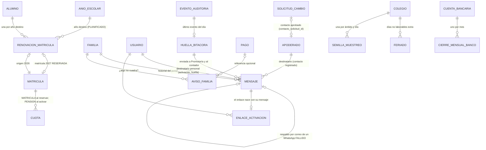

# Sprint 5 · Familias y matrícula 2027: diseño de arquitectura

> Diseño del agente `arquitecto-software`, 7 de octubre de 2026. Rama `claude/sprint-5-familias`, que parte de `claude/sprint-4-cero-digitacion` (sprints 0 a 4, 1429 pruebas en verde según `docs/estado-del-proyecto.md`). **No modifiqué código ni scripts del repositorio**: solo produje este documento.
> Paquete base `pe.edu.virgenmaria.cuentasclaras`. El stack no cambia (Spring Boot 4.1.1, Java 21, Hibernate 7.4, MySQL 8, H2 2.4.240). **Una sola dependencia nueva, a decidir (decisión 39):** `spring-boot-starter-mail` para el correo de respaldo. La alternativa sin dependencias es la API HTTP de un proveedor de correo con `RestClient`. WhatsApp usa `RestClient` (spring-web) y `javax.crypto.Mac` (firma de los avisos de Meta), como en el sprint 4.
>
> **Cómo se verificó (y qué NO se verificó)**
> - **Leído:** `CLAUDE.md`, la skill `contexto-colegio`, `docs/CONTINUAR-EN-LOCAL.md`, `plan-de-desarrollo.md`, `estado-del-proyecto.md`, `sprint-4-cero-digitacion.md`, `sprint-4-correcciones.md`, las migraciones V2–V16, `02-permisos-tablas.sql`, `03-triggers.sql` (41 triggers) y las clases citadas en «Archivos leídos».
> - **NO probado:** esta sesión fue de solo lectura. V17, V18 y V19, los GRANT y los 14 triggers nuevos **no se ejecutaron** en H2 ni en MySQL 8. El primer paso de cada tanda es aplicarlos sobre V1–V16 reales en ambas bases y pasar las inserciones imposibles del verificador, igual que se hizo en el sprint 4 (hallazgos 1 y 3 de ese documento).
> - **Normativa y proveedores:** feriados de 2027 por fuentes secundarias (ver «Fuentes»). La API de WhatsApp (Cloud API de Meta), la firma `X-Hub-Signature-256` de sus avisos y las plantillas «utility» se describen de memoria técnica y **deben confirmarse** con la documentación de Meta antes de activar el conector real.

## 1. Resumen
- **El padre es el auditor, y ahora se entera al instante.** Cada pago, anulación y descuento crea su mensaje en la **misma transacción** (outbox): no puede existir un pago vigente sin su mensaje. El mensaje sale por WhatsApp, con el correo de respaldo, con monto, concepto, número de comprobante y quién lo registró. Lo envía el actor `sistema.mensajeria`. El destino es **siempre el contacto registrado** del apoderado (lo exige un trigger) y su contenido no se edita (1143).
- **Nadie ve una clave ni un enlace de otro.** El personal y los apoderados reciben un **enlace de un solo uso** directo en su WhatsApp o correo. El token se genera **en el momento del envío**, dentro del proceso de sistema; nunca se guarda en claro, nunca vuelve a la pantalla de quien da el acceso y la base no admite un enlace sin su mensaje al titular. Cierra el A2 del sprint 1, el S4-M2 y su riesgo residual («activación desde otra IP»).
- **La huella de la bitácora sale del sistema todos los días.** Cada día a las 06:00 se envía a Promotoría (y, si el DBA lo configura, al correo externo del contador) el número de evento y su código. Cada mañana se vuelven a comprobar las huellas guardadas contra la cadena: si alguien recorta la bitácora, Promotoría ya tiene la prueba en su celular.
- **Portal de familias para celular:** estado de cuenta completo, boletas, pago en línea (el del sprint 4), historial de mensajes y un botón «¿Algo no cuadra?». Ese aviso le llega **solo a Promotoría y Dirección**, nunca a Caja ni a Administración.
- **Matrícula 2027 sin deuda inventada:**
  - la familia confirma la renovación en el portal (o en Administración, y entonces recibe un aviso);
  - el sistema crea la matrícula **RESERVADA** con su cuota de matrícula, tomada del plan 2027 aprobado por dos personas;
  - al pagarla, `sistema.matricula` la activa y genera las pensiones 2027;
  - la base impide activar una matrícula sin la cuota de matrícula pagada.
- **Pendientes del sprint 4:**
  - semilla secreta en el muestreo de caja;
  - feriados nacionales en el cálculo del día hábil (fijos en el código, nadie los edita), más los días no laborables que registre Promotoría o Dirección, solo a futuro;
  - trigger que impide reescribir el uso de un enlace;
  - **cierre bancario mensual a ciegas** contra el estado de cuenta oficial, para los riesgos de «extracto de varios días», «cargos de montos distintos» y, en parte, la colusión.

## 2. Hallazgos al leer el código (leer antes de implementar)
1. **`ServicioAccesoApoderados.darAcceso` y `ServicioUsuarios.crear/restablecer` devuelven el secreto a quien da el acceso** (`AccesoCreado.ruta`, `UsuarioCreado.claveTemporal`).
   - Este sprint cambia ambas firmas: devuelven solo «Enlace enviado a WhatsApp ••• 321» y el id del mensaje.
   - Las pruebas `AccesoApoderadosTest` y las de `ServicioUsuarios` que leen la clave o la ruta deben reescribirse; no basta con marcarlas `@Disabled`.
2. **La clave temporal del personal no tiene canal propio:** `usuario` tiene `correo` pero no celular.
   - V17 agrega `usuario.telefono_whatsapp`.
   - El personal **debe** tener celular o correo para recibir su enlace (decisión 48).
3. **Hueco: el contacto del apoderado se revisa al cambiar, no al nacer.**
   - Un cambio pasa por `CAMBIO_CONTACTO_APODERADO` (A4 del sprint 1), pero quien **registra o importa** al apoderado escribe su celular sin que nadie lo apruebe.
   - Una persona del personal podría registrar su propio número y recibir los avisos de pago y el enlace de activación de esa familia.
   - El diseño lo cierra en la base: un mensaje a un apoderado **no puede ir a un contacto que también es de alguien del personal**, salvo que ese contacto lo haya aprobado otra persona (`contacto_solicitud_id`). Ver `trg_mensaje_nace`.
4. **El cambio de contacto del apoderado solo lo vigila la aplicación.** `cc_app` tiene UPDATE por tabla sobre `apoderado`.
   - V17 agrega `apoderado.contacto_solicitud_id`. El trigger existente `trg_apoderado_facturacion` se amplía (mismo nombre, el conteo no cambia): un cambio de `telefono_whatsapp` o `correo` exige SU solicitud `CAMBIO_CONTACTO_APODERADO` APROBADA y usada una sola vez.
   - Es el mismo patrón que B2 (RUC) del sprint 3.
5. **`AlertasCaja.muestraDeVerificaciones` usa `new Random(hoy.toEpochDay())`.** La cajera puede calcular qué 3 verificaciones verá Promotoría. Se reemplaza por la semilla secreta de `semilla_muestreo`.
6. **`Calendario.siguienteDiaHabil` y `anteriorDiaHabil` son estáticos y no conocen feriados.** Hay **20 llamadas** en `src/main/java`.
   - Pasan a un bean `CalendarioHabil` (por colegio, con caché).
   - ArchUnit prohíbe los estáticos fuera de `comun.fecha`.
   - Los estáticos quedan como `@Deprecated` solo para las pruebas puras.
7. **La bitácora es una sola cadena para todos los colegios** (`auditoria_cadena`, fila única).
   - La huella de un colegio es su **último evento propio** del día (secuencia global y los 16 primeros caracteres de su hash).
   - No revela datos de otro colegio, y recortar la cola de la cadena borra ese evento.
8. **`GeneradorCronograma.generarPara`** exige `matricula.activa()` y genera matrícula y pensiones juntas (`existsByMatriculaIdAndTipoIn(DEL_PLAN)`). Pasa a generar por tipo:
   - con la matrícula **RESERVADA**, solo la cuota MATRICULA;
   - al **activarse**, las PENSION que falten.
   - La idempotencia por `uk_cuota_obligacion` se mantiene.
9. **Fechas de 2027:**
   - el 28/02/2027 es **domingo**: la matrícula «al último día de febrero» (decisión 8) vence en domingo y sin mora (decisión 15);
   - el Jueves y el Viernes Santo de 2027 caen el 25 y el 26 de marzo (Pascua: 28/03/2027).
10. **Pendiente de comprobar al implementar:**
    - que H2 2.4.240 acepte el `REGEXP_LIKE` de `ck_mensaje_destino` (V13 ya usa `REGEXP_LIKE`);
    - que el `ALTER TABLE matricula DROP CONSTRAINT ck_matricula_estado` funcione en ambas bases (en V13 funcionó el mismo patrón);
    - los nombres exactos de la Cloud API de Meta: versión del Graph, `messages`, botón URL con sufijo dinámico y estados `sent`, `delivered`, `read` y `failed`.

## 3. Decisiones
1. **Módulos nuevos y dependencias** (ArchUnit, sin ciclos):
   - `comunicacion` (mensajes, plantillas, envío, recordatorios, huella y webhook de WhatsApp) depende de `caja`, `cobranza`, `alumnos`, `seguridad`, `matricula`, `auditoria` y `comun`.
   - `matricula` (renovación 2027) depende de `alumnos`, `colegio`, `cobranza`, `caja` (solo el evento `PagoRegistrado`), `aprobaciones`, `auditoria` y `comun`.
   - `familias` (portal) depende de `caja`, `cobranza`, `alumnos`, `pasarela`, `comunicacion`, `matricula` y `comun`.
   - **Ni `caja`, ni `cobranza`, ni `alumnos`, ni `seguridad`, ni `auditoria` dependen de los módulos nuevos.** Publican eventos (`PagoRegistrado`, `PagoAnulado`, `DescuentoAprobado`, `ContactoCambiado`, `EnvioEnlaceSolicitado`, `HuellaDelDia`, `MatriculaActivada`) y `comunicacion` los escucha.
2. **Actores de sistema nuevos:**
   - `sistema.mensajeria` (`ROLE_SISTEMA_MENSAJERIA`): envía, reintenta y registra las respuestas del proveedor;
   - `sistema.matricula` (`ROLE_SISTEMA_MATRICULA`): crea la matrícula reservada y la activa;
   - `sistema.auditoria` (`ROLE_SISTEMA_AUDITORIA`): huella diaria y reverificación.
   - Se agregan a `ActorSistema`. El CHECK `ck_usuario_nombre_reservado` ya impide que una persona se llame así.
3. **Outbox de mensajes, en la misma transacción:**
   - los oyentes de `PagoRegistrado`, `PagoAnulado` y `DescuentoAprobado` son **síncronos** (`@EventListener`, no `AFTER_COMMIT`) e insertan el `mensaje` antes del commit del pago;
   - si el mensaje no se puede crear, el pago no se registra. La única excepción es una familia sin contacto, que no existe por `ck_apoderado_contacto`;
   - el envío es asíncrono (`DespachoMensajes`, cada 30 s, espera creciente de 1 a 60 min, como el outbox del OSE).
4. **Destinatarios y canales** (decisiones 41 y 42):
   - el pago va al **responsable de pago** de cada alumno pagado, uno por apoderado y no uno por alumno;
   - la anulación y el descuento van a **todos los apoderados activos** de la familia;
   - se intenta primero WhatsApp. Si no hay WhatsApp, o el mensaje queda FALLIDO, sale un mensaje de **respaldo** por correo (`respaldo_de_id`);
   - las anulaciones y los descuentos salen por **ambos** canales desde el inicio.
5. **Contenido fijo:**
   - las plantillas son un enum (`PlantillaMensaje`) con el nombre de la plantilla aprobada por Meta y el texto del correo;
   - los parámetros los arma el sistema desde el pago, la anulación o el descuento: **ninguna persona escribe texto libre** a un apoderado;
   - el mensaje guarda los parámetros (sin DNI ni token) y nunca cambian (1143).
6. **Enlace de activación generado en el envío:**
   - `seguridad` publica `EnvioEnlaceSolicitado` (usuario, propósito) y `comunicacion` crea el mensaje `ACTIVACION_CUENTA` sin token;
   - `DespachoMensajes`, como `sistema.mensajeria` y en una transacción, llama a `EnlacesActivacion.generarParaMensaje(mensajeId)`: genera el token, guarda su SHA-256 con `mensaje_id`, llama al proveedor y marca ENVIADO;
   - si el proveedor falla, se revierte todo y el siguiente intento genera otro token;
   - si el proveedor aceptó pero el commit falla, el titular recibe un enlace que no sirve y pide otro. Es aceptable y queda en el log;
   - quien da el acceso ve solo «Enlace enviado a WhatsApp ••• 321 (vence en 48 h)».
7. **Huella diaria:**
   - a las 06:00 (Lima), `sistema.auditoria` toma el último evento de cada colegio hasta las 23:59:59 del día anterior y guarda `huella_bitacora` (solo inserción; un trigger exige que coincida con la bitácora);
   - publica `HuellaDelDia`, y `comunicacion` la envía a cada usuario PROMOTOR activo y, si existe la fila `configuracion_bd('huella_correo_externo')` que **solo escribe el DBA**, a ese correo;
   - a las 06:05 se reverifica la cadena completa y las huellas de los últimos 400 días. Una discrepancia es CRÍTICA y se envía por mensaje.
8. **Portal de familias:**
   - la familia sale del principal, nunca de la URL (igual que en el sprint 4);
   - las boletas son la página imprimible existente, con un enlace «Guardar como PDF» del navegador, más el PDF del OSE cuando `enlace_pdf` exista (decisión 50). No se agrega una librería de PDF;
   - el historial de mensajes muestra los de los apoderados de la familia (12 meses), con su estado de entrega y sin el contenido de los de activación.
9. **«¿Algo no cuadra?»** (`aviso_familia`): lo envía el apoderado con un tipo (PAGUE_Y_NO_APARECE, NO_RECONOZCO_PAGO, NO_RECONOZCO_ANULACION_O_DESCUENTO, OTRO), una referencia opcional a un pago o una cuota y un texto. Es una alerta **CRÍTICA solo para Promotoría y Dirección**. Caja y Administración no lo ven ni lo cierran, porque pueden ser parte del problema.
10. **Renovación 2027** (decisiones 53 a 58):
    - Administración abre la campaña cuando el año 2027 está PLANIFICADO, con secciones y con el plan 2027 APROBADO de cada nivel. El sistema propone, para cada alumno ACTIVO con matrícula 2026 ACTIVA, el **grado siguiente** y la sección de la misma letra (si no existe, la primera). 5.° de secundaria no se propone.
    - Dirección puede marcar repitencias o cambiar la sección mientras la propuesta esté PROPUESTA.
    - La familia confirma en el portal, o Administración registra la confirmación presencial; en ese caso **se avisa a la familia** («si no la pediste, avísanos»).
    - Al confirmarse, `sistema.matricula` crea la matrícula **RESERVADA** y el generador crea su cuota MATRICULA.
    - Sin confirmación no hay deuda: la propuesta **VENCE** en la fecha límite.
11. **Activación de la matrícula:**
    - un oyente `AFTER_COMMIT` de `PagoRegistrado` (más un barrido cada 10 min) activa, como `sistema.matricula`, toda matrícula RESERVADA cuya cuota MATRICULA quedó PAGADA o EXONERADA;
    - publica `MatriculaActivada` y `GeneradorCronograma` genera las 10 pensiones 2027;
    - si después se anula el pago de la matrícula, **no se desactiva sola**: queda una alerta ATENCIÓN y se resuelve con las aprobaciones existentes (decisión 57);
    - el **desistimiento** de una RESERVADA usa `ANULACION_CUOTA` (la pide Administración y la aprueba otra persona) y luego pasa a RETIRADA. La base exige que no quede la matrícula pagada ni en pago parcial.
12. **Recordatorios** (tanda 3; decisiones 44 y 45):
    - uno **3 días antes** del vencimiento y uno **el día hábil siguiente** al vencimiento, por familia y por fecha, con todas sus cuotas de esa fecha. Nada más;
    - solo de lunes a sábado, entre las 08:00 y las 20:00, nunca en domingo ni feriado (se adelantan al día hábil anterior);
    - el texto no menciona evaluaciones, notas, exámenes, libretas ni constancias (INDECOPI; prueba de plantillas);
    - el apoderado puede apagar los recordatorios desde el portal. **No** puede apagar los avisos de pago, anulación y descuento, porque son el control antifraude y parte del servicio contratado (decisión 45).
13. **Conector simulado:**
    - el valor por defecto es `SIMULADO` en `dev`, `test` y `piloto`;
    - en `prod` **no existe** y la aplicación **no arranca sin al menos un canal real** (WhatsApp o correo; decisión 40), porque sin aviso al padre el control 4 de la skill no existe;
    - el detalle está en la sección 8.3.
14. **Feriados:**
    - `FeriadosNacionales.de(anio)` está en el código: los 16 feriados de ley, con el Jueves y el Viernes Santo calculados desde la Pascua. Nadie los edita;
    - la tabla `feriado` es solo para días no laborables decretados o feriados locales. Los registra Promotoría o Dirección, **solo para fechas futuras** (trigger), y se anulan solo antes de su fecha;
    - registrar un feriado es un evento resaltado, porque retrasa las alertas de depósito y de abono.
15. **Cierre bancario mensual a ciegas** (tanda 3; decisión 60):
    - el día 1, `sistema.conciliacion` crea el cierre del mes anterior con los totales de abonos y cargos y el saldo final calculados desde los extractos CONFIRMADOS;
    - una persona de Promotoría o Dirección **que no subió ni confirmó ningún extracto de ese mes** escribe a ciegas los tres números del **estado de cuenta oficial** del banco;
    - 2 intentos distintos dejan el cierre en DISCREPANCIA, con alerta CRÍTICA;
    - un abono inventado y tapado con cargos de montos distintos cambia los totales del mes aunque el saldo cuadre.
16. **Orden de bloqueos** (se extiende el del sprint 4): solicitud → renovacion_matricula → matricula → orden_pago | lote | cuenta → caja → pago → cuotas (id ascendente) → descuento → serie → **mensaje** → bitácora.
17. **Sin SQL nativo, sin `delete*` y sin `@Modifying`** en los repositorios nuevos.

## 4. Modelo

**Invariantes.** «(base)» = CHECK, UNIQUE o FK; «(MySQL)» = trigger; «(1143)» = sin GRANT de UPDATE en esa columna.

- **Mensaje:**
  - uno por `(colegio, clave)` (base); la clave es idempotente, por ejemplo `PAGO:{pagoId}:APODERADO:{id}:WHATSAPP`;
  - nace PENDIENTE, con 0 intentos y sin proveedor ni envío (MySQL);
  - el destino es **exactamente** el celular o el correo registrado del destinatario (MySQL), salvo:
    - `CONTACTO_CAMBIADO`, que va al contacto anterior con su solicitud aprobada;
    - `EXTERNO`, que va solo al correo de `configuracion_bd`;
  - a un apoderado no se le escribe a un contacto que también es de alguien del personal, salvo que el contacto lo haya aprobado otra persona (MySQL);
  - la activación del personal no va al contacto de quien la pidió (MySQL);
  - tipo, destino, plantilla, parámetros, destinatario y entidad no cambian (1143);
  - los parámetros nunca llevan el token (base: `NOT LIKE '%/activar/%'`);
  - transiciones válidas; los intentos suben de uno en uno; proveedor e id del proveedor se escriben una vez (MySQL);
  - ENVIADO exige proveedor, id y fecha (base);
  - `SIMULADO` solo si existe `configuracion_bd('mensajeria_simulada','PERMITIDA')`, que `cc_app` no puede escribir (MySQL y 1142);
  - `ACTIVACION_CUENTA` pasa a ENVIADO solo con su enlace vigente (MySQL);
  - un respaldo, solo de un WhatsApp FALLIDO al mismo destinatario, por correo y una vez (base y MySQL).
- **Enlace de activación:**
  - nace sin usar, sin anular y con su `mensaje_id` de tipo `ACTIVACION_CUENTA` PENDIENTE para **ese** usuario, con vigencia de 72 h como máximo (MySQL);
  - un mensaje tiene un solo enlace (base);
  - el uso y la anulación se escriben una vez, nunca juntos, y no se usa vencido (MySQL; cierra el riesgo residual «columnas de uso del enlace»).
- **Apoderado:**
  - nace sin `contacto_solicitud_id` (MySQL);
  - celular o correo cambian solo con SU `CAMBIO_CONTACTO_APODERADO` APROBADA, y cada solicitud se usa una sola vez (base y MySQL).
- **Huella:** una por colegio y día (base); solo inserción (1142); su secuencia y su código coinciden con un evento de **ese** colegio (MySQL).
- **Renovación:**
  - una por alumno y año destino (base);
  - nace PROPUESTA para un alumno ACTIVO de **esa** familia, con su matrícula de origen ACTIVA, un año destino PLANIFICADO y una sección del grado propuesto (MySQL);
  - grado y sección cambian solo en PROPUESTA (MySQL);
  - la respuesta se escribe una vez: en el portal, por un apoderado de esa familia; en presencial, por una persona (MySQL);
  - MATRICULADA exige su matrícula del mismo alumno, año y sección (MySQL).
- **Matrícula:**
  - nace RESERVADA solo en un año PLANIFICADO, y ACTIVA solo en un año EN_CURSO (MySQL);
  - RESERVADA → ACTIVA solo con su cuota MATRICULA PAGADA o EXONERADA, o con un plan de matrícula 0 (MySQL);
  - RESERVADA → RETIRADA solo sin la cuota de matrícula pagada ni en pago parcial (MySQL);
  - alumno y año no cambian (MySQL).
- **Aviso de la familia:** texto, tipo, familia y referencias no cambian (1143); ABIERTO → ATENDIDO una vez, con respuesta y por una persona (MySQL).
- **Feriado:**
  - uno vigente por colegio y fecha (base);
  - se registra solo para fechas futuras en la hora de Lima (MySQL);
  - se anula una vez, antes de su fecha (MySQL);
  - la fecha no cambia (1143).
- **Semilla de muestreo:** una por colegio, ámbito y día (base); solo inserción (1142).
- **Cierre mensual:**
  - uno por cuenta y mes (base);
  - nace ABIERTO con los totales calculados de los extractos CONFIRMADOS que cubren **todo** el mes (MySQL);
  - los totales no cambian (1143);
  - CUADRADO exige los tres números a ciegas iguales (base), escritos por alguien que no subió ni confirmó extractos de ese mes (MySQL);
  - los intentos suben de uno en uno (MySQL).

## 5. Máquinas de estado
**Mensaje** (`mensaje.estado`)
```
PENDIENTE ──(proveedor aceptó: id del proveedor)──▶ ENVIADO ──(aviso: entregado)──▶ ENTREGADO ──(aviso: leído)──▶ LEIDO
   │  ▲  └─(error definitivo: número inválido, sin WhatsApp, plantilla rechazada)──▶ FALLIDO ──▶ (crea respaldo por CORREO)
   │  │                                                ENVIADO|ENTREGADO ──(aviso: failed)──▶ FALLIDO
   └──┘ (error de red o 5xx: intentos + 1, próximo intento con espera creciente; a los 8 intentos → FALLIDO)
```
- FALLIDO y LEIDO son finales. ENVIADO → LEIDO directo está permitido, porque los avisos de Meta pueden llegar en desorden.
- Un correo pasa a ENVIADO cuando el SMTP lo acepta. Sin avisos de entrega, queda en ENVIADO.

**Enlace de activación:** VIGENTE (sin uso ni anulación) → USADO | ANULADO (restablecer) | vencido (`vence_en`, no es un estado). Ninguno vuelve atrás.

**Renovación** (`renovacion_matricula.estado`)
```
PROPUESTA ──(familia en el portal, o Administración presencial)──▶ CONFIRMADA ──(sistema.matricula crea la matrícula RESERVADA)──▶ MATRICULADA
    ├──(familia o Administración: «no continúa»)──────────────────▶ NO_CONTINUA
    └──(pasó la fecha límite sin respuesta)───────────────────────▶ VENCIDA
```
**Matrícula** (`matricula.estado`)
```
RESERVADA ──(cuota MATRICULA PAGADA o EXONERADA; sistema.matricula)──▶ ACTIVA ──(retiro con aprobación, sprint 2)──▶ RETIRADA
    └──(desistimiento: cuota de matrícula ANULADA con aprobación o sin pagos)──────────────────▶ RETIRADA
```
**Aviso de la familia:** ABIERTO → ATENDIDO (Promotoría o Dirección, con respuesta visible para la familia).

**Feriado:** VIGENTE (`vigente = TRUE`) → ANULADO (`vigente = NULL`, antes de su fecha).

**Cierre mensual** (`cierre_mensual_banco.estado`)
```
ABIERTO ──(tres números a ciegas iguales a los calculados)──▶ CUADRADO
   └──(2 intentos distintos)──▶ DISCREPANCIA (alerta CRÍTICA; lo revisa el contador con el estado de cuenta)
```

## 6. Migraciones Flyway (NO probadas: aplicar sobre V1–V16 en H2 2.4.240 MODE=MySQL y MySQL 8 antes de seguir)

### `V17__mensajeria_y_acceso_directo.sql` (tanda 1)
```sql
-- Sprint 5 · tanda 1: mensajes a las familias y al personal (WhatsApp con correo de respaldo) en un outbox que se llena
-- en la MISMA transacción del pago, la anulación o el descuento; enlace de activación enviado directo al titular; huella
-- diaria de la bitácora. Nada se borra. huella_bitacora es de SOLO INSERCIÓN. Los triggers de scripts/mysql/03-triggers.sql
-- vigilan el destino (siempre el contacto registrado), los estados y la mensajería simulada.

-- Celular del personal: recibe su enlace de activación (y Promotoría, la huella diaria). Obligatorio desde este sprint
-- para crear o restablecer el acceso (validación; las cuentas existentes lo completan en su próximo ingreso).
ALTER TABLE usuario ADD COLUMN telefono_whatsapp VARCHAR(16);

-- El celular y el correo del apoderado solo cambian con SU solicitud CAMBIO_CONTACTO_APODERADO aprobada (trigger), una
-- vez por solicitud. Mismo patrón que facturacion_solicitud_id (B2 del sprint 3).
ALTER TABLE apoderado ADD COLUMN contacto_solicitud_id BIGINT;
ALTER TABLE apoderado ADD CONSTRAINT uk_apoderado_contacto_solicitud UNIQUE (colegio_id, contacto_solicitud_id);
ALTER TABLE apoderado ADD CONSTRAINT fk_apoderado_contacto_solicitud FOREIGN KEY (contacto_solicitud_id, colegio_id)
    REFERENCES solicitud_cambio (id, colegio_id);

-- Mensaje (outbox). destinatario: un apoderado (con su familia, para el historial del portal), un usuario del personal
-- o EXTERNO (solo el correo que el DBA dejó en configuracion_bd). destino: copia del contacto registrado al crearlo; no
-- cambia. parametros: los valores de la plantilla, armados por el sistema; nunca el token de activación ni el DNI.
CREATE TABLE mensaje (
    id                    BIGINT         NOT NULL AUTO_INCREMENT PRIMARY KEY,
    colegio_id            BIGINT         NOT NULL,
    clave                 VARCHAR(120)   NOT NULL,
    tipo                  VARCHAR(30)    NOT NULL,
    canal                 VARCHAR(10)    NOT NULL,
    destinatario_tipo     VARCHAR(10)    NOT NULL,
    apoderado_id          BIGINT,
    familia_id            BIGINT,
    usuario_id            BIGINT,
    destino               VARCHAR(150)   NOT NULL,
    plantilla             VARCHAR(60)    NOT NULL,
    parametros            VARCHAR(1000)  NOT NULL,
    entidad               VARCHAR(40),
    entidad_id            BIGINT,
    respaldo_de_id        BIGINT,
    estado                VARCHAR(20)    NOT NULL,
    proveedor             VARCHAR(20),
    proveedor_mensaje_id  VARCHAR(120),
    intentos              INT            NOT NULL DEFAULT 0,
    proximo_intento_en    DATETIME(6),
    enviado_en            DATETIME(6),
    entregado_en          DATETIME(6),
    leido_en              DATETIME(6),
    ultimo_error          VARCHAR(250),
    creado_en             DATETIME(6)    NOT NULL,
    creado_por            VARCHAR(60)    NOT NULL,
    actualizado_en        DATETIME(6)    NOT NULL,
    version               BIGINT         NOT NULL DEFAULT 0,
    CONSTRAINT uk_mensaje_clave UNIQUE (colegio_id, clave),
    CONSTRAINT uk_mensaje_proveedor UNIQUE (proveedor, proveedor_mensaje_id),
    CONSTRAINT uk_mensaje_respaldo UNIQUE (colegio_id, respaldo_de_id),
    CONSTRAINT uk_mensaje_id_colegio UNIQUE (id, colegio_id),
    CONSTRAINT fk_mensaje_colegio FOREIGN KEY (colegio_id) REFERENCES colegio (id),
    CONSTRAINT fk_mensaje_familia FOREIGN KEY (familia_id, colegio_id) REFERENCES familia (id, colegio_id),
    -- El apoderado es de ESA familia (uk_apoderado_id_familia de V5).
    CONSTRAINT fk_mensaje_apoderado FOREIGN KEY (apoderado_id, familia_id) REFERENCES apoderado (id, familia_id),
    CONSTRAINT fk_mensaje_usuario FOREIGN KEY (usuario_id) REFERENCES usuario (id),
    CONSTRAINT fk_mensaje_respaldo FOREIGN KEY (respaldo_de_id, colegio_id) REFERENCES mensaje (id, colegio_id),
    CONSTRAINT ck_mensaje_tipo CHECK (tipo IN ('PAGO_REGISTRADO', 'PAGO_ANULADO', 'DESCUENTO_APROBADO',
        'CONTACTO_CAMBIADO', 'ACTIVACION_CUENTA', 'HUELLA_BITACORA', 'RECORDATORIO_VENCIMIENTO', 'CUOTA_VENCIDA',
        'RENOVACION_MATRICULA', 'RENOVACION_REGISTRADA', 'AVISO_ATENDIDO')),
    CONSTRAINT ck_mensaje_canal CHECK (canal IN ('WHATSAPP', 'CORREO')),
    CONSTRAINT ck_mensaje_destinatario CHECK (
        (destinatario_tipo = 'APODERADO' AND apoderado_id IS NOT NULL AND familia_id IS NOT NULL AND usuario_id IS NULL)
        OR (destinatario_tipo = 'USUARIO' AND usuario_id IS NOT NULL AND apoderado_id IS NULL AND familia_id IS NULL)
        OR (destinatario_tipo = 'EXTERNO' AND usuario_id IS NULL AND apoderado_id IS NULL AND familia_id IS NULL
            AND tipo = 'HUELLA_BITACORA' AND canal = 'CORREO')),
    CONSTRAINT ck_mensaje_destino CHECK (
        (canal = 'WHATSAPP' AND REGEXP_LIKE(destino, '^[+]?[0-9]{9,15}$'))
        OR (canal = 'CORREO' AND destino LIKE '%_@_%._%')),
    CONSTRAINT ck_mensaje_sin_token CHECK (parametros NOT LIKE '%/activar/%'),
    CONSTRAINT ck_mensaje_estado CHECK (estado IN ('PENDIENTE', 'ENVIADO', 'ENTREGADO', 'LEIDO', 'FALLIDO')
        AND intentos >= 0),
    CONSTRAINT ck_mensaje_proveedor CHECK (proveedor IS NULL
        OR proveedor IN ('SIMULADO', 'WHATSAPP_CLOUD', 'SMTP')),
    CONSTRAINT ck_mensaje_envio CHECK (
        (estado = 'PENDIENTE' AND proveedor_mensaje_id IS NULL AND enviado_en IS NULL)
        OR (estado IN ('ENVIADO', 'ENTREGADO', 'LEIDO') AND proveedor IS NOT NULL AND proveedor_mensaje_id IS NOT NULL
            AND enviado_en IS NOT NULL)
        OR (estado = 'FALLIDO' AND ultimo_error IS NOT NULL)),
    CONSTRAINT ck_mensaje_respaldo CHECK (respaldo_de_id IS NULL OR canal = 'CORREO')
);
CREATE INDEX ix_mensaje_outbox ON mensaje (estado, proximo_intento_en);
CREATE INDEX ix_mensaje_familia ON mensaje (colegio_id, familia_id, creado_en);
CREATE INDEX ix_mensaje_entidad ON mensaje (colegio_id, entidad, entidad_id);

-- S4-M2 y A2: el enlace nace CON su mensaje al titular (trigger) y lo genera el proceso de envío; nadie lo ve en pantalla.
-- PERSONAL: alta o restablecimiento de una cuenta del personal (reemplaza la clave temporal visible).
ALTER TABLE enlace_activacion ADD COLUMN mensaje_id BIGINT;
ALTER TABLE enlace_activacion ADD COLUMN proposito VARCHAR(20) NOT NULL DEFAULT 'APODERADO';
ALTER TABLE enlace_activacion ADD CONSTRAINT uk_enlace_activacion_mensaje UNIQUE (mensaje_id);
ALTER TABLE enlace_activacion ADD CONSTRAINT fk_enlace_activacion_mensaje FOREIGN KEY (mensaje_id, colegio_id)
    REFERENCES mensaje (id, colegio_id);
ALTER TABLE enlace_activacion ADD CONSTRAINT ck_enlace_activacion_proposito CHECK (proposito IN ('APODERADO', 'PERSONAL'));

-- Huella diaria de la bitácora (último evento del colegio hasta las 23:59:59 del día). SOLO INSERCIÓN. Debe coincidir con
-- la bitácora (trigger). Lo que vale es la copia que llega al celular de Promotoría: esta tabla es el registro de envío
-- y la base de la reverificación diaria.
CREATE TABLE huella_bitacora (
    id               BIGINT        NOT NULL AUTO_INCREMENT PRIMARY KEY,
    colegio_id       BIGINT        NOT NULL,
    fecha            DATE          NOT NULL,
    secuencia        BIGINT        NOT NULL,
    codigo           VARCHAR(16)   NOT NULL,
    eventos_del_dia  INT           NOT NULL,
    creado_en        DATETIME(6)   NOT NULL,
    creado_por       VARCHAR(60)   NOT NULL,
    actualizado_en   DATETIME(6)   NOT NULL,
    version          BIGINT        NOT NULL DEFAULT 0,
    CONSTRAINT uk_huella_bitacora_fecha UNIQUE (colegio_id, fecha),
    CONSTRAINT fk_huella_bitacora_colegio FOREIGN KEY (colegio_id) REFERENCES colegio (id),
    CONSTRAINT ck_huella_bitacora_codigo CHECK (REGEXP_LIKE(codigo, '^[0-9a-f]{16}$', 'c') AND secuencia >= 1
        AND eventos_del_dia >= 0),
    CONSTRAINT ck_huella_bitacora_actor CHECK (creado_por = 'sistema.auditoria')
);
```

### `V18__portal_y_matricula_2027.sql` (tanda 2)
```sql
-- Sprint 5 · tanda 2: renovación de la matrícula 2027 (la familia confirma; sin confirmación no hay deuda), matrícula
-- RESERVADA hasta pagar la matrícula, y avisos de la familia («¿algo no cuadra?») que solo ven Promotoría y Dirección.

-- Matrícula RESERVADA: año siguiente, solo con la cuota de matrícula; pasa a ACTIVA al pagarla (trigger). Las pensiones
-- se generan al activarse.
ALTER TABLE matricula DROP CONSTRAINT ck_matricula_estado;
ALTER TABLE matricula ADD CONSTRAINT ck_matricula_estado CHECK (estado IN ('RESERVADA', 'ACTIVA', 'RETIRADA'));
ALTER TABLE matricula DROP CONSTRAINT ck_matricula_retiro;
ALTER TABLE matricula ADD CONSTRAINT ck_matricula_retiro CHECK ((estado = 'RETIRADA' AND retirada_en IS NOT NULL)
    OR (estado IN ('RESERVADA', 'ACTIVA') AND retirada_en IS NULL));
ALTER TABLE matricula ADD COLUMN activada_en DATETIME(6);
ALTER TABLE matricula ADD COLUMN activada_por VARCHAR(60);
ALTER TABLE matricula ADD CONSTRAINT ck_matricula_activacion CHECK ((activada_en IS NULL AND activada_por IS NULL)
    OR (activada_en IS NOT NULL AND activada_por = 'sistema.matricula'));

-- Renovación: propuesta del sistema para cada alumno que continúa. La familia confirma (PORTAL) o Administración registra
-- su respuesta (PRESENCIAL; la familia recibe un aviso). con_deuda y deuda_al_proponer: solo informativos (decisión 55).
CREATE TABLE renovacion_matricula (
    id                   BIGINT         NOT NULL AUTO_INCREMENT PRIMARY KEY,
    colegio_id           BIGINT         NOT NULL,
    anio_destino_id      BIGINT         NOT NULL,
    alumno_id            BIGINT         NOT NULL,
    familia_id           BIGINT         NOT NULL,
    matricula_origen_id  BIGINT         NOT NULL,
    grado_destino        VARCHAR(20)    NOT NULL,
    seccion_destino_id   BIGINT         NOT NULL,
    deuda_al_proponer    DECIMAL(10,2)  NOT NULL DEFAULT 0.00,
    vence_en             DATE           NOT NULL,
    estado               VARCHAR(20)    NOT NULL,
    canal_respuesta      VARCHAR(12),
    respondido_por       VARCHAR(60),
    respondido_en        DATETIME(6),
    matricula_id         BIGINT,
    creado_en            DATETIME(6)    NOT NULL,
    creado_por           VARCHAR(60)    NOT NULL,
    actualizado_en       DATETIME(6)    NOT NULL,
    version              BIGINT         NOT NULL DEFAULT 0,
    CONSTRAINT uk_renovacion_alumno UNIQUE (colegio_id, alumno_id, anio_destino_id),
    CONSTRAINT uk_renovacion_matricula UNIQUE (matricula_id),
    CONSTRAINT uk_renovacion_id_colegio UNIQUE (id, colegio_id),
    CONSTRAINT fk_renovacion_colegio FOREIGN KEY (colegio_id) REFERENCES colegio (id),
    CONSTRAINT fk_renovacion_anio FOREIGN KEY (anio_destino_id, colegio_id) REFERENCES anio_escolar (id, colegio_id),
    CONSTRAINT fk_renovacion_alumno FOREIGN KEY (alumno_id, colegio_id) REFERENCES alumno (id, colegio_id),
    CONSTRAINT fk_renovacion_familia FOREIGN KEY (familia_id, colegio_id) REFERENCES familia (id, colegio_id),
    CONSTRAINT fk_renovacion_origen FOREIGN KEY (matricula_origen_id, colegio_id) REFERENCES matricula (id, colegio_id),
    CONSTRAINT fk_renovacion_seccion FOREIGN KEY (seccion_destino_id, anio_destino_id)
        REFERENCES seccion (id, anio_escolar_id),
    CONSTRAINT fk_renovacion_matricula FOREIGN KEY (matricula_id, colegio_id) REFERENCES matricula (id, colegio_id),
    CONSTRAINT ck_renovacion_estado CHECK (estado IN ('PROPUESTA', 'CONFIRMADA', 'MATRICULADA', 'NO_CONTINUA',
        'VENCIDA')),
    CONSTRAINT ck_renovacion_grado CHECK (grado_destino IN ('INICIAL_3', 'INICIAL_4', 'INICIAL_5',
        'PRIMARIA_1', 'PRIMARIA_2', 'PRIMARIA_3', 'PRIMARIA_4', 'PRIMARIA_5', 'PRIMARIA_6',
        'SECUNDARIA_1', 'SECUNDARIA_2', 'SECUNDARIA_3', 'SECUNDARIA_4', 'SECUNDARIA_5')),
    CONSTRAINT ck_renovacion_deuda CHECK (deuda_al_proponer >= 0),
    CONSTRAINT ck_renovacion_respuesta CHECK (
        (estado IN ('PROPUESTA', 'VENCIDA') AND canal_respuesta IS NULL AND respondido_por IS NULL
            AND respondido_en IS NULL)
        OR (estado IN ('CONFIRMADA', 'MATRICULADA', 'NO_CONTINUA') AND canal_respuesta IN ('PORTAL', 'PRESENCIAL')
            AND respondido_por IS NOT NULL AND respondido_en IS NOT NULL AND respondido_por NOT LIKE 'sistema%')),
    CONSTRAINT ck_renovacion_matricula CHECK ((estado = 'MATRICULADA' AND matricula_id IS NOT NULL)
        OR (estado <> 'MATRICULADA' AND matricula_id IS NULL))
);
CREATE INDEX ix_renovacion_estado ON renovacion_matricula (colegio_id, anio_destino_id, estado);
CREATE INDEX ix_renovacion_familia ON renovacion_matricula (colegio_id, familia_id);

-- «¿Algo no cuadra?»: lo escribe el apoderado; lo ven y lo atienden SOLO Promotoría o Dirección. El texto no cambia.
CREATE TABLE aviso_familia (
    id              BIGINT        NOT NULL AUTO_INCREMENT PRIMARY KEY,
    colegio_id      BIGINT        NOT NULL,
    familia_id      BIGINT        NOT NULL,
    apoderado_id    BIGINT        NOT NULL,
    tipo            VARCHAR(40)   NOT NULL,
    pago_id         BIGINT,
    cuota_id        BIGINT,
    texto           VARCHAR(500)  NOT NULL,
    estado          VARCHAR(20)   NOT NULL,
    atendido_por    VARCHAR(60),
    atendido_en     DATETIME(6),
    respuesta       VARCHAR(500),
    creado_en       DATETIME(6)   NOT NULL,
    creado_por      VARCHAR(60)   NOT NULL,
    actualizado_en  DATETIME(6)   NOT NULL,
    version         BIGINT        NOT NULL DEFAULT 0,
    CONSTRAINT uk_aviso_familia_id_colegio UNIQUE (id, colegio_id),
    CONSTRAINT fk_aviso_familia_colegio FOREIGN KEY (colegio_id) REFERENCES colegio (id),
    CONSTRAINT fk_aviso_familia_familia FOREIGN KEY (familia_id, colegio_id) REFERENCES familia (id, colegio_id),
    CONSTRAINT fk_aviso_familia_apoderado FOREIGN KEY (apoderado_id, familia_id) REFERENCES apoderado (id, familia_id),
    CONSTRAINT fk_aviso_familia_pago FOREIGN KEY (pago_id, colegio_id) REFERENCES pago (id, colegio_id),
    CONSTRAINT fk_aviso_familia_cuota FOREIGN KEY (cuota_id, colegio_id) REFERENCES cuota (id, colegio_id),
    CONSTRAINT ck_aviso_familia_tipo CHECK (tipo IN ('PAGUE_Y_NO_APARECE', 'NO_RECONOZCO_PAGO',
        'NO_RECONOZCO_ANULACION_O_DESCUENTO', 'OTRO')),
    CONSTRAINT ck_aviso_familia_estado CHECK (
        (estado = 'ABIERTO' AND atendido_por IS NULL AND atendido_en IS NULL AND respuesta IS NULL)
        OR (estado = 'ATENDIDO' AND atendido_por IS NOT NULL AND atendido_en IS NOT NULL AND respuesta IS NOT NULL
            AND atendido_por NOT LIKE 'sistema%'))
);
CREATE INDEX ix_aviso_familia_estado ON aviso_familia (colegio_id, estado, creado_en);
```

### `V19__recordatorios_feriados_y_cierre_mensual.sql` (tanda 3)
```sql
-- Sprint 5 · tanda 3: recordatorios (preferencia del apoderado), feriados extra del colegio, semilla secreta del muestreo
-- de caja (pendiente del sprint 3) y cierre bancario mensual a ciegas (riesgos residuales del sprint 4).

-- Recordatorios de vencimiento: el apoderado puede apagarlos desde el portal. Los avisos de pago, anulación y descuento NO
-- se apagan (control antifraude).
ALTER TABLE apoderado ADD COLUMN recordatorios_activos BOOLEAN NOT NULL DEFAULT TRUE;

-- Días no laborables EXTRA (los feriados nacionales están en el código y no se editan). Solo fechas futuras (trigger).
-- vigente: TRUE o NULL (anulado), para un único feriado vigente por fecha.
CREATE TABLE feriado (
    id                BIGINT        NOT NULL AUTO_INCREMENT PRIMARY KEY,
    colegio_id        BIGINT        NOT NULL,
    fecha             DATE          NOT NULL,
    descripcion       VARCHAR(80)   NOT NULL,
    vigente           BOOLEAN,
    anulado_por       VARCHAR(60),
    anulado_en        DATETIME(6),
    motivo_anulacion  VARCHAR(500),
    creado_en         DATETIME(6)   NOT NULL,
    creado_por        VARCHAR(60)   NOT NULL,
    actualizado_en    DATETIME(6)   NOT NULL,
    version           BIGINT        NOT NULL DEFAULT 0,
    CONSTRAINT uk_feriado_vigente UNIQUE (colegio_id, fecha, vigente),
    CONSTRAINT fk_feriado_colegio FOREIGN KEY (colegio_id) REFERENCES colegio (id),
    CONSTRAINT ck_feriado_estado CHECK ((vigente = TRUE AND anulado_por IS NULL AND anulado_en IS NULL)
        OR (vigente IS NULL AND anulado_por IS NOT NULL AND anulado_en IS NOT NULL AND motivo_anulacion IS NOT NULL))
);

-- Semilla secreta del muestreo diario (SecureRandom). SOLO INSERCIÓN. Ámbito CAJA: las 3 verificaciones que ve Promotoría.
CREATE TABLE semilla_muestreo (
    id              BIGINT        NOT NULL AUTO_INCREMENT PRIMARY KEY,
    colegio_id      BIGINT        NOT NULL,
    ambito          VARCHAR(20)   NOT NULL,
    fecha           DATE          NOT NULL,
    semilla         BIGINT        NOT NULL,
    creado_en       DATETIME(6)   NOT NULL,
    creado_por      VARCHAR(60)   NOT NULL,
    actualizado_en  DATETIME(6)   NOT NULL,
    version         BIGINT        NOT NULL DEFAULT 0,
    CONSTRAINT uk_semilla_muestreo UNIQUE (colegio_id, ambito, fecha),
    CONSTRAINT fk_semilla_muestreo_colegio FOREIGN KEY (colegio_id) REFERENCES colegio (id),
    CONSTRAINT ck_semilla_muestreo_ambito CHECK (ambito IN ('CAJA'))
);

-- Cierre bancario mensual a ciegas. Los totales calculados los fija el sistema al crearlo (trigger: suma de los
-- movimientos de los extractos CONFIRMADOS que cubren todo el mes). Quien no subió ni confirmó extractos del mes escribe a
-- ciegas los tres números del estado de cuenta oficial. DECIMAL(14,2) como los saldos (hallazgo 12 del sprint 4).
CREATE TABLE cierre_mensual_banco (
    id              BIGINT         NOT NULL AUTO_INCREMENT PRIMARY KEY,
    colegio_id      BIGINT         NOT NULL,
    cuenta_id       BIGINT         NOT NULL,
    anio            INT            NOT NULL,
    mes             INT            NOT NULL,
    total_abonos    DECIMAL(14,2)  NOT NULL,
    total_cargos    DECIMAL(14,2)  NOT NULL,
    saldo_final     DECIMAL(14,2)  NOT NULL,
    estado          VARCHAR(20)    NOT NULL,
    intentos        INT            NOT NULL DEFAULT 0,
    abonos_ciego    DECIMAL(14,2),
    cargos_ciego    DECIMAL(14,2),
    saldo_ciego     DECIMAL(14,2),
    registrado_por  VARCHAR(60),
    registrado_en   DATETIME(6),
    creado_en       DATETIME(6)    NOT NULL,
    creado_por      VARCHAR(60)    NOT NULL,
    actualizado_en  DATETIME(6)    NOT NULL,
    version         BIGINT         NOT NULL DEFAULT 0,
    CONSTRAINT uk_cierre_mensual UNIQUE (colegio_id, cuenta_id, anio, mes),
    CONSTRAINT fk_cierre_mensual_colegio FOREIGN KEY (colegio_id) REFERENCES colegio (id),
    CONSTRAINT fk_cierre_mensual_cuenta FOREIGN KEY (cuenta_id, colegio_id) REFERENCES cuenta_bancaria (id, colegio_id),
    CONSTRAINT ck_cierre_mensual_periodo CHECK (mes BETWEEN 1 AND 12 AND anio BETWEEN 2026 AND 2100),
    CONSTRAINT ck_cierre_mensual_montos CHECK (total_abonos >= 0 AND total_cargos >= 0),
    CONSTRAINT ck_cierre_mensual_estado CHECK (estado IN ('ABIERTO', 'CUADRADO', 'DISCREPANCIA') AND intentos >= 0),
    CONSTRAINT ck_cierre_mensual_cuadrado CHECK (estado <> 'CUADRADO'
        OR (abonos_ciego = total_abonos AND cargos_ciego = total_cargos AND saldo_ciego = saldo_final
            AND registrado_por IS NOT NULL AND registrado_en IS NOT NULL AND registrado_por NOT LIKE 'sistema%')),
    CONSTRAINT ck_cierre_mensual_actor CHECK (creado_por = 'sistema.conciliacion')
);
```
> Comprobar que `cuenta_bancaria` tiene `UNIQUE (id, colegio_id)` en V15. Si no, agregarlo en V19 antes de la FK.

## 7. Permisos de MySQL

### 7.1 Agregar a `scripts/mysql/02-permisos-tablas.sql`
```sql
-- Sprint 5 · tanda 1: mensajes y huella. Nunca DELETE. El destino, la plantilla y los parámetros no cambian (1143).
GRANT INSERT, UPDATE (estado, proveedor, proveedor_mensaje_id, intentos, proximo_intento_en, enviado_en, entregado_en,
    leido_en, ultimo_error, actualizado_en, version) ON cuentasclaras.mensaje TO 'cc_app'@'%';
GRANT INSERT ON cuentasclaras.huella_bitacora TO 'cc_app'@'%';                    -- solo inserción
-- enlace_activacion: SIN cambios (mensaje_id y proposito no están en su UPDATE: 1143). usuario y apoderado mantienen su
-- UPDATE por tabla: telefono_whatsapp se audita; el contacto del apoderado lo vigila trg_apoderado_facturacion.
-- Sprint 5 · tanda 2: renovación y avisos de la familia. matricula mantiene su GRANT (los estados los vigila
-- trg_matricula_estado).
GRANT INSERT, UPDATE (estado, grado_destino, seccion_destino_id, canal_respuesta, respondido_por, respondido_en,
    matricula_id, actualizado_en, version) ON cuentasclaras.renovacion_matricula TO 'cc_app'@'%';
GRANT INSERT, UPDATE (estado, atendido_por, atendido_en, respuesta, actualizado_en, version)
    ON cuentasclaras.aviso_familia TO 'cc_app'@'%';
-- Sprint 5 · tanda 3: feriados extra, semilla del muestreo y cierre mensual.
GRANT INSERT, UPDATE (vigente, anulado_por, anulado_en, motivo_anulacion, actualizado_en, version)
    ON cuentasclaras.feriado TO 'cc_app'@'%';
GRANT INSERT ON cuentasclaras.semilla_muestreo TO 'cc_app'@'%';                   -- solo inserción
GRANT INSERT, UPDATE (estado, intentos, abonos_ciego, cargos_ciego, saldo_ciego, registrado_por, registrado_en,
    actualizado_en, version) ON cuentasclaras.cierre_mensual_banco TO 'cc_app'@'%';
-- configuracion_bd sigue SIN GRANT. Filas nuevas que solo escribe el DBA:
--   ('mensajeria_simulada', 'PERMITIDA')  -> solo en las bases de dev, test (MySQL) y piloto. NUNCA en prod.
--   ('huella_correo_externo', '<correo del contador>') -> opcional, en prod (decisión 49).
```
- Cada lista coincide **exactamente** con las columnas `updatable = true` de su entidad. Lo comprueban `InmutabilidadMensajesTest`, `InmutabilidadMatriculaTest` e `InmutabilidadCierreMensualTest` (mismo método que `InmutabilidadCajaTest`).

### 7.2 Agregar a `scripts/mysql/03-triggers.sql` (versión final del sprint: 55 triggers)
Cambian 2 triggers existentes (`trg_apoderado_nace` y `trg_apoderado_facturacion`) y se agregan 14.
```sql
-- ===================== Sprint 5 · tanda 1 (V17): mensajes, acceso directo y huella =====================
DELIMITER $$

-- (Reemplaza la versión de las correcciones del sprint 3.) El apoderado nace sin RUC y sin contacto «aprobado».
DROP TRIGGER IF EXISTS trg_apoderado_nace$$
CREATE TRIGGER trg_apoderado_nace BEFORE INSERT ON apoderado FOR EACH ROW
BEGIN
    IF NEW.ruc IS NOT NULL OR NEW.razon_social IS NOT NULL OR NEW.facturacion_solicitud_id IS NOT NULL
            OR NEW.contacto_solicitud_id IS NOT NULL THEN
        SIGNAL SQLSTATE '45000' SET MESSAGE_TEXT = 'cuentasclaras: el RUC y el cambio de contacto se registran con una solicitud aprobada';
    END IF;
END$$

-- (Reemplaza la versión de las correcciones del sprint 3; el nombre se conserva.) RUC y razón social: con SU
-- DATOS_FACTURACION aprobada. Celular y correo: con SU CAMBIO_CONTACTO_APODERADO aprobada, una por cambio.
DROP TRIGGER IF EXISTS trg_apoderado_facturacion$$
CREATE TRIGGER trg_apoderado_facturacion BEFORE UPDATE ON apoderado FOR EACH ROW
BEGIN
    IF (NOT (NEW.ruc <=> OLD.ruc) OR NOT (NEW.razon_social <=> OLD.razon_social)
            OR NOT (NEW.facturacion_solicitud_id <=> OLD.facturacion_solicitud_id))
            AND ((NEW.facturacion_solicitud_id <=> OLD.facturacion_solicitud_id)
                OR NOT EXISTS (SELECT 1 FROM solicitud_cambio s WHERE s.id = NEW.facturacion_solicitud_id
                    AND s.tipo = 'DATOS_FACTURACION' AND s.entidad = 'apoderado' AND s.entidad_id = NEW.id
                    AND s.estado = 'APROBADA')) THEN
        SIGNAL SQLSTATE '45000' SET MESSAGE_TEXT = 'cuentasclaras: el RUC del apoderado solo cambia con su solicitud aprobada';
    END IF;
    IF (NOT (NEW.telefono_whatsapp <=> OLD.telefono_whatsapp) OR NOT (NEW.correo <=> OLD.correo)
            OR NOT (NEW.contacto_solicitud_id <=> OLD.contacto_solicitud_id))
            AND ((NEW.contacto_solicitud_id <=> OLD.contacto_solicitud_id)
                OR NOT EXISTS (SELECT 1 FROM solicitud_cambio s WHERE s.id = NEW.contacto_solicitud_id
                    AND s.tipo = 'CAMBIO_CONTACTO_APODERADO' AND s.entidad = 'apoderado' AND s.entidad_id = NEW.id
                    AND s.estado = 'APROBADA')) THEN
        SIGNAL SQLSTATE '45000' SET MESSAGE_TEXT = 'cuentasclaras: el contacto del apoderado solo cambia con su solicitud aprobada';
    END IF;
END$$

-- El mensaje nace PENDIENTE y va al contacto REGISTRADO de su destinatario. A un apoderado no se le escribe a un contacto
-- que también es del personal, salvo que ese contacto lo haya aprobado otra persona. La activación del personal no va al
-- contacto de quien la pidió. EXTERNO: solo el correo que el DBA dejó en configuracion_bd.
DROP TRIGGER IF EXISTS trg_mensaje_nace$$
CREATE TRIGGER trg_mensaje_nace BEFORE INSERT ON mensaje FOR EACH ROW
BEGIN
    IF NOT (NEW.estado <=> 'PENDIENTE') OR NOT (NEW.intentos <=> 0) OR NEW.proveedor IS NOT NULL
            OR NEW.proveedor_mensaje_id IS NOT NULL OR NEW.enviado_en IS NOT NULL THEN
        SIGNAL SQLSTATE '45000' SET MESSAGE_TEXT = 'cuentasclaras: un mensaje nace PENDIENTE y sin envío';
    END IF;
    IF NEW.destinatario_tipo = 'APODERADO' AND NEW.tipo <> 'CONTACTO_CAMBIADO' AND NOT EXISTS (SELECT 1 FROM apoderado a
            WHERE a.id = NEW.apoderado_id AND a.colegio_id = NEW.colegio_id
            AND ((NEW.canal = 'WHATSAPP' AND a.telefono_whatsapp = NEW.destino)
                OR (NEW.canal = 'CORREO' AND a.correo = NEW.destino))) THEN
        SIGNAL SQLSTATE '45000' SET MESSAGE_TEXT = 'cuentasclaras: el mensaje va al contacto registrado del apoderado';
    END IF;
    IF NEW.destinatario_tipo = 'APODERADO' AND EXISTS (SELECT 1 FROM usuario u WHERE u.colegio_id = NEW.colegio_id
            AND u.activo AND u.apoderado_id IS NULL AND (u.telefono_whatsapp = NEW.destino OR u.correo = NEW.destino))
            AND NOT EXISTS (SELECT 1 FROM apoderado a WHERE a.id = NEW.apoderado_id
                AND a.contacto_solicitud_id IS NOT NULL) THEN
        SIGNAL SQLSTATE '45000' SET MESSAGE_TEXT = 'cuentasclaras: ese contacto es del personal; debe aprobarlo otra persona';
    END IF;
    IF NEW.tipo = 'CONTACTO_CAMBIADO' AND NOT (NEW.entidad <=> 'solicitud_cambio' AND EXISTS (SELECT 1
            FROM solicitud_cambio s WHERE s.id = NEW.entidad_id AND s.tipo = 'CAMBIO_CONTACTO_APODERADO'
            AND s.entidad = 'apoderado' AND s.entidad_id = NEW.apoderado_id AND s.estado = 'APROBADA')) THEN
        SIGNAL SQLSTATE '45000' SET MESSAGE_TEXT = 'cuentasclaras: el aviso al contacto anterior necesita el cambio aprobado';
    END IF;
    IF NEW.destinatario_tipo = 'USUARIO' AND NOT EXISTS (SELECT 1 FROM usuario u WHERE u.id = NEW.usuario_id
            AND u.colegio_id = NEW.colegio_id
            AND ((NEW.canal = 'WHATSAPP' AND u.telefono_whatsapp = NEW.destino)
                OR (NEW.canal = 'CORREO' AND u.correo = NEW.destino))) THEN
        SIGNAL SQLSTATE '45000' SET MESSAGE_TEXT = 'cuentasclaras: el mensaje va al contacto registrado del usuario';
    END IF;
    IF NEW.tipo = 'ACTIVACION_CUENTA' AND EXISTS (SELECT 1 FROM usuario c WHERE c.nombre_usuario = NEW.creado_por
            AND NOT (c.id <=> NEW.usuario_id) AND (c.telefono_whatsapp = NEW.destino OR c.correo = NEW.destino)) THEN
        SIGNAL SQLSTATE '45000' SET MESSAGE_TEXT = 'cuentasclaras: el enlace no va al contacto de quien lo pidió';
    END IF;
    IF NEW.destinatario_tipo = 'EXTERNO' AND NOT EXISTS (SELECT 1 FROM configuracion_bd c
            WHERE c.clave = 'huella_correo_externo' AND c.valor = NEW.destino) THEN
        SIGNAL SQLSTATE '45000' SET MESSAGE_TEXT = 'cuentasclaras: el correo externo lo configura el DBA';
    END IF;
    IF NEW.respaldo_de_id IS NOT NULL AND NOT EXISTS (SELECT 1 FROM mensaje o WHERE o.id = NEW.respaldo_de_id
            AND o.canal = 'WHATSAPP' AND o.estado = 'FALLIDO' AND o.tipo = NEW.tipo
            AND o.apoderado_id <=> NEW.apoderado_id AND o.usuario_id <=> NEW.usuario_id) THEN
        SIGNAL SQLSTATE '45000' SET MESSAGE_TEXT = 'cuentasclaras: el respaldo es de un WhatsApp FALLIDO al mismo destinatario';
    END IF;
END$$

-- Transiciones; intentos de uno en uno; proveedor e id una sola vez; SIMULADO solo en una base habilitada por el DBA;
-- la activación sale solo con su enlace vigente.
DROP TRIGGER IF EXISTS trg_mensaje_envio$$
CREATE TRIGGER trg_mensaje_envio BEFORE UPDATE ON mensaje FOR EACH ROW
BEGIN
    IF NOT (NEW.estado <=> OLD.estado) AND NOT (
            (OLD.estado = 'PENDIENTE' AND NEW.estado IN ('ENVIADO', 'FALLIDO'))
            OR (OLD.estado = 'ENVIADO' AND NEW.estado IN ('ENTREGADO', 'LEIDO', 'FALLIDO'))
            OR (OLD.estado = 'ENTREGADO' AND NEW.estado IN ('LEIDO', 'FALLIDO'))) THEN
        SIGNAL SQLSTATE '45000' SET MESSAGE_TEXT = 'cuentasclaras: cambio de estado del mensaje no permitido';
    END IF;
    IF NOT (NEW.intentos <=> OLD.intentos) AND NOT (NEW.intentos <=> OLD.intentos + 1) THEN
        SIGNAL SQLSTATE '45000' SET MESSAGE_TEXT = 'cuentasclaras: los intentos del mensaje suben de uno en uno';
    END IF;
    IF (OLD.proveedor IS NOT NULL AND NOT (NEW.proveedor <=> OLD.proveedor))
            OR (OLD.proveedor_mensaje_id IS NOT NULL AND NOT (NEW.proveedor_mensaje_id <=> OLD.proveedor_mensaje_id))
            OR (OLD.enviado_en IS NOT NULL AND NOT (NEW.enviado_en <=> OLD.enviado_en)) THEN
        SIGNAL SQLSTATE '45000' SET MESSAGE_TEXT = 'cuentasclaras: el envío del mensaje no se reescribe';
    END IF;
    IF NEW.proveedor = 'SIMULADO' AND NOT (NEW.proveedor <=> OLD.proveedor) AND NOT EXISTS (SELECT 1
            FROM configuracion_bd c WHERE c.clave = 'mensajeria_simulada' AND c.valor = 'PERMITIDA') THEN
        SIGNAL SQLSTATE '45000' SET MESSAGE_TEXT = 'cuentasclaras: esta base no admite la mensajería simulada';
    END IF;
    IF NEW.tipo = 'ACTIVACION_CUENTA' AND NEW.estado = 'ENVIADO' AND OLD.estado = 'PENDIENTE'
            AND NOT EXISTS (SELECT 1 FROM enlace_activacion e WHERE e.mensaje_id = NEW.id
                AND e.usado_en IS NULL AND e.anulado_en IS NULL) THEN
        SIGNAL SQLSTATE '45000' SET MESSAGE_TEXT = 'cuentasclaras: la activación sale con su enlace vigente';
    END IF;
END$$

-- S4-M2 + A2: el enlace nace con su mensaje de activación PENDIENTE para ESE titular, sin usar ni anular y con 72 h como
-- máximo.
DROP TRIGGER IF EXISTS trg_enlace_activacion_nace$$
CREATE TRIGGER trg_enlace_activacion_nace BEFORE INSERT ON enlace_activacion FOR EACH ROW
BEGIN
    IF NEW.usado_en IS NOT NULL OR NEW.anulado_en IS NOT NULL OR NEW.usado_ip IS NOT NULL
            OR NEW.vence_en <= NEW.creado_en OR NEW.vence_en > NEW.creado_en + INTERVAL 72 HOUR THEN
        SIGNAL SQLSTATE '45000' SET MESSAGE_TEXT = 'cuentasclaras: el enlace nace sin usar y vence en 72 h como máximo';
    END IF;
    IF NOT EXISTS (SELECT 1 FROM mensaje m JOIN usuario u ON u.id = NEW.usuario_id
            WHERE m.id = NEW.mensaje_id AND m.colegio_id = NEW.colegio_id AND m.tipo = 'ACTIVACION_CUENTA'
            AND m.estado = 'PENDIENTE'
            AND ((NEW.proposito = 'PERSONAL' AND m.usuario_id = u.id)
                OR (NEW.proposito = 'APODERADO' AND m.apoderado_id = u.apoderado_id))) THEN
        SIGNAL SQLSTATE '45000' SET MESSAGE_TEXT = 'cuentasclaras: el enlace nace con su mensaje al titular';
    END IF;
END$$

-- Riesgo residual de sprint-4-correcciones: el uso y la anulación se escriben una vez; nunca se usa uno anulado o vencido.
DROP TRIGGER IF EXISTS trg_enlace_activacion_uso$$
CREATE TRIGGER trg_enlace_activacion_uso BEFORE UPDATE ON enlace_activacion FOR EACH ROW
BEGIN
    IF (OLD.usado_en IS NOT NULL OR OLD.anulado_en IS NOT NULL) AND (NOT (NEW.usado_en <=> OLD.usado_en)
            OR NOT (NEW.usado_ip <=> OLD.usado_ip) OR NOT (NEW.anulado_en <=> OLD.anulado_en)) THEN
        SIGNAL SQLSTATE '45000' SET MESSAGE_TEXT = 'cuentasclaras: un enlace usado o anulado no cambia';
    END IF;
    IF NEW.usado_en IS NOT NULL AND OLD.usado_en IS NULL
            AND (NEW.anulado_en IS NOT NULL OR NEW.usado_en > OLD.vence_en OR NEW.usado_ip IS NULL) THEN
        SIGNAL SQLSTATE '45000' SET MESSAGE_TEXT = 'cuentasclaras: un enlace vencido o anulado no se usa';
    END IF;
END$$

-- La huella coincide con un evento de ESE colegio en la bitácora.
DROP TRIGGER IF EXISTS trg_huella_bitacora_registro$$
CREATE TRIGGER trg_huella_bitacora_registro BEFORE INSERT ON huella_bitacora FOR EACH ROW
BEGIN
    IF NOT EXISTS (SELECT 1 FROM evento_auditoria e WHERE e.secuencia = NEW.secuencia
            AND e.colegio_id = NEW.colegio_id AND LEFT(e.hash, 16) = NEW.codigo) THEN
        SIGNAL SQLSTATE '45000' SET MESSAGE_TEXT = 'cuentasclaras: la huella no coincide con la bitácora';
    END IF;
END$$

-- ===================== Sprint 5 · tanda 2 (V18): renovación, matrícula reservada y avisos =====================

DROP TRIGGER IF EXISTS trg_renovacion_matricula_nace$$
CREATE TRIGGER trg_renovacion_matricula_nace BEFORE INSERT ON renovacion_matricula FOR EACH ROW
BEGIN
    IF NOT (NEW.estado <=> 'PROPUESTA') OR NEW.matricula_id IS NOT NULL OR NEW.respondido_por IS NOT NULL THEN
        SIGNAL SQLSTATE '45000' SET MESSAGE_TEXT = 'cuentasclaras: la renovación nace PROPUESTA y sin respuesta';
    END IF;
    IF NOT EXISTS (SELECT 1 FROM alumno a JOIN matricula m ON m.id = NEW.matricula_origen_id
            JOIN anio_escolar d ON d.id = NEW.anio_destino_id JOIN seccion s ON s.id = NEW.seccion_destino_id
            WHERE a.id = NEW.alumno_id AND a.familia_id = NEW.familia_id AND a.estado = 'ACTIVO'
            AND m.alumno_id = a.id AND m.estado = 'ACTIVA' AND d.estado = 'PLANIFICADO'
            AND d.colegio_id = NEW.colegio_id AND s.grado = NEW.grado_destino) THEN
        SIGNAL SQLSTATE '45000' SET MESSAGE_TEXT = 'cuentasclaras: renovación de un alumno activo de su familia hacia un año planificado';
    END IF;
END$$

DROP TRIGGER IF EXISTS trg_renovacion_matricula_estado$$
CREATE TRIGGER trg_renovacion_matricula_estado BEFORE UPDATE ON renovacion_matricula FOR EACH ROW
BEGIN
    IF NOT (NEW.estado <=> OLD.estado) AND NOT (
            (OLD.estado = 'PROPUESTA' AND NEW.estado IN ('CONFIRMADA', 'NO_CONTINUA', 'VENCIDA'))
            OR (OLD.estado = 'CONFIRMADA' AND NEW.estado = 'MATRICULADA')) THEN
        SIGNAL SQLSTATE '45000' SET MESSAGE_TEXT = 'cuentasclaras: cambio de estado de la renovación no permitido';
    END IF;
    IF (NOT (NEW.grado_destino <=> OLD.grado_destino) OR NOT (NEW.seccion_destino_id <=> OLD.seccion_destino_id))
            AND (OLD.estado <> 'PROPUESTA' OR NOT EXISTS (SELECT 1 FROM seccion s
                WHERE s.id = NEW.seccion_destino_id AND s.grado = NEW.grado_destino)) THEN
        SIGNAL SQLSTATE '45000' SET MESSAGE_TEXT = 'cuentasclaras: el grado y la sección cambian solo en la propuesta';
    END IF;
    IF OLD.respondido_por IS NOT NULL AND (NOT (NEW.respondido_por <=> OLD.respondido_por)
            OR NOT (NEW.respondido_en <=> OLD.respondido_en) OR NOT (NEW.canal_respuesta <=> OLD.canal_respuesta)) THEN
        SIGNAL SQLSTATE '45000' SET MESSAGE_TEXT = 'cuentasclaras: la respuesta de la familia no cambia';
    END IF;
    IF NEW.canal_respuesta = 'PORTAL' AND OLD.respondido_por IS NULL AND NOT EXISTS (SELECT 1 FROM usuario u
            JOIN apoderado a ON a.id = u.apoderado_id
            WHERE u.nombre_usuario = NEW.respondido_por AND a.familia_id = NEW.familia_id) THEN
        SIGNAL SQLSTATE '45000' SET MESSAGE_TEXT = 'cuentasclaras: en el portal responde un apoderado de la familia';
    END IF;
    IF NEW.estado = 'MATRICULADA' AND OLD.estado <> 'MATRICULADA' AND NOT EXISTS (SELECT 1 FROM matricula m
            WHERE m.id = NEW.matricula_id AND m.alumno_id = NEW.alumno_id AND m.anio_escolar_id = NEW.anio_destino_id
            AND m.seccion_id = NEW.seccion_destino_id) THEN
        SIGNAL SQLSTATE '45000' SET MESSAGE_TEXT = 'cuentasclaras: la renovación apunta a la matrícula de su alumno y año';
    END IF;
END$$

-- RESERVADA solo en un año PLANIFICADO; ACTIVA solo en el año EN_CURSO (ingreso durante el año, como hasta hoy).
DROP TRIGGER IF EXISTS trg_matricula_nace$$
CREATE TRIGGER trg_matricula_nace BEFORE INSERT ON matricula FOR EACH ROW
BEGIN
    IF NEW.activada_en IS NOT NULL OR NOT EXISTS (SELECT 1 FROM anio_escolar d WHERE d.id = NEW.anio_escolar_id
            AND d.colegio_id = NEW.colegio_id
            AND ((NEW.estado = 'RESERVADA' AND d.estado = 'PLANIFICADO')
                OR (NEW.estado = 'ACTIVA' AND d.estado = 'EN_CURSO'))) THEN
        SIGNAL SQLSTATE '45000' SET MESSAGE_TEXT = 'cuentasclaras: la matrícula del año siguiente nace RESERVADA';
    END IF;
END$$

DROP TRIGGER IF EXISTS trg_matricula_estado$$
CREATE TRIGGER trg_matricula_estado BEFORE UPDATE ON matricula FOR EACH ROW
BEGIN
    IF NOT (NEW.alumno_id <=> OLD.alumno_id) OR NOT (NEW.anio_escolar_id <=> OLD.anio_escolar_id) THEN
        SIGNAL SQLSTATE '45000' SET MESSAGE_TEXT = 'cuentasclaras: el alumno y el año de la matrícula no cambian';
    END IF;
    IF NOT (NEW.estado <=> OLD.estado) AND NOT (
            (OLD.estado = 'RESERVADA' AND NEW.estado IN ('ACTIVA', 'RETIRADA'))
            OR (OLD.estado = 'ACTIVA' AND NEW.estado = 'RETIRADA')) THEN
        SIGNAL SQLSTATE '45000' SET MESSAGE_TEXT = 'cuentasclaras: cambio de estado de la matrícula no permitido';
    END IF;
    IF OLD.estado = 'RESERVADA' AND NEW.estado = 'ACTIVA' AND NOT (
            EXISTS (SELECT 1 FROM cuota c WHERE c.matricula_id = NEW.id AND c.tipo = 'MATRICULA'
                AND c.estado IN ('PAGADA', 'EXONERADA'))
            OR (NOT EXISTS (SELECT 1 FROM cuota c WHERE c.matricula_id = NEW.id AND c.tipo = 'MATRICULA'
                    AND c.estado <> 'ANULADA')
                AND EXISTS (SELECT 1 FROM plan_pension p JOIN seccion s ON s.id = NEW.seccion_id
                    WHERE p.anio_escolar_id = NEW.anio_escolar_id AND p.estado = 'APROBADO' AND p.monto_matricula = 0
                    AND p.nivel = SUBSTRING_INDEX(s.grado, '_', 1)))) THEN
        SIGNAL SQLSTATE '45000' SET MESSAGE_TEXT = 'cuentasclaras: la matrícula se activa con la matrícula pagada';
    END IF;
    IF OLD.estado = 'RESERVADA' AND NEW.estado = 'ACTIVA' AND NOT (NEW.activada_por <=> 'sistema.matricula') THEN
        SIGNAL SQLSTATE '45000' SET MESSAGE_TEXT = 'cuentasclaras: la matrícula la activa el sistema';
    END IF;
    IF OLD.estado = 'RESERVADA' AND NEW.estado = 'RETIRADA' AND EXISTS (SELECT 1 FROM cuota c
            WHERE c.matricula_id = NEW.id AND c.tipo = 'MATRICULA' AND c.estado IN ('PAGADA', 'PARCIAL')) THEN
        SIGNAL SQLSTATE '45000' SET MESSAGE_TEXT = 'cuentasclaras: primero se anula el pago de la matrícula';
    END IF;
END$$

DROP TRIGGER IF EXISTS trg_aviso_familia_estado$$
CREATE TRIGGER trg_aviso_familia_estado BEFORE UPDATE ON aviso_familia FOR EACH ROW
BEGIN
    IF OLD.estado = 'ATENDIDO' AND (NOT (NEW.estado <=> OLD.estado) OR NOT (NEW.respuesta <=> OLD.respuesta)
            OR NOT (NEW.atendido_por <=> OLD.atendido_por)) THEN
        SIGNAL SQLSTATE '45000' SET MESSAGE_TEXT = 'cuentasclaras: un aviso atendido no cambia';
    END IF;
END$$

-- ===================== Sprint 5 · tanda 3 (V19): feriados y cierre mensual =====================

-- Solo fechas futuras en la hora de Lima (UTC-5, sin horario de verano): nadie «crea» un feriado para retrasar una alerta
-- que ya venció.
DROP TRIGGER IF EXISTS trg_feriado_registro$$
CREATE TRIGGER trg_feriado_registro BEFORE INSERT ON feriado FOR EACH ROW
BEGIN
    IF NEW.fecha <= DATE(UTC_TIMESTAMP() - INTERVAL 5 HOUR) OR NOT (NEW.vigente <=> TRUE) THEN
        SIGNAL SQLSTATE '45000' SET MESSAGE_TEXT = 'cuentasclaras: un feriado se registra solo para una fecha futura';
    END IF;
END$$

DROP TRIGGER IF EXISTS trg_feriado_anulacion$$
CREATE TRIGGER trg_feriado_anulacion BEFORE UPDATE ON feriado FOR EACH ROW
BEGIN
    IF OLD.vigente IS NULL OR (NEW.vigente IS NULL AND OLD.fecha <= DATE(UTC_TIMESTAMP() - INTERVAL 5 HOUR)) THEN
        SIGNAL SQLSTATE '45000' SET MESSAGE_TEXT = 'cuentasclaras: un feriado se anula una vez y antes de su fecha';
    END IF;
END$$

-- Nace ABIERTO con los totales del mes calculados de los extractos CONFIRMADOS que cubren todo el mes.
DROP TRIGGER IF EXISTS trg_cierre_mensual_banco_nace$$
CREATE TRIGGER trg_cierre_mensual_banco_nace BEFORE INSERT ON cierre_mensual_banco FOR EACH ROW
BEGIN
    DECLARE desde DATE DEFAULT STR_TO_DATE(CONCAT(NEW.anio, '-', NEW.mes, '-01'), '%Y-%m-%d');
    DECLARE hasta DATE DEFAULT LAST_DAY(STR_TO_DATE(CONCAT(NEW.anio, '-', NEW.mes, '-01'), '%Y-%m-%d'));
    IF NOT (NEW.estado <=> 'ABIERTO') OR NOT (NEW.intentos <=> 0) OR NEW.abonos_ciego IS NOT NULL
            OR NEW.registrado_por IS NOT NULL THEN
        SIGNAL SQLSTATE '45000' SET MESSAGE_TEXT = 'cuentasclaras: el cierre mensual nace ABIERTO y sin números a ciegas';
    END IF;
    IF NOT EXISTS (SELECT 1 FROM extracto_bancario e WHERE e.cuenta_id = NEW.cuenta_id AND e.estado = 'CONFIRMADO'
            AND e.desde <= desde) OR NOT EXISTS (SELECT 1 FROM extracto_bancario e WHERE e.cuenta_id = NEW.cuenta_id
            AND e.estado = 'CONFIRMADO' AND e.hasta >= hasta)
            OR NOT (NEW.total_abonos <=> (SELECT COALESCE(SUM(m.monto), 0.00) FROM movimiento_bancario m
                JOIN extracto_bancario e ON e.id = m.extracto_id WHERE m.cuenta_id = NEW.cuenta_id
                AND e.estado = 'CONFIRMADO' AND m.tipo = 'ABONO' AND m.fecha BETWEEN desde AND hasta))
            OR NOT (NEW.total_cargos <=> (SELECT COALESCE(SUM(m.monto), 0.00) FROM movimiento_bancario m
                JOIN extracto_bancario e ON e.id = m.extracto_id WHERE m.cuenta_id = NEW.cuenta_id
                AND e.estado = 'CONFIRMADO' AND m.tipo = 'CARGO' AND m.fecha BETWEEN desde AND hasta)) THEN
        SIGNAL SQLSTATE '45000' SET MESSAGE_TEXT = 'cuentasclaras: los totales del mes salen de los extractos confirmados';
    END IF;
END$$

DROP TRIGGER IF EXISTS trg_cierre_mensual_banco_estado$$
CREATE TRIGGER trg_cierre_mensual_banco_estado BEFORE UPDATE ON cierre_mensual_banco FOR EACH ROW
BEGIN
    IF OLD.estado <> 'ABIERTO' THEN
        SIGNAL SQLSTATE '45000' SET MESSAGE_TEXT = 'cuentasclaras: un cierre mensual resuelto no cambia';
    END IF;
    IF NOT (NEW.intentos <=> OLD.intentos) AND NOT (NEW.intentos <=> OLD.intentos + 1) THEN
        SIGNAL SQLSTATE '45000' SET MESSAGE_TEXT = 'cuentasclaras: los intentos del cierre suben de uno en uno';
    END IF;
    IF NEW.registrado_por IS NOT NULL AND EXISTS (SELECT 1 FROM extracto_bancario e WHERE e.cuenta_id = NEW.cuenta_id
            AND (e.creado_por = NEW.registrado_por OR e.confirmado_por = NEW.registrado_por)
            AND e.hasta >= STR_TO_DATE(CONCAT(NEW.anio, '-', NEW.mes, '-01'), '%Y-%m-%d')
            AND e.desde <= LAST_DAY(STR_TO_DATE(CONCAT(NEW.anio, '-', NEW.mes, '-01'), '%Y-%m-%d'))) THEN
        SIGNAL SQLSTATE '45000' SET MESSAGE_TEXT = 'cuentasclaras: el cierre mensual lo hace quien no subió ni confirmó extractos del mes';
    END IF;
END$$

DELIMITER ;
```
> `movimiento_bancario.monto` es positivo y el `tipo` distingue ABONO de CARGO (V15). Si el nombre de las columnas difiere, se ajusta al implementar.

### 7.3 Triggers por tanda (hallazgo 1 del sprint 3: nunca nombres una tabla que aún no existe)
| Tanda | Triggers | Conteo |
|---|---|---|
| 1 (V17) | Nuevos: `trg_mensaje_nace`, `trg_mensaje_envio`, `trg_enlace_activacion_nace`, `trg_enlace_activacion_uso`, `trg_huella_bitacora_registro`. Cambian: `trg_apoderado_nace` y `trg_apoderado_facturacion`. | 41 → **46** |
| 2 (V18) | Nuevos: `trg_renovacion_matricula_nace`, `trg_renovacion_matricula_estado`, `trg_matricula_nace`, `trg_matricula_estado`, `trg_aviso_familia_estado` | **51** |
| 3 (V19) | Nuevos: `trg_feriado_registro`, `trg_feriado_anulacion`, `trg_cierre_mensual_banco_nace`, `trg_cierre_mensual_banco_estado` | **55** |

Ningún trigger nombra una tabla de una tanda posterior, así que no hacen falta versiones reducidas. `trg_mensaje_envio` nombra `enlace_activacion` (V16) y `configuracion_bd` (V13).

**Atención con los datos demo y las pruebas de MySQL:** `trg_matricula_nace` rechaza una matrícula ACTIVA en un año PLANIFICADO. Antes de la tanda 2 hay que revisar `DatosDemoDev`, `DatosDemoPensionesDev` y las semillas de `PermisosMySqlTest` que matriculan en 2027.

### 7.4 Verificador de prod (y piloto), CI y utilidades de prueba
- **`VerificadorPermisosBaseDatos`** agrega:
  - `sinBorrado(t)` (1142): `mensaje`, `huella_bitacora`, `renovacion_matricula`, `aviso_familia`, `feriado`, `semilla_muestreo`, `cierre_mensual_banco`.
  - `soloInsercion(t)` (1142): `huella_bitacora`, `semilla_muestreo`.
  - `columna(...)` (1143), con `WHERE 1 = 0`:
    - `UPDATE mensaje SET destino = destino`
    - `UPDATE mensaje SET parametros = parametros`
    - `UPDATE mensaje SET apoderado_id = apoderado_id`
    - `UPDATE enlace_activacion SET mensaje_id = mensaje_id`
    - `UPDATE renovacion_matricula SET alumno_id = alumno_id`
    - `UPDATE aviso_familia SET texto = texto`
    - `UPDATE feriado SET fecha = fecha`
    - `UPDATE cierre_mensual_banco SET total_abonos = total_abonos`
  - `trigger(...)` (1644), con inserciones imposibles en el colegio 0 (por el hallazgo 3 del sprint 4, el trigger responde antes que las FK):
    ```sql
    INSERT INTO mensaje (colegio_id, clave, tipo, canal, destinatario_tipo, usuario_id, destino, plantilla, parametros, estado, creado_en, creado_por, actualizado_en) VALUES (0, 'verificador', 'HUELLA_BITACORA', 'CORREO', 'USUARIO', 0, 'x@y.pe', 'verificador', '', 'ENVIADO', NOW(6), 'verificador', NOW(6));
    INSERT INTO enlace_activacion (colegio_id, usuario_id, hash_token, vence_en, mensaje_id, proposito, creado_en, creado_por, actualizado_en) VALUES (0, 0, REPEAT('0', 64), NOW(6) + INTERVAL 1 HOUR, 0, 'PERSONAL', NOW(6), 'verificador', NOW(6));
    INSERT INTO huella_bitacora (colegio_id, fecha, secuencia, codigo, eventos_del_dia, creado_en, creado_por, actualizado_en) VALUES (0, '2000-01-01', 1, REPEAT('0', 16), 0, NOW(6), 'sistema.auditoria', NOW(6));
    INSERT INTO renovacion_matricula (colegio_id, anio_destino_id, alumno_id, familia_id, matricula_origen_id, grado_destino, seccion_destino_id, vence_en, estado, creado_en, creado_por, actualizado_en) VALUES (0, 0, 0, 0, 0, 'PRIMARIA_1', 0, '2000-01-01', 'CONFIRMADA', NOW(6), 'verificador', NOW(6));
    INSERT INTO matricula (colegio_id, alumno_id, anio_escolar_id, seccion_id, fecha_matricula, estado, creado_en, creado_por, actualizado_en) VALUES (0, 0, 0, 0, '2000-01-01', 'ACTIVA', NOW(6), 'verificador', NOW(6));
    INSERT INTO feriado (colegio_id, fecha, descripcion, vigente, creado_en, creado_por, actualizado_en) VALUES (0, '2000-01-01', 'verificador', TRUE, NOW(6), 'verificador', NOW(6));
    INSERT INTO cierre_mensual_banco (colegio_id, cuenta_id, anio, mes, total_abonos, total_cargos, saldo_final, estado, creado_en, creado_por, actualizado_en) VALUES (0, 0, 2026, 1, 0, 0, 0, 'CUADRADO', NOW(6), 'sistema.conciliacion', NOW(6));
    ```
  - **Solo en `prod`:** `SELECT COUNT(*) FROM configuracion_bd WHERE clave = 'mensajeria_simulada'` debe ser **0**. En `piloto` debe ser 1.
  - `TRIGGERS_ESPERADOS` pasa a 46, 51 y 55 en cada tanda.
  - Nueva línea de log: «Permisos y triggers de mensajería, matrícula 2027, feriados y cierre mensual verificados».
- **CI (job `mysql`):**
  - Fase 1 (V1–V19);
  - el paso `comprobar` gana un caso 1142, 1143 y 1644 por tabla nueva, más la fila `mensajeria_simulada` (la inserta el job, como `pasarela_simulada`);
  - M2 (borrar un trigger y ver que prod no arranca) pasa a `trg_mensaje_envio`.
- **`MigracionMySqlTest`:** espera `"1".."19"` al final del sprint.
- **`LimpiezaBaseDatos`:** antes de lo existente, borrar en este orden:
  1. `cierre_mensual_banco`, `semilla_muestreo`, `feriado`;
  2. `aviso_familia`, `renovacion_matricula`;
  3. `UPDATE enlace_activacion SET mensaje_id = NULL`;
  4. `mensaje WHERE respaldo_de_id IS NOT NULL`, luego `mensaje`;
  5. `huella_bitacora`;
  6. `UPDATE apoderado SET contacto_solicitud_id = NULL` antes de borrar las solicitudes.
- **`PermisosMySqlTest`** (con permisos mínimos; detectan un `saveAndFlush` faltante):
  - `flujoMensajeDePagoConPermisosMinimos`: pago → mensaje → ENVIADO → ENTREGADO;
  - `flujoActivacionDirectaConPermisosMinimos`: mensaje → enlace → ENVIADO → uso;
  - `flujoRenovacionYMatriculaConPermisosMinimos`: propuesta → confirmada → matrícula RESERVADA → cuota → pago → ACTIVA → pensiones;
  - `flujoCierreMensualConPermisosMinimos`.

## 8. Configuración, conectores reales y por qué el simulado no actúa en producción

### 8.1 Propiedades (`application.yaml`; secretos solo por variable de entorno)
```yaml
cuentasclaras:
  mensajeria:
    whatsapp:
      proveedor: NINGUNO            # NINGUNO | SIMULADO (dev, test, piloto) | WHATSAPP_CLOUD
      api: https://graph.facebook.com
      version-api: v21.0           # confirmar la vigente al activar
      numero-id: ${WHATSAPP_NUMERO_ID:}
      token: ${WHATSAPP_TOKEN:}
      secreto-app: ${WHATSAPP_SECRETO_APP:}         # firma X-Hub-Signature-256 de los avisos
      token-verificacion: ${WHATSAPP_TOKEN_VERIFICACION:}
      dominios-permitidos: graph.facebook.com
      permitir-real-fuera-de-prod: false
      numeros-de-prueba: ""         # fuera de prod, el real SOLO envía a estos números
      idioma-plantillas: es
    correo:
      proveedor: NINGUNO            # NINGUNO | SIMULADO (dev, test, piloto) | SMTP
      remitente: ${CORREO_REMITENTE:}
      # spring.mail.host/port/username/password: ${CORREO_SMTP_*} (decisión 39)
    envio-cada: 30s
    reintento-inicial: 1m
    reintento-maximo: 60m
    intentos-maximos: 8
    alerta-pendiente-minutos: 15
    alerta-pago-sin-entregar-minutos: 60
    historial-familia-meses: 12
  recordatorios:
    activos: true
    dias-antes: 3
    dia-habil-despues: 1
    hora: "08:00"
    ventana: "08:00-20:00"
  huella:
    hora: "06:00"
    reverificar-dias: 400
  matricula:
    fecha-limite-renovacion: 2027-01-31
    barrido-activacion-cada: 10m
  avisos-familia:
    maximo-por-dia: 5
```
- `PropiedadesMensajeria`, `PropiedadesRecordatorios` y `PropiedadesMatricula` son records con validación en el constructor.
- `application-dev.yaml`, `application-test.yaml` y `application-piloto.yaml` fijan `whatsapp.proveedor: SIMULADO` y `correo.proveedor: SIMULADO`.

### 8.2 Cómo se activa cada conector real
- **WhatsApp (Cloud API de Meta, decisión 38):**
  1. El colegio termina la verificación del negocio y registra su número.
  2. Aprueba las plantillas de la sección 12.2 en la categoría «utility».
  3. Define `WHATSAPP_NUMERO_ID`, `WHATSAPP_TOKEN` (token permanente de un usuario del sistema), `WHATSAPP_SECRETO_APP` y `WHATSAPP_TOKEN_VERIFICACION`.
  4. Registra el webhook `https://<dominio>/webhooks/whatsapp/<colegioId>`.
  5. Pone `whatsapp.proveedor: WHATSAPP_CLOUD`.
  6. Al arrancar, `VerificadorConfiguracion` exige:
     - URL `https://` con un host de `dominios-permitidos`, el token, el secreto y el token de verificación;
     - fuera de `prod`, `permitir-real-fuera-de-prod: true` **y** una lista no vacía de `numeros-de-prueba`. `WhatsAppCloudApi` se niega a enviar a cualquier otro número: desde dev nunca se escribe a un padre real.
- **Correo (SMTP, decisión 39):** se definen las variables `CORREO_SMTP_*` y el remitente, y se pone `correo.proveedor: SMTP`. Fuera de `prod` se exige `permitir-real-fuera-de-prod` y una lista de correos de prueba.
- `ProveedorWhatsApp` y `ProveedorCorreo` son puertos. Las implementaciones son `@ConditionalOnProperty` y **ninguna** tiene `matchIfMissing`.

### 8.3 Por qué la mensajería SIMULADA no puede actuar en producción (6 capas)
1. **No es el valor por defecto en prod:** el valor base es `NINGUNO`. Solo los perfiles `dev`, `test` y `piloto` la activan.
2. **El bean no existe en prod:** `WhatsAppSimulado` y `CorreoSimulado` llevan `@Profile({"dev","test","piloto"})`. ArchUnit exige ese `@Profile` en toda clase de `comunicacion` cuyo nombre termine en `Simulado`.
3. **La aplicación no arranca:** `VerificadorConfiguracion` rechaza:
   - `SIMULADO` con `prod`;
   - `prod` **sin ningún canal real** (WhatsApp o SMTP; decisión 40);
   - un real fuera de `prod` sin la marca y sin la lista de prueba.
4. **La base no lo acepta:** `trg_mensaje_envio` rechaza `proveedor = 'SIMULADO'` sin `configuracion_bd('mensajeria_simulada')`. En prod el verificador exige que esa fila no exista.
5. **Se ve:**
   - en el historial del portal y en la bandeja, un mensaje simulado dice «SIMULADO · no se envió»;
   - la franja «PILOTO» (S4-M1) agrega «los mensajes son simulados»;
   - la bitácora registra `MENSAJERIA_SIMULADA_USADA` resaltado.
6. **Se detecta:**
   - alerta CRÍTICA si existe algún mensaje SIMULADO en un entorno que no es dev, test ni piloto;
   - alerta CRÍTICA por pagos sin mensaje ENVIADO a la hora (`alerta-pago-sin-entregar-minutos`).

## 9. Servicios, casos de uso y clases por paquete (firmas)

### `comun` (cambios)
- `ActorSistema`: `MENSAJERIA("sistema.mensajeria")`, `MATRICULA("sistema.matricula")`, `AUDITORIA("sistema.auditoria")`.
- `comun.fecha`:
  - `FeriadosNacionales.de(int anio): Set<LocalDate>`: los 16 de ley; el Jueves y el Viernes Santo salen de la Pascua (algoritmo de Gauss o de Meeus);
  - `CalendarioHabil` (bean): `esHabil(LocalDate)`, `siguienteDiaHabil(LocalDate)`, `anteriorDiaHabil(LocalDate)`, `sumarHabiles(LocalDate, int)`. Combina lunes a viernes, los nacionales y los `feriado` vigentes del colegio actual, con caché de 10 min que se invalida al registrar o anular;
  - `Calendario.siguienteDiaHabil` y `anteriorDiaHabil` quedan `@Deprecated`; ArchUnit los prohíbe fuera de `comun.fecha` y de las pruebas.
- `comun.texto.MuestraAlAzar`: nuevo `delDia(long semilla, LocalDate, List<T>, int)`.
- `comun.muestreo.SemillasMuestreo` (bean, transacción propia): `de(Ambito, LocalDate): long`. Inserta `SecureRandom.nextLong()` la primera vez; si hay `DataIntegrityViolationException` por concurrencia, la vuelve a leer.

### `seguridad` (cambios)
- `ServicioUsuarios.crear(CrearUsuarioRequest)` exige celular o correo y devuelve `UsuarioCreado(id, nombre, enviadoA)`, **sin** clave. La cuenta nace con una clave al azar ya vencida y publica `EnvioEnlaceSolicitado(usuarioId, PERSONAL)`. `restablecer` hace lo mismo y anula los enlaces anteriores.
- `ServicioAccesoApoderados.darAcceso` y `restablecer` devuelven `AccesoEnviado(usuarioId, canal, destinoEnmascarado, venceEn)`.
- `EnlacesActivacion.generarParaMensaje(Long mensajeId, Long usuarioId, Proposito, Duration): String` es `@PreAuthorize("hasRole('SISTEMA_MENSAJERIA')")` y devuelve la ruta **solo** al proceso de envío. ArchUnit: solo la llama `comunicacion.proceso.DespachoMensajes`.
- `ServicioActivacionCuenta` (activación del personal y del apoderado; misma ruta `/activar/{colegio}/{token}`): el personal confirma su nombre de usuario y el apoderado su documento.
- `ManejadorContactoApoderado` (alumnos): al aplicar el cambio escribe `contacto_solicitud_id` y publica `ContactoCambiado(apoderadoId, solicitudId, telefonoAnterior, correoAnterior)`.

### `auditoria` (cambios)
- `HuellaDiaria` (proceso, `@Scheduled(cron = "0 0 6 * * *", zone = "America/Lima")`, como `sistema.auditoria`): guarda `HuellaBitacora` por colegio y publica `HuellaDelDia(colegioId, fecha, secuencia, codigo, eventos, verificacionOk)`.
- `ReverificacionDiaria` (06:05): `VerificadorIntegridadAuditoria` sobre la cadena más las huellas guardadas de los últimos 400 días. Una discrepancia produce `HUELLA_NO_COINCIDE` (resaltado) y una alerta CRÍTICA.

### `comunicacion` (nuevo)
- Modelo:
  - `Mensaje` (entidad);
  - enums `TipoMensaje`, `CanalMensaje`, `EstadoMensaje` y `DestinatarioTipo`;
  - `PlantillaMensaje` (enum con el nombre de Meta, la lista ordenada de parámetros y el texto del correo).
- Puertos: `ProveedorWhatsApp.enviar(PlantillaMensaje, String destino, List<String> parametros, String sufijoBoton): ResultadoEnvio` y `ProveedorCorreo.enviar(String destino, String asunto, String cuerpo): ResultadoEnvio`. `ResultadoEnvio` es ACEPTADO con su id, ERROR_REINTENTABLE o ERROR_DEFINITIVO.
- Adaptadores: `WhatsAppCloudApi` (`RestClient` y lista de números de prueba), `WhatsAppSimulado`, `CorreoSmtp` y `CorreoSimulado`.
- `service`:
  - `AvisosFinancieros` (oyentes **síncronos**): `alPagoRegistrado` toma el pago, sus cuotas, el comprobante y la cajera (nombre corto) y crea los mensajes al responsable de pago de cada alumno; `alPagoAnulado` y `alDescuentoAprobado` crean los suyos para todos los apoderados activos y por ambos canales;
  - `AvisosCuenta`: `alEnvioEnlaceSolicitado`, `alContactoCambiado` (al anterior: «Tu número dejó de recibir los avisos del colegio. Si no lo pediste, llama al …») y `alHuellaDelDia`;
  - `AvisosMatricula`: `alRenovacionAbierta` (invitación), `alRenovacionPresencial` y `alMatriculaReservada` (monto y vencimiento de la matrícula);
  - `CreadorMensajes.crear(...)`: resuelve el destino desde el contacto registrado, la clave idempotente y el `saveAndFlush`. Una clave repetida no hace nada;
  - `ConsultaMensajes`: historial de la familia y bandeja del personal.
- `proceso`:
  - `DespachoMensajes` (`@Scheduled(fixedDelay = 30s)`, como `sistema.mensajeria`): toma PENDIENTE con `proximo_intento_en <= ahora` en tandas de 20, aplica la ventana horaria a los recordatorios, genera el enlace si es una activación, envía y marca. En un FALLIDO crea el respaldo;
  - `Recordatorios` (`@Scheduled(cron = "0 0 8 * * MON-SAT")`, tanda 3, como `sistema.mensajeria`): cuotas PENDIENTE o PARCIAL de familias con `recordatorios_activos`, agrupadas por familia y fecha;
  - `AvisosWhatsApp` (webhook): verifica `X-Hub-Signature-256` (HMAC-SHA256 con el secreto de la app) antes de leer el cuerpo y actualiza el estado por `proveedor_mensaje_id`. Es idempotente y no audita los avisos no auténticos.
- `AlertasComunicacion` (sección 13).

### `matricula` (nuevo)
- Modelo: `RenovacionMatricula` y los enums `EstadoRenovacion` y `CanalRespuesta`.
- `ServicioCampanaRenovacion`:
  - `@PreAuthorize("hasRole('ADMINISTRACION')")`: `abrir(anioDestinoId, LocalDate venceEn)` exige el plan 2027 APROBADO de cada nivel con alumnos y secciones de cada grado destino;
  - `@PreAuthorize("hasRole('DIRECTOR')")`: `cambiarDestino(id, grado, seccionId)`;
  - `@PreAuthorize("hasRole('ADMINISTRACION')")`: `registrarPresencial(id, Respuesta)`.
- `ServicioRenovacionFamilia` (`@PreAuthorize("hasRole('APODERADO')")`): `deMiFamilia()` y `responder(id, Respuesta)`. La familia sale del principal.
- `proceso`:
  - `ReservaMatriculas` (oyente `AFTER_COMMIT` de `RenovacionConfirmada` y barrido de 10 min, como `sistema.matricula`): crea la matrícula RESERVADA (`RegistroAlumnos.reservar`) y la renovación pasa a MATRICULADA;
  - `ActivacionMatriculas` (oyente `AFTER_COMMIT` de `PagoRegistrado` y barrido): activa las RESERVADA con la matrícula pagada y publica `MatriculaActivada`;
  - `VencimientoRenovaciones` (diario, 00:30).
- `AlertasMatricula`.

### `alumnos` y `cobranza` (cambios)
- `RegistroAlumnos.reservar(alumno, seccion)` y `activar(matricula)` (`activada_por = sistema.matricula`).
- `ServicioMatriculas.matricular` crea una matrícula RESERVADA si el año está PLANIFICADO.
- `GeneradorCronograma`:
  - con la matrícula RESERVADA genera solo la MATRICULA;
  - `alActivarMatricula(MatriculaActivada)` genera las PENSION que falten (como `sistema.matricula`);
  - `generarPendientes` no genera pensiones de matrículas RESERVADAS.
- `ManejadorDescuento` publica `DescuentoAprobado(cuotaId, descuentoId)` al aprobar.
- `ServicioEstadoCuenta.deFamilia(familiaId)`: todas las cuotas por hijo y por año, con sus pagos, anulaciones (motivo y rol de quien aprobó) y descuentos.

### `familias` (nuevo, portal)
- `PortalFamiliaController` (`/familia/...`; el pago en línea sigue en `pasarela`).
- `ServicioAvisosFamilia`:
  - `@PreAuthorize("hasRole('APODERADO')")`: `enviar(AvisoRequest)`, con un límite diario por familia;
  - `@PreAuthorize("hasAnyRole('PROMOTOR','DIRECTOR')")`: `bandeja()` y `atender(id, respuesta)` (avisa a la familia con `AVISO_ATENDIDO`).
- `ServicioPreferencias.recordatorios(boolean)` (tanda 3, solo el propio apoderado).

### `caja` y `conciliacion` (cambios)
- `AlertasCaja.muestraDeVerificaciones` usa `SemillasMuestreo.de(CAJA, hoy)`.
- Todo uso de día hábil pasa a `CalendarioHabil`.
- `conciliacion.proceso.CierresMensuales` (día 1, 07:00, como `sistema.conciliacion`): crea el cierre si los extractos CONFIRMADOS cubren el mes; si no, alerta ATENCIÓN cada día.
- `ServicioCierreMensual.registrar(id, abonos, cargos, saldo)` (`@PreAuthorize("hasAnyRole('PROMOTOR','DIRECTOR')")`) da 2 intentos. Mientras el cierre está ABIERTO, la pantalla no muestra los totales calculados.

## 10. Reglas de dinero y de contenido
1. **Dinero:**
   - `BigDecimal` con escala 2 en todo; el texto del mensaje se formatea con `Dinero.formatear` («S/ 1,250.00»);
   - la deuda de la renovación (`deuda_al_proponer`) es la suma de los saldos vencidos 2026 al abrir la campaña;
   - la cuota de matrícula 2027 es `plan_pension.monto_matricula`, nunca un valor de pantalla.
2. **Contenido mínimo del aviso de pago** (regla 4 de la skill): monto, conceptos (cuota y alumno), número de comprobante, fecha y hora, medio, «registrado por» (nombre corto o «pago en línea» o «banco») y enlace al portal.
3. **Ley 29733:**
   - ningún mensaje lleva el DNI, el nombre completo del alumno ni datos de salud;
   - el alumno va solo por su nombre de pila;
   - en la bandeja del personal, el destino se ve enmascarado («••• 321»);
   - a Meta solo van el número, la plantilla y los parámetros.
4. **INDECOPI y el Código del Consumidor:**
   - ninguna plantilla menciona evaluaciones, exámenes, notas, libretas, certificados ni constancias, y ninguna amenaza con consecuencias;
   - los mensajes van solo al apoderado, nunca al alumno ni a terceros;
   - horario: de lunes a sábado, de 08:00 a 20:00;
   - `PlantillasMensajeTest.ningunaPlantillaMencionaLoAcademicoNiAmenaza` revisa los textos con una lista de palabras prohibidas.

## 11. Endpoints y matriz de permisos (rutas en `ModuloApp`, con `@PreAuthorize` como segunda capa)
| Ruta | Acción | PROM | DIR | ADM | CAJA | APOD | Sin sesión |
|---|---|---|---|---|---|---|---|
| `GET /familia` | Inicio: deuda vencida, próximo vencimiento, renovación pendiente, pagar | | | | | X | |
| `GET /familia/estado-de-cuenta` | Todas las cuotas por hijo y año, con pagos, anulaciones y descuentos | | | | | X | |
| `GET /familia/comprobantes`, `/familia/comprobantes/{id}` | Lista y boleta imprimible (o PDF del OSE) | | | | | X | |
| `GET /familia/mensajes` | Historial de mensajes de la familia | | | | | X | |
| `GET`, `POST /familia/algo-no-cuadra` | Enviar un aviso a Promotoría | | | | | X | |
| `GET`, `POST /familia/matricula/{id}` | Confirmar o declinar la renovación | | | | | X | |
| `POST /familia/preferencias` | Recordatorios encendidos o apagados (tanda 3) | | | | | X | |
| `GET`, `POST /activar/{colegio}/{token}` | Activar la cuenta (personal o apoderado) | | | | | | X |
| `GET`, `POST /webhooks/whatsapp/{colegioId}` | Verificación (`hub.challenge`) y avisos de estado firmados | | | | | | X |
| `GET /mensajes` | Bandeja de envíos: fallidos, pendientes, entregas del día | X | X | X | | | |
| `POST /mensajes/{id}/reintentar` | Adelantar el reintento de un PENDIENTE (nunca editar) | | | X | | | |
| `GET /avisos-familias`, `POST /avisos-familias/{id}/atender` | Avisos de las familias | X | X | | | | |
| `POST /usuarios`, `/usuarios/{id}/restablecer` | Crear o restablecer al personal: el enlace va al titular | X | | | | | |
| `POST /alumnos/apoderados/{id}/acceso` | Enviar el enlace al apoderado | X | | X | | | |
| `POST /alumnos/apoderados/{id}/acceso/restablecer` | Restablecer el acceso del apoderado | X | | | | | |
| `GET /matricula-2027` | Avance de la campaña | X | X | X | | | |
| `POST /matricula-2027/abrir`, `/matricula-2027/{id}/presencial` | Abrir la campaña; registrar una respuesta presencial | | | X | | | |
| `POST /matricula-2027/{id}/destino` | Repitencia o sección (solo PROPUESTA) | | X | | | | |
| `GET /feriados`, `POST /feriados`, `/feriados/{id}/anular` | Ver; registrar o anular un día no laborable futuro | ver / X | ver / X | ver | ver | | |
| `GET`, `POST /conciliacion/cierres-mensuales/{id}` | Cierre mensual a ciegas | X | X | | | | |

- **Segregación:**
  - quien cobra no ve ni cierra los avisos de las familias;
  - quien da el acceso no ve el enlace;
  - el destino de un mensaje no lo elige nadie: es el contacto registrado, y su cambio lo aprueba otra persona;
  - quien subió o confirmó extractos del mes no hace el cierre mensual (trigger);
  - CAJA no entra a ninguna ruta nueva salvo `GET /feriados` (403 en las demás);
  - el APODERADO solo ve su familia (404 para otra).

## 12. Pantallas (sistema de diseño, sin estilos ni scripts en línea, celular primero)
### 12.1 Portal
1. **`familia/inicio`:**
   - tarjeta «Deuda vencida S/ X» (en rojo solo si hay) y «Próximo vencimiento: Pensión de marzo de Ana, 31/03»;
   - tarjeta «Matrícula 2027 de Ana: confírmala antes del 31/01»;
   - botones «Pagar en línea», «Estado de cuenta», «Mis boletas» y «Mensajes»;
   - al pie: «¿Pagaste y no lo ves, o ves algo que no reconoces? Avísanos» (va directo a Promotoría).
2. **`familia/estado-de-cuenta`:**
   - pestañas por hijo y año, con las cuotas en filas apiladas para celular: concepto, monto, estado (Pagada, Pendiente, Vencida, Anulada, Exonerada) y, si está pagada, «B001-00000231 · 05/10 · Yape · en caja»;
   - las anulaciones con su motivo y «aprobó: Dirección»;
   - los descuentos con «aprobó: Dirección».
3. **`familia/comprobantes`:** lista con «Ver o guardar como PDF». Con el emisor simulado, la boleta lleva «SIN VALOR TRIBUTARIO».
4. **`familia/mensajes`:** fecha, tipo, canal y estado («Entregado», «Leído», «No se pudo enviar: te escribimos al correo»). El de activación dice solo «Enlace de acceso enviado».
5. **`familia/algo-no-cuadra`:** 4 opciones en lenguaje simple, el pago o la cuota opcional (lista de los suyos) y un texto de 500 caracteres. Al enviar: «Lo recibió Promotoría. Te responderemos aquí».
6. **`familia/matricula`:** «Ana continúa en 2027 en 2.° de primaria, sección A. Matrícula S/ 300.00, vence el 28/02/2027», con los botones «Sí, continúa» y «No continuará». Al confirmar: «Listo. Ya puedes pagar la matrícula» y el botón para pagar.

### 12.2 Plantillas (texto base; Meta las aprueba en la categoría «utility»)
- `cc_pago_registrado`: «Colegio Virgen María: registramos su pago de {{1}} por {{2}}. Comprobante {{3}} del {{4}}, {{5}}, registrado por {{6}}. Si no reconoce este pago, avísenos desde el portal.» Con el botón «Ver en el portal».
- `cc_pago_anulado`: «Se anuló el pago {{1}} de {{2}} ({{3}}). Motivo: {{4}}. Aprobó: {{5}}. Si usted no lo pidió, avísenos desde el portal.»
- `cc_descuento_aprobado`: «Se aprobó un descuento de {{1}} en {{2}}. Aprobó: {{3}}. Si usted no lo solicitó, avísenos desde el portal.»
- `cc_recordatorio`: «Le recordamos que {{1}} vence el {{2}} ({{3}}). Puede pagar en línea, en el banco con el código {{4}} o en caja. Si ya pagó, ignore este mensaje.»
- `cc_cuota_vencida`: «{{1}} venció el {{2}} ({{3}}). Puede pagarla en línea, en el banco o en caja. Si ya pagó, ignore este mensaje.»
- `cc_activacion`: «Para activar su acceso a Cuentas Claras use este enlace (vence el {{1}}). Nadie del colegio se lo pedirá.» Con un botón URL de sufijo dinámico.
- `cc_contacto_cambiado`, `cc_huella` («Huella del {{1}}: evento {{2}}, código {{3}}. Bitácora verificada: {{4}}»), `cc_renovacion`, `cc_renovacion_registrada` y `cc_aviso_atendido`.

### 12.3 Personal
7. **`mensajes/bandeja`:** pestañas Fallidos, Pendientes (más de 15 min) y Hoy. Sin editar destino ni texto.
8. **`avisos-familias/bandeja`** (Promotoría y Dirección): los críticos primero, con familia, tipo, pago referido, texto y «Atender».
9. **`matricula-2027/campana`:** contadores (propuestas, confirmadas, pagadas y activas, no continúan, vencidas) y una lista por grado. Dirección marca repitencias; Administración registra respuestas presenciales.
10. **`usuarios/nuevo` y `alumnos/apoderado`:** «Enviar enlace al titular» → «Enviado a WhatsApp ••• 321. Vence el 09/12 a las 10:40». Sin enlace ni clave en pantalla.
11. **`feriados`:** lista con los nacionales (sin acciones) y los extra (anular, solo antes de su fecha).
12. **`conciliacion/cierre-mensual`:** «Con el estado de cuenta oficial de noviembre, escribe el total de abonos, el total de cargos y el saldo final». Sin mostrar los calculados. Ante un error: «No coincide. Te queda 1 intento».

## 13. Eventos de auditoría nuevos y alertas
| Tanda | Resaltadas | Sin resaltar |
|---|---|---|
| 1 | `MENSAJE_FALLIDO`, `MENSAJERIA_SIMULADA_USADA`, `CONTACTO_CAMBIADO_AVISADO`, `HUELLA_NO_COINCIDE`, `ACCESO_PERSONAL_RESTABLECIDO` | `ENLACE_ACTIVACION_ENVIADO`, `ACCESO_PERSONAL_CREADO`, `HUELLA_ENVIADA` |
| 2 | `AVISO_FAMILIA_RECIBIDO`, `RENOVACION_PRESENCIAL`, `MATRICULA_DESISTIDA`, `RENOVACION_DESTINO_CAMBIADO` | `RENOVACION_CAMPANA_ABIERTA`, `RENOVACION_CONFIRMADA`, `RENOVACION_NO_CONTINUA`, `MATRICULA_RESERVADA`, `MATRICULA_ACTIVADA`, `AVISO_FAMILIA_ATENDIDO` |
| 3 | `FERIADO_REGISTRADO`, `FERIADO_ANULADO`, `CIERRE_MENSUAL_NO_COINCIDE`, `CIERRE_MENSUAL_DISCREPANCIA` | `CIERRE_MENSUAL_CUADRADO`, `RECORDATORIOS_DESACTIVADOS`, `RECORDATORIOS_ENVIADOS` (resumen diario) |

- Cada mensaje no es un evento de la bitácora: la tabla `mensaje` es su registro.

**Alertas en «Para revisar»:**
| Gravedad | Alerta | Módulo |
|---|---|---|
| CRÍTICA | Pago vigente sin mensaje, o sin ENVIADO a los 60 min | Comunicación |
| CRÍTICA | Aviso de pago, anulación o descuento FALLIDO en todos sus canales | Comunicación |
| CRÍTICA | Mensaje SIMULADO en un entorno que no es dev, test ni piloto | Comunicación |
| CRÍTICA | Huella del día no generada o no enviada a las 07:00 · La bitácora no coincide con una huella guardada | Auditoría |
| CRÍTICA | Aviso de una familia «Pagué y no aparece» o «No reconozco…» | Familias |
| CRÍTICA | Cierre mensual en DISCREPANCIA | Conciliación |
| ATENCIÓN | Mensajes PENDIENTES por más de 15 min (proveedor caído) · Avisos de WhatsApp no auténticos (20 o más por hora) | Comunicación |
| ATENCIÓN | Mismo celular o correo en dos familias · Contacto de apoderado igual al del personal (aprobado) | Comunicación |
| ATENCIÓN | Matrícula ACTIVA cuya cuota de matrícula volvió a estar pendiente (pago anulado) · Renovaciones confirmadas sin pagar a 7 días del vencimiento | Matrícula |
| ATENCIÓN | Cierre mensual sin hacer el día 10 · Mes sin extractos completos | Conciliación |
| ATENCIÓN | Aviso «Otro» de una familia | Familias |
| INFORMATIVA | «Renovación 2027: 180 de 260 confirmadas, 95 pagadas» · «Hoy: 42 avisos entregados de 43» · Feriado registrado | Inicio |

## 14. Escenarios de fraude, su control y la prueba que lo demuestra
| # | Escenario | Control | Prueba |
|---|---|---|---|
| G1 | **La cajera cobra efectivo y no lo registra** (el fraude original) | El padre no recibe su WhatsApp; el comunicado del colegio dice «si pagó y no recibió su mensaje en 1 hora, avise en el portal»; el aviso va solo a Promotoría y Dirección | `EscenariosFraudeFamiliasTest.pagoNoRegistradoLoReportaLaFamiliaYSoloLoVePromotoria`; `MatrizPermisosTest.cajaYAdministracionNoVenLosAvisosDeFamilias` |
| G2 | La cajera registra por menos, otro concepto u otra familia | El mensaje sale con monto, concepto, comprobante y quién registró, y se crea en la **misma transacción** que el pago | `AvisosFinancierosTest.elMensajeDePagoLlevaMontoConceptoComprobanteYQuienRegistro`, `sinMensajeNoHayPago` (el fallo al crear el mensaje revierte el pago); `AlertasComunicacionTest.pagoSinMensajeEnviadoALaHoraEsCritico` |
| G3 | Anulación «por error» después de entregar la boleta, para quedarse con el efectivo | Aviso de anulación a **todos** los apoderados, por ambos canales, con motivo y aprobador | `AvisosFinancierosTest.laAnulacionAvisaATodosLosApoderadosPorAmbosCanales`; `EscenariosFraudeFamiliasTest.anulacionNoPedidaLaReportaLaFamilia` |
| G4 | **Descuento fantasma:** la familia pagó completo en efectivo, Administración aplica un descuento y la cajera registra menos | Aviso de descuento a todos los apoderados; el aviso de pago muestra el monto registrado | `AvisosFinancierosTest.elDescuentoAprobadoAvisaALaFamilia`; `EscenariosFraudeFamiliasTest.descuentoNoPedidoLoReportaLaFamilia` |
| G5 | Un empleado cambia el celular del apoderado al suyo para interceptar avisos y enlaces | Cambio con solicitud aprobada por otra persona; trigger con `contacto_solicitud_id`; aviso al contacto anterior | `ManejadorContactoApoderadoTest.elCambioAvisaAlContactoAnterior`; `PermisosMySqlTest.cambiarElCelularSinSolicitudFallaCon1644`, `reusarUnaSolicitudDeContactoFallaCon1062` |
| G6 | **Un empleado registra o importa a un apoderado con su propio celular** (hallazgo 3) | La base rechaza un mensaje a un contacto del personal si no fue aprobado por otra persona; la aplicación lo avisa al registrar | `CreadorMensajesTest.contactoDelPersonalSinAprobacionNoRecibeMensajes`; `PermisosMySqlTest.mensajeAContactoDelPersonalFallaCon1644`; `ServicioAlumnosTest.registrarApoderadoConCelularDelPersonalPideAprobacion` |
| G7 | Quien da el acceso ve, copia o reenvía la clave o el enlace (A2, S4-M2) | El token se genera en el envío, solo por `sistema.mensajeria`; la respuesta no lo contiene; la base no admite un enlace sin su mensaje al titular | `AccesoDirectoTest.quienDaElAccesoNoRecibeElEnlace`, `elTokenNoSeGuardaEnElMensaje`; `ReglasArquitecturaTest.enlacesSoloDesdeDespachoMensajes`; `PermisosMySqlTest.enlaceSinMensajeFallaCon1644`, `mensajeConTokenFallaCon3819` |
| G8 | Activar la cuenta del personal enviando el enlace al contacto de quien la pidió | Trigger: el destino no es el contacto de `creado_por` | `PermisosMySqlTest.activacionAlContactoDeQuienLaPideFallaCon1644`; `ServicioUsuariosTest.noSePuedeCrearUnUsuarioConMiPropioCelular` |
| G9 | Reutilizar un enlace o reescribir su uso | `trg_enlace_activacion_uso` | `PermisosMySqlTest.reescribirElUsoDelEnlaceFallaCon1644`, `usarUnEnlaceVencidoFallaCon1644` |
| G10 | Suprimir los avisos marcándolos ENVIADO sin enviarlos | ENVIADO exige proveedor, id y fecha; SIMULADO solo con la fila del DBA; alerta por falta de entrega | `PermisosMySqlTest.enviadoSinIdDelProveedorFallaCon3819`, `simuladoSinPermisoDeLaBaseFallaCon1644`; `AlertasComunicacionTest.pagoSinEntregaEsCritico` |
| G11 | La mensajería simulada en producción (avisos apagados en silencio) | Las 6 capas de 8.3 | `VerificadorConfiguracionTest.mensajeriaSimuladaNuncaArrancaEnProduccion`, `prodSinCanalRealNoArranca`, `realFueraDeProdSoloANumerosDePrueba`; `ReglasArquitecturaTest.simuladosDeComunicacionSoloEnDevTestPiloto`; `VerificadorPermisosBaseDatosTest.enProduccionLaBaseNoAdmiteMensajeriaSimulada` |
| G12 | Editar el texto o el destino de un mensaje ya enviado, o borrarlo | 1143 en destino y parámetros; 1142 en DELETE | `PermisosMySqlTest.mensajeNoSeEditaNiSeBorra` |
| G13 | Recortar la bitácora (y su huella guardada) con acceso a la base | La huella sale a diario al celular de Promotoría y al correo del contador; reverificación diaria; trigger de la huella | `HuellaDiariaTest.laHuellaSaleCadaDiaAPromotoriaYAlCorreoExterno`, `unRecorteDeLaBitacoraEsCriticoAlDiaSiguiente`; `PermisosMySqlTest.huellaQueNoCoincideFallaCon1644` |
| G14 | Avisos falsos de WhatsApp («entregado») | Firma `X-Hub-Signature-256` antes de leer; el estado de entrega no mueve dinero; límite por IP | `WebhookWhatsAppTest.avisoSinFirmaResponde401YNoAudita`, `cuerpoGrandeResponde413` |
| G15 | Recordatorio que presiona con evaluaciones, o enviado a deshoras (INDECOPI) | Plantillas fijas revisadas por prueba; ventana horaria; nunca al alumno | `PlantillasMensajeTest.ningunaPlantillaMencionaLoAcademicoNiAmenaza`; `RecordatoriosTest.noSaleDomingoNiFeriadoNiFueraDeHora`, `unoAntesYUnoDespuesNadaMas` |
| G16 | Administración «renueva» a un alumno sin que la familia lo pida y genera deuda | Aviso a la familia en toda respuesta presencial; evento resaltado; «¿Algo no cuadra?» | `ServicioCampanaRenovacionTest.laRenovacionPresencialAvisaALaFamilia` |
| G17 | Un apoderado confirma la renovación de un alumno de otra familia | La familia sale del principal; trigger: responde un apoderado de esa familia | `RenovacionWebTest.otraFamiliaRecibe404`; `PermisosMySqlTest.respuestaPorPortalDeOtraFamiliaFallaCon1644` |
| G18 | Activar la matrícula 2027 (y sus pensiones) sin pagar la matrícula, o con un monto inventado | Cuota del plan aprobado por dos personas; ACTIVA solo con la matrícula pagada, y solo `sistema.matricula` (trigger) | `ActivacionMatriculasTest.soloSeActivaConLaMatriculaPagada`; `PermisosMySqlTest.activarSinPagarFallaCon1644`, `matriculaActivaEnAnioPlanificadoFallaCon1644` |
| G19 | Retirar una matrícula reservada ya pagada para quedarse con el dinero | Trigger: primero se anula el pago (con aprobación y nota de crédito) | `PermisosMySqlTest.retirarReservadaPagadaFallaCon1644` |
| G20 | **Administración registra un feriado** para retrasar la alerta de «sin depósito» | Los nacionales están en el código; los extra solo los registran Promotoría o Dirección, solo a futuro (trigger), y quedan resaltados | `CalendarioHabilTest.feriadosNacionales2027`, `semanaSanta2027`; `ServicioFeriadosTest.administracionNoRegistraFeriados`; `PermisosMySqlTest.feriadoEnElPasadoFallaCon1644` |
| G21 | La cajera predice qué verificaciones verá Promotoría (pendiente del sprint 3) | Semilla secreta diaria | `AlertasCajaTest.laMuestraUsaLaSemillaSecretaYNoLaFecha`, `esEstableDuranteElDia` |
| G22 | Abono inventado tapado con cargos de **montos distintos**, o compensado en un extracto de varios días (residuales del sprint 4) | Cierre mensual a ciegas contra el estado de cuenta oficial, hecho por quien no subió ni confirmó extractos | `CierreMensualTest.unAbonoInventadoNoCuadraConElEstadoDeCuentaOficial`, `quienConfirmoExtractosNoHaceElCierre`; `PermisosMySqlTest.cierreConTotalesInventadosFallaCon1644` |
| G23 | Colegio B ve mensajes, avisos o renovaciones del colegio A | `@TenantId`; FK compuestas; el webhook usa el colegio de la URL | `AislamientoComunicacionTest`, `AislamientoMatriculaTest` |
| G24 | Un apoderado inunda a Promotoría con avisos | 5 por día y por familia; el texto se recorta y se escapa | `ServicioAvisosFamiliaTest.limiteDiarioPorFamilia` |

## 15. Plan de implementación en 3 tandas
Cada tanda termina con:
- `./mvnw -B verify` en verde, también con `-Duser.timezone=America/Los_Angeles`;
- el job `mysql`: V1 hasta la migración de la tanda, `02` y `03` en su versión de la tanda, y el verificador de prod;
- `qa-tester` y `auditor-seguridad-antifraude` en paralelo.

### Tanda 1 · Mensajería, acceso directo al titular y huella (V17)
**Pasos**
1. **Probar V17** en H2 y en MySQL 8 con los GRANT y los triggers de la tanda (46). Actualizar `LimpiezaBaseDatos`, `MigracionMySqlTest` (1–17), el verificador y el CI.
2. Agregar `ActorSistema` (MENSAJERIA, AUDITORIA), `Usuario.telefonoWhatsapp`, `Apoderado.contactoSolicitudId` y `ContactoCambiado`.
3. `comunicacion`:
   - modelo, `PlantillaMensaje` y `CreadorMensajes`;
   - `AvisosFinancieros` (síncrono), `DespachoMensajes` y los simulados;
   - `WhatsAppCloudApi` y `CorreoSmtp` con pruebas de contrato (`MockRestServiceServer` y GreenMail o un `JavaMailSender` falso), apagados por defecto;
   - webhook y `AlertasComunicacion`.
4. Seguridad: el personal y el apoderado reciben el enlace directo; `EnlacesActivacion.generarParaMensaje`; activación del personal.
5. Huella: `HuellaDiaria`, `ReverificacionDiaria` y su mensaje.
6. Pantallas 7 y 10 y el historial en el portal (pantalla 4). `DatosDemoDev`: celulares de demo y la fila `mensajeria_simulada` en las semillas de MySQL de prueba.

**Pruebas**
- `CreadorMensajesTest`:
  - `destinoEsElContactoRegistrado`
  - `claveRepetidaNoDuplica`
  - `contactoDelPersonalSinAprobacionNoRecibeMensajes`
  - `sinWhatsappVaPorCorreo`
- `AvisosFinancierosTest`:
  - `elMensajeDePagoLlevaMontoConceptoComprobanteYQuienRegistro`
  - `sinMensajeNoHayPago`
  - `pagoEnLineaYDeBancoTambienAvisan`
  - `laAnulacionAvisaATodosLosApoderadosPorAmbosCanales`
  - `elDescuentoAprobadoAvisaALaFamilia`
- `DespachoMensajesTest`:
  - `errorDeRedReintentaConEsperaCreciente`
  - `errorDefinitivoCreaRespaldoPorCorreo`
  - `ochoIntentosEsFallido`
  - `activacionGeneraElEnlaceAlEnviar`
  - `siElProveedorFallaElEnlaceNoQueda`
- `AccesoDirectoTest`:
  - `quienDaElAccesoNoRecibeElEnlace`
  - `elTokenNoSeGuardaEnElMensaje`
  - `restablecerAnulaLosEnlacesAnteriores`
  - `personalSinCelularNiCorreoNoSeCrea`
- `ManejadorContactoApoderadoTest.elCambioAvisaAlContactoAnterior`.
- `HuellaDiariaTest`: `laHuellaSaleCadaDiaAPromotoriaYAlCorreoExterno`, `unRecorteDeLaBitacoraEsCriticoAlDiaSiguiente`.
- `WebhookWhatsAppTest`: `verificacionConTokenCorrecto`, `avisoSinFirmaResponde401YNoAudita`, `entregadoYLeidoEnDesordenNoRetrocede`.
- `WhatsAppCloudApiContratoTest`: `plantillaConParametrosYBoton`, `numeroInvalidoEsDefinitivo`, `cincoCientosEsReintento`, `fueraDeProdSoloANumerosDePrueba`.
- `VerificadorConfiguracionTest`: `mensajeriaSimuladaNuncaArrancaEnProduccion`, `prodSinCanalRealNoArranca`, `realFueraDeProdSoloANumerosDePrueba`.
- `PlantillasMensajeTest.ningunaPlantillaMencionaLoAcademicoNiAmenaza`.
- `InmutabilidadMensajesTest`, `AislamientoComunicacionTest`.
- `ReglasArquitecturaTest`:
  - `cajaCobranzaAlumnosSeguridadNoDependenDeComunicacion`
  - `enlacesSoloDesdeDespachoMensajes`
  - `simuladosDeComunicacionSoloEnDevTestPiloto`
- `PermisosMySqlTest`:
  - `flujoMensajeDePagoConPermisosMinimos`
  - `flujoActivacionDirectaConPermisosMinimos`
  - `mensajeAContactoDelPersonalFallaCon1644`
  - `cambiarElCelularSinSolicitudFallaCon1644`
  - `enlaceSinMensajeFallaCon1644`
  - `mensajeConTokenFallaCon3819`
  - `reescribirElUsoDelEnlaceFallaCon1644`
  - `simuladoSinPermisoDeLaBaseFallaCon1644`
  - `enviadoSinIdDelProveedorFallaCon3819`
  - `huellaQueNoCoincideFallaCon1644`
  - `mensajeNoSeEditaNiSeBorra`

**Terminado cuando**
- En el piloto, un pago en caja, uno en línea simulado y uno por recaudación generan cada uno su mensaje simulado, visible en el historial de la familia, sin que nadie lo digite.
- Promotoría crea a `caja3` y la pantalla solo dice «Enviado a WhatsApp ••• 321»; `caja3` activa su cuenta con el enlace.
- La huella de ayer está en el historial de Promotoría.
- Con `prod` y sin canal real, la aplicación no arranca.

### Tanda 1 · Implementación (7 de octubre de 2026): lo probado y las desviaciones del diseño
**Probado.** V17 se aplicó sobre V1–V16 en H2 2.4.240 (modo MySQL) y en MySQL 8.4 (contenedor `mysql:8`), con `02` y
`03` (46 triggers) en su versión de la tanda; se replicó el job `mysql` completo: fase 1, fase 2 (54 pruebas), fase 2b,
el paso `comprobar`, el arranque real en `prod` con `cc_app`, el rechazo sin canal real y M2 con `trg_mensaje_envio`.
La sintaxis de V17 y de los 5 triggers nuevos y los 2 cambiados del diseño funcionó sin cambios en ambas bases.

**Desviaciones (cada una con su motivo):**
1. V17 agrega `uk_usuario_id_colegio UNIQUE (id, colegio_id)` y la FK `fk_mensaje_usuario` es compuesta
   `(usuario_id, colegio_id)` (el diseño la tenía solo por `usuario_id`): así la base rechaza un mensaje a un usuario de
   otro colegio, como las demás FK de negocio.
2. V17 agrega `ck_usuario_telefono` (el celular del personal, `^[+]?[0-9]{9,15}$`), igual que el CHECK del destino.
3. La reverificación diaria (06:05 en el diseño) corre dentro de la misma tarea de las 06:00 (`HuellaDiaria`), ANTES de
   guardar la huella de ayer: así el mensaje del día ya dice «Bitácora verificada: sí / NO». Un solo proceso:
   `auditoria.proceso.HuellaDiaria`; el servicio es `HuellasDiarias` (`hasRole('SISTEMA_AUDITORIA')`). La entidad se
   llama `HuellaGuardada` porque `auditoria.service.HuellaBitacora` ya existía (la huella anotada a mano).
4. `ServicioUsuarios.restablecerClave` conserva su nombre (el diseño dice `restablecer`) y la bitácora conserva
   `USUARIO_CREADO` y `CLAVE_RESTABLECIDA` (con «enlace nuevo de un solo uso al titular»): la bandeja «Revisar» y las
   pruebas de A5 dependen de esas acciones. No se crearon `ACCESO_PERSONAL_CREADO` ni `ACCESO_PERSONAL_RESTABLECIDO`; sí
   `ACCESO_PERSONAL_ACTIVADO`.
5. `UsuarioCreado` y `AccesoEnviado` devuelven además el nombre de usuario y el vencimiento aproximado del enlace (el
   real se fija al enviarlo; con el reloj de la aplicación coinciden).
6. `EnlacesActivacion.generarParaMensaje(colegioId, mensajeId, usuarioId, proposito, vigencia)` recibe el colegio (la
   ruta del enlace lo lleva) y la vigencia se limita a 71 h (el trigger admite 72 h desde `creado_en`).
7. Con el conector de WhatsApp apagado y un correo registrado, el aviso sale solo por correo (en vez de crear un WhatsApp
   que no puede salir). Sin ningún proveedor para su canal, el mensaje queda PENDIENTE (sin contar intentos) y aparece en
   la alerta «pendientes por más de 15 minutos».
8. G6 en la aplicación: si el contacto de un apoderado es del personal y nadie lo aprobó, ese canal se OMITE (queda en
   el log) en los avisos financieros —el pago no se bloquea— y el acceso en línea no se da (no hay a dónde enviar el
   enlace). En MySQL lo exige además `trg_mensaje_nace`.
9. El aviso de anulación y el de descuento dicen el ROL de quien aprobó («Dirección») y no su usuario; si la cuenta no
   existe, «el colegio».
10. `PagoAnulado` lleva el motivo y quien aprobó; `DescuentoAprobado` (nuevo, en `cobranza.service`) lleva alumno, cuotas,
    total y aprobador.
11. Sin dependencia de `pasarela`: el webhook de WhatsApp tiene su propio límite por IP (`LimiteWebhookPorIp`, 120 por
    minuto, `cuentasclaras.mensajeria.avisos-por-minuto-por-ip`) y responde 413 sobre 64 KB.
12. `configuracion_bd` se lee con una entidad de solo lectura (`comunicacion.model.ConfiguracionBd`, `@Immutable`, sin
    `BaseEntity`: no es de un colegio); ArchUnit la exceptúa de la regla de `BaseEntity`.
13. CI: la fase 2 corre **sin** la fila `mensajeria_simulada` (el verificador de prod que usan varias pruebas exige que
    no exista) y una fase 2b la inserta, corre los 3 flujos que envían con la mensajería simulada y la borra. El paso
    `comprobar` intenta marcar como SIMULADO el mensaje `pendiente-para-ci-…` que deja la fase 2 y espera 1644. El
    arranque en prod del CI configura un canal real (SMTP; no se conecta al arrancar) y `management.health.mail` está
    apagado (la salud no depende del servidor de correo).
14. La alerta «activación desde la misma IP de quien creó la cuenta» (S4-M2) ya no se dispara: el enlace lo genera el
    proceso de envío y nadie lo recibe en su conexión. `AlertasActivacion` se mantiene para los enlaces del sprint 4.
15. Pantallas de la tanda: la bandeja `/mensajes` (módulo `MENSAJES` en `ModuloApp`), el historial `/familia/mensajes`
    (con un botón en el inicio de la familia) y las pantallas de alta y acceso que solo dicen «Enlace enviado a WhatsApp
    +51 *** *** 321». El formulario de usuario pide el celular.

### Tanda 2 · Portal de familias y matrícula 2027 (V18)
**Pasos**
1. **Probar V18** y los triggers de la tanda (51). Revisar los datos demo que matriculan en 2027.
2. `matricula`: campaña, respuesta de la familia, `ReservaMatriculas`, `ActivacionMatriculas` y `VencimientoRenovaciones`. Cambios en `RegistroAlumnos`, `ServicioMatriculas` y `GeneradorCronograma`.
3. `familias`: inicio, estado de cuenta, comprobantes, mensajes, «¿Algo no cuadra?» y renovación (pantallas 1 a 6), más la bandeja de avisos (8) y la campaña (9).
4. `AvisosMatricula` (invitación, presencial y reservada) y `AVISO_ATENDIDO`.

**Pruebas**
- `ServicioCampanaRenovacionTest`:
  - `proponeElGradoSiguienteYLaMismaLetra`
  - `quintoDeSecundariaNoSePropone`
  - `sinPlanAprobadoNoAbre`
  - `laRenovacionPresencialAvisaALaFamilia`
  - `direccionCambiaElDestinoSoloEnPropuesta`
- `ServicioRenovacionFamiliaTest`: `confirmarCreaLaMatriculaReservadaConSuCuota`, `declinarNoGeneraDeuda`, `vencidaNoGeneraDeuda`.
- `ActivacionMatriculasTest`:
  - `soloSeActivaConLaMatriculaPagada`
  - `alActivarseGeneraLasDiezPensiones`
  - `pagoEnLineaDeLaMatriculaActivaSola`
  - `anularElPagoNoDesactivaPeroAlerta`
- `ServicioMatriculasTest.ingresante2027NaceReservada`.
- `PortalFamiliaWebTest`:
  - `estadoDeCuentaMuestraAnuladasYDescuentosConQuienAprobo`
  - `otraFamiliaRecibe404`
  - `mensajesDeActivacionSinContenido`
  - `sinEstilosNiScriptsEnLinea`
  - `cabeEnCelularSinScrollHorizontal` (snapshot de 360 px)
- `ServicioAvisosFamiliaTest`: `soloPromotoriaYDireccionLoVen`, `limiteDiarioPorFamilia`, `atenderAvisaALaFamilia`.
- `EscenariosFraudeFamiliasTest`:
  - `pagoNoRegistradoLoReportaLaFamiliaYSoloLoVePromotoria`
  - `anulacionNoPedidaLaReportaLaFamilia`
  - `descuentoNoPedidoLoReportaLaFamilia`
- `MatrizPermisosTest.cajaYAdministracionNoVenLosAvisosDeFamilias`, `InmutabilidadMatriculaTest`, `AislamientoMatriculaTest`.
- `PermisosMySqlTest`:
  - `flujoRenovacionYMatriculaConPermisosMinimos`
  - `activarSinPagarFallaCon1644`
  - `matriculaActivaEnAnioPlanificadoFallaCon1644`
  - `retirarReservadaPagadaFallaCon1644`
  - `respuestaPorPortalDeOtraFamiliaFallaCon1644`
  - `avisoAtendidoNoCambiaFallaCon1644`

**Terminado cuando (meta del sprint)**
- En el piloto, el apoderado demo confirma desde el celular «Ana continúa en 2027», paga la matrícula con Yape simulado y, sin que nadie digite nada:
  - la matrícula pasa a ACTIVA y aparecen las 10 pensiones 2027;
  - recibe su mensaje con la boleta;
  - ve todo en su estado de cuenta.
- En producción, con WhatsApp o correo reales, lo mismo con una familia real (criterio del plan: «el cuaderno se archiva»).

### Tanda 3 · Recordatorios y pendientes del sprint 4 (V19)
**Pasos**
1. **Probar V19** y los triggers de la tanda (55).
2. `CalendarioHabil` y `FeriadosNacionales`: reemplazar las 20 llamadas. `ServicioFeriados` y pantalla 11.
3. `SemillasMuestreo` y el cambio en `AlertasCaja`.
4. `Recordatorios` y la preferencia del apoderado.
5. `CierresMensuales`, `ServicioCierreMensual` y pantalla 12.
6. Actualizar la skill `crear-modulo-spring`:
   - outbox de mensajes en la misma transacción;
   - el destino siempre es el contacto registrado;
   - los secretos se generan en el envío;
   - `CalendarioHabil`.

**Pruebas**
- `CalendarioHabilTest`:
  - `feriadosNacionales2027`
  - `semanaSanta2027`
  - `feriadoExtraDelColegio`
  - `siguienteHabilSaltaElFeriado`
- `ServicioFeriadosTest`: `administracionNoRegistraFeriados`, `soloFechasFuturas`, `anularSoloAntesDeSuFecha`.
- `AlertasCajaTest`: `laMuestraUsaLaSemillaSecretaYNoLaFecha`, `esEstableDuranteElDia`.
- `RecordatoriosTest`:
  - `unoAntesYUnoDespuesNadaMas`
  - `unMensajePorFamiliaYFecha`
  - `noSaleDomingoNiFeriadoNiFueraDeHora`
  - `respetaLaPreferenciaDelApoderado`
  - `losAvisosDePagoNoSeApagan`
- `CierreMensualTest`:
  - `unAbonoInventadoNoCuadraConElEstadoDeCuentaOficial`
  - `quienConfirmoExtractosNoHaceElCierre`
  - `dosIntentosDejanDiscrepancia`
  - `sinExtractosCompletosNoSeCrea`
- `InmutabilidadCierreMensualTest`.
- `PermisosMySqlTest`:
  - `flujoCierreMensualConPermisosMinimos`
  - `cierreConTotalesInventadosFallaCon1644`
  - `feriadoEnElPasadoFallaCon1644`
  - `semillaNoSeEditaFallaCon1142`

**Terminado cuando**
- El recordatorio de la pensión de diciembre de 2026 sale el 28/12 a las 08:00 y no el domingo.
- El 08/12 no cuenta como día hábil en la alerta de depósito.
- Promotoría ya no puede predecir la muestra de caja.
- El cierre de noviembre cuadra con el estado de cuenta oficial; un abono inventado y tapado con cargos de otros montos lo deja en DISCREPANCIA.

## 16. Riesgos aceptados y residuales
- **Ningún artefacto de este diseño está probado** (sesión de solo lectura). El riesgo principal es la sintaxis de los triggers y del `DROP CONSTRAINT` de `matricula` en H2 y MySQL. Se mitiga con el paso 1 de cada tanda.
- **El control depende de que el padre lea y reaccione.** Se mitiga con:
  - el comunicado del colegio (decisión 46);
  - el aviso a todos los apoderados en las anulaciones y los descuentos;
  - la alerta de «pago sin entregar»;
  - las métricas de adopción (70 % de familias con el portal activado).
  Una familia que nunca lee sus mensajes no detecta nada.
- **Colusión entre un empleado y quien aprueba un cambio de contacto:** queda fuera del control. La mitigan el aviso al contacto anterior y la alerta de «mismo celular en dos familias».
- **El token del enlace pasa por Meta o por el proveedor de correo:** es inherente al canal. Lo mitigan la vigencia de 48 h, el uso único y la confirmación del documento al activar.
- **Commit fallido después de enviar:** el titular recibe un enlace que no funciona y pide otro. No es inseguro.
- **`cc_app` puede escribir `creado_por`** (riesgo M1 del sprint 3): quien robe sus credenciales podría firmar como `sistema.matricula`. Lo frenan los triggers, que exigen la matrícula pagada para activar, y la bitácora. Un usuario de base aparte queda para el sprint 7.
- **Cierre mensual:** depende de que el estado de cuenta oficial llegue a quien hace el cierre (correo del banco a Promotoría o Dirección) y no pase por Administración. Si las mismas dos personas suben, confirman y cierran, el trigger obliga a una tercera persona; si no existe, el cierre no se puede hacer y la alerta queda abierta (decisión 60).
- **Costo y límites de WhatsApp:** Meta cobra por mensaje de plantilla y limita los envíos diarios de las cuentas nuevas. Una invitación masiva de matrícula (unas 300 familias) debe caber en el nivel inicial; si no, el despacho la reparte en varios días (`envio-cada` y tandas de 20).
- **Una sola instancia:** las tareas programadas siguen en memoria (riesgo del sprint 4). La idempotencia por `uk_mensaje_clave` evita duplicados si hubiera dos.
- **Feriados nacionales en el código:** un feriado nuevo por ley requiere un despliegue. Mientras tanto, Promotoría lo registra como día extra.

## 17. Decisiones para confirmar con el colegio (valor por defecto entre corchetes; sigue la numeración de `estado-del-proyecto.md`)
| # | Tema | Por defecto |
|---|---|---|
| 38 | Proveedor de WhatsApp | **[Cloud API de Meta directo, sin intermediario; un BSP solo si Meta no aprueba al colegio]** |
| 39 | Correo de respaldo | **[SMTP con `spring-boot-starter-mail`, la única dependencia nueva, con la cuenta de correo del colegio]**. Alternativa sin dependencias: la API HTTP de un proveedor de correo transaccional. |
| 40 | Producción sin canal real | **[No arranca: sin aviso al padre no existe el control 4]** |
| 41 | A quién se avisa | **[Pago: responsable de pago; anulación y descuento: todos los apoderados activos]** |
| 42 | Canal | **[WhatsApp primero; correo si no hay WhatsApp o falla; anulaciones y descuentos por ambos]** |
| 43 | El aviso de pago dice quién lo registró | **[Sí: nombre corto de la cajera, o «pago en línea» o «banco»]** |
| 44 | Recordatorios | **[3 días antes y 1 día hábil después; de lunes a sábado, de 08:00 a 20:00; nunca en domingo ni feriado; sin mencionar lo académico]**. Confirmar con un asesor legal (Ley 29571). |
| 45 | Apagar mensajes | **[El apoderado apaga los recordatorios; los avisos de pago, anulación y descuento no se apagan]** |
| 46 | Comunicado a las familias | **[«Si pagó y no recibió su mensaje en 1 hora, avísenos desde el portal o al celular de Promotoría»]** |
| 47 | Acceso del personal | **[Enlace de un solo uso al celular o correo del titular (48 h); ya no hay clave temporal visible]** |
| 48 | Celular del personal | **[Obligatorio; un contacto del personal solo puede ser contacto de un apoderado con aprobación de otra persona (personal que también es padre o madre)]** |
| 49 | Huella diaria | **[06:00, a Promotoría por WhatsApp y correo; además, al correo externo del contador si el DBA lo configura]** |
| 50 | Boletas en el portal | **[Página imprimible con «Guardar como PDF»; PDF del OSE cuando esté activo; sin librería PDF]** |
| 51 | Historial de mensajes en el portal | **[12 meses]** |
| 52 | «¿Algo no cuadra?» | **[Solo lo ven Promotoría y Dirección; 5 por día y por familia]** |
| 53 | Renovación | **[La familia confirma en el portal o presencialmente en Administración (con aviso a la familia); sin respuesta no se genera deuda]** |
| 54 | Fechas de la matrícula 2027 | **[Fecha límite de renovación: 31/01/2027; vencimiento de la matrícula: 28/02/2027, domingo, sin mora (decisiones 8 y 15)]** |
| 55 | Renovación con deuda 2026 | **[No bloquea; se marca «con deuda» para Dirección]**. Confirmar con un asesor legal si el colegio puede condicionar la ratificación. |
| 56 | Grado destino | **[El siguiente; Dirección marca las repitencias antes de que confirme la familia]** |
| 57 | Matrícula activa | **[Al pagar o exonerar la matrícula; recién entonces se generan las pensiones 2027. Si el pago se anula después, alerta, no se desactiva sola]** |
| 58 | Desistimiento de una matrícula reservada | **[Administración pide anular la cuota de matrícula (otra persona aprueba) y la matrícula queda retirada; si ya pagó, primero se anula el pago con devolución]** |
| 59 | Feriados | **[Los 16 nacionales en el sistema; los días no laborables extra los registran Promotoría o Dirección, solo a futuro]** |
| 60 | Cierre mensual del banco | **[Hasta el día 10, a ciegas con el estado de cuenta oficial, por Promotoría o Dirección, quien no haya subido ni confirmado extractos de ese mes]** |
| 61 | Comprobante en el mensaje | **[Número de boleta y enlace al portal; el PDF adjunto solo cuando el OSE real esté activo]** |
| 62 | Costo de WhatsApp | **[Lo asume el colegio; unos 300 avisos de pago y 600 recordatorios al mes. Pedir la tarifa vigente de Meta para Perú]** |
| 63 | Conservación de mensajes | **[5 años, como los comprobantes; los destinos se ven enmascarados]**. Confirmar con el contador (Ley 29733). |

## Fuentes
- [Jibble: días festivos o feriados en el Perú en 2027](https://www.jibble.io/es/recursos/calendario-feriados-peru)
- [Hacecuentas: calendario de feriados del Perú 2027](https://hacecuentas.com/feriados-peru-2027)
- [Expreso: lista de feriados de julio de 2026 en el Perú](https://www.expreso.com.pe/actualidad/lista-de-feriados-de-julio-2026-conozca-las-fechas-oficiales-en-peru-fiestas-patrias-noticia/1297593/)
- Cloud API de WhatsApp (Meta): plantillas, webhooks y `X-Hub-Signature-256`. **No consultada en esta sesión**; confirmar en developers.facebook.com antes de activar el conector.

**Archivos del repositorio leídos (sin modificar):**
- `C:\Users\amedina\cuentas-claras\cuentas-claras\CLAUDE.md`
- `C:\Users\amedina\cuentas-claras\cuentas-claras\.claude\skills\contexto-colegio\SKILL.md`
- `C:\Users\amedina\cuentas-claras\cuentas-claras\docs\CONTINUAR-EN-LOCAL.md`, `plan-de-desarrollo.md`, `estado-del-proyecto.md`
- `C:\Users\amedina\cuentas-claras\cuentas-claras\docs\arquitectura\sprint-4-cero-digitacion.md`, `sprint-4-correcciones.md`
- `C:\Users\amedina\cuentas-claras\cuentas-claras\src\main\resources\db\migration\V2`, `V3`, `V4`, `V5`, `V7`, `V8`, `V12`, `V13`, `V16`
- `C:\Users\amedina\cuentas-claras\cuentas-claras\scripts\mysql\02-permisos-tablas.sql`, `03-triggers.sql`
- `C:\Users\amedina\cuentas-claras\cuentas-claras\src\main\java\pe\edu\virgenmaria\cuentasclaras\`:
  - `comun/fecha/Calendario`, `comun/sistema/ActorSistema`;
  - `auditoria/service/HuellaBitacora`, `VerificadorPermisosBaseDatos`;
  - `aprobaciones/model/TipoSolicitud`;
  - `seguridad/model/Rol`, `seguridad/service/EnlacesActivacion`, `ServicioUsuarios`;
  - `alumnos/service/ServicioAccesoApoderados`, `ServicioMatriculas`, `CorreccionApoderado`, `ManejadorContactoApoderado`;
  - `caja/service/AlertasCaja`, `LibroPagos`, `PagoRegistrado`, `PagoAnulado`;
  - `cobranza/service/GeneradorCronograma`, `ManejadorDescuento`.
