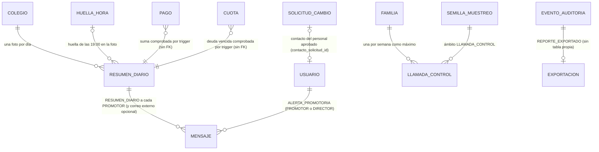

# Sprint 6 · Panel de la promotora: diseño de arquitectura

> Diseño del agente `arquitecto-software`, 8 de octubre de 2026. Rama `claude/sprint-6-panel-promotora`, que parte de `main` con los sprints 0 a 5 (1696 pruebas en H2 según `sprint-5-correcciones.md`, 58 triggers en MySQL, última migración V20). **No modifiqué código ni scripts del repositorio**: solo produje este documento.
> Paquete base `pe.edu.virgenmaria.cuentasclaras`. El stack no cambia y **no hay dependencias nuevas**: el Excel se escribe con `poi-ooxml`, que ya está en el `pom.xml` (lo usan `PlantillaXlsx` y `LectorXlsxSeguro`).
>
> **Cómo se verificó (y qué NO se verificó)**
> - **Leído:** `CLAUDE.md`, la skill `contexto-colegio`, `plan-de-desarrollo.md` (sprint 6), `estado-del-proyecto.md`, `sprint-5-familias.md`, `sprint-5-correcciones.md`, las migraciones V2, V5, V7, V9, V17 y V20, `scripts/mysql/02-permisos-tablas.sql` y `03-triggers.sql` (lista de triggers y `trg_mensaje_nace`), y las clases citadas en «Archivos leídos».
> - **NO probado:** sesión de solo lectura. V21, V22, los GRANT y los 3 triggers nuevos **no se ejecutaron** en H2 ni en MySQL 8. El primer paso de cada tanda es aplicarlos sobre V1–V20 reales en ambas bases (hallazgo 1 del sprint 3 y hallazgo 3 del sprint 4).
> - **Nombres de columnas a confirmar al implementar:** `cuota.monto_descuento` (lo menciona el comentario de V10, no vi su `ALTER`), `usuario.apoderado_id` (lo menciona `02-permisos-tablas.sql`) y cómo los triggers existentes calculan «hoy en Lima» (copiar el patrón de `trg_feriado_registro`).
> - **Proveedores:** que Meta acepte una plantilla «utility» con 11 parámetros para el resumen diario dirigida al personal **no se consultó**; si la rechaza, el resumen se parte en dos plantillas (sección 12.2).

## 1. Resumen
- **La promotora ve el colegio en su celular sin pedir nada a nadie.** El panel `/panel` muestra lo cobrado hoy y en el mes, la deuda vencida, las familias morosas, el % de pagos digitales, las rebajas del mes (descuentos y anulaciones), lo que espera su aprobación y las alertas. **Ninguna cifra se guarda ni se escribe a mano:** todas se calculan al consultar desde los libros (`pago`, `cuota`, `anulacion_pago`, `descuento`, `solicitud_cambio`).
- **Resumen diario a las 19:30** (después de la hora límite de cierre, decisión 17) por WhatsApp, con correo de respaldo, con la mensajería del sprint 5. Antes de enviarlo, `sistema.panel` guarda una **foto** de las cifras en `resumen_diario` (solo inserción) y **la base comprueba que cada cifra es la suma de los libros** en ese momento (trigger). La foto lleva también la huella de la bitácora de las 19:00, que hoy no sale del sistema (residual de S5-M4).
- **Las cifras de un día ya enviado no cambian en silencio.** Cada día se recalculan los últimos 35 días contra sus fotos; la diferencia que no explican las anulaciones aprobadas ni los pagos en línea tardíos es una alerta CRÍTICA.
- **Alertas al celular sin duplicar lógica.** Un proceso cada 15 minutos toma las alertas que ya existen (`AlertasRevision`) y difunde las CRÍTICAS más dos de ATENCIÓN (cierre no hecho a la hora límite y anulación de pago por aprobar). Cada alerta lleva una **clave estable** y el mensaje usa esa clave como idempotencia (`uk_mensaje_clave`): se avisa una sola vez. El texto que sale por WhatsApp es **fijo por tipo**, nunca el texto de la alerta (que contiene explicaciones escritas por la cajera).
- **Aprobaciones desde el celular con la misma segregación:** es la misma `BandejaAprobaciones` con una vista para celular y un detalle por solicitud. Nada se aprueba desde un enlace del mensaje: el enlace solo abre la pantalla, con sesión.
- **Reportes:** morosidad por grado (agregada, nunca por sección ni con nombres de alumnos) e ingresos por medio de pago, con exportación a Excel para el contador **sin fórmulas posibles**, con datos mínimos (Ley 29733) y **registrada en la bitácora en la misma transacción**, con un código de exportación impreso en el archivo.
- **Residuales del sprint 5 que se cierran aquí:**
  - la huella de la tarde no salía del sistema: va en el resumen de las 19:30;
  - «una familia con un solo apoderado y sin portal no tiene quién avise»: llamada de control semanal con muestra secreta;
  - el contacto del personal, por donde llegan la huella, el resumen y las alertas, hoy lo puede cambiar `cc_app` sin rastro: nuevo trigger y cambio con aprobación.

## 2. Hallazgos al leer el código (leer antes de implementar)
1. **Las alertas solo existen al consultar y solo para Promotoría.** `AlertasRevision` (Javadoc: «no hay tareas programadas: todo se calcula al consultar») y sus 16 implementaciones llevan `@PreAuthorize("hasRole('PROMOTOR')")`. Un proceso como actor de sistema no puede leerlas.
   - Se agrega el actor `sistema.panel` (`ROLE_SISTEMA_PANEL`) y cada implementación pasa a `hasAnyRole('PROMOTOR','SISTEMA_PANEL')`.
   - Prueba nueva: `ReglasArquitecturaTest.todasLasAlertasAdmitenAlPanel` (recorre los beans de `AlertasRevision`).
   - Si alguna implementación usa el usuario en sesión, se marca `difundible() = false` (método por defecto `true` en la interfaz) y queda fuera del aviso al celular.
2. **Los textos de las alertas llevan texto libre escrito por el personal.** `AlertasCaja.cierresPorRevisar` cita la explicación de la cajera y las devoluciones citan nombres de familias. **Nunca** se envían por WhatsApp: el mensaje usa un texto fijo por tipo de aviso (sección 12.2), sin nombres ni explicaciones.
3. **`AlertaRevision` no tiene identidad.** Para avisar una sola vez se agrega un quinto componente opcional `Aviso aviso` (`TipoAviso tipo` + `String referencia`), con un constructor de 4 argumentos que lo deja en `null`: las ~80 llamadas existentes no cambian.
4. **`IndicadoresCaja` carga los pagos del día como entidades** (`findByFechaOrderByIdAsc`). Sirve para un día, no para un mes. Las cifras nuevas usan JPQL agregado (`SUM`, `COUNT`, `GROUP BY`), sin SQL nativo. Los índices ya existen: `ix_pago_fecha (colegio_id, fecha)` y `ix_cuota_estado_vencimiento (colegio_id, estado, fecha_vencimiento)`. **La tanda 1 no necesita migración.**
5. **El contacto del personal no tiene control en la base.** `Usuario.asignarTelefonoWhatsapp` solo se llama al crear la cuenta (`ServicioUsuarios.crear`), pero `cc_app` tiene `UPDATE` por tabla sobre `usuario` y no hay ningún trigger sobre `usuario`.
   - Con las credenciales de la aplicación, alguien puede poner su celular en la cuenta de la promotora y recibir la huella, el resumen y las alertas.
   - Tampoco existe una forma legítima de cambiarlo.
   - V21 agrega `usuario.contacto_solicitud_id` y `trg_usuario_contacto` (patrón de `trg_apoderado_facturacion`), solo para el personal (`apoderado_id IS NULL`), y el tipo de solicitud `CAMBIO_CONTACTO_PERSONAL`.
6. **Una sola sesión por persona** (`maximumSessions(1)`, decisión 3): si la promotora entra desde el celular, se cierra su sesión en la PC. Es aceptable (decisión 72), pero hay que decirlo en la capacitación.
7. **`EstadoCuota` no guarda VENCIDA** (se calcula con la fecha de Lima). La deuda vencida es `monto - monto_pagado - monto_descuento` de las cuotas PENDIENTE o PARCIAL con `fecha_vencimiento` anterior al día. La misma definición la usan la aplicación (`CifrasCobranza`) y el trigger de la foto; una prueba compara ambas.
8. **Una cuota no tiene grado.** El grado sale de la matrícula del alumno en el año de la cuota (`matricula` por `alumno_id` y `anio_escolar_id` → `seccion.grado`). Las cuotas del saldo inicial o de alumnos sin matrícula en ese año van a la fila «Sin matrícula en ese año».
9. **`ck_mensaje_destinatario` solo admite EXTERNO para `HUELLA_BITACORA`.** Para el correo externo del contador en el resumen se recrea en V21 (mismo patrón `DROP CONSTRAINT` / `ADD CONSTRAINT` que V20 usó con `ck_mensaje_tipo`).
10. **No hay tipo de solicitud ni CHECK de tipos en `solicitud_cambio`** (es `VARCHAR(40)`, «nunca renombres un valor ya usado»): `CAMBIO_CONTACTO_PERSONAL` no necesita migración de CHECK. Confirmarlo al implementar.

## 3. Decisiones
1. **Módulo nuevo `panel`** (ArchUnit, sin ciclos):
   - depende de `caja`, `cobranza`, `alumnos`, `aprobaciones`, `comunicacion` (solo lectura: `ConsultaMensajes`), `auditoria` y `comun`;
   - **nadie depende de `panel`**. Los eventos que escucha `comunicacion` (`ResumenDiarioListo`, `AvisoPromotoriaNuevo`) viven en `comun.alertas`, como `HuellaDelDia` vive en `auditoria`;
   - `cobranza` sigue sin depender de lo académico: el grado se lee de `alumnos` (matrícula y sección), que `cobranza` ya usa.
2. **Puertos de cifras en el módulo dueño del dato** (solo lectura, `@Transactional(readOnly = true)`):
   - `caja.service.CifrasCaja`: cobrado por medio y por origen en un rango; anulaciones aprobadas en un rango; pagos de un día creados o anulados después de un momento;
   - `cobranza.service.CifrasCobranza`: deuda vencida a un día; familias morosas por tramo; morosidad por grado; descuentos aprobados y cuotas anuladas en un rango; lo que vence en el mes y cuánto se pagó de eso;
   - `panel` solo combina; no usa repositorios de otros módulos.
3. **Ninguna cifra se escribe a mano:**
   - no hay tabla de indicadores ni campos editables;
   - la única cifra guardada es la **foto** del resumen (`resumen_diario`): la escribe solo `sistema.panel`, es de solo inserción (1142) y el trigger la compara con la suma de los libros;
   - el panel nunca muestra la foto como cifra del día: la usa solo para comparar.
4. **Definiciones** (decisiones 65 a 67):
   - **Cobrado en un periodo:** pagos VIGENTES con `fecha` (día de caja, Lima) en el periodo. Las anulaciones aprobadas en el periodo se muestran **aparte** («Anulado en el mes: S/ X, n pagos»), para que nada desaparezca sin verse.
   - **% de pagos digitales:** por **número** de pagos (es la métrica de adopción del plan: 60 % al tercer mes), con el % por monto debajo. Digital = todo medio distinto de EFECTIVO.
   - **Familia morosa:** al menos una cuota con saldo vencido. Tramos por la cuota vencida más antigua: 1–30, 31–60, 61–90 y más de 90 días.
   - Porcentajes con `BigDecimal.divide(…, 0, RoundingMode.HALF_UP)`, como `IndicadoresCaja`.
5. **Resumen diario** (decisiones 68 y 69):
   - a las 19:30 (Lima), de lunes a sábado; domingos y feriados, solo si hubo cobros (pasarela o banco);
   - `sistema.panel` calcula, guarda la foto y publica `ResumenDiarioListo`; un oyente **síncrono** de `comunicacion` crea un `RESUMEN_DIARIO` por cada PROMOTOR activo (WhatsApp, con respaldo por correo si falla) y, si el DBA dejó `configuracion_bd('resumen_correo_externo')`, otro a ese correo;
   - todo en una transacción: sin mensaje no hay foto, y al revés;
   - idempotente: `uk_resumen_diario (colegio_id, fecha)` y la clave `RESUMEN:{fecha}:U{id}:{canal}`.
6. **Alertas al celular** (decisiones 70 y 71):
   - proceso `panel.proceso.AvisosPromotoria`, cada 15 min de 07:00 a 21:00, como `sistema.panel`;
   - difunde las alertas con `aviso != null` que sean CRÍTICAS, más las ATENCIÓN de tipo `CIERRE_NO_REALIZADO` y `ANULACION_PAGO_PENDIENTE`;
   - un mensaje `ALERTA_PROMOTORIA` por destinatario y clave (`ALERTA:{tipo}:{referencia}:U{usuarioId}:{canal}`, 120 caracteres como máximo): `uk_mensaje_clave` impide el duplicado aunque el proceso corra dos veces;
   - destinatarios: los PROMOTOR activos; las `ANULACION_PAGO_PENDIENTE`, también los DIRECTOR activos (aprueban), **nunca** quien pidió la anulación ni la cajera del pago (`ControlParticipantes`);
   - **tope de 10 avisos por persona y día**; a partir del undécimo sale uno solo: «y N alertas más: revisa el panel». Lo de la noche sale a las 07:00.
7. **Aprobaciones desde el celular** (decisión 72):
   - la misma `BandejaAprobaciones`: «quien pide o participó no aprueba», `AUTOAPROBACION_RECHAZADA` y las llamadas obligatorias de A2 no cambian;
   - vista nueva `aprobaciones/movil` y detalle `GET /aprobaciones/{id}`; los POST existentes no cambian (CSRF, solo POST);
   - **ningún mensaje lleva un enlace que apruebe:** solo `/aprobaciones/{id}`, que pide sesión. No hay tokens de aprobación.
8. **Reportes** (decisiones 73 a 76):
   - morosidad por grado e ingresos por medio de pago, en pantalla para Promotoría, Dirección y Administración;
   - exportación a Excel solo para Promotoría y Administración (el contador);
   - la lista de familias morosas se ve en pantalla (Promotoría, Dirección y Administración) y **no se exporta**;
   - rango máximo de 12 meses y 20 exportaciones por persona y día.
9. **Excel seguro** (sección 10): un solo escritor, `comun.excel.EscritorXlsxSeguro`; nunca fórmulas; el texto que empiece con `=`, `+`, `-`, `@`, tabulación o retorno lleva el prefijo de comilla (`CellStyle.setQuotePrefixed(true)`) y además pierde los caracteres de control; los montos van como número con formato `#,##0.00`, convertidos en un solo punto (`CeldaDinero`).
10. **Cada exportación queda en la bitácora antes de entregar el archivo:** `REPORTE_EXPORTADO` (resaltado) con tipo, rango, filas, SHA-256 del archivo, código de exportación (UUID) e IP, en la misma transacción. Si la bitácora falla, no hay archivo. El código va impreso en la hoja «Control»: un archivo filtrado se rastrea hasta quien lo bajó.
11. **Cambio del contacto del personal** (decisión 78): `TipoSolicitud.CAMBIO_CONTACTO_PERSONAL`. Lo pide el titular o Promotoría; lo aprueba otra persona de Promotoría o Dirección; se avisa al contacto anterior (`CONTACTO_CAMBIADO`, ya existe) y queda resaltado. No se reutiliza `verificacion_contacto` (es del apoderado): la aprobación de otra persona y el aviso al contacto anterior bastan para el MVP.
12. **Llamada de control semanal** (decisión 77; cierra el residual «familia de un solo apoderado y sin portal»):
    - cada lunes, con la semilla secreta de `semilla_muestreo` (ámbito `LLAMADA_CONTROL`), el sistema elige 3 familias que pagaron en efectivo en los últimos 35 días, con prioridad para las que no tienen el portal activado o tienen un solo apoderado;
    - la promotora llama, **pregunta primero cuánto y cuándo pagaron** y después compara con lo registrado;
    - registra el resultado; «No confirma» es CRÍTICA.
13. **Orden de bloqueos** (extiende el del sprint 5): … → serie → mensaje → **resumen_diario** → bitácora.
14. **Sin SQL nativo, sin `delete*` y sin `@Modifying`** en los repositorios nuevos.

## 4. Modelo

**No hay tabla de exportaciones:** la bitácora es el registro (sección 13). **No hay tabla de alertas:** el mensaje `ALERTA_PROMOTORIA` con su clave es el registro de que se avisó.

**Invariantes.** «(base)» = CHECK, UNIQUE o FK; «(MySQL)» = trigger; «(1142)» = sin GRANT de UPDATE ni DELETE.

- **Resumen diario (`resumen_diario`):**
  - uno por colegio y fecha (base);
  - solo inserción (1142); lo escribe solo `sistema.panel` (base y MySQL);
  - `cortado_en` cae entre el inicio de `fecha` y las 06:00 del día siguiente (MySQL);
  - `cobrado_total`, `pagos_cantidad`, `cobrado_efectivo`, `pagos_efectivo`, `cobrado_mes`, `deuda_vencida` y `familias_morosas` son **exactamente** lo que dicen `pago` y `cuota` en ese momento (MySQL);
  - `cobrado_efectivo <= cobrado_total`, `pagos_efectivo <= pagos_cantidad`, `cobrado_total <= cobrado_mes`, nada negativo (base);
  - si lleva huella, su secuencia y código son de una `huella_hora` de **ese** colegio (MySQL).
- **Mensaje (cambios):**
  - tipos nuevos `RESUMEN_DIARIO` y `ALERTA_PROMOTORIA` (base), creados solo por `sistema.panel` (MySQL);
  - `RESUMEN_DIARIO` va a un usuario PROMOTOR activo o al correo externo del DBA, y apunta a un `resumen_diario` de ese colegio (MySQL);
  - `ALERTA_PROMOTORIA` va a un usuario PROMOTOR o DIRECTOR activo (MySQL);
  - EXTERNO admite `HUELLA_BITACORA` y `RESUMEN_DIARIO`, cada uno con su fila de `configuracion_bd` (base y MySQL).
- **Usuario (personal):** celular y correo cambian solo con SU `CAMBIO_CONTACTO_PERSONAL` APROBADA, y cada solicitud se usa una vez (base y MySQL). Las cuentas de apoderado (`apoderado_id IS NOT NULL`) no cambian de regla.
- **Llamada de control (`llamada_control`):**
  - una por colegio, semana y familia (base); solo inserción (1142);
  - la registra una persona PROMOTOR o DIRECTOR activa (MySQL);
  - `semana` es un lunes no futuro y la familia pagó en efectivo en los 35 días anteriores (MySQL);
  - «No confirma» exige nota (base).

## 5. Máquinas de estado
No hay estados nuevos: la foto y la llamada son de solo inserción. El mensaje sigue la máquina del sprint 5 (`PENDIENTE → ENVIADO → ENTREGADO → LEIDO`, o `FALLIDO` con respaldo por correo).

**Ciclo del resumen diario** (no es un estado guardado; lo deduce `AlertasPanel`):
```
19:30 sistema.panel ──(foto + mensajes en una transacción)──▶ GUARDADO ──(despacho)──▶ ENVIADO
   └──(falla o no corre)──▶ a las 21:00: «El resumen de hoy no salió» (CRÍTICA, en el panel)
GUARDADO ──(recálculo diario 06:15, 35 días)──▶ igual | cambió con explicación (INFORMATIVA) | cambió sin explicación (CRÍTICA)
```
**Aviso de alerta:** una vez por clave y destinatario. Si la alerta desaparece (se aprobó el cierre) y vuelve con otra referencia, es otro aviso.

**Solicitud `CAMBIO_CONTACTO_PERSONAL`:** la máquina de `solicitud_cambio` existente (PENDIENTE → APROBADA | RECHAZADA).

## 6. Migraciones Flyway (NO probadas: aplicar sobre V1–V20 en H2 2.4.240 MODE=MySQL y MySQL 8 antes de seguir)

**Tanda 1: sin migración.** Panel, reportes y Excel son de solo lectura; los índices `ix_pago_fecha` e `ix_cuota_estado_vencimiento` (V9 y V7) cubren las consultas. Si el `EXPLAIN` de MySQL muestra un recorrido completo en la morosidad por grado, el índice va en V21.

### `V21__resumen_diario_y_contacto_del_personal.sql` (tanda 2)
```sql
-- Sprint 6 · tanda 2. Foto del resumen diario (solo inserción; la escribe sistema.panel y el trigger la compara con los
-- libros), mensajes nuevos para Promotoría y contacto del personal con solicitud aprobada.
CREATE TABLE resumen_diario (
    id                      BIGINT         NOT NULL AUTO_INCREMENT PRIMARY KEY,
    colegio_id              BIGINT         NOT NULL,
    fecha                   DATE           NOT NULL,
    cortado_en              DATETIME(6)    NOT NULL,
    cobrado_total           DECIMAL(12,2)  NOT NULL,
    pagos_cantidad          INT            NOT NULL,
    cobrado_efectivo        DECIMAL(12,2)  NOT NULL,
    pagos_efectivo          INT            NOT NULL,
    cobrado_mes             DECIMAL(12,2)  NOT NULL,
    deuda_vencida           DECIMAL(12,2)  NOT NULL,
    familias_morosas        INT            NOT NULL,
    cajas_sin_cerrar        INT            NOT NULL,
    cierres_con_diferencia  INT            NOT NULL,
    solicitudes_pendientes  INT            NOT NULL,
    alertas_criticas        INT            NOT NULL,
    avisos_familias         INT            NOT NULL,   -- avisos financieros creados hoy
    avisos_entregados       INT            NOT NULL,   -- de esos, ENVIADO, ENTREGADO o LEIDO al corte
    huella_secuencia        BIGINT,
    huella_codigo           VARCHAR(16),
    creado_en               DATETIME(6)    NOT NULL,
    creado_por              VARCHAR(60)    NOT NULL,
    actualizado_en          DATETIME(6)    NOT NULL,
    version                 BIGINT         NOT NULL DEFAULT 0,
    CONSTRAINT uk_resumen_diario UNIQUE (colegio_id, fecha),
    CONSTRAINT uk_resumen_diario_id_colegio UNIQUE (id, colegio_id),
    CONSTRAINT fk_resumen_diario_colegio FOREIGN KEY (colegio_id) REFERENCES colegio (id),
    CONSTRAINT ck_resumen_diario_actor CHECK (creado_por = 'sistema.panel'),
    CONSTRAINT ck_resumen_diario_cifras CHECK (cobrado_total >= 0 AND cobrado_efectivo >= 0
        AND cobrado_efectivo <= cobrado_total AND cobrado_total <= cobrado_mes AND deuda_vencida >= 0
        AND pagos_cantidad >= 0 AND pagos_efectivo >= 0 AND pagos_efectivo <= pagos_cantidad
        AND familias_morosas >= 0 AND cajas_sin_cerrar >= 0 AND cierres_con_diferencia >= 0
        AND solicitudes_pendientes >= 0 AND alertas_criticas >= 0
        AND avisos_familias >= 0 AND avisos_entregados >= 0 AND avisos_entregados <= avisos_familias),
    CONSTRAINT ck_resumen_diario_huella CHECK ((huella_secuencia IS NULL AND huella_codigo IS NULL)
        OR (huella_secuencia >= 1 AND REGEXP_LIKE(huella_codigo, '^[0-9a-f]{16}$', 'c')))
);

-- Mensajes nuevos: el resumen diario y las alertas a Promotoría (y a Dirección, las anulaciones por aprobar).
ALTER TABLE mensaje DROP CONSTRAINT ck_mensaje_tipo;
ALTER TABLE mensaje ADD CONSTRAINT ck_mensaje_tipo CHECK (tipo IN ('PAGO_REGISTRADO', 'PAGO_ANULADO',
    'DESCUENTO_APROBADO', 'CONTACTO_CAMBIADO', 'ACTIVACION_CUENTA', 'HUELLA_BITACORA', 'RECORDATORIO_VENCIMIENTO',
    'CUOTA_VENCIDA', 'RENOVACION_MATRICULA', 'RENOVACION_REGISTRADA', 'AVISO_ATENDIDO', 'VERIFICACION_CONTACTO',
    'APODERADO_AGREGADO', 'CONTACTO_POR_VERIFICAR', 'FERIADO_PROPUESTO', 'RESUMEN_DIARIO', 'ALERTA_PROMOTORIA'));
-- El correo externo (lo escribe solo el DBA en configuracion_bd) recibe la huella y, desde ahora, el resumen.
ALTER TABLE mensaje DROP CONSTRAINT ck_mensaje_destinatario;
ALTER TABLE mensaje ADD CONSTRAINT ck_mensaje_destinatario CHECK (
    (destinatario_tipo = 'APODERADO' AND apoderado_id IS NOT NULL AND familia_id IS NOT NULL AND usuario_id IS NULL)
    OR (destinatario_tipo = 'USUARIO' AND usuario_id IS NOT NULL AND apoderado_id IS NULL AND familia_id IS NULL)
    OR (destinatario_tipo = 'EXTERNO' AND usuario_id IS NULL AND apoderado_id IS NULL AND familia_id IS NULL
        AND tipo IN ('HUELLA_BITACORA', 'RESUMEN_DIARIO') AND canal = 'CORREO'));

-- Hallazgo 5: el celular o el correo del personal cambian solo con SU solicitud aprobada, una vez.
ALTER TABLE usuario ADD COLUMN contacto_solicitud_id BIGINT;
ALTER TABLE usuario ADD CONSTRAINT uk_usuario_contacto_solicitud UNIQUE (colegio_id, contacto_solicitud_id);
ALTER TABLE usuario ADD CONSTRAINT fk_usuario_contacto_solicitud FOREIGN KEY (contacto_solicitud_id, colegio_id)
    REFERENCES solicitud_cambio (id, colegio_id);
```
> - `uk_solicitud_cambio_id_colegio` existe desde V8. Comprobar que `usuario.colegio_id` es `NOT NULL`; si no, la UNIQUE admite varios NULL y el trigger es la única barrera.
> - La entidad `ResumenDiario` tiene todas sus columnas `updatable = false` (como `HuellaGuardada`). `Usuario.contactoSolicitudId` es `updatable = true` y solo lo cambia `ManejadorContactoPersonal`.
> - Dinero en `DECIMAL(12,2)`: un mes de 300 familias no pasa de S/ 1,000,000, pero `pago.total` llega a 99,999.99 y la suma del mes no debe desbordar.

### `V22__llamada_de_control.sql` (tanda 3)
```sql
-- Sprint 6 · tanda 3. Llamada de control semanal (cierra el residual «familia con un solo apoderado y sin portal»).
-- Solo inserción. La muestra la elige el sistema con la semilla secreta (ámbito LLAMADA_CONTROL); aquí queda el resultado.
CREATE TABLE llamada_control (
    id              BIGINT         NOT NULL AUTO_INCREMENT PRIMARY KEY,
    colegio_id      BIGINT         NOT NULL,
    semana          DATE           NOT NULL,   -- lunes de la semana
    familia_id      BIGINT         NOT NULL,
    resultado       VARCHAR(20)    NOT NULL,
    nota            VARCHAR(300),
    creado_en       DATETIME(6)    NOT NULL,
    creado_por      VARCHAR(60)    NOT NULL,
    actualizado_en  DATETIME(6)    NOT NULL,
    version         BIGINT         NOT NULL DEFAULT 0,
    CONSTRAINT uk_llamada_control UNIQUE (colegio_id, semana, familia_id),
    CONSTRAINT fk_llamada_control_colegio FOREIGN KEY (colegio_id) REFERENCES colegio (id),
    CONSTRAINT fk_llamada_control_familia FOREIGN KEY (familia_id, colegio_id) REFERENCES familia (id, colegio_id),
    CONSTRAINT ck_llamada_control_resultado CHECK (resultado IN ('CONFIRMA', 'NO_CONFIRMA', 'NO_CONTESTA')),
    CONSTRAINT ck_llamada_control_nota CHECK (resultado <> 'NO_CONFIRMA' OR nota IS NOT NULL)
);
CREATE INDEX ix_llamada_control_semana ON llamada_control (colegio_id, semana);
```
> - Confirmar que `semilla_muestreo` (V19) no tiene un CHECK de ámbitos. Si lo tiene, se recrea en V22 agregando `LLAMADA_CONTROL`.
> - `familia` tiene `UNIQUE (id, colegio_id)` (la usan `fk_pago_familia` y `fk_mensaje_familia`).

## 7. Permisos de MySQL

### 7.1 Agregar a `scripts/mysql/02-permisos-tablas.sql`
```sql
-- Sprint 6 · tanda 1: sin cambios (panel, reportes y Excel solo leen con el SELECT general).
-- Sprint 6 · tanda 2 (V21): foto del resumen diario, SOLO inserción (1142). usuario mantiene su UPDATE por tabla:
-- el contacto del personal lo vigila trg_usuario_contacto (mismo criterio que apoderado y trg_apoderado_facturacion).
GRANT INSERT ON cuentasclaras.resumen_diario TO 'cc_app'@'%';
-- Sprint 6 · tanda 3 (V22): llamada de control, SOLO inserción (1142).
GRANT INSERT ON cuentasclaras.llamada_control TO 'cc_app'@'%';
-- configuracion_bd sigue SIN GRANT. Fila nueva que solo escribe el DBA (opcional, en prod; decisión 69):
--   ('resumen_correo_externo', '<correo del contador>')
```
- `ResumenDiario` y `LlamadaControl` tienen todas sus columnas `updatable = false`. Lo comprueba `InmutabilidadPanelTest` (mismo método que `InmutabilidadCajaTest`): una entidad de solo inserción no puede tener columnas actualizables, porque un `save` de una entidad cargada intentaría un UPDATE que MySQL rechaza con 1142.
- `mensaje` no cambia su GRANT: los tipos nuevos usan las mismas columnas.

### 7.2 Agregar a `scripts/mysql/03-triggers.sql` (versión final del sprint: 61 triggers)
Cambia 1 trigger existente (`trg_mensaje_nace`, mismo nombre) y se agregan 3.

```sql
-- ===================== Sprint 6 · tanda 2 (V21): resumen diario y contacto del personal =====================
DELIMITER $$

-- La foto del resumen la escribe sistema.panel y cada cifra es la suma de los libros en ese momento (misma
-- transacción: la lectura consistente ve lo mismo que leyó la aplicación). Definiciones en la sección 3.4.
DROP TRIGGER IF EXISTS trg_resumen_diario_registro$$
CREATE TRIGGER trg_resumen_diario_registro BEFORE INSERT ON resumen_diario FOR EACH ROW
BEGIN
    DECLARE v_total DECIMAL(12,2);
    DECLARE v_cantidad INT;
    DECLARE v_efectivo DECIMAL(12,2);
    DECLARE v_pagos_efectivo INT;
    DECLARE v_mes DECIMAL(12,2);
    DECLARE v_deuda DECIMAL(12,2);
    DECLARE v_familias INT;
    IF NOT (NEW.creado_por <=> 'sistema.panel') THEN
        SIGNAL SQLSTATE '45000' SET MESSAGE_TEXT = 'cuentasclaras: el resumen diario lo genera sistema.panel';
    END IF;
    IF NEW.cortado_en < TIMESTAMP(NEW.fecha) OR NEW.cortado_en > TIMESTAMP(NEW.fecha + INTERVAL 1 DAY, '06:00:00') THEN
        SIGNAL SQLSTATE '45000' SET MESSAGE_TEXT = 'cuentasclaras: el corte del resumen es de su día';
    END IF;
    SELECT COALESCE(SUM(p.total), 0), COUNT(*),
           COALESCE(SUM(CASE WHEN p.medio = 'EFECTIVO' THEN p.total ELSE 0 END), 0),
           COALESCE(SUM(CASE WHEN p.medio = 'EFECTIVO' THEN 1 ELSE 0 END), 0)
      INTO v_total, v_cantidad, v_efectivo, v_pagos_efectivo
      FROM pago p WHERE p.colegio_id = NEW.colegio_id AND p.fecha = NEW.fecha AND p.estado = 'VIGENTE';
    SELECT COALESCE(SUM(p.total), 0) INTO v_mes
      FROM pago p WHERE p.colegio_id = NEW.colegio_id AND p.estado = 'VIGENTE'
       AND p.fecha BETWEEN NEW.fecha - INTERVAL (DAYOFMONTH(NEW.fecha) - 1) DAY AND NEW.fecha;
    SELECT COALESCE(SUM(c.monto - c.monto_pagado - c.monto_descuento), 0), COUNT(DISTINCT a.familia_id)
      INTO v_deuda, v_familias
      FROM cuota c JOIN alumno a ON a.id = c.alumno_id
     WHERE c.colegio_id = NEW.colegio_id AND c.estado IN ('PENDIENTE', 'PARCIAL') AND c.fecha_vencimiento < NEW.fecha;
    IF NOT (NEW.cobrado_total = v_total AND NEW.pagos_cantidad = v_cantidad AND NEW.cobrado_efectivo = v_efectivo
            AND NEW.pagos_efectivo = v_pagos_efectivo AND NEW.cobrado_mes = v_mes AND NEW.deuda_vencida = v_deuda
            AND NEW.familias_morosas = v_familias) THEN
        SIGNAL SQLSTATE '45000' SET MESSAGE_TEXT = 'cuentasclaras: las cifras del resumen no son las de los libros';
    END IF;
    IF NEW.huella_secuencia IS NOT NULL AND NOT EXISTS (SELECT 1 FROM huella_hora h
            WHERE h.colegio_id = NEW.colegio_id AND h.secuencia = NEW.huella_secuencia AND h.codigo = NEW.huella_codigo) THEN
        SIGNAL SQLSTATE '45000' SET MESSAGE_TEXT = 'cuentasclaras: la huella del resumen no es una huella guardada';
    END IF;
END$$

-- Hallazgo 5. El celular y el correo del PERSONAL (apoderado_id IS NULL) cambian solo con SU CAMBIO_CONTACTO_PERSONAL
-- aprobada; uk_usuario_contacto_solicitud impide reusarla. Las cuentas de apoderado no cambian de regla.
DROP TRIGGER IF EXISTS trg_usuario_contacto$$
CREATE TRIGGER trg_usuario_contacto BEFORE UPDATE ON usuario FOR EACH ROW
BEGIN
    IF OLD.apoderado_id IS NULL
            AND (NOT (NEW.telefono_whatsapp <=> OLD.telefono_whatsapp) OR NOT (NEW.correo <=> OLD.correo)
                OR NOT (NEW.contacto_solicitud_id <=> OLD.contacto_solicitud_id))
            AND ((NEW.contacto_solicitud_id <=> OLD.contacto_solicitud_id)
                OR NOT EXISTS (SELECT 1 FROM solicitud_cambio s WHERE s.id = NEW.contacto_solicitud_id
                    AND s.tipo = 'CAMBIO_CONTACTO_PERSONAL' AND s.entidad = 'usuario' AND s.entidad_id = NEW.id
                    AND s.estado = 'APROBADA')) THEN
        SIGNAL SQLSTATE '45000' SET MESSAGE_TEXT = 'cuentasclaras: el contacto del personal solo cambia con su solicitud aprobada';
    END IF;
END$$
```
**Cambio en `trg_mensaje_nace`** (se conserva el nombre; el conteo no cambia). Se agregan estos bloques antes del de `EXTERNO`, y el de `EXTERNO` se reemplaza:
```sql
    -- Sprint 6: el resumen y las alertas a Promotoría los crea solo sistema.panel.
    IF NEW.tipo IN ('RESUMEN_DIARIO', 'ALERTA_PROMOTORIA') AND NOT (NEW.creado_por <=> 'sistema.panel') THEN
        SIGNAL SQLSTATE '45000' SET MESSAGE_TEXT = 'cuentasclaras: el resumen y las alertas los envía sistema.panel';
    END IF;
    -- El resumen va a una persona PROMOTOR activa (o al correo externo del DBA) y es de una foto de ESTE colegio.
    IF NEW.tipo = 'RESUMEN_DIARIO' AND (NOT (NEW.entidad <=> 'resumen_diario') OR NOT EXISTS (SELECT 1
            FROM resumen_diario r WHERE r.id = NEW.entidad_id AND r.colegio_id = NEW.colegio_id)) THEN
        SIGNAL SQLSTATE '45000' SET MESSAGE_TEXT = 'cuentasclaras: el resumen apunta a su foto';
    END IF;
    IF NEW.tipo = 'RESUMEN_DIARIO' AND NEW.destinatario_tipo = 'USUARIO' AND NOT EXISTS (SELECT 1
            FROM usuario u JOIN usuario_rol r ON r.usuario_id = u.id
            WHERE u.id = NEW.usuario_id AND u.activo AND r.rol = 'PROMOTOR') THEN
        SIGNAL SQLSTATE '45000' SET MESSAGE_TEXT = 'cuentasclaras: el resumen diario es solo para Promotoría';
    END IF;
    IF NEW.tipo = 'ALERTA_PROMOTORIA' AND NOT EXISTS (SELECT 1
            FROM usuario u JOIN usuario_rol r ON r.usuario_id = u.id
            WHERE u.id = NEW.usuario_id AND u.activo AND r.rol IN ('PROMOTOR', 'DIRECTOR')) THEN
        SIGNAL SQLSTATE '45000' SET MESSAGE_TEXT = 'cuentasclaras: las alertas son solo para Promotoría y Dirección';
    END IF;
    -- (Reemplaza el bloque EXTERNO.) Cada tipo con SU fila del DBA.
    IF NEW.destinatario_tipo = 'EXTERNO' AND NOT EXISTS (SELECT 1 FROM configuracion_bd c
            WHERE c.clave = CASE NEW.tipo WHEN 'RESUMEN_DIARIO' THEN 'resumen_correo_externo'
                                          ELSE 'huella_correo_externo' END
              AND c.valor = NEW.destino) THEN
        SIGNAL SQLSTATE '45000' SET MESSAGE_TEXT = 'cuentasclaras: el correo externo lo configura el DBA';
    END IF;
```
```sql
-- ===================== Sprint 6 · tanda 3 (V22): llamada de control =====================
-- La registra una persona de Promotoría o Dirección, para un lunes no futuro, sobre una familia que pagó en efectivo en
-- los 35 días anteriores. (La muestra la elige la aplicación con la semilla secreta; la base no la recalcula.)
DROP TRIGGER IF EXISTS trg_llamada_control_registro$$
CREATE TRIGGER trg_llamada_control_registro BEFORE INSERT ON llamada_control FOR EACH ROW
BEGIN
    IF NOT EXISTS (SELECT 1 FROM usuario u JOIN usuario_rol r ON r.usuario_id = u.id
            WHERE u.nombre_usuario = NEW.creado_por AND u.colegio_id = NEW.colegio_id AND u.activo
              AND r.rol IN ('PROMOTOR', 'DIRECTOR')) THEN
        SIGNAL SQLSTATE '45000' SET MESSAGE_TEXT = 'cuentasclaras: la llamada de control la hace Promotoría o Dirección';
    END IF;
    IF WEEKDAY(NEW.semana) <> 0 OR NEW.semana > DATE(NEW.creado_en) THEN
        SIGNAL SQLSTATE '45000' SET MESSAGE_TEXT = 'cuentasclaras: la semana de la llamada es un lunes no futuro';
    END IF;
    IF NOT EXISTS (SELECT 1 FROM pago p WHERE p.colegio_id = NEW.colegio_id AND p.familia_id = NEW.familia_id
            AND p.medio = 'EFECTIVO' AND p.fecha BETWEEN NEW.semana - INTERVAL 35 DAY AND NEW.semana) THEN
        SIGNAL SQLSTATE '45000' SET MESSAGE_TEXT = 'cuentasclaras: la llamada es a una familia que pagó en efectivo';
    END IF;
END$$

DELIMITER ;
```
> - `u.activo` es `BOOLEAN NOT NULL` (V2). `usuario_rol` tiene `usuario_id` y `rol` (V2). Confirmar el nombre `usuario.apoderado_id` y `cuota.monto_descuento` antes de aplicar.
> - El pago de la llamada puede estar ANULADO: también interesa confirmar con la familia un pago anulado.
> - `NEW.semana > DATE(NEW.creado_en)`: `creado_en` lo pone la aplicación en hora de Lima; si los triggers existentes usan otra referencia (por ejemplo `CONVERT_TZ(NOW(), …)`), se copia esa.

### 7.3 Triggers por tanda (hallazgo 1 del sprint 3: nunca nombres una tabla que aún no existe)
| Tanda | Triggers | Conteo |
|---|---|---|
| 1 (sin migración) | Ninguno | **58** |
| 2 (V21) | Nuevos: `trg_resumen_diario_registro`, `trg_usuario_contacto`. Cambia: `trg_mensaje_nace` (nombra `resumen_diario`, que nace en V21). | **60** |
| 3 (V22) | Nuevo: `trg_llamada_control_registro` | **61** |

`trg_mensaje_nace` en su versión de la tanda 2 nombra `resumen_diario`: no se instala esa versión sobre una base sin V21 (el job `mysql` aplica `03` siempre después de Flyway).

### 7.4 Verificador de prod (y piloto), CI y utilidades de prueba
- **`VerificadorPermisosBaseDatos`** agrega:
  - `sinBorrado(t)` y `soloInsercion(t)` (1142): `resumen_diario` (tanda 2) y `llamada_control` (tanda 3);
  - `trigger(...)` (1644), con inserciones imposibles en el colegio 0 (el trigger responde antes que las FK, hallazgo 3 del sprint 4):
    ```sql
    INSERT INTO resumen_diario (colegio_id, fecha, cortado_en, cobrado_total, pagos_cantidad, cobrado_efectivo, pagos_efectivo, cobrado_mes, deuda_vencida, familias_morosas, cajas_sin_cerrar, cierres_con_diferencia, solicitudes_pendientes, alertas_criticas, avisos_familias, avisos_entregados, creado_en, creado_por, actualizado_en) VALUES (0, '2000-01-01', '2000-01-01 19:30:00', 1.00, 1, 0, 0, 1.00, 0, 0, 0, 0, 0, 0, 0, 0, NOW(6), 'sistema.panel', NOW(6));
    INSERT INTO llamada_control (colegio_id, semana, familia_id, resultado, creado_en, creado_por, actualizado_en) VALUES (0, '2000-01-03', 0, 'CONFIRMA', NOW(6), 'verificador', NOW(6));
    INSERT INTO mensaje (colegio_id, clave, tipo, canal, destinatario_tipo, usuario_id, destino, plantilla, parametros, estado, creado_en, creado_por, actualizado_en) VALUES (0, 'verificador-panel', 'RESUMEN_DIARIO', 'CORREO', 'USUARIO', 0, 'x@y.pe', 'verificador', '', 'PENDIENTE', NOW(6), 'verificador', NOW(6));
    ```
    (la primera falla porque no hay pagos del colegio 0; la tercera, porque no la crea `sistema.panel`).
  - `trg_usuario_contacto` es BEFORE UPDATE: un UPDATE de 0 filas no lo dispara, así que se comprueba solo por su presencia en `TRIGGERS_ESPERADOS` (como los demás BEFORE UPDATE).
  - `TRIGGERS_ESPERADOS` pasa a **60** y **61**.
  - Línea de log nueva: «Permisos y triggers del panel (resumen diario, contacto del personal y llamadas de control) verificados».
  - **Solo en `prod`:** nada nuevo. `resumen_correo_externo` es opcional.
- **CI (job `mysql`):**
  - Fase 1 con V1–V22;
  - el paso `comprobar` gana un caso 1142 (`UPDATE resumen_diario`, `DELETE FROM llamada_control`) y uno 1644 por trigger nuevo;
  - M2 (borrar un trigger y ver que prod no arranca) sigue con `trg_mensaje_envio`.
- **`MigracionMySqlTest`:** espera `"1".."22"` al final del sprint.
- **`LimpiezaBaseDatos`:** antes de lo existente, borrar `llamada_control`, luego los mensajes `RESUMEN_DIARIO` y `ALERTA_PROMOTORIA` (o todo `mensaje`, como hoy), luego `resumen_diario`; poner `usuario.contacto_solicitud_id = NULL` antes de borrar las solicitudes **con el mismo mecanismo** que hoy se usa para `apoderado.contacto_solicitud_id` (el trigger bloquea ese UPDATE: copiar lo que ya hace la limpieza).
- **`PermisosMySqlTest`** (con permisos mínimos; detectan un `saveAndFlush` faltante):
  - `flujoResumenDiarioConPermisosMinimos`: pagos → foto → mensajes → ENVIADO;
  - `resumenConCifrasQueNoSonDeLosLibrosFallaCon1644`, `resumenDeOtroActorFallaCon3819` (CHECK) y `resumenNoSeEditaNiSeBorra` (1142);
  - `resumenAUnaCajeraFallaCon1644`, `alertaAUnaCajeraFallaCon1644`, `resumenAlCorreoExternoSinFilaDelDbaFallaCon1644`;
  - `cambiarElCelularDeLaPromotoraSinSolicitudFallaCon1644`, `reusarUnaSolicitudDeContactoPersonalFallaCon1062`;
  - `llamadaPorAdministracionFallaCon1644`, `llamadaAFamiliaSinEfectivoFallaCon1644`, `llamadaNoSeEditaNiSeBorra`.

## 8. Configuración
```yaml
cuentasclaras:
  panel:
    resumen-diario: "0 30 19 * * MON-SAT"      # decisión 68; domingo y feriado solo si hubo cobros (lo decide el proceso)
    resumen-domingo: "0 30 19 * * SUN"
    avisos-cada: "0 */15 7-20 * * *"           # 07:00 a 20:45; lo de la noche sale a las 07:00
    avisos-tope-diario: 10                     # por persona (decisión 70)
    recalculo: "0 15 6 * * *"                  # compara las fotos de 35 días
    recalculo-dias: 35
    resumen-alerta-hora: "21:00"               # sin resumen a esta hora: CRÍTICA
    exportacion-max-meses: 12
    exportacion-max-diarias: 20
    exportacion-max-filas: 20000
    llamadas-por-semana: 3                     # decisión 77
```
- Sin secretos nuevos. El correo externo del contador **no** es propiedad: es la fila `configuracion_bd('resumen_correo_externo')`, que solo escribe el DBA.
- En `test`, `cuentasclaras.tareas.activas: false` (como hoy): las pruebas llaman a los procesos directamente con `RelojMovible`.

## 9. Servicios, casos de uso y clases por paquete (firmas)

### `comun` (cambios)
- `comun.alertas.AlertaRevision`: nuevo componente `Aviso aviso` (nullable) y constructor de 4 argumentos que lo deja en `null`.
- `comun.alertas.Aviso(TipoAviso tipo, String referencia)`: `referencia` solo con `[A-Za-z0-9:-]`, hasta 40 caracteres (cabe en la clave del mensaje).
- `comun.alertas.TipoAviso` (enum con texto fijo para el celular): `CIERRE_CON_DIFERENCIA`, `CAJA_SIN_CERRAR`, `CIERRE_NO_REALIZADO`, `ANULACION_PAGO_PENDIENTE`, `DEPOSITO_DISTINTO`, `NO_APARECE_EN_BANCO`, `AVISO_FAMILIA_GRAVE`, `HUELLA`, `RESUMEN_NO_SALIO`, `CIFRAS_CAMBIARON`, `LLAMADA_NO_CONFIRMA`, `OTRA_CRITICA`.
- `comun.alertas.AlertasRevision.difundible()`: `default true`.
- `comun.alertas.ResumenDiarioListo(long colegioId, long resumenId, LocalDate fecha, List<String> parametros)` y `AvisoPromotoriaNuevo(long colegioId, TipoAviso tipo, String referencia, Gravedad gravedad, Set<String> excluidos)`.
- `comun.excel.EscritorXlsxSeguro`: `byte[] escribir(List<HojaReporte> hojas)`; `HojaReporte(String nombre, List<String> encabezados, List<List<Celda>> filas)`; `Celda` sellada: `Texto(String)`, `Dinero(BigDecimal)`, `Fecha(LocalDate)`, `Entero(long)`.
- `comun.excel.CeldaDinero` (paquete privado): **el único lugar del código con `double`**: `cell.setCellValue(monto.setScale(2).doubleValue())` tras exigir escala 2 y `|monto| < 10^9`; comprueba que `BigDecimal.valueOf(d).setScale(2)` devuelve el mismo monto.
- `comun.sistema.ActorSistema.PANEL("sistema.panel")`.

### `caja` y `cobranza` (cambios)
- `caja.service.CifrasCaja` (`hasAnyRole('PROMOTOR','DIRECTOR','ADMINISTRACION','SISTEMA_PANEL')`):
  - `CobradoPeriodo cobrado(LocalDate desde, LocalDate hasta)`: total, cantidad, por medio y por origen (VENTANILLA, EN_LINEA, BANCO);
  - `AnuladoPeriodo anulado(LocalDate desde, LocalDate hasta)`: anulaciones aprobadas en el periodo (por fecha de aprobación);
  - `CambiosPosteriores cambiosDelDia(LocalDate fecha, LocalDateTime despuesDe)`: pagos de esa fecha creados o anulados después del corte;
  - `List<PagoExportable> pagosParaContador(LocalDate desde, LocalDate hasta)`: proyección JPQL sin entidades de familia (sección 10).
- `cobranza.service.CifrasCobranza` (mismos roles):
  - `DeudaVencida deudaVencida(LocalDate al)`: monto, familias, tramos;
  - `List<MorosidadGrado> morosidadPorGrado(long anioEscolarId, LocalDate al)`;
  - `List<FamiliaMorosa> familiasMorosas(LocalDate al)` (sin contactos ni documentos; solo PROM, DIR, ADM);
  - `RebajasPeriodo rebajas(LocalDate desde, LocalDate hasta)`: descuentos aprobados y cuotas anuladas, con quién aprobó;
  - `AvanceMes avanceDelMes(YearMonth mes)`: lo que vence en el mes y cuánto se pagó de eso.
- **`@PreAuthorize` de las 16 implementaciones de `AlertasRevision`**: `hasAnyRole('PROMOTOR','SISTEMA_PANEL')`.
- `AlertasCaja` marca con `Aviso`: cierre con diferencia (`cierreId`), caja de un día anterior sin cerrar (`cajaId`), caja de hoy abierta pasada la hora límite (`CIERRE_NO_REALIZADO`, `cajaId`), anulaciones pendientes (`ANULACION_PAGO_PENDIENTE`, id de la solicitud más reciente: llega una nueva, sale un aviso nuevo), depósito distinto y «no aparece en el banco».
- Las demás CRÍTICAS usan `OTRA_CRITICA` con la referencia del registro que la origina (id del extracto, del aviso de la familia, de la serie…). Una alerta sin referencia estable (conteos) no lleva `Aviso` y no se difunde: se ve en el panel y cuenta en el resumen.

### `seguridad` y `aprobaciones` (cambios)
- `TipoSolicitud.CAMBIO_CONTACTO_PERSONAL("Cambio de celular o correo del personal")`.
- `seguridad.service.ServicioContactoPersonal.solicitar(Long usuarioId, String telefono, String correo, String motivo)`: el titular (para sí) o Promotoría. `seguridad.service.ManejadorContactoPersonal` (aplica, publica `ContactoCambiado` para el aviso al contacto anterior y audita `CONTACTO_PERSONAL_CAMBIADO`, resaltado). Rechaza un contacto de un apoderado o de otro miembro del personal (`ContactoNormal`).
- `BandejaAprobaciones.detalle(Long id)`: la vista de una solicitud con `puedeResolver` (misma regla que `vista`).

### `panel` (nuevo)
- `panel.service.PanelPromotoria` (`hasRole('PROMOTOR')`): `VistaPanel ver()`: hoy, mes, deuda vencida, familias morosas por tramo, % digital (cantidad y monto), avance del mes, rebajas del mes, solicitudes pendientes, alertas (las de `AlertasRevision`, ordenadas), último resumen enviado y su estado de entrega.
- `panel.service.CifrasDelDia` (`hasAnyRole('PROMOTOR','SISTEMA_PANEL')`): `CifrasResumen calcular(LocalDate fecha)`; la usan el panel y el resumen, para que ambos digan lo mismo.
- `panel.service.ReportesCobranza` (`hasAnyRole('PROMOTOR','DIRECTOR','ADMINISTRACION')`): `morosidadPorGrado(Long anioId)`, `ingresosPorMedio(LocalDate desde, LocalDate hasta)`, `familiasMorosas()`.
- `panel.service.ExportacionContador` (`hasAnyRole('PROMOTOR','ADMINISTRACION')`, `@Transactional`): `ArchivoExportado exportarIngresos(LocalDate desde, LocalDate hasta, String ip)` y `exportarMorosidad(Long anioId, String ip)`. Orden: valida rango y tope diario → arma filas → escribe el libro → SHA-256 → `auditoria.registrar(REPORTE_EXPORTADO, …)` → devuelve bytes. `ArchivoExportado(String nombre, byte[] contenido, String codigo)`.
- `panel.service.ResumenesDiarios`: `Optional<ResumenDiario> deHoy()`, `List<ComparacionResumen> comparar(int dias)` (foto contra recálculo, con la explicación de `CifrasCaja.cambiosDelDia`).
- `panel.service.AlertasPanel implements AlertasRevision` (sección 13).
- `panel.service.LlamadasControl` (`hasAnyRole('PROMOTOR','DIRECTOR')`): `List<FamiliaParaLlamar> deEstaSemana()` (muestra con `SemillasMuestreo`, ámbito `LLAMADA_CONTROL`, estable durante la semana) y `registrar(Long familiaId, ResultadoLlamada r, String nota)`. Solo se registra una familia de la muestra de la semana (la aplicación lo exige; la base exige el resto).
- `panel.proceso.ResumenDiario` (`@Scheduled`, `RecorridoColegios.enCadaColegio(PANEL, …)`): `generar(LocalDate fecha)`.
- `panel.proceso.AvisosPromotoria` (`@Scheduled`): `difundir()`: recorre `AlertasRevision` difundibles, filtra las que tienen `Aviso` (CRÍTICAS más `CIERRE_NO_REALIZADO` y `ANULACION_PAGO_PENDIENTE`) y publica `AvisoPromotoriaNuevo`.
- `panel.proceso.RecalculoResumenes` (`@Scheduled` 06:15): guarda el resultado en la bitácora solo si hay diferencias (`RESUMEN_DIARIO_CAMBIO`, resaltado si no se explica).
- `panel.web.PanelController`, `ReportesController`, `LlamadasControlController`.
- ArchUnit: `panel..` no es dependencia de nadie; `EjecucionComoSistema` solo desde `..proceso..` (regla existente); nadie llama a `Cell.setCellFormula`, `XSSFWorkbook` para escribir solo en `comun.excel`; `double` y `float` solo en `CeldaDinero`.

### `comunicacion` (cambios)
- `TipoMensaje.RESUMEN_DIARIO("Resumen del día", false)` y `ALERTA_PROMOTORIA("Alerta para Promotoría", false)`.
- `PlantillaMensaje.RESUMEN_DIARIO` (`cc_resumen_diario`) y `ALERTA_PROMOTORIA` (`cc_alerta_promotoria`), sección 12.2.
- `comunicacion.service.AvisosPromotoria`: `@EventListener` **síncrono** de `ResumenDiarioListo` (crea los mensajes en la misma transacción de la foto) y de `AvisoPromotoriaNuevo` (aplica el tope diario y los excluidos). El destino es el contacto registrado del usuario, como la huella. Nunca escribe a un usuario que no sea PROMOTOR (o DIRECTOR para las alertas).
- `CreadorMensajes`: `RESUMEN_DIARIO` y `ALERTA_PROMOTORIA` no salen en domingo (salvo el resumen con cobros) y respetan la ventana de 07:00 a 21:00.

## 10. Reglas de dinero, del Excel y de contenido
1. **Dinero:**
   - `BigDecimal` con escala 2 en todo; `Dinero.sumar` y `Dinero.normalizar` sobre los `SUM` de JPQL (que pueden volver con otra escala o `null`);
   - porcentajes con `divide(total, 0, HALF_UP)`; sin pagos, «—», nunca «0 %» (no es lo mismo);
   - el texto del mensaje se formatea con `Dinero.formatear` («S/ 1,250.00»);
   - una prueba compara `CifrasDelDia` con lo que inserta el trigger (en MySQL) y con la suma de `pago` (en H2) para los mismos datos.
2. **Excel sin inyección de fórmulas** (`EscritorXlsxSeguro`):
   - nunca `setCellFormula` ni `FormulaEvaluator` (ArchUnit);
   - todo texto pasa por `TextoSeguro`: se quitan los caracteres de control (U+0000 a U+001F, U+007F, U+2028 y U+2029); si empieza con `=`, `+`, `-`, `@`, `\t`, `\r`, `|` o `%`, o con sus variantes de ancho completo (`＝`, `＋`, `－`, `＠`), la celda lleva un estilo con `setQuotePrefixed(true)` **y** el texto se guarda con un apóstrofo delante (doble barrera: si el contador pasa el archivo a CSV, el apóstrofo sigue);
   - textos recortados a 500 caracteres; sin hipervínculos, sin comentarios, sin macros (`.xlsx`, nunca `.xlsm`), sin hojas ocultas;
   - nombre del archivo fijo y sin datos personales: `ingresos-2026-10.xlsx`, `morosidad-2027.xlsx`; `Content-Disposition: attachment`, `X-Content-Type-Options: nosniff`, `Cache-Control: no-store`;
   - prueba: un motivo de anulación `=HYPERLINK("http://x/?"&A1;"ver")`, un nombre de familia `+cmd|' /C calc'!A0` y un `@SUM(1+1)` se leen de vuelta con POI como `STRING` con `getQuotePrefixed() == true`, y el XML de la hoja no contiene ninguna etiqueta `<f>`.
3. **Ley 29733 (datos mínimos):**
   - **hoja «Ingresos»:** fecha, comprobante (serie y número), tipo (boleta o factura), medio, origen (caja, en línea, banco), número de operación, monto, estado, fecha y número de la nota de crédito si se anuló, conceptos sin nombres («Pensión de marzo 2027», «Matrícula 2027»), **código de familia** (el id, no el apellido) y usuario que registró;
   - **sin** DNI, nombres de alumnos o apoderados, celulares, correos, direcciones ni secciones. El RUC solo en facturas (es de una empresa o persona con negocio, y el contador lo necesita);
   - **hoja «Por medio de pago»:** cantidad y total por medio y por origen; anulado aparte;
   - **hoja «Morosidad por grado»:** alumnos matriculados, alumnos con deuda vencida, monto vencido y tramos. **Nunca por sección** (una sección de 12 alumnos permite identificar a un niño);
   - **hoja «Control»:** quién exportó, fecha y hora, rango, filas, totales (escritos por `BigDecimal`, para cotejar), código de exportación y la frase «Uso exclusivo para la contabilidad del colegio. Contiene datos de familias: no lo reenvíe ni lo suba a otros servicios»;
   - la lista de familias morosas no se exporta (decisión 76).
4. **INDECOPI y el Código del Consumidor:**
   - la morosidad no la ve Docente ni Caja, ni se muestra por sección ni junto a notas o asistencia;
   - ningún texto del panel ni del resumen sugiere medidas académicas; la prueba `PlantillasMensajeTest.ningunaPlantillaMencionaLoAcademicoNiAmenaza` cubre también las plantillas nuevas.
5. **Mensajes al personal:** el resumen y las alertas no llevan nombres de familias, de alumnos ni de cajeras, ni texto escrito por una persona: solo cifras, tipos fijos y un enlace a la pantalla. En la pantalla de bloqueo del celular se ven montos totales, que no son datos personales.

## 11. Endpoints y matriz de permisos (rutas en `ModuloApp`, con `@PreAuthorize` como segunda capa)
| Ruta | Acción | PROM | DIR | ADM | CAJA | DOC | APOD |
|---|---|---|---|---|---|---|---|
| `GET /panel` | Panel para celular | X | | | | | |
| `GET /panel/morosos` | Familias morosas (apellido de la familia, n.° de alumnos, monto, días, último aviso entregado) | X | X | X | | | |
| `GET /panel/reportes/morosidad?anio=` | Morosidad por grado | X | X | X | | | |
| `GET /panel/reportes/ingresos?desde=&hasta=` | Ingresos por medio de pago | X | X | X | | | |
| `POST /panel/reportes/ingresos.xlsx` | Exportar ingresos (queda en la bitácora) | X | | X | | | |
| `POST /panel/reportes/morosidad.xlsx` | Exportar morosidad por grado | X | | X | | | |
| `GET /panel/resumenes` | Resúmenes enviados, con «cambió desde que se envió» | X | | | | | |
| `GET /panel/llamadas`, `POST /panel/llamadas/{familiaId}` | Llamada de control de la semana | X | X | | | | |
| `GET /aprobaciones/{id}` | Detalle de una solicitud (celular) | X | X | | | | |
| `GET /aprobaciones?vista=movil` | Bandeja en tarjetas apiladas | X | X | | | | |
| `POST /aprobaciones/{id}/aprobar`, `/rechazar` | Sin cambios | X | X | | | | |
| `GET`, `POST /cuenta/contacto` | Pedir el cambio de mi celular o correo | X | X | X | X | X | |
| `POST /usuarios/{id}/contacto` | Pedir el cambio de contacto de otra persona | X | | | | | |

- **Las exportaciones son POST** (con CSRF): un enlace o una imagen en un correo no puede disparar una descarga que quede a nombre de la víctima en la bitácora.
- **Segregación:**
  - quien pidió una anulación o cobró el pago no la aprueba desde ningún dispositivo (misma `BandejaAprobaciones`);
  - quien pidió el cambio de contacto del personal no lo aprueba; el titular no aprueba el suyo;
  - Caja, Docente y Apoderado reciben 403 en todo `/panel/**`;
  - Dirección no exporta (decisión 73) y no ve `/panel` (sus aprobaciones y la morosidad sí).
- **IDOR:** `/aprobaciones/{id}` y `/panel/llamadas/{familiaId}` de otro colegio responden 404 (`@TenantId`); una familia que no está en la muestra de la semana, 404.

## 12. Pantallas (sistema de diseño, sin estilos ni scripts en línea, celular primero)
### 12.1 Personal
1. **`panel/inicio`** (Promotoría), en una columna, de arriba abajo:
   - **Alertas críticas** primero (rojo), con «Revisar» que lleva a donde se resuelve;
   - **Para aprobar: 3** (botón grande a la bandeja móvil);
   - **Hoy:** «Cobrado S/ 4,350.00 · 18 pagos · 72 % digital (61 % del monto) · Efectivo S/ 1,700.00 · Cajas: 2 cerradas, 0 con diferencia»;
   - **Este mes:** «Cobrado S/ 38,900.00 · De lo que vence en octubre se pagó el 64 % · Anulado S/ 350.00 (1 pago)»;
   - **Deuda vencida:** «S/ 12,400.00 · 23 familias · 1–30 días: 15 · 31–60: 5 · 61–90: 2 · más de 90: 1» → «Ver familias»;
   - **Rebajas del mes:** «Descuentos S/ 900.00 (3, aprobó Dirección) · Cuotas anuladas S/ 0.00»;
   - **Resumen de hoy:** «Enviado 19:30 · Entregado» o «Aún no sale»;
   - **Llamadas de control:** «Te faltan 2 de 3 esta semana» (tanda 3).
   - Sin gráficos en el MVP: números grandes y un texto. Cada cifra con su enlace al detalle.
2. **`panel/morosos`:** lista apilada: apellido de la familia, alumnos («2 hijos»), monto vencido, días de la más antigua, último aviso («Recordatorio entregado el 03/10»). Sin celulares ni documentos: para llamar se entra a la ficha de la familia (con sus permisos de siempre).
3. **`panel/reportes/*`:** filtros de mes o año, tabla de pocas columnas que en el celular se vuelve tarjetas; botón «Descargar Excel para el contador» con el aviso «La descarga queda registrada con tu nombre».
4. **`aprobaciones/movil`** y **`aprobaciones/detalle`:** una tarjeta por solicitud con tipo, monto, quién la pidió, motivo y, si pide llamadas (A2), los campos «Hablé con el apoderado» y el número. Botones «Aprobar» y «Rechazar» a todo el ancho, con confirmación («¿Aprobar la anulación de S/ 350.00? No se puede deshacer»). Si no puede resolverla: «La pediste tú o participaste: la resuelve otra persona», sin botones.
5. **`panel/llamadas`:** «Llama a estas 3 familias. Pregunta primero cuánto pagaron y cuándo; después compara». Los pagos registrados se muestran al tocar «Ya me dijo», para que la promotora no los lea antes. Resultado: «Confirma», «No confirma» (con nota) o «No contesta».
6. **`cuenta/contacto`:** «Tu nuevo celular o correo lo aprueba otra persona. Te avisaremos al número actual».

### 12.2 Plantillas (texto base; Meta las aprueba en la categoría «utility»)
- `cc_resumen_diario`: «Cuentas Claras · {{1}}. Cobrado hoy: {{2}} en {{3}} pagos ({{4}} digital). Efectivo: {{5}}. Cajas: {{6}}. Cobrado en el mes: {{7}}. Deuda vencida: {{8}}. Por aprobar: {{9}}. Alertas críticas: {{10}}. Huella 19:00: {{11}}. Si algo no te cuadra, revisa el panel.» Botón «Abrir el panel».
  - Si Meta no admite 11 parámetros, se parte en `cc_resumen_caja` (1 a 6) y `cc_resumen_cobranza` (7 a 11).
- `cc_alerta_promotoria`: «Cuentas Claras: {{1}} ({{2}}). Revísalo en el sistema.» `{{1}}` es el texto fijo de `TipoAviso` («Cierre de caja con diferencia», «Una caja no se cerró a la hora límite», «Anulación de pago por aprobar», …) y `{{2}}` solo un monto o una hora, nunca un nombre. Botón con la ruta de la pantalla.
- `cc_alerta_mas`: «Cuentas Claras: hoy hay {{1}} alertas más. Revísalas en el panel.»

## 13. Eventos de auditoría nuevos y alertas
| Tanda | Resaltadas | Sin resaltar |
|---|---|---|
| 1 | `REPORTE_EXPORTADO`, `EXPORTACION_RECHAZADA` (tope o rango) | Ver el panel no se audita: no cambia nada y llenaría la bitácora |
| 2 | `RESUMEN_DIARIO_NO_SALIO`, `RESUMEN_DIARIO_CAMBIO` (sin explicación), `CONTACTO_PERSONAL_SOLICITADO`, `CONTACTO_PERSONAL_CAMBIADO` | `RESUMEN_DIARIO_GUARDADO`, `RESUMEN_DIARIO_CAMBIO` (explicado) |
| 3 | `LLAMADA_CONTROL_NO_CONFIRMA` | `LLAMADA_CONTROL_REGISTRADA`, `AVISOS_PROMOTORIA_ENVIADOS` (uno por día, con el conteo) |

- El detalle de `REPORTE_EXPORTADO`: tipo, rango, filas, SHA-256 y código de exportación. **Sin** el contenido.
- Cada aviso de alerta no es un evento: la tabla `mensaje` es su registro (como en el sprint 5).

**Alertas nuevas en «Para revisar»** (`AlertasPanel`; las demás ya existen y no se duplican):
| Gravedad | Alerta | Aviso al celular |
|---|---|---|
| CRÍTICA | «El resumen de hoy no salió» (pasadas las 21:00 sin foto o sin un mensaje ENVIADO a cada Promotor) | `RESUMEN_NO_SALIO` |
| CRÍTICA | «Las cifras del 05/01 cambiaron después de enviarse y no lo explica ninguna anulación ni pago tardío» | `CIFRAS_CAMBIARON` |
| CRÍTICA | «Una familia de la llamada de control no confirma lo registrado» | `LLAMADA_NO_CONFIRMA` |
| ATENCIÓN | Llamadas de la semana sin hacer el sábado | No |
| ATENCIÓN | Más de 5 exportaciones de una persona hoy | No |
| ATENCIÓN | Celular o correo del personal cambiado en los últimos 7 días | No |
| INFORMATIVA | Exportaciones de hoy (quién, qué y cuántas filas) · Cifras de un día enviado que cambiaron con explicación | No |

**Alertas existentes que pasan al celular** (con `Aviso`): cierre con diferencia, caja de un día anterior sin cerrar, caja de hoy abierta pasada la hora límite, anulaciones de pago por aprobar, depósito distinto de lo contado, pago o depósito que no aparece en el banco, avisos graves de familias, las de `AlertasHuella` y el resto de CRÍTICAS con referencia estable (`OTRA_CRITICA`).

## 14. Escenarios de fraude, su control y la prueba que lo demuestra
| # | Escenario | Control | Prueba |
|---|---|---|---|
| P1 | **La cajera cierra con faltante** y espera que nadie lo mire hasta fin de mes | La alerta CRÍTICA existente sale al celular de Promotoría en menos de 15 min, con texto fijo | `AvisosPromotoriaTest.cierreConDiferenciaLlegaAlCelularUnaSolaVez` (dos corridas, un mensaje); `AvisosPromotoriaTest.elMensajeNoLlevaLaExplicacionDeLaCajera` |
| P2 | **La cajera no cierra** para que el faltante no se vea ese día | La alerta existente de hora límite sale al celular entre las 19:00 y las 19:15; el resumen de las 19:30 dice «Cajas: 1 sin cerrar» | `AvisosPromotoriaTest.cajaAbiertaPasadaLaHoraLimiteAvisaAPromotoria`; `ResumenDiarioTest.elResumenCuentaLasCajasSinCerrar` |
| P3 | Alguien con acceso a la aplicación **maquilla una cifra** del panel o del resumen | No hay cifras guardadas; la foto la comprueba un trigger contra los libros | `PanelPromotoriaTest.lasCifrasSalenDeLosLibros` (pagos, anulación y descuento conocidos); `PermisosMySqlTest.resumenConCifrasQueNoSonDeLosLibrosFallaCon1644`; `ResumenDiarioTest.panelYResumenDicenLoMismo` |
| P4 | Con acceso a la base, **cambiar o borrar pagos de un día ya informado** | La foto y el mensaje ya salieron; el recálculo diario de 35 días alerta lo que no explican las anulaciones aprobadas ni los pagos tardíos | `RecalculoResumenesTest.unPagoBorradoPorSqlEsCritico`, `unaAnulacionAprobadaSeExplica`, `unPagoEnLineaTardioSeExplica` |
| P5 | **Suprimir el resumen** para ganar tiempo | CRÍTICA a las 21:00; comunicado: «si a las 20:00 no te llegó el resumen, avisa»; la foto no se borra (1142) | `AlertasPanelTest.sinResumenALas21EsCritico`; `PermisosMySqlTest.resumenNoSeEditaNiSeBorra` |
| P6 | **Desviar el resumen, la huella y las alertas** poniendo otro celular en la cuenta de la promotora (hallazgo 5) | `trg_usuario_contacto`; cambio solo con solicitud aprobada por otra persona y aviso al contacto anterior | `PermisosMySqlTest.cambiarElCelularDeLaPromotoraSinSolicitudFallaCon1644`, `reusarUnaSolicitudDeContactoPersonalFallaCon1062`; `ServicioContactoPersonalTest.elTitularNoApruebaSuPropioCambio`, `elCambioAvisaAlContactoAnterior` |
| P7 | El resumen o las alertas llegan **a una cajera** | Trigger: solo PROMOTOR (y DIRECTOR para las alertas) activos | `PermisosMySqlTest.resumenAUnaCajeraFallaCon1644`, `alertaAUnaCajeraFallaCon1644` |
| P8 | **Quien pidió la anulación la aprueba desde el celular** | Misma `BandejaAprobaciones` y `ControlParticipantes`; la vista móvil no tiene otra ruta de escritura | `AprobacionesMovilTest.quienPidioLaAnulacionNoLaApruebaDesdeElCelular` (`AUTOAPROBACION_RECHAZADA`); `ReglasArquitecturaTest.soloBandejaAprobacionesApruebaSolicitudes` |
| P9 | **Un mensaje reenviado** permite aprobar sin sesión, o un GET aprueba | Sin tokens; el enlace abre `/aprobaciones/{id}` con sesión; aprobar es POST con CSRF | `AprobacionesMovilTest.elEnlaceDelMensajeSinSesionVaAlLogin`, `getParaAprobarResponde405`, `postSinCsrfResponde403`; `PlantillasMensajeTest.lasAlertasNoLlevanTokens` |
| P10 | **Inyección de fórmulas** en el Excel del contador (motivo de anulación, nombre de familia) | `EscritorXlsxSeguro`: prefijo de comilla, apóstrofo y nunca fórmulas | `EscritorXlsxSeguroTest.textoQueEmpiezaConIgualNoEsFormula` (los casos de 10.2), `ningunaHojaTieneEtiquetaF`; `ReglasArquitecturaTest.nadieEscribeFormulas` |
| P11 | **Administración saca datos personales** de las familias por el Excel | Columnas cerradas, sin DNI, nombres de alumnos ni contactos; los morosos no se exportan | `ExportacionContadorTest.elExcelNoTieneDocumentosNiContactosNiNombresDeAlumnos` (busca en todas las celdas los valores de la semilla y los patrones de DNI, celular y correo) |
| P12 | **Exportar sin dejar rastro** | Bitácora en la misma transacción, antes de devolver los bytes; código impreso en la hoja «Control» | `ExportacionContadorTest.sinBitacoraNoHayArchivo` (auditoría que falla: 500 y sin cuerpo), `elCodigoDelArchivoEstaEnLaBitacora`, `elShaDeLaBitacoraEsElDelArchivo` |
| P13 | Una página ajena **dispara una exportación** a nombre de la víctima | Exportar es POST con CSRF | `ReportesWebTest.exportarPorGetResponde405`, `exportarSinCsrfResponde403` |
| P14 | Caja, Docente o un apoderado **ven la morosidad** (presión indebida; INDECOPI y Ley 29733) | Matriz de permisos; nunca por sección | `MatrizPermisosTest.cajaDocenteYApoderadoNoEntranAlPanel`; `ReportesCobranzaTest.laMorosidadNoSeAbrePorSeccion` |
| P15 | Un **reporte que esconde anulaciones** (el ingreso «desaparece») | Anulado aparte en pantalla y en el Excel; la hoja «Control» cuadra vigente + anulado = emitido | `ExportacionContadorTest.losTotalesCuadranConElLibro`, `elPagoAnuladoApareceConSuNotaDeCredito` |
| P16 | **Descuento fantasma** que baja la deuda sin que nadie lo note | «Rebajas del mes» en el panel con quién aprobó, además del aviso a la familia (sprint 5) | `PanelPromotoriaTest.lasRebajasDelMesMuestranQuienAprobo` |
| P17 | **Efectivo no registrado** de una familia que no lee mensajes ni usa el portal (residual del sprint 5) | Llamada de control semanal con muestra secreta; «No confirma» es CRÍTICA | `LlamadasControlTest.laMuestraUsaLaSemillaSecretaYPriorizaFamiliasSinPortal`, `esEstableDuranteLaSemana`, `noConfirmaEsCritica`; `PermisosMySqlTest.llamadaPorAdministracionFallaCon1644`, `llamadaAFamiliaSinEfectivoFallaCon1644` |
| P18 | **Recorte de la bitácora por la tarde** (residual de S5-M4) | La huella de las 19:00 sale en el resumen y queda en la foto (trigger) | `ResumenDiarioTest.elResumenLlevaLaHuellaDeLas19`; `PermisosMySqlTest.resumenConHuellaInventadaFallaCon1644` |
| P19 | **Inundar a Promotoría de alertas** para que deje de leerlas | Una vez por clave; tope de 10 por día; ninguna alerta se «marca como vista»: sigue en el panel hasta resolverse | `AvisosPromotoriaTest.tope10PorDiaYUnoDeResumen`, `laMismaAlertaNoSeRepite` |
| P20 | **Colegio B** ve el panel, los reportes o el Excel del colegio A | `@TenantId`; el proceso corre por colegio con `RecorridoColegios` | `AislamientoPanelTest` (panel, morosos, reportes, Excel, aprobación por id y llamada) |
| P21 | Alguien firma como **`sistema.panel`** para mandar un resumen falso | Solo `..proceso..` usa `EjecucionComoSistema`; el trigger verifica la foto aunque el actor sea falso | `ReglasArquitecturaTest` (regla existente); `PermisosMySqlTest.resumenConCifrasQueNoSonDeLosLibrosFallaCon1644` |

## 15. Plan de implementación en 3 tandas
Cada tanda termina con:
- `./mvnw -B verify` en verde, también con `-DargLine=-Duser.timezone=America/Los_Angeles`;
- el job `mysql`: V1 hasta la migración de la tanda, `02` y `03` en su versión de la tanda, y el verificador de prod;
- `qa-tester` y `auditor-seguridad-antifraude` en paralelo.

### Tanda 1 · Panel y reportes (sin migración; 58 triggers)
1. `CifrasCaja` y `CifrasCobranza` con JPQL agregado. **Verificable:** `CifrasCajaTest` y `CifrasCobranzaTest` con una semilla conocida (efectivo, Yape, banco, un pago anulado, una cuota parcial, un descuento, una cuota del saldo inicial) dan los montos exactos con escala 2.
2. `CifrasDelDia` y `PanelPromotoria`; plantilla `panel/inicio` para celular. **Verificable:** P3 (`lasCifrasSalenDeLosLibros`), P16; prueba web a 360 px sin desborde horizontal (como las del portal).
3. `ReportesCobranza` (morosidad por grado e ingresos por medio) y `panel/morosos`. **Verificable:** P14; la fila «Sin matrícula en ese año»; `MatrizPermisosTest` para todo `/panel/**`.
4. `EscritorXlsxSeguro`, `CeldaDinero` y `ExportacionContador`. **Verificable:** P10, P11, P12, P13, P15; ArchUnit de fórmulas y de `double`.
5. `AislamientoPanelTest` (P20, parte de lectura).
- **Terminado cuando:** la promotora demo ve las cifras del día y del mes, la morosidad por grado y descarga el Excel, y la bitácora muestra la descarga con su código.

### Tanda 2 · Resumen diario y contacto del personal (V21; 60 triggers)
1. Aplicar V21 en H2 y MySQL 8; `02` y `03` de la tanda; verificador con 60. **Verificable:** las 3 inserciones imposibles de 7.4 fallan con 1644 o 3819 y prod no arranca si falta `trg_resumen_diario_registro`.
2. `ActorSistema.PANEL`, `ResumenDiario` (entidad de solo inserción), `panel.proceso.ResumenDiario`, oyente síncrono en `comunicacion` y plantilla `cc_resumen_diario`. **Verificable:** P3 (trigger), P5, P7, P18; `flujoResumenDiarioConPermisosMinimos`; con la mensajería simulada, el mensaje aparece en `/mensajes`.
3. `RecalculoResumenes` y `AlertasPanel` (resumen no salió, cifras que cambiaron). **Verificable:** P4.
4. `CAMBIO_CONTACTO_PERSONAL`, `ServicioContactoPersonal`, `ManejadorContactoPersonal` y `trg_usuario_contacto`. **Verificable:** P6. **Antes de instalar el trigger**, buscar todo lugar que cambie `usuario.correo` o `usuario.telefono_whatsapp` (incluida `DatosDemoDev` y la limpieza de pruebas) y pasarlo por la solicitud.
- **Terminado cuando:** a las 19:30 del reloj de prueba la promotora demo recibe su resumen (simulado) con la huella de las 19:00, y un pago borrado por SQL aparece como CRÍTICA al día siguiente.

### Tanda 3 · Alertas al celular, aprobaciones móviles y llamada de control (V22; 61 triggers)
1. `Aviso`, `TipoAviso`, `difundible()`; marcar en `AlertasCaja` las alertas que lista la sección 9 y las demás CRÍTICAS con referencia estable; `@PreAuthorize` con `SISTEMA_PANEL` en las 16 implementaciones. **Verificable:** `ReglasArquitecturaTest.todasLasAlertasAdmitenAlPanel`; las pruebas existentes de alertas siguen en verde sin cambios de texto.
2. `panel.proceso.AvisosPromotoria` y `comunicacion.service.AvisosPromotoria` con el tope diario y los excluidos. **Verificable:** P1, P2, P19; una anulación pendiente no avisa a quien la pidió.
3. Bandeja móvil y `GET /aprobaciones/{id}`. **Verificable:** P8, P9.
4. Aplicar V22; `LlamadasControl`, pantalla y alerta. **Verificable:** P17; `llamadaNoSeEditaNiSeBorra`.
- **Terminado cuando:** un cierre con faltante de la cajera demo llega al celular de la promotora demo en la siguiente corrida, ella lo aprueba o lo observa desde la vista móvil, y la cajera no puede aprobar nada desde ningún dispositivo.

**Después de la tanda 3:** actualizar `docs/estado-del-proyecto.md` (avance, decisiones 64 a 80, riesgos), `docs/operacion/mysql-usuarios.md` (fila `resumen_correo_externo`) y la guía de una página de la promotora (sesión de 30 minutos del plan de adopción).

## 16. Riesgos aceptados y residuales
- **Ningún artefacto de este diseño está probado** (sesión de solo lectura). El riesgo principal es el trigger de la foto: sus sumas deben coincidir **al centavo** con las de JPQL, y la lectura consistente de MySQL (REPEATABLE READ) debe ver lo mismo que la aplicación dentro de la transacción. Se mitiga con el paso 1 de la tanda 2 y con `ResumenDiarioTest.panelYResumenDicenLoMismo` en MySQL.
- **El trigger de la foto es costoso** (recorre los pagos del mes y las cuotas vencidas). Corre una vez al día por colegio; con 300 familias son miles de filas, no millones. Si creciera, se limita a las cifras del día.
- **La promotora tiene que leer el resumen y las alertas.** Si los ignora, el control no existe. Lo mitigan el tope diario (que el canal no se vuelva ruido), «el resumen no salió» y la sesión de capacitación.
- **Celular perdido o robado con la sesión abierta:** quien lo tenga puede aprobar. Lo limitan la sesión de 30 minutos, la sesión única (decisión 3) y que aprobar exige ser otra persona que quien pidió. Un PIN o segundo factor queda para el sprint 7 (decisión 79).
- **Colusión entre quien pide y quien aprueba** (por ejemplo, Administración y Dirección): fuera del control. La mitigan el aviso a la familia (sprint 5), las rebajas del mes en el panel y la llamada de control.
- **La llamada de control depende de que la promotora llame.** La alerta del sábado lo recuerda. Una familia que confirma de memoria un monto equivocado da un falso «Confirma»: por eso se pregunta primero y se compara después.
- **El recálculo explica la diferencia con las anulaciones aprobadas y los pagos tardíos.** Un DBA que borra un pago **y** su anulación coherentes a la vez no deja diferencia en la foto, pero sí en la bitácora (huella) y en el mensaje que recibió la familia.
- **Montos como número en Excel:** Excel guarda doble precisión. Hasta S/ 999,999,999.99 la conversión es exacta a 2 decimales (prueba de ida y vuelta) y la hoja «Control» repite los totales como texto calculados con `BigDecimal`.
- **El Excel, una vez descargado, sale del control del sistema.** Lo mitigan los datos mínimos, la frase de uso y el código de exportación que identifica a quién lo bajó.
- **`cc_app` puede escribir `creado_por`** (riesgo M1 del sprint 3): con sus credenciales alguien podría firmar como `sistema.panel`, pero no puede insertar una foto con cifras falsas ni enviar el resumen a quien no es Promotoría. El usuario de base aparte sigue en el sprint 7 (decisión 35).
- **Costo de WhatsApp:** unos 26 resúmenes y hasta 300 alertas al mes por promotora como máximo (con el tope). Lo asume el colegio (decisión 62).
- **Una sola instancia:** las tareas siguen en memoria. `uk_resumen_diario` y `uk_mensaje_clave` evitan duplicados si hubiera dos.

**Pendientes del sprint 5 que NO se cierran aquí (y por qué):**
- Recorte de la bitácora dentro de la misma hora o de noche: se acorta la ventana (huella de las 19:00 en el resumen), pero la de la noche sigue dependiendo de la huella de las 06:00.
- Borrado de las filas de `mensaje` por un DBA: lo protege la copia fuera del sistema (el celular de la promotora y el correo del contador), igual que antes.
- Normalización de alias de correo de otros proveedores: sin cambios.
- Colusión entre Promotoría y Dirección para los días no laborables: sin cambios; los días quedan visibles en el panel.

## 17. Decisiones para confirmar con el colegio (valor por defecto entre corchetes; sigue la numeración de `estado-del-proyecto.md`)
| # | Tema | Por defecto |
|---|---|---|
| 64 | Quién ve qué | **[Panel: Promotoría. Morosidad e ingresos en pantalla: Promotoría, Dirección y Administración. Excel: Promotoría y Administración. Caja y Docente: nada]** |
| 65 | % de pagos digitales | **[Por número de pagos (meta del plan: 60 % al tercer mes), con el % por monto debajo]** |
| 66 | Familia morosa | **[Al menos una cuota con saldo vencido desde el día siguiente al vencimiento; tramos 1–30, 31–60, 61–90 y más de 90 días; incluye el saldo inicial]** |
| 67 | Cobrado y anulado | **[Cobrado = pagos vigentes por día de cobro; lo anulado se muestra aparte en el periodo en que se aprobó]** |
| 68 | Hora del resumen diario | **[19:30, de lunes a sábado; domingo y feriado solo si hubo cobros]** (media hora después de la hora límite de cierre, decisión 17) |
| 69 | Canal y destinatarios del resumen | **[WhatsApp a cada Promotor activo, con correo si falla; además, al correo del contador si el DBA lo configura]** |
| 70 | Alertas al celular | **[Las CRÍTICAS más «caja sin cerrar a la hora límite» y «anulación por aprobar»; de 07:00 a 21:00; 10 por persona y día como máximo]** |
| 71 | Anulaciones por aprobar a Dirección | **[Sí: también a Dirección, nunca a quien la pidió ni a la cajera del pago]** |
| 72 | Aprobar desde el celular | **[Misma bandeja, con sesión; sin enlaces que aprueben con un toque; una sesión por persona (entrar en el celular cierra la de la PC)]** |
| 73 | Exportación | **[Solo .xlsx; Promotoría y Administración; hasta 12 meses por archivo y 20 descargas por persona y día]** |
| 74 | Datos del Excel del contador | **[Sin DNI, nombres de alumnos ni contactos; familia por código; RUC solo en facturas]**. Confirmar con el contador si su registro de ventas necesita el documento del cliente de cada boleta; si es así, lo entrega el OSE, no este Excel. |
| 75 | Montos en el Excel | **[Como número con dos decimales, para que el contador pueda sumar; los totales de control también como texto]** |
| 76 | Lista de familias morosas | **[Solo en pantalla; no se exporta]** |
| 77 | Llamada de control | **[3 familias por semana que pagaron en efectivo, con prioridad para las que no usan el portal o tienen un solo apoderado; la hace Promotoría (o Dirección)]** |
| 78 | Cambio de celular o correo del personal | **[Lo pide el titular o Promotoría; lo aprueba otra persona de Promotoría o Dirección; aviso al contacto anterior]** |
| 79 | Segundo factor para aprobar desde el celular | **[No en este sprint: sesión de 30 min; se evalúa en el sprint 7]** |
| 80 | «Excepciones grandes» solo para Promotoría (skill: el promotor aprueba excepciones grandes) | **[Sin umbral, como hoy: aprueba Promotoría o Dirección]**. Si el colegio quiere, un umbral (por ejemplo, anulaciones de más de S/ 1,000 solo Promotoría) es un cambio pequeño en `BandejaAprobaciones` |
| 81 | Ventana del recálculo de fotos | **[35 días]** |

## Fuentes
- No se consultaron fuentes externas en esta sesión. Por confirmar antes de activar en producción:
  - Meta (WhatsApp Cloud API): límite de parámetros por plantilla «utility» y aprobación de plantillas dirigidas al personal;
  - Apache POI: comportamiento de `CellStyle.setQuotePrefixed` al abrir el archivo en Excel, LibreOffice y Google Sheets (la prueba automática solo lee el archivo con POI);
  - SUNAT: qué columnas necesita el contador para el registro de ventas (decisión 74).

**Archivos del repositorio leídos (sin modificar):**
- `C:\Users\amedina\cuentas-claras\cuentas-claras\CLAUDE.md`
- `C:\Users\amedina\cuentas-claras\cuentas-claras\.claude\skills\contexto-colegio\SKILL.md`
- `C:\Users\amedina\cuentas-claras\cuentas-claras\docs\plan-de-desarrollo.md`, `estado-del-proyecto.md`
- `C:\Users\amedina\cuentas-claras\cuentas-claras\docs\arquitectura\sprint-5-familias.md`, `sprint-5-correcciones.md`
- `C:\Users\amedina\cuentas-claras\cuentas-claras\src\main\resources\db\migration\V2`, `V5`, `V7`, `V8`, `V9`, `V17`, `V20`
- `C:\Users\amedina\cuentas-claras\cuentas-claras\scripts\mysql\02-permisos-tablas.sql`, `03-triggers.sql`
- `C:\Users\amedina\cuentas-claras\cuentas-claras\src\main\java\pe\edu\virgenmaria\cuentasclaras\`:
  - `comun/alertas/AlertasRevision`, `AlertaRevision`, `IndicadoresInicio`; `comun/web/InicioController`;
  - `comun/sistema/ActorSistema`, `EjecucionComoSistema`, `RecorridoColegios`, `ConfiguracionTareas`;
  - `comun/excel/PlantillaXlsx`;
  - `caja/service/AlertasCaja`, `IndicadoresCaja`; `caja/model/Pago`, `MedioPago`;
  - `cobranza/model/Cuota`, `EstadoCuota`;
  - `aprobaciones/web/AprobacionesController`, `aprobaciones/service/BandejaAprobaciones`, `aprobaciones/model/TipoSolicitud`;
  - `comunicacion/model/TipoMensaje`;
  - `seguridad/model/Usuario`; `seguridad/service/ServicioUsuarios`; `seguridad/config/ConfiguracionSeguridad` (sesión única);
  - `auditoria/service/VerificadorPermisosBaseDatos`.
