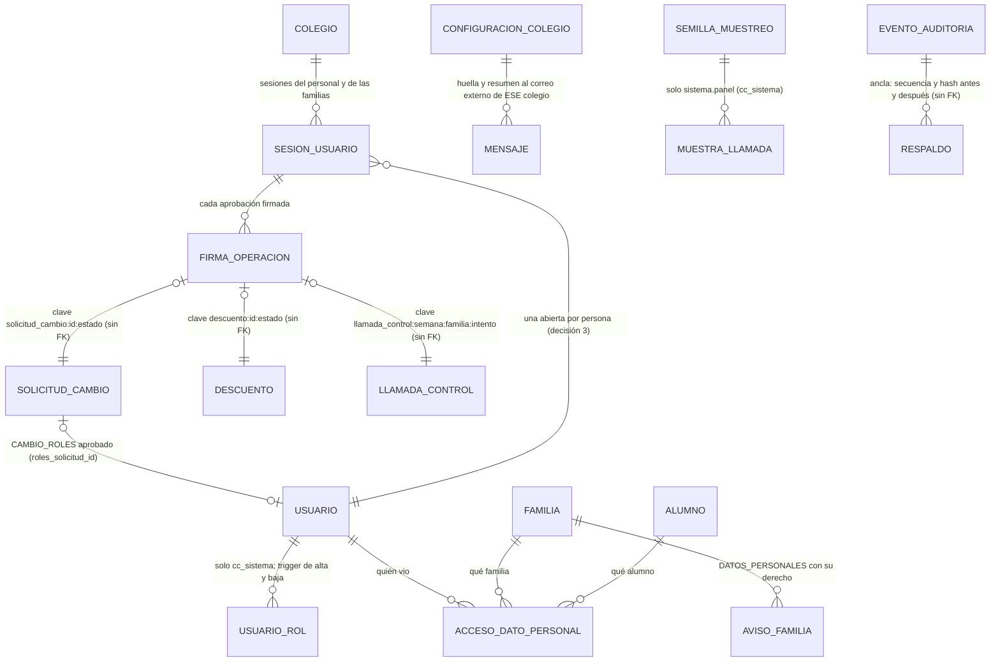

# Sprint 7 · Endurecimiento y entrega: diseño de arquitectura

> Diseño del agente `arquitecto-software`, 8 de octubre de 2026. Rama `claude/sprint-7-endurecimiento`, que parte de `main` con los sprints 0 a 6 (1883 pruebas en H2, 92 de MySQL real, 63 triggers, última migración V23). **No modifiqué código, scripts ni otros documentos**: solo escribí este archivo.
> Paquete base `pe.edu.virgenmaria.cuentasclaras`. El stack no cambia. **Dependencias nuevas de la aplicación: ninguna.** Herramientas nuevas fuera del jar: `age` (cifrado de respaldos), `rclone` (copia fuera del servidor), `cyclonedx-maven-plugin` (SBOM, solo en el build) y OSV-Scanner (en el CI).
>
> **Cómo se verificó (y qué NO se verificó)**
> - **Leído:** `CLAUDE.md`, la skill `contexto-colegio`, `plan-de-desarrollo.md` (sprint 7), `estado-del-proyecto.md`, `sprint-6-panel-promotora.md`, `sprint-6-correcciones.md`, los riesgos residuales de `sprint-3-correcciones.md`, `sprint-4-correcciones.md` y `sprint-5-correcciones.md`, todo `docs/operacion/`, `scripts/mysql/01`, `02` y `03` (lista de triggers y los bloques citados), V2, V3, V13, V17, V19, V21 y V23, `.github/workflows/ci.yml` (pasos), `docker-compose.yml`, `.env.ejemplo`, `Dockerfile`, `application*.yaml` y las clases de «Archivos leídos».
> - **NO probado:** sesión sin base de datos. V24, V25, V26, los GRANT, el rol `cc_negocio`, las funciones y los 10 triggers nuevos **no se ejecutaron** en H2 ni en MySQL 8. El primer paso de cada tanda es aplicarlos sobre V1–V23 reales en ambas bases (hallazgo 1 del sprint 3).
> - **Comportamientos de MySQL que el paso 1 de la tanda 2 debe confirmar antes de seguir:**
>   - que `SESSION_USER()` dentro de un trigger y de una función `DEFINER` devuelve el usuario de la conexión, no el definidor;
>   - que un `BEFORE INSERT` puede leer su propia tabla (`usuario_rol`);
>   - que `REVOKE IF EXISTS ALL PRIVILEGES, GRANT OPTION FROM ... IGNORE UNKNOWN USER` existe en 8.4;
>   - que `SET DEFAULT ROLE` activa `cc_negocio` al conectar;
>   - cómo guarda MySQL 8.4 `ACTION_STATEMENT` cuando el cliente `mysql` quita los comentarios.
> - **Normativa:** los plazos de la Ley 29733 salen de resúmenes de estudios y entidades, no del texto oficial del DS 016-2024-JUS (sección 8 y «Fuentes»). Debe confirmarlos el asesor legal del colegio.

## 1. Resumen
- **Un segundo usuario de base de datos, `cc_sistema`, es el único que puede firmar como `sistema.*` y el único que toca la identidad** (altas, claves, roles, sesiones). `cc_app` deja de poder crear cuentas, cambiar el `clave_hash` de la directora o darse el rol PROMOTOR. Así se cierra el camino real para «aprobar a nombre de otra persona» (hallazgo H1).
- **Toda aprobación de una persona lleva la firma de su sesión:** al ingresar, `cc_sistema` guarda el SHA-256 de un secreto que solo vive en la memoria del servidor. Cada aprobación inserta una `firma_operacion` con ese secreto y el trigger la valida contra la sesión abierta de quien resuelve. Con solo la clave de `cc_app` no se puede aprobar como otra persona.
- **El verificador de prod compara la huella (SHA-256 normalizado) de cada trigger y función** con la de `03-triggers.sql` empaquetado en el jar. También rechaza triggers de más y privilegios de más. Además: un respaldo diario cifrado fuera del servidor, con restauración automática en el CI y anclas de la bitácora; monitoreo sin servicios pagos; registro de quién ve datos personales; «Mis datos» para las familias; y la entrega (manuales, videos, capacitación y acta).
- **Tres tandas:** (1) respaldos y monitoreo (V24, 64 triggers), (2) base de datos endurecida (V25, 73 triggers), (3) seguridad web, Ley 29733 y entrega (V26, 73 triggers). La tanda 1 va primero porque protege los datos reales desde el piloto y no depende de las otras dos.

## 2. Hallazgos al leer el código (leer antes de implementar)
1. **H1 (alto). `cc_app` puede suplantar a cualquier persona sin tocar las tablas de aprobación.** Tiene `INSERT, UPDATE` sobre `usuario` y `INSERT, UPDATE, DELETE` sobre `usuario_rol` (`02-permisos-tablas.sql`, líneas 4 y 5). Con esas credenciales:
   - cambiar el `clave_hash` de Dirección por uno conocido y entrar por la web como ella;
   - o crear una cuenta nueva con PROMOTOR y una clave conocida.
   La bitácora registra después «aprobó director» con una sesión legítima. Un usuario de base aparte **solo para los procesos** no cierra esto: la identidad también debe pasar a `cc_sistema`.
2. **H2. `Usuario.cambiarRoles` hace `roles.clear()` y después `addAll`** (línea 265). En un `@ElementCollection`, Hibernate borra todas las filas y las vuelve a insertar. Un trigger de «no dejar al colegio sin PROMOTOR» rechazaría un cambio legítimo. Hay que quitar y agregar solo la diferencia.
3. **H3. `EjecucionComoSistema` reutiliza la transacción abierta si el colegio es el mismo.** Pasa con el envío síncrono al OSE de las pruebas (`AFTER_COMMIT` en el hilo del cobro) y con la semilla del muestreo pedida desde una pantalla de Promotoría. Con dos usuarios de base, el actor de sistema escribiría con la conexión de `cc_app` y el trigger lo rechazaría. Con una transacción activa, `EjecucionComoSistema` debe abrir siempre `REQUIRES_NEW` en la ruta de sistema.
4. **H4. La semilla del muestreo se puede plantar.** `cc_app` tiene `INSERT` sobre `semilla_muestreo` y no hay trigger de fecha. El algoritmo de la muestra está en el repositorio: alguien puede probar semillas fuera de línea hasta encontrar una que deje fuera a una familia, e insertar la del próximo lunes antes de que exista.
   - Leerla, en cambio, sirve de poco: se crea al usarse y la muestra queda guardada y visible.
   - Se cierran las dos cosas: plantarla (GRANT y trigger) y leerla (la semilla efectiva se deriva con HMAC y una clave que no está en la base).
5. **H5. `ck_configuracion_colegio_clave` solo admite `resumen_correo_externo`** (V23). Para llevar la huella a su colegio, V25 recrea el CHECK.
6. **H6. Los GRANT solo se agregan.** Un GRANT de más que alguien dé a mano queda para siempre, porque `02` nunca revoca. Desde este sprint, `02` empieza con `REVOKE ALL` y es la única fuente de los permisos.
7. **H7. El verificador solo compara nombres de triggers.** No detecta una versión vieja o debilitada con el mismo nombre (residual del sprint 6), ni un trigger o una función de más. `triggers_instalados()` es `DEFINER`: un DBA podría reemplazarla. Eso queda como residual, cubierto por el simulacro de restauración (sección 9.5).
8. **H8. Cabeceras y cookie.**
   - No se configura HSTS: Spring Security lo envía solo si la petición llega como segura, así que depende del proxy.
   - No hay `Cross-Origin-Opener-Policy` ni `Cross-Origin-Resource-Policy`.
   - La cookie `CCSESION` no usa el prefijo `__Host-`.
9. **H9. No hay límite de intentos de ingreso por IP.** Con 5 intentos, un tercero puede bloquear la cuenta de la promotora a propósito (bloqueo dirigido). Solo existen los límites de los webhooks (`LimiteAvisosPorIp`, `LimiteWebhookPorIp`).
10. **H10. Logs.**
    - Son texto plano, sin id de petición.
    - Los mensajes de MySQL que la aplicación registra pueden llevar datos personales: un «Duplicate entry» de una clave única incluye el DNI que chocó.
    - `BuzonSimulado` escribe el destino y el enlace (solo existe en dev, test y piloto).
11. **H11. La conexión JDBC de prod no exige TLS.** `docker-compose.yml` usa `useSSL=false` para la instalación local con el perfil `prod`. En el hosting, la protección depende de lo que se escriba en `DB_URL`.
12. **H12. No queda registro de quién ve datos personales.** El sprint 6 decidió no auditar las vistas, para no llenar la bitácora. La Ley 29733 y la regla de acceso mínimo piden saber quién abrió la ficha de un menor.
13. **H13. Las acciones de GitHub se fijan por etiqueta (`actions/checkout@v4`), no por SHA.** Cubre A08 de OWASP (integridad de la cadena de suministro).
14. **H14. `ck_aviso_familia_tipo` no admite pedidos sobre datos personales.** V26 lo recrea.
15. **H15. `cc_app` puede leer todos los `clave_hash`** (SELECT general). Son BCrypt: el riesgo es que alguien los descifre fuera de línea. Se mantiene (quitar la columna del SELECT rompe la validación de Hibernate) y se anota en los riesgos.

## 3. Decisiones de diseño

### 3.1 Cuatro usuarios de MySQL y un rol
| Usuario | Lo usa | Puede | No puede |
|---|---|---|---|
| `cc_migrador` | `java -jar … migrar` y `03-triggers.sql` | Todo sobre el esquema | (la aplicación nunca lo recibe) |
| `cc_app` | Las peticiones de las personas | El rol `cc_negocio`: SELECT general y las escrituras de negocio de siempre | Escribir `usuario`, `usuario_rol`, `sesion_usuario`, `semilla_muestreo`, `huella_*`, `resumen_diario`, `muestra_llamada`, `evento_pasarela`, `liquidacion_*`, el estado de `mensaje` ni el envío de `comprobante`; firmar como `sistema.*`; resolver sin firma |
| `cc_sistema` (nuevo) | Los procesos `sistema.*` y las operaciones de identidad (ingreso, sesiones, claves, roles, altas y contacto del personal) | `cc_negocio` más las exclusivas (sección 6.2) | Editar o borrar la bitácora y los libros (1142); DDL, `TRIGGER`, rutinas |
| `cc_respaldo` (nuevo) | `scripts/respaldo/respaldar.sh` | `SELECT, SHOW VIEW` del esquema; `INSERT` en `respaldo`; `EXECUTE` de `huellas_objetos()` | Escribir cualquier tabla de negocio |

- **`cc_negocio` es un rol de MySQL 8** (`CREATE ROLE`): los GRANT de negocio se escriben una vez y lo reciben `cc_app` y `cc_sistema`. Las exclusivas van directo a `cc_sistema`.
- **Un solo `cc_sistema` para procesos e identidad** (decisión 82). Las dos credenciales viven en el mismo proceso, así que separarlas en dos usuarios no protege contra quien ya tomó el servidor. Sí protege contra la clave de `cc_app` filtrada, una inyección SQL en una pantalla y un error de código en una pantalla.
- **Los triggers distinguen la conexión con `cc_es_sistema()`:** `SUBSTRING_INDEX(SESSION_USER(), '@', 1) = 'cc_sistema'`. **El nombre del usuario es fijo:** el verificador lo exige y la guía de instalación lo dice.

### 3.2 Ruta de conexión en la aplicación (sin AOP ni dependencias)
- `comun.basedatos.FuenteDatosEnrutada extends AbstractRoutingDataSource`, con dos pools Hikari: `APP` (`DB_USUARIO`) y `SISTEMA` (`DB_SISTEMA_USUARIO`, máximo 4 conexiones). En dev y test las dos rutas apuntan al mismo H2.
- **La clave de la ruta se decide al pedir la conexión** (al empezar la transacción):
  - `SISTEMA` si el `SecurityContext` tiene un `PrincipalSistema` o si `RutaConexion.identidad()` está activa en el hilo;
  - en cualquier otro caso, `APP`. Sin contexto (arranque, validación de Hibernate), `APP`: el valor por defecto es el de menos permisos.
- `EjecucionComoSistema.como(...)`: si hay una transacción activa, la tarea corre en `REQUIRES_NEW` (H3). Nunca se une a la transacción de una persona.
- `seguridad.service.identidad.EjecucionIdentidad.como(Supplier)`: marca la ruta de identidad y abre su propia transacción.
  - **Falla si ya hay una transacción activa**: una operación de identidad nunca se mezcla con una de negocio en curso.
  - Mantiene el `SecurityContext` de la persona: la bitácora registra a quien la hizo, no a un actor de sistema.
  - Solo la usan las clases de `seguridad.service.identidad` (ArchUnit).
- **Si el código se equivoca de ruta, el sistema falla cerrado:** el trigger rechaza la fila `sistema.*` escrita por `cc_app` y el GRANT rechaza la escritura de identidad (1142). Lo cubren las pruebas de MySQL.

### 3.3 Identidad en `cc_sistema`
Pasan por `EjecucionIdentidad`:
- el ingreso: `ProveedorAutenticacion` (intentos, bloqueo) y `ManejadorIngresoExitoso` (último ingreso y apertura de la sesión);
- la salida y la expiración (`ServicioCierreSesion`, oyente de `HttpSessionDestroyedEvent`);
- `ServicioUsuarios` (alta, restablecer, desactivar, reactivar, desbloquear);
- `ServicioCuenta` (cambiar la clave) y `ServicioActivacionCuenta` (elegir la clave con el enlace);
- `ServicioAccesoApoderados.darAcceso|restablecerAcceso|quitarAcceso` (ya no son `@Transactional`);
- `ManejadorContactoPersonal` y el nuevo `ManejadorCambioRoles`.

En la bandeja, `BandejaAprobaciones.aprobar|rechazar` de los tipos `TIPOS_DE_IDENTIDAD = {CAMBIO_CONTACTO_PERSONAL, CAMBIO_ROLES}` corre completa en la ruta de identidad: la resolución de la solicitud, su firma y el cambio van en una sola transacción.

### 3.4 Firma de sesión (la prueba de que la persona está ahí)
1. **Al ingresar:** se generan 32 bytes con `SecureRandom` y se guardan en hexadecimal en la sesión HTTP (memoria del servidor, nunca en la cookie). `cc_sistema` inserta en `sesion_usuario` solo su SHA-256, con la IP y `vence_en` (10 h, decisión 83).
2. **Cierre de la sesión de la base**, con su motivo:
   - al salir (`SALIO`);
   - cuando la sesión HTTP expira o se invalida (`VENCIO`);
   - con un segundo ingreso (`OTRA_SESION`);
   - al cambiar la clave, los roles o el contacto (`CUENTA_CAMBIADA`);
   - al arrancar la aplicación, todas las que quedaron abiertas (`REINICIO`).
3. **Al aprobar:** `FirmaSesion.firmar(String clave)` inserta (con `saveAndFlush`, antes del UPDATE) una fila en `firma_operacion` con `sesion_id`, `usuario_id`, la clave canónica de la operación y el secreto. `trg_firma_operacion_nace` comprueba que `SHA2(token)` sea el de una sesión abierta y vigente de ESA persona en ESE colegio, deja el secreto en `NULL` y pone `firmada_bd` con la hora de la base.
4. **El trigger de la tabla resuelta** llama a `cc_firma_valida(colegio, clave, quien)`:
   - si `quien` es `sistema.*`, exige `cc_es_sistema()`;
   - si es una persona, exige una firma con esa clave de esa persona hecha hace 5 minutos o menos;
   - `uk_firma_operacion (colegio_id, clave)` impide usar dos veces la misma firma.
5. **Claves canónicas** (`seguridad.service.sesion.ClaveFirma`; las mismas cadenas en `03`):

| Tabla | Columna | Cuándo | Clave |
|---|---|---|---|
| `solicitud_cambio` | `resuelto_por` | PENDIENTE → APROBADA o RECHAZADA | `solicitud_cambio:{id}:{estado}` |
| `descuento` | `resuelto_por` | SOLICITADO → APROBADO o RECHAZADO | `descuento:{id}:{estado}` |
| `cierre_caja` | `revisado_por` | POR_REVISAR → revisado | `cierre_caja:{id}:{estado}` |
| `plan_pension` | `aprobado_por` | → APROBADO | `plan_pension:{id}:APROBADO` |
| `lote_saldo_inicial` | `confirmado_por` | → CONFIRMADO o DEVUELTO | `lote_saldo_inicial:{id}:{estado}` |
| `extracto_bancario` | `confirmado_por` / `rechazado_por` | → CONFIRMADO o RECHAZADO | `extracto_bancario:{id}:{estado}` |
| `lote_recaudacion` | `confirmado_por` / `rechazado_por` | → CONFIRMADO o RECHAZADO | `lote_recaudacion:{id}:{estado}` |
| `partida_conciliacion` | `resuelto_por` | PROPUESTA → resuelta (persona) | `partida_conciliacion:{id}:{estado}` |
| `cierre_mensual_banco` | `registrado_por` | registro a ciegas | `cierre_mensual_banco:{id}:{intentos}` |
| `feriado` | `aprobado_por` | pendiente → aprobado | `feriado:{id}:APROBADO` |
| `aviso_familia` | `atendido_por` | ABIERTO → ATENDIDO | `aviso_familia:{id}:ATENDIDO` |
| `renovacion_matricula` | `respondido_por` | respuesta de la familia o del personal (crea deuda) | `renovacion_matricula:{id}:{estado}` |
| `verificacion_bancaria` | `creado_por` (MANUAL) | INSERT | `verificacion_bancaria:{PAGO o DEPOSITO}:{id}:{n}` (n = verificaciones previas + 1) |
| `llamada_control` | `creado_por` | INSERT | `llamada_control:{semana}:{familia_id}:{intento}` |
| `delegacion_llamada` | `creado_por` | INSERT | `delegacion_llamada:{semana}` |

> Los estados exactos y las columnas `rechazado_por` e `intentos` se confirman contra V8–V23 al implementar. Si una tabla no guarda quién hizo un intento fallido, solo se firma la transición final.

- **El secreto no queda en la base.** El trigger lo vacía y el binlog en formato ROW (el que trae MySQL 8 por defecto) guarda la fila ya vacía. El log general de MySQL debe estar apagado en prod (se agrega a `docs/operacion/mysql-usuarios.md`).
- **Pruebas sin atajos en producción.** `TokenDeSesion` es una interfaz:
  - en prod y piloto, `TokenDeSesionHttp` lee la sesión HTTP;
  - en `src/test`, `TokenDeSesionDePrueba` (`@Primary`, solo perfil `test`) abre una sesión por la ruta de identidad para el principal de la prueba;
  - `VerificadorConfiguracion` exige `TokenDeSesionHttp` fuera de `test`.

### 3.5 Roles con trigger
- **`usuario_rol` solo lo escribe `cc_sistema`** (GRANT) y lo vigilan `trg_usuario_rol_alta` y `trg_usuario_rol_baja`:
  - APODERADO solo en cuentas de apoderado; los roles del personal solo en cuentas del personal;
  - combinaciones prohibidas también en la base: CAJA con PROMOTOR, DIRECTOR o ADMINISTRACION, y DIRECTOR con ADMINISTRACION (decisiones 1 y 2);
  - **dar o quitar PROMOTOR o DIRECTOR exige una solicitud `CAMBIO_ROLES` APROBADA**, enlazada en `usuario.roles_solicitud_id`, firmada hace 5 minutos o menos por otra persona, cuyo `datos.roles` contiene (alta) o no contiene (baja) ese rol. La única excepción es el primer PROMOTOR de un colegio sin Promotoría activa (`InicializadorPromotor`);
  - el colegio nunca se queda sin un PROMOTOR activo: lo exigen la baja del rol y `trg_usuario_identidad` al desactivar.
- **Los demás roles** (ADMINISTRACION, CAJA, DOCENTE) los sigue asignando Promotoría sin solicitud (decisión 84).
- **Alta de una cuenta de aprobador:** nace sin PROMOTOR ni DIRECTOR, y ese rol se le asigna con `CAMBIO_ROLES` (decisión 85).
- **`Usuario.cambiarRoles` aplica solo la diferencia** (H2). La prueba en MySQL cuenta las sentencias: cambiar ADMINISTRACION por DOCENTE es un DELETE y un INSERT, no un borrado de todas las filas.

### 3.6 Muestreo
- **La semilla la crea y la lee solo `cc_sistema`** (`ActorSistema.MUESTREO`, `sistema.muestreo`). `trg_semilla_muestreo_registro` exige la fecha de hoy (CAJA) o el lunes de la semana en curso (LLAMADA_CONTROL), según la hora de Lima de la base. No se pueden plantar semillas futuras.
- **La semilla efectiva no está en la base:** `semilla = HMAC-SHA256(clave del servidor, "muestreo|" + ámbito + "|" + fecha + "|" + aleatorio_guardado)`, truncada a 64 bits (`comun.cripto.DerivadorSecreto`, con la misma `AUDITORIA_CLAVE_HMAC` y separación de dominio). Quien lee `semilla_muestreo` con `cc_app` no puede reproducir la muestra.
  - El día del despliegue cambia una vez la muestra diaria de CAJA. La de la llamada no cambia, porque ya está guardada en `muestra_llamada`.
- **La muestra de la llamada de control la fija solo `sistema.panel`:**
  - el lunes a las 00:10, con `panel.proceso.MuestraSemanal`;
  - si esa tarea no corrió, la primera consulta de la semana se la pide a `sistema.panel` en `REQUIRES_NEW`;
  - el reemplazo tras dos «No contesta» lo hace `panel.proceso.ReemplazosLlamadas` después del commit; si falla, lo reintenta la pasada de cada 15 minutos;
  - `cc_app` ya no tiene `INSERT` en `muestra_llamada`, y el trigger exige `cc_es_sistema()` y `creado_por = 'sistema.panel'`.
- **«Una hora después» lo exige la base:** `llamada_control.registrada_bd` la pone el trigger con la hora de la base. El segundo intento exige que el primero sea «No contesta» registrado una hora antes o más.

### 3.7 Huellas de los objetos de la base (versiones viejas o debilitadas)
- **Función `huellas_objetos()`** (`02`, `SQL SECURITY DEFINER`, `EXECUTE` para `cc_negocio` y `cc_respaldo`). Devuelve un JSON `{nombre: sha256}`:
  - de cada trigger (`ACTION_TIMING`, `EVENT_MANIPULATION`, `EVENT_OBJECT_TABLE` y `ACTION_STATEMENT`);
  - de cada función del esquema (`ROUTINE_DEFINITION`).
- **Normalización, igual en SQL y en Java:** se quitan los comentarios `--` hasta el fin de la línea, cada tramo de espacios queda en un espacio y se recorta. Así da igual si el cliente `mysql` quitó los comentarios o si el archivo tiene CRLF. Regla nueva de `03`: ningún literal dentro de un cuerpo contiene `--` (lo comprueba `HuellasObjetosBdTest`).
- **El valor esperado sale del `03-triggers.sql` empaquetado en el jar** (recursos de Maven `db/mysql/03-triggers.sql` y `db/mysql/02-permisos-tablas.sql`). `HuellasObjetosBd` extrae cada cuerpo y calcula su huella. No hay un archivo generado que mantener a mano.
- **Prod no arranca si** falta un objeto, sobra uno (un trigger o una función que no está en `03`) o alguna huella difiere. El mensaje dice qué objeto revisar.
- **Plan B:** si MySQL 8.4 guarda el cuerpo de forma que la normalización no alcanza (paso 1 de la tanda 2), el job `mysql` del CI escribe las huellas reales en `src/main/resources/db/mysql/huellas.txt` y falla si el archivo del commit difiere.

### 3.8 Correo externo de la huella por colegio
- La fila `huella_correo_externo` pasa a `configuracion_colegio`, que sigue sin GRANT de escritura (1142).
- V25 copia la fila de `configuracion_bd` solo si existe un único colegio. Con varios colegios, el DBA escribe una fila por cada uno.
- `trg_mensaje_nace` exige la fila del MISMO colegio para todo mensaje EXTERNO. La fila vieja de `configuracion_bd` ya no se usa: el verificador avisa en el log si sigue ahí.

### 3.9 Escrituras de procesos: GRANT donde se puede, trigger donde se mezclan
| Tabla | Quién escribe | Control |
|---|---|---|
| `huella_bitacora`, `huella_hora`, `resumen_diario`, `muestra_llamada`, `semilla_muestreo`, `evento_pasarela`, `liquidacion_pasarela`, `liquidacion_linea` | Solo procesos | **GRANT** solo a `cc_sistema` (1142 para `cc_app`) |
| `comprobante` (UPDATE del envío al OSE) | Solo `sistema.ose` | **GRANT** de UPDATE por columna solo a `cc_sistema`; `cc_negocio` conserva el INSERT (emisión y reemisión) |
| `mensaje` (UPDATE de estado) | Solo `sistema.mensajeria` (despacho y webhook) | **GRANT** de UPDATE solo a `cc_sistema`; `cc_negocio` conserva el INSERT |
| `pago`, `verificacion_bancaria`, `partida_conciliacion`, `orden_pago`, `lote_recaudacion`, `linea_recaudacion`, `matricula`, `evento_auditoria`, `mensaje` (INSERT) | Personas y procesos | **Trigger**: toda columna `*_por` o `creado_por` con `sistema.*` exige `cc_es_sistema()`. Las transiciones que solo hace un proceso (orden confirmada, lote APLICADO, línea APLICADA, verificación AUTOMATICA, matrícula activada) también lo exigen |

> **Antes de quitar un GRANT, buscar todo lugar que escriba esa tabla** (como hizo el sprint 6 con `trg_usuario_contacto`). Si una persona la escribe, el GRANT se queda y se usa el trigger.

### 3.10 Respaldos, monitoreo, privacidad y entrega
Se detallan en las secciones 8 a 10 y 15. En resumen:
- **Respaldo:** solo datos, cifrado con `age` para dos destinatarios, en un almacenamiento de objetos con bloqueo de objetos, con un manifiesto que ancla la bitácora y el conteo de las tablas de solo inserción.
- **Restauración:** se prueba en el CI en cada PR y cada semana con los datos reales.
- **Monitoreo:** health checks, logs JSON enmascarados, alertas técnicas por correo y un vigilante externo gratuito.
- **Privacidad:** registro de accesos a datos personales (fuera de la cadena HMAC, para no llenar la bitácora), «Mis datos» en el portal y pedidos sobre datos personales por «¿Algo no cuadra?».

## 4. Modelo


**Invariantes.** «(base)» = CHECK, UNIQUE o FK; «(MySQL)» = trigger; «(1142)» = sin GRANT.

- **`sesion_usuario`** (tanda 2):
  - la escribe solo `cc_sistema` (1142 para `cc_app`; MySQL);
  - nace abierta, de una cuenta activa de ese colegio, con `abierta_en` a 5 minutos o menos de la hora de la base y `vence_en` 12 h después como máximo (MySQL); `hash_token` de 64 hexadecimales y único (base);
  - se cierra una sola vez y con motivo (base y MySQL); nunca se borra (1142).
- **`firma_operacion`** (tanda 2):
  - de solo inserción (1142); una firma por colegio y clave (base);
  - el token corresponde a una sesión abierta y vigente de esa persona; el trigger lo vacía y pone `firmada_bd` (MySQL);
  - una resolución de persona en las 15 tablas de la sección 3.4 exige su firma de hace 5 minutos o menos (MySQL).
- **`usuario` y `usuario_rol`** (tanda 2):
  - los escribe solo `cc_sistema` (1142); el nombre de usuario y el colegio no cambian (MySQL);
  - una cuenta nace activa, con la clave por cambiar (o, la de un apoderado, con su enlace), sin intentos, sin bloqueo y sin solicitud de roles (MySQL);
  - PROMOTOR y DIRECTOR se dan o se quitan solo con su `CAMBIO_ROLES` aprobada y firmada por otra persona; el colegio nunca se queda sin PROMOTOR activo; las combinaciones prohibidas no existen (MySQL);
  - `roles_solicitud_id` solo avanza a una solicitud más nueva, aprobada y de ese usuario, y cada solicitud se usa una vez (base y MySQL).
- **`semilla_muestreo` y `muestra_llamada`** (tanda 2): las escribe solo `cc_sistema` (1142); la semilla es de hoy (CAJA) o del lunes en curso (LLAMADA_CONTROL); la muestra la crea `sistema.panel` (MySQL).
- **`evento_auditoria`** (tanda 2): un evento de `sistema.*` lo inserta solo `cc_sistema` (MySQL).
- **`respaldo`** (tanda 1):
  - de solo inserción, la escribe solo `cc_respaldo` (1142 y MySQL);
  - `secuencia_antes <= secuencia_despues <= ultima_secuencia`, y `hash_despues` es el `hash` del evento con esa secuencia (MySQL);
  - es **técnica y de toda la base**: no lleva `colegio_id`, como `configuracion_bd` y `auditoria_cadena`. No guarda datos de ningún colegio, solo conteos y hashes.
- **`acceso_dato_personal`** (tanda 3): de solo inserción (1142); con `colegio_id`, la persona y la familia o el alumno del mismo colegio (base).
- **`aviso_familia`** (tanda 3): tipo nuevo `DATOS_PERSONALES` con `derecho` obligatorio (ACCESO, RECTIFICACION, CANCELACION u OPOSICION); los demás tipos no llevan `derecho` (base).

## 5. Migraciones Flyway (NO probadas: aplicar sobre V1–V23 en H2 2.4.240 MODE=MySQL y MySQL 8 antes de seguir)

### `V24__registro_de_respaldos.sql` (tanda 1)
```sql
-- Sprint 7 · tanda 1. Registro de cada respaldo (lo escribe SOLO cc_respaldo, trg_respaldo_registro). Tabla técnica de
-- toda la base: sin colegio_id, sin datos personales. Ancla la bitácora (secuencia y hash antes y después del volcado) y
-- guarda los conteos de las tablas de solo inserción para que el respaldo siguiente detecte filas borradas.
CREATE TABLE respaldo (
    id                  BIGINT        NOT NULL AUTO_INCREMENT PRIMARY KEY,
    inicio              DATETIME(6)   NOT NULL,
    fin                 DATETIME(6)   NOT NULL,
    archivo             VARCHAR(120)  NOT NULL,   -- cc-AAAAMMDD-HHMM.sql.gz.age
    sha256              CHAR(64)      NOT NULL,   -- del archivo CIFRADO
    bytes               BIGINT        NOT NULL,
    version_esquema     VARCHAR(20)   NOT NULL,   -- última versión de Flyway
    secuencia_antes     BIGINT        NOT NULL,
    hash_antes          CHAR(64)      NOT NULL,
    secuencia_despues   BIGINT        NOT NULL,
    hash_despues        CHAR(64)      NOT NULL,
    conteos             VARCHAR(4000) NOT NULL,   -- JSON {tabla: [filas, id máximo]} de las tablas de solo inserción
    huella_objetos      CHAR(64),                 -- SHA-256 de huellas_objetos() (desde la tanda 2)
    destino             VARCHAR(60)   NOT NULL,   -- nombre del destino de rclone, sin credenciales
    creado_en           DATETIME(6)   NOT NULL,
    creado_por          VARCHAR(60)   NOT NULL,
    CONSTRAINT uk_respaldo_archivo UNIQUE (archivo),
    CONSTRAINT ck_respaldo_sha CHECK (REGEXP_LIKE(sha256, '^[0-9a-f]{64}$', 'c')),
    CONSTRAINT ck_respaldo_orden CHECK (fin >= inicio AND bytes > 0 AND secuencia_antes >= 0
        AND secuencia_despues >= secuencia_antes),
    CONSTRAINT ck_respaldo_actor CHECK (creado_por = 'cc_respaldo')
);
CREATE INDEX ix_respaldo_fin ON respaldo (fin);
```
> - Sin `actualizado_en` ni `version`: no extiende `BaseEntity` y la aplicación solo la lee (`operacion.model.Respaldo`, `@Immutable`).
> - `conteos` es texto JSON y no una tabla hija, para no agregar otra tabla. En MySQL se lee con `JSON_EXTRACT` y en Java con Jackson.

### `V25__identidad_sesiones_y_firmas.sql` (tanda 2)
```sql
-- Sprint 7 · tanda 2. Sesiones de las personas (las abre y cierra SOLO cc_sistema), firma de cada aprobación (el trigger
-- valida el secreto de la sesión y lo vacía), solicitud de roles enlazada en el usuario, hora de la base en la llamada
-- de control y correo externo de la huella por colegio. Nada se borra.
CREATE TABLE sesion_usuario (
    id              BIGINT        NOT NULL AUTO_INCREMENT PRIMARY KEY,
    colegio_id      BIGINT        NOT NULL,
    usuario_id      BIGINT        NOT NULL,
    hash_token      CHAR(64)      NOT NULL,
    ip              VARCHAR(45),
    abierta_en      DATETIME(6)   NOT NULL,
    vence_en        DATETIME(6)   NOT NULL,
    cerrada_en      DATETIME(6),
    motivo_cierre   VARCHAR(20),
    creado_en       DATETIME(6)   NOT NULL,
    creado_por      VARCHAR(60)   NOT NULL,
    actualizado_en  DATETIME(6)   NOT NULL,
    version         BIGINT        NOT NULL DEFAULT 0,
    CONSTRAINT uk_sesion_usuario_token UNIQUE (hash_token),
    CONSTRAINT uk_sesion_usuario_id_colegio UNIQUE (id, colegio_id),
    CONSTRAINT fk_sesion_usuario_colegio FOREIGN KEY (colegio_id) REFERENCES colegio (id),
    CONSTRAINT fk_sesion_usuario_usuario FOREIGN KEY (usuario_id, colegio_id) REFERENCES usuario (id, colegio_id),
    CONSTRAINT ck_sesion_usuario_token CHECK (REGEXP_LIKE(hash_token, '^[0-9a-f]{64}$', 'c')),
    CONSTRAINT ck_sesion_usuario_vigencia CHECK (vence_en > abierta_en),
    CONSTRAINT ck_sesion_usuario_cierre CHECK ((cerrada_en IS NULL AND motivo_cierre IS NULL)
        OR (cerrada_en IS NOT NULL AND motivo_cierre IN ('SALIO', 'VENCIO', 'OTRA_SESION', 'CUENTA_CAMBIADA', 'REINICIO')))
);
CREATE INDEX ix_sesion_usuario_abiertas ON sesion_usuario (colegio_id, usuario_id, cerrada_en);

CREATE TABLE firma_operacion (
    id              BIGINT        NOT NULL AUTO_INCREMENT PRIMARY KEY,
    colegio_id      BIGINT        NOT NULL,
    sesion_id       BIGINT        NOT NULL,
    usuario_id      BIGINT        NOT NULL,
    clave           VARCHAR(120)  NOT NULL,
    token           CHAR(64),                  -- llega en el INSERT; en MySQL el trigger lo valida y lo deja en NULL
    firmada_bd      DATETIME(6),               -- hora de Lima según la base (la pone el trigger)
    creado_en       DATETIME(6)   NOT NULL,
    creado_por      VARCHAR(60)   NOT NULL,
    actualizado_en  DATETIME(6)   NOT NULL,
    version         BIGINT        NOT NULL DEFAULT 0,
    CONSTRAINT uk_firma_operacion UNIQUE (colegio_id, clave),
    CONSTRAINT fk_firma_operacion_sesion FOREIGN KEY (sesion_id, colegio_id) REFERENCES sesion_usuario (id, colegio_id),
    CONSTRAINT fk_firma_operacion_usuario FOREIGN KEY (usuario_id, colegio_id) REFERENCES usuario (id, colegio_id)
);
CREATE INDEX ix_firma_operacion_usuario ON firma_operacion (colegio_id, usuario_id, firmada_bd);

-- Roles PROMOTOR y DIRECTOR solo con SU solicitud CAMBIO_ROLES aprobada, usada una vez (patrón de contacto_solicitud_id).
ALTER TABLE usuario ADD COLUMN roles_solicitud_id BIGINT;
ALTER TABLE usuario ADD CONSTRAINT uk_usuario_roles_solicitud UNIQUE (colegio_id, roles_solicitud_id);
ALTER TABLE usuario ADD CONSTRAINT fk_usuario_roles_solicitud FOREIGN KEY (roles_solicitud_id, colegio_id)
    REFERENCES solicitud_cambio (id, colegio_id);

-- Residual del sprint 6: «una hora después» con la hora de la base, no con creado_en (lo escribe la aplicación).
ALTER TABLE llamada_control ADD COLUMN registrada_bd DATETIME(6);

-- Residual del sprint 6: la huella al correo externo de SU colegio (H5).
ALTER TABLE configuracion_colegio DROP CONSTRAINT ck_configuracion_colegio_clave;
ALTER TABLE configuracion_colegio ADD CONSTRAINT ck_configuracion_colegio_clave
    CHECK (clave IN ('resumen_correo_externo', 'huella_correo_externo'));
INSERT INTO configuracion_colegio (colegio_id, clave, valor, creado_en)
SELECT c.id, 'huella_correo_externo', b.valor, NOW(6)
  FROM configuracion_bd b CROSS JOIN colegio c
 WHERE b.clave = 'huella_correo_externo' AND (SELECT COUNT(*) FROM colegio) = 1;
```
> - `SesionUsuario` y `FirmaOperacion` extienden `BaseEntity`. En `SesionUsuario`, solo `cerradaEn`, `motivoCierre`, `actualizadoEn` y `version` son `updatable = true` (GRANT por columna).
> - `FirmaOperacion` tiene todo `updatable = false` y `firmadaBd` con `insertable = false` (lo pone el trigger; en H2 queda `NULL` y la aplicación no lo usa). `ClaveFirma` valida el formato de la clave (`tabla:partes`, solo `[A-Za-z0-9:_-]`). Lo comprueba `InmutabilidadIdentidadTest`.
> - `Usuario.rolesSolicitudId` es `updatable = true` y solo lo cambia `ManejadorCambioRoles`.
> - `LlamadaControl.registradaBd`: `insertable = false, updatable = false`.
> - Comprobar que `configuracion_bd` tiene las columnas `clave`, `valor` y `creado_en` (los ejemplos de `mysql-usuarios.md` las usan). En H2 dev hay dos colegios (`promotor.b`): no se copia nada, como corresponde.

### `V26__datos_personales.sql` (tanda 3)
```sql
-- Sprint 7 · tanda 3. Ley 29733: quién ve los datos personales (solo inserción; fuera de la cadena HMAC por volumen) y
-- pedidos sobre datos personales por «¿Algo no cuadra?».
CREATE TABLE acceso_dato_personal (
    id              BIGINT        NOT NULL AUTO_INCREMENT PRIMARY KEY,
    colegio_id      BIGINT        NOT NULL,
    usuario_id      BIGINT        NOT NULL,
    tipo            VARCHAR(30)   NOT NULL,
    familia_id      BIGINT,
    alumno_id       BIGINT,
    cantidad        INT           NOT NULL DEFAULT 1,   -- filas con datos personales mostradas (búsquedas y listas)
    ip              VARCHAR(45),
    creado_en       DATETIME(6)   NOT NULL,
    creado_por      VARCHAR(60)   NOT NULL,
    actualizado_en  DATETIME(6)   NOT NULL,
    version         BIGINT        NOT NULL DEFAULT 0,
    CONSTRAINT fk_acceso_dato_colegio FOREIGN KEY (colegio_id) REFERENCES colegio (id),
    CONSTRAINT fk_acceso_dato_usuario FOREIGN KEY (usuario_id, colegio_id) REFERENCES usuario (id, colegio_id),
    CONSTRAINT fk_acceso_dato_familia FOREIGN KEY (familia_id, colegio_id) REFERENCES familia (id, colegio_id),
    CONSTRAINT fk_acceso_dato_alumno FOREIGN KEY (alumno_id, colegio_id) REFERENCES alumno (id, colegio_id),
    CONSTRAINT ck_acceso_dato_tipo CHECK (tipo IN ('FICHA_FAMILIA', 'FICHA_ALUMNO', 'BUSQUEDA', 'MOROSOS',
        'LLAMADA_CONTROL', 'IMPORTACION', 'APROBACION_CONTACTO')),
    CONSTRAINT ck_acceso_dato_cantidad CHECK (cantidad >= 0)
);
CREATE INDEX ix_acceso_dato_familia ON acceso_dato_personal (colegio_id, familia_id, creado_en);
CREATE INDEX ix_acceso_dato_usuario ON acceso_dato_personal (colegio_id, usuario_id, creado_en);

-- H14: pedidos sobre datos personales (derechos ARCO) por el mismo canal de «¿Algo no cuadra?».
ALTER TABLE aviso_familia DROP CONSTRAINT ck_aviso_familia_tipo;
ALTER TABLE aviso_familia ADD CONSTRAINT ck_aviso_familia_tipo CHECK (tipo IN ('PAGUE_Y_NO_APARECE',
    'NO_RECONOZCO_PAGO', 'NO_RECONOZCO_ANULACION_O_DESCUENTO', 'OTRO', 'DATOS_PERSONALES'));
ALTER TABLE aviso_familia ADD COLUMN derecho VARCHAR(20);
ALTER TABLE aviso_familia ADD CONSTRAINT ck_aviso_familia_derecho CHECK (
    (tipo = 'DATOS_PERSONALES' AND derecho IN ('ACCESO', 'RECTIFICACION', 'CANCELACION', 'OPOSICION'))
    OR (tipo <> 'DATOS_PERSONALES' AND derecho IS NULL));
```
> - `alumno (id, colegio_id)` es UNIQUE (la usan `fk_descuento_alumno` y `fk_linea_recaudacion_alumno`); `familia (id, colegio_id)` también (`fk_pago_familia`).
> - `AccesoDatoPersonal` tiene todas sus columnas `updatable = false`.
> - Comprobar el nombre de `ck_aviso_familia_tipo` en V18 y si V20 lo recreó con otro nombre.

## 6. Cambios de MySQL: `01`, `02`, `03`, `04` y el verificador

### 6.1 `scripts/mysql/01-usuarios.sql` (instalaciones nuevas)
```sql
CREATE USER IF NOT EXISTS 'cc_app'@'%' IDENTIFIED BY '__CLAVE_APP__';
-- Sprint 7: procesos sistema.* e identidad. El nombre es FIJO: los triggers lo reconocen con cc_es_sistema().
CREATE USER IF NOT EXISTS 'cc_sistema'@'%' IDENTIFIED BY '__CLAVE_SISTEMA__';
-- Sprint 7: respaldos (solo lectura más el registro del respaldo).
CREATE USER IF NOT EXISTS 'cc_respaldo'@'%' IDENTIFIED BY '__CLAVE_RESPALDO__';
CREATE ROLE IF NOT EXISTS 'cc_negocio';
-- Ya NO se da «GRANT SELECT ON cuentasclaras.* TO cc_app»: todo permiso de la aplicación sale de 02 (rol cc_negocio).
```
- Las cuentas se pueden restringir por host en prod (por ejemplo, `'cc_app'@'10.0.%'`). Si se hace, `02` y `04` usan el mismo host. Queda en la guía, no en el script.
- `docker/mysql/01-crear-usuarios.sh`, `.env.ejemplo` y `docker-compose.yml` ganan `CC_CLAVE_SISTEMA` y `CC_CLAVE_RESPALDO`. La app recibe `DB_SISTEMA_USUARIO=cc_sistema` y `DB_SISTEMA_CLAVE`, y además `CC_EXIGIR_TLS_BD=false` solo en la instalación local (como ya hace con la cookie `Secure`).

### 6.2 `scripts/mysql/02-permisos-tablas.sql` (versión final del sprint)
Estructura nueva. **Se aplica con la aplicación detenida** (sección 9.6): el `REVOKE` inicial deja un instante sin permisos.
```sql
-- 0. Fuente única: se quita TODO y se vuelve a dar (H6). Un GRANT dado a mano no sobrevive a un despliegue.
REVOKE IF EXISTS ALL PRIVILEGES, GRANT OPTION FROM 'cc_app'@'%', 'cc_sistema'@'%', 'cc_respaldo'@'%', 'cc_negocio'
    IGNORE UNKNOWN USER;

-- 1. Rol de negocio (lo que hoy tiene cc_app), con estas diferencias:
GRANT SELECT ON cuentasclaras.* TO 'cc_negocio';
--    usuario y usuario_rol: NADA (pasan a cc_sistema).
--    comprobante: solo INSERT (el UPDATE del envío al OSE pasa a cc_sistema).
--    mensaje: solo INSERT (el UPDATE de estado pasa a cc_sistema).
--    huella_bitacora, huella_hora, resumen_diario, muestra_llamada, semilla_muestreo, evento_pasarela,
--    liquidacion_pasarela, liquidacion_linea: NADA (pasan a cc_sistema).
--    Todo lo demás, idéntico a hoy, cambiando «TO 'cc_app'@'%'» por «TO 'cc_negocio'».
GRANT INSERT ON cuentasclaras.firma_operacion TO 'cc_negocio';            -- tanda 2: solo inserción
GRANT INSERT ON cuentasclaras.acceso_dato_personal TO 'cc_negocio';       -- tanda 3: solo inserción
GRANT 'cc_negocio' TO 'cc_app'@'%', 'cc_sistema'@'%';
SET DEFAULT ROLE 'cc_negocio' TO 'cc_app'@'%', 'cc_sistema'@'%';

-- 2. Exclusivas de cc_sistema (tanda 2).
GRANT INSERT, UPDATE ON cuentasclaras.usuario TO 'cc_sistema'@'%';
GRANT INSERT, DELETE ON cuentasclaras.usuario_rol TO 'cc_sistema'@'%';        -- sin UPDATE: un rol no se edita
GRANT INSERT, UPDATE (cerrada_en, motivo_cierre, actualizado_en, version) ON cuentasclaras.sesion_usuario TO 'cc_sistema'@'%';
GRANT INSERT ON cuentasclaras.semilla_muestreo TO 'cc_sistema'@'%';
GRANT INSERT ON cuentasclaras.huella_bitacora TO 'cc_sistema'@'%';
GRANT INSERT ON cuentasclaras.huella_hora TO 'cc_sistema'@'%';
GRANT INSERT ON cuentasclaras.resumen_diario TO 'cc_sistema'@'%';
GRANT INSERT ON cuentasclaras.muestra_llamada TO 'cc_sistema'@'%';
GRANT INSERT ON cuentasclaras.liquidacion_pasarela TO 'cc_sistema'@'%';
GRANT INSERT ON cuentasclaras.liquidacion_linea TO 'cc_sistema'@'%';
GRANT INSERT, UPDATE (estado, intentos, resultado, procesado_en, actualizado_en, version)
    ON cuentasclaras.evento_pasarela TO 'cc_sistema'@'%';
GRANT UPDATE (estado_envio, intentos, enviado_en, respuesta, codigo_hash, enlace_pdf, proximo_intento_en, ultimo_error,
    codigo_respuesta, aceptado_en, actualizado_en, version) ON cuentasclaras.comprobante TO 'cc_sistema'@'%';
GRANT UPDATE (estado, proveedor, proveedor_mensaje_id, intentos, proximo_intento_en, enviado_en, entregado_en, leido_en,
    ultimo_error, actualizado_en, version) ON cuentasclaras.mensaje TO 'cc_sistema'@'%';

-- 3. cc_respaldo (tanda 1). Solo lectura, sin TRIGGER, PROCESS ni LOCK TABLES (mysqldump --single-transaction --no-tablespaces).
GRANT SELECT, SHOW VIEW ON cuentasclaras.* TO 'cc_respaldo'@'%';
GRANT INSERT ON cuentasclaras.respaldo TO 'cc_respaldo'@'%';

-- 4. Funciones DEFINER (las crea quien aplica 02, como hoy triggers_instalados).
--    triggers_instalados(): sin cambios, EXECUTE para cc_negocio.
--    huellas_objetos() (tanda 2): JSON {nombre: sha256 normalizado} de los triggers y las funciones del esquema.
GRANT EXECUTE ON FUNCTION cuentasclaras.triggers_instalados TO 'cc_negocio';
GRANT EXECUTE ON FUNCTION cuentasclaras.huellas_objetos TO 'cc_negocio', 'cc_respaldo'@'%';
```
`huellas_objetos()`:
```sql
CREATE FUNCTION cuentasclaras.huellas_objetos() RETURNS JSON READS SQL DATA SQL SECURITY DEFINER
    RETURN (SELECT JSON_OBJECTAGG(nombre, huella) FROM (
        SELECT t.TRIGGER_NAME AS nombre, SHA2(CONCAT_WS('|', t.ACTION_TIMING, t.EVENT_MANIPULATION, t.EVENT_OBJECT_TABLE,
            TRIM(REGEXP_REPLACE(REGEXP_REPLACE(t.ACTION_STATEMENT, '--[^\n]*', ''), '[[:space:]]+', ' '))), 256) AS huella
          FROM information_schema.TRIGGERS t WHERE t.TRIGGER_SCHEMA = 'cuentasclaras'
        UNION ALL
        SELECT r.ROUTINE_NAME, SHA2(CONCAT_WS('|', r.ROUTINE_TYPE,
            TRIM(REGEXP_REPLACE(REGEXP_REPLACE(r.ROUTINE_DEFINITION, '--[^\n]*', ''), '[[:space:]]+', ' '))), 256)
          FROM information_schema.ROUTINES r WHERE r.ROUTINE_SCHEMA = 'cuentasclaras') o);
```
> `huellas_objetos` se huella a sí misma. Un DBA que la reemplace por una que devuelva las huellas esperadas engaña al verificador: ese residual lo cubre el simulacro semanal, que lee `information_schema` como administrador (sección 9.5).

### 6.3 `scripts/mysql/03-triggers.sql`

#### Tanda 1 (V24): 1 trigger nuevo, 64 en total
```sql
DELIMITER $$
-- El registro del respaldo lo escribe solo cc_respaldo, ahora, y sus anclas son eventos reales de la bitácora.
DROP TRIGGER IF EXISTS trg_respaldo_registro$$
CREATE TRIGGER trg_respaldo_registro BEFORE INSERT ON respaldo FOR EACH ROW
BEGIN
    IF SUBSTRING_INDEX(SESSION_USER(), '@', 1) <> 'cc_respaldo' THEN
        SIGNAL SQLSTATE '45000' SET MESSAGE_TEXT = 'cuentasclaras: el respaldo lo registra solo cc_respaldo';
    END IF;
    IF ABS(TIMESTAMPDIFF(MINUTE, NEW.fin, UTC_TIMESTAMP(6) - INTERVAL 5 HOUR)) > 10 THEN
        SIGNAL SQLSTATE '45000' SET MESSAGE_TEXT = 'cuentasclaras: el respaldo se registra al terminar';
    END IF;
    IF NEW.secuencia_despues > (SELECT ultima_secuencia FROM auditoria_cadena)
            OR (NEW.secuencia_despues > 0 AND NOT EXISTS (SELECT 1 FROM evento_auditoria e
                WHERE e.secuencia = NEW.secuencia_despues AND e.hash = NEW.hash_despues))
            OR (NEW.secuencia_antes > 0 AND NOT EXISTS (SELECT 1 FROM evento_auditoria e
                WHERE e.secuencia = NEW.secuencia_antes AND e.hash = NEW.hash_antes)) THEN
        SIGNAL SQLSTATE '45000' SET MESSAGE_TEXT = 'cuentasclaras: las anclas del respaldo no son eventos de la bitácora';
    END IF;
END$$
DELIMITER ;
```
> Comprobar el nombre de la columna de `auditoria_cadena` (`ultima_secuencia` según `incidente-auditoria.md`).

#### Tanda 2 (V25): 2 funciones, 9 triggers nuevos y 25 con versión nueva (mismo nombre): 73 en total
**Funciones** (necesitan `log_bin_trust_function_creators = 1`, como `cc_contacto_normal`):
```sql
DELIMITER $$
DROP FUNCTION IF EXISTS cc_es_sistema$$
CREATE FUNCTION cc_es_sistema() RETURNS BOOLEAN NOT DETERMINISTIC NO SQL
    RETURN SUBSTRING_INDEX(SESSION_USER(), '@', 1) = 'cc_sistema'$$

-- Quien resuelve es sistema.* (y escribe cc_sistema) o una persona con SU firma de hace 5 minutos o menos.
DROP FUNCTION IF EXISTS cc_firma_valida$$
CREATE FUNCTION cc_firma_valida(p_colegio BIGINT, p_clave VARCHAR(120), p_quien VARCHAR(60)) RETURNS BOOLEAN
    NOT DETERMINISTIC READS SQL DATA
    RETURN CASE WHEN p_quien LIKE 'sistema.%' THEN cc_es_sistema()
        ELSE EXISTS (SELECT 1 FROM firma_operacion f JOIN usuario u ON u.id = f.usuario_id
            WHERE f.colegio_id = p_colegio AND f.clave = p_clave AND u.nombre_usuario = p_quien
              AND f.firmada_bd >= UTC_TIMESTAMP(6) - INTERVAL 5 HOUR - INTERVAL 5 MINUTE) END$$
```
**Triggers nuevos:**
```sql
-- La firma: el secreto es el de una sesión abierta y vigente de ESA persona en ESE colegio. Nunca queda guardado.
DROP TRIGGER IF EXISTS trg_firma_operacion_nace$$
CREATE TRIGGER trg_firma_operacion_nace BEFORE INSERT ON firma_operacion FOR EACH ROW
BEGIN
    IF NEW.token IS NULL OR NOT EXISTS (SELECT 1 FROM sesion_usuario s JOIN usuario u ON u.id = s.usuario_id
            WHERE s.id = NEW.sesion_id AND s.colegio_id = NEW.colegio_id AND s.usuario_id = NEW.usuario_id
              AND s.hash_token = SHA2(NEW.token, 256) AND s.cerrada_en IS NULL
              AND s.vence_en > UTC_TIMESTAMP(6) - INTERVAL 5 HOUR AND u.activo) THEN
        SIGNAL SQLSTATE '45000' SET MESSAGE_TEXT = 'cuentasclaras: la firma no es de una sesion abierta de esa persona';
    END IF;
    SET NEW.token = NULL;
    SET NEW.firmada_bd = UTC_TIMESTAMP(6) - INTERVAL 5 HOUR;
END$$

DROP TRIGGER IF EXISTS trg_sesion_usuario_nace$$
CREATE TRIGGER trg_sesion_usuario_nace BEFORE INSERT ON sesion_usuario FOR EACH ROW
BEGIN
    IF NOT cc_es_sistema() THEN
        SIGNAL SQLSTATE '45000' SET MESSAGE_TEXT = 'cuentasclaras: las sesiones las abre solo cc_sistema';
    END IF;
    IF NEW.cerrada_en IS NOT NULL OR NEW.vence_en > NEW.abierta_en + INTERVAL 12 HOUR
            OR ABS(TIMESTAMPDIFF(SECOND, NEW.abierta_en, UTC_TIMESTAMP(6) - INTERVAL 5 HOUR)) > 300
            OR NOT EXISTS (SELECT 1 FROM usuario u WHERE u.id = NEW.usuario_id AND u.colegio_id = NEW.colegio_id
                AND u.activo) THEN
        SIGNAL SQLSTATE '45000' SET MESSAGE_TEXT = 'cuentasclaras: la sesion nace abierta, ahora y de una cuenta activa';
    END IF;
END$$

DROP TRIGGER IF EXISTS trg_sesion_usuario_cierre$$
CREATE TRIGGER trg_sesion_usuario_cierre BEFORE UPDATE ON sesion_usuario FOR EACH ROW
BEGIN
    IF NOT cc_es_sistema() OR OLD.cerrada_en IS NOT NULL THEN
        SIGNAL SQLSTATE '45000' SET MESSAGE_TEXT = 'cuentasclaras: una sesion se cierra una sola vez, por cc_sistema';
    END IF;
END$$

-- Un evento de un actor de sistema lo inserta solo cc_sistema (con cc_app no se firma como sistema).
DROP TRIGGER IF EXISTS trg_evento_auditoria_actor$$
CREATE TRIGGER trg_evento_auditoria_actor BEFORE INSERT ON evento_auditoria FOR EACH ROW
BEGIN
    IF NEW.nombre_usuario LIKE 'sistema.%' AND NOT cc_es_sistema() THEN
        SIGNAL SQLSTATE '45000' SET MESSAGE_TEXT = 'cuentasclaras: solo cc_sistema registra eventos de sistema';
    END IF;
END$$

-- La semilla: solo cc_sistema, de hoy (CAJA) o del lunes de esta semana (LLAMADA_CONTROL), en hora de Lima.
DROP TRIGGER IF EXISTS trg_semilla_muestreo_registro$$
CREATE TRIGGER trg_semilla_muestreo_registro BEFORE INSERT ON semilla_muestreo FOR EACH ROW
BEGIN
    DECLARE v_hoy DATE DEFAULT DATE(UTC_TIMESTAMP() - INTERVAL 5 HOUR);
    IF NOT cc_es_sistema() OR NOT (NEW.creado_por <=> 'sistema.muestreo')
            OR (NEW.ambito = 'CAJA' AND NEW.fecha <> v_hoy)
            OR (NEW.ambito = 'LLAMADA_CONTROL' AND NEW.fecha <> v_hoy - INTERVAL WEEKDAY(v_hoy) DAY) THEN
        SIGNAL SQLSTATE '45000' SET MESSAGE_TEXT = 'cuentasclaras: la semilla la crea sistema.muestreo y es de hoy';
    END IF;
END$$
DELIMITER ;
```
```sql
DELIMITER $$
-- H1. Una cuenta la crea solo cc_sistema: activa, con la clave por cambiar (la del apoderado, con su enlace), sin
-- intentos, sin bloqueo y sin solicitud de roles.
DROP TRIGGER IF EXISTS trg_usuario_nace$$
CREATE TRIGGER trg_usuario_nace BEFORE INSERT ON usuario FOR EACH ROW
BEGIN
    IF NOT cc_es_sistema() THEN
        SIGNAL SQLSTATE '45000' SET MESSAGE_TEXT = 'cuentasclaras: las cuentas las crea solo cc_sistema';
    END IF;
    IF NOT NEW.activo OR NEW.intentos_fallidos <> 0 OR NEW.bloqueado_hasta IS NOT NULL OR NEW.roles_solicitud_id IS NOT NULL
            OR (NEW.apoderado_id IS NULL AND NOT NEW.debe_cambiar_clave) THEN
        SIGNAL SQLSTATE '45000' SET MESSAGE_TEXT = 'cuentasclaras: una cuenta nace activa, sin bloqueo y con la clave por cambiar';
    END IF;
END$$

-- H1. Credenciales, estado y roles: solo cc_sistema. El nombre y el colegio no cambian. El colegio no se queda sin
-- Promotoría activa. roles_solicitud_id solo avanza a una CAMBIO_ROLES aprobada de esta cuenta.
DROP TRIGGER IF EXISTS trg_usuario_identidad$$
CREATE TRIGGER trg_usuario_identidad BEFORE UPDATE ON usuario FOR EACH ROW FOLLOWS trg_usuario_contacto
BEGIN
    IF NOT (NEW.nombre_usuario <=> OLD.nombre_usuario) OR NOT (NEW.colegio_id <=> OLD.colegio_id) THEN
        SIGNAL SQLSTATE '45000' SET MESSAGE_TEXT = 'cuentasclaras: el nombre de usuario y el colegio no cambian';
    END IF;
    IF NOT cc_es_sistema() THEN
        SIGNAL SQLSTATE '45000' SET MESSAGE_TEXT = 'cuentasclaras: las cuentas las cambia solo cc_sistema';
    END IF;
    IF OLD.activo AND NOT NEW.activo
            AND EXISTS (SELECT 1 FROM usuario_rol r WHERE r.usuario_id = OLD.id AND r.rol = 'PROMOTOR')
            AND NOT EXISTS (SELECT 1 FROM usuario u JOIN usuario_rol r ON r.usuario_id = u.id
                WHERE u.colegio_id = OLD.colegio_id AND u.id <> OLD.id AND u.activo AND r.rol = 'PROMOTOR') THEN
        SIGNAL SQLSTATE '45000' SET MESSAGE_TEXT = 'cuentasclaras: el colegio no se queda sin Promotoria activa';
    END IF;
    IF NOT (NEW.roles_solicitud_id <=> OLD.roles_solicitud_id) AND (NEW.roles_solicitud_id IS NULL
            OR NEW.roles_solicitud_id <= COALESCE(OLD.roles_solicitud_id, 0)
            OR NOT EXISTS (SELECT 1 FROM solicitud_cambio s WHERE s.id = NEW.roles_solicitud_id
                AND s.colegio_id = NEW.colegio_id AND s.tipo = 'CAMBIO_ROLES' AND s.entidad = 'usuario'
                AND s.entidad_id = NEW.id AND s.estado = 'APROBADA')) THEN
        SIGNAL SQLSTATE '45000' SET MESSAGE_TEXT = 'cuentasclaras: los roles cambian con su solicitud aprobada';
    END IF;
END$$

-- Residual del sprint 6: cc_app daba o quitaba PROMOTOR. Ahora: solo cc_sistema; APODERADO solo en cuentas de apoderado;
-- sin combinaciones prohibidas; PROMOTOR y DIRECTOR solo con su CAMBIO_ROLES aprobada y firmada (o el primer PROMOTOR).
DROP TRIGGER IF EXISTS trg_usuario_rol_alta$$
CREATE TRIGGER trg_usuario_rol_alta BEFORE INSERT ON usuario_rol FOR EACH ROW
BEGIN
    DECLARE v_colegio BIGINT;
    DECLARE v_apoderado BIGINT;
    DECLARE v_solicitud BIGINT;
    IF NOT cc_es_sistema() THEN
        SIGNAL SQLSTATE '45000' SET MESSAGE_TEXT = 'cuentasclaras: los roles los cambia solo cc_sistema';
    END IF;
    SELECT u.colegio_id, u.apoderado_id, u.roles_solicitud_id INTO v_colegio, v_apoderado, v_solicitud
      FROM usuario u WHERE u.id = NEW.usuario_id;
    IF (NEW.rol = 'APODERADO') <> (v_apoderado IS NOT NULL) THEN
        SIGNAL SQLSTATE '45000' SET MESSAGE_TEXT = 'cuentasclaras: APODERADO solo en cuentas de apoderado';
    END IF;
    IF EXISTS (SELECT 1 FROM usuario_rol r WHERE r.usuario_id = NEW.usuario_id AND (
            (NEW.rol = 'CAJA' AND r.rol IN ('PROMOTOR', 'DIRECTOR', 'ADMINISTRACION'))
            OR (r.rol = 'CAJA' AND NEW.rol IN ('PROMOTOR', 'DIRECTOR', 'ADMINISTRACION'))
            OR (NEW.rol = 'DIRECTOR' AND r.rol = 'ADMINISTRACION')
            OR (NEW.rol = 'ADMINISTRACION' AND r.rol = 'DIRECTOR'))) THEN
        SIGNAL SQLSTATE '45000' SET MESSAGE_TEXT = 'cuentasclaras: combinacion de roles prohibida (quien cobra no aprueba)';
    END IF;
    IF NEW.rol IN ('PROMOTOR', 'DIRECTOR')
            AND NOT (NEW.rol = 'PROMOTOR' AND NOT EXISTS (SELECT 1 FROM usuario u JOIN usuario_rol r
                ON r.usuario_id = u.id WHERE u.colegio_id = v_colegio AND u.activo AND r.rol = 'PROMOTOR'))
            AND NOT EXISTS (SELECT 1 FROM solicitud_cambio s WHERE s.id = v_solicitud AND s.colegio_id = v_colegio
                AND s.tipo = 'CAMBIO_ROLES' AND s.entidad = 'usuario' AND s.entidad_id = NEW.usuario_id
                AND s.estado = 'APROBADA' AND JSON_CONTAINS(s.datos, JSON_QUOTE(NEW.rol), '$.roles')
                AND cc_firma_valida(v_colegio, CONCAT('solicitud_cambio:', s.id, ':APROBADA'), s.resuelto_por)) THEN
        SIGNAL SQLSTATE '45000' SET MESSAGE_TEXT = 'cuentasclaras: Promotoria y Direccion se dan con una solicitud aprobada';
    END IF;
END$$

DROP TRIGGER IF EXISTS trg_usuario_rol_baja$$
CREATE TRIGGER trg_usuario_rol_baja BEFORE DELETE ON usuario_rol FOR EACH ROW
BEGIN
    DECLARE v_colegio BIGINT;
    DECLARE v_solicitud BIGINT;
    IF NOT cc_es_sistema() THEN
        SIGNAL SQLSTATE '45000' SET MESSAGE_TEXT = 'cuentasclaras: los roles los cambia solo cc_sistema';
    END IF;
    SELECT u.colegio_id, u.roles_solicitud_id INTO v_colegio, v_solicitud FROM usuario u WHERE u.id = OLD.usuario_id;
    IF OLD.rol IN ('PROMOTOR', 'DIRECTOR') AND NOT EXISTS (SELECT 1 FROM solicitud_cambio s
            WHERE s.id = v_solicitud AND s.colegio_id = v_colegio AND s.tipo = 'CAMBIO_ROLES' AND s.entidad = 'usuario'
              AND s.entidad_id = OLD.usuario_id AND s.estado = 'APROBADA'
              AND NOT JSON_CONTAINS(s.datos, JSON_QUOTE(OLD.rol), '$.roles')
              AND cc_firma_valida(v_colegio, CONCAT('solicitud_cambio:', s.id, ':APROBADA'), s.resuelto_por)) THEN
        SIGNAL SQLSTATE '45000' SET MESSAGE_TEXT = 'cuentasclaras: Promotoria y Direccion se quitan con una solicitud aprobada';
    END IF;
    IF OLD.rol = 'PROMOTOR' AND NOT EXISTS (SELECT 1 FROM usuario u JOIN usuario_rol r ON r.usuario_id = u.id
            WHERE u.colegio_id = v_colegio AND u.id <> OLD.usuario_id AND u.activo AND r.rol = 'PROMOTOR') THEN
        SIGNAL SQLSTATE '45000' SET MESSAGE_TEXT = 'cuentasclaras: el colegio no se queda sin Promotoria activa';
    END IF;
END$$
DELIMITER ;
```
> - `solicitud_cambio.datos` es JSON (lo usa `trg_mensaje_nace` con `JSON_EXTRACT`). `CAMBIO_ROLES` guarda `{"roles": ["DIRECTOR", ...]}`: el conjunto final.
> - **Riesgo de MySQL a confirmar:** que un trigger de `usuario_rol` pueda leer `usuario_rol` (solo lectura; modificarla sí está prohibido).

**Triggers con versión nueva (mismo nombre).** Dos patrones, al principio del cuerpo:
```sql
-- Patrón A (firma): una resolución de persona exige su firma; una de sistema, la conexión de cc_sistema.
    IF OLD.estado = 'PENDIENTE' AND NEW.estado <> 'PENDIENTE' AND NOT cc_firma_valida(NEW.colegio_id,
            CONCAT('solicitud_cambio:', NEW.id, ':', NEW.estado), NEW.resuelto_por) THEN
        SIGNAL SQLSTATE '45000' SET MESSAGE_TEXT = 'cuentasclaras: la resolucion no tiene la firma de quien resuelve';
    END IF;
-- Patrón B (actor de sistema): con cc_app nadie firma como sistema.
    IF NEW.creado_por LIKE 'sistema.%' AND NOT cc_es_sistema() THEN
        SIGNAL SQLSTATE '45000' SET MESSAGE_TEXT = 'cuentasclaras: solo cc_sistema firma como sistema';
    END IF;
```
| Trigger | Cambio |
|---|---|
| `trg_solicitud_cambio_resuelta`, `trg_descuento_resuelto`, `trg_cierre_caja_revisado`, `trg_plan_pension_inmutable`, `trg_lote_saldo_inicial_cerrado`, `trg_extracto_bancario_estado`, `trg_cierre_mensual_banco_estado`, `trg_feriado_anulacion`, `trg_aviso_familia_estado`, `trg_renovacion_matricula_estado`, `trg_delegacion_llamada_registro` | Patrón A con su clave (sección 3.4) |
| `trg_lote_recaudacion_estado`, `trg_partida_conciliacion_estado` | Patrón A para la persona; la transición a APLICADO o la confirmación automática exige `cc_es_sistema()` |
| `trg_verificacion_bancaria_registro` | MANUAL: patrón A (`verificacion_bancaria:PAGO:{id}:{n}`); AUTOMATICA: `cc_es_sistema()` además de lo de hoy |
| `trg_llamada_control_registro` | Patrón A; `SET NEW.registrada_bd = UTC_TIMESTAMP(6) - INTERVAL 5 HOUR`; el intento 2 exige el 1 «No contesta» con `registrada_bd` (o `creado_en` si es anterior a V25) de hace una hora o más |
| `trg_pago_registro`, `trg_partida_conciliacion_registro`, `trg_huella_bitacora_registro`, `trg_huella_hora_registro` | Patrón B |
| `trg_orden_pago_estado`, `trg_linea_recaudacion_estado`, `trg_matricula_estado` | La confirmación de la orden, la línea APLICADA y la matrícula activada exigen `cc_es_sistema()` |
| `trg_resumen_diario_registro` | `cc_es_sistema()` además de `sistema.panel` (residual «foto plantada hoy») |
| `trg_muestra_llamada_registro` | Solo `cc_es_sistema()` y `creado_por = 'sistema.panel'`; se quita el camino de Promotoría y Dirección |
| `trg_mensaje_nace` | Patrón B para los tipos que crea un proceso; el bloque EXTERNO de la huella usa `configuracion_colegio` del MISMO colegio (sección 3.8) |

Sin cambios, porque el GRANT ya las cubre: `trg_comprobante_envio`, `trg_mensaje_envio` y `trg_usuario_contacto` (ahora solo escribe `cc_sistema`, y sus reglas siguen).

**Conteo por tanda** (hallazgo 1 del sprint 3: ningún trigger nombra una tabla que aún no existe):
| Tanda | Nuevos | Con versión nueva | Total |
|---|---|---|---|
| 1 (V24) | `trg_respaldo_registro` | — | **64** |
| 2 (V25) | `trg_firma_operacion_nace`, `trg_sesion_usuario_nace`, `trg_sesion_usuario_cierre`, `trg_evento_auditoria_actor`, `trg_semilla_muestreo_registro`, `trg_usuario_nace`, `trg_usuario_identidad`, `trg_usuario_rol_alta`, `trg_usuario_rol_baja`; funciones `cc_es_sistema` y `cc_firma_valida` | Los 25 de la tabla | **73** |
| 3 (V26) | — | — | **73** |

### 6.4 `scripts/mysql/04-una-vez-sprint-7.sql` (solo para bases que ya existen)
Se aplica **una vez** al pasar a la tanda 2, como administrador y con la aplicación detenida, antes de `02` y `03`:
```sql
CREATE USER IF NOT EXISTS 'cc_sistema'@'%' IDENTIFIED BY '__CLAVE_SISTEMA__';
CREATE USER IF NOT EXISTS 'cc_respaldo'@'%' IDENTIFIED BY '__CLAVE_RESPALDO__';
CREATE ROLE IF NOT EXISTS 'cc_negocio';
-- El SELECT general de cc_app pasa al rol (02 lo vuelve a dar); 02 empieza con REVOKE ALL, así que basta con esto.
```
> En la tanda 1 solo hace falta la línea de `cc_respaldo` de `04` y sus GRANT (bloque 3 de `02`). Todo `04` es idempotente.

### 6.5 `VerificadorPermisosBaseDatos` (prod y piloto)
Además de lo de hoy:
1. **Dos pools.** Corre `SENTENCIAS_PROHIBIDAS` con la conexión de `cc_app` y con la de `cc_sistema`. `SELECT CURRENT_USER()` debe dar `cc_app@…` en el primero y `cc_sistema@…` en el segundo. Si son el mismo usuario, o si el de sistema no se llama `cc_sistema`, no arranca.
2. **Nuevas para `cc_app`** (1142 o 1143):
   - `INSERT INTO usuario …`, `UPDATE usuario SET clave_hash = clave_hash WHERE 1 = 0`, `INSERT INTO usuario_rol …` y `DELETE FROM usuario_rol WHERE 1 = 0`;
   - `INSERT INTO sesion_usuario …`, `INSERT INTO semilla_muestreo …`, `INSERT INTO muestra_llamada …` e `INSERT INTO resumen_diario …`;
   - `UPDATE comprobante SET estado_envio = estado_envio WHERE 1 = 0` y `UPDATE mensaje SET estado = estado WHERE 1 = 0`.
3. **Inserciones imposibles nuevas (1644 del trigger; cualquier otro código significa que falta):**
   - con `cc_app`: un `evento_auditoria` de `sistema.verificador` con `hash` NULL. El trigger responde antes que el NOT NULL (1048); si falta el trigger, la base responde 1048 y no se inserta nada;
   - con `cc_app`: un `pago` de `sistema.pasarela` del colegio 0;
   - con `cc_sistema`: una `firma_operacion` con un token que no es de ninguna sesión, y una `sesion_usuario` de la cuenta 0;
   - con `cc_sistema`: una `semilla_muestreo` del colegio 0 y del año 2000 (sin el trigger, la FK responde 1452).
4. **Huellas** (sección 3.7): `SELECT huellas_objetos()` contra las calculadas desde `db/mysql/03-triggers.sql` y `02-permisos-tablas.sql` del jar. Falta, sobra o difiere: no arranca, con la lista.
5. **Privilegios de más:** `SHOW GRANTS FOR CURRENT_USER() USING 'cc_negocio'` en cada pool. No debe aparecer ningún privilegio global salvo `USAGE`, ni `ALL`, `TRIGGER`, `CREATE`, `ALTER`, `DROP`, `INDEX`, `CREATE ROUTINE`, `ALTER ROUTINE`, `EVENT`, `REFERENCES`, `GRANT OPTION`, `FILE`, `SUPER` ni `PROCESS` sobre el esquema.
6. **TLS:** en `prod`, `SHOW SESSION STATUS LIKE 'Ssl_cipher'` no vacío en los dos pools (H11). Solo se apaga con `cuentasclaras.basedatos.exigir-tls: false` (instalación local en Docker), y entonces lo dice el log en cada arranque.
7. **Configuración:** si `configuracion_bd` todavía tiene `huella_correo_externo`, lo avisa el log («ya no se usa: muévela a configuracion_colegio»).
8. `TRIGGERS_ESPERADOS` pasa a 64 (tanda 1) y 73 (tanda 2). Líneas de log nuevas: «Permisos del respaldo verificados», «Identidad, sesiones y firmas verificadas: cc_app no crea cuentas ni firma como sistema» y «Huellas de los 73 triggers y las N funciones verificadas».

### 6.6 CI (`.github/workflows/ci.yml`)
- **Job `mysql`:**
  - crea `cc_sistema` y `cc_respaldo` (`CC_MYSQL_CLAVE_SISTEMA`, `CC_MYSQL_CLAVE_RESPALDO`); las pruebas reciben las dos conexiones;
  - fase 1 con V1–V26;
  - el paso `comprobar` gana los casos de 6.5;
  - paso nuevo **«M3: un trigger debilitado con el mismo nombre no deja arrancar prod»**: como `cc_migrador`, reemplaza `trg_usuario_rol_alta` por una versión sin el bloque de PROMOTOR, comprueba que prod no arranca (log «huella distinta: trg_usuario_rol_alta») y lo restaura con `03`;
  - lo mismo con una función (`cc_es_sistema` que devuelve TRUE) y con un trigger de más.
- **Job nuevo `respaldo`** (tanda 1, sección 9.4): respalda la base que dejó la fase 2, restaura en un segundo MySQL, verifica y prueba los ataques E29 a E32.
- **Paso `dependencias`** (tanda 3): SBOM CycloneDX y OSV-Scanner; falla con una vulnerabilidad CRÍTICA o ALTA que tenga arreglo (decisión 102).
- **Todas las acciones fijadas por SHA** (H13) y `dependabot.yml` para `maven`, `docker` y `github-actions`, cada semana.

## 7. Auditoría de seguridad web (OWASP Top 10, 2021)
El auditor (`auditor-seguridad-antifraude`) recorre esta lista al final de la tanda 3. Cada fila trae lo que ya existe, lo que se agrega y la prueba que lo demuestra.

| Riesgo | Ya existe | Se agrega en el sprint 7 | Prueba |
|---|---|---|---|
| **A01 Control de acceso e IDOR** | `ModuloApp` con `denyAll` por defecto; `@PreAuthorize`; `@TenantId`; 404 de otro colegio en las pruebas de cada sprint | **Catálogo de rutas con id:** toda ruta con `@PathVariable` o un parámetro `*Id` debe estar en `CatalogoRutasConId` con el tipo de recurso (FAMILIA, ALUMNO, PAGO, COMPROBANTE, MENSAJE, SOLICITUD, CAJA, EXTRACTO, LOTE, LLAMADA…) y su dueño. La prueba pide cada recurso de la familia A2 como apoderado de A1 y el de B (otro colegio) con cada rol de A | `RutasIdorTest.ningunaRutaConIdDevuelveDatosDeOtraFamilia`, `…DeOtroColegio`, `unaRutaNuevaSinClasificarHaceFallarLaPrueba` |
| **A02 Fallas criptográficas** | BCrypt (`DelegatingPasswordEncoder`), HMAC de la bitácora, tokens con SHA-256 | HSTS explícito (1 año, `includeSubDomains`, sin `preload`); TLS obligatorio hacia MySQL (6.5); respaldos cifrados con `age`; costo de BCrypt revisado (12 si el servidor responde el ingreso en menos de 500 ms) | `CabecerasSeguridadTest.hstsEnHttps`; verificador sin TLS no arranca; E29 |
| **A03 Inyección** | Sin SQL nativo fuera del verificador (ArchUnit); Thymeleaf escapa (no hay `th:utext`); Excel sin fórmulas; `TextoSeguro` | Logs en JSON (una entrada maliciosa no parte una línea); `ArchUnit.nadieUsaUtext` (lee las plantillas); el `Content-Disposition` siempre con nombre fijo | `PlantillasSeguridadTest.ningunaPlantillaUsaUtextNiScriptsEnLinea`, `LogsSinDatosPersonalesTest.unSaltoDeLineaNoFalsificaUnaEntrada` |
| **A04 Diseño inseguro** | Reglas antifraude con trigger; segregación; doble control | Identidad y firma de sesión (secciones 3.3 y 3.4) | E1 a E10 |
| **A05 Configuración insegura** | Sin trazas en la página de error; Actuator solo `health` sin detalles; perfiles separados; `VerificadorConfiguracion` | `Cross-Origin-Opener-Policy: same-origin`, `Cross-Origin-Resource-Policy: same-origin`; cookie `__Host-CCSESION` (decisión 103); la página de error muestra un **código de error** (el id de la petición), nunca el mensaje | `CabecerasSeguridadTest` (todas las respuestas, también 404 y 500); `PaginaErrorTest.muestraElCodigoYNoElMensaje` |
| **A06 Componentes vulnerables** | Spring Boot 4.1.1, POI 5.5.1 | OSV-Scanner sobre el SBOM en cada PR; Dependabot semanal (Maven, imagen `eclipse-temurin` y acciones) | El paso `dependencias` se prueba con un `pom` de muestra que trae `log4j-core 2.14.1` y debe fallar |
| **A07 Identificación y autenticación** | Bloqueo tras 5 intentos; política de claves; sesión única; cambio de id al ingresar; salida por POST | **Límite por IP:** 20 intentos fallidos en 15 minutos responden 429 sin contar para el bloqueo de la cuenta (H9). **Tiempo máximo de sesión:** 10 h aunque haya actividad (decisión 83). Al cambiar la clave, se cierran las demás sesiones | `LimiteIngresosPorIpTest.unTerceroNoBloqueaLaCuentaDeLaPromotora`, `SesionMaximaTest` |
| **A08 Integridad del software y los datos** | Bitácora encadenada; triggers; jar construido en el CI | Acciones por SHA; huellas de triggers y funciones (3.7); manifiesto del respaldo con SHA-256 y bloqueo de objetos | E7, E8, E31 |
| **A09 Registro y monitoreo** | Bitácora; alertas de negocio | Logs JSON enmascarados, health checks, alertas técnicas y vigilante externo (sección 10) | E34 a E37 |
| **A10 SSRF** | Lista de dominios permitidos para Nubefact y WhatsApp; webhooks con firma; ninguna URL la escribe el usuario | Sin cambios; el auditor confirma que ningún parámetro termina en una petición saliente | `ReglasArquitecturaTest.soloLosConectoresHacenPeticionesSalientes` |

**Además, fuera del Top 10:**
- **Subida de archivos** (importación de alumnos, extracto, recaudación). Ya existen: límites de tamaño, descompresión y filas, lectura endurecida, todo o nada, archivo guardado con su SHA-256 y descarga como `attachment` con `nosniff`. El auditor confirma con un catálogo de archivos hostiles en `src/test/resources/hostiles/`: zip bomb, XML con entidades externas, HTML con extensión `.xlsx`, CSV con fórmulas, nombre con `../` y archivo de 0 bytes (`ArchivosHostilesTest`).
- **CSRF:** `CsrfEnTodoPostTest` recorre el catálogo de rutas: todo POST sin token responde 403, salvo los webhooks firmados.
- **Enumeración de usuarios:** el mismo mensaje y un tiempo de respuesta parecido para un usuario existente y uno inexistente. `ProveedorAutenticacion` ya compara contra un hash señuelo (`hashSenuelo`) cuando el usuario no existe; se confirma con una prueba de tiempos con margen amplio.

## 8. Ley 29733 de Protección de Datos Personales
> El reglamento vigente es el DS 016-2024-JUS, en vigor desde marzo de 2025. Los plazos de abajo salen de resúmenes de terceros (ver «Fuentes»). **El asesor legal del colegio los confirma antes de publicar el aviso de privacidad** (decisión 99).

### 8.1 Lo que el sistema ya cumple
Acceso mínimo por rol, morosidad nunca por sección, Excel del contador sin DNI ni contactos, mensajes sin nombres al personal, contactos verificados por su titular y nada que condicione lo académico.

### 8.2 Registro de quién ve datos personales (H12)
- **`acceso_dato_personal`** (V26), de solo inserción. Lo escribe `privacidad.web.RegistroAccesosInterceptor` **después** de una respuesta 200 de los métodos anotados con `@RegistraAcceso(TipoAcceso.X)` (anotación en `comun.privacidad`, para que ningún módulo dependa de `privacidad`):

| Tipo | Pantalla | Qué guarda |
|---|---|---|
| `FICHA_FAMILIA` | Ficha de la familia (apoderados, contactos, documentos) | Familia |
| `FICHA_ALUMNO` | Ficha del alumno | Alumno y familia |
| `BUSQUEDA` | Búsqueda de alumnos o familias con resultados (personal y caja) | `cantidad` de filas mostradas, sin el texto buscado |
| `MOROSOS` | `/panel/morosos` | `cantidad` |
| `LLAMADA_CONTROL` | `/panel/llamadas` (muestra celulares) | Una fila por familia mostrada |
| `IMPORTACION` | Vista previa de la importación | `cantidad` |
| `APROBACION_CONTACTO` | Detalle de una solicitud de cambio de contacto | Familia |

- **Fuera de la cadena HMAC:** son cientos de filas al día y no son operaciones financieras. Se protegen con 1142: `cc_app` no las edita ni las borra.
- **Lo ve Promotoría:**
  - en la ficha de la familia, «Quién consultó estos datos (90 días)», con persona, rol, pantalla y fecha;
  - en `/auditoria/accesos`, por persona y rango.
- **Alerta ATENCIÓN** (`privacidad.service.AlertasPrivacidad`): una persona vio más de 50 fichas en un día (decisión 96). Una cajera que copia contactos de familias se nota el mismo día.
- **Los apoderados no se registran** cuando ven los datos de su propia familia.

### 8.3 Derechos de acceso, rectificación, cancelación y oposición
| Derecho | Cómo lo ejerce la familia | Cómo lo atiende el colegio | Plazo (por confirmar con el asesor legal) |
|---|---|---|---|
| **Acceso** | «Mis datos» en el portal (`/portal/mis-datos`), al instante. Muestra: sus datos y los de sus hijos que guarda el colegio, sus contactos y si están verificados, las matrículas, para qué se usa cada dato, a quién se envía (OSE y SUNAT, Meta por WhatsApp, el proveedor de correo, el banco de la recaudación y el hosting) y por cuánto tiempo se guarda. Se puede imprimir | Si la familia lo pide por escrito: «¿Algo no cuadra?» → «Mis datos personales» → Acceso | 20 días hábiles |
| **Rectificación** | Los contactos, con el flujo de siempre (verificación con enlace). Los nombres y documentos, con un pedido `DATOS_PERSONALES` / RECTIFICACION | Dirección corrige con las pantallas de siempre (`CorreccionApoderado`, edición del alumno), que quedan en la bitácora con la referencia del pedido | 10 días hábiles |
| **Cancelación** | Pedido `DATOS_PERSONALES` / CANCELACION | Los datos financieros y la bitácora **no se borran**: el colegio los conserva por obligación tributaria y como evidencia (excepción legal; lo confirma el asesor). Se responde por escrito qué se conserva y por qué, y los contactos se **anonimizan** al vencer su plazo (8.4) | 10 días hábiles |
| **Oposición** | Apagar los recordatorios (ya existe); pedir solo correo en lugar de WhatsApp; pedido `DATOS_PERSONALES` / OPOSICION | Los avisos de pago no se apagan (regla antifraude 4): se explica en la respuesta | 10 días hábiles |

- **Los pedidos los atienden Promotoría o Dirección**, nunca quien intervino en lo pedido (regla existente de `ServicioAvisosFamilia`).
- **Alertas:** ATENCIÓN a los 7 días hábiles sin atender y CRÍTICA al vencer el plazo (`AlertasPrivacidad`, con `CalendarioHabil`).
- **Pruebas:** `MisDatosTest.soloMuestraLaFamiliaDelApoderado` (con dos familias y un hermano compartido) y `noMuestraDatosDeOtroColegio`; `PedidosDatosPersonalesTest.elPlazoVencidoEsCritico` y `quienIntervinoNoAtiende`.

### 8.4 Plazos de conservación (decisión 98)
| Datos | Plazo por defecto | Cómo se cumple |
|---|---|---|
| Pagos, comprobantes, cuotas, anulaciones, descuentos, conciliación y bitácora | Mientras no prescriban las obligaciones tributarias y contables (el contador fija el número de años) | No se borran (regla del sistema) |
| Contactos (celular y correo) de familias que dejaron el colegio sin deuda | 1 año después del retiro o del egreso | Reporte «Datos con plazo vencido» para Promotoría (tanda 3). La anonimización automática se construye cuando exista el primer caso (diciembre de 2028 como pronto), con su propio diseño |
| Registro de accesos a datos personales | 2 años | Lo purga el DBA con un script revisado (no la aplicación) |
| Logs técnicos | 30 días | Rotación del servidor (sección 10) |
| Respaldos | 35 diarios y 12 mensuales | Regla de ciclo de vida del almacenamiento (sección 9) |
| Mensajes (texto enviado) | Como los datos financieros: son la constancia del aviso de pago | No se borran |

### 8.5 Obligaciones del colegio que el sistema no hace por sí solo (sección 18)
- Inscribir los bancos de datos («Alumnos y familias», «Personal») ante la Autoridad Nacional de Protección de Datos Personales y declarar el flujo transfronterizo: Meta (WhatsApp) y, si el hosting está fuera del Perú, el proveedor.
- Aprobar el **aviso de privacidad**. El sistema lo muestra en `/privacidad` (página pública), lo enlaza desde el ingreso y el portal, y registra su aceptación con la versión al activar la cuenta del portal (evento `PRIVACIDAD_ACEPTADA`).
- Nombrar a quien responde por los datos personales (decisión 101).
- **Incidentes:** notificar a la Autoridad en 48 horas, y a las familias afectadas cuando corresponda. Se agrega `docs/operacion/incidente-datos-personales.md` con la plantilla (qué pasó, qué datos, a cuántas familias afecta, qué se hizo y quién responde), enlazada desde `incidente-auditoria.md`.
- Un **documento de seguridad** con los accesos, privilegios y registros. La base es este diseño, `mysql-usuarios.md` y `respaldos.md`; el colegio lo firma con el acta.

## 9. Respaldos diarios probados

### 9.1 Qué, cuándo y dónde
- **Qué:** solo los datos (`mysqldump --no-create-info --skip-triggers --single-transaction --no-tablespaces --hex-blob --set-gtid-purged=OFF`, sin `flyway_schema_history`). El esquema, los GRANT y los triggers se rehacen desde el jar y `scripts/mysql/` de la misma versión. Así `cc_respaldo` no necesita el privilegio `TRIGGER`, que permitiría crearlos.
- **Cuándo:** todos los días a las 02:30 (temporizador del servidor) y antes de cada despliegue (decisión 88). El RPO es de 24 horas. El MySQL administrado del hosting (D3) suele traer sus propias copias: son un complemento, no el control, porque las administra el mismo proveedor.
- **Dónde:**
  - un almacenamiento de objetos compatible con S3 (decisión 89; por ejemplo Backblaze B2 o Cloudflare R2, con capa gratuita para unos pocos GB);
  - con **bloqueo de objetos** de 35 días y una **clave de aplicación sin permiso de borrar** en el servidor: quien tome el servidor no puede borrar los respaldos;
  - una regla de ciclo de vida que conserva 35 diarios y el del primer día de cada mes durante 12 meses.
- **Cifrado:** `age` con **dos destinatarios** (la clave pública de Promotoría y la del responsable técnico, decisión 90). El servidor tiene solo las claves públicas: un respaldo robado del bucket no se puede leer. Las claves privadas se guardan fuera de línea, en sobre o gestor personal, como la clave HMAC (`custodia-clave-auditoria.md`).

### 9.2 `scripts/respaldo/respaldar.sh` (POSIX sh, sin secretos en el archivo)
Variables:
- `RESPALDO_DB_HOST`, `RESPALDO_DB_USUARIO=cc_respaldo` y `RESPALDO_DB_CLAVE` (por `MYSQL_PWD` o un archivo de opciones con permisos 600);
- `RESPALDO_AGE_DESTINATARIOS` (claves públicas);
- `RESPALDO_DESTINO` (nombre de un remoto de `rclone`; sus credenciales, en variables `RCLONE_CONFIG_*`);
- `RESPALDO_AVISO_CORREO`.

Pasos (sale con error en el primero que falle, y avisa por correo):
1. Lee el ancla «antes»: `ultima_secuencia` y `ultimo_hash` de `auditoria_cadena`, la versión de Flyway y `huellas_objetos()` (desde la tanda 2).
2. Lee los **conteos de las tablas de solo inserción** (`evento_auditoria`, `pago`, `aplicacion_pago`, `anulacion_pago`, `ajuste_cuota`, `comprobante`, `comprobante_linea`, `cierre_caja`, `deposito_caja`, `verificacion_bancaria`, `reembolso`, `reembolso_pasarela`, `movimiento_bancario`, `archivo_cargado`, `mensaje`, `huella_bitacora`, `huella_hora`, `resumen_diario`, `llamada_control`, `muestra_llamada`, `firma_operacion`, `acceso_dato_personal`, `respaldo`): filas e id máximo de cada una.
3. **Compara con el manifiesto anterior** (lo baja del bucket, que no se puede alterar):
   - para cada tabla, las filas con id menor o igual al id máximo anterior deben ser tantas como las filas anteriores;
   - el evento con la secuencia del ancla anterior debe tener el mismo hash.
   Si no, **alerta CRÍTICA técnica** y, además, una ATENCIÓN a Promotoría en el panel: «Faltan filas que existían en el respaldo de ayer». Sigue respaldando igual: el respaldo es la evidencia.
4. Vuelca, comprime y cifra en una sola tubería (volcado, gzip y age hacia `cc-AAAAMMDD-HHMM.sql.gz.age`). Nada queda en el disco sin cifrar.
5. Lee el ancla «después».
6. Escribe el manifiesto JSON: archivo, SHA-256 del cifrado, bytes, versión del esquema y del jar, anclas, conteos y huella de objetos. Sube el archivo y el manifiesto con `rclone copy` y los comprueba en el destino con `rclone check`.
7. Registra la fila en `respaldo` (V24) como `cc_respaldo`. El trigger exige que las anclas sean eventos reales. Así la aplicación sabe que hubo respaldo sin tener credenciales del bucket.
8. Borra el archivo local.

### 9.3 Lo que detecta el manifiesto, sin la clave HMAC
- **Recorte o alteración de la bitácora entre dos respaldos:** el evento del ancla anterior desapareció o cambió de hash. Cubre en parte el residual del sprint 5 («recorte de noche o dentro de la misma hora»): el recorte se nota en el respaldo siguiente, aunque nadie haya anotado la huella.
- **Filas borradas de tablas de solo inserción por alguien con acceso de DBA** (pagos, mensajes, huellas). Cubre el residual del sprint 5 «borrado de los mensajes»: el borrado se nota en el respaldo siguiente.
- **Triggers o funciones cambiados entre dos días:** la huella de objetos cambió sin un despliegue registrado.

### 9.4 `scripts/respaldo/restaurar-y-verificar.sh` y el job `respaldo` del CI
Pasos:
1. Baja el respaldo pedido (o el último) y su manifiesto, y comprueba el SHA-256.
2. Descifra con la clave privada (`RESTAURAR_AGE_IDENTIDAD`).
3. Levanta un MySQL 8.4 **desechable** (contenedor que se elimina al terminar) y aplica `01` con claves de un solo uso.
4. Migra con el jar hasta `version_esquema` (`DB_MIGRAR_HASTA`, variable nueva de `MigradorBaseDatos`), carga los datos y aplica `02` y `03`, en ese orden: los triggers se instalan después de cargar, porque los de nacimiento rechazarían filas históricas.
5. Corre `java -jar cuentas-claras.jar verificar-respaldo` (modo nuevo, sin servidor web, como `migrar`):
   - versión de Flyway igual a la del manifiesto;
   - **cadena de la bitácora:**
     - sin la clave: secuencias seguidas desde 1, `auditoria_cadena` en el último evento, los anclas de los 7 manifiestos anteriores, y las huellas de `huella_bitacora` y `huella_hora` presentes con su código;
     - con `AUDITORIA_CLAVE_HMAC` (solo en el simulacro presencial): verificación HMAC completa con `VerificadorIntegridadAuditoria`;
   - **consistencia de los libros** en SQL (`scripts/respaldo/comprobaciones.sql`), porque al cargar los datos los triggers no corrieron:
     - `cuota.monto_pagado` es la suma de `aplicacion_pago`, y `monto_descuento` la de `ajuste_cuota`;
     - cada pago tiene su comprobante por el mismo total;
     - las series no tienen huecos;
     - todo pago ANULADO tiene su `anulacion_pago`;
     - los montos se comparan en `DECIMAL`, al centavo;
   - conteos de las tablas de solo inserción iguales o mayores que los del manifiesto «antes».
6. Arranca la aplicación en `prod` contra la base restaurada, con `cc_app` y `cc_sistema`. El verificador de permisos y huellas debe pasar y `/actuator/health/readiness` debe responder UP. Después la detiene.
7. Escribe un informe (`restauracion-AAAAMMDD.json` y una línea de resumen) y lo envía por correo. Sale con un código distinto de 0 si algo falló.

**Job `respaldo` del CI** (tanda 1; corre en cada PR, después de la fase 2 del job `mysql`, que deja datos de todas las pruebas):
- genera un par de claves `age` desechable y usa un remoto `rclone` local (una carpeta) en lugar del bucket;
- respalda, restaura en un segundo MySQL (servicio en el puerto 3308) y verifica con la clave HMAC de pruebas;
- **casos negativos:**
  - E29: busca en el `.age` el DNI y el apellido de un alumno de la semilla: no aparecen;
  - E30: borra un pago por SQL como administrador en el origen: la comparación de conteos falla;
  - E31: cambia el `detalle` de un evento en el volcado descifrado: `verificar-respaldo` falla («la cadena no verifica en la secuencia N»);
  - E32: borra eventos del final en la base de origen y respalda otra vez: el paso 3 de `respaldar.sh` falla por el ancla.

### 9.5 Simulacros con los datos reales
- **Semanal y automático** (decisión 91):
  - el domingo a las 04:00 corre `restaurar-y-verificar.sh` con el último respaldo real, en una máquina distinta del servidor (por defecto, la del responsable técnico con Docker, encendida a esa hora; o una VM pequeña de otra cuenta);
  - sin la clave HMAC: valida anclas, huellas, consistencia y arranque;
  - **lee `information_schema` como administrador** de la base desechable y compara las huellas de los triggers con las del jar, sin pasar por `huellas_objetos()` (H7);
  - envía el informe por correo al operador.
- **Mensual y presencial** (primer lunes, 20 minutos, con Promotoría):
  - Promotoría escribe la clave HMAC en la máquina del simulacro: verificación completa de la cadena;
  - se compara la huella del último resumen que recibió por WhatsApp con la de la base restaurada;
  - se firma un acta corta (`docs/operacion/acta-simulacro-restauracion.md`).
  - El primer simulacro presencial es requisito del acta de conformidad (H3).
- **Los datos restaurados no salen de esa máquina:** el contenedor y su volumen se eliminan al terminar. Para la Ley 29733 es una copia del mismo responsable, en el país y temporal.

### 9.6 Despliegue y desastre (`docs/operacion/respaldos.md`, nuevo)
- **Despliegue (cambia el orden de hoy):** respaldo → detener la aplicación → `migrar` → `04` (solo la primera vez) → `02` → `03` → arrancar → verificador. Son unos 2 minutos sin servicio, a una hora acordada (decisión 88).
- **Desastre** (base perdida o alterada):
  1. preservar la evidencia (`incidente-auditoria.md`);
  2. restaurar el último respaldo verificado en una base nueva;
  3. cambiar las claves de `cc_app`, `cc_sistema` y `cc_respaldo`;
  4. apuntar `DB_URL` a la base nueva y arrancar;
  5. **Promotoría compara el resumen y la huella** de los días entre el respaldo y la caída con lo que recibió por WhatsApp; los pagos de ese tramo se reconstruyen con las boletas y el banco;
  6. si hubo exposición de datos personales, notificar en 48 horas (8.5).

## 10. Monitoreo y registro de errores (sin servicios pagos)

### 10.1 Health checks
- **Público, como hoy:** `/actuator/health` responde solo `{"status":"UP"}` o DOWN, sin detalles.
- **Sondas nuevas:** `/actuator/health/liveness` y `/readiness` (`management.endpoint.health.probes.enabled: true`). Readiness incluye la base (las dos rutas) y el verificador de arranque.
- **Indicadores internos** (`operacion.salud`), que no cambian el estado público, para que un respaldo atrasado no se vea como «aplicación caída»:
  - `bitacora`: `auditoria_cadena` apunta al último evento;
  - `procesos`: latido de cada tarea programada dentro de su ventana;
  - `respaldo`: último registro de menos de 26 h;
  - `disco`: espacio libre del servidor.
  Se ven en `/panel/sistema` (Promotoría) y van a las alertas técnicas.
- **Latidos:** `comun.sistema.Latidos` (en memoria; una sola instancia). Cada proceso registra su último éxito al terminar: despacho de mensajes, huella de las 06:00 y por hora, resumen de las 19:30, avisos cada 15 minutos, recálculo, reintentos del OSE, conciliación, matrícula y muestra semanal. Cada uno tiene una ventana esperada (por ejemplo, el despacho, 2 minutos). Tras un arranque hay 10 minutos de gracia.

### 10.2 Logs estructurados sin datos personales
- **En prod y piloto:** `logging.structured.format.console: ecs` (Spring Boot), una línea JSON por evento a la salida estándar. El servidor los rota y los conserva 30 días (decisión 95).
- **En el MDC de cada petición** (`operacion.log.FiltroIdPeticion`):
  - `id_peticion` (UUID corto, también en la página de error como «código de error»);
  - `colegio`, `usuario_id` (no el nombre) y `ruta` con el **patrón** (`/familias/{id}`), nunca la URL real: los enlaces `/activar/{colegio}/{token}` llevan secretos.
- **Enmascarado** (`operacion.log.EnmascaradoLogs`, un `StructuredLoggingJsonMembersCustomizer`): el mensaje y la traza pasan por `Enmascarar.enTexto`, que oculta DNI (8 dígitos), RUC (11), celulares (9 empezando en 9), correos y tokens hexadecimales de 32 o más caracteres.
  - El «Duplicate entry» de MySQL queda como `Duplicate entry '********' for key 'uk_apoderado_documento'`.
- **Prueba** `LogsSinDatosPersonalesTest`: un appender captura todo lo que se registra mientras corre un escenario completo (importación con DNI repetido, cobro, aviso por WhatsApp simulado, activación de cuenta, error de MySQL simulado). Busca los DNI, celulares, correos, nombres y tokens de la semilla y los patrones de DNI, celular y correo. No debe encontrar ninguno.
- **`BuzonSimulado`** deja de escribir el destino y el enlace; escribe solo el tipo y el id del mensaje. El enlace se ve en `/mensajes` (dev y piloto).

### 10.3 Registro de errores
- `operacion.log.ContadorErrores` (appender de Logback que se registra solo) agrupa cada ERROR por **huella**: la clase de la excepción y el primer marco de `pe.edu.virgenmaria…`. Nunca usa el mensaje.
- Guarda en memoria la cuenta por huella y el último `id_peticion`.
- `/panel/sistema` muestra los errores de hoy por huella, sin mensajes.

### 10.4 Alertas técnicas
- **`operacion.proceso.AlertasTecnicas`**, cada 5 minutos, envía un **correo directo por SMTP** (no pasa por `mensaje`: si la base cae, la alerta igual sale) a `CC_OPERADOR_CORREO`:

| Alerta | Cuándo | Gravedad |
|---|---|---|
| Proceso atrasado | Un latido fuera de su ventana | CRÍTICA si es el despacho de mensajes, la huella o el resumen; ATENCIÓN las demás |
| Sin respaldo | Más de 26 h desde el último `respaldo` | CRÍTICA, también a Promotoría en el panel |
| Faltan filas | El último respaldo detectó filas borradas o un ancla distinta | CRÍTICA, también a Promotoría |
| Errores | 5 o más ERROR de una huella en 15 minutos, o una huella nueva | ATENCIÓN |
| Base o pool | La base no responde, o el pool de `APP` o `SISTEMA` estuvo agotado más de 1 minuto | CRÍTICA |
| Disco | Menos de 15 % libre | ATENCIÓN |
| Mensajes atascados | La alerta de negocio de mensajes pendientes por más de 15 minutos | ATENCIÓN (la de negocio ya existe) |
| Certificado | El certificado TLS vence en menos de 14 días (lo revisa el vigilante externo) | ATENCIÓN |

- Una alerta por tipo y huella cada hora como máximo, y un resumen técnico a las 07:00.
- **Sin datos personales:** tipo, proceso, huella, id de petición y conteos.
- Si el SMTP no está configurado en prod, la aplicación arranca, pero `/panel/sistema` muestra «Alertas técnicas apagadas» en rojo.

### 10.5 Vigilante externo (cuando la aplicación o el servidor están caídos)
- **`.github/workflows/vigilancia.yml`** (decisión 94), cada 15 minutos:
  - consulta `/actuator/health`, el certificado TLS y el último respaldo;
  - para el respaldo, consulta una ruta pública nueva, `/salud/respaldo`, que responde solo `OK` o `ATRASADO`, sin fechas ni datos;
  - si algo falla, el workflow falla y **GitHub avisa por correo al dueño del repositorio** (gratis).
- **Límites conocidos:**
  - la cron de GitHub puede atrasarse varios minutos;
  - **GitHub apaga los workflows programados de un repositorio público después de 60 días sin actividad.** El workflow lo detecta y avisa 1 semana antes (paso «actividad»), y el manual del operador lo recuerda.
  - La alternativa es la capa gratuita de un servicio de monitoreo de disponibilidad (decisión 94).

## 11. Configuración
```yaml
cuentasclaras:
  basedatos:
    sistema:                              # tanda 2: segundo pool (procesos e identidad)
      usuario: ${DB_SISTEMA_USUARIO:}     # en prod y piloto es obligatorio: sin él no arranca
      clave: ${DB_SISTEMA_CLAVE:}
      pool-maximo: 4
    exigir-tls: ${CC_EXIGIR_TLS_BD:true}  # solo la instalación local en Docker lo pone en false
  sesion:
    vigencia-maxima: 10h                  # decisión 83; el trigger acepta 12 h como máximo
    intentos-por-ip: 20                   # H9
    ventana-intentos-ip: 15m
  panel:
    muestra-semanal: "0 10 0 * * MON"     # 3.6: la fija sistema.panel
  privacidad:                             # tanda 3
    version-aviso: "2027-01"
    accesos-umbral-diario: 50             # decisión 96
    plazo-acceso-dias-habiles: 20         # decisión 97 (confirmar con el asesor legal)
    plazo-otros-dias-habiles: 10
    aviso-dias-habiles: 7
  monitoreo:                              # tanda 1
    operador-correo: ${CC_OPERADOR_CORREO:}
    cada: "0 */5 * * * *"
    resumen-tecnico: "0 0 7 * * *"
    respaldo-max-horas: 26
    errores-umbral: 5
    errores-ventana: 15m
    disco-minimo-porcentaje: 15
management:
  endpoint:
    health:
      probes:
        enabled: true
server:
  servlet:
    session:
      cookie:
        name: __Host-CCSESION             # decisión 103; exige Secure y path /, sin dominio
logging:                                  # application-prod.yaml y application-piloto.yaml
  structured:
    format:
      console: ecs
```
- **Variables de entorno nuevas:**
  - app: `DB_SISTEMA_USUARIO`, `DB_SISTEMA_CLAVE`, `CC_OPERADOR_CORREO`, `CC_EXIGIR_TLS_BD`;
  - respaldo: `RESPALDO_DB_HOST`, `RESPALDO_DB_USUARIO`, `RESPALDO_DB_CLAVE`, `RESPALDO_AGE_DESTINATARIOS`, `RESPALDO_DESTINO`, `RCLONE_CONFIG_*` y `RESPALDO_AVISO_CORREO`;
  - restauración: `RESTAURAR_AGE_IDENTIDAD`.
  Ninguna va en el código.
- **`VerificadorConfiguracion`** rechaza en prod:
  - que `DB_SISTEMA_USUARIO` sea igual a `DB_USUARIO`;
  - que no use `TokenDeSesionHttp`;
  - que el nombre de la cookie no empiece con `__Host-` mientras `cookie.secure` sea `true`.
- **En `test`:** las dos rutas apuntan al mismo H2; `TokenDeSesionDePrueba` abre sesiones; `cuentasclaras.tareas.activas: false` (como hoy).

## 12. Clases por paquete (firmas)

### `comun`
- `comun.basedatos.RutaConexion` (enum `APP`, `SISTEMA`; `identidad()` y `en(Supplier)` con un `ThreadLocal`).
- `comun.basedatos.FuenteDatosEnrutada extends AbstractRoutingDataSource` y `ConfiguracionFuentesDatos` (dos `HikariDataSource`; en dev y test, una).
- `comun.sistema.EjecucionComoSistema`: con una transacción activa, la tarea corre en `REQUIRES_NEW` (H3).
- `comun.sistema.ActorSistema.MUESTREO("sistema.muestreo")`.
- `comun.sistema.Latidos`: `void latido(String proceso)` y `Map<String, Instant> ultimos()`.
- `comun.cripto.DerivadorSecreto`: `long semilla(String ambito, LocalDate fecha, long aleatorio)` (HMAC-SHA256 con separación de dominio).
- `comun.muestreo.SemillasMuestreo.de(...)`: pide y lee la semilla como `sistema.muestreo` y devuelve la semilla **derivada**.
- `comun.privacidad.RegistraAcceso` (anotación) y `TipoAcceso`.
- `comun.texto.Enmascarar.enTexto(String)`: patrones de DNI, RUC, celular, correo y token.

### `seguridad`
- `seguridad.service.identidad.EjecucionIdentidad`: `<T> T como(Supplier<T>)`. Falla si hay una transacción activa.
- `seguridad.service.identidad.RegistroIdentidad`: alta del personal y del apoderado, clave, bloqueo, desactivación, roles y contacto. Lo llaman `ServicioUsuarios`, `ServicioCuenta`, `ServicioActivacionCuenta`, `ServicioAccesoApoderados` y los manejadores.
- `seguridad.service.sesion.SesionesFirmadas`: `abrir(usuario, ip)` devuelve el token; `cerrar(sesionId, MotivoCierre)`; `cerrarTodasAlArrancar()`.
- `seguridad.service.sesion.FirmaSesion`: `void firmar(String clave)`. `ClaveFirma`: `solicitud(id, estado)`, `descuento(id, estado)`, … una por fila de la tabla 3.4.
- `seguridad.service.sesion.TokenDeSesion` (interfaz) y `TokenDeSesionHttp`.
- `seguridad.service.ManejadorCambioRoles` (tipo `CAMBIO_ROLES`): aplica la diferencia, enlaza `roles_solicitud_id`, cierra las sesiones del titular y audita `ROLES_CAMBIADOS` (resaltado).
- `seguridad.service.ServicioUsuarios.cambiarRoles`: si agrega o quita PROMOTOR o DIRECTOR, crea la solicitud; si no, aplica como hoy, por la ruta de identidad.
- `seguridad.web.LimiteIngresosPorIp` (filtro antes del de formulario, en memoria; 429 con «Demasiados intentos desde esta conexión. Espera 15 minutos»).
- `seguridad.config.ConfiguracionSeguridad`: HSTS, COOP, CORP y oyente de `HttpSessionDestroyedEvent`.
- `seguridad.model.Usuario.cambiarRoles`: quita y agrega solo la diferencia (H2).

### `aprobaciones`, `caja`, `cobranza`, `conciliacion`, `recaudacion`, `colegio`, `familias`, `matricula`, `panel`
Cada manejador o servicio que resuelve llama a `firmaSesion.firmar(ClaveFirma.x(...))` antes de cambiar la entidad:
- `BandejaAprobaciones`, `ServicioDescuentos`, `ServicioCierreCaja` (revisión), `ServicioPlanesPension`, `ServicioSaldoInicial`;
- `ServicioExtractos`, `ServicioRecaudacion`, `ServicioPartidas`, `ServicioCierreMensual`;
- `ServicioFeriados`, `ServicioAvisosFamilia`, `ServicioRenovacionFamilia`, `ServicioVerificacionBancaria` y `LlamadasControl`.

La regla ArchUnit `quienResuelveFirma` lista esos métodos. La prueba real es la de MySQL: sin firma, 1644.

Además:
- `BandejaAprobaciones` enruta `TIPOS_DE_IDENTIDAD` por `EjecucionIdentidad`.
- `panel.proceso.MuestraSemanal` y `panel.proceso.ReemplazosLlamadas`.

### `privacidad` (nuevo; depende de `alumnos`, `familias`, `auditoria` y `comun`; nadie depende de él)
- `privacidad.web.RegistroAccesosInterceptor` y `privacidad.config.ConfiguracionPrivacidad` (`WebMvcConfigurer`).
- `privacidad.service.AccesosDatosPersonales`: `registrar(...)`, `deFamilia(id, dias)`, `dePersona(usuarioId, desde, hasta)`.
- `privacidad.service.MisDatos` (`hasRole('APODERADO')`): `VistaMisDatos deMiFamilia()`.
- `privacidad.service.AlertasPrivacidad implements AlertasRevision`: umbral de fichas y plazos de los pedidos.
- `privacidad.service.DatosConPlazoVencido` (reporte para Promotoría).
- `privacidad.web.PrivacidadController` (`/privacidad`, `/portal/mis-datos`, `/auditoria/accesos`).

### `operacion` (nuevo; depende de `comun` y `auditoria`)
- `operacion.model.Respaldo` (`@Immutable`) y `RespaldoRepository` (sin `delete*`).
- `operacion.salud.*`: los `HealthIndicator` de 10.1.
- `operacion.log.FiltroIdPeticion`, `EnmascaradoLogs` y `ContadorErrores`.
- `operacion.proceso.AlertasTecnicas` (no es un actor de sistema: no escribe en la base).
- `operacion.service.EstadoTecnico` y `operacion.web.EstadoTecnicoController` (`/panel/sistema`, `/salud/respaldo`).

### `auditoria` y `comun.migracion`
- `VerificadorPermisosBaseDatos` (sección 6.5) y `HuellasObjetosBd` (`Map<String, String> esperadas()` desde el classpath; `normalizar(String)`).
- `comun.migracion.VerificadorRespaldo`: modo `verificar-respaldo` (sección 9.4). `MigradorBaseDatos` acepta `DB_MIGRAR_HASTA`.

## 13. Endpoints y matriz de permisos (rutas en `ModuloApp`, con `@PreAuthorize` como segunda capa)
| Ruta | Acción | PROM | DIR | ADM | CAJA | DOC | APOD | Público |
|---|---|---|---|---|---|---|---|---|
| `GET /privacidad` | Aviso de privacidad (versión vigente) | | | | | | | X |
| `GET /salud/respaldo` | `OK` o `ATRASADO`, sin datos (vigilante externo) | | | | | | | X |
| `GET /panel/sistema` | Estado técnico: último respaldo y simulacro, procesos al día, errores de hoy por huella, versión | X | | | | | | |
| `GET /auditoria/accesos?usuario=&desde=&hasta=` | Quién vio datos personales | X | | | | | | |
| `GET /familias/{id}` (bloque nuevo) | «Quién consultó estos datos (90 días)» dentro de la ficha | X | | | | | | |
| `GET /portal/mis-datos` | «Mis datos» de la familia, para imprimir | | | | | | X | |
| `POST /portal/avisos` (tipo `DATOS_PERSONALES`) | Pedido de acceso, rectificación, cancelación u oposición | | | | | | X | |
| `POST /usuarios/{id}/roles` | Con PROMOTOR o DIRECTOR de por medio, crea `CAMBIO_ROLES`; si no, aplica como hoy | X | (solo ADM y CAJA, como hoy) | | | | | |
| `POST /aprobaciones/{id}/aprobar` (tipo `CAMBIO_ROLES`) | La aprueba otra persona de Promotoría o Dirección, nunca quien la pidió ni el titular | X | X | | | | | |
| `/actuator/health`, `/liveness`, `/readiness` | Solo el estado | | | | | | | X |

- **Segregación:** el titular no aprueba su propio cambio de roles, y quien pidió no aprueba (`ControlParticipantes`). La firma va siempre a nombre de quien resuelve.
- **IDOR:**
  - `/familias/{id}` con el bloque de accesos y `/auditoria/accesos` de otro colegio: 404;
  - `/portal/mis-datos` no recibe ids: sale de la sesión del apoderado;
  - las demás rutas, con el catálogo de `RutasIdorTest`.
- **INDECOPI:** «Mis datos» no muestra deuda ni nada académico junto a los datos (la deuda está en el estado de cuenta, como hoy).

## 14. Escenarios, su control y la prueba que lo demuestra
Las pruebas de MySQL van en `mysql/AuditoriaSprint7MySqlTest` (corre en el job `mysql`, después de la fase 2) salvo que se indique otra clase.

| # | Escenario | Control | Prueba |
|---|---|---|---|
| E1 | Con la clave de `cc_app`, **firmar como sistema**: un pago de `sistema.pasarela`, una verificación AUTOMATICA, un evento de `sistema.auditoria` | `cc_es_sistema()` en los triggers (patrón B) y en `trg_evento_auditoria_actor` | `e1ConCcAppNadieFirmaComoSistema` (1644 en cada uno) |
| E2 | Con `cc_app`, **aprobar una anulación a nombre de Dirección** (UPDATE directo de `solicitud_cambio`) | Patrón A: sin firma, 1644 | `e2AprobarANombreDeOtraPersonaSinFirmaFalla` (también descuento, cierre, extracto y llamada) |
| E3 | Aprobar con **una firma reusada, de otra persona o de una sesión cerrada** | `uk_firma_operacion`; el token debe ser de la sesión abierta de quien resuelve | `e3FirmaReusadaDeOtraPersonaODeSesionCerradaFalla` (1062 o 1644) |
| E4 | Con `cc_app`, **cambiar el `clave_hash` de la directora o crear una cuenta PROMOTOR** (H1) | Sin GRANT en `usuario` ni `usuario_rol`; triggers de identidad | `e4CcAppNoCreaCuentasNiCambiaClaves` (1142); `PermisosMySqlTest.flujoIdentidadConPermisosMinimos` (el camino legítimo pasa) |
| E5 | Con `cc_app`, **abrir una sesión** para obtener un token | GRANT y `trg_sesion_usuario_nace` | `e5CcAppNoAbreSesiones` (1142); con `cc_sistema`, una sesión de una cuenta inactiva o de 13 h da 1644 |
| E6 | **Dar o quitar PROMOTOR** sin aprobación; dejar al colegio sin Promotoría; CAJA y DIRECTOR juntos | `trg_usuario_rol_alta`, `trg_usuario_rol_baja` y `trg_usuario_identidad` | `e6RolesDeAprobadorSoloConSolicitud`, `e6ElColegioNoSeQuedaSinPromotoria`, `e6CombinacionProhibidaFalla`; en H2, `ServicioRolesTest.elTitularNoApruebaSusRoles` |
| E7 | **Un trigger debilitado con el mismo nombre** (por ejemplo, el `03` del sprint 6) | Huellas de los objetos (3.7) | Paso «M3» del CI; `VerificadorPermisosBaseDatosTest.unaHuellaDistintaNoArranca` |
| E8 | **Una función reemplazada** (`cc_es_sistema` que devuelve TRUE) o **un trigger de más** | Huellas: sobra o difiere | Paso «M3»; `VerificadorPermisosBaseDatosTest.unTriggerDeMasNoArranca` |
| E9 | Prod con **privilegios de más**, **el mismo usuario en los dos pools** o **sin TLS** | Verificador (6.5) | `VerificadorPermisosBaseDatosTest` (tres casos); paso del CI que da `TRIGGER` a `cc_app` |
| E10 | Con `cc_app`, **fijar a mano la muestra de la semana** (residual S6) | GRANT solo a `cc_sistema`; el trigger exige `sistema.panel` | `e10LaMuestraLaFijaSoloSistemaPanel` (1142; con `cc_sistema` y una persona como autora, 1644); `MuestraSemanalTest.elLunesALas0010QuedaFija` |
| E11 | **Plantar la semilla** del próximo lunes eligiéndola (H4) | GRANT y `trg_semilla_muestreo_registro` | `e11NoSePlantanSemillasFuturas` (1142; con `cc_sistema` y una fecha futura, 1644) |
| E12 | **Leer la semilla** con `cc_app` y calcular la muestra | Semilla derivada con HMAC (3.6) | `SemillasMuestreoTest.laSemillaGuardadaSolaNoReproduceLaMuestra` |
| E13 | Dos «No contesta» seguidos con un `creado_en` falso (residual S6) | `registrada_bd` con la hora de la base | `e13ElSegundoIntentoExigeUnaHoraDeLaBase` |
| E14 | **Plantar la foto del resumen** antes de las 19:30 (residual S6) | GRANT solo a `cc_sistema` | `e14CcAppNoPlantaLaFoto` (1142) |
| E15 | Con `cc_app`, **marcar un comprobante ACEPTADO** o un mensaje ENTREGADO | GRANT de UPDATE solo a `cc_sistema` | `e15ElEnvioYLaEntregaSoloLosEscribeElSistema` (1142 o 1143) |
| E16 | **La huella del colegio B al contador del colegio A** (residual S6) | `configuracion_colegio` del mismo colegio | `e16LaHuellaVaAlCorreoDeSuColegio`; `AislamientoProcesosPanelTest.laHuellaNoVaAlCorreoDeOtroColegio` |
| E17 | Un proceso del sistema **se une por error** a la transacción de una persona (H3) | `REQUIRES_NEW` en `EjecucionComoSistema`; si no, 1644 | `e17ElEnvioAlOseSincronoUsaLaRutaDeSistema`; `EjecucionComoSistemaTest.conTransaccionActivaAbreOtra` |
| E18 | **Celular robado con la sesión abierta**: aprobar después de cerrar sesión o pasadas 10 h | La sesión se cierra en la base y el token deja de servir | `SesionesFirmadasTest.alSalirLaFirmaYaNoSirve` y `despuesDe10HorasNoFirma` (MySQL) |
| E19 | **IDOR entre familias**: el apoderado de A1 pide el comprobante, mensaje, aviso o estado de cuenta de A2 | `@TenantId` y dueño del recurso | `RutasIdorTest.ningunaRutaConIdDevuelveDatosDeOtraFamilia` |
| E20 | **IDOR entre colegios** en cada ruta con id | `@TenantId` | `RutasIdorTest.ningunaRutaConIdDevuelveDatosDeOtroColegio` |
| E21 | Una **ruta nueva con id sin revisar** | Catálogo obligatorio | `RutasIdorTest.unaRutaNuevaSinClasificarHaceFallarLaPrueba` |
| E22 | **Clickjacking, rastreo o robo de la cookie** | CSP, `frame-ancestors`, HSTS, COOP, CORP y `__Host-` | `CabecerasSeguridadTest` (200, 302, 403, 404 y 500) |
| E23 | **Una página ajena dispara un POST** | CSRF en todo POST salvo los webhooks firmados | `CsrfEnTodoPostTest` |
| E24 | **Un tercero bloquea la cuenta de la promotora** con 5 intentos | Límite por IP antes del bloqueo de la cuenta | `LimiteIngresosPorIpTest.unTerceroNoBloqueaLaCuentaDeLaPromotora` |
| E25 | **Archivo hostil** en una importación o un extracto | Lectores endurecidos (ya existen) | `ArchivosHostilesTest` (catálogo de 6) |
| E26 | **Una dependencia con vulnerabilidad conocida** | OSV-Scanner y Dependabot | Paso `dependencias` con el `pom` de muestra (debe fallar) |
| E27 | **La cajera copia contactos de familias** desde las fichas | Registro de accesos y alerta por umbral | `AccesosDatosPersonalesTest.verMasDe50FichasEsAlerta`; `elRegistroNoSeBorra` (MySQL, 1142) |
| E28 | Una familia **pide sus datos** o una corrección y nadie responde | «Mis datos» al instante; pedido con plazo y alerta | `MisDatosTest` (sección 8.3); `PedidosDatosPersonalesTest.elPlazoVencidoEsCritico` y `quienIntervinoNoAtiende` |
| E29 | **Robo de un respaldo** del bucket | Cifrado `age`; claves privadas fuera del servidor | Job `respaldo`: el `.age` no contiene ningún DNI ni apellido de la semilla |
| E30 | **Un DBA borra un pago** después del respaldo de ayer | Conteos de las tablas de solo inserción en el manifiesto | Job `respaldo`: el respaldo siguiente alerta «faltan filas» |
| E31 | **Respaldo alterado** (un evento cambiado) | `verificar-respaldo` (cadena y anclas) | Job `respaldo`: falla en la secuencia alterada |
| E32 | **Recorte del final de la bitácora** entre dos respaldos | Ancla del manifiesto anterior | Job `respaldo`: falla por el ancla |
| E33 | **Quien toma el servidor borra los respaldos** | Bloqueo de objetos y clave sin permiso de borrar | Simulacro mensual: borrar con la clave del servidor da error de permiso (queda en el acta) |
| E34 | **El respaldo deja de correr** | `respaldo` sin fila en 26 h | `AlertasTecnicasTest.sinRespaldoEn26HorasAvisaAlOperadorYAPromotoria` |
| E35 | **Un proceso se detiene** (despacho de mensajes, huella o resumen) | Latidos | `AlertasTecnicasTest.elDespachoDetenidoAvisaEnMenosDe10Minutos` |
| E36 | **Los logs filtran datos personales** | JSON enmascarado | `LogsSinDatosPersonalesTest` (escenario completo) |
| E37 | **La aplicación o el servidor se caen** | Vigilante externo | `vigilancia.yml` contra una URL que responde 503 en una rama de prueba: el workflow falla y llega el correo |

## 15. Entrega

### 15.1 Manuales de una página por rol (`docs/manuales/`, Markdown, impresos en A4)
Todos con la misma estructura:
1. **Tu día con Cuentas Claras:** 3 a 6 pasos.
2. **Lo que el sistema no te deja hacer, y por qué:** una línea por regla, sin culpar a nadie.
3. **Si algo no cuadra:** a quién avisar y qué no tocar.
4. **Dónde ver el video:** código QR al video del rol.

Lenguaje del colegio, sin siglas técnicas, revisado con el microcopy de `evaluacion-ux`.

| Archivo | Para | Contenido mínimo |
|---|---|---|
| `caja.md` | Cajera o secretaria | Abrir caja; buscar familia; marcar cuotas (nunca escribir montos); boleta; anulación «se pide, no se hace»; cierre a ciegas con un reconteo; depósito al día hábil siguiente; «tu sesión se cierra si entras en otra PC» |
| `administracion.md` | Administración y contador | Subir el extracto cada mañana; revisar solo las diferencias; recaudación; pedir descuentos (los aprueba otra persona); Excel del contador (queda registrado con tu nombre); cierre mensual a ciegas |
| `direccion.md` | Dirección | Bandeja de aprobaciones (PC y celular); «si participaste, no apruebas»; descuentos y becas; cambios de roles y de contacto del personal; pedidos sobre datos personales con su plazo; llamadas de control solo con la semana delegada |
| `promotoria.md` | Promotora o dueña | Sustituye y amplía `docs/operacion/guia-promotora.md`, que queda como enlace. Panel; resumen de las 19:30 («si a las 20:00 no llegó, avisa»); alertas; llamada de control; quién vio datos personales; `/panel/sistema` (último respaldo y simulacro); custodia de la clave HMAC y de la clave privada del respaldo; simulacro mensual |
| `docente.md` | Docente | Hoy: entrar, cambiar la clave y el contacto. Desde marzo: asistencia y comunicados (se completa con la fase académica). «No ves pagos ni deudas, por ley» |
| `familias.md` | Padres y apoderados (también como volante) | Activar el portal con el enlace; estado de cuenta; pagar con Yape o en el banco con el código; boletas; «¿Algo no cuadra?»; «Mis datos»; apagar recordatorios; «el colegio nunca te pedirá tu clave» |
| `operador.md` | Responsable técnico | Despliegue (9.6); respaldo y restauración; simulacros; alertas técnicas y qué hacer con cada una; vigilante externo y la regla de los 60 días; rotación de claves; incidentes (`incidente-auditoria.md` e `incidente-datos-personales.md`) |

### 15.2 Guion de videos cortos (`docs/entrega/guion-videos.md`)
- **Formato:** grabación de pantalla real en el perfil `dev` con los datos de demostración (nunca datos reales), voz en off del equipo, subtítulos y una duración de 60 a 120 segundos.
- **Publicación:** sin listar (decisión 106). Cada video sigue el patrón «qué vas a lograr, de 3 a 5 pasos, lo que el sistema no te deja hacer y dónde pedir ayuda».

| # | Video | Rol | Duración | Escenas |
|---|---|---|---|---|
| 1 | Cobrar y entregar la boleta | Caja | 90 s | Buscar por apellido o DNI; marcar cuotas; medio de pago; vuelto; boleta; «el monto lo pone el sistema» |
| 2 | Cerrar la caja a ciegas | Caja | 90 s | Contar por denominación sin ver el esperado; un reconteo; cierre enviado; depósito al día siguiente |
| 3 | El extracto de cada mañana | Administración | 120 s | Descargar del banco; subir; ver solo diferencias; explicar un cargo; «lo confirma otra persona» |
| 4 | Aprobar desde el celular | Dirección y Promotoría | 60 s | Aviso; abrir con sesión; leer el motivo; aprobar con confirmación; «si lo pediste tú, no aparece el botón» |
| 5 | El panel y el resumen de las 19:30 | Promotoría | 90 s | Cifras del día; alertas en rojo; resumen por WhatsApp; «si no llegó, avisa» |
| 6 | La llamada de control | Promotoría | 90 s | Muestra de la semana; preguntar primero; «Ya me dijo»; registrar; «No confirma» es crítica |
| 7 | Tu portal en el celular | Familias | 90 s | Activar con el enlace; estado de cuenta; pagar con Yape; boleta en el historial |
| 8 | ¿Algo no cuadra? y Mis datos | Familias | 60 s | Reportar un pago que no aparece; ver «Mis datos»; pedir una corrección |
| 9 | Si algo no cuadra en el colegio | Todo el personal | 60 s | Bitácora; «nada se borra»; a quién avisar; no tocar nada antes de avisar |

Los videos 1, 2, 4 y 7 son requisito del acta. Los demás pueden llegar en las 2 semanas siguientes.

### 15.3 Plan de capacitación presencial (`docs/entrega/capacitacion.md`)
**Lugar y entorno:** en el colegio, en el entorno **piloto** con datos de prueba (franja «PILOTO»), con los usuarios reales de cada persona. Antes de empezar, cada persona activó su cuenta y verificó su celular.

| Sesión | Con quién | Duración | Ejercicios (cada persona lo hace sola) | Criterio de éxito |
|---|---|---|---|---|
| S1 | Caja (2 personas) | 90 min, y el primer día de cobro real acompañadas | Cobrar a 3 familias (efectivo, Yape y 2 cuotas); pedir una anulación; cerrar a ciegas con una diferencia preparada | Cobra en menos de 1 minuto sin ayuda; entiende por qué no ve el esperado |
| S2 | Administración y contador | 90 min | Subir un extracto con 1 diferencia preparada; explicar un cargo; bajar el Excel; pedir un descuento | Encuentra la diferencia sin ayuda |
| S3 | Dirección | 60 min | Aprobar y rechazar desde el celular; intentar aprobar algo que pidió (no puede); atender un pedido de datos personales | Explica con sus palabras «quien pide no aprueba» |
| S4 | Promotoría | 60 min | Panel, alertas, resumen y llamada de control; ver quién consultó una ficha; `/panel/sistema`; primer simulacro presencial de restauración (sección 9.5) con su clave HMAC | Hace el simulacro y firma su acta |
| S5 | Todo el personal junto | 30 min | «Intenta hacer trampa»: la cajera intenta anular su pago, cambiar un monto o cerrar su propia caja; todos ven que el sistema no lo permite y que queda en la bitácora | Nadie cree que «alguien lo puede arreglar por debajo» |
| S6 | Familias (mesa de ayuda) | 2 mañanas de matrícula | Activar el portal en el celular de la familia con el volante `familias.md` y el video 7 | Meta del plan: 70 por ciento de familias con el portal activado al tercer mes |

- **Lista de asistencia firmada** (anexo del acta) y **3 preguntas de verificación** por rol al final de cada sesión.
- **Seguimiento:**
  - durante 2 semanas, 15 minutos diarios con Caja y una reunión semanal con Promotoría;
  - se miden las métricas de adopción del plan: pagos digitales, portal activado y cierres explicados el mismo día.
- **Docentes:** en marzo, con la fase académica.

### 15.4 Acta de conformidad (`docs/entrega/acta-de-conformidad.md`, plantilla)
1. **Partes:** el Colegio Virgen María (Promotoría y Dirección) y el responsable técnico de la plataforma. Fecha y lugar.
2. **Alcance entregado:** los hitos H1, H2 y H3, con la lista de funciones de `estado-del-proyecto.md` a esa fecha, y la versión (etiqueta de Git y SHA del commit).
3. **Evidencias** (anexos):
   - el CI en verde de esa versión, con los jobs `mysql` y `respaldo`;
   - el informe de la auditoría del sprint 7 **sin hallazgos críticos ni altos abiertos**;
   - el acta del primer simulacro presencial de restauración;
   - la lista de asistencia de la capacitación;
   - los manuales impresos y los enlaces a los videos;
   - el informe del último respaldo y del último simulacro automático.
4. **Riesgos residuales aceptados:** la lista de la sección 17, uno por línea, con la casilla «Entendido».
5. **Decisiones tomadas:** la tabla de decisiones con lo que eligió el colegio y la fecha.
6. **Pendientes acordados:** con fecha y responsable (por ejemplo, el OSE real, la pasarela real y el adaptador del banco).
7. **Soporte posterior:** periodo y canal (decisión 107).
8. **Conformidad:** «El colegio recibe la plataforma y declara que funciona según lo acordado, con los pendientes y los riesgos descritos». Firmas de Promotoría, Dirección y el responsable técnico.

## 16. Plan de implementación en 3 tandas
Cada tanda termina con:
- `./mvnw -B verify` en verde, también con `-DargLine=-Duser.timezone=America/Los_Angeles`;
- el job `mysql` reproducido completo contra MySQL 8.4: V1 hasta la migración de la tanda, `02` y `03` en su versión de la tanda, y el verificador de prod;
- `qa-tester` y `auditor-seguridad-antifraude` en paralelo.

**Si el piloto con datos reales empieza antes del sprint 7, la tanda 1 se adelanta: no depende de las otras dos.**

### Tanda 1 · Respaldos y monitoreo (V24; 64 triggers)
1. Aplicar V24 en H2 y MySQL 8; crear `cc_respaldo` (primera mitad de `04`) y sus GRANT; instalar `trg_respaldo_registro`. **Verificable:** el registro con anclas falsas da 1644; con `cc_app`, 1142.
2. `respaldar.sh` (sin la comparación con el manifiesto anterior) y `MigradorBaseDatos` con `DB_MIGRAR_HASTA`. **Verificable:** un respaldo de la base del CI, cifrado y sin texto plano (E29).
3. `restaurar-y-verificar.sh`, `comprobaciones.sql` y el modo `verificar-respaldo`. **Verificable:** el job `respaldo` del CI restaura y arranca prod sobre la copia; E31.
4. Manifiesto con conteos y anclas, y la comparación con el anterior. **Verificable:** E30 y E32 en el CI.
5. Logs JSON enmascarados, `FiltroIdPeticion`, código de error en la página de error y `BuzonSimulado` sin enlace. **Verificable:** E36.
6. `Latidos`, indicadores de salud, `ContadorErrores`, `AlertasTecnicas`, `/panel/sistema`, `/salud/respaldo` y `vigilancia.yml`. **Verificable:** E34, E35 y E37.
7. Documentos: `docs/operacion/respaldos.md` (incluye el despliegue nuevo y el desastre), `monitoreo.md` y el acta del simulacro.
- **Terminado cuando:** el CI restaura en cada PR el respaldo de la base de pruebas, verifica su bitácora y arranca prod sobre la copia; la promotora demo ve «Último respaldo: hoy 02:30, verificado» en `/panel/sistema`; y un despacho detenido llega por correo al operador.

### Tanda 2 · Base de datos endurecida (V25; 73 triggers)
1. **Paso 1, antes de escribir código:** en un MySQL 8.4 desechable, comprobar los 5 comportamientos de la cabecera (`SESSION_USER()` en trigger y en función DEFINER, lectura de la propia tabla, `REVOKE IF EXISTS`, rol por defecto y `ACTION_STATEMENT` sin comentarios). Si alguno falla, se ajusta el diseño (por ejemplo, el plan B de 3.7) antes de seguir.
2. **Inventario** de todo lugar que escriba `usuario`, `usuario_rol`, `comprobante` (UPDATE), `mensaje` (UPDATE), `semilla_muestreo`, `muestra_llamada` y `liquidacion_*`, incluidos `DatosDemoDev`, `LimpiezaBaseDatos` y las utilidades de prueba de MySQL. Cada uno pasa a la ruta de identidad o de sistema.
3. `RutaConexion`, `FuenteDatosEnrutada` y los dos pools; `EjecucionComoSistema` con `REQUIRES_NEW` (H3). **Verificable:** `RutaConexionTest` en H2; E17 en MySQL.
4. V25; `02` con el rol `cc_negocio`, el `REVOKE` inicial y las exclusivas; `04`; `03` con las funciones y los triggers de identidad. **Verificable:** E4, E5 y E6; el camino legítimo pasa (`flujoIdentidadConPermisosMinimos`).
5. `EjecucionIdentidad`, `RegistroIdentidad`, `SesionesFirmadas`, `Usuario.cambiarRoles` por diferencia (H2), `CAMBIO_ROLES` y `ManejadorCambioRoles`. **Verificable:** E6 y E18; el ingreso, la salida y el cambio de clave funcionan con los permisos mínimos.
6. `FirmaSesion`, `ClaveFirma`, `TokenDeSesion` y la firma en los 15 lugares de 3.4; patrones A y B en los 25 triggers. **Verificable:** E1, E2 y E3; todas las pruebas existentes de `PermisosMySqlTest` siguen en verde con firmas.
7. Muestreo: `ActorSistema.MUESTREO`, `DerivadorSecreto`, `MuestraSemanal` y `ReemplazosLlamadas`; `registrada_bd`. **Verificable:** E10 a E14.
8. Huella por colegio (V25 y `trg_mensaje_nace`); GRANT del OSE y de los mensajes. **Verificable:** E15 y E16.
9. `HuellasObjetosBd` y verificador (6.5); paso «M3» del CI. **Verificable:** E7, E8 y E9.
10. Documentos: `mysql-usuarios.md` (4 usuarios, rol, `04`, nuevo orden de despliegue y log general apagado), `custodia-clave-auditoria.md` (la clave HMAC también deriva la semilla) e `instalacion-local.md` (claves nuevas en `.env`).
- **Terminado cuando:** con la clave de `cc_app` no se puede crear una cuenta, cambiar una clave, dar PROMOTOR, firmar como sistema, aprobar a nombre de otra persona, fijar la muestra ni plantar una semilla; y prod no arranca con un trigger debilitado que conserva su nombre.

### Tanda 3 · Seguridad web, Ley 29733 y entrega (V26; 73 triggers)
1. Cabeceras (HSTS, COOP y CORP), cookie `__Host-`, `LimiteIngresosPorIp` y tiempo máximo de sesión. **Verificable:** E22 y E24.
2. `CatalogoRutasConId` y `RutasIdorTest`; `CsrfEnTodoPostTest`; `ArchivosHostilesTest`. **Verificable:** E19 a E21, E23 y E25.
3. SBOM, OSV-Scanner, Dependabot y acciones por SHA. **Verificable:** E26.
4. V26; `privacidad` (registro de accesos, «Mis datos», pedidos `DATOS_PERSONALES`, alertas y reporte de plazos); `/privacidad` y la aceptación del aviso. **Verificable:** E27 y E28.
5. Documentos: `docs/manuales/` (7), `docs/entrega/guion-videos.md`, `capacitacion.md` y `acta-de-conformidad.md`, `docs/operacion/incidente-datos-personales.md`; actualizar `estado-del-proyecto.md` (avance, decisiones 82 a 107 y riesgos).
6. **Auditoría completa** (`auditor-seguridad-antifraude`): OWASP (sección 7), IDOR, Ley 29733 y revisión de los residuales de los sprints 1 a 6. Después, la ronda de correcciones, como en cada sprint.
- **Terminado cuando** (H3 del plan): el auditor no reporta hallazgos críticos ni altos, un respaldo real se restauró con éxito en el simulacro presencial, la capacitación se hizo y el colegio firma el acta.

## 17. Riesgos aceptados y residuales
- **Nada de este diseño está probado** (sesión sin base de datos). El mayor riesgo técnico es la tanda 2:
  - que `SESSION_USER()` se comporte como se espera dentro de triggers y funciones;
  - que el inventario de escrituras de `usuario` y de los procesos no deje ningún camino en la ruta equivocada: si queda uno, falla cerrado (1142 o 1644), pero rompe esa función hasta corregirla.
  Lo mitigan el paso 1 de la tanda 2 y las pruebas de MySQL con permisos mínimos.
- **Quien toma el servidor de la aplicación lo puede todo:** tiene las claves de `cc_app` y `cc_sistema`, la clave HMAC y los tokens de las sesiones abiertas en memoria. El sprint 7 no lo evita: lo hace visible.
  - Lo detectan la huella diaria que recibe Promotoría, los manifiestos de respaldo que no se pueden alterar, los avisos a las familias y la llamada de control.
  - Lo limitan: el servidor no puede borrar los respaldos y no tiene las claves privadas para leerlos.
- **Un DBA con privilegios de administrador** puede reemplazar `huellas_objetos()`, los triggers y las filas. Lo cubren el simulacro semanal (lee `information_schema` como administrador en una copia), los anclas y conteos de los manifiestos, y la custodia separada de la clave HMAC (`custodia-clave-auditoria.md`).
- **Lo que una persona hace por sí misma no se firma:** un cobro, un pedido de anulación, una subida de extracto. Con la clave de `cc_app` se puede registrar una fila «como la cajera X» (sin aprobar nada). Lo detectan los controles de siempre: el aviso a la familia, el cierre a ciegas, la conciliación y la bitácora sin su evento HMAC.
- **Robo de la cookie de sesión:** quien la tenga aprueba como esa persona mientras la sesión siga abierta. Lo limitan `__Host-`, `HttpOnly`, `Secure`, `SameSite`, los 30 minutos de inactividad, las 10 h como máximo, la sesión única y la regla de que quien pidió no aprueba. Sin segundo factor (decisión 86).
- **`cc_app` lee los `clave_hash`** (H15). Son BCrypt con su costo; quitar la columna del SELECT rompe la validación de Hibernate.
- **La muestra de la llamada de control se puede leer** con la clave de `cc_app` desde el lunes a las 00:10, igual que la ve Promotoría. Ya no se puede elegir ni predecir antes.
- **RPO de 24 horas:** un recorte o un borrado de DBA se detecta en el respaldo siguiente, no al instante. En el día, la huella por hora y el resumen de las 19:30 siguen siendo los controles.
- **El vigilante externo se apaga** si el repositorio público pasa 60 días sin actividad. El workflow avisa una semana antes y el manual del operador lo recuerda; la decisión 94 deja una alternativa.
- **El simulacro semanal corre en la máquina del responsable técnico:** si está apagada, no corre y el lunes falta el informe del domingo (el manual del operador pide revisarlo, y el simulacro mensual presencial lo respalda). Los datos reales se descifran en esa máquina: debe tener el disco cifrado y el contenedor se borra al terminar.
- **Una sola instancia:** `Latidos`, el límite por IP, el contador de errores y las sesiones viven en memoria. Si se pasa a dos instancias, se rehacen.
- **Ley 29733:**
  - los plazos vienen de fuentes secundarias;
  - la anonimización de contactos aún no está automatizada;
  - la bitácora y los mensajes guardan nombres que no se pueden borrar sin romper la cadena: se conservan por obligación legal y así se responde a un pedido de cancelación.
  Lo confirma el asesor legal.

**Residuales de sprints anteriores que este sprint NO cierra (y por qué):**
- **S4:**
  - extracto de varios días, y abono y cargo de montos distintos: dependen del formato real del banco;
  - activación de la cuenta desde otra IP;
  - colusión entre quien sube y quien confirma: fuera del control técnico.
- **S5:**
  - quien controla el contacto lo verifica (lo mitiga la llamada de control);
  - alias de correo de otros proveedores;
  - colusión entre Promotoría y Dirección para los días no laborables.
- **S6:**
  - la llamada de control sigue siendo un muestreo;
  - el aviso inmediato del cierre con diferencia se pierde si falla. Ahora lo ve el operador como error y lo cubre el resumen del día siguiente.
- **Proveedores:** el OSE, la pasarela y el banco reales siguen pendientes de sus trámites.

**Residuales que este sprint sí cierra:**
- M1 del sprint 3: `creado_por` libre (sección 3.4 y patrón B);
- el usuario de proceso para el OSE (3.9);
- `usado_en` del enlace de activación: reescribirlo ya no sirve, porque la clave solo la pone `cc_sistema`;
- del sprint 6: la muestra fijada a mano, el segundo intento con la hora de la aplicación, la foto plantada hoy, `usuario_rol` sin trigger, el verificador que solo miraba nombres y la huella a un solo correo;
- la lectura y la plantación de la semilla;
- del sprint 5, en parte: el recorte de noche y el borrado de mensajes, por los manifiestos;
- la decisión 35.

## 18. Decisiones para confirmar con el colegio
Valor por defecto entre corchetes. Sigue la numeración de `estado-del-proyecto.md` (la última es la 81).

| # | Tema | Por defecto |
|---|---|---|
| 82 | Usuario de base de datos para los procesos del sistema (decisión 35) | **[Uno, `cc_sistema`, para los procesos y la identidad: ingreso, sesiones, claves, roles y altas]**. Dos usuarios (procesos e identidad por separado) no protegen más mientras vivan en el mismo servidor |
| 83 | Duración máxima de una sesión | **[10 horas aunque haya actividad, y 30 minutos de inactividad como hoy]** |
| 84 | Roles que asigna Promotoría sin aprobación | **[ADMINISTRACION, CAJA y DOCENTE, como hoy. PROMOTOR y DIRECTOR, solo con una solicitud que aprueba otra persona de Promotoría o Dirección]** |
| 85 | Alta de una cuenta de Promotoría o Dirección | **[Nace sin ese rol; se le asigna con la solicitud de la decisión 84]** |
| 86 | Segundo factor para aprobar desde el celular (decisión 79) | **[No: la firma de sesión, la sesión única, 30 minutos de inactividad y 10 horas como máximo]**. Si se pierde un celular, Promotoría cierra la sesión cambiando la clave desde otro equipo |
| 87 | Cuándo se fija la muestra de la llamada de control | **[Lunes a las 00:10, la fija el sistema]** |
| 88 | Frecuencia del respaldo y ventana de despliegue | **[Diario a las 02:30 y antes de cada despliegue; los despliegues, después de las 21:00 o en fin de semana, con unos 2 minutos sin servicio]** |
| 89 | Dónde se guardan los respaldos | **[Almacenamiento de objetos compatible con S3 con bloqueo de objetos (por ejemplo Backblaze B2 o Cloudflare R2), clave del servidor sin permiso de borrar; 35 diarios y 12 mensuales]**. Lo contrata el colegio a su nombre |
| 90 | Quién puede abrir un respaldo | **[Dos claves privadas: Promotoría y el responsable técnico, guardadas fuera de línea]** |
| 91 | Simulacros de restauración | **[Semanal y automático en la máquina del responsable técnico, y mensual presencial con Promotoría y la clave HMAC]** |
| 92 | Copia física adicional (USB en custodia de Promotoría) | **[No]**: el bucket con bloqueo de objetos y dos claves basta para el MVP |
| 93 | A quién llegan las alertas técnicas | **[Correo al responsable técnico; «sin respaldo» y «faltan filas» también a Promotoría en el panel]** |
| 94 | Vigilante externo | **[Workflow de GitHub cada 15 minutos, gratis]**. Alternativa: la capa gratuita de un servicio de monitoreo de disponibilidad |
| 95 | Conservación de los logs técnicos | **[30 días]** |
| 96 | Registro de quién ve datos personales | **[Fichas de familia y alumno, búsquedas, morosos, llamada de control, importación y aprobación de contactos; 2 años; alerta si una persona ve más de 50 fichas en un día]** |
| 97 | Pedidos sobre datos personales | **[«Mis datos» en el portal, al instante; los pedidos, por «¿Algo no cuadra?»; plazos de 20 días hábiles para el acceso y 10 para lo demás, con aviso a los 7]**. Confirmar los plazos con el asesor legal |
| 98 | Plazos de conservación | **[Tabla de la sección 8.4: lo financiero, mientras no prescriba (lo fija el contador); los contactos de familias que se fueron sin deuda, 1 año]** |
| 99 | Aviso de privacidad | **[Lo redacta y aprueba el asesor legal; el sistema lo muestra y registra su aceptación al activar el portal]** |
| 100 | Inscripción de los bancos de datos y flujo transfronterizo (Meta y, si aplica, el hosting) | **[Trámite del colegio con su asesor, antes de la matrícula 2027]** |
| 101 | Quién responde por los datos personales en el colegio | **[Dirección]** |
| 102 | Dependencias con vulnerabilidades conocidas | **[OSV-Scanner en cada PR: bloquea CRÍTICA o ALTA con arreglo disponible; Dependabot cada semana]** |
| 103 | Cookie y HSTS | **[Cookie `__Host-CCSESION`; HSTS de 1 año con subdominios, sin `preload`]**. Exige que el sitio use solo https |
| 104 | Intentos de ingreso por conexión | **[20 fallidos en 15 minutos; después, esa conexión espera 15 minutos sin bloquear la cuenta]**. Si todo el colegio sale a internet por una sola IP, se puede subir |
| 105 | Fechas de la capacitación | **[Semana del 25 de enero; antes, si el piloto con datos reales empieza antes]**. Sesiones S1 a S6 de la sección 15.3 |
| 106 | Publicación de los videos | **[Sin listar, en la cuenta del colegio (YouTube o Drive), con datos de demostración]** |
| 107 | Soporte después del acta | **[30 días, por WhatsApp y correo con el responsable técnico, en horario escolar]** |

## Fuentes
Consultadas el 8 de octubre de 2026. Son resúmenes de terceros: **no se leyó el texto oficial del DS 016-2024-JUS**.
- [Minjus: el Ejecutivo aprueba el nuevo reglamento de la Ley de Protección de Datos Personales](https://www.gob.pe/institucion/minjus/noticias/1067368-ejecutivo-aprueba-nuevo-reglamento-de-la-ley-de-proteccion-de-datos-personales)
- [Cofide: Derechos ARCO (plazos de 20 y 10 días hábiles)](https://documentos.cofide.com.pe/wp-content/uploads/2025/11/Derechos-ARCO.pdf)
- [Garrigues: incidentes de seguridad en Perú y notificación en 48 horas](https://www.garrigues.com/es_ES/noticia/incidentes-seguridad-peru-balance-primeras-fiscalizaciones-nuevo-reglamento-ley-proteccion)
- [Garrigues: Perú publica el nuevo reglamento](https://www.garrigues.com/es_ES/noticia/peru-publica-nuevo-reglamento-ley-proteccion-datos-personales)
- [La Cámara: el nuevo reglamento refuerza la protección de datos personales (documento de seguridad)](https://lacamara.pe/nuevo-reglamento-refuerza-la-proteccion-de-datos-personales/)

**Sin fuente consultada en esta sesión** (conocimiento general, a confirmar en el paso 1 de cada tanda):
- el comportamiento de MySQL 8.4 citado en la cabecera;
- la regla de GitHub que apaga los workflows programados tras 60 días sin actividad en los repositorios públicos;
- los permisos de las claves de aplicación y el bloqueo de objetos de Backblaze B2 y Cloudflare R2;
- el soporte de dependencias transitivas de Maven en OSV-Scanner (por eso se escanea el SBOM).

## Archivos del repositorio leídos (sin modificar)
Rutas relativas a `C:/Users/amedina/cuentas-claras/cuentas-claras/`:
- `CLAUDE.md` y `.claude/skills/contexto-colegio/SKILL.md`
- `docs/plan-de-desarrollo.md` y `docs/estado-del-proyecto.md`
- `docs/arquitectura/sprint-6-panel-promotora.md`, `sprint-6-correcciones.md`, `sprint-5-correcciones.md`, `sprint-4-correcciones.md` y `sprint-3-correcciones.md` (riesgos residuales)
- `docs/operacion/mysql-usuarios.md`, `custodia-clave-auditoria.md`, `incidente-auditoria.md`, `instalacion-local.md` y `guia-promotora.md`
- `scripts/mysql/01-usuarios.sql`, `02-permisos-tablas.sql` y `03-triggers.sql` (lista de triggers y los bloques de `trg_mensaje_nace`, `trg_enlace_activacion_uso` y de los actores `sistema.*`)
- `src/main/resources/db/migration/` V2, V3, V13, V17, V19, V21 y V23; `application.yaml`, `application-prod.yaml` y `application-piloto.yaml`
- `.github/workflows/ci.yml` (pasos), `docker-compose.yml`, `.env.ejemplo`, `Dockerfile` y `pom.xml`
- Clases en `src/main/java/pe/edu/virgenmaria/cuentasclaras/`:
  - `comun/sistema/ActorSistema`, `EjecucionComoSistema` y `PrincipalSistema`;
  - `comun/muestreo/SemillasMuestreo` y `SemillaMuestreo`;
  - `comun/migracion/MigradorBaseDatos`;
  - `auditoria/service/VerificadorPermisosBaseDatos` y `SelladorAuditoria`;
  - `seguridad/config/ConfiguracionSeguridad` y `ModuloApp`;
  - `seguridad/model/Usuario`;
  - `seguridad/service/ServicioUsuarios` y `ProveedorAutenticacion`;
  - `alumnos/service/ServicioAccesoApoderados`;
  - `caja/service/AlertasCaja` (muestreo);
  - `panel/service/LlamadasControl` (muestra congelada);
  - `comprobantes/proceso/EnvioTrasEmision`.

## Tanda 1 · Implementación

> Agente `backend-spring`, 8 de octubre de 2026, sobre el diseño del commit 53d5b9c. V24 y **64 triggers**. Lo marcado
> como «NO probado» en la cabecera se comprobó primero en un MySQL 8.4.11 desechable (abajo).

### Comprobaciones previas en MySQL 8.4.11 (lo que el diseño marcó como no verificado)
| Comportamiento | Resultado |
|---|---|
| `SESSION_USER()` dentro de un trigger y de una función `SQL SECURITY DEFINER` | **Devuelve el usuario de la conexión** (`cc_app@…`); `CURRENT_USER()` devuelve el definidor. `trg_respaldo_registro` (tanda 1) y `cc_es_sistema()` (tanda 2) se apoyan en esto |
| Un `BEFORE INSERT` lee su propia tabla | Sí (1644 de la regla que leía `usuario_rol` dentro de su trigger) |
| `REVOKE IF EXISTS ALL PRIVILEGES, GRANT OPTION FROM … IGNORE UNKNOWN USER` | Existe y no falla con un usuario desconocido. **Hallazgo para la tanda 2:** `ALL PRIVILEGES` **no quita la concesión del rol** (`GRANT cc_negocio TO cc_app` sigue): `02` debe agregar `REVOKE IF EXISTS 'cc_negocio' FROM …` para ser la fuente única |
| `SET DEFAULT ROLE 'cc_negocio'` activa el rol al conectar | Sí (`CURRENT_ROLE()` = `cc_negocio` y el INSERT por el rol pasa) |
| `ACTION_STATEMENT` cuando el cliente quita los comentarios | Depende del cliente: el `mysql` 8.4 **conserva** los `--` del cuerpo; el 8.0.46 de Ubuntu (el del runner del CI) los **quita** y deja la línea en blanco. La normalización de la sección 3.7 (quitar `--…` y colapsar espacios) es necesaria y alcanza |
| V24 sobre V1–V23 | Aplica en H2 2.4.240 (MODE=MySQL) y en MySQL 8.4.11; Hibernate la valida con `cc_app` |
| `mysqldump` con solo `SELECT, SHOW VIEW` | Basta con `--single-transaction --no-tablespaces --skip-triggers --set-gtid-purged=OFF` (sin `LOCK TABLES`, `PROCESS`, `RELOAD` ni `TRIGGER`) |
| Nombre de la columna del eslabón | `auditoria_cadena.ultima_secuencia` y `ultimo_hash` (confirmado) |

### Qué se construyó
- **Base:** `V24__registro_de_respaldos.sql`; `01` crea `cc_respaldo`; `04-una-vez-sprint-7.sql` (solo `cc_respaldo` en
  la tanda 1); `02` con `SELECT, SHOW VIEW` del esquema e `INSERT` en `respaldo` para `cc_respaldo` (cc_app, nada);
  `03` con `trg_respaldo_registro` (64 triggers). Docker local: `01-crear-usuarios.sh`, `preparar-bd.sh` (aplica `04`),
  `docker-compose.yml` y `.env.ejemplo` con `CC_CLAVE_RESPALDO` y `CC_OPERADOR_CORREO`.
- **Verificador de prod:** `TRIGGERS_ESPERADOS` = 64; cc_app no inserta, edita ni borra `respaldo` (1142); en prod no
  arranca con la fila `respaldo_simulado`; línea nueva «Permisos del respaldo verificados». `VerificadorConfiguracion`
  rechaza en prod `aceptar-respaldo-simulado: true` y `respaldo-exigido: false`.
- **Respaldo y restauración:** `scripts/respaldo/respaldar.sh`, `restaurar-y-verificar.sh`, `comprobaciones.sql`,
  `tablas-vigiladas.txt` y `pruebas-ci.sh` (los casos del job). `MigradorBaseDatos` acepta `DB_MIGRAR_HASTA`. Modo
  nuevo `java -jar … verificar-respaldo` (`operacion.respaldo.VerificadorRespaldo`).
- **Monitoreo:** paquete `operacion` (`Respaldo` `@Immutable`, `RespaldoRepository` de solo lectura,
  `EstadoTecnico`, `AlertasTecnicas`, `AlertasRespaldo` para «Para revisar», `/panel/sistema`, `/salud/respaldo`,
  `FiltroIdPeticion`, `ContextoPeticionLog`, `EnmascaradoLogs`, `ContadorErrores` y el código de error en las páginas de
  error); `comun.sistema.Latidos` y `ObservadorLatidos`; `Enmascarar.enTexto`; sondas `liveness` y `readiness`; logs ECS
  enmascarados en prod y piloto; `BuzonSimulado` sin el destino.
- **CI:** el job `mysql` crea `cc_respaldo`, migra V1–V24, comprueba los 1142 y 1644 nuevos (como cc_app y como
  cc_respaldo), exige «Permisos del respaldo verificados», un log JSON y las sondas. **Job nuevo `respaldo`**: respalda
  la base que dejan las pruebas de MySQL, restaura en un segundo MySQL, verifica con la clave HMAC de pruebas, arranca
  prod sobre la copia y corre E29 a E32. **`vigilancia.yml`** + `scripts/vigilancia/vigilar.sh`.
- **Documentos:** `docs/operacion/respaldos.md`, `monitoreo.md`, `acta-simulacro-restauracion.md`; cambios en
  `mysql-usuarios.md` e `instalacion-local.md`.

### Desviaciones del diseño (y por qué)
1. **`age` sí, de los paquetes de Ubuntu.** `age` 1.1.1 y `rclone` 1.60.1 se instalan con `apt-get` desde el archivo de
   Ubuntu (fuente confiable) en el CI; en local, en un contenedor `ubuntu:24.04` con los mismos paquetes. No hizo falta
   la alternativa con la JDK u openssl, ni se descargó ningún binario de otra fuente.
2. **Destino «simulado» por defecto** (una carpeta) y el real con `rclone`, con credenciales **solo** en
   `RCLONE_CONFIG_<NOMBRE>_*` (el script exporta `RCLONE_CONFIG=/dev/null`: ningún `rclone.conf`). El simulado no se puede
   usar en prod por tres capas: `trg_respaldo_registro` lo rechaza sin la fila `respaldo_simulado` del DBA (1644), el
   verificador no arranca en prod con esa fila, y en prod el estado técnico no cuenta un respaldo simulado
   (`aceptar-respaldo-simulado: false`, exigido por `VerificadorConfiguracion`).
3. **V24 lleva dos columnas más, `comparacion` y `diferencias`** (con su CHECK): la aplicación debe saber que el último
   respaldo encontró filas faltantes («Faltan filas» al operador y a Promotoría) sin credenciales del almacenamiento.
   Además, CHECK del nombre del archivo, de los hashes y del destino; `VARCHAR(64)` en lugar de `CHAR(64)` (convención del
   proyecto y validación de Hibernate); el archivo lleva segundos (`cc-AAAAMMDD-HHMMSS`) para que dos respaldos seguidos
   no choquen.
4. **`trg_respaldo_registro` hace más que el boceto:** compara con `<=>`, exige el hash inicial cuando la secuencia es
   0, rechaza el destino simulado sin la fila del DBA y, si el ancla del respaldo anterior ya no está en la bitácora,
   exige que el registro diga `FALTAN_FILAS` (cc_respaldo no puede «olvidar» un recorte).
5. **`verificar-respaldo` con JDBC y `SelladorAuditoria`, no con `VerificadorIntegridadAuditoria`** (que necesita la
   aplicación con JPA y una persona o un actor de sistema). Para no duplicar la forma canónica del HMAC,
   `SelladorAuditoria` sella también desde `CamposSellados` (mismo formato, sin cambios en la cadena). Vive en
   `operacion.respaldo` y no en `comun.migracion`, porque depende de `auditoria`.
6. **`comprobaciones.sql` va dentro del jar** (recurso de Maven desde `scripts/respaldo/`): una sola fuente para el
   operador y el modo `verificar-respaldo`.
7. **La restauración** borra las filas que sembraron las migraciones (colegio 1, eslabón) antes de cargar, se niega a
   usar un MySQL que ya tenga la base, y arranca prod sobre la copia con una clave HMAC desechable y las tareas
   programadas apagadas (nunca sale un mensaje a una familia desde una copia). La lectura de `information_schema` como
   administrador para comparar huellas queda para la tanda 2 (las huellas llegan con ella).
8. **Indicadores internos sin `HealthIndicator`:** `EstadoTecnico` los calcula aparte para que no cambien el estado
   público de `/actuator/health`. Readiness = `readinessState` + `db`.
9. **Latidos sin tocar los 17 procesos:** `ConfiguracionTareas` pone un `ObservationRegistry` propio en el registro de
   tareas y `ObservadorLatidos` registra el latido cuando una tarea `@Scheduled` termina **sin error**. Las ventanas salen
   del cron o del intervalo real de cada tarea (`ScheduledTaskHolder`): intervalo × 4 (2 minutos como mínimo) o la hora
   del cron más 15 minutos; 10 minutos de gracia tras arrancar.
10. **`/salud/respaldo` tiene un tercer valor, `REVISAR`** (el último respaldo encontró filas faltantes), además de `OK` y
    `ATRASADO`; el vigilante falla con cualquiera que no sea `OK`.
11. **Alertas técnicas:** «Mensajes atascados» no se duplica (la alerta de negocio ya existe y el latido del despacho
    cubre el despacho detenido); «Certificado» lo revisa el vigilante externo; el pool agotado se detecta con hilos
    esperando en dos revisiones seguidas (cada 5 minutos). Se agregó `BITACORA` (el eslabón no apunta al último evento).
12. **`BuzonSimulado` en dev sigue escribiendo el enlace de activación** (sin el destino): `/mensajes` no muestra
    enlaces y en dev es la única forma de activar una cuenta de prueba. En piloto y prod nunca se escribía.
13. **El manifiesto es JSON con una clave por línea**, para que `respaldar.sh` compare con el anterior usando `sed` y
    `awk` (sin `jq` en el servidor). La aplicación lo lee con Jackson.
14. **Tablas vigiladas:** la lista del diseño más `cuota`, `delegacion_llamada`, `semilla_muestreo`,
    `liquidacion_pasarela`, `liquidacion_linea` e `importacion_alumnos`; `firma_operacion` y `acceso_dato_personal` se
    saltan hasta que existan (tandas 2 y 3).
15. **Docker local:** `CC_CLAVE_RESPALDO` es obligatoria en `.env` (sin ella `02` no puede dar los GRANT a
    `cc_respaldo`); `preparar-bd` aplica `04` en cada arranque (idempotente). Una instalación local en `prod` verá «Sin
    respaldo» en el panel hasta hacer su primer respaldo.
16. **Prueba en H2:** H2 2.4.240 responde «Check constraint invalid … database has been closed» si la base la crea Flyway
    con su `DriverDataSource` y otra conexión inserta después; `VerificadorRespaldoTest` migra con una sola conexión.

### Escenarios cubiertos
E29, E30, E31 y E32 (job `respaldo` y `VerificadorRespaldoTest`), E34 y E35 (`AlertasTecnicasTest`,
`EstadoTecnicoTest`), E36 (`LogsSinDatosPersonalesTest`, `EnmascaradoLogsTest`), E37 (`vigilar.sh` probado en local
contra un servidor que responde 503, uno con el respaldo atrasado y uno sano; en GitHub, con «Run workflow» y una URL
que responde 503).

### Resultados (8 de octubre de 2026)
- `./mvnw -B verify`: **1920 pruebas**, 0 fallas, 93 omitidas (las de MySQL real); también en verde con
  `-DargLine=-Duser.timezone=America/Los_Angeles`.
- **Job `mysql` reproducido completo** en contenedores desechables `mysql:8` (8.4.11): V1–V24, 64 triggers vistos por
  cc_app, los 1142 y 1644 nuevos (como cc_app y como cc_respaldo), arranque real en prod con log JSON y sondas, y M2.
  **93 pruebas de MySQL real** (2 de migración, 81 + 7 de permisos y 3 de la auditoría del sprint 6), 0 fallas.
- **Job `respaldo` reproducido completo**: respaldo cifrado (age 1.1.1 y rclone 1.60.1 de Ubuntu), E29, restauración en
  el segundo MySQL con la cadena HMAC completa (16 comprobaciones) y arranque de prod sobre la copia, E31 («la cadena no
  verifica en la secuencia 406»), E30 (código 3, `pago (faltan 1)`), E32 (ancla y `evento_auditoria (faltan 3)`), el
  simulacro sin clave del último respaldo (anclas anteriores y `aplicaciones_con_pago_y_cuota`) y el destino simulado
  (1644 sin la fila del DBA). El modo `RESTAURAR_DOCKER=si` también se probó (crea y borra su `mysql:8.4`).

### Riesgos residuales nuevos

- Un remoto de rclone de tipo `local` o `alias` en prod se trataría como real: lo impide la configuración del servidor y
  el manual, no el script.
- Las alertas y los latidos viven en memoria (una instancia), como dice la sección 17.
- La comparación de conteos detecta filas borradas con id menor o igual al máximo anterior; una fila insertada y borrada
  entre dos respaldos no deja rastro en los conteos (sí en la bitácora, si era financiera).
