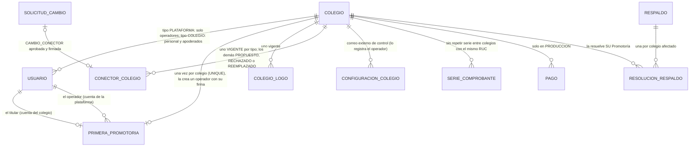

# Sprint 8 · Lista para vender: diseño de arquitectura

> Diseño del agente `arquitecto-software`, 10 de octubre de 2026. Rama `claude/sprint-8-lista-para-vender`, que parte de `main` con la versión 1 completa: sprints 0 a 7, última migración V27, 75 triggers y 7 funciones con huella (82 huellas), 2226 pruebas (120 de MySQL real). **No modifiqué código, scripts ni otros documentos:** solo escribí este archivo y agregué la fase 2 a `docs/plan-de-desarrollo.md`.
> Paquete base `pe.edu.virgenmaria.cuentasclaras`. El stack no cambia. **Dependencias nuevas de la aplicación: ninguna.** El cifrado de los secretos usa `javax.crypto` (AES-GCM) del JDK y el logo se valida con `javax.imageio`. Herramientas nuevas fuera del jar: Caddy (TLS en el servidor), `gcloud` (despliegue) y gitleaks (CI).
>
> **Cómo se verificó (y qué NO se verificó)**
> - **Leído:** `CLAUDE.md`, la skill `contexto-colegio`, `plan-de-desarrollo.md`, `estado-del-proyecto.md`, `sprint-7-endurecimiento.md`, `sprint-7-correcciones.md`, `reports/Mercado de colegios privados y redes.md`, `docs/operacion/mysql-usuarios.md` y `custodia-clave-auditoria.md` (partes), `scripts/mysql/01`, `02` (partes) y `03` (lista de triggers, `trg_usuario_rol_alta` y `trg_enlace_activacion_nace`), V1, V2, V3, V5, V9, V13, V17, V21, V23 y V27 (partes), `application*.yaml`, `Dockerfile` y las clases de «Archivos leídos».
> - **NO probado:** V28, V29, V30, los GRANT, los 7 triggers nuevos, las 7 versiones nuevas (8 si `trg_enlace_activacion_nace` necesita la suya) y las 2 funciones nuevas **no se ejecutaron** en H2 ni en MySQL 8. Ningún comando de `gcloud` de este documento se ejecutó. El primer paso de cada tanda es aplicarlos sobre V1–V27 reales en las dos bases (hallazgo 1 del sprint 3).
> - **MySQL administrado (lo más crítico):** se verificó **en la documentación oficial** que Cloud SQL para MySQL admite la marca `log_bin_trust_function_creators` (sin reinicio) y que el rol de su administrador (`cloudsqlsuperuser`) tiene todos los privilegios estáticos salvo SUPER y FILE, más `ROLE_ADMIN`. **No se probó en una instancia real.** El paso 0 del sprint (sección 6.6) corre el job `mysql` completo contra Cloud SQL antes de escribir código.
> - **Precios:** salen de agregadores de terceros (no de la calculadora oficial) y son aproximados. Se confirman con la calculadora de Google Cloud al contratar.
> - **Normativa:** las plantillas legales (sección 13) son un esquema para un abogado, no un texto revisado.

## 1. Resumen
- **Una instalación, varios colegios.** El código ya filtra todo por `colegio_id` desde el sprint 1; lo que falta es operarlo. Se agrega un **colegio de plataforma** donde viven los **operadores** (rol `OPERADOR_PLATAFORMA`, sin colegio cliente y sin acceso a ninguna pantalla de un colegio). El operador da de alta un colegio con sus datos básicos y su **primera Promotoría**, una sola vez por colegio, con un enlace de activación al titular. Después de eso ya no puede entrar a ese colegio.
- **El colegio nace «en preparación» y no puede cobrar** (lo exige la base). Su Promotoría y su Administración completan un **asistente de puesta en marcha** con una lista de verificación: equipo con segregación, año y secciones, pensiones, alumnos, saldo inicial y **conectores por colegio** (OSE, pasarela, cuenta bancaria y recaudación). Los secretos se guardan cifrados y **cambiar adónde entra el dinero exige la aprobación firmada de otra persona**. La Promotoría lo pasa a «en producción» con su firma.
- **Marca del producto en un solo parámetro** (`CC_MARCA_NOMBRE`), y **marca del colegio** (nombre, razón social, RUC, dirección y logo) en su portal, sus boletas, sus mensajes y su aviso de privacidad.
- **Demo aparte** (`demo.<dominio>`), con H2 en memoria y sin salida a internet, que se reinicia cada noche. Cada visitante crea su propio colegio ficticio. **Despliegue en Google Cloud, región Santiago:** una VM con la aplicación detrás de Caddy y Cloud SQL para MySQL 8.4, por unos **US$ 65-75 al mes por instalación**. La **suscripción se cobra fuera del sistema** al inicio.
- **Tres tandas:** (1) plataforma, alta y marca (V28, 80 triggers); (2) puesta en marcha y conectores (V29, 82 triggers); (3) demo, respaldos de la instalación compartida, despliegue y documentos (V30, 82 triggers).

## 2. Hallazgos al leer el código (leer antes de implementar)
1. **H1 (alto). La bitácora tiene una sola cadena y una sola clave HMAC para toda la base.** `auditoria_cadena` tiene una fila (`ck_auditoria_cadena_unica`), la clave la custodia «Promotoría (dueña del colegio)» (`custodia-clave-auditoria.md`) y desde el sprint 7 también deriva las semillas del muestreo. En una instalación con varios colegios, la Promotoría de uno tendría la clave de todos (sección 3.8).
2. **H2 (alto). El respaldo se cifra para la Promotoría (decisión 90) y contiene toda la base.** En una instalación compartida, la Promotoría de un colegio podría descifrar los datos de las familias de los otros (sección 3.8).
3. **H3. «Faltan filas» se resuelve una vez para toda la base.** Es el residual «la resolución es de toda la base» del sprint 7: con varios colegios, la Promotoría de cualquiera resolvería la falta de otro.
4. **H4 (alto). Los conectores son de la instancia, no del colegio.** Están en `application.yaml` y en el entorno: `NUBEFACT_RUTA` y `NUBEFACT_TOKEN` (una cuenta del OSE es de UN RUC), las llaves de la pasarela, `caja.cuentas-deposito`, `recaudacion.*`, `conciliacion.patron-abono-recaudacion` y las series `comprobantes.serie-*`. Hoy, un colegio por instancia.
5. **H5. El nombre del colegio está fijo en el código:**
   - 16 de las plantillas de `PlantillaMensaje` dicen «Colegio Virgen María»;
   - `ServicioPagoEnLinea` manda «Pago Colegio Virgen María · …» a la pasarela;
   - `privacidad/aviso.html` nombra al Colegio Virgen María como responsable.
6. **H6. La marca «Cuentas Claras» no es un parámetro.** Está en `ColegioService.NOMBRE_PLATAFORMA`, en 8 plantillas de `PlantillaMensaje`, en los asuntos de `AlertasTecnicas` y en 3 plantillas Thymeleaf (11 veces: título, cabecera, pie e ingreso).
7. **H7. El alta de un colegio solo existe por migración y por variables de entorno.** V1 inserta «Colegio Virgen María» en TODA instalación nueva. `InicializadorPromotor` crea el primer PROMOTOR con la clave en el entorno y solo si no hay ningún usuario, así que no sirve para el segundo colegio. En la base, la excepción del primer PROMOTOR es «colegio sin Promotoría activa», sin la marca de una sola vez que V27 sí puso a la primera Dirección.
8. **H8. `colegio` tiene solo `nombre`, `ruc` (sin validar), `activo` y `creado_en`.** No tiene estado, razón social, dirección ni logo. La boleta (`caja/comprobante.html`) no muestra el RUC ni la dirección del emisor.
9. **H9. Las series de comprobante son de la instancia y nada impide que dos sedes con el mismo RUC usen la misma serie.** `serie_comprobante` es única por `(colegio_id, serie)`. Dos «colegios» que son sedes del mismo RUC emitirían B001-00000001 dos veces ante SUNAT.
10. **H10. El correo externo de control (`configuracion_colegio`) solo lo escribe el DBA.** Para cada colegio nuevo habría que tocar la base a mano.
11. **H11. Los procesos recorren «todos los colegios activos»** (`PasadaPorColegios`, `RecorridoColegios.activos()`). Un colegio de plataforma o uno en preparación recibiría recordatorios, huellas y resúmenes.
12. **H12. La demo de hoy no sirve para mostrarla en internet:**
    - los usuarios son fijos, con sesión única (decisión 3), así que dos visitantes con `caja` se cierran la sesión;
    - usa el nombre real del colegio (V1);
    - la importación acepta cualquier Excel, y un prospecto podría subir datos reales de sus alumnos.
13. **H13. `docs/operacion/mysql-usuarios.md` activa la marca con `SET PERSIST log_bin_trust_function_creators = 1`.** Eso exige SUPER, que ningún MySQL administrado da. En Cloud SQL y en RDS la marca se pone en la configuración de la instancia. Además, **un usuario creado desde la consola de Cloud SQL recibe `cloudsqlsuperuser`**: `cc_app`, `cc_sistema` y `cc_respaldo` se crean con `01` por SQL. Si se crean desde la consola, el verificador no deja arrancar, porque ve un rol de más (S7-M1): falla cerrado.
14. **H14. Con Cloud SQL Auth Proxy, la sesión de MySQL probablemente no muestra `Ssl_cipher`.** El túnel cifra la conexión, pero el protocolo de MySQL entre la aplicación y el proxy va sin TLS, así que el verificador de prod (H11 del sprint 7) no arrancaría. Se usa **IP privada con TLS directo** (`sslMode=VERIFY_CA`). Se confirma en el paso 0.

## 3. Decisiones de diseño

### 3.1 Instalación compartida o dedicada (un solo jar)
| | **Compartida** (por defecto para los colegios nuevos) | **Dedicada** |
|---|---|---|
| Qué es | Una aplicación y una base para varios colegios, filtrada por `colegio_id` | Una aplicación y una base para un colegio |
| Costo de infraestructura | ~US$ 65-75 al mes en total (sección 7.5) | ~US$ 65-75 al mes por colegio |
| Custodia de la clave HMAC y del respaldo | La plataforma (2 custodios) | La Promotoría y el responsable técnico (sprint 7, sin cambios) |
| «Faltan filas» | Por colegio, cada Promotoría el suyo | Como hoy |
| Conectores | Solo los del colegio (`conector_colegio`) | Los del colegio; si no tiene, los del entorno (como hoy) |
| Cuándo | Todo colegio nuevo | Colegio Virgen María (decisión 109) o un colegio que la pague |

- **Propiedad `cuentasclaras.plataforma.instalacion: COMPARTIDA | DEDICADA`** (`CC_INSTALACION`). `VerificadorConfiguracion` rechaza en una instalación COMPARTIDA:
  - los secretos de conectores en el entorno (`NUBEFACT_TOKEN`, `PASARELA_LLAVE_SECRETA`, etc.);
  - que falte `CC_CLAVE_CONECTORES` o `CC_OPERADORES`.
  En una DEDICADA, el alta de un segundo colegio se rechaza.
- **¿Por qué no una base por colegio en el mismo servidor MySQL?** Los nombres `cc_app`, `cc_sistema` y `cc_respaldo` son FIJOS (los triggers los reconocen con `SESSION_USER()`) y el esquema se llama `cuentasclaras` en `02` y `03`. Varias bases en un servidor exigirían usuarios por colegio y cambiar las huellas. No compensa en el MVP.
- **Capacidad de una instalación compartida:** sigue siendo **una sola instancia** (sesiones, latidos y límites en memoria). Tope por defecto de **25 colegios o 8,000 alumnos** (decisión 138): pasado eso, otra instalación con el mismo procedimiento.

### 3.2 El colegio de plataforma y el operador
- **V28 agrega `colegio.tipo` (`COLEGIO` o `PLATAFORMA`) e inserta UNA fila `PLATAFORMA`.** Los operadores son usuarios de ese colegio con el rol `OPERADOR_PLATAFORMA`. Así reusan sin cambios todo lo del sprint 7:
  - ingreso, BCrypt y límite por conexión;
  - sesión única, `sesion_usuario`, firma de sesión y bitácora.
  Las FK `(usuario_id, colegio_id)` de `sesion_usuario` y `firma_operacion` siguen valiendo.
- **El operador no ve datos de los colegios, por cuatro capas:**
  1. **Hibernate:** su `ContextoColegio.actual()` es el id del colegio de plataforma. Toda entidad con `@TenantId` le devuelve vacío, como pasa hoy con `NINGUNO`.
  2. **`ModuloApp`:** el rol solo tiene `/plataforma/**`, `/cuenta/**` y `/salir`. Toda otra ruta, 403.
  3. **ArchUnit:** `plataforma` no depende de `alumnos`, `familias`, `caja`, `cobranza`, `comprobantes`, `conciliacion`, `recaudacion`, `matricula`, `panel`, `privacidad` ni `comunicacion`. Solo depende de `colegio.model.Colegio`, del puerto `seguridad.service.identidad.AltaTitular`, de `puestaenmarcha.dto` y de `auditoria` y `comun`.
  4. **Lo que muestra la lista de verificación:** sí/no y conteos (por ejemplo, «Alumnos: 312»), nunca nombres, documentos, contactos ni montos.
- **Quién es operador: la lista `CC_OPERADORES`** (`usuario:correo`, separados por comas) del despliegue (decisión 112). `plataforma.inicial.InicializadorOperadores` (prod, piloto y demo) corre al arrancar, como `sistema.plataforma` y por la ruta de identidad:
  - crea al operador que falta y le envía al correo un enlace de activación de un solo uso (sin clave en el entorno);
  - desactiva al que ya no está en la lista y cierra sus sesiones.
  Agregar o quitar un operador exige un despliegue: queda en el historial de la infraestructura y en la bitácora (`OPERADOR_CREADO` y `OPERADOR_DESACTIVADO`).
- **En la base:** el rol `OPERADOR_PLATAFORMA` existe solo en el colegio de plataforma, solo, sin otros roles. El colegio de plataforma solo tiene operadores, nunca APODERADO ni roles de colegio (`trg_usuario_rol_alta`, versión nueva).
- **`InicializadorPromotor` se elimina** (y sus variables `CC_PROMOTOR_*` y `CC_COLEGIO_ID`). Toda instalación, también la dedicada, da de alta su colegio por el mismo flujo.

### 3.3 Alta de un colegio (`plataforma.service.AltaColegio`)
**Datos que pide el operador** (los saca del contrato firmado; decisión 137):
- nombre comercial, razón social, RUC (11 dígitos, empieza con 10 o 20 y dígito verificador módulo 11), dirección fiscal y correo institucional;
- niveles que ofrece (Inicial, Primaria y Secundaria, al menos uno) y año escolar inicial (año e inicio y fin de clases);
- logo (opcional);
- código del contrato;
- titular: nombre, DNI y celular o correo.

**Cuatro transacciones, en este orden.** `ContextoColegio.en` no se puede cambiar con una transacción abierta (Hibernate fija el colegio de la sesión) y `EjecucionIdentidad` exige no tener una abierta, así que no caben en una sola:

| # | Ruta y colegio | Qué hace | Si falla |
|---|---|---|---|
| 1 | `cc_sistema`, sin `@TenantId` | INSERT del `colegio` (PREPARACION, `creado_por` = el operador) y evento `COLEGIO_CREADO` en la bitácora del colegio de plataforma | No se creó nada |
| 2 | `cc_sistema`, colegio de plataforma | `FirmaSesion.firmar("primera_promotoria:{colegio}")` con la sesión del operador | El colegio queda «sin titular»; el operador reintenta con «Completar alta» |
| 3 | `cc_sistema` (identidad), colegio nuevo | Por el puerto `AltaTitular` (en `seguridad.service.identidad`): la cuenta del titular, `primera_promotoria`, el rol PROMOTOR, el mensaje `ACTIVACION_CUENTA` y su enlace (48 h), y el evento `PRIMERA_PROMOTORIA_CREADA` **en la bitácora del colegio nuevo**, con el nombre del operador | Igual que la 2 (la firma vale 5 minutos; se firma de nuevo) |
| 4 | `cc_sistema` (`EjecucionPlataforma`), colegio nuevo | El año escolar inicial, el logo y el evento `COLEGIO_CREADO` en la bitácora del colegio nuevo | La lista de verificación los muestra pendientes; el operador reintenta o los completa la Promotoría |

- **Después de la transacción 3, el operador ya no puede crear cuentas en ese colegio.** `trg_usuario_nace` solo le permite la primera cuenta de un colegio en preparación sin cuentas. `primera_promotoria` es única por colegio. La Promotoría ve en su bitácora quién creó su colegio y su cuenta.
- **Reenviar el enlace** (por ejemplo, si el celular tenía un error de tipeo) solo se puede mientras la cuenta no esté activada. Aviso al contacto anterior, evento resaltado `TITULAR_CONTACTO_CORREGIDO` y un correo al correo institucional del colegio.
- **Activación:** el titular abre el enlace, escribe **su DNI** (el del contrato) y elige su clave. Se recomienda hacerlo en la reunión de puesta en marcha, en persona o por videollamada (decisión 114). Al activar, ve «Tu colegio y tu cuenta los creó el operador X el …».
- **Lo que el operador puede seguir haciendo en un colegio en preparación:**
  - corregir la ficha (no el estado);
  - registrar el **correo externo de control** (sección 3.5);
  - ver la lista de verificación.
  En un colegio en producción, solo ve la ficha y la lista. La base lo exige (`trg_colegio_cambio`).

### 3.4 Estados del colegio y bloqueo de cobros
- **`PREPARACION` → `PRODUCCION`, sin vuelta atrás** (decisión 116). La baja queda fuera del sistema en este sprint (decisión 132).
- **En PREPARACION no hay dinero ni avisos de cobro:**
  - `trg_pago_registro` exige `cc_colegio_en_produccion(colegio)`. Sin pago no hay comprobante ni aviso de pago;
  - `trg_mensaje_nace` rechaza `RECORDATORIO_VENCIMIENTO`, `CUOTA_VENCIDA` y `RENOVACION_MATRICULA`;
  - los procesos (`RecorridoColegios`, `PasadaPorColegios`) recorren solo `tipo = 'COLEGIO'`. Los recordatorios, la muestra de caja, la llamada de control y el resumen diario, solo en PRODUCCION. La huella diaria corre también en preparación.
  - **Sí se permite:** crear cuentas, el año escolar, secciones, alumnos (Excel), planes de pensión, saldo inicial, matrículas y cronogramas, conectores y la activación del portal de las familias.
- **Pasar a PRODUCCION** (`POST /puesta-en-marcha/produccion`, solo PROMOTOR):
  - con la lista obligatoria completa (sección 3.5), que comprueba la aplicación;
  - con la firma de la sesión (`colegio:{id}:PRODUCCION`).
  La base exige: quien la pasa es una Promotoría activa de ese colegio con su firma, y hay al menos una Dirección y una Caja activas (`trg_colegio_cambio`). Evento resaltado `COLEGIO_EN_PRODUCCION` y mensaje a toda la Promotoría y al correo externo de control.
- **V28 deja en PRODUCCION a los colegios que ya existen y tienen cuentas.** A los que no tienen cuentas (por ejemplo, la fila de V1 en una instalación nueva), los deja en PREPARACION: el operador los completa con el alta o los deja como están (nunca se borran).

### 3.5 Puesta en marcha: asistente y lista de verificación
`puestaenmarcha.service.EstadoPuestaEnMarcha.de(colegioId)` calcula cada punto desde los datos (nada se marca a mano, salvo los dos «aceptos» firmados). La pantalla `/puesta-en-marcha` (Promotoría, Dirección y Administración) muestra los pasos con su enlace a la pantalla que ya existe.

| # | Paso | Hecho cuando | Quién | Obligatorio |
|---|---|---|---|---|
| 1 | Datos y logo del colegio | Razón social, RUC, dirección y correo institucional completos | Operador en el alta; después, Promotoría | Sí (el logo no) |
| 2 | Equipo con segregación | Una Dirección activa y al menos una Caja activa, personas distintas de la Promotoría | Promotoría (la primera Dirección, con la excepción de V27) | Sí |
| 3 | Año escolar y secciones | Año vigente con al menos una sección por nivel ofrecido | Administración o Dirección | Sí |
| 4 | Pensiones | Un plan APROBADO para cada nivel ofrecido | Administración y otra persona | Sí |
| 5 | Alumnos | Al menos un alumno matriculado en el año vigente (Excel, ya existe) | Administración | Sí |
| 6 | Saldo inicial | Lote CONFIRMADO, o «el colegio empieza sin deudas anteriores» firmado por Promotoría (`colegio:{id}:SIN_SALDO_INICIAL`) | Administración y Promotoría | Sí |
| 7 | Comprobantes (OSE) | Conector OSE VIGENTE en modo REAL y probado, o «uso el comprobante simulado y emito mi comprobante legal aparte» firmado por Promotoría (`colegio:{id}:OSE_SIMULADO`) | Administración propone, otra persona aprueba | Sí |
| 8 | Cuenta bancaria | Conector `CUENTA_BANCARIA` VIGENTE (banco, número y CCI; adonde se deposita el efectivo y de donde sale el extracto) | Promotoría y otra persona | Sí |
| 9 | WhatsApp y correo | Canal de la plataforma activo (plantillas aprobadas) y un mensaje de prueba entregado a la Promotoría | Automático | Sí |
| 10 | Correo externo de control | `configuracion_colegio.huella_correo_externo` registrado (el contador o un tercero de confianza del contrato) | Operador | Sí |
| 11 | Aviso de privacidad del colegio | Dirección aprobó la versión vigente (`colegio.aviso_privacidad_version`) | Dirección | Sí |
| 12 | Respaldo | Último respaldo de la instalación verificado hace menos de 26 h | Automático | Sí |
| 13 | Pago en línea | Conector `PASARELA` VIGENTE | Promotoría y otra persona | No |
| 14 | Recaudación bancaria | Conector `RECAUDACION` VIGENTE (banco, formato, modalidad y glosa del abono) | Promotoría y otra persona | No |

- El operador ve esta misma lista como sí/no en `/plataforma/colegios/{id}`, sin enlaces a las pantallas del colegio.
- La lista se vuelve a calcular al entrar: un punto puede volver a «pendiente» (por ejemplo, si se desactiva la única Caja). En PRODUCCION se sigue mostrando como «Salud de la configuración».

### 3.6 Conectores por colegio (`conectores`, nuevo)
- **Tabla `conector_colegio`** (V29), de cambios por versión: cada cambio es una fila nueva PROPUESTO. La vigente pasa a REEMPLAZADO y la nueva a VIGENTE en la misma transacción. Nada se borra.

| Tipo | Proveedores | Configuración (sin secretos) | Secreto (cifrado) |
|---|---|---|---|
| `OSE` | `SIMULADO`, `NUBEFACT` | Ruta de la API, RUC emisor, series (boleta, factura y sus notas), afectación del IGV | Token |
| `PASARELA` | `SIMULADO` (solo con la fila del DBA, como en el piloto), `CULQI`, `NIUBIZ`, `IZIPAY` (los reales, cuando exista su adaptador: decisión 22) | Llave pública, medios aceptados, monto máximo | Llave secreta y secreto del webhook |
| `CUENTA_BANCARIA` | `BCP`, `BBVA`, `INTERBANK`, `SCOTIABANK`, `OTRO` | Banco, número de cuenta, CCI y moneda (PEN). Reemplaza a `caja.cuentas-deposito` | — |
| `RECAUDACION` | `GENERICO` (más los adaptadores de cada banco) | Formato, modalidad, glosa del abono (`patron-abono-recaudacion`) y abono por lote o por pago | — |

- **WhatsApp y correo son de la plataforma, no del colegio** (decisiones 120 y 121): un solo número de WhatsApp Business del proveedor, con el nombre del colegio en cada plantilla, y el correo con el remitente de la marca y el nombre del colegio en el «De». El número propio de cada colegio queda para después.
- **Secretos** (`conectores.cripto.SecretosConectores`):
  - AES-256-GCM con una clave maestra en el gestor de secretos (`CC_CLAVE_CONECTORES`, 32 bytes en base64) y un nonce aleatorio de 12 bytes por secreto;
  - el AAD es `conector|{colegio}|{tipo}|{clave_publica}`: un secreto copiado a la fila de otro colegio no se descifra;
  - en la base solo quedan `secreto_cifrado`, `clave_version` y `secreto_pista` (los 4 últimos caracteres). **Nadie vuelve a ver un secreto:** el formulario lo pide entero en cada cambio;
  - la rotación de la clave maestra la hace un modo de línea de comandos (`java -jar … recifrar-conectores`) con `CC_CLAVE_CONECTORES_ANTERIOR` (decisión 118).
- **Doble control, porque cambiar un conector es cambiar adónde entra el dinero:**
  - lo **propone** una persona de Administración o Promotoría del colegio (`POST /conectores/{tipo}`), con «Probar conexión» antes de enviar;
  - eso crea la solicitud `CAMBIO_CONECTOR` (`TipoSolicitud` nuevo; `solicitud_cambio` no tiene CHECK de tipo), que **aprueba otra persona** de Promotoría o Dirección en la bandeja de siempre, con la firma de su sesión;
  - en `PASARELA`, `CUENTA_BANCARIA` y `RECAUDACION`, **una Promotoría debe participar** (proponer o aprobar);
  - al entrar en vigencia: mensaje a **toda la Promotoría** y al correo externo de control («Cambió la cuenta donde entra el dinero del colegio: … termina en 1234. Aprobó: …») y alerta CRÍTICA en el panel durante 7 días;
  - la base lo exige: `trg_conector_colegio_estado` (sección 6.3).
- **Por qué alcanza:** si alguien desvía la pasarela o el banco a una cuenta propia con colusión, la **conciliación del sprint 4** muestra en rojo, el día hábil siguiente, cada pago en línea cuya liquidación no llega al extracto de la cuenta del colegio. La cuenta del extracto es la de `CUENTA_BANCARIA`, y cambiarla también avisa a todos.
- **Webhooks por colegio:** `/webhooks/pasarela/{clave_publica}`, donde `clave_publica` es un UUID opaco del conector, no el id del colegio. La firma se valida con el secreto de ESE conector. Si un aviso del colegio A llega firmado con el secreto de B, responde 401.
- **Código:**
  - `ConectoresColegio` (`ose(colegioId)`, `pasarela(colegioId)`, `cuentaBancaria(colegioId)`, `recaudacion(colegioId)`) devuelve el adaptador configurado con el conector vigente y lo guarda en caché por `(id, version)`;
  - los adaptadores de hoy (`Nubefact…`, pasarela simulada, lector genérico) dejan de leer `Propiedades*` y reciben su configuración;
  - en una instalación DEDICADA sin conector vigente, se usan las propiedades del entorno (como hoy); en una COMPARTIDA, no hay respaldo del entorno: sin conector, SIMULADO (OSE) o ninguno (pasarela).
- **`VerificadorSeries` pasa a ser por colegio:** al aprobar un OSE REAL, sus series no pueden haberse usado con SIMULADO en ese colegio (la FK `(serie, proveedor)` de V13 ya lo refuerza). Además, **dos colegios con el mismo RUC no comparten serie**: lo exige `trg_serie_comprobante_nace` (H9, decisión 124).

### 3.7 Marca del producto y del colegio
- **El nombre comercial está en UN parámetro:** `cuentasclaras.marca.nombre` (`CC_MARCA_NOMBRE`; en prod es obligatorio y el verificador no arranca sin él). `comun.marca.Marca` lo expone a:
  - Thymeleaf (`${marca.nombre}`, con un `@ControllerAdvice`): título, cabecera, pie e ingreso;
  - los asuntos y el pie de los correos (también los de `AlertasTecnicas`);
  - las plantillas de mensajes.
  Los datos de la empresa proveedora (razón social, RUC y soporte) son propiedades aparte (`cuentasclaras.marca.*`), porque van en el contrato y en el aviso.
- **Las plantillas de WhatsApp no llevan la marca ni el colegio fijos.** Todas empiezan con `{{1}}` = el nombre del colegio. La marca va en el **nombre visible del número de WhatsApp Business**, que aprueba Meta. Cambiar la marca = cambiar `CC_MARCA_NOMBRE`, el nombre visible y el dominio, sin volver a aprobar las plantillas. Las plantillas cambian de nombre (`cc_pago_registrado_v2`, …) y se aprueban una vez. Conviene hacerlo antes de enviarlas a Meta, porque la verificación de WhatsApp sigue en trámite (D5).
- **Lo que NO cambia** (decisión 122): el paquete Java, el artefacto `cuentas-claras`, la base `cuentasclaras`, los usuarios `cc_*`, la cookie `__Host-CCSESION` y los mensajes de los triggers. Son identificadores internos: el usuario no los ve y cambiarlos rompe las huellas y los scripts.
- **Prueba `MarcaUnicaTest`:** recorre las plantillas, `messages.properties` y las cadenas del código. Falla si aparece «Cuentas Claras» fuera del valor por defecto de `Marca`, o un nombre de colegio fijo («Virgen María»).
- **Marca del colegio** (decisión 123): nombre, razón social, RUC, dirección y logo, sin colores propios (protege el contraste AA del sistema de diseño). Dónde se ve:
  - **portal y cabecera** después de ingresar (como hoy, ahora con el logo);
  - **boleta**: logo, razón social, RUC y dirección del emisor (H8). En la instalación demo, la marca de agua «DEMO · SIN VALOR»;
  - **mensajes**: el nombre en `{{1}}`;
  - **pasarela**: «Pago {colegio} · {referencia}»;
  - **aviso de privacidad del colegio**: lo muestra la activación del portal y `/portal/privacidad`, con los datos del colegio como responsable y el proveedor como encargado.
  El ingreso (`/login`) es uno para todos y lleva la marca del producto: no se publica qué colegios son clientes (decisión 125).
- **Logo** (`colegio_logo`, V28):
  - se aceptan PNG o JPEG de hasta 1 MB (por los bytes mágicos, no por la extensión);
  - se decodifica con `ImageIO`, con un tope de 4000 × 4000 px antes de decodificar (se leen las dimensiones de la cabecera);
  - **se vuelve a codificar como PNG**, reescalado a 400 px como máximo: se pierden los metadatos y cualquier contenido políglota;
  - se guarda en la base (≤ 200 KB) con su SHA-256. SVG no se acepta.
  - Se sirve en `GET /marca/logo` (el colegio sale de la sesión: sin id, sin IDOR) con `Content-Type: image/png`, `X-Content-Type-Options: nosniff`, `Content-Security-Policy: default-src 'none'` y `Cache-Control: private, max-age=86400`.

### 3.8 Respaldos, bitácora y custodia en una instalación compartida (H1, H2 y H3)
- **Respaldo** (decisión 129): en una instalación COMPARTIDA, `RESPALDO_AGE_DESTINATARIOS` son **2 custodios de la plataforma** (el responsable técnico y un segundo custodio del proveedor), nunca la Promotoría de un colegio. `/panel/sistema` muestra «Custodios del respaldo: la plataforma».
- **Clave HMAC** (decisión 130): la custodian los mismos 2 de la plataforma. Cada colegio conserva su control independiente:
  - la **huella diaria** por WhatsApp (sin cambios; el número de evento es el de la instalación, decisión 130);
  - una **verificación trimestral por videollamada:** la Promotoría elige 3 huellas de su historial de WhatsApp, el operador las busca en una copia restaurada y verificada, y deben coincidir. El acta queda en `docs/operacion/` (plantilla en la tanda 3).
  - **Alternativa evaluada y diferida:** una cadena y una clave derivada por colegio, `HMAC(maestra, colegio)`, que la Promotoría podría custodiar. Cambia el corazón de la bitácora (V3, el sellador, los anclas del respaldo y `trg_respaldo_registro`); se evalúa con más de 10 colegios.
- **«Faltan filas» por colegio** (V30, decisión 131):
  - `respaldar.sh` cuenta las tablas de solo inserción **por colegio** (`GROUP BY colegio_id`; las que no tienen `colegio_id`, como hoy);
  - el registro guarda `colegios_faltan` (arreglo JSON);
  - la alerta le llega a la Promotoría **de cada colegio afectado**, y cada una resuelve la suya (`resolucion_respaldo`, única por respaldo y colegio);
  - `trg_respaldo_registro` exige una resolución de cada colegio afectado antes de aceptar un registro `IGUAL`.
  En una DEDICADA queda igual que en el sprint 7.
- **«Verificar integridad»** en una COMPARTIDA: si la cadena falla en un evento de otro colegio, la Promotoría ve «la bitácora de la instalación no verifica; el operador ya fue avisado», sin datos de ese evento.

### 3.9 Entorno de demostración (perfil `demo`)
Se detalla en la sección 8. En resumen:
- es una **instalación aparte** (`demo.<dominio>`, otra VM), con H2 en memoria y **sin salida a internet** (red interna de Docker);
- se reinicia todos los días a las 03:00 (se borra todo);
- cada visitante pulsa «Crear mi demo» y recibe **su propio colegio ficticio**, con datos de ejemplo y un usuario por rol (prefijo aleatorio y clave aleatoria que ve una vez). Así no se cruzan dos prospectos ni se cierran la sesión;
- franja «DEMO» en todas las páginas;
- no arranca con un proveedor real ni con un secreto real;
- la importación acepta solo los archivos de ejemplo.

### 3.10 Suscripción del colegio a la plataforma (decisión 128)
**Fuera del sistema al inicio.** Contrato firmado (sección 13), factura electrónica mensual emitida por el proveedor con su propio sistema autorizado y pago por transferencia. Seguimiento en una hoja de cálculo hasta tener unos 20 colegios. Por qué:
- con pocos clientes, el cobro automático (tarjeta recurrente, mora, suspensión) cuesta más de lo que ahorra;
- **cobrar al colegio no es un vector de fraude** contra el colegio;
- **no se mezclan** el dinero de las familias (del colegio) y el del proveedor.

Regla del contrato: el proveedor **nunca suspende los avisos de pago a las familias ni su acceso a sus comprobantes** por una deuda del colegio con el proveedor sin 30 días de aviso. En el sistema solo se guarda `colegio.contrato_codigo`, para enlazar la ficha con el contrato.

### 3.11 Despliegue (decisión D3 del plan)
Se detalla en la sección 7. **Recomendación: Google Cloud en `southamerica-west1` (Santiago de Chile).**
- La aplicación corre en una **VM e2-small** con Docker Compose (la aplicación y Caddy para TLS automático).
- La base es **Cloud SQL para MySQL 8.4 Enterprise, `db-g1-small`, zonal**, con IP privada y TLS obligatorio, respaldos automáticos y recuperación a un punto en el tiempo (PITR) de 7 días.
- Los secretos van en Secret Manager y la imagen se construye en el CI y se publica en GHCR por SHA.
- Por qué: Santiago es la región de nube grande más cercana a Lima, y la marca `log_bin_trust_function_creators`, que necesitan los 75 triggers, está documentada como compatible y sin reinicio.
- Alternativa: AWS en São Paulo (RDS para MySQL, que también la admite por grupo de parámetros).

## 4. Modelo


**Invariantes.** «(base)» = CHECK, UNIQUE o FK; «(MySQL)» = trigger; «(1142/1143)» = sin GRANT.

- **`colegio`** (tanda 1):
  - `tipo` es COLEGIO o PLATAFORMA, y hay una sola fila PLATAFORMA (base y MySQL);
  - `estado` es PREPARACION o PRODUCCION; la PLATAFORMA está siempre en PRODUCCION (base);
  - el RUC tiene 11 dígitos y empieza con 10 o 20 (base); el dígito verificador lo valida la aplicación;
  - con `cc_app` no se crea un colegio (1142 y MySQL); con `cc_sistema`, solo un operador activo, en PREPARACION (MySQL);
  - PREPARACION → PRODUCCION solo por una Promotoría activa de ese colegio con su firma, con al menos una Dirección y una Caja activas; nunca vuelve atrás (MySQL);
  - en PRODUCCION, el RUC no cambia y el operador (`cc_sistema`) no cambia la ficha (MySQL);
  - `id`, `tipo`, `creado_por` y `creado_en` no cambian (MySQL); nunca se borra (sin DELETE).
- **`primera_promotoria`** (tanda 1):
  - una por colegio (base); de solo inserción, solo `cc_sistema` (1142);
  - la crea un operador activo con su firma (`primera_promotoria:{colegio}`, 5 minutos), en un colegio COLEGIO en PREPARACION cuya única cuenta es la del titular (MySQL).
- **`usuario` y `usuario_rol`** (versiones nuevas, tanda 1):
  - en el colegio de plataforma solo hay cuentas creadas por `sistema.plataforma`, con el rol OPERADOR_PLATAFORMA y ningún otro; ese rol no existe fuera de él (MySQL);
  - un operador solo crea la primera cuenta de un colegio en PREPARACION (MySQL);
  - **el primer PROMOTOR de un colegio exige su fila de `primera_promotoria`**, de esa cuenta, escrita hace 5 minutos o menos. Reemplaza la excepción «sin Promotoría activa» (MySQL).
- **`colegio_logo`** (tanda 1): uno vigente por colegio (base, `UNIQUE (colegio_id, vigente)` con `vigente` TRUE o NULL); PNG de 200 KB y 400 px como máximo (base); el contenido no cambia (1143).
- **`configuracion_colegio`** (versión nueva, tanda 1): con `cc_app`, nada (1142); con `cc_sistema`, solo un operador activo con su firma (`configuracion_colegio:{colegio}:{clave}:{version}`) (MySQL). El cambio avisa a la Promotoría y al correo anterior (aplicación).
- **`serie_comprobante`** (versión nueva, tanda 1): dos colegios con el mismo RUC no usan la misma serie (MySQL).
- **`pago`** (versión nueva, tanda 1): solo en un colegio en PRODUCCION (MySQL). **`mensaje`**: sin recordatorios ni renovaciones en PREPARACION (MySQL).
- **`conector_colegio`** (tanda 2):
  - un VIGENTE por colegio y tipo (base);
  - nace PROPUESTO, propuesto por una persona activa de Promotoría o Administración de ese colegio (MySQL);
  - tipo, proveedor, modo, configuración, secreto y propuesto_por no cambian (1143);
  - PROPUESTO → VIGENTE solo con SU `CAMBIO_CONECTOR` aprobada y firmada (`cc_solicitud_firmada`), por otra persona activa de Promotoría o Dirección, con la prueba de conexión correcta y, en PASARELA, CUENTA_BANCARIA y RECAUDACION, con una Promotoría entre quien propone y quien aprueba (MySQL);
  - VIGENTE → REEMPLAZADO solo si otro del mismo tipo entra en vigencia en ese momento (MySQL); PROPUESTO → RECHAZADO con la firma de quien rechaza (MySQL); nada más cambia de estado (MySQL).
- **`respaldo` y `resolucion_respaldo`** (versiones nuevas, tanda 3): una resolución por respaldo y colegio (base); un registro `IGUAL` exige una resolución de cada colegio de `colegios_faltan` de los respaldos anteriores sin resolver (MySQL); quien resuelve es Promotoría de ESE colegio (MySQL, como hoy).

## 5. Migraciones Flyway (NO probadas: aplicar sobre V1–V27 en H2 2.4.240 MODE=MySQL y en MySQL 8.4 antes de seguir)

### `V28__plataforma_alta_y_marca.sql` (tanda 1)
```sql
-- Sprint 8 · tanda 1. Colegio de plataforma (operadores), estados del colegio, ficha y marca del colegio, primera
-- Promotoría una sola vez por colegio, logo y correo externo de control registrado por el operador. Nada se borra.
ALTER TABLE colegio ADD COLUMN tipo VARCHAR(12) NOT NULL DEFAULT 'COLEGIO';
ALTER TABLE colegio ADD COLUMN plataforma_unica BOOLEAN;                 -- TRUE solo en la fila PLATAFORMA; si no, NULL
ALTER TABLE colegio ADD COLUMN estado VARCHAR(12) NOT NULL DEFAULT 'PREPARACION';
ALTER TABLE colegio ADD COLUMN razon_social VARCHAR(150);
ALTER TABLE colegio ADD COLUMN direccion VARCHAR(200);
ALTER TABLE colegio ADD COLUMN correo_institucional VARCHAR(150);
ALTER TABLE colegio ADD COLUMN niveles VARCHAR(40) NOT NULL DEFAULT 'INICIAL,PRIMARIA,SECUNDARIA';
ALTER TABLE colegio ADD COLUMN titular_nombre VARCHAR(150);
ALTER TABLE colegio ADD COLUMN titular_documento VARCHAR(12);
ALTER TABLE colegio ADD COLUMN contrato_codigo VARCHAR(30);
ALTER TABLE colegio ADD COLUMN aviso_privacidad_version VARCHAR(20);
ALTER TABLE colegio ADD COLUMN aviso_privacidad_aprobado_por VARCHAR(60);
ALTER TABLE colegio ADD COLUMN aviso_privacidad_aprobado_en DATETIME(6);
ALTER TABLE colegio ADD COLUMN produccion_desde DATETIME(6);
ALTER TABLE colegio ADD COLUMN produccion_por VARCHAR(60);
ALTER TABLE colegio ADD COLUMN creado_por VARCHAR(60) NOT NULL DEFAULT 'migracion.v1';
ALTER TABLE colegio ADD COLUMN actualizado_en DATETIME(6);
ALTER TABLE colegio ADD COLUMN version BIGINT NOT NULL DEFAULT 0;
ALTER TABLE colegio ADD CONSTRAINT ck_colegio_tipo CHECK (tipo IN ('COLEGIO', 'PLATAFORMA'));
ALTER TABLE colegio ADD CONSTRAINT ck_colegio_plataforma_unica CHECK (
    (tipo = 'PLATAFORMA' AND plataforma_unica) OR (tipo = 'COLEGIO' AND plataforma_unica IS NULL));
ALTER TABLE colegio ADD CONSTRAINT uk_colegio_plataforma UNIQUE (plataforma_unica);
ALTER TABLE colegio ADD CONSTRAINT ck_colegio_estado CHECK (estado IN ('PREPARACION', 'PRODUCCION')
    AND (tipo = 'COLEGIO' OR estado = 'PRODUCCION'));
ALTER TABLE colegio ADD CONSTRAINT ck_colegio_produccion CHECK ((estado = 'PREPARACION' AND produccion_desde IS NULL)
    OR (estado = 'PRODUCCION' AND produccion_desde IS NOT NULL AND produccion_por IS NOT NULL));
ALTER TABLE colegio ADD CONSTRAINT ck_colegio_ruc CHECK (ruc IS NULL OR REGEXP_LIKE(ruc, '^(10|20)[0-9]{9}$'));
ALTER TABLE colegio ADD CONSTRAINT ck_colegio_niveles CHECK (REGEXP_LIKE(niveles,
    '^(INICIAL|PRIMARIA|SECUNDARIA)(,(PRIMARIA|SECUNDARIA))*$'));
ALTER TABLE colegio ADD CONSTRAINT ck_colegio_titular CHECK (titular_documento IS NULL
    OR REGEXP_LIKE(titular_documento, '^[0-9]{8}$|^[A-Z0-9]{9,12}$'));

-- Los colegios que ya operan (tienen cuentas) quedan en producción; la fila de V1 en una instalación nueva, en preparación.
UPDATE colegio SET estado = 'PRODUCCION', produccion_desde = CURRENT_TIMESTAMP(6), produccion_por = 'migracion.v28'
 WHERE EXISTS (SELECT 1 FROM usuario u WHERE u.colegio_id = colegio.id);
UPDATE colegio SET actualizado_en = CURRENT_TIMESTAMP(6);
ALTER TABLE colegio MODIFY actualizado_en DATETIME(6) NOT NULL;

INSERT INTO colegio (nombre, tipo, plataforma_unica, estado, activo, creado_por, actualizado_en, produccion_desde,
    produccion_por)
VALUES ('Plataforma', 'PLATAFORMA', TRUE, 'PRODUCCION', TRUE, 'migracion.v28', CURRENT_TIMESTAMP(6),
    CURRENT_TIMESTAMP(6), 'migracion.v28');

-- Rol nuevo (V2 creó el CHECK; nadie lo recreó después).
ALTER TABLE usuario_rol DROP CONSTRAINT ck_usuario_rol_rol;
ALTER TABLE usuario_rol ADD CONSTRAINT ck_usuario_rol_rol CHECK (rol IN ('PROMOTOR', 'DIRECTOR', 'ADMINISTRACION', 'CAJA',
    'DOCENTE', 'APODERADO', 'OPERADOR_PLATAFORMA'));

-- H7. La primera Promotoría, una sola vez por colegio (patrón de primera_direccion, V27). La escribe SOLO cc_sistema.
CREATE TABLE primera_promotoria (
    id              BIGINT        NOT NULL AUTO_INCREMENT PRIMARY KEY,
    colegio_id      BIGINT        NOT NULL,
    usuario_id      BIGINT        NOT NULL,   -- el titular
    operador_id     BIGINT,                   -- NULL solo en las filas de la migración
    plataforma_id   BIGINT,
    creado_en       DATETIME(6)   NOT NULL,
    creado_por      VARCHAR(60)   NOT NULL,   -- el operador
    actualizado_en  DATETIME(6)   NOT NULL,
    version         BIGINT        NOT NULL DEFAULT 0,
    CONSTRAINT uk_primera_promotoria_colegio UNIQUE (colegio_id),
    CONSTRAINT fk_primera_promotoria_colegio FOREIGN KEY (colegio_id) REFERENCES colegio (id),
    CONSTRAINT fk_primera_promotoria_usuario FOREIGN KEY (usuario_id, colegio_id) REFERENCES usuario (id, colegio_id),
    CONSTRAINT fk_primera_promotoria_operador FOREIGN KEY (operador_id, plataforma_id) REFERENCES usuario (id, colegio_id),
    CONSTRAINT ck_primera_promotoria_origen CHECK ((operador_id IS NOT NULL AND plataforma_id IS NOT NULL)
        OR creado_por = 'migracion.v28')
);
-- Los colegios que ya tienen Promotoría ya gastaron su primera.
INSERT INTO primera_promotoria (colegio_id, usuario_id, creado_en, creado_por, actualizado_en)
SELECT u.colegio_id, MIN(u.id), CURRENT_TIMESTAMP(6), 'migracion.v28', CURRENT_TIMESTAMP(6)
  FROM usuario u JOIN usuario_rol r ON r.usuario_id = u.id
 WHERE r.rol = 'PROMOTOR'
 GROUP BY u.colegio_id;

-- Logo del colegio: PNG reescrito por la aplicación (400 px y 200 KB como máximo). Uno vigente por colegio.
CREATE TABLE colegio_logo (
    id              BIGINT        NOT NULL AUTO_INCREMENT PRIMARY KEY,
    colegio_id      BIGINT        NOT NULL,
    contenido       MEDIUMBLOB    NOT NULL,
    sha256          CHAR(64)      NOT NULL,
    bytes           INT           NOT NULL,
    ancho           INT           NOT NULL,
    alto            INT           NOT NULL,
    vigente         BOOLEAN,
    creado_en       DATETIME(6)   NOT NULL,
    creado_por      VARCHAR(60)   NOT NULL,
    actualizado_en  DATETIME(6)   NOT NULL,
    version         BIGINT        NOT NULL DEFAULT 0,
    CONSTRAINT uk_colegio_logo_vigente UNIQUE (colegio_id, vigente),
    CONSTRAINT fk_colegio_logo_colegio FOREIGN KEY (colegio_id) REFERENCES colegio (id),
    CONSTRAINT ck_colegio_logo_vigente CHECK (vigente IS NULL OR vigente),
    CONSTRAINT ck_colegio_logo_tamano CHECK (bytes > 0 AND bytes <= 204800 AND ancho BETWEEN 1 AND 400
        AND alto BETWEEN 1 AND 400),
    CONSTRAINT ck_colegio_logo_sha CHECK (REGEXP_LIKE(sha256, '^[0-9a-f]{64}$', 'c'))
);

-- H10. El correo externo de control lo registra el operador (con cc_sistema y su firma), ya no el DBA a mano.
ALTER TABLE configuracion_colegio ADD COLUMN creado_por VARCHAR(60) NOT NULL DEFAULT 'dba';
ALTER TABLE configuracion_colegio ADD COLUMN actualizado_por VARCHAR(60);
ALTER TABLE configuracion_colegio ADD COLUMN actualizado_en DATETIME(6);
ALTER TABLE configuracion_colegio ADD COLUMN version BIGINT NOT NULL DEFAULT 0;
```
> - `Colegio` pasa a tener sus columnas nuevas, con `@Version`. `ColegioRepository` sigue sin `delete*`. `tipo`, `creadoPor` y `creadoEn` son `updatable = false`.
> - **Comprobar:**
>   - que H2 2.4 acepta `MEDIUMBLOB` en modo MySQL (si no, `BLOB` en las dos con un tope de la aplicación);
>   - que `ALTER TABLE … MODIFY` funciona en H2 en modo MySQL;
>   - el nombre exacto de `ck_usuario_rol_rol`.
> - `creado_en` de `colegio` sigue siendo el `TIMESTAMP` de V1 (no se toca).

### `V29__conectores_por_colegio.sql` (tanda 2)
```sql
-- Sprint 8 · tanda 2. Conectores de cada colegio: OSE, pasarela, cuenta bancaria y recaudación. Cada cambio es una fila
-- nueva (PROPUESTO) que entra en vigencia con su CAMBIO_CONECTOR aprobada y firmada por otra persona. El secreto va
-- cifrado (AES-256-GCM) por la aplicación; la base nunca lo ve en claro. Nada se borra.
CREATE TABLE conector_colegio (
    id               BIGINT         NOT NULL AUTO_INCREMENT PRIMARY KEY,
    colegio_id       BIGINT         NOT NULL,
    tipo             VARCHAR(20)    NOT NULL,
    proveedor        VARCHAR(20)    NOT NULL,
    modo             VARCHAR(10)    NOT NULL,
    configuracion    VARCHAR(2000)  NOT NULL,   -- JSON sin secretos (lo valida la aplicación con un record por tipo)
    secreto_cifrado  VARBINARY(2048),           -- nonce (12) + texto cifrado + etiqueta (16)
    secreto_pista    VARCHAR(4),
    clave_version    INT,
    clave_publica    CHAR(36)       NOT NULL,   -- UUID opaco: ruta del webhook de la pasarela
    estado           VARCHAR(12)    NOT NULL,
    vigente          BOOLEAN,
    solicitud_id     BIGINT,
    propuesto_por    VARCHAR(60)    NOT NULL,
    resuelto_por     VARCHAR(60),
    resuelto_en      DATETIME(6),
    prueba_ok        BOOLEAN,
    prueba_en        DATETIME(6),
    prueba_detalle   VARCHAR(200),              -- sin secretos ni datos personales
    creado_en        DATETIME(6)    NOT NULL,
    creado_por       VARCHAR(60)    NOT NULL,
    actualizado_en   DATETIME(6)    NOT NULL,
    version          BIGINT         NOT NULL DEFAULT 0,
    CONSTRAINT uk_conector_colegio_id_colegio UNIQUE (id, colegio_id),
    CONSTRAINT uk_conector_colegio_vigente UNIQUE (colegio_id, tipo, vigente),
    CONSTRAINT uk_conector_colegio_clave_publica UNIQUE (clave_publica),
    CONSTRAINT fk_conector_colegio_colegio FOREIGN KEY (colegio_id) REFERENCES colegio (id),
    CONSTRAINT fk_conector_colegio_solicitud FOREIGN KEY (solicitud_id, colegio_id)
        REFERENCES solicitud_cambio (id, colegio_id),
    CONSTRAINT ck_conector_colegio_tipo CHECK (tipo IN ('OSE', 'PASARELA', 'CUENTA_BANCARIA', 'RECAUDACION')),
    CONSTRAINT ck_conector_colegio_proveedor CHECK (
        (tipo = 'OSE' AND proveedor IN ('SIMULADO', 'NUBEFACT'))
        OR (tipo = 'PASARELA' AND proveedor IN ('SIMULADO', 'CULQI', 'NIUBIZ', 'IZIPAY'))
        OR (tipo = 'CUENTA_BANCARIA' AND proveedor IN ('BCP', 'BBVA', 'INTERBANK', 'SCOTIABANK', 'OTRO'))
        OR (tipo = 'RECAUDACION' AND proveedor IN ('GENERICO', 'BCP', 'BBVA', 'INTERBANK', 'SCOTIABANK'))),
    CONSTRAINT ck_conector_colegio_modo CHECK (modo IN ('SIMULADO', 'PRUEBAS', 'REAL')
        AND ((proveedor = 'SIMULADO') = (modo = 'SIMULADO'))),
    CONSTRAINT ck_conector_colegio_estado CHECK (estado IN ('PROPUESTO', 'VIGENTE', 'RECHAZADO', 'REEMPLAZADO')
        AND ((estado = 'VIGENTE' AND vigente) OR (estado <> 'VIGENTE' AND vigente IS NULL))),
    CONSTRAINT ck_conector_colegio_secreto CHECK ((secreto_cifrado IS NULL AND secreto_pista IS NULL
        AND clave_version IS NULL) OR (secreto_cifrado IS NOT NULL AND clave_version IS NOT NULL)),
    CONSTRAINT ck_conector_colegio_resolucion CHECK ((estado = 'PROPUESTO' AND resuelto_por IS NULL)
        OR (estado = 'REEMPLAZADO') OR (estado IN ('VIGENTE', 'RECHAZADO') AND resuelto_por IS NOT NULL
            AND resuelto_en IS NOT NULL)),
    CONSTRAINT ck_conector_colegio_actor CHECK (creado_por = propuesto_por AND creado_por NOT LIKE 'sistema%')
);
CREATE INDEX ix_conector_colegio_tipo ON conector_colegio (colegio_id, tipo, estado);
```
> - `ConectorColegio` extiende `BaseEntity`. `tipo`, `proveedor`, `modo`, `configuracion`, `secretoCifrado`, `secretoPista`, `claveVersion`, `clavePublica` y `propuestoPor` son `updatable = false` (GRANT por columna, 1143). Lo comprueba `InmutabilidadConectoresTest`, como `InmutabilidadCuotasTest`.
> - **Comprobar:** que `solicitud_cambio (id, colegio_id)` es UNIQUE (lo usa `fk_usuario_roles_solicitud`, V25).
> - En una instalación DEDICADA existente, los conectores del entorno siguen funcionando hasta que el colegio registre los suyos (sección 3.6). **No se migran solos:** un secreto del entorno no debe aparecer en la base sin que alguien del colegio lo proponga y otra persona lo apruebe.

### `V30__respaldo_por_colegio.sql` (tanda 3)
```sql
-- Sprint 8 · tanda 3. «Faltan filas» por colegio en una instalación compartida (H3): el respaldo dice qué colegios
-- tienen filas faltantes y cada Promotoría resuelve la suya.
ALTER TABLE respaldo ADD COLUMN colegios_faltan VARCHAR(1000);   -- arreglo JSON de ids; NULL si no falta nada
ALTER TABLE resolucion_respaldo DROP CONSTRAINT uk_resolucion_respaldo;
ALTER TABLE resolucion_respaldo ADD CONSTRAINT uk_resolucion_respaldo UNIQUE (respaldo_id, colegio_id);
```
> - **Comprobar contra V24 y V27** el nombre de la columna que guarda el resultado del respaldo (`IGUAL` o `FALTAN_FILAS`). En MySQL, un UNIQUE que sostiene una FK no se puede quitar antes de crear el nuevo índice: si falla, se crea primero el nuevo con otro nombre.
> - En una instalación DEDICADA, `colegios_faltan` lleva el único colegio cuando falta algo: la regla nueva coincide con la del sprint 7.

## 6. Cambios de MySQL: `01`, `02`, `03`, el verificador, las huellas y el CI

### 6.1 `scripts/mysql/01-usuarios.sql`
**Sin usuarios nuevos.** El operador usa `cc_app` (sus pantallas) y `cc_sistema` (alta e identidad), como cualquier persona. Cambian los comentarios y `docs/operacion/mysql-usuarios.md` (H13):
- en un MySQL administrado, `01` y `02` los aplica el administrador del servicio (`root` en Cloud SQL, que tiene el rol `cloudsqlsuperuser`);
- **`cc_app`, `cc_sistema`, `cc_respaldo` y `cc_migrador` se crean con `01`, por SQL, nunca desde la consola:** la consola les daría `cloudsqlsuperuser`, y el verificador (que mira `APPLICABLE_ROLES` desde S7-M1) no arrancaría;
- `log_bin_trust_function_creators` se activa como **marca de la instancia** (`--database-flags`), no con `SET PERSIST` (exige SUPER);
- el registro general (`general_log`) queda apagado, que es su valor por defecto. El secreto de la firma de sesión no debe quedar en ningún registro (sprint 7, sección 3.4).

**No hay `04-una-vez-sprint-8.sql`:** no hay usuarios ni roles nuevos. Las bases existentes solo necesitan `migrar`, `02` y `03`, en ese orden y con la aplicación detenida (como siempre).

### 6.2 `scripts/mysql/02-permisos-tablas.sql` (se agregan al final del bloque 1 o del 2)
```sql
-- Sprint 8 · tanda 1 (sección 3.2 a 3.4). colegio: el INSERT y la ficha en preparación, solo cc_sistema (el operador,
-- por EjecucionPlataforma); la ficha de un colegio en producción y el paso a producción, cc_negocio (la Promotoría). Lo
-- que puede cada uno lo decide trg_colegio_cambio. Nunca DELETE.
GRANT INSERT ON cuentasclaras.colegio TO 'cc_sistema'@'%';
GRANT UPDATE (nombre, razon_social, ruc, direccion, correo_institucional, niveles, titular_nombre, titular_documento,
    contrato_codigo, actualizado_en, version) ON cuentasclaras.colegio TO 'cc_sistema'@'%';
GRANT UPDATE (nombre, razon_social, direccion, correo_institucional, estado, produccion_desde, produccion_por,
    aviso_privacidad_version, aviso_privacidad_aprobado_por, aviso_privacidad_aprobado_en, actualizado_en, version)
    ON cuentasclaras.colegio TO 'cc_negocio';
-- La primera Promotoría: solo inserción y solo cc_sistema (como primera_direccion).
GRANT INSERT ON cuentasclaras.primera_promotoria TO 'cc_sistema'@'%';
-- Logo: se inserta y se cambia cuál está vigente; el contenido no cambia.
GRANT INSERT, UPDATE (vigente, actualizado_en, version) ON cuentasclaras.colegio_logo TO 'cc_negocio';
-- H10. configuracion_colegio deja de ser «solo el DBA»: la escribe el operador con cc_sistema y su firma (trigger).
--      cc_app sigue sin GRANT (1142).
GRANT INSERT, UPDATE (valor, actualizado_por, actualizado_en, version) ON cuentasclaras.configuracion_colegio
    TO 'cc_sistema'@'%';

-- Sprint 8 · tanda 2 (sección 3.6). Conectores: se proponen y cambian de estado; tipo, proveedor, modo, configuración y
-- secreto no cambian (1143). Nunca DELETE.
GRANT INSERT, UPDATE (estado, vigente, solicitud_id, resuelto_por, resuelto_en, prueba_ok, prueba_en, prueba_detalle,
    actualizado_en, version) ON cuentasclaras.conector_colegio TO 'cc_negocio';

-- Sprint 8 · tanda 3: sin GRANT nuevos (cc_respaldo ya inserta en respaldo; la columna nueva entra con el INSERT).
```
> - `cc_sistema` recibe además todo lo de `cc_negocio` (rol). En `colegio`, los dos GRANT por columna se suman. Quién puede qué lo decide `trg_colegio_cambio` por la conexión.
> - **Antes de quitar o agregar un GRANT, buscar todo lugar que escriba esa tabla** (regla del sprint 7). Hoy nadie escribe `colegio` fuera de V1 y de `DatosDemoDev` (H2).
> - `permisos_objetos()` no cambia. El simulacro semanal compara las líneas nuevas.

### 6.3 `scripts/mysql/03-triggers.sql`

#### Tanda 1 (V28): 2 funciones, 5 triggers nuevos y 6 con versión nueva: 80 triggers
**Funciones** (con `log_bin_trust_function_creators = 1`, como las de hoy):
```sql
DELIMITER $$
-- Un operador activo de la plataforma (cuenta del colegio PLATAFORMA con el rol OPERADOR_PLATAFORMA).
DROP FUNCTION IF EXISTS cc_operador_activo$$
CREATE FUNCTION cc_operador_activo(p_nombre VARCHAR(60)) RETURNS BOOLEAN NOT DETERMINISTIC READS SQL DATA
    RETURN EXISTS (SELECT 1 FROM usuario u JOIN colegio c ON c.id = u.colegio_id JOIN usuario_rol r ON r.usuario_id = u.id
        WHERE u.nombre_usuario = p_nombre AND u.activo AND c.tipo = 'PLATAFORMA' AND r.rol = 'OPERADOR_PLATAFORMA')$$

DROP FUNCTION IF EXISTS cc_colegio_en_produccion$$
CREATE FUNCTION cc_colegio_en_produccion(p_colegio BIGINT) RETURNS BOOLEAN NOT DETERMINISTIC READS SQL DATA
    RETURN EXISTS (SELECT 1 FROM colegio c WHERE c.id = p_colegio AND c.tipo = 'COLEGIO' AND c.estado = 'PRODUCCION')$$
```
**Triggers nuevos:**
```sql
-- Un colegio lo crea el operador (cc_sistema), en preparación. Con cc_app, nunca. El DBA (otro usuario) conserva su
-- camino documentado; lo delata la bitácora sin COLEGIO_CREADO.
DROP TRIGGER IF EXISTS trg_colegio_nace$$
CREATE TRIGGER trg_colegio_nace BEFORE INSERT ON colegio FOR EACH ROW
BEGIN
    IF SUBSTRING_INDEX(SESSION_USER(), '@', 1) = 'cc_app' THEN
        SIGNAL SQLSTATE '45000' SET MESSAGE_TEXT = 'cuentasclaras: un colegio lo crea solo el operador de la plataforma';
    END IF;
    IF cc_es_sistema() AND (NEW.tipo <> 'COLEGIO' OR NEW.estado <> 'PREPARACION' OR NEW.produccion_desde IS NOT NULL
            OR NOT cc_operador_activo(NEW.creado_por)) THEN
        SIGNAL SQLSTATE '45000' SET MESSAGE_TEXT = 'cuentasclaras: el colegio nace en preparacion y lo crea un operador activo';
    END IF;
END$$

-- Ficha y estado. cc_sistema (operador): solo la ficha de un colegio en preparación. cc_app (Promotoría): la ficha y el
-- paso a producción con su firma. Nadie vuelve a preparación ni cambia el RUC de un colegio en producción.
DROP TRIGGER IF EXISTS trg_colegio_cambio$$
CREATE TRIGGER trg_colegio_cambio BEFORE UPDATE ON colegio FOR EACH ROW
BEGIN
    DECLARE v_quien VARCHAR(60) DEFAULT SUBSTRING_INDEX(SESSION_USER(), '@', 1);
    IF v_quien IN ('cc_app', 'cc_sistema') THEN
        IF NOT (NEW.tipo <=> OLD.tipo) OR NOT (NEW.creado_por <=> OLD.creado_por)
                OR NOT (NEW.plataforma_unica <=> OLD.plataforma_unica) THEN
            SIGNAL SQLSTATE '45000' SET MESSAGE_TEXT = 'cuentasclaras: el tipo y el creador del colegio no cambian';
        END IF;
        IF OLD.estado = 'PRODUCCION' AND (NEW.estado <> 'PRODUCCION' OR NOT (NEW.ruc <=> OLD.ruc)) THEN
            SIGNAL SQLSTATE '45000' SET MESSAGE_TEXT = 'cuentasclaras: un colegio en produccion no vuelve atras ni cambia su RUC';
        END IF;
        IF v_quien = 'cc_sistema' AND (OLD.estado = 'PRODUCCION' OR NEW.estado <> OLD.estado) THEN
            SIGNAL SQLSTATE '45000' SET MESSAGE_TEXT = 'cuentasclaras: el operador solo cambia la ficha de un colegio en preparacion';
        END IF;
        IF OLD.estado = 'PREPARACION' AND NEW.estado = 'PRODUCCION' AND NOT (
                EXISTS (SELECT 1 FROM usuario u JOIN usuario_rol r ON r.usuario_id = u.id WHERE u.colegio_id = NEW.id
                    AND u.activo AND r.rol = 'PROMOTOR' AND u.nombre_usuario = NEW.produccion_por)
                AND cc_firma_valida(NEW.id, CONCAT('colegio:', NEW.id, ':PRODUCCION'), NEW.produccion_por)
                AND EXISTS (SELECT 1 FROM usuario u JOIN usuario_rol r ON r.usuario_id = u.id WHERE u.colegio_id = NEW.id
                    AND u.activo AND r.rol = 'DIRECTOR')
                AND EXISTS (SELECT 1 FROM usuario u JOIN usuario_rol r ON r.usuario_id = u.id WHERE u.colegio_id = NEW.id
                    AND u.activo AND r.rol = 'CAJA')) THEN
            SIGNAL SQLSTATE '45000' SET MESSAGE_TEXT = 'cuentasclaras: a produccion lo pasa la Promotoria con su firma, con Direccion y Caja activas';
        END IF;
    END IF;
END$$

-- H7. La primera Promotoría: un operador activo, con su firma de hace 5 minutos o menos, en un colegio en preparación
-- cuya única cuenta es la del titular. Una vez por colegio (UNIQUE).
DROP TRIGGER IF EXISTS trg_primera_promotoria_nace$$
CREATE TRIGGER trg_primera_promotoria_nace BEFORE INSERT ON primera_promotoria FOR EACH ROW
BEGIN
    IF NOT cc_es_sistema() OR NOT cc_operador_activo(NEW.creado_por)
            OR NOT EXISTS (SELECT 1 FROM usuario o WHERE o.id = NEW.operador_id AND o.colegio_id = NEW.plataforma_id
                AND o.nombre_usuario = NEW.creado_por)
            OR NOT EXISTS (SELECT 1 FROM colegio c WHERE c.id = NEW.colegio_id AND c.tipo = 'COLEGIO'
                AND c.estado = 'PREPARACION')
            OR NOT EXISTS (SELECT 1 FROM usuario u WHERE u.id = NEW.usuario_id AND u.colegio_id = NEW.colegio_id
                AND u.apoderado_id IS NULL)
            OR (SELECT COUNT(*) FROM usuario u WHERE u.colegio_id = NEW.colegio_id) <> 1
            OR NOT cc_firma_valida(NEW.plataforma_id, CONCAT('primera_promotoria:', NEW.colegio_id), NEW.creado_por) THEN
        SIGNAL SQLSTATE '45000' SET MESSAGE_TEXT = 'cuentasclaras: la primera Promotoria la crea un operador con su firma, antes de cualquier otra cuenta';
    END IF;
END$$

-- H10. El correo externo de control: con cc_sistema, solo un operador activo con su firma. cc_app no tiene GRANT.
DROP TRIGGER IF EXISTS trg_configuracion_colegio_registro$$
CREATE TRIGGER trg_configuracion_colegio_registro BEFORE INSERT ON configuracion_colegio FOR EACH ROW
BEGIN
    IF SUBSTRING_INDEX(SESSION_USER(), '@', 1) = 'cc_app' OR (cc_es_sistema() AND NOT (cc_operador_activo(NEW.creado_por)
            AND cc_firma_valida((SELECT c.id FROM colegio c WHERE c.tipo = 'PLATAFORMA'),
                CONCAT('configuracion_colegio:', NEW.colegio_id, ':', NEW.clave, ':0'), NEW.creado_por))) THEN
        SIGNAL SQLSTATE '45000' SET MESSAGE_TEXT = 'cuentasclaras: la configuracion del colegio la registra el operador con su firma';
    END IF;
END$$

DROP TRIGGER IF EXISTS trg_configuracion_colegio_cambio$$
CREATE TRIGGER trg_configuracion_colegio_cambio BEFORE UPDATE ON configuracion_colegio FOR EACH ROW
BEGIN
    IF NOT (NEW.colegio_id <=> OLD.colegio_id) OR NOT (NEW.clave <=> OLD.clave)
            OR SUBSTRING_INDEX(SESSION_USER(), '@', 1) = 'cc_app'
            OR (cc_es_sistema() AND NOT (cc_operador_activo(NEW.actualizado_por)
                AND cc_firma_valida((SELECT c.id FROM colegio c WHERE c.tipo = 'PLATAFORMA'),
                    CONCAT('configuracion_colegio:', NEW.colegio_id, ':', NEW.clave, ':', NEW.version), NEW.actualizado_por))) THEN
        SIGNAL SQLSTATE '45000' SET MESSAGE_TEXT = 'cuentasclaras: la configuracion del colegio la cambia el operador con su firma';
    END IF;
END$$
DELIMITER ;
```
**Triggers con versión nueva (mismo nombre), tanda 1:**

| Trigger | Cambio |
|---|---|
| `trg_usuario_nace` | En el colegio PLATAFORMA, solo cuentas sin apoderado creadas por `sistema.plataforma`. Si `creado_por` es un operador activo (`cc_operador_activo`), el colegio es COLEGIO, está en PREPARACION y **no tiene ninguna cuenta**: el operador solo crea la primera |
| `trg_usuario_rol_alta` | (1) `OPERADOR_PLATAFORMA` solo en el colegio PLATAFORMA, sin otros roles, y en ese colegio ningún otro rol. (2) **La excepción del primer PROMOTOR deja de ser «sin Promotoría activa»**: exige `EXISTS (SELECT 1 FROM primera_promotoria p WHERE p.colegio_id = v_colegio AND p.usuario_id = NEW.usuario_id AND p.creado_en >= ahora - 5 minutos)`. Lo demás (combinaciones prohibidas, `CAMBIO_ROLES` firmada, primera Dirección), igual |
| `trg_pago_registro` | Al principio: `IF NOT cc_colegio_en_produccion(NEW.colegio_id) THEN SIGNAL … 'el colegio todavia no esta en produccion: no se registran pagos'` |
| `trg_mensaje_nace` | Los tipos `RECORDATORIO_VENCIMIENTO`, `CUOTA_VENCIDA` y `RENOVACION_MATRICULA` exigen `cc_colegio_en_produccion`. **Comprobar** que un `ACTIVACION_CUENTA` creado por el operador (cuenta de otro colegio) pasa las reglas de hoy; si no, se agrega ese caso |
| `trg_serie_comprobante_nace` | H9: `IF EXISTS (SELECT 1 FROM serie_comprobante s JOIN colegio o ON o.id = s.colegio_id JOIN colegio n ON n.id = NEW.colegio_id WHERE s.serie = NEW.serie AND s.colegio_id <> NEW.colegio_id AND n.ruc IS NOT NULL AND o.ruc = n.ruc) THEN SIGNAL … 'otra sede con el mismo RUC ya usa esta serie'` |
| `trg_enlace_activacion_nace` | Sin cambio de reglas si el paso 1 confirma que el enlace del titular (mensaje de su colegio, `proposito = 'PERSONAL'`) ya pasa. Si no pasa, se ajusta y cuenta como versión nueva |

#### Tanda 2 (V29): 2 triggers nuevos: 82 triggers
```sql
DELIMITER $$
-- Un conector nace propuesto por una persona activa de Promotoría o Administración de su colegio.
DROP TRIGGER IF EXISTS trg_conector_colegio_nace$$
CREATE TRIGGER trg_conector_colegio_nace BEFORE INSERT ON conector_colegio FOR EACH ROW
BEGIN
    IF NEW.estado <> 'PROPUESTO' OR NEW.vigente IS NOT NULL OR NEW.solicitud_id IS NOT NULL OR NEW.resuelto_por IS NOT NULL
            OR NOT EXISTS (SELECT 1 FROM usuario u JOIN usuario_rol r ON r.usuario_id = u.id
                WHERE u.colegio_id = NEW.colegio_id AND u.nombre_usuario = NEW.propuesto_por AND u.activo
                  AND r.rol IN ('PROMOTOR', 'ADMINISTRACION')) THEN
        SIGNAL SQLSTATE '45000' SET MESSAGE_TEXT = 'cuentasclaras: un conector nace propuesto por Promotoria o Administracion de su colegio';
    END IF;
END$$

-- Cambiar adónde entra el dinero: SU solicitud aprobada y firmada por otra persona de Promotoría o Dirección, con la
-- prueba de conexión correcta; en pasarela, cuenta bancaria y recaudación, con una Promotoría de por medio.
DROP TRIGGER IF EXISTS trg_conector_colegio_estado$$
CREATE TRIGGER trg_conector_colegio_estado BEFORE UPDATE ON conector_colegio FOR EACH ROW
BEGIN
    IF OLD.estado = 'PROPUESTO' AND NEW.estado = 'VIGENTE' THEN
        IF NOT (NEW.prueba_ok AND NEW.resuelto_por <> OLD.propuesto_por AND cc_solicitud_firmada(NEW.solicitud_id)
                AND EXISTS (SELECT 1 FROM solicitud_cambio s WHERE s.id = NEW.solicitud_id AND s.colegio_id = NEW.colegio_id
                    AND s.tipo = 'CAMBIO_CONECTOR' AND s.entidad = 'conector_colegio' AND s.entidad_id = NEW.id
                    AND s.solicitado_por = OLD.propuesto_por AND s.resuelto_por = NEW.resuelto_por)
                AND EXISTS (SELECT 1 FROM usuario u JOIN usuario_rol r ON r.usuario_id = u.id
                    WHERE u.colegio_id = NEW.colegio_id AND u.nombre_usuario = NEW.resuelto_por AND u.activo
                      AND r.rol IN ('PROMOTOR', 'DIRECTOR'))
                AND (NEW.tipo = 'OSE' OR EXISTS (SELECT 1 FROM usuario u JOIN usuario_rol r ON r.usuario_id = u.id
                    WHERE u.colegio_id = NEW.colegio_id AND u.nombre_usuario IN (OLD.propuesto_por, NEW.resuelto_por)
                      AND r.rol = 'PROMOTOR'))) THEN
            SIGNAL SQLSTATE '45000' SET MESSAGE_TEXT = 'cuentasclaras: el conector entra en vigencia con su solicitud aprobada y firmada por otra persona';
        END IF;
    ELSEIF OLD.estado = 'VIGENTE' AND NEW.estado = 'REEMPLAZADO' THEN
        IF NOT EXISTS (SELECT 1 FROM conector_colegio c WHERE c.colegio_id = OLD.colegio_id AND c.tipo = OLD.tipo
                AND c.estado = 'PROPUESTO' AND c.id <> OLD.id AND cc_solicitud_firmada(c.solicitud_id)) THEN
            SIGNAL SQLSTATE '45000' SET MESSAGE_TEXT = 'cuentasclaras: un conector vigente solo se reemplaza por otro aprobado';
        END IF;
    ELSEIF OLD.estado = 'PROPUESTO' AND NEW.estado = 'RECHAZADO' THEN
        IF NOT cc_firma_valida(NEW.colegio_id, CONCAT('conector_colegio:', NEW.id, ':RECHAZADO'), NEW.resuelto_por) THEN
            SIGNAL SQLSTATE '45000' SET MESSAGE_TEXT = 'cuentasclaras: el rechazo del conector lleva la firma de quien rechaza';
        END IF;
    ELSEIF NOT (NEW.estado <=> OLD.estado) OR OLD.estado <> 'PROPUESTO' THEN
        -- Solo un PROPUESTO cambia sin cambiar de estado (la prueba de conexión y el enlace con su solicitud).
        SIGNAL SQLSTATE '45000' SET MESSAGE_TEXT = 'cuentasclaras: transicion de conector no permitida';
    END IF;
END$$
DELIMITER ;
```
> - El orden en la transacción de la bandeja es: firma, solicitud APROBADA, conector viejo REEMPLAZADO (`vigente` NULL) y conector nuevo VIGENTE. El `UNIQUE (colegio_id, tipo, vigente)` asegura uno vigente.
> - **Riesgo a confirmar en el paso 1:** que el trigger de `conector_colegio` pueda leer `conector_colegio` (solo lectura; el sprint 7 lo confirmó para `usuario_rol`).

#### Tanda 3 (V30): 2 triggers con versión nueva: 82 triggers
| Trigger | Cambio |
|---|---|
| `trg_respaldo_registro` | La regla de QA-S7-1 pasa a ser por colegio: un registro que no diga `FALTAN_FILAS` se rechaza mientras exista un respaldo con un colegio en `colegios_faltan` sin su `resolucion_respaldo` (de ESE colegio, en ese respaldo o en uno posterior) |
| `trg_resolucion_respaldo_registro` | Quien resuelve es Promotoría activa del colegio de la fila, ese colegio está en `colegios_faltan` de ese respaldo y la firma es `respaldo:{id}:{colegio}:RESUELTO` (antes `respaldo:{id}:RESUELTO`) |

**Conteo por tanda** (hallazgo 1 del sprint 3: ningún trigger nombra una tabla que aún no existe):

| Tanda | Nuevos | Con versión nueva | Triggers | Funciones con huella (03 + 02) | Huellas |
|---|---|---|---|---|---|
| 1 (V28) | `trg_colegio_nace`, `trg_colegio_cambio`, `trg_primera_promotoria_nace`, `trg_configuracion_colegio_registro`, `trg_configuracion_colegio_cambio`; funciones `cc_operador_activo` y `cc_colegio_en_produccion` | `trg_usuario_nace`, `trg_usuario_rol_alta`, `trg_pago_registro`, `trg_mensaje_nace`, `trg_serie_comprobante_nace` (y `trg_enlace_activacion_nace` si hace falta) | **80** | 6 + 3 = 9 | **89** |
| 2 (V29) | `trg_conector_colegio_nace`, `trg_conector_colegio_estado` | — | **82** | 9 | **91** |
| 3 (V30) | — | `trg_respaldo_registro`, `trg_resolucion_respaldo_registro` | **82** | 9 | **91** |

### 6.4 `VerificadorPermisosBaseDatos` y `VerificadorConfiguracion` (prod y piloto)
Además de lo de hoy:
1. **`TRIGGERS_ESPERADOS`:** 80 (tanda 1) y 82 (tanda 2). **Huellas:** 89 y 91 («Huellas de los 82 triggers y las 9 funciones verificadas»). El valor esperado sigue saliendo del `03` y el `02` empaquetados en el jar.
2. **Nuevas para `cc_app`** (1142 o 1143):
   - `INSERT INTO colegio …`, `UPDATE colegio SET ruc = ruc WHERE 1 = 0` (1143: sin GRANT de esa columna);
   - `INSERT INTO primera_promotoria …` e `INSERT INTO configuracion_colegio …`;
   - `UPDATE conector_colegio SET secreto_cifrado = secreto_cifrado WHERE 1 = 0` y `… SET configuracion = configuracion …` (1143).
3. **Inserciones imposibles nuevas** (1644 del trigger; otro código significa que falta):
   - con `cc_sistema`: un `colegio` en PRODUCCION creado por `sistema.verificador`;
   - con `cc_sistema`: una `primera_promotoria` del colegio 0 sin firma;
   - con `cc_app`: un `pago` del colegio 0 (el trigger responde antes que la FK: «no esta en produccion»);
   - con `cc_app`: un `conector_colegio` VIGENTE del colegio 0.
4. **Plataforma:** hay exactamente un colegio PLATAFORMA. Ninguna cuenta de ese colegio tiene un rol distinto de `OPERADOR_PLATAFORMA`. Línea de log: «Plataforma verificada: N operadores, M colegios (P en producción)».
5. **`VerificadorConfiguracion`:**
   - en prod, `CC_MARCA_NOMBRE` es obligatorio;
   - `CC_INSTALACION` es `COMPARTIDA` o `DEDICADA`;
   - en una COMPARTIDA: `CC_CLAVE_CONECTORES` (32 bytes) y `CC_OPERADORES` son obligatorios, y no puede haber secretos de conectores en el entorno (`NUBEFACT_TOKEN`, `PASARELA_LLAVE_SECRETA`, `PASARELA_WEBHOOK_CLAVE`);
   - en una DEDICADA con más de un colegio COLEGIO, no arranca;
   - las variables `CC_PROMOTOR_*` y `CC_COLEGIO_ID` ya no existen: si están, el log avisa «ya no se usan; el colegio se da de alta desde /plataforma».

### 6.5 CI (`.github/workflows/ci.yml`)
- **Job `mysql`:**
  - V1–V30;
  - clase nueva `mysql/AuditoriaSprint8MySqlTest` con los escenarios de la sección 12 que dicen «MySQL»;
  - el paso `comprobar` gana los casos de 6.4;
  - paso **«M4: un operador desactivado ya no crea colegios»** (la lista `CC_OPERADORES` sin él, arranque, intento de alta: 1644);
  - las pruebas que hoy crean el primer PROMOTOR por el inicializador pasan por `AltaColegio` (o el DBA prepara el colegio y la aplicación hace el alta).
- **Job `respaldo`:** el respaldo de una base con 2 colegios. `pruebas-ci.sh faltan-filas-por-colegio`: se borra un pago del colegio A, el respaldo marca solo a A, la Promotoría de B no puede resolverlo (1644) y la de A sí.
- **Job nuevo `demo`** (tanda 3):
  - construye la imagen y la arranca con el perfil `demo` en una red de Docker `internal: true`;
  - comprueba que arranca, que la franja dice DEMO y que «Crear mi demo» devuelve un colegio con 6 usuarios;
  - comprueba que, desde el contenedor, `https://graph.facebook.com` no responde (sin salida);
  - y que, con `NUBEFACT_TOKEN` definido o con `spring.datasource.url` apuntando a MySQL, **no arranca**.
- **Paso `secretos`:** gitleaks sobre el repositorio en cada PR (el `Dockerfile` ya no copia nada fuera de `src`, `.mvn`, `mvnw` y `pom.xml`).
- **Imagen:** en cada merge a `main`, el CI publica la imagen en GHCR con la etiqueta del SHA del commit y su SBOM. El despliegue usa el digest, nunca `latest`.

### 6.6 Paso 0 del sprint: los 75 triggers en Cloud SQL (antes de la tanda 1, medio día)
Es el riesgo técnico más grande del sprint: si el MySQL administrado no acepta los triggers, las funciones `DEFINER`, el rol `cc_negocio` o la lectura de las tablas `mysql.*`, se cambia de proveedor **antes** de escribir código.
1. Crear una instancia de prueba en `southamerica-west1`:
   - `MYSQL_8_4`, Enterprise, `db-g1-small`;
   - marca `log_bin_trust_function_creators=on`;
   - respaldos y binlog activos (como en prod);
   - IP privada y `ssl_mode=ENCRYPTED_ONLY`.
   Crear también una VM pequeña en la misma VPC. Cuesta pocos dólares si se borran el mismo día.
2. Como `root`: `01` (con claves de un solo uso), `java -jar … migrar` con `cc_migrador`, `02` y `03` de `main` (V27, 75 triggers).
3. Correr **las fases del job `mysql` del CI contra esa instancia**: `PermisosMySqlTest`, `AuditoriaSprint7MySqlTest`, `CorreccionesSprint7MySqlTest`, `RolAnidadoMySqlTest` y el paso `comprobar`.
4. **Comprobar a mano:**
   - `SHOW GRANTS FOR 'cloudsqlsuperuser'` incluye `ROLE_ADMIN`, `CREATE ROLE`, `DROP ROLE` y `CREATE USER`;
   - `SELECT huellas_objetos()` devuelve 82 objetos y `permisos_objetos()` no falla (lee `mysql.role_edges`, `mysql.user`, `mysql.global_grants`, `mysql.db`, `mysql.tables_priv`, `mysql.columns_priv` y `mysql.procs_priv` como su `DEFINER`);
   - `SESSION_USER()` dentro de un trigger devuelve `cc_sistema@…` cuando escribe `cc_sistema`;
   - `REVOKE IF EXISTS … IGNORE UNKNOWN USER` y `DROP ROLE` / `CREATE ROLE` funcionan como `root`;
   - `SHOW SESSION STATUS LIKE 'Ssl_cipher'` no está vacío con `sslMode=VERIFY_CA` por IP privada (H14). Por curiosidad, también a través de Cloud SQL Auth Proxy.
5. Arrancar la aplicación en `prod` contra la instancia: el verificador debe decir «Huellas de los 75 triggers y las 7 funciones verificadas» y «Privilegios verificados: … sin roles anidados».
6. Respaldar con `respaldar.sh` como `cc_respaldo` y restaurar con `restaurar-y-verificar.sh`.
7. Acta corta en `docs/operacion/acta-paso-0-cloud-sql.md` con cada resultado. Borrar la instancia y la VM.

**Si algo falla:** primero, ajustar lo que permite el servicio (por ejemplo, un `DEFINER` explícito o leer `information_schema` en lugar de `mysql.*`). Si no alcanza, probar AWS RDS para MySQL en `sa-east-1`, con `log_bin_trust_function_creators=1` en un grupo de parámetros. RDS documenta que el usuario maestro tiene `rds_superuser_role` desde 8.0.36, con `ROLE_ADMIN` y `TRIGGER`. **No elegir un proveedor que no permita la marca:** en DigitalOcean, por ejemplo, no se encontró documentación oficial y sus usuarios reportan el error 1227.

## 7. Despliegue (D3)

### 7.1 Arquitectura de una instalación
```
Internet ── 443 ──> VM e2-small (Ubuntu LTS, Docker Compose, IP estática, SSH solo por IAP)
                      ├─ caddy (TLS automático con Let’s Encrypt; publica 80 y 443)
                      └─ app   (imagen de GHCR por digest; solo en la red interna de Docker, 8080 sin publicar)
                               │  TLS (sslMode=VERIFY_CA), IP privada de la VPC
                               v
                    Cloud SQL para MySQL 8.4 Enterprise, db-g1-small, zonal, SSD 10 GB con crecimiento automático
                    (respaldos automáticos diarios + PITR de 7 días; protección contra borrado)
Respaldo propio (sprint 7): temporizador de systemd en la VM, 02:30 ──> bucket compatible con S3 con bloqueo de objetos
Vigilante externo (sprint 7): GitHub Actions cada 15 minutos ──> /actuator/health y /salud/respaldo
```
- **Una sola instancia de la aplicación** (sesiones, latidos y límites en memoria): la VM es la forma más simple y barata de tenerla siempre encendida con sus tareas programadas. Cloud Run con una instancia siempre activa costaría más y necesitaría Cloud Scheduler y Jobs para el respaldo.
- **Caddy delante de la aplicación:** la IP del contenedor de Caddy (red `172.x`) ya está en `CC_PROXIES_INTERNOS` por defecto, así que `X-Forwarded-For` y `X-Forwarded-Proto` se respetan (HSTS y la cookie `__Host-` exigen https).
- **Endurecimiento del contenedor de la aplicación:**
  - `read_only: true`, con `tmpfs` en `/tmp`;
  - `cap_drop: [ALL]` y `security_opt: no-new-privileges`;
  - `mem_limit` de 1.4 GB y `JAVA_TOOL_OPTIONS=-XX:MaxRAMPercentage=75`;
  - el usuario sin privilegios del `Dockerfile` (uid 10001), sin cambios.

### 7.2 Archivos nuevos (tanda 3)
| Archivo | Para qué |
|---|---|
| `deploy/compose.prod.yml` | `app` (imagen por digest, `env_file: /etc/cc/app.env`) y `caddy` (imagen fijada por digest, volumen de certificados) |
| `deploy/Caddyfile` | `{$CC_DOMINIO_APP} { reverse_proxy app:8080 }`, más `encode` y el correo de ACME |
| `deploy/herramientas/Dockerfile` | Ubuntu con el cliente `mysql`, `mysqldump`, `age` y `rclone` (el mismo que reproduce el CI) para `respaldar.sh`, `02` y `03` |
| `deploy/gcp/crear-infra.sh` | `gcloud` idempotente: VPC y acceso privado a servicios, Cloud SQL, VM, IP estática, cortafuegos, cuenta de servicio y secretos vacíos |
| `deploy/desplegar.sh` | Desde la máquina del responsable técnico (sección 7.4) |
| `deploy/systemd/cc-respaldo.service` y `.timer` | `respaldar.sh` a las 02:30 en el contenedor de herramientas |
| `docs/operacion/despliegue.md` | Guía paso a paso, con el paso 0, la rotación de claves y el desastre (enlaza `respaldos.md`) |

El `Dockerfile` ya existe y sirve tal cual (multi-etapa, JRE 21, usuario sin privilegios). Solo se fijan las imágenes base por digest (Dependabot las actualiza cada semana).

### 7.3 Base de datos administrada (comandos de referencia: verificar cada opción con `gcloud sql instances create --help`)
```sh
gcloud sql instances create cc-compartida \
  --database-version=MYSQL_8_4 --edition=ENTERPRISE --tier=db-g1-small \
  --region=southamerica-west1 --availability-type=ZONAL \
  --network=projects/$PROYECTO/global/networks/cc-vpc --no-assign-ip \
  --ssl-mode=ENCRYPTED_ONLY \
  --database-flags=log_bin_trust_function_creators=on \
  --storage-type=SSD --storage-size=10GB --storage-auto-increase \
  --backup-start-time=07:00 --enable-bin-log --retained-backups-count=14 \
  --maintenance-window-day=SUN --maintenance-window-hour=9 \
  --deletion-protection
```
- **Horas en UTC:** 07:00 UTC son las 02:00 de Lima, antes del respaldo propio de las 02:30; el mantenimiento, domingo a las 04:00 de Lima.
- **Usuarios:**
  - `root` (administrador del servicio): solo para `01`, `02` y `03`, desde el contenedor de herramientas, con su clave pasada en el momento;
  - `cc_migrador`: solo `migrar`;
  - `cc_app`, `cc_sistema` y `cc_respaldo`: los de siempre, **creados por SQL con `01`** (H13).
  Todos con host `%`: la red privada y el TLS obligatorio limitan el acceso. Restringir por subred (`cc_app@10.%`) queda como mejora (sprint 7, 6.1).
- **TLS:** se baja el certificado de la autoridad del servidor de Cloud SQL a la VM. `DB_URL=jdbc:mysql://<ip-privada>:3306/cuentasclaras?sslMode=VERIFY_CA&trustCertificateKeyStoreUrl=file:/certs/cloudsql-ca.p12&…`. El verificador comprueba `Ssl_cipher` en los dos pools.
- **Los respaldos automáticos de Cloud SQL y la PITR son un complemento, no el control** (sprint 7, 9.1): los administra el mismo proveedor. El control sigue siendo el respaldo cifrado con `age`, fuera del proveedor, con bloqueo de objetos y su manifiesto.

### 7.4 Despliegue reproducible (`deploy/desplegar.sh <digest>`)
Corre en la máquina del responsable técnico, autenticado con `gcloud`. **La VM nunca guarda las claves de `cc_migrador` ni de `root`.**
1. `gcloud compute ssh --tunnel-through-iap`: respaldo «antes de desplegar» (`respaldar.sh`, sprint 7).
2. `docker compose stop app`.
3. `migrar`: el mismo jar en modo `migrar`, con `DB_MIGRADOR_*` leídas de Secret Manager **en la máquina del responsable** y pasadas por la entrada estándar de SSH.
4. `02` y `03` con el contenedor de herramientas, con la clave de `root` pasada igual.
5. `docker compose up -d app` con el digest nuevo.
6. Espera `/actuator/health/readiness` y lee en el log las líneas del verificador (huellas, privilegios y plataforma). Si faltan, `docker compose stop app` y aviso: **prod no queda arriba con la base a medias**.
7. Anota el digest desplegado en `/etc/cc/desplegado.txt` y en un evento de la bitácora (`DESPLIEGUE`, de `sistema.plataforma`, con la versión).

- **Secretos** (Secret Manager; la cuenta de servicio de la VM solo lee los suyos):

  | Secreto | Lo lee | Dónde termina |
  |---|---|---|
  | `db-app`, `db-sistema`, `auditoria-hmac`, `clave-conectores`, `whatsapp-token`, `whatsapp-secreto-app`, `smtp-clave` | La VM (al arrancar, un script llena `/etc/cc/app.env`, con permisos 600 y dueño root) | Variables de entorno de la aplicación |
  | `db-respaldo`, `rclone-respaldo` (clave de aplicación **sin permiso de borrar**) | La VM | `/etc/cc/respaldo.env` (600) |
  | `db-migrador`, `db-root` | **Solo la cuenta personal del responsable técnico** | Nunca en la VM |

  La clave privada `age` de los custodios **no está en ningún lado de la nube** (sprint 7, decisión 90; en una COMPARTIDA, los 2 custodios de la plataforma).
- **Dominio y TLS:** se compra `<marca>.pe` (o `.com`) cuando se elija la marca (decisión 122; bloquea el dominio, el nombre visible de WhatsApp y la publicidad). Registros DNS:
  - `app.<dominio>` → la IP de la instalación compartida;
  - `demo.<dominio>` → la VM de la demo;
  - `<colegio>.app.<dominio>` → solo para instalaciones dedicadas, si se usan.
  Caddy obtiene y renueva los certificados de Let’s Encrypt. El vigilante externo avisa 14 días antes del vencimiento (sprint 7).
- **Ventana:** la de la decisión 88 (después de las 21:00 o en fin de semana), con unos 2 minutos sin servicio.

### 7.5 Costo aproximado (US$ al mes, región Santiago; precios de agregadores, a confirmar con la calculadora)
| Rubro | Instalación compartida | Notas |
|---|---|---|
| VM e2-small (2 vCPU compartidas, 2 GB) | ~17.5 | e2-medium (4 GB), ~35, si la memoria no alcanza |
| Disco de la VM, 20 GB | ~2-3 | |
| IP externa estática | ~3-4 | |
| Cloud SQL `db-g1-small` Enterprise, zonal | ~36 | Solo cómputo |
| Almacenamiento SSD de Cloud SQL (10 GB) y respaldos | ~3-5 | |
| Secret Manager, egreso y registros | ~2-4 | |
| **Total por instalación** | **~US$ 65-75** (unos S/ 245-280) | Con alta disponibilidad regional, Cloud SQL cuesta aproximadamente el doble |
| VM de la demo (e2-small, sin base) | ~20 | Aparte |
| Bucket de respaldos (R2 o B2) | 0-1 | Capa gratuita para pocos GB |
| Dominio | ~1 | Al año: menos de US$ 15 para `.com`; el precio de `.pe` no se verificó |

Con el Colegio Virgen María en una instalación dedicada (decisión 109), la plataforma completa cuesta unos **US$ 150-170 al mes**. Si el Virgen María entra a la compartida, unos **US$ 85-95**.

## 8. Entorno de demostración (perfil `demo`, tanda 3)

### 8.1 Qué es
- **Otra VM (e2-small) y otro despliegue**, con la misma imagen y el perfil `demo` (`application-demo.yaml`). No comparte la base, los secretos ni la cuenta de servicio con prod: **su cuenta de servicio no lee Secret Manager.**
- **H2 en memoria** (`jdbc:h2:mem:`), como `dev`. No hay triggers de MySQL. Las reglas de la aplicación (segregación, aprobaciones, firma, cierre a ciegas) sí se ven completas. La franja lo aclara a quien pregunte por la base de datos.
- **Sin salida a internet:** la aplicación corre en una red de Docker `internal: true`; solo Caddy (en las dos redes) sale para renovar el certificado. Además, en el perfil `demo`, `comun.demo.SalidaBloqueadaDemo` reemplaza al `RestClient.Builder` y al `JavaMailSender` por versiones que fallan siempre. Son dos capas independientes.
- **Se reinicia todos los días a las 03:00** (temporizador de systemd: `docker compose restart app`). La memoria se pierde y todo vuelve a empezar. `robots.txt` y la cabecera `X-Robots-Tag: noindex` la sacan de los buscadores.

### 8.2 «Crear mi demo» (`demo.web.DemoController`, solo en el perfil `demo`)
- `GET /demo` (pública): qué es, qué no hace («no envía mensajes, no cobra, se borra cada noche, no subas datos reales») y el botón.
- `POST /demo` (CSRF; 3 por conexión al día y 50 al día en total, decisión 126):
  - `demo.service.DemoColegios.crear()` reusa `AltaColegio` (sin operador: actor `sistema.demo`, solo en el perfil `demo`) y `DatosDemoColegio.cargar(colegioId)`. Es el `DatosDemoColegioDev` de hoy, parametrizado por colegio: años 2026 y 2027, secciones, 40 familias ficticias, planes aprobados, saldo inicial, pagos de los últimos 30 días, un Yape inventado por la cajera para la conciliación, alertas y llamadas de control;
  - el colegio queda en PRODUCCION (con conectores SIMULADOS), con el nombre «Colegio Demostración Nº n» y un logo genérico;
  - crea 6 cuentas (`d7f3.promotoria`, `d7f3.direccion`, `d7f3.administracion`, `d7f3.caja`, `d7f3.docente` y `d7f3.apoderado`) con una clave aleatoria común que **se muestra una vez**, con un botón «Entrar como …» por rol (formulario de ingreso con el usuario ya escrito);
  - cada visitante tiene su propio colegio: el aislamiento entre colegios del sprint 1 separa a los prospectos. La sesión única no los choca, porque las cuentas son distintas.
- **Recorrido guiado** (`/demo/guia`, enlazado en la franja): 6 pasos de 1 minuto (cobrar, cerrar a ciegas, anular con aprobación, ver el WhatsApp del padre en `/mensajes`, el panel de la promotora, la conciliación en rojo). Es el guion de los anuncios del estudio de mercado: «el padre recibe un WhatsApp en cada pago».
- **También tiene operador:** `CC_OPERADORES` de la demo (el equipo de ventas) para mostrar el alta a un prospecto que lo pida, en un colegio ficticio.

### 8.3 Nunca envía mensajes reales ni cobra (controles)
1. **`VerificadorConfiguracion` en el perfil `demo` no arranca** si:
   - `spring.datasource.url` no empieza con `jdbc:h2:mem:`;
   - algún proveedor no es `SIMULADO`, `SIMULADA` o `NINGUNO`;
   - hay definida alguna variable secreta conocida (`DB_URL`, `DB_SISTEMA_CLAVE`, `NUBEFACT_TOKEN`, `WHATSAPP_TOKEN`, `PASARELA_LLAVE_SECRETA`, `SPRING_MAIL_HOST`, `CC_CLAVE_CONECTORES`, `RESPALDO_*`);
   - el perfil se combina con `prod` o `piloto`;
   - `cuentasclaras.entorno.nombre` no es `DEMO`.
2. **Los conectores por colegio** se pueden proponer y aprobar (para mostrar el doble control), pero `ConectoresColegio` devuelve siempre el simulado y descarta el secreto sin guardarlo.
3. **Sin salida a internet** (8.1), probado en el job `demo` del CI.
4. **Franja** en todas las páginas: «DEMO · Datos ficticios. Aquí nada envía mensajes ni cobra dinero. Se borra cada noche. No ingreses datos reales». El título lleva «[DEMO]» y la boleta, «DEMO · SIN VALOR».
5. **Importación de alumnos:** solo acepta `ejemplo-importacion.xlsx` y `ejemplo-importacion-corregido.xlsx`, empaquetados en el jar y reconocidos por su SHA-256 (decisión 127). Cualquier otro archivo responde «En la demo solo se importa el archivo de ejemplo (descárgalo aquí)». Así un prospecto no sube la lista real de sus alumnos (Ley 29733).
6. **Aviso de privacidad de la demo:** no se piden datos personales; lo que se escriba a mano se borra a las 03:00.

## 9. Configuración
```yaml
cuentasclaras:
  marca:                                        # tanda 1 (sección 3.7)
    nombre: ${CC_MARCA_NOMBRE:Cuentas Claras}   # ÚNICO lugar del nombre comercial; en prod es obligatorio
    empresa: ${CC_MARCA_EMPRESA:}               # razón social del proveedor (contrato, aviso, pie de los correos)
    ruc-empresa: ${CC_MARCA_RUC:}
    soporte-correo: ${CC_MARCA_SOPORTE_CORREO:}
    soporte-whatsapp: ${CC_MARCA_SOPORTE_WHATSAPP:}
  plataforma:                                   # tanda 1 (secciones 3.1 a 3.3)
    instalacion: ${CC_INSTALACION:DEDICADA}     # DEDICADA | COMPARTIDA
    operadores: ${CC_OPERADORES:}               # "usuario:correo,usuario2:correo2"
    max-colegios: 25                            # decisión 138
    max-alumnos: 8000
  colegio:
    logo-max-subida: 1MB
    logo-max-lado: 400
  conectores:                                   # tanda 2 (sección 3.6)
    clave: ${CC_CLAVE_CONECTORES:}              # 32 bytes en base64; obligatoria en COMPARTIDA
    clave-version: ${CC_CLAVE_CONECTORES_VERSION:1}
    clave-anterior: ${CC_CLAVE_CONECTORES_ANTERIOR:}   # solo durante una rotación
    aviso-cambio-dias: 7                        # la alerta CRÍTICA del cambio queda 7 días en el panel
  entorno:
    nombre: ""                                  # PILOTO o DEMO; vacío en prod
```
`application-demo.yaml` (tanda 3):
```yaml
spring:
  datasource:
    url: jdbc:h2:mem:demo;MODE=MySQL;DATABASE_TO_LOWER=TRUE;DEFAULT_NULL_ORDERING=HIGH;DB_CLOSE_DELAY=-1
cuentasclaras:
  entorno:
    nombre: DEMO
  plataforma:
    instalacion: COMPARTIDA
  mensajeria: { whatsapp: { proveedor: SIMULADO }, correo: { proveedor: SIMULADO } }
  pasarela: { proveedor: SIMULADA }
  demo:
    por-conexion-al-dia: 3                      # decisión 126
    por-dia: 50
    archivos-importacion: ejemplo-importacion.xlsx, ejemplo-importacion-corregido.xlsx
```
> - En el perfil `demo`, la clave HMAC y la de los conectores se generan al azar al arrancar (no hay nada que conservar). `VerificadorConfiguracion` rechaza que vengan del entorno.
> - **Variables nuevas:** `CC_MARCA_*`, `CC_INSTALACION`, `CC_OPERADORES`, `CC_CLAVE_CONECTORES` (más `_VERSION` y `_ANTERIOR`) y `CC_DOMINIO_APP` (Caddy). **Se retiran:** `CC_PROMOTOR_USUARIO`, `CC_PROMOTOR_NOMBRE`, `CC_PROMOTOR_CLAVE` y `CC_COLEGIO_ID`. Ninguna va en el código.

## 10. Clases por paquete (firmas)

### `comun`
- `comun.marca.Marca` (record de `cuentasclaras.marca`) y `comun.marca.MarcaAdvice` (`@ControllerAdvice`: `marca` en todo modelo).
- `comun.multicolegio.ContextoColegio`: sin cambios. `RecorridoColegios.activos()` y `PasadaPorColegios` filtran `tipo = 'COLEGIO'`; los procesos de cobro filtran además `estado = 'PRODUCCION'` (`RecorridoColegios.enProduccion()`).
- `comun.sistema.ActorSistema.PLATAFORMA("sistema.plataforma")` y, solo en el perfil `demo`, `DEMO("sistema.demo")`.
- `comun.demo.SalidaBloqueadaDemo` (perfil `demo`).

### `plataforma` (nuevo; depende de `colegio.model`, `seguridad.service.identidad.AltaTitular`, `puestaenmarcha.dto`, `auditoria` y `comun`; nadie depende de él)
- `plataforma.inicial.InicializadorOperadores`: sincroniza `CC_OPERADORES` (sección 3.2).
- `plataforma.service.EjecucionPlataforma`: `<T> T como(Supplier<T>)`. Ruta `SISTEMA` conservando el `SecurityContext` del operador, en `REQUIRES_NEW`. Solo la usa `plataforma.service` (ArchUnit).
- `plataforma.service.AltaColegio`:
  - `ColegioCreado crear(DatosAlta datos)` (las 4 transacciones de 3.3);
  - `void completarAlta(long colegioId)`;
  - `void reenviarEnlaceTitular(long colegioId, ContactoTitular nuevo)` (solo antes de la activación);
  - `void corregirFicha(long colegioId, FichaColegio ficha)` (solo en PREPARACION);
  - `void registrarCorreoControl(long colegioId, String correo)` (con firma).
- `plataforma.service.ValidadorRuc`: 11 dígitos, prefijo 10 o 20 y dígito verificador módulo 11.
- `plataforma.service.ColegiosDeLaPlataforma`: `List<ResumenColegio> todos()` (nombre, RUC, estado, avance de la lista y última actividad) y `FichaPlataforma ficha(long id)`.
- `plataforma.web.PlataformaController` (`/plataforma/**`).

### `puestaenmarcha` (nuevo; depende de `colegio`, `alumnos`, `cobranza`, `seguridad`, `conectores`, `comunicacion` y `operacion` solo para leer)
- `puestaenmarcha.service.EstadoPuestaEnMarcha`: `ListaVerificacion de(long colegioId)`, con un `PuntoLista(paso, estado HECHO|PENDIENTE|OPCIONAL, conteo, enlace)` por cada paso de 3.5. `puestaenmarcha.dto.ListaParaOperador` lleva solo `paso`, `estado` y `conteo`.
- `puestaenmarcha.service.PasoAProduccion`: `void pasar()` (PROMOTOR; firma `colegio:{id}:PRODUCCION`); `void sinSaldoInicial()` y `void aceptarOseSimulado()` (firmas `colegio:{id}:SIN_SALDO_INICIAL` y `:OSE_SIMULADO`, eventos resaltados).
- `puestaenmarcha.web.PuestaEnMarchaController` (`/puesta-en-marcha/**`).

  Los dos «aceptos» no necesitan columnas: el registro es la propia `firma_operacion` (única por colegio y clave, de solo inserción) más su evento en la bitácora.

### `conectores` (nuevo; depende de `comun` y `aprobaciones`; lo usan `comprobantes`, `pasarela`, `caja`, `recaudacion` y `conciliacion`)
- `conectores.model.ConectorColegio`, `TipoConector`, `ProveedorConector`, `ModoConector` y `EstadoConector`. `ConectorColegioRepository`, sin `delete*`.
- `conectores.cripto.SecretosConectores`: `byte[] cifrar(String secreto, Aad aad)` y `String descifrar(ConectorColegio c)` (AES/GCM/NoPadding, etiqueta de 128 bits). La regla ArchUnit `soloConectoresDescifra` limita quién la usa.
- `conectores.service.PropuestaConector`: `ConectorColegio proponer(TipoConector, ProveedorConector, ModoConector, ConfiguracionConector, String secreto)` (PROMOTOR o ADMINISTRACION) y `ResultadoPrueba probar(long conectorId)`.
- `conectores.service.ManejadorCambioConector` (tipo `CAMBIO_CONECTOR` de la bandeja): firma, REEMPLAZADO, VIGENTE, mensajes a toda la Promotoría y al correo externo, alerta CRÍTICA y evento resaltado `CONECTOR_VIGENTE` (con la pista, nunca el secreto).
- `conectores.service.ConectoresColegio`: `AdaptadorOse ose(long colegioId)`, `AdaptadorPasarela pasarela(long colegioId)`, `CuentaBancaria cuentaBancaria(long colegioId)` y `ConfiguracionRecaudacion recaudacion(long colegioId)`, con caché por `(id, version)`. En DEDICADA, sin conector vigente, lee `Propiedades*` como hoy.
- `conectores.web.ConectoresController` (`/conectores/**`) y `pasarela.web.WebhookPasarelaController` con la ruta nueva `/webhooks/pasarela/{clavePublica}`.

### `seguridad`
- `seguridad.model.Rol.OPERADOR_PLATAFORMA("Operador de la plataforma")`.
- `seguridad.config.ModuloApp`: `PLATAFORMA("/plataforma/**", OPERADOR_PLATAFORMA)`, `PUESTA_EN_MARCHA` (PROMOTOR, DIRECTOR y ADMINISTRACION), `CONECTORES` (los mismos) y `MARCA_COLEGIO` (`/colegio/marca`, PROMOTOR). `INICIO` deja de ser `EnumSet.allOf`: el operador va a `/plataforma`.
- `seguridad.service.identidad.AltaTitular` (puerto que usa `plataforma`): `TitularCreado crearPrimeraPromotoria(long colegioId, DatosTitular, OperadorFirmante)` y `void corregirContacto(…)`.
- `seguridad.service.ServicioActivacionCuenta`: para la primera Promotoría, pide el DNI del titular (`colegio.titular_documento`) antes de elegir la clave, y muestra quién creó la cuenta.
- `seguridad.inicial.InicializadorPromotor`: **se elimina**. `DatosDemoDev` crea además el usuario `operador` (dev).

### `colegio`, `comprobantes`, `comunicacion`, `privacidad`, `operacion`
- `colegio.model.Colegio`: campos nuevos, `TipoColegio` y `EstadoColegio`. `colegio.model.LogoColegio` y `colegio.service.LogosColegio` (`guardar(MultipartFile)`, que valida y reescribe, y `vigente()`). `colegio.web.MarcaColegioController` (`/colegio/marca`, `/marca/logo`).
- `comprobantes`: la boleta muestra el logo, la razón social, el RUC y la dirección del emisor. Las series salen del conector OSE del colegio. `VerificadorSeries` pasa a `ManejadorCambioConector`.
- `comunicacion.model.PlantillaMensaje`: plantillas `_v2` con `{{1}}` = colegio y sin la marca. El remitente del correo es «{colegio} vía {marca}».
- `privacidad`: el aviso por colegio (plantilla con los datos del colegio y del proveedor como encargado), su aprobación por Dirección (`/colegio/privacidad/aprobar`) y su versión.
- `operacion`:
  - `EstadoTecnico` y `/panel/sistema` dicen quién custodia el respaldo según la instalación;
  - `ResolucionRespaldo` resuelve por colegio;
  - `respaldar.sh` cuenta por colegio (V30).

### `demo` (nuevo; solo el perfil `demo`)
- `demo.service.DemoColegios`, `demo.service.LimiteDemos` (en memoria, por conexión y por día), `demo.inicial.DatosDemoColegio` (el actual `DatosDemoColegioDev` parametrizado; `dev` también lo usa) y `demo.web.DemoController`.

### Reglas ArchUnit nuevas
- `plataforma` no depende de los paquetes de datos de los colegios (lista de 3.2).
- `ContextoColegio.en(otroColegio)` desde una petición de una persona: solo `plataforma.service.AltaColegio` y `demo.service.DemoColegios` (además de las clases autorizadas de hoy).
- `SecretosConectores.descifrar` solo desde `conectores`.
- `cobranza` sigue sin depender de nada académico (para los sprints 9 y 10).
- Ninguna clase fuera de `comun.marca` contiene el literal de la marca (`MarcaUnicaTest`).

## 11. Endpoints y matriz de permisos (rutas en `ModuloApp`, con `@PreAuthorize` como segunda capa)
| Ruta | Acción | OPER | PROM | DIR | ADM | CAJA | DOC | APOD | Público |
|---|---|---|---|---|---|---|---|---|---|
| `GET /plataforma` | Colegios de la instalación: estado, avance de la lista y última actividad | X | | | | | | | |
| `GET, POST /plataforma/colegios/nuevo` | Alta de un colegio (sección 3.3), con la firma del operador | X | | | | | | | |
| `GET /plataforma/colegios/{id}` | Ficha y lista de verificación (sí/no y conteos) | X | | | | | | | |
| `POST /plataforma/colegios/{id}/ficha` | Corregir la ficha (solo en PREPARACION) | X | | | | | | | |
| `POST /plataforma/colegios/{id}/completar` | Reintentar las transacciones 2 a 4 del alta | X | | | | | | | |
| `POST /plataforma/colegios/{id}/titular` | Corregir el contacto y reenviar el enlace (solo antes de la activación) | X | | | | | | | |
| `POST /plataforma/colegios/{id}/correo-control` | Registrar o cambiar el correo externo de control (con firma) | X | | | | | | | |
| `GET /plataforma/bitacora` | Bitácora del colegio de plataforma | X | | | | | | | |
| `GET /puesta-en-marcha` | Asistente y lista de verificación | | X | X | X | | | | |
| `POST /puesta-en-marcha/sin-saldo-inicial` | «Empezamos sin deudas anteriores» (firma) | | X | | | | | | |
| `POST /puesta-en-marcha/ose-simulado` | «Uso el comprobante simulado» (firma) | | X | | | | | | |
| `POST /puesta-en-marcha/produccion` | Pasar a producción (firma) | | X | | | | | | |
| `GET, POST /colegio/marca` | Razón social, dirección, correo institucional y logo | | X | | | | | | |
| `POST /colegio/privacidad/aprobar` | Aprobar la versión del aviso de privacidad del colegio | | | X | | | | | |
| `GET /marca/logo` | Logo del colegio de la sesión | | X | X | X | X | X | X | |
| `GET /conectores` | Conectores vigentes y propuestos (sin secretos; la pista) | | X | X | X | | | | |
| `POST /conectores/{tipo}` | Proponer un conector (crea `CAMBIO_CONECTOR`) | | X | | X | | | | |
| `POST /conectores/{id}/probar` | Probar la conexión de un conector propuesto | | X | | X | | | | |
| `POST /aprobaciones/{id}/aprobar` (tipo `CAMBIO_CONECTOR`) | Aprobar con firma, nunca quien propuso | | X | X | | | | | |
| `POST /webhooks/pasarela/{clavePublica}` | Aviso de la pasarela de ESE conector (firma del proveedor) | | | | | | | | X (firmado) |
| `GET /portal/privacidad` | Aviso de privacidad de SU colegio | | | | | | | X | |
| `GET /privacidad` | Aviso del proveedor como encargado (genérico) | | | | | | | | X |
| `GET, POST /demo`, `GET /demo/guia` | Solo en el perfil `demo` | | | | | | | | X |

- **Segregación:**
  - el operador no tiene ninguna ruta de colegio;
  - los roles de colegio no tienen `/plataforma/**`;
  - quien propone un conector no lo aprueba;
  - en la pasarela, la cuenta bancaria y la recaudación, una Promotoría participa;
  - a producción lo pasa solo una Promotoría.
- **IDOR:**
  - `/plataforma/colegios/{id}` solo existe para el operador, que puede ver cualquier colegio de su instalación (es su función), pero solo la ficha y la lista;
  - `/marca/logo` y `/portal/privacidad` no reciben id;
  - `/conectores/{id}` de otro colegio: 404 (`@TenantId`);
  - `/webhooks/pasarela/{clavePublica}` con la firma de otro conector: 401;
  - el catálogo de `RutasIdorTest` incorpora las rutas nuevas, y la prueba suma un **tercer colegio creado por el alta** (no por la semilla).
- **INDECOPI:** nada de este sprint toca lo académico. El estado PREPARACION bloquea los recordatorios de cobro y nada más.

## 12. Escenarios de fraude y de seguridad, su control y la prueba que lo demuestra
Las pruebas de MySQL van en `mysql/AuditoriaSprint8MySqlTest` (job `mysql`, después de la fase 2), salvo que se indique otra clase.

| # | Escenario | Control | Prueba |
|---|---|---|---|
| E1 | **El operador mira las familias de un colegio** (fichas, caja, estado de cuenta, morosos) | `ModuloApp` (solo `/plataforma/**`), `@TenantId` con el colegio de plataforma y ArchUnit | `OperadorSinDatosTest.ningunaRutaDelCatalogoLeResponde` (recorre las rutas de `CatalogoRutasConId` y las del menú: 403 o 404); `ReglasArquitecturaTest.plataformaNoDependeDeDatosDeColegios` |
| E2 | **El operador ve montos o nombres en la lista de verificación** | `ListaParaOperador` solo con paso, estado y conteo | `PlataformaWebTest.laFichaDelOperadorNoMuestraNombresDocumentosNiMontos` (busca los de la semilla en el HTML) |
| E3 | **El operador crea una segunda Promotoría** (o cualquier cuenta) en un colegio que ya tiene cuentas o ya está en producción | `primera_promotoria` única; `trg_usuario_nace` y `trg_primera_promotoria_nace` | `e3ElOperadorSoloCreaLaPrimeraCuenta` (1062 o 1644); `AltaColegioTest.noSePuedeRepetirLaPrimeraPromotoria` |
| E4 | **El operador se pone de titular** (escribe su propio celular) | Activación con el DNI del contrato, en la reunión de puesta en marcha; aviso al correo institucional; la Promotoría ve quién creó su cuenta; después ya no hay vuelta | `ActivacionTitularTest.pideElDniDelContrato`, `muestraQuienCreoLaCuenta` y `corregirElContactoAvisaAlAnteriorYAlCorreoInstitucional`; residual en la sección 15 |
| E5 | Con la clave de `cc_app`: **crear un colegio, una `primera_promotoria` o cambiar el correo de control** | Sin GRANT y triggers | `e5CcAppNoCreaColegiosNiPromotorias` (1142 y 1644) |
| E6 | Con `cc_sistema` sin la firma del operador: **dar el primer PROMOTOR** | `cc_firma_valida` en `trg_primera_promotoria_nace`; `trg_usuario_rol_alta` exige su fila | `e6PrimeraPromotoriaSinFirmaFalla` (1644); `e6ElPrimerPromotorSinPrimeraPromotoriaFalla` |
| E7 | **Combinar el rol de operador con uno de colegio**, poner OPERADOR fuera del colegio de plataforma o un PROMOTOR dentro | `trg_usuario_rol_alta` (versión nueva) | `e7RolDeOperadorSoloEnLaPlataformaYSolo` (3 casos, 1644) |
| E8 | **Un operador quitado de `CC_OPERADORES` sigue entrando** | `InicializadorOperadores` lo desactiva y cierra sus sesiones; `cc_operador_activo` en los triggers | Paso «M4» del CI; `InicializadorOperadoresTest.elQueSaleDeLaListaQuedaInactivoYSinSesion` |
| E9 | **Cobrar en un colegio en preparación** (la cajera del colegio nuevo empieza antes de que exista Dirección) | `trg_pago_registro` con `cc_colegio_en_produccion`; la aplicación oculta la caja en PREPARACION | `e9SinProduccionNoHayPagos` (1644, con `cc_app` y con `cc_sistema`: pasarela y recaudación); `CajaEnPreparacionTest` |
| E10 | **Pasar a producción sin la lista, sin firma, por el operador o sin Dirección y Caja** | `PasoAProduccion` y `trg_colegio_cambio` | `e10ProduccionSoloLaPromotoriaConSuFirma` (4 casos, 1644); `PasoAProduccionTest.sinListaCompletaNoPasa` |
| E11 | **Volver a preparación o cambiar el RUC de un colegio en producción** (para emitir con otro RUC) | `trg_colegio_cambio` | `e11ProduccionNoVuelveAtrasNiCambiaRuc` |
| E12 | **Desviar el dinero:** alguien de Administración cambia la cuenta bancaria o la pasarela a una propia | Propuesta y aprobación por otra persona con firma, con una Promotoría de por medio; aviso a toda la Promotoría y al correo externo; alerta CRÍTICA 7 días; la conciliación muestra en rojo lo que no llega al banco | `CambioConectorTest.quienProponeNoAprueba`, `sinPromotoriaNoEntraEnVigencia` y `avisaATodaLaPromotoriaYAlCorreoExterno`; `e12ConectorVigenteSinSolicitudFirmadaFalla` (1644); `ConciliacionTest` existente (pago en línea sin abono en rojo) |
| E13 | **Leer o mover un secreto** (token del OSE, llave de la pasarela) | Nunca se muestra; cifrado AES-GCM con AAD del colegio y del conector; la clave maestra fuera de la base | `SecretosConectoresTest.unSecretoCopiadoAOtroColegioNoSeDescifra`, `laPantallaSoloMuestraLaPista` y `elLogNoMuestraElSecreto` (con `LogsSinDatosPersonalesTest`) |
| E14 | Con `cc_app`, **cambiar la configuración o el secreto de un conector vigente** | GRANT por columna | `e14ElConectorNoSeEdita` (1143) |
| E15 | **Un aviso de la pasarela del colegio A firmado con el secreto de B**, o dirigido al conector de A con un id adivinado | Ruta con UUID opaco; firma del conector de esa ruta | `WebhookPorColegioTest.firmaDeOtroConectorResponde401` y `unConectorNoVigenteResponde404` |
| E16 | **Dos sedes con el mismo RUC usan la misma serie** (números repetidos ante SUNAT) | `trg_serie_comprobante_nace` | `e16MismaSerieConElMismoRucFalla` (1644) |

| E17 | **Logo hostil:** SVG con script, PNG políglota (PNG y HTML), bomba de descompresión, imagen de 30000 × 30000 px, extensión falsa | Solo PNG o JPEG por bytes mágicos; tope de dimensiones antes de decodificar; se vuelve a codificar; `nosniff` y CSP en la respuesta | `LogoColegioTest` (5 archivos en `src/test/resources/hostiles/logos/`) |
| E18 | **Un mensaje de un colegio sale con el nombre de otro** (plantilla con nombre fijo) | Plantillas `_v2` con `{{1}}` = colegio | `PlantillasConColegioTest.cadaMensajeLlevaElNombreDeSuColegio` (dos colegios); `MarcaUnicaTest` |
| E19 | **La marca vieja queda en algún texto** al cambiar `CC_MARCA_NOMBRE` | Un solo parámetro | `MarcaUnicaTest` (plantillas, `messages.properties` y código); `MarcaWebTest.conOtraMarcaNingunaPaginaDiceLaAnterior` |
| E20 | **La demo envía un WhatsApp o un correo real, o cobra** | Verificador del perfil `demo`; red sin salida; adaptadores bloqueados | Job `demo` del CI (sin salida y no arranca con secretos); `VerificadorConfiguracionDemoTest` (6 casos) y `SalidaBloqueadaDemoTest` |
| E21 | **La demo arranca contra una base real** (alguien la despliega con el `DB_URL` de prod) | El perfil `demo` exige `jdbc:h2:mem:` | `VerificadorConfiguracionDemoTest.conMySqlNoArranca` |
| E22 | **Un prospecto sube a la demo la lista real de sus alumnos** | La importación solo acepta los archivos de ejemplo (SHA-256) | `ImportacionDemoTest.otroArchivoSeRechaza` |
| E23 | **Un visitante de la demo ve o cambia la demo de otro**, o la llena con miles de colegios | Un colegio por visitante (`@TenantId`); 3 por conexión y 50 por día | `RutasIdorTest` con el perfil `demo`; `LimiteDemosTest` |
| E24 | **La Promotoría de un colegio descifra el respaldo** de la instalación compartida (datos de otros colegios) | Destinatarios `age` = custodios de la plataforma en COMPARTIDA | Simulacro de la tanda 3: el respaldo de la instalación compartida no se abre con una clave de prueba «de Promotoría» (queda en el acta); `EstadoTecnicoWebTest.muestraQuienCustodiaElRespaldo` |
| E25 | **Faltan filas del colegio A** y la Promotoría de B lo «resuelve» | «Faltan filas» por colegio (V30) | `pruebas-ci.sh faltan-filas-por-colegio` (job `respaldo`); `ResolucionRespaldoPorColegioMySqlTest` (1644 para B; A resuelve) |
| E26 | **Un secreto en el repositorio o en la imagen** | gitleaks en el CI; la imagen no copia nada fuera del código; los secretos solo en Secret Manager | Paso `secretos` del CI con un archivo de muestra que debe fallar |
| E27 | **Cloud SQL sin TLS, con un usuario creado desde la consola (`cloudsqlsuperuser`) o sin la marca de las funciones** | Verificador: `Ssl_cipher`, `APPLICABLE_ROLES` y huellas; sin la marca, `03` no se instala y prod no arranca | Paso 0 (acta) y la primera ejecución de `desplegar.sh` |
| E28 | **El DBA de la plataforma borra filas de un colegio** | Conteos por colegio en el manifiesto; huella diaria a la Promotoría | `pruebas-ci.sh faltan-filas-por-colegio` (como E30 del sprint 7) |
| E29 | **La firma del operador se usa para otra cosa** (otro colegio u otra operación) | Clave canónica con el colegio destino; firma única por clave en el colegio de plataforma; 5 minutos | `e29FirmaDelOperadorSoloSirveParaSuColegio` |
| E30 | **Un colegio en preparación manda recordatorios de deuda** a familias recién importadas | `trg_mensaje_nace` y los procesos solo en PRODUCCION | `e30SinRecordatoriosEnPreparacion` (1644); `RecordatoriosTest.unColegioEnPreparacionNoRecibeRecordatorios` |
| E31 | **Un proceso del sistema trata al colegio de plataforma como un colegio** (huellas, resúmenes, alertas) | `RecorridoColegios` filtra `tipo = 'COLEGIO'` | `RecorridoColegiosTest.noRecorreLaPlataforma` |
| E32 | **Una sesión del operador abierta en un colegio nuevo** después de su alta | Las sesiones son del colegio de plataforma; el operador no tiene cuentas en los colegios | `OperadorSinDatosTest.despuesDelAltaNoTieneSesionEnElColegio` |

## 13. Documentos (tanda 3)
Las plantillas legales las escribe la tanda 3 con este esquema. **Las revisa un abogado antes de firmar el primer contrato** (decisión 137). No llevan promesas cuantitativas («elimina el fraude»): el DL 1044 exige poder probarlas (estudio de mercado).

### 13.1 `docs/entrega/terminos-de-servicio.md` (contrato de servicio entre el proveedor y cada colegio)
1. **Partes:** el proveedor (`CC_MARCA_EMPRESA` y su RUC) y el colegio (razón social, RUC y representante legal con su DNI). Código del contrato (el que se escribe en el alta).
2. **Objeto:** acceso a la plataforma (módulos contratados), soporte, respaldos y actualizaciones.
3. **Lo que hace el sistema y lo que no hace:** registra, avisa, exige aprobaciones y deja evidencia; **no reemplaza el control del colegio**. El colegio asigna los roles a personas distintas (segregación), revisa las alertas y el resumen diario, valida el saldo inicial con su contador y hace los trámites a su nombre (OSE, pasarela, WhatsApp si fuera propio, banco).
4. **Datos:** son del colegio. El proveedor es encargado del tratamiento (anexo A).
5. **Disponibilidad y soporte:** objetivo de disponibilidad (sin compensación económica en el MVP), ventanas de mantenimiento (decisión 88), canal y horario de soporte.
6. **Precio y pago:** fuera del sistema (decisión 128). Factura mensual, reajuste anual y mora.
7. **Suspensión:** solo con 30 días de aviso por escrito. **Nunca se suspenden los avisos de pago a las familias ni su acceso a sus comprobantes y estado de cuenta** mientras el colegio cobre con la plataforma.
8. **Fin del contrato:** exportación de los datos del colegio en 30 días (Excel por tabla, cifrado para la clave que indique el colegio). Los datos se conservan bloqueados, sin acceso, durante el plazo de conservación tributaria que indique el contador (decisión 132), y después se eliminan con un acta.
9. **Responsabilidad:** límite (por ejemplo, lo pagado en los últimos 12 meses), salvo dolo o culpa grave. Fuerza mayor.
10. **Propiedad intelectual, confidencialidad, cambios del servicio con aviso, ley peruana y jurisdicción de Lima.**
- **Anexos:** A (encargo de tratamiento), B (subencargados y transferencias), C (matriz de controles: lo que el sistema impide, lo que detecta y quién lo revisa; sale de `estado-del-proyecto.md`) y D (riesgos residuales aceptados, como el acta de conformidad del sprint 7).

### 13.2 `docs/entrega/contrato-encargo-tratamiento-datos.md` (Ley 29733 y su reglamento, DS 016-2024-JUS)
1. **Responsable:** el colegio. **Encargado:** el proveedor. Objeto, duración y finalidad: solo para prestar el servicio, nunca para fines propios (ni publicidad ni perfiles).
2. **Datos y titulares:** alumnos (**menores de edad**), apoderados, personal del colegio. Categorías: identificación (DNI, CE, pasaporte), contacto, datos de matrícula y económicos (deudas, pagos y comprobantes) y registros de acceso. Más adelante, si se contratan: asistencia, notas y comunicados.
3. **Instrucciones del responsable:** las que dan las pantallas y la configuración del colegio. Una instrucción por escrito si cambia algo fuera de ellas.
4. **Medidas de seguridad:** referencia a los controles de los sprints 1 a 8 (cifrado en tránsito, roles mínimos, bitácora inmutable, registro de quién ve datos personales, respaldos cifrados con bloqueo de objetos, aislamiento entre colegios, operador sin acceso a los datos de las familias) y al **documento de seguridad** del sprint 7.
5. **Personal del encargado:** confidencialidad firmada. Lista de quién tiene acceso técnico a la base (custodios y DBA) y registro de ese acceso.
6. **Subencargados y flujo transfronterizo** (anexo B): Google Cloud (hosting y base, Santiago de Chile), Meta (WhatsApp, EE.UU.), el proveedor de correo, el almacenamiento de respaldos (Cloudflare o Backblaze) y GitHub (código, sin datos personales). Con aviso previo al colegio si cambia alguno. El OSE, la pasarela y el banco los contrata el colegio a su nombre: no son subencargados del proveedor.
7. **Incidentes:** el proveedor avisa al colegio **en 24 horas** desde que lo conoce, con la plantilla de `incidente-datos-personales.md`, para que el colegio notifique a la Autoridad en su plazo (48 horas según las fuentes del sprint 7, a confirmar).
8. **Derechos ARCO:** el proveedor ayuda con las herramientas que ya existen («Mis datos», pedidos con plazo, reporte de datos con plazo vencido).
9. **Fin del encargo:** devolución (exportación) y conservación bloqueada o eliminación, como en 13.1 punto 8, con un acta.
10. **Auditoría:** el colegio puede pedir una vez al año la evidencia de los controles (informe del último simulacro, auditorías de los sprints y CI en verde).

### 13.3 Documentos de operación (tanda 3)
- `docs/operacion/alta-de-un-colegio.md`: guía del operador. Antes de la reunión, el contrato firmado y los datos de la ficha. En la reunión, el alta y la activación del titular frente a él. Después, el correo de control, el acompañamiento del asistente y las 2 semanas en paralelo al cuaderno (como el piloto del Virgen María).
- `docs/operacion/despliegue.md` (sección 7), `docs/operacion/acta-paso-0-cloud-sql.md` y `docs/operacion/acta-verificacion-trimestral.md` (huellas elegidas por la Promotoría, sección 3.8).
- `docs/manuales/operador.md` (se amplía con la plataforma), `promotoria.md` (puesta en marcha, conectores y paso a producción) y `administracion.md` (conectores y su doble control).
- `docs/ventas/guia-demo.md`: el recorrido de 6 pasos de la demo, en el orden del guion de los anuncios.

## 14. Plan de implementación en 3 tandas
Cada tanda termina con:
- `./mvnw -B verify` en verde, también con `-DargLine=-Duser.timezone=America/Los_Angeles`;
- el job `mysql` reproducido completo contra MySQL 8.4: V1 hasta la migración de la tanda, `02` y `03` en su versión, y el verificador de prod;
- `qa-tester` y `auditor-seguridad-antifraude` en paralelo al final del sprint, y la ronda de correcciones (V31 si hace falta).

### Paso 0 · Cloud SQL (antes de la tanda 1; sección 6.6)
**Verificable:** el acta dice que los 75 triggers, las 7 funciones, el rol `cc_negocio`, `permisos_objetos()`, el TLS y el arranque en prod funcionan en Cloud SQL. Si no, se decide otro proveedor antes de seguir.

### Tanda 1 · Plataforma, alta y marca (V28; 80 triggers)
1. Aplicar V28 en H2 y MySQL; `02` (bloque de la tanda 1) y `03` con las 2 funciones, los 5 triggers nuevos y las versiones nuevas. **Verificable:** E5, E6, E7 y E16 en MySQL; el colegio de V1 queda en PRODUCCION si tiene cuentas.
2. `Rol.OPERADOR_PLATAFORMA`, `ModuloApp`, `InicializadorOperadores` y el usuario `operador` de dev. **Verificable:** E1 (el catálogo completo responde 403 o 404 al operador) y E8.
3. `AltaColegio`, `EjecucionPlataforma`, el puerto `AltaTitular`, `ValidadorRuc` y las pantallas de `/plataforma`. **Verificable:** E3, E29 y E32; un colegio creado por el alta aparece en `RutasIdorTest` como tercer colegio.
4. Activación del titular con su DNI; eliminar `InicializadorPromotor`. **Verificable:** E4.
5. Estados del colegio: `RecorridoColegios` por tipo y estado; caja oculta en PREPARACION. **Verificable:** E9, E10, E11, E30 y E31.
6. Marca: `Marca`, plantillas `_v2`, `MarcaUnicaTest`, el logo y la boleta con los datos del emisor; aviso de privacidad por colegio. **Verificable:** E17, E18 y E19.
7. Correo externo de control por el operador (con firma). **Verificable:** `trg_configuracion_colegio_*` con `cc_app` (1142) y con `cc_sistema` sin firma (1644).
- **Terminado cuando:** desde `/plataforma`, un operador da de alta un colegio con su logo y su primera Promotoría; el titular activa su cuenta con su DNI; ese colegio no puede cobrar hasta pasar a producción; el operador no ve ninguna pantalla con datos de sus familias; y con otra marca en `CC_MARCA_NOMBRE` ninguna página ni mensaje dice «Cuentas Claras».

### Tanda 2 · Puesta en marcha y conectores (V29; 82 triggers)
1. V29; `02` (conectores); `03` con `trg_conector_colegio_nace` y `trg_conector_colegio_estado`. **Verificable:** E12 (parte MySQL) y E14.
2. `SecretosConectores` y `CC_CLAVE_CONECTORES`; modo `recifrar-conectores`. **Verificable:** E13.
3. `PropuestaConector`, `ManejadorCambioConector` (bandeja `CAMBIO_CONECTOR`) y la pantalla `/conectores`. **Verificable:** E12 completo (aviso a toda la Promotoría y al correo externo).
4. `ConectoresColegio`: el OSE (Nubefact y simulado), la pasarela (simulada y la interfaz), la cuenta bancaria y la recaudación por colegio; los webhooks por `clave_publica`; las series por conector. **Verificable:** E15 y E16; las pruebas de los sprints 3 y 4 siguen en verde con conectores por colegio.
5. `EstadoPuestaEnMarcha`, `/puesta-en-marcha`, los dos «aceptos» firmados y el paso a producción. **Verificable:** E10 con la lista; la lista del operador sin datos (E2).
6. `VerificadorConfiguracion` para COMPARTIDA y DEDICADA. **Verificable:** una COMPARTIDA con `NUBEFACT_TOKEN` en el entorno no arranca.
- **Terminado cuando:** un colegio nuevo completa la lista con sus propios conectores (el OSE en modo de pruebas de Nubefact si ya tiene cuenta, o el simulado aceptado con firma), su Promotoría lo pasa a producción y su cajera cobra con la boleta de SU colegio; y cambiar la cuenta bancaria exige a otra persona y avisa a toda la Promotoría.

### Tanda 3 · Demo, respaldos de la instalación compartida, despliegue y documentos (V30; 82 triggers)
1. V30; `respaldar.sh` con conteos por colegio; las versiones nuevas de `trg_respaldo_registro` y `trg_resolucion_respaldo_registro`; `ResolucionRespaldo` por colegio. **Verificable:** E25 y E28 en el job `respaldo`.
2. Perfil `demo`: `DemoColegios`, `DatosDemoColegio` parametrizado, el límite, la franja, la importación de ejemplo, `SalidaBloqueadaDemo` y el verificador. **Verificable:** E20 a E23; job `demo` del CI.
3. `deploy/`: compose, Caddyfile, imagen de herramientas, `crear-infra.sh`, `desplegar.sh` y el temporizador del respaldo; publicación de la imagen en GHCR; gitleaks. **Verificable:** E26; un despliegue completo en un proyecto de prueba de GCP, desde cero, siguiendo solo `docs/operacion/despliegue.md`.
4. Desplegar la **instalación compartida** y la **demo** en el dominio de la marca elegida (si la marca todavía no se elige, en un dominio provisional). Primer respaldo, restauración y vigilante externo apuntando a las dos. **Verificable:** E24 y E27; `/panel/sistema` dice «Último respaldo: hoy 02:30, verificado».
5. Documentos de la sección 13; actualizar `estado-del-proyecto.md` (avance, decisiones 108 a 138 y riesgos) y `mysql-usuarios.md` (Cloud SQL).
6. **Auditoría completa** (`auditor-seguridad-antifraude`): las 32 filas de la sección 12, IDOR con 3 colegios, el operador, los conectores y la demo. Después, la ronda de correcciones, como en cada sprint.
- **Terminado cuando** (H5 del plan): la demo está en internet y un promotor la usa solo desde su celular; un segundo colegio (real o de prueba) se dio de alta en la instalación compartida sin tocar la base a mano y pasó a producción; el despliegue se reprodujo desde cero en un proyecto limpio; las plantillas de términos y de encargo están listas para el abogado; y el auditor no reporta hallazgos críticos ni altos.

## 15. Riesgos aceptados y residuales
- **Nada de este diseño está probado** (sesión sin base de datos ni cuenta de nube). El mayor riesgo es el **paso 0**: si Cloud SQL no acepta algo de `02` o `03` (las tablas `mysql.*` que lee `permisos_objetos()`, el `DROP ROLE` o el TLS sin proxy), se ajusta o se cambia de proveedor antes de la tanda 1.
- **El operador controla el alta inicial.** Escribe los datos del titular; si es deshonesto, podría crear la primera Promotoría con su propio celular. Lo mitigan:
  - el DNI del contrato al activar;
  - la activación en la reunión de puesta en marcha, frente al titular;
  - el correo al correo institucional;
  - la bitácora del colegio, que nombra al operador;
  - que el titular real, sin acceso, reclama.
  Después de la activación, el operador ya no puede entrar. **No se evita del todo:** el ancla de confianza es el contrato firmado.
- **El operador no ve datos en la aplicación, pero el DBA de la plataforma sí** (es otra credencial: `root` de Cloud SQL). En una empresa chica, operador y DBA pueden ser la misma persona. Lo cubren:
  - el contrato de encargo (confidencialidad y lista de quién tiene acceso técnico);
  - la ausencia de las claves de `root` y `cc_migrador` en la VM;
  - los registros de auditoría de acceso del proveedor de nube (activarlos en la tanda 3; **no se verificó su costo**);
  - los conteos por colegio del respaldo.
- **En la instalación compartida, la plataforma custodia la clave HMAC y el respaldo.** La Promotoría ya no puede verificar sola la cadena completa. Conserva la huella diaria y la verificación trimestral con huellas que ella elige. La cadena por colegio queda diferida (sección 3.8).
- **El número de evento de la huella es el de la instalación:** una Promotoría puede deducir cuánta actividad hay en la instalación (no de quién ni de qué). Se acepta.
- **Una sola instancia para 25 colegios:** no hay prueba de carga real. La tanda 3 mide el cobro y el portal con 10 colegios ficticios. Si no alcanza, e2-medium o más instalaciones.
- **Una caída afecta a todos los colegios de la instalación** y una restauración los devuelve a todos al mismo punto. RTO de unas 2 horas y RPO de minutos (PITR de Cloud SQL) o de 24 horas (respaldo propio). Con alta disponibilidad regional, Cloud SQL cuesta el doble (decisión 111).
- **La demo no tiene los triggers de MySQL** (H2): muestra las reglas de la aplicación, no la «segunda capa» de la base. Se dice en la guía de ventas.
- **Los conectores reales siguen pendientes:** el adaptador de Culqi, Niubiz o Izipay y los formatos de cada banco se construyen cuando el primer colegio tenga su cuenta (decisiones 22 y 24). Este sprint deja la estructura por colegio y el doble control.
- **Si se pierde la clave maestra de los conectores,** hay que volver a pedir cada token a los colegios (se guarda con la custodia de la clave HMAC).
- **WhatsApp de la plataforma:** el nombre visible es el de la marca, no el del colegio. Algunas familias pueden desconfiar de un número desconocido: el colegio lo anuncia en su comunicado (plan de adopción) y cada plantilla empieza con su nombre. Además, el consentimiento (opt-in) que recoge el colegio en la matrícula debe nombrar a la marca «en nombre del colegio» (estudio de mercado, política de WhatsApp).
- **Ley 29733:** hay flujo transfronterizo a Chile (hosting) y a EE.UU. (Meta). Cada colegio lo declara. Las plantillas legales no están revisadas por un abogado.

**Residuales de sprints anteriores que este sprint cierra:**
- la resolución de «Faltan filas» de toda la base (sprint 7), en las instalaciones compartidas;
- el primer PROMOTOR sin marca de una sola vez;
- `configuracion_colegio` escrita a mano por el DBA;
- el nombre del colegio fijo en las plantillas.

**Residuales que siguen:** los de la sección «Riesgos residuales aceptados para la entrega» de `sprint-7-correcciones.md`, sin cambios.

## 16. Decisiones para confirmar con el usuario
Valor por defecto entre corchetes. Sigue la numeración de `estado-del-proyecto.md` (la última es la 107).

| # | Tema | Por defecto |
|---|---|---|
| 108 | Modelo de instalación | **[Una instalación compartida para todos los colegios nuevos (una base filtrada por colegio); dedicada solo si un colegio la paga]** |
| 109 | El Colegio Virgen María | **[Se queda en una instalación dedicada, con la custodia del sprint 7 (Promotoría con su clave HMAC y su clave de respaldo) y el acta tal como se escribió; puede pasar a la compartida después]**. Si entra a la compartida, cuesta unos US$ 65 menos al mes, pero cambia su custodia (decisiones 129 y 130) y hay que ajustar su acta y sus manuales |
| 110 | Proveedor de hosting (D3) | **[Google Cloud, `southamerica-west1` (Santiago): VM e2-small con Docker Compose y Caddy, y Cloud SQL para MySQL 8.4 Enterprise `db-g1-small`, zonal, con PITR de 7 días; unos US$ 65-75 al mes por instalación]**. Alternativa: AWS `sa-east-1` (RDS para MySQL) |
| 111 | Alta disponibilidad | **[No (zonal)]**: RPO de minutos con la PITR y de 24 h con el respaldo propio; RTO de unas 2 h. Regional, aproximadamente el doble en la base |
| 112 | Quién es operador | **[Las personas de `CC_OPERADORES` del despliegue, al menos 1 y de preferencia 2; ninguna pertenece a un colegio]** |
| 113 | Qué ve el operador | **[La ficha del colegio (nombre, RUC, logo, niveles, estado, titular y contrato) y la lista de verificación como sí/no y conteos; nunca nombres, documentos, contactos ni montos de las familias]** |
| 114 | Activación de la primera Promotoría | **[Enlace de un solo uso (48 h) al celular o correo del titular del contrato, en la reunión de puesta en marcha; el titular confirma con su DNI; una sola vez por colegio]** |
| 115 | Si el colegio pierde a su única Promotoría (fallece, se va, pierde su celular y su correo) | **[Fuera del sistema: carta del representante legal y procedimiento del DBA con acta, documentado en `alta-de-un-colegio.md`]**. Recomendación al colegio: 2 cuentas de Promotoría, o Promotoría y Dirección de confianza |
| 116 | Estados del colegio | **[PREPARACION y PRODUCCION; en preparación no hay pagos ni recordatorios; pasa a producción la Promotoría con su firma; sin vuelta atrás]** |
| 117 | Lista mínima para producción | **[La de la sección 3.5: datos, Dirección y Caja distintas, año y secciones, pensiones aprobadas, alumnos, saldo inicial o «sin deudas anteriores», OSE real o simulado aceptado, cuenta bancaria, WhatsApp, correo externo de control, aviso de privacidad y respaldo al día]**. La pasarela y la recaudación, opcionales |
| 118 | Secretos de los conectores | **[En la base, cifrados con AES-256-GCM y una clave maestra en Secret Manager; nadie los vuelve a ver; rotación por línea de comandos]** |
| 119 | Quién cambia un conector | **[Lo propone Administración o Promotoría y lo aprueba otra persona de Promotoría o Dirección; en la pasarela, la cuenta bancaria y la recaudación participa una Promotoría; aviso a toda la Promotoría y al correo externo; alerta CRÍTICA 7 días]** |
| 120 | WhatsApp | **[Un número de WhatsApp Business de la plataforma, con el nombre visible de la marca y el nombre del colegio en cada plantilla]**. El número propio de cada colegio, más adelante |
| 121 | Correo | **[SMTP del proveedor con el dominio de la marca; «De: {colegio} vía {marca}»]** |
| 122 | Marca del producto | **[Un parámetro, `CC_MARCA_NOMBRE`; se elige antes de comprar el dominio y de pedir el nombre visible de WhatsApp; los identificadores internos (paquete, base, usuarios, cookie) no cambian]** |
| 123 | Marca del colegio | **[Nombre, razón social, RUC, dirección y logo PNG o JPEG (se reescala a 400 px); sin colores propios]** |
| 124 | Mismo RUC en varias sedes | **[Se permite: cada sede es un colegio, con series de comprobante distintas (lo exige la base)]** |
| 125 | Página de ingreso | **[Una para todos, con la marca del producto; el logo del colegio aparece después de ingresar; sin enlaces por colegio, para no publicar la lista de clientes]** |
| 126 | Demo | **[Instalación aparte en `demo.<dominio>`, H2 en memoria, sin salida a internet, reinicio diario a las 03:00; «Crear mi demo» da un colegio ficticio por visitante, 3 por conexión y 50 por día]** |
| 127 | Datos en la demo | **[Solo ficticios; la importación acepta solo los archivos de ejemplo; franja DEMO y boleta «DEMO · SIN VALOR»]** |
| 128 | Suscripción del colegio | **[Fuera del sistema al inicio: contrato, factura mensual del proveedor con su propio sistema y transferencia; nunca se suspenden los avisos ni el acceso de las familias sin 30 días de aviso; se revisa con unos 20 colegios]** |
| 129 | Custodia del respaldo en la instalación compartida | **[2 custodios de la plataforma (el responsable técnico y un segundo custodio del proveedor); ningún colegio recibe una clave de un respaldo con datos de otros]** |
| 130 | Clave HMAC en la instalación compartida | **[La custodian los mismos 2; cada colegio conserva su huella diaria y una verificación trimestral por videollamada con 3 huellas que elige la Promotoría]**. La cadena por colegio, diferida |
| 131 | «Faltan filas» en la instalación compartida | **[Por colegio: la resuelve la Promotoría de cada colegio afectado]** |
| 132 | Fin del contrato | **[Exportación en 30 días; los datos quedan bloqueados, sin acceso, durante el plazo tributario que fije el contador (por defecto, 5 años, a confirmar); después se eliminan con un acta del DBA]**. Lo revisa el abogado |
| 133 | Dominio | **[`<marca>.pe` (o `.com` si el `.pe` no está libre), con `app.` y `demo.`; certificados de Let’s Encrypt por Caddy]** |
| 134 | Despliegue | **[Imagen construida en el CI y publicada en GHCR por SHA; `desplegar.sh` desde la máquina del responsable técnico; las claves de `root` y `cc_migrador` nunca en la VM]** |
| 135 | Infraestructura como código | **[Un script `gcloud` idempotente]**. Terraform cuando haya más de 2 instalaciones |
| 136 | Flujo transfronterizo | **[Cada colegio declara Chile (hosting) y EE.UU. (Meta); el contrato de encargo lista los subencargados]** |
| 137 | Contrato antes del alta | **[El representante legal firma los términos y el encargo antes del alta; el alta pide el código del contrato y el DNI del titular]** |
| 138 | Tamaño de una instalación compartida | **[Hasta 25 colegios u 8,000 alumnos; después, otra instalación]**. Se ajusta con la medición de la tanda 3 |

## Fuentes
Consultadas el 10 de octubre de 2026.
- [Cloud SQL para MySQL: usuarios y el rol `cloudsqlsuperuser`](https://docs.cloud.google.com/sql/docs/mysql/users): todos los privilegios estáticos salvo SUPER y FILE; `ROLE_ADMIN` desde 8.0.18; en 8.4, `SET_USER_ID` se reemplaza por `ALLOW_NONEXISTENT_DEFINER` y `SET_ANY_DEFINER`; sin DDL sobre la base `mysql`.
- [Cloud SQL para MySQL: marcas de la base](https://docs.cloud.google.com/sql/docs/mysql/flags): `log_bin_trust_function_creators` (booleano, sin reinicio) y `general_log`.
- [Ubicaciones de Cloud Run](https://docs.cloud.google.com/run/docs/locations): `southamerica-west1` (Santiago) en el nivel 2 de precios.
- [AWS re:Post: funciones y triggers en RDS para MySQL](https://repost.aws/knowledge-center/rds-mysql-functions): `log_bin_trust_function_creators` en un grupo de parámetros.
- [AWS: modelo de privilegios de RDS para MySQL](https://docs.aws.amazon.com/us_us/AmazonRDS/latest/UserGuide/Appendix.MySQL.CommonDBATasks.privilege-model.html): `rds_superuser_role` desde 8.0.36, con `ROLE_ADMIN` y `TRIGGER`.
- [DigitalOcean Community: error de SUPER al crear funciones](https://www.digitalocean.com/community/questions/mysql-function-error-you-do-not-have-super-privilege) y [triggers con `doadmin`](https://www.digitalocean.com/community/questions/error-1227-42000-at-line-x-access-denied-when-using-doadmin-user): sin documentación oficial de la marca.
- [Bytebase: precio de `db-g1-small`](https://www.bytebase.com/dbcost/cloudsql/instance/db-g1-small.md): unos US$ 36 al mes en Santiago (MySQL Enterprise, solo cómputo). Agregador de terceros.
- [gcloud-compute.com: precio de e2-small](https://gcloud-compute.com/e2-small.html): unos US$ 17.49 al mes en Santiago. Agregador de terceros.
- `reports/Mercado de colegios privados y redes.md` (ventana de compra, CADEP, Ley 32323, DL 1044 y opt-in de WhatsApp).

**Sin fuente consultada en esta sesión** (conocimiento general, a confirmar en el paso 0 o al implementar):
- que la sesión de MySQL detrás de Cloud SQL Auth Proxy no muestra `Ssl_cipher` (H14);
- las opciones exactas de `gcloud sql instances create` de la sección 7.3 (por ejemplo, que `MYSQL_8_4` sea el nombre de la versión);
- que H2 2.4 acepta `MEDIUMBLOB` y `ALTER TABLE … MODIFY` en modo MySQL;
- el precio del dominio `.pe` y del registro de auditoría de acceso a datos de Google Cloud;
- la latencia de Lima a Santiago y a São Paulo (no se midió).

## Archivos del repositorio leídos (sin modificar)
Rutas relativas a `C:/Users/amedina/cuentas-claras/cuentas-claras/`:
- `CLAUDE.md` y `.claude/skills/contexto-colegio/SKILL.md`
- `docs/plan-de-desarrollo.md`, `docs/estado-del-proyecto.md`, `docs/arquitectura/sprint-7-endurecimiento.md` y `sprint-7-correcciones.md`
- `reports/Mercado de colegios privados y redes.md`
- `docs/operacion/mysql-usuarios.md` y `custodia-clave-auditoria.md` (partes)
- `scripts/mysql/01-usuarios.sql`, `02-permisos-tablas.sql` (partes) y `03-triggers.sql` (lista de triggers y funciones, `trg_usuario_rol_alta` y `trg_enlace_activacion_nace`)
- `src/main/resources/db/migration/` V1, V2, V3, V5, V9, V13, V17, V21, V23 y V27 (partes)
- `src/main/resources/application.yaml`, `application-dev.yaml`, `application-prod.yaml` y `application-piloto.yaml`; `templates/caja/comprobante.html` y `fragments/layout.html` (partes)
- `Dockerfile`
- Clases en `src/main/java/pe/edu/virgenmaria/cuentasclaras/`:
  - `colegio/model/Colegio`, `colegio/model/Nivel` y `colegio/service/ColegioService` (constante de la marca);
  - `comun/multicolegio/ContextoColegio`, `PrincipalConColegio` y `ResolutorColegioActual`;
  - `comun/config/PropiedadesEntorno` y `comun/web/FranjaEntornoAdvice`;
  - `seguridad/inicial/InicializadorPromotor` y `DatosDemoDev` (cabecera);
  - `seguridad/model/Rol` y `seguridad/config/ModuloApp` (cabecera);
  - `comprobantes/config/VerificadorSeries`;
  - `comunicacion/model/PlantillaMensaje` (búsqueda de textos);
  - `aprobaciones/model/TipoSolicitud`.
